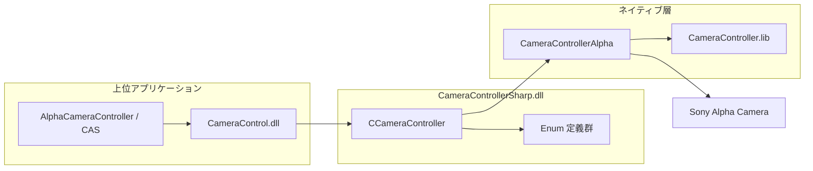
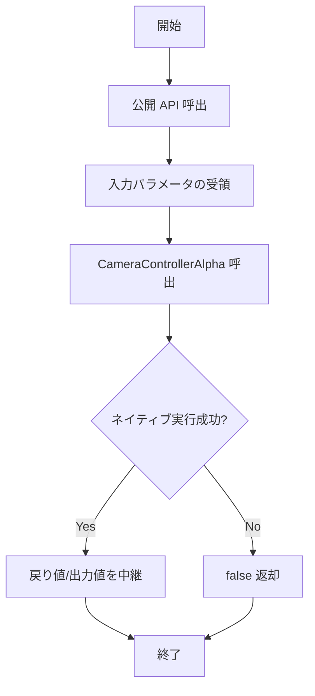
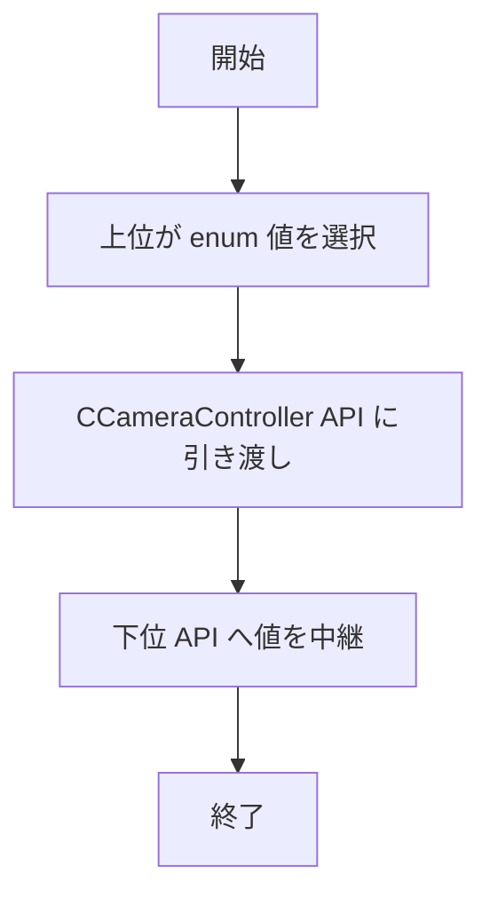
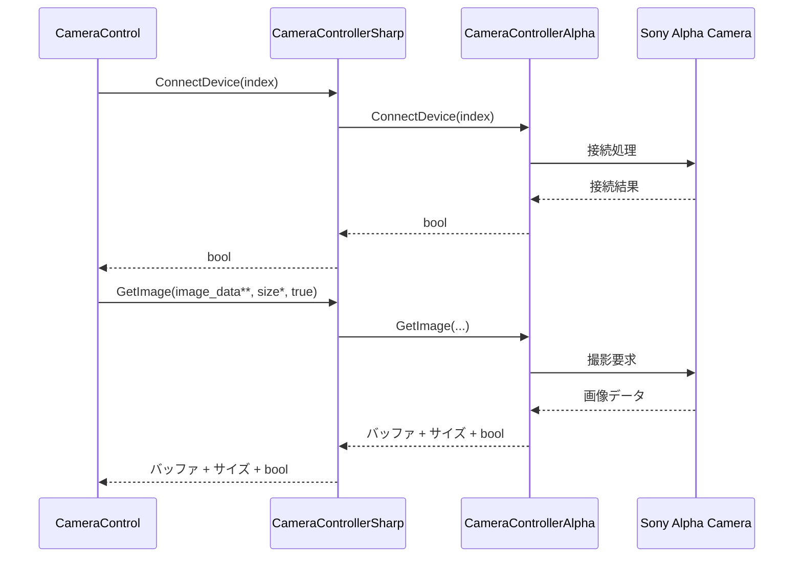

# CameraControllerSharp 詳細設計書

| 項目 | 内容 |
|------|------|
| プロジェクト名 | ColorAlignmentSoftware |
| システム名 | CameraControllerSharp.dll |
| ドキュメント名 | 詳細設計書 |
| 作成日 | 2026/04/16 |
| 作成者 | システム分析チーム |
| バージョン | 0.1 |
| 関連資料 | CameraControllerSharp_要件定義書.md, CameraControllerSharp_基本設計書.md |

---

## 1. モジュール一覧

### 1-1. モジュール一覧表

| No. | モジュールID | モジュール名 | 分類 | 主責務 | 配置先 | 備考 |
|-----|--------------|--------------|------|--------|--------|------|
| 1 | MDL-CCS-001 | CCameraController | 外部IF | .NET 呼び出しを CameraControllerAlpha へ中継し、デバイス管理・撮影・設定・AF制御 API を提供する | CameraControllerSharp.dll | C++/CLI 管理クラス |
| 2 | MDL-CCS-002 | Enum 定義群 | ビジネスロジック | 圧縮形式、画像サイズ、ボタン状態などの定数集合を提供する | CameraControllerSharp.dll | マネージド公開 enum |

### 1-2. モジュール命名規約

| 項目 | 規約 |
|------|------|
| 命名方針 | 公開クラスは PascalCase、メソッドは PascalCase、列挙型は機能名 + Value / Status |
| ID採番規則 | MDL-CCS-001 から連番 |
| 分類コード | BIZ:ビジネスロジック, IF:外部IF |

---

## 2. モジュール配置図（モジュールの物理配置設計）

### 2-1. 物理配置図

### 2-2. 配置一覧

| 配置区分 | 配置先パス/ノード | 配置モジュール | 配置理由 |
|----------|-------------------|----------------|----------|
| 実行モジュール | CameraControllerSharp.dll | CCameraController, Enum定義群 | 上位 C# ライブラリから直接参照されるため |
| ネイティブ依存 | CameraController.lib（リンク対象） | CameraControllerAlpha 実装 | 実機制御を既存資産で再利用するため |
| 実機接続 | Sony Alpha Camera | デバイス実体 | 撮影・ライブビュー・設定反映先 |

---

## 3. モジュール仕様オーバービュー

### 3-1. モジュール分類別サマリ

| 分類 | 対象モジュール | 処理概要 | 主なインタフェース |
|------|----------------|----------|--------------------|
| 外部IF | CCameraController | デバイス列挙、接続/切断、画像取得、設定取得/反映、フォーカス/AFエリア制御を提供する | EnumerateDevices, ConnectDevice, GetImage, SetFNumber, SetFocusArea |
| ビジネスロジック | Enum 定義群 | カメラ制御パラメータ値を型安全に表現する | CompressionSetting, ImageSizeValue, ButtonStatus |

### 3-2. モジュール別オーバービュー

| モジュールID | モジュール名 | 分類 | 処理概要 | インタフェース名 | 引数 | 返り値 |
|--------------|--------------|------|----------|------------------|------|--------|
| MDL-CCS-001 | CCameraController | 外部IF | デバイス管理 API | EnumerateDevices | なし | int |
| MDL-CCS-001 | CCameraController | 外部IF | デバイス管理 API | GetDeviceName | uint device_idx, wchar_t* device_name, uint length | bool |
| MDL-CCS-001 | CCameraController | 外部IF | 接続 API | ConnectDevice | uint device_idx / wchar_t* device_name | bool |
| MDL-CCS-001 | CCameraController | 外部IF | 切断 API | DisconnectDevice | なし | bool |
| MDL-CCS-001 | CCameraController | 外部IF | 画像取得 API | GetImage / GetLiveImage | unsigned char** image_data, unsigned int* image_data_size, [bool is_wait] | bool |
| MDL-CCS-001 | CCameraController | 外部IF | 撮影設定 API | Set/GetImageSize, Set/GetCompressionSetting, Set/GetFNumber, Set/GetShutterSpeed, Set/GetISO, Set/GetWhiteBalance | enum / 文字列ポインタ | bool |
| MDL-CCS-001 | CCameraController | 外部IF | フォーカス API | Set/GetFocusMode, SetAfMfHold, ChangeNearFar, AutoFocusSingle, Set/GetFocusArea, Set/GetAfAreaPosition | 文字列ポインタ / enum / 座標 | bool |
| MDL-CCS-002 | Enum 定義群 | ビジネスロジック | 制御値の公開 | CompressionSetting, ImageSizeValue, ButtonStatus | - | enum |

---

## 4. モジュール仕様（詳細）

### 4-1. MDL-CCS-001: CCameraController

#### 4-1-1. 基本情報

| 項目 | 内容 |
|------|------|
| モジュールID | MDL-CCS-001 |
| モジュール名 | CCameraController |
| 分類 | 外部IF |
| 呼出元 | CameraControl.dll |
| 呼出先 | CameraControllerAlpha（ネイティブ） |
| トランザクション | 無 |
| 再実行性 | 可（本 DLL は失敗を bool 返却し、リトライ判断を上位へ委譲） |

#### 4-1-2. 処理フロー

#### 4-1-3. 処理手順

| 手順No. | 処理内容 | 入力 | 出力 | 操作対象 | 備考 |
|---------|----------|------|------|----------|------|
| 1 | 呼出メソッドの引数受領 | 上位引数 | ネイティブ引数 | CCameraController | 文字列はポインタで受領 |
| 2 | ネイティブ API 呼出 | メソッド別パラメータ | 実行成否 | CameraControllerAlpha | 1メソッド1委譲 |
| 3 | 結果中継 | ネイティブ戻り値 | bool/出力ポインタ | 上位呼出元 | 追加変換は最小限 |

#### 4-1-4. 操作対象仕様（画面、テーブル、ファイル）

| 対象種別 | 対象名 | 操作内容 | 操作タイミング | 主キー/識別子 | 備考 |
|----------|--------|----------|----------------|---------------|------|
| 外部IF | CameraControllerAlpha | メソッド呼出 | 各 API 呼出時 | メソッド名 + 引数 | 実体制御は下位が担当 |
| デバイス | Sony Alpha Camera | 接続、撮影、ライブビュー、設定変更 | 下位 API 実行時 | device_idx または device_name | USB 接続 |
| メモリ | 画像バッファ | 画像データ受け渡し | GetImage / GetLiveImage | image_data ポインタ | 解放責務は呼出側契約に従う |

#### 4-1-5. インタフェース仕様（引数・返り値）

| 項目 | 内容 |
|------|------|
| インタフェース名 | CCameraController 公開メソッド群 |
| 概要 | デバイス制御、撮影、設定、フォーカス制御 API を提供 |
| シグネチャ | 代表: bool GetImage(unsigned char** image_data, unsigned int* image_data_size, bool is_wait) |
| 呼出条件 | 事前に ConnectDevice 成功済みであること（デバイス依存 API） |

引数一覧（代表）

| No. | 引数名 | 型 | 必須 | 説明 | バリデーション |
|-----|--------|----|------|------|----------------|
| 1 | device_idx | unsigned int | 条件付き必須 | 接続対象デバイス番号 | EnumerateDevices の範囲内 |
| 2 | device_name | wchar_t* | 条件付き必須 | 接続対象デバイス名 | null終端文字列 |
| 3 | image_data | unsigned char** | 画像取得時必須 | 画像バッファ出力先 | null でないこと |
| 4 | image_data_size | unsigned int* | 画像取得時必須 | バッファサイズ出力先 | null でないこと |
| 5 | is_wait | bool | GetImage時必須 | 撮影待機有無 | true 運用を推奨 |
| 6 | value | sbyte* / enum / ushort | メソッド依存 | 設定値や座標 | カメラ許容値 |

返り値一覧

| No. | 項目名 | 型 | 説明 | 備考 |
|-----|--------|----|------|------|
| 1 | result | bool | true: 成功 / false: 失敗 | 失敗理由の詳細は下位依存 |
| 2 | count | int | 列挙デバイス数 | EnumerateDevices で使用 |

#### 4-1-6. 例外処理仕様

| No. | 例外/エラー条件 | 検知方法 | 対応内容 | ユーザー通知 | ログ出力 | リトライ/継続可否 |
|-----|------------------|----------|----------|--------------|----------|------------------|
| 1 | デバイス未接続で撮影系 API 呼出 | 下位戻り値 false | false 返却 | 呼出元で通知 | 本 DLL ではなし | 可（上位判断） |
| 2 | 不正な設定値（F値、SS、ISO、WB、AFエリア） | 下位戻り値 false | false 返却 | 呼出元で通知 | 本 DLL ではなし | 可（値修正後） |
| 3 | 画像取得失敗 | 下位戻り値 false | false 返却 | 呼出元で通知 | 本 DLL ではなし | 可（上位リトライ） |
| 4 | 接続/切断失敗 | 下位戻り値 false | false 返却 | 呼出元で通知 | 本 DLL ではなし | 可 |
| 5 | 下位ライブラリ内部エラー | 下位戻り値 false または例外相当 | false 返却 | 呼出元で通知 | 本 DLL ではなし | 条件付き可 |

#### 4-1-7. ログ仕様

| ログ種別 | 出力条件 | 出力項目 | 保持期間 | マスキング方針 |
|----------|----------|----------|----------|----------------|
| 該当なし | 専用ログ実装なし。成否は戻り値で上位通知 | - | - | - |

### 4-2. MDL-CCS-002: Enum 定義群

#### 4-2-1. 基本情報

| 項目 | 内容 |
|------|------|
| モジュールID | MDL-CCS-002 |
| モジュール名 | Enum 定義群 |
| 分類 | ビジネスロジック |
| 呼出元 | CameraControl.dll |
| 呼出先 | CCameraController API 引数 |
| トランザクション | 無 |
| 再実行性 | 常時可 |

#### 4-2-2. 処理フロー

#### 4-2-3. 処理手順

| 手順No. | 処理内容 | 入力 | 出力 | 操作対象 | 備考 |
|---------|----------|------|------|----------|------|
| 1 | 列挙値定義 | enum値 | 型安全な定数 | CameraControllerSharp.dll | 実行時処理なし |
| 2 | APIへ受け渡し | enum値 | ネイティブ受け渡し値 | CCameraController | キャストのみ |

#### 4-2-4. 操作対象仕様（画面、テーブル、ファイル）

| 対象種別 | 対象名 | 操作内容 | 操作タイミング | 主キー/識別子 | 備考 |
|----------|--------|----------|----------------|---------------|------|
| 定義体 | CompressionSetting / ImageSizeValue / ButtonStatus | 定数参照 | API 呼出時 | enum メンバ名 | ビルド時固定 |

#### 4-2-5. インタフェース仕様（引数・返り値）

| 項目 | 内容 |
|------|------|
| インタフェース名 | enum 定義参照 |
| 概要 | カメラ制御値を型安全に指定 |
| シグネチャ | 例: bool SetImageSize(ImageSizeValue image_size) |
| 呼出条件 | CameraControl から CCameraController 呼出時 |

引数一覧

| No. | 引数名 | 型 | 必須 | 説明 | バリデーション |
|-----|--------|----|------|------|----------------|
| 1 | compression | CompressionSetting | Y | 圧縮形式指定 | 定義済み値のみ |
| 2 | image_size | ImageSizeValue | Y | 画像サイズ指定 | 定義済み値のみ |
| 3 | button_status | ButtonStatus | 条件付き必須 | AF/MF ホールド操作 | 定義済み値のみ |

返り値一覧

| No. | 項目名 | 型 | 説明 | 備考 |
|-----|--------|----|------|------|
| 1 | なし | - | enum は戻り値を持たない | API 側で bool を返却 |

#### 4-2-6. 例外処理仕様

| No. | 例外/エラー条件 | 検知方法 | 対応内容 | ユーザー通知 | ログ出力 | リトライ/継続可否 |
|-----|------------------|----------|----------|--------------|----------|------------------|
| 1 | 定義外値を数値キャストで指定 | 下位 API 戻り値 false | false 返却 | 呼出元で通知 | 本 DLL ではなし | 可 |

#### 4-2-7. ログ仕様

| ログ種別 | 出力条件 | 出力項目 | 保持期間 | マスキング方針 |
|----------|----------|----------|----------|----------------|
| 該当なし | 専用ログ実装なし | - | - | - |

---

## 5. コード仕様

### 5-1. コード一覧

| コード名称 | コード値 | 内容説明 | 利用箇所 | 備考 |
|------------|----------|----------|----------|------|
| CompressionSetting.STD | 0x02 | JPEG 標準画質 | SetCompressionSetting | saveImage では jpg 出力 |
| CompressionSetting.FINE | 0x03 | JPEG 高画質 | SetCompressionSetting | saveImage では jpg 出力 |
| CompressionSetting.XFINE | 0x04 | JPEG 最高画質 | SetCompressionSetting | saveImage では jpg 出力 |
| CompressionSetting.RAW | 0x10 | RAW | SetCompressionSetting | saveImage では arw 出力 |
| ImageSizeValue.M | 実装定義値 | Mサイズ画像 | SetImageSize | 値は下位 SDK 定義依存 |
| ImageSizeValue.L | 実装定義値 | Lサイズ画像 | SetImageSize | 値は下位 SDK 定義依存 |
| ImageSizeValue.S | 実装定義値 | Sサイズ画像 | SetImageSize | 値は下位 SDK 定義依存 |
| ButtonStatus.PUSH | 1 | ボタン押下 | SetAfMfHold / ChangeNearFar | AF/MF操作 |
| ButtonStatus.RELEASE | 0 | ボタン解放 | SetAfMfHold / ChangeNearFar | AF/MF操作 |

### 5-2. コード定義ルール

| 項目 | ルール |
|------|--------|
| コード値体系 | 圧縮形式は16進定義、ボタン状態は 0/1 |
| 重複禁止範囲 | 同一 enum 内で重複禁止 |
| 廃止時の扱い | 後方互換維持のため enum 値は削除せず非推奨化で対応 |

---

## 6. メッセージ仕様

### 6-1. メッセージ一覧

| メッセージ名称 | メッセージID | 種別 | 表示メッセージ | 内容説明 | 対応アクション |
|----------------|--------------|------|----------------|----------|----------------|
| 該当なし | - | - | - | 本 DLL は UI メッセージを直接表示しない | 上位アプリで例外/戻り値を文言化 |

### 6-2. メッセージ運用ルール

| 項目 | ルール |
|------|--------|
| ID採番 | 本 DLL では採番しない |
| 多言語対応 | 上位アプリ側ポリシーに従う |
| プレースホルダ | 上位アプリ側で定義 |

---

## 7. 関連システムインタフェース仕様

### 7-1. インタフェース一覧

| IF ID | I/O | インタフェースシステム名 | インタフェースファイル名 | インタフェースタイミング | インタフェース方法 | インタフェースエラー処理方法 | インタフェース処理のリラン定義 | インタフェース処理のロギングインタフェース |
|------|-----|--------------------------|--------------------------|--------------------------|--------------------|------------------------------|--------------------------------|------------------------------------------|
| IF-CCS-001 | IN | CameraControl.dll | CameraControllerSharp.dll | API 呼出都度 | .NET DLL 呼出 | bool false 返却 | 上位で実施 | 本 DLL では専用ログなし |
| IF-CCS-002 | OUT | CameraControllerAlpha | CameraController.lib (静的リンク) | API 呼出都度 | ネイティブメソッド呼出 | bool false 中継 | 上位で実施 | 本 DLL では専用ログなし |

### 7-2. インタフェースデータ項目定義

| IF ID | データ項目名 | データ項目の説明 | データ項目の位置 | 書式 | 必須 | エラー時の代替値 | 備考 |
|------|--------------|------------------|------------------|------|------|------------------|------|
| IF-CCS-001 | device_idx | 接続対象デバイス番号 | ConnectDevice 引数 | uint | 条件付きY | なし | name 指定と排他 |
| IF-CCS-001 | device_name | 接続対象デバイス名 | ConnectDevice 引数 | wchar_t* | 条件付きY | なし | idx 指定と排他 |
| IF-CCS-001 | image_data | 画像バッファ | GetImage/GetLiveImage 出力 | unsigned char** | Y | null | 上位で解放 |
| IF-CCS-001 | image_data_size | 画像サイズ(byte) | GetImage/GetLiveImage 出力 | unsigned int* | Y | 0 | |
| IF-CCS-001 | control_value | 設定値文字列 | SetFNumber 等引数 | sbyte* | 条件付きY | なし | ASCII 文字列 |
| IF-CCS-002 | result | 実行成否 | 各 API 戻り値 | bool | Y | false | |

### 7-3. インタフェース処理シーケンス

---

## 8. メソッド仕様

以下、公開メソッドを個別に記載する。すべてのメソッドは CameraControllerAlpha への委譲処理であり、戻り値 bool は下位 API の成否をそのまま中継する。

---

### 8-1. EnumerateDevices

| 項目 | 内容 |
|------|------|
| シグネチャ | int EnumerateDevices() |
| 概要 | 接続可能なカメラデバイス数を取得する |
| 入力 | なし |
| 出力 | デバイス数 |
| 事前条件 | なし |

返り値

| 型 | 説明 |
|----|------|
| int | 列挙結果件数（0 はデバイス未検出または取得失敗を含む） |

処理概要

| 手順 | 内容 |
|------|------|
| 1 | CameraControllerAlpha.EnumerateDevices を呼び出す |
| 2 | 取得件数をそのまま返却する |

---

### 8-2. GetDeviceName

| 項目 | 内容 |
|------|------|
| シグネチャ | bool GetDeviceName(uint device_idx, wchar_t* device_name, uint length) |
| 概要 | 指定したデバイス index の名称を受信バッファに格納する |
| 事前条件 | 0 <= device_idx < EnumerateDevices の結果 |

引数

| No. | 引数名 | 型 | 必須 | 説明 | バリデーション |
|-----|--------|----|------|------|----------------|
| 1 | device_idx | uint | Y | デバイス番号 | 列挙範囲内 |
| 2 | device_name | wchar_t* | Y | 受信バッファ先頭ポインタ | null でないこと |
| 3 | length | uint | Y | バッファ長 | 取得名称長以上 |

返り値

| 型 | 説明 |
|----|------|
| bool | true: 取得成功, false: 取得失敗 |

---

### 8-3. ConnectDevice（index 指定）

| 項目 | 内容 |
|------|------|
| シグネチャ | bool ConnectDevice(uint device_idx) |
| 概要 | デバイス番号指定でカメラへ接続する |
| 事前条件 | 対象 index が有効 |

引数

| No. | 引数名 | 型 | 必須 | 説明 | バリデーション |
|-----|--------|----|------|------|----------------|
| 1 | device_idx | uint | Y | 接続対象デバイス番号 | 列挙範囲内 |

返り値

| 型 | 説明 |
|----|------|
| bool | true: 接続成功, false: 接続失敗 |

---

### 8-4. ConnectDevice（name 指定）

| 項目 | 内容 |
|------|------|
| シグネチャ | bool ConnectDevice(wchar_t* device_name) |
| 概要 | デバイス名指定でカメラへ接続する |
| 事前条件 | device_name が有効な null 終端文字列 |

引数

| No. | 引数名 | 型 | 必須 | 説明 | バリデーション |
|-----|--------|----|------|------|----------------|
| 1 | device_name | wchar_t* | Y | 接続対象デバイス名 | null でないこと |

返り値

| 型 | 説明 |
|----|------|
| bool | true: 接続成功, false: 接続失敗 |

---

### 8-5. DisconnectDevice

| 項目 | 内容 |
|------|------|
| シグネチャ | bool DisconnectDevice() |
| 概要 | 現在接続中のデバイスを切断する |
| 事前条件 | 接続済みであること |

引数: なし

返り値

| 型 | 説明 |
|----|------|
| bool | true: 切断成功, false: 切断失敗 |

---

### 8-6. GetImage

| 項目 | 内容 |
|------|------|
| シグネチャ | bool GetImage(unsigned char** image_data, unsigned int* image_data_size, bool is_wait) |
| 概要 | 静止画を取得し、画像バッファとサイズを返す |
| 事前条件 | 接続済みであること |

引数

| No. | 引数名 | 型 | 必須 | 説明 | バリデーション |
|-----|--------|----|------|------|----------------|
| 1 | image_data | unsigned char** | Y | 画像バッファ出力先 | null でないこと |
| 2 | image_data_size | unsigned int* | Y | 画像サイズ出力先 | null でないこと |
| 3 | is_wait | bool | Y | 撮影待機制御 | 運用上 true 推奨 |

返り値

| 型 | 説明 |
|----|------|
| bool | true: 取得成功, false: 取得失敗 |

処理概要

| 手順 | 内容 |
|------|------|
| 1 | 下位 GetImage API を呼び出す |
| 2 | 画像バッファアドレスとサイズを出力引数へ設定する |
| 3 | 成否を bool で返却する |

---

### 8-7. GetLiveImage

| 項目 | 内容 |
|------|------|
| シグネチャ | bool GetLiveImage(unsigned char** image_data, unsigned int* image_data_size) |
| 概要 | ライブビュー画像を取得し、画像バッファとサイズを返す |
| 事前条件 | 接続済みであること |

引数

| No. | 引数名 | 型 | 必須 | 説明 | バリデーション |
|-----|--------|----|------|------|----------------|
| 1 | image_data | unsigned char** | Y | 画像バッファ出力先 | null でないこと |
| 2 | image_data_size | unsigned int* | Y | 画像サイズ出力先 | null でないこと |

返り値

| 型 | 説明 |
|----|------|
| bool | true: 取得成功, false: 取得失敗 |

---

### 8-8. SetImageSize / GetImageSize

| 項目 | 内容 |
|------|------|
| シグネチャ | bool SetImageSize(ImageSizeValue image_size) / bool GetImageSize(unsigned int* image_size) |
| 概要 | 撮影画像サイズの設定と取得を行う |
| 事前条件 | 接続済みであること |

引数

| No. | メソッド | 引数名 | 型 | 必須 | 説明 |
|-----|----------|--------|----|------|------|
| 1 | SetImageSize | image_size | ImageSizeValue | Y | 設定する画像サイズ |
| 2 | GetImageSize | image_size | unsigned int* | Y | 現在値の出力先 |

返り値: いずれも bool（true: 成功, false: 失敗）

---

### 8-9. SetCompressionSetting / GetCompressionSetting

| 項目 | 内容 |
|------|------|
| シグネチャ | bool SetCompressionSetting(CompressionSetting compression_setting) / bool GetCompressionSetting(unsigned int* compression_setting) |
| 概要 | 圧縮形式（RAW/JPEG種別）の設定と取得を行う |
| 事前条件 | 接続済みであること |

引数

| No. | メソッド | 引数名 | 型 | 必須 | 説明 |
|-----|----------|--------|----|------|------|
| 1 | SetCompressionSetting | compression_setting | CompressionSetting | Y | 設定する圧縮形式 |
| 2 | GetCompressionSetting | compression_setting | unsigned int* | Y | 現在値の出力先 |

返り値: いずれも bool（true: 成功, false: 失敗）

---

### 8-10. SetFNumber / GetFNumber

| 項目 | 内容 |
|------|------|
| シグネチャ | bool SetFNumber(sbyte* f_number) / bool GetFNumber(sbyte* f_number, uint length) |
| 概要 | F値（絞り値）を設定・取得する |
| 事前条件 | 接続済みであること |

引数

| No. | メソッド | 引数名 | 型 | 必須 | 説明 |
|-----|----------|--------|----|------|------|
| 1 | SetFNumber | f_number | sbyte* | Y | 設定値文字列 |
| 2 | GetFNumber | f_number | sbyte* | Y | 取得文字列の出力先 |
| 3 | GetFNumber | length | uint | Y | 受信バッファ長 |

返り値: いずれも bool（true: 成功, false: 失敗）

---

### 8-11. SetShutterSpeed / GetShutterSpeed

| 項目 | 内容 |
|------|------|
| シグネチャ | bool SetShutterSpeed(sbyte* shutter_speed) / bool GetShutterSpeed(sbyte* shutter_speed, uint length) |
| 概要 | シャッタースピードを設定・取得する |
| 事前条件 | 接続済みであること |

引数

| No. | メソッド | 引数名 | 型 | 必須 | 説明 |
|-----|----------|--------|----|------|------|
| 1 | SetShutterSpeed | shutter_speed | sbyte* | Y | 設定値文字列 |
| 2 | GetShutterSpeed | shutter_speed | sbyte* | Y | 取得文字列の出力先 |
| 3 | GetShutterSpeed | length | uint | Y | 受信バッファ長 |

返り値: いずれも bool（true: 成功, false: 失敗）

---

### 8-12. SetISO / GetISO

| 項目 | 内容 |
|------|------|
| シグネチャ | bool SetISO(sbyte* iso) / bool GetISO(sbyte* iso, uint length) |
| 概要 | ISO感度を設定・取得する |
| 事前条件 | 接続済みであること |

引数

| No. | メソッド | 引数名 | 型 | 必須 | 説明 |
|-----|----------|--------|----|------|------|
| 1 | SetISO | iso | sbyte* | Y | 設定値文字列 |
| 2 | GetISO | iso | sbyte* | Y | 取得文字列の出力先 |
| 3 | GetISO | length | uint | Y | 受信バッファ長 |

返り値: いずれも bool（true: 成功, false: 失敗）

---

### 8-13. SetWhiteBalance / GetWhiteBalance

| 項目 | 内容 |
|------|------|
| シグネチャ | bool SetWhiteBalance(sbyte* wb) / bool GetWhiteBalance(sbyte* wb, uint length) |
| 概要 | ホワイトバランスを設定・取得する |
| 事前条件 | 接続済みであること |

引数

| No. | メソッド | 引数名 | 型 | 必須 | 説明 |
|-----|----------|--------|----|------|------|
| 1 | SetWhiteBalance | wb | sbyte* | Y | 設定値文字列 |
| 2 | GetWhiteBalance | wb | sbyte* | Y | 取得文字列の出力先 |
| 3 | GetWhiteBalance | length | uint | Y | 受信バッファ長 |

返り値: いずれも bool（true: 成功, false: 失敗）

---

### 8-14. SetFocusMode / GetFocusMode

| 項目 | 内容 |
|------|------|
| シグネチャ | bool SetFocusMode(sbyte* mode) / bool GetFocusMode(sbyte* mode, uint length) |
| 概要 | フォーカスモードを設定・取得する |
| 事前条件 | 接続済みであること |

引数

| No. | メソッド | 引数名 | 型 | 必須 | 説明 |
|-----|----------|--------|----|------|------|
| 1 | SetFocusMode | mode | sbyte* | Y | 設定するフォーカスモード文字列 |
| 2 | GetFocusMode | mode | sbyte* | Y | 取得文字列の出力先 |
| 3 | GetFocusMode | length | uint | Y | 受信バッファ長 |

返り値: いずれも bool（true: 成功, false: 失敗）

---

### 8-15. SetAfMfHold

| 項目 | 内容 |
|------|------|
| シグネチャ | bool SetAfMfHold(ButtonStatus status) |
| 概要 | AF/MFホールドボタン押下状態を制御する |
| 事前条件 | 接続済みであること |

引数

| No. | 引数名 | 型 | 必須 | 説明 | バリデーション |
|-----|--------|----|------|------|----------------|
| 1 | status | ButtonStatus | Y | PUSH または RELEASE | enum 定義値のみ |

返り値: bool（true: 成功, false: 失敗）

---

### 8-16. ChangeNearFar

| 項目 | 内容 |
|------|------|
| シグネチャ | bool ChangeNearFar(ButtonStatus near_status, ButtonStatus far_status) |
| 概要 | 近側/遠側フォーカス移動操作の押下状態を同時に制御する |
| 事前条件 | 接続済みであること |

引数

| No. | 引数名 | 型 | 必須 | 説明 |
|-----|--------|----|------|------|
| 1 | near_status | ButtonStatus | Y | Near 操作の押下状態 |
| 2 | far_status | ButtonStatus | Y | Far 操作の押下状態 |

返り値: bool（true: 成功, false: 失敗）

---

### 8-17. AutoFocusSingle

| 項目 | 内容 |
|------|------|
| シグネチャ | bool AutoFocusSingle() |
| 概要 | 単発オートフォーカスを実行する |
| 事前条件 | 接続済みかつ AF 実行可能モードであること |

引数: なし

返り値: bool（true: 成功, false: 失敗）

処理概要

| 手順 | 内容 |
|------|------|
| 1 | CameraControllerAlpha.AutoFocusSingle を呼び出す |
| 2 | 実行成否を bool で返却する |

---

### 8-18. SetFocusArea / GetFocusArea

| 項目 | 内容 |
|------|------|
| シグネチャ | bool SetFocusArea(sbyte* focus_area_type) / bool GetFocusArea(sbyte* focus_area_type, uint length) |
| 概要 | AFエリア種別を設定・取得する |
| 事前条件 | 接続済みであること |

引数

| No. | メソッド | 引数名 | 型 | 必須 | 説明 |
|-----|----------|--------|----|------|------|
| 1 | SetFocusArea | focus_area_type | sbyte* | Y | AFエリア種別文字列 |
| 2 | GetFocusArea | focus_area_type | sbyte* | Y | 取得文字列の出力先 |
| 3 | GetFocusArea | length | uint | Y | 受信バッファ長 |

返り値: いずれも bool（true: 成功, false: 失敗）

---

### 8-19. SetAfAreaPosition / GetAfAreaPosition

| 項目 | 内容 |
|------|------|
| シグネチャ | bool SetAfAreaPosition(ushort x, ushort y) / bool GetAfAreaPosition(ushort* x, ushort* y) |
| 概要 | AFエリア座標を設定・取得する |
| 事前条件 | 接続済みであること |

引数

| No. | メソッド | 引数名 | 型 | 必須 | 説明 |
|-----|----------|--------|----|------|------|
| 1 | SetAfAreaPosition | x | ushort | Y | AFエリア X 座標 |
| 2 | SetAfAreaPosition | y | ushort | Y | AFエリア Y 座標 |
| 3 | GetAfAreaPosition | x | ushort* | Y | X 座標出力先 |
| 4 | GetAfAreaPosition | y | ushort* | Y | Y 座標出力先 |

返り値: いずれも bool（true: 成功, false: 失敗）

---

## 9. 変更履歴

| 版数 | 日付 | 変更者 | 変更内容 |
|------|------|--------|----------|
| 0.1 | 2026/04/16 | システム分析チーム | 新規作成 |
