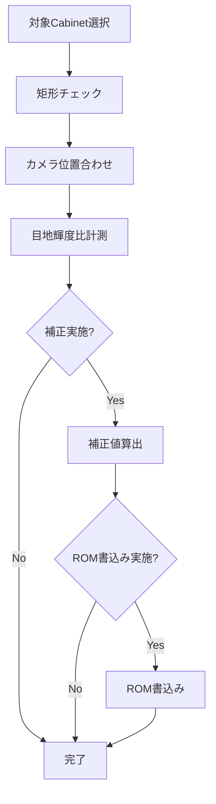
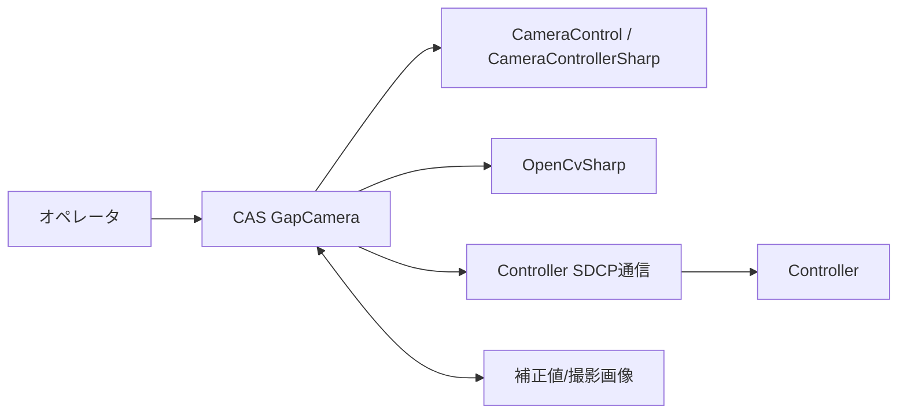

# 要件定義書

| 項目 | 内容 |
|------|------|
| プロジェクト名 | ColorAlignmentSoftware（CAS） |
| 作成日 | 2026/04/16 |
| 作成者 | システム分析チーム |
| バージョン | 1.0 |

---

## 1. ビジネス要件

### 1-1. To-Be業務プロセス概要

目地補正（カメラ）機能は、LDSの目地補正作業における「計測」「補正値算出」「ROM書込み」を一連で実行し、手作業調整を最小化することを目的とする。

以下をシステム化し、再現性と作業効率を向上させる。

- 対象Cabinetの矩形チェックと処理対象確定
- カメラ位置合わせ
- 内蔵パターンを表示したCabinetの撮影
- 撮影画像から目地輝度比を計測し、計測結果に基づいて目地補正値を算出
- 補正値のController ROM書込み
- 補正値バックアップ/リストア

---

### 1-2. 業務内容、業務特性（ルール、制約）

| 業務名 | 業務内容 | ルール・制約 |
|--------|----------|-------------|
| 位置合わせ | カメラ位置合わせを実施し測定可能状態を作る | 対象Cabinetは選択済みかつ矩形であること |
| 目地輝度比計測 | 内蔵パターンを表示したCabinetの撮影画像を取得し、目地輝度比を算出する | 計測中は他操作を抑止し、進捗表示を行う |
| 目地輝度補正 | 目地輝度比計測結果を用いて補正計算用データを生成し、Controllerに転送する | 計測完了後に実施し、補正回数上限、評価有無の設定値に従う |
| ROM書込み | 補正値をControllerへ反映し再構成を実施 | 書込み時はPanel OFF/ONとReconfigを実行 |
| バックアップ/リストア | 補正値をXMLへ保存・復元 | ファイル選択UI経由、失敗時はエラー通知 |

---

### 1-3. 組織構成、要員、設備

#### 組織構成

- CASアプリ開発担当
- 画像解析・補正ロジック担当
- 設備評価（カメラ/Controller）担当

#### 要員スキル・規模

- C#（WPF、非同期処理）
- 画像解析（OpenCvSharp）
- カメラ制御（CameraControl/CameraControllerSharp）
- Controller通信（SDCPコマンド運用）

#### 必要設備

- Windows PC（CAS実行環境）
- Sony Alphaカメラ（例: ILCE-6400）
- 対応レンズ
- Controller接続ネットワーク
- LDS実機（Cabinet）

---

### 1-4. 業務KPIとその目標値

| KPI | 現状値 | 目標値 | 達成期限 |
|-----|--------|--------|---------|
| 補正後の目地輝度比 | - | ±1.5%以下 | 運用開始時 |
| 補正実行成功率 | - | 99.0%以上 | 運用開始時 |
| 補正の処理時間 | - | 30分以内 | 運用開始時 4K2Kサイズ |

---

### 1-5. 概要業務フロー

---

### 1-6. システム化の対象となる業務

| 対象業務 | 実現手段 | 備考 |
|----------|----------|------|
| 目地輝度比計測 | `btnGapCamMeasStart_Click` から `measureGapAsync` 実行 | 進捗・残時間表示あり |
| 目地輝度補正 | `btnGapCamMeasStart_Click` による計測完了後、`btnGapCamAdjStart_Click` から `adjustGapRegAsync` 実行 | 計測結果が前提。進捗・残時間表示・補正回数上限設定あり |
| ROM書込み | `btnGapCamRomStart_Click` / `romSaveAsync` | ReconfigとPanel ON/OFFを伴う |
| 補正値バックアップ | `btnGapCamBackup_Click` / `backupGapRegAsync` | XML保存 |
| 補正値リストア | `btnGapCamRestore_Click` / `restoreGapRegAsync` | 通常/一括書込みの2系統 |

---

### 1-7. ビジネス制約

| 制約種別 | 内容 |
|----------|------|
| スケジュール |  |
| コスト | 既存CAS基盤・既存カメラ制御ライブラリを前提に追加開発を最小化 |
| その他 | カメラ機種、LEDモデル、Controller構成差分に依存 |

---

### 1-8. その他の業務要件

- 作業中断（Abort）時に安全に復帰できること
- エラー時に作業者が対処可能なメッセージを表示すること
- 設定値（撮影条件、補正回数等）が運用で変更可能であること

---

## 2. システム要件（機能要件）

### 2-1. システム全体像

GapCamera機能はCAS内の目地補正サブシステムとして動作し、カメラ画像解析・Controller通信・補正値管理を統合する。

---

### 2-2. システム化対象領域（適用範囲）と影響範囲

#### 適用範囲

- 目地輝度比計測・進捗管理・中断
- 計測後の目地輝度補正・進捗管理・中断・結果評価
- ROM書込み（補正値反映）
- 補正値バックアップ/リストア
- カメラ位置合わせ支援と表示更新

#### 影響を受ける周辺システム

| システム名 | 影響内容 |
|-----------|---------|
| CameraControl/CameraControllerSharp | 撮影条件・撮影処理の仕様変更が目地輝度比計測に影響 |
| Controller（SDCP） | 補正値書込み、Reconfig、Panel制御の応答に依存 |
| CAS設定データ（Settings） | 測定レベル、撮影条件、待ち時間など運用値に影響 |

---

### 2-3. ソリューション方針

- UIイベント起点で非同期処理を実行し、長時間処理中は進捗ウィンドウで状態を可視化する
- 処理中は画面操作を制御（`tcMain.IsEnabled`）し、競合操作を防止する
- ROM書込みはController反映手順（Panel OFF → Write → Reconfig → Panel ON）を標準化する
- 例外時はメッセージ表示と後処理（Controller設定復帰、ThroughMode解除）を必須化する

---

### 2-4. システム機能要件

| No. | 機能名 | 機能概要 | 優先度 |
|-----|--------|----------|--------|
| 2-4-01 | 対象Cabinet妥当性確認 | 選択Cabinetの存在・矩形性を検証する | 高 |
| 2-4-02 | カメラ位置合わせ | 位置合わせモードの開始/停止、プレビュー更新 | 高 |
| 2-4-03 | 目地輝度比計測 | 目地輝度比の計測を実行し結果データを生成 | 高 |
| 2-4-04 | 目地補正 | 計測結果に基づく補正値算出と結果評価表示を実行 | 高 |
| 2-4-05 | ROM書込み | 補正値をControllerへ書込み反映 | 高 |
| 2-4-06 | 補正値バックアップ | 補正値をXMLファイルへ保存 | 中 |
| 2-4-07 | 補正値リストア | XMLから補正値を読み込み適用 | 高 |
| 2-4-08 | 一括書込みリストア | Cell一括コマンドで高速復元 | 中 |
| 2-4-09 | 進捗表示 | 残時間・処理ステップ・中断操作を提示 | 高 |
| 2-4-10 | エラー通知 | 失敗内容を画面通知し処理を安全終了 | 高 |

---

### 2-5. データ要件

| データ名 | 主要項目 | 関連データ | 備考 |
|----------|----------|-----------|------|
| GapCamCorrectionValue | Cabinet情報、CvUnit、AryCvCell | XMLバックアップ | 補正値の中核データ |
| GapCellCorrectValue | 目地補正値（Moduleあたり4辺×2ケ） | Module書込みコマンド | 初期値128基準 |
| UnitInfo | ControllerID、PortNo、UnitNo、座標 | allocInfo、dicController | 対象Cabinet識別 |
| 撮影画像 | MeasArea GapPos, Top, Right Gap_Before, Gap_Result  | 対象エリア 目地輝度比計測エリア 目地輝度比スイング | 測定フォルダに保存 |
| UserSetting | ThroughMode等作業前設定 | setUserSetting | 処理後復帰対象 |

---

### 2-6. 関連システムインタフェース要件

| 連携先システム | インタフェース種別 | データ内容 | 頻度 |
|--------------|-----------------|-----------|------|
| CameraControl / CameraControllerSharp | DLL呼び出し | 撮影条件、撮影画像、AF等 | 計測・位置合わせ時 |
| Controller | SDCPコマンド通信 | 補正値設定、書込み、内蔵パターン制御、Reconfig | 計測・補正・書込み時 |
| ファイルシステム | XML/画像ファイルI/O | バックアップ、リストア、計測ログ | 実行毎 |
| CAS UI | 画面イベント/表示更新 | 開始・中断・進捗・結果表示 | 常時 |

---

### 2-7. 要件定義不要機能

| 機能名 | 不要となる理由 |
|--------|--------------|
| DB永続化 | 本機能はファイル（XML/画像/ログ）を中心に運用するため |
| Web/API公開 | デスクトップアプリ内機能であり外部公開を想定しないため |
| 自動スケジューリング実行 | オペレータ操作起点の実行を前提とするため |

---

### 2-8. システム構築の制約

| 制約種別 | 内容 |
|----------|------|
| 実行基盤 | CAS（WPF、.NET Framework）上で動作すること |
| 通信制約 | Controller接続とSDCP応答が前提 |
| 機器制約 | 対応カメラ・レンズ・LEDモデルに依存 |
| 実装制約 | 条件付きコンパイル（例: `CameraPosition`, `BulkSetCorrectValue`）の影響を受ける |

---

## 3. システム要件（非機能要件）

### 3-1. 移行要件

| 移行対象 | 移行方法 | タイミング | 依存関係 |
|----------|----------|-----------|---------|
| 既存補正値 | XMLバックアップからリストア | 導入時/機器交換時 | Controller通信・対象Cabinet整合 |
| 設定値 | CAS設定ファイルを引継ぎ | バージョン更新時 | Camera/GapCam設定定義 |

---

### 3-2. 品質要件

| 品質特性 | 要件内容 | 指標・目標値 |
|----------|----------|------------|
| 信頼性 | 例外時に処理継続不能状態を残さない | 異常終了後の復帰成功率 100% |
| 保守性 | 補正・書込み・バックアップ処理を機能分離 | 主要処理の責務重複を最小化 |
| 正確性 | 補正値反映順序と対象Cabinet指定を保証 | 指定外Cabinet誤書込み 0件 |
| 機能性 | 計測/補正/書込み/復元を提供 | 必須機能網羅率 100% |
| 生産性 | 手動工程を削減し作業時間短縮 | 30分以内　※4K2Kサイズ |
| 操作性 | 進捗表示・エラー通知・中断操作を提供 | 作業者手順の標準化 |
| 経済性 | 既存CAS基盤・既存機器の活用 | 追加コストの最小化 |

---

### 3-3. 性能要件

| 項目 | 要件内容 | 目標値 |
|------|----------|--------|
| 応答時間 | UI操作に対する開始応答 | 1秒以内 |
| データ処理時間 | 計測・補正・書込み処理 | 対象Cabinet数に応じた進捗表示で管理 |
| トランザクション処理量 | 1実行あたりの対象Cabinet処理 | 設定対象範囲を完遂できること |
| 同時接続数 | カメラ/Controller接続 | 運用想定構成（単一カメラ、複数Controller対応） |

---

### 3-4. システムマネジメント要件

| 項目 | 要件内容 |
|------|----------|
| 監視 | 実行状況は進捗ウィンドウとログで追跡可能であること |
| バックアップ・リストア | 補正値XMLの保存・復元をGUIから実行可能であること |
| 障害対応 | 通信失敗・設定不正時は処理停止とメッセージ通知を行うこと |
| 自動化（RBA） | 本機能範囲では対象外（将来検討） |

---

### 3-5. インフラストラクチャー要件

| 項目 | 要件内容 |
|------|----------|
| サーバ | 不要（クライアントPC単体実行） |
| ネットワーク | Controller通信可能なLAN環境 |
| セキュリティ | 実行端末のアクセス制御と設定ファイル保護 |
| 可用性・冗長化 | 作業中断時は再実行可能であること |

---

## 4. 次工程以降への申し送り事項

| No. | 申し送り内容 | 担当者 | 期限 | 備考 |
|-----|------------|--------|------|------|

---

## 変更履歴

| バージョン | 変更日 | 変更者 | 変更内容 |
|-----------|--------|--------|----------|
| 1.0 | 2026/04/16 | システム分析チーム | 初版作成（GapCamera.cs中心） |
| 1.1 | 2026/04/16 | システム分析チーム | ROM書込み要件の記載を復元（業務特性/対象業務/適用範囲） |
