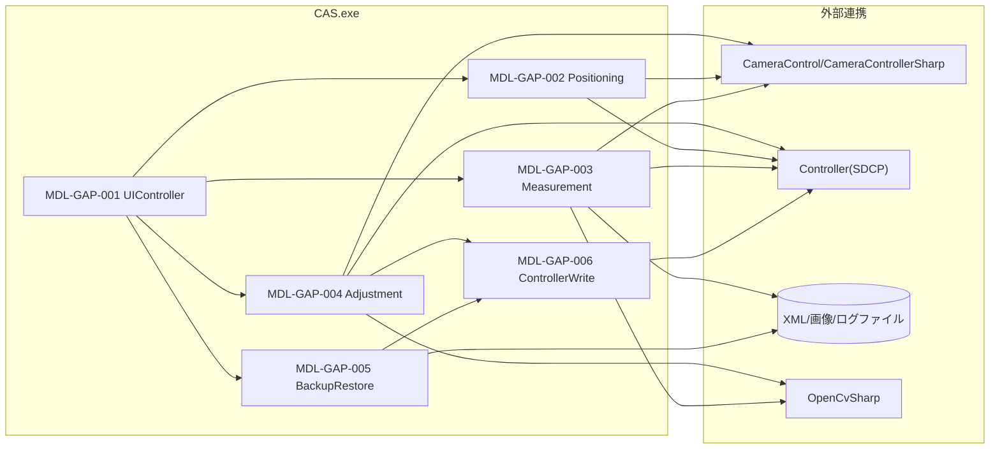
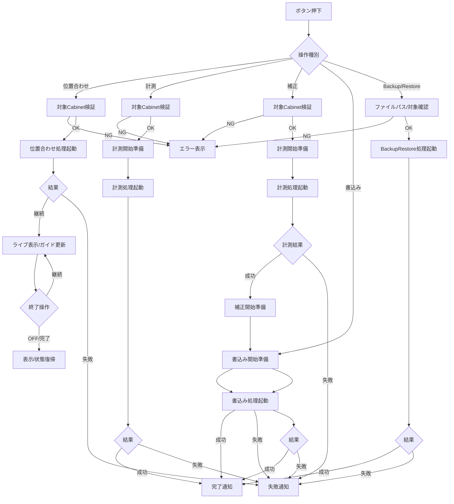
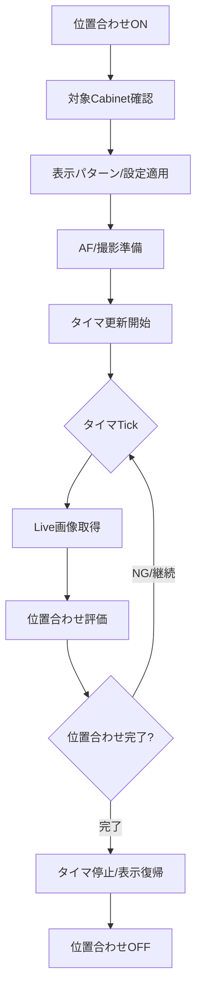
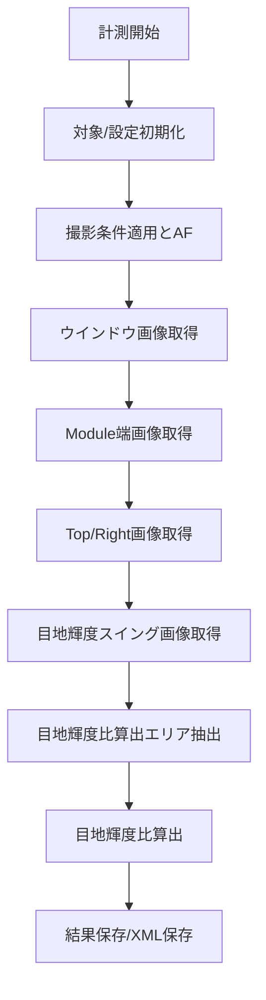
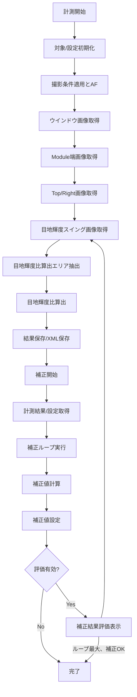
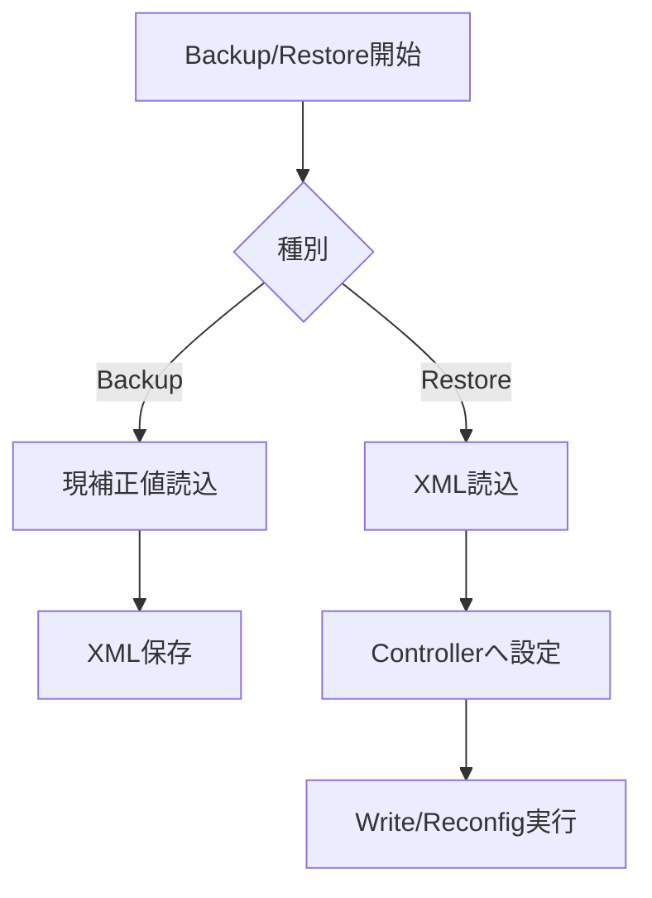
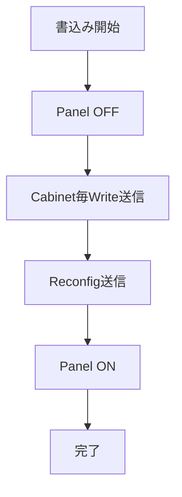
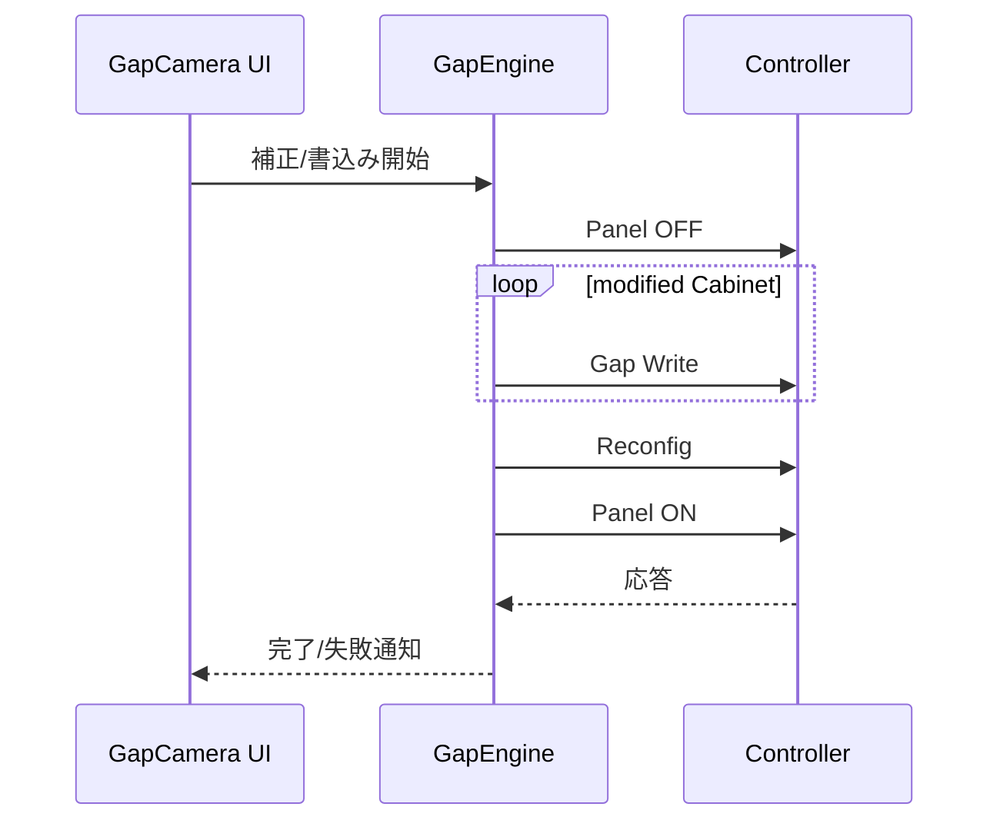
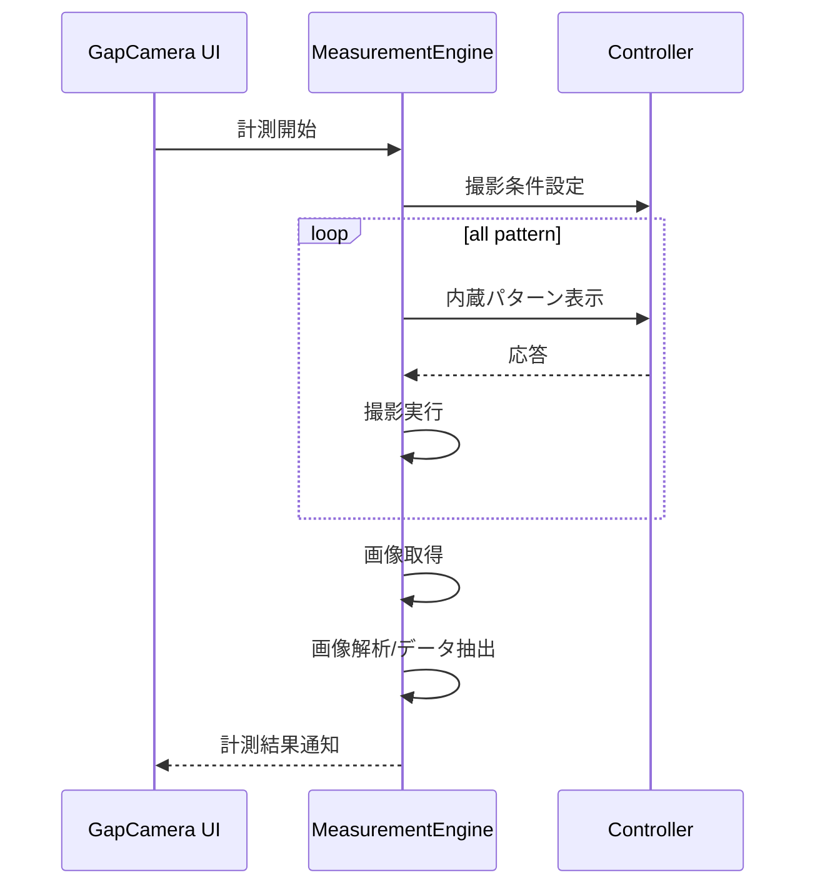
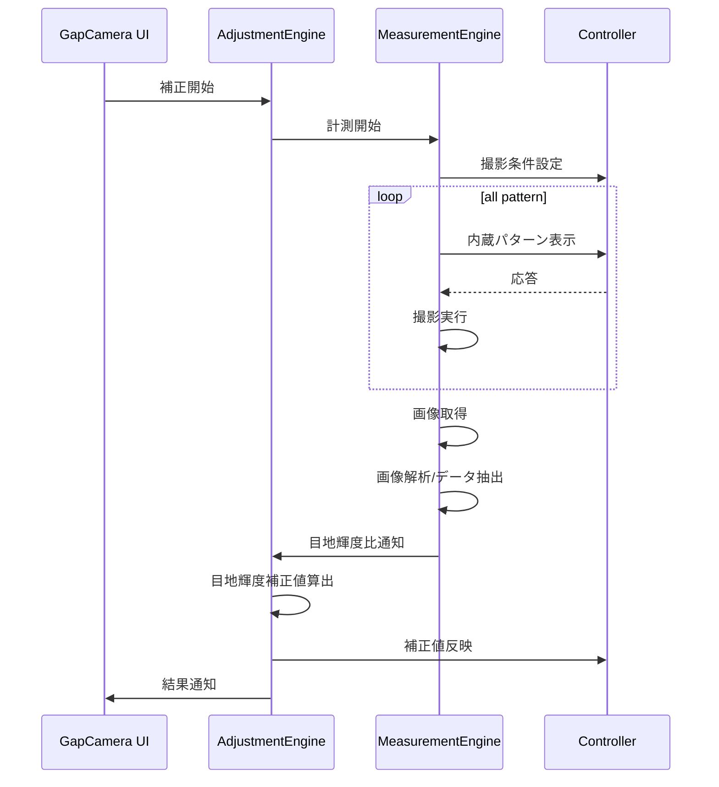

# GapCamera 詳細設計書

| 項目 | 内容 |
|------|------|
| プロジェクト名 | ColorAlignmentSoftware |
| システム名 | CAS GapCamera |
| ドキュメント名 | 詳細設計書 |
| 作成日 | 2026/04/16 |
| 作成者 | システム分析チーム |
| バージョン | 0.1 |
| 関連資料 | GapCamera_要件定義書.md, GapCamera_基本設計書.md |

---

## 1. モジュール一覧

### 1-1. モジュール一覧表

| No. | モジュールID | モジュール名 | 分類 | 主責務 | 配置先 | 備考 |
|-----|--------------|--------------|------|--------|--------|------|
| 1 | MDL-GAP-001 | GapCameraUIController | 画面/ビジネスロジック | Gapタブのイベント受付、進捗表示、実行制御 | CAS/Functions/GapCamera.cs | MainWindow partial class |
| 2 | MDL-GAP-002 | GapCameraPositioning | ビジネスロジック | カメラ位置合わせ、対象領域表示、位置推定 | CAS/Functions/GapCamera.cs | `CameraPosition` 条件コンパイルあり |
| 3 | MDL-GAP-003 | GapMeasurementEngine | ビジネスロジック | 計測処理、画像取得、解析結果生成 | CAS/Functions/GapCamera.cs | `measureGapAsync` 中心 |
| 4 | MDL-GAP-004 | GapAdjustmentEngine | ビジネスロジック | 補正値算出、補正反映、評価表示 | CAS/Functions/GapCamera.cs | `adjustGapRegAsync` 中心 |
| 5 | MDL-GAP-005 | GapBackupRestoreService | データアクセス/IF | 補正値バックアップ、復元、書込み確定 | CAS/Functions/GapCamera.cs | XML + SDCP連携 |
| 6 | MDL-GAP-006 | GapControllerWriteService | 外部IF | Controllerへの補正値設定・Write・Reconfig | CAS/Functions/GapCamera.cs | `writeGapCellCorrectionValueWithReconfig` |

### 1-2. モジュール命名規約

| 項目 | 規約 |
|------|------|
| 命名方針 | クラス/メソッドは PascalCase、イベントは `control_event` 形式 |
| ID採番規則 | MDL-GAP-001 から連番 |
| 分類コード | SCR:画面, BIZ:ビジネスロジック, DAL:データアクセス, IF:外部IF |

---

## 2. モジュール配置図（モジュールの物理配置設計）

### 2-1. 物理配置図

### 2-2. 配置一覧

| 配置区分 | 配置先パス/ノード | 配置モジュール | 配置理由 |
|----------|-------------------|----------------|----------|
| 実行モジュール | CAS/Functions/GapCamera.cs | MDL-GAP-001〜006 | 目地輝度比計測・目地補正処理を単一機能ファイルに集約しているため |
| 外部カメラ連携 | CameraControl.dll | Positioning/Measurement | 撮影・AF・ライブビューのため |
| 外部制御連携 | Controller (SDCP) | ControllerWrite/BackupRestore | 補正値設定・Write・Reconfigのため |
| ファイル永続化 | 測定フォルダ/任意XMLパス | Measurement/BackupRestore | 計測結果・補正値の保存/読込のため |

---

## 3. モジュール仕様オーバービュー

### 3-1. モジュール分類別サマリ

| 分類 | 対象モジュール | 処理概要 | 主なインタフェース |
|------|----------------|----------|--------------------|
| 画面 | GapCameraUIController | ボタンイベント、進捗ウィンドウ、完了/異常通知 | `btnGapCamMeasStart_Click`, `btnGapCamAdjStart_Click` |
| ビジネスロジック | Positioning/Measurement/Adjustment | 位置合わせ、計測、補正計算、結果表示 | `tbtnGapCamSetPos_Click`, `measureGapAsync`, `adjustGapRegAsync` |
| データアクセス | GapBackupRestoreService | XML入出力と内部データ変換 | `backupGapRegAsync`, `restoreGapRegAsync` |
| 外部IF | GapControllerWriteService | SDCPコマンド送信、Write/Reconfig手順 | `setGapCvCell*`, `writeGapCellCorrectionValueWithReconfig` |

### 3-2. モジュール別オーバービュー

| モジュールID | モジュール名 | 分類 | 処理概要 | インタフェース名 | 引数 | 返り値 |
|--------------|--------------|------|----------|------------------|------|--------|
| MDL-GAP-001 | GapCameraUIController | 画面 | Gap処理の起動/終了制御 | `btnGapCamMeasStart_Click` | sender,e | void |
| MDL-GAP-002 | GapCameraPositioning | BIZ | 位置合わせ実行・更新 | `tbtnGapCamSetPos_Click` | sender,e | void |
| MDL-GAP-003 | GapMeasurementEngine | BIZ | 計測実行・解析結果作成 | `measureGapAsync` | `List<UnitInfo>` | void |
| MDL-GAP-004 | GapAdjustmentEngine | BIZ | 計測結果読込・補正値計算・評価 | `adjustGapRegAsync` | `List<UnitInfo>` | void |
| MDL-GAP-005 | GapBackupRestoreService | DAL/IF | 補正値の保存/復元 | `backupGapRegAsync` | path | void |
| MDL-GAP-006 | GapControllerWriteService | IF | Controllerへの確定書込み | `writeGapCellCorrectionValueWithReconfig` | なし | bool |

---

## 4. モジュール仕様（詳細）

### 4-1. MDL-GAP-001: GapCameraUIController

#### 4-1-1. 基本情報

| 項目 | 内容 |
|------|------|
| モジュールID | MDL-GAP-001 |
| モジュール名 | GapCameraUIController |
| 分類 | 画面/ビジネスロジック |
| 呼出元 | オペレータUI操作 |
| 呼出先 | MDL-GAP-002〜006 |
| トランザクション | 無 |
| 再実行性 | 可（処理完了/エラー後に再実行可能） |

#### 4-1-2. 処理フロー

#### 4-1-3. 処理手順

| 手順No. | 処理内容 | 入力 | 出力 | 操作対象 | 備考 |
|---------|----------|------|------|----------|------|
| 1 | 操作種別判定 | 押下ボタン/トグル種別 | 処理分岐 | GapタブUI | 位置合わせ、計測、計測後補正、書込み、Backup/Restoreを判定 |
| 2 | 対象Cabinet/入力値チェック | Cabinet選択状態、ファイルパス等 | 実行可否 | 画面選択配列、入力UI | `CheckSelectedUnits`、入力不備時はエラー表示 |
| 3 | 位置合わせ開始/更新 | 対象Cabinet、表示設定 | ライブ表示、ガイド状態 | `tbtnGapCamSetPos`、画像UI | 位置合わせ時のみ。ON/OFFとタイマ更新を制御 |
| 4 | 計測開始準備（計測/補正時） | 対象Cabinet、処理種別 | Progress UI、画面操作禁止 | `WindowProgress`、`tcMain.IsEnabled` | 計測開始時に進捗表示と排他制御を設定 |
| 5 | 計測処理起動 | 対象Cabinet | 計測結果、測定ファイル | GapMeasurementEngine | `measureGapAsync` をTask.Runで起動 |
| 6 | 補正対象Cabinet検証（補正時） | Cabinet選択状態 | 実行可否 | 画面選択配列 | `CheckSelectedUnits` で矩形確認 |
| 7 | 補正計測開始準備 | 計測対象、処理種別 | Progress UI、画面操作禁止 | `WindowProgress` | 補正時の計測開始準備 |
| 8 | 補正計測処理起動 | 計測対象 | 計測結果 | GapMeasurementEngine | `measureGapAsync` をTask.Runで起動 |
| 9 | 補正開始準備 | 計測結果、補正対象、処理種別 | Progress UI、画面操作禁止 | `WindowProgress`、`tcMain.IsEnabled` | 補正開始時に進捗表示と排他制御を設定 |
| 10 | 補正処理起動 | 計測結果、対象Cabinet | 補正値、補正結果 | GapAdjustmentEngine | `adjustGapRegAsync` をTask.Runで起動 |
| 11 | Backup/Restore処理起動 | path、対象種別 | 保存/復元結果 | BackupRestoreService | path確認後に対象処理を起動 |
| 12 | 後処理 | 実行結果 | 通知・状態復帰 | UI/設定 | 完了/失敗通知、ThroughMode解除、表示復帰等 |

#### 4-1-4. 操作対象仕様（画面、テーブル、ファイル）

| 対象種別 | 対象名 | 操作内容 | 操作タイミング | 主キー/識別子 | 備考 |
|----------|--------|----------|----------------|---------------|------|
| 画面 | Gapタブ | ボタン操作/結果表示 | ユーザー操作時 | コントロール名 | 計測/計測後補正/書込み/Backup/Restore |
| 画面 | `tbtnGapCamSetPos` | ON/OFF切替 | 位置合わせ開始/終了時 | ToggleState | 位置合わせトグル |
| 画面 | `imgGapCamCameraView` | ライブ表示/ガイド更新 | 位置合わせ中 | ImageControl | タイマ更新で反映 |
| 画面 | WindowProgress | 表示/更新/Close | 処理開始〜終了 | ウィンドウインスタンス | 中断操作含む |
| 画面 | ファイルダイアログ | XMLパス選択 | Backup/Restore開始時 | ダイアログインスタンス | path確定用 |
| ファイル | Gap補正XML | 読込/書込 | Backup/Restore時 | path | 補正値保存/復元 |
| ファイル | 測定ログ | 出力 | 実行中 | 日時フォルダ | `saveLog` |

#### 4-1-5. インタフェース仕様（引数・返り値）

| 項目 | 内容 |
|------|------|
| インタフェース名 | Gap系イベントハンドラ群 |
| 概要 | 位置合わせ、計測、計測後補正、書込み、Backup/RestoreのUIイベントを業務処理へ中継する |
| シグネチャ | `private async void btnGapCamBackup_Click(object sender, RoutedEventArgs e)`、`private async void btnGapCamRestore_Click(object sender, RoutedEventArgs e)`、`private async void btnGapCamRestoreBulk_Click(object sender, RoutedEventArgs e)`、`unsafe private void tbtnGapCamSetPos_Click(object sender, RoutedEventArgs e)`、`private async void btnGapCamMeasStart_Click(object sender, RoutedEventArgs e)` ほか |
| 呼出条件 | Gapタブのボタン/トグル操作 |

引数一覧

| No. | 引数名 | 型 | 必須 | 説明 | バリデーション |
|-----|--------|----|------|------|----------------|
| 1 | sender | object | Y | イベント送信元 | null許容 |
| 2 | e | RoutedEventArgs/EventArgs | Y | イベント情報 | 操作元イベント型と整合 |

返り値一覧

| No. | 項目名 | 型 | 説明 | 備考 |
|-----|--------|----|------|------|
| 1 | なし | void | UIイベント処理 | 非同期イベントを含む。例外は内部catch |

#### 4-1-6. 例外処理仕様

| No. | 例外/エラー条件 | 検知方法 | 対応内容 | ユーザー通知 | ログ出力 | リトライ/継続可否 |
|-----|------------------|----------|----------|--------------|----------|------------------|
| 1 | 対象Cabinet不正 | `CheckSelectedUnits` 例外 | 処理中断/タブ復帰 | エラーダイアログ | 任意ログ | 可 |
| 2 | 位置合わせ開始/更新失敗 | 位置合わせ処理例外 | 位置合わせ停止、表示/状態復帰 | CAS Error表示 | 任意ログ | 可 |
| 3 | 計測結果未生成 | 補正開始時の内部状態確認 | 補正開始中断 | エラーダイアログ | 任意ログ | 可 |
| 4 | ファイルパス不正、未選択 | 入力値チェック、ダイアログ結果 | Backup/Restore開始中断 | エラーダイアログまたは無処理終了 | 任意ログ | 可 |
| 5 | 実処理失敗 | Task例外、BackupRestore処理例外 | 後処理実施し失敗通知 | CAS Error表示 | saveLog | 可 |
| 6 | ユーザー中断 | `CameraCasUserAbortException` | 中断として終了 | Abort表示 | saveLog | 可 |

#### 4-1-7. ログ仕様

| ログ種別 | 出力条件 | 出力項目 | 保持期間 | マスキング方針 |
|----------|----------|----------|----------|----------------|
| 実行ログ | 処理開始/終了/主要ステップ | 時刻、処理名、進捗 | 測定フォルダ世代管理 | 個人情報なし |

### 4-2. MDL-GAP-002: GapCameraPositioning

#### 4-2-1. 基本情報

| 項目 | 内容 |
|------|------|
| モジュールID | MDL-GAP-002 |
| モジュール名 | GapCameraPositioning |
| 分類 | ビジネスロジック |
| 呼出元 | UIController |
| 呼出先 | CameraControl, Controller, 画像表示 |
| トランザクション | 無 |
| 再実行性 | 可（位置合わせの再開始可能） |

#### 4-2-2. 処理フロー

#### 4-2-3. 処理手順

| 手順No. | 処理内容 | 入力 | 出力 | 操作対象 | 備考 |
|---------|----------|------|------|----------|------|
| 1 | 測定レベル設定 | モデル名 | m_MeasureLevel | Settings | B/Cモデル分岐 |
| 2 | 撮影条件選択 | カメラ名 | m_ShootCondition | Settings.GapCam | A6400/A7分岐 |
| 3 | 対象抽出 | Cabinet選択 | `lstTgtUnits`,`m_lstCamPosUnits` | 画面配列 | 矩形チェックあり |
| 4 | ThroughMode/表示制御 | targetUnits | 表示状態 | Controller | `SetThroughMode`,`outputGapCamTargetArea_EdgeExpand` |
| 5 | タイマ駆動補正 | live画像 | 位置補正ガイド | UI画像 | `timerGapCam_Tick` |

#### 4-2-4. 操作対象仕様（画面、テーブル、ファイル）

| 対象種別 | 対象名 | 操作内容 | 操作タイミング | 主キー/識別子 | 備考 |
|----------|--------|----------|----------------|---------------|------|
| 画面 | `tbtnGapCamSetPos` | ON/OFF切替 | ユーザー操作 | ToggleState | 実行中はタイマ連動 |
| 画面 | `imgGapCamCameraView` | ライブ表示更新 | タイマTick | ImageControl | 位置合わせ用 |
| 外部IF | Controller | パターン/画質設定 | 位置合わせ開始時 | ControllerID | 複数Controller対応 |

#### 4-2-5. インタフェース仕様（引数・返り値）

| 項目 | 内容 |
|------|------|
| インタフェース名 | 位置合わせ処理 |
| 概要 | 位置合わせ開始・更新・停止を制御 |
| シグネチャ | `unsafe private void tbtnGapCamSetPos_Click(object sender, RoutedEventArgs e)` |
| 呼出条件 | トグルON/OFF、タイマ更新 |

引数一覧

| No. | 引数名 | 型 | 必須 | 説明 | バリデーション |
|-----|--------|----|------|------|----------------|
| 1 | sender | object | Y | トリガUI | - |
| 2 | e | RoutedEventArgs | Y | イベント情報 | - |

返り値一覧

| No. | 項目名 | 型 | 説明 | 備考 |
|-----|--------|----|------|------|
| 1 | なし | void | UI制御のみ | 例外は通知 |

#### 4-2-6. 例外処理仕様

| No. | 例外/エラー条件 | 検知方法 | 対応内容 | ユーザー通知 | ログ出力 | リトライ/継続可否 |
|-----|------------------|----------|----------|--------------|----------|------------------|
| 1 | 設定値不正（距離/高さ等） | Parse失敗 | 位置合わせ停止 | CAS Error | 任意 | 可 |
| 2 | 位置合わせ中例外 | try-catch | ThroughMode解除・設定復帰 | CAS Error | 任意 | 可 |

#### 4-2-7. ログ仕様

| ログ種別 | 出力条件 | 出力項目 | 保持期間 | マスキング方針 |
|----------|----------|----------|----------|----------------|
| 実行ログ | ON/OFF、主要設定適用時 | LEDモデル、設定値、処理状態 | 測定フォルダ世代管理 | 機密値除外 |

### 4-3. MDL-GAP-003: GapMeasurementEngine

#### 4-3-1. 基本情報

| 項目 | 内容 |
|------|------|
| モジュールID | MDL-GAP-003 |
| モジュール名 | GapMeasurementEngine |
| 分類 | ビジネスロジック |
| 呼出元 | UIController |
| 呼出先 | CameraControl、OpenCv、ファイルI/O |
| トランザクション | 無 |
| 再実行性 | 可 |

#### 4-3-2. 処理フロー

#### 4-3-3. 処理手順

| 手順No. | 処理内容 | 入力 | 出力 | 操作対象 | 備考 |
|---------|----------|------|------|----------|------|
| 1 | 測定フォルダ作成 | 実行日時 | `m_CamMeasPath` | ファイルシステム | Gap_yyyyMMddHHmm |
| 2 | 設定保存 | 現在ユーザー設定 | `m_lstUserSetting` | Controller設定 | 後で復帰 |
| 3 | 撮影準備 | ShootCondition | カメラ設定反映 | CameraControl | `SetCameraSettings`,`AutoFocus` |
| 4 | 画像取得 | 対象Cabinet | 撮影画像 | カメラ/ファイル | 複数回撮影 |
| 5 | 解析 | 画像群 | Gap補正データ | OpenCv処理 | `storeGapCp` |
| 6 | 結果保存 | 解析データ | GapMeasResult.xml | ファイル | `GapCamCorrectionValue.SaveToXmlFile` |
| 7 | 復帰処理 | 一時設定 | 通常設定 | Controller | ThroughMode解除＋UserSetting復帰 |

#### 4-3-4. 操作対象仕様（画面、テーブル、ファイル）

| 対象種別 | 対象名 | 操作内容 | 操作タイミング | 主キー/識別子 | 備考 |
|----------|--------|----------|----------------|---------------|------|
| ファイル | Top/Right画像 | 出力/読込 | 計測実行中 | 連番ファイル名 | fn_Top/fn_Right |
| ファイル | GapMeasResult.xml | 出力 | 計測完了時 | パス | 補正値計算元 |
| 外部IF | CameraControl | 撮影/AF | 計測前〜中 | カメラ接続状態 | 失敗時例外 |

#### 4-3-5. インタフェース仕様（引数・返り値）

| 項目 | 内容 |
|------|------|
| インタフェース名 | measureGapAsync |
| 概要 | Gap計測主処理 |
| シグネチャ | `unsafe private void measureGapAsync(List<UnitInfo> lstTgtUnit)` |
| 呼出条件 | 計測開始ボタン |

引数一覧

| No. | 引数名 | 型 | 必須 | 説明 | バリデーション |
|-----|--------|----|------|------|----------------|
| 1 | lstTgtUnit | List<UnitInfo> | Y | 計測対象Cabinet群 | 空不可/矩形前提 |

返り値一覧

| No. | 項目名 | 型 | 説明 | 備考 |
|-----|--------|----|------|------|
| 1 | なし | void | 結果は内部状態/ファイルへ出力 | 例外で失敗通知 |

#### 4-3-6. 例外処理仕様

| No. | 例外/エラー条件 | 検知方法 | 対応内容 | ユーザー通知 | ログ出力 | リトライ/継続可否 |
|-----|------------------|----------|----------|--------------|----------|------------------|
| 1 | 撮影失敗 | CameraControl戻り/例外 | 処理中断 | CAS Error | saveLog | 可 |
| 2 | 解析失敗 | 画像解析例外 | 処理中断 | CAS Error | saveLog | 可 |
| 3 | 中断操作 | Abort例外 | 安全終了 | Abort表示 | saveLog | 可 |

#### 4-3-7. ログ仕様

| ログ種別 | 出力条件 | 出力項目 | 保持期間 | マスキング方針 |
|----------|----------|----------|----------|----------------|
| 計測ログ | 主要ステップ進行時 | ステップ名、対象、時刻 | 測定フォルダ世代管理 | 個人情報なし |

### 4-4. MDL-GAP-004: GapAdjustmentEngine

#### 4-4-1. 基本情報

| 項目 | 内容 |
|------|------|
| モジュールID | MDL-GAP-004 |
| モジュール名 | GapAdjustmentEngine |
| 分類 | ビジネスロジック |
| 呼出元 | UIController |
| 呼出先 | ControllerWriteService、表示更新 |
| トランザクション | 無 |
| 再実行性 | 可 |

#### 4-4-2. 処理フロー

#### 4-4-3. 処理手順

| 手順No. | 処理内容 | 入力 | 出力 | 操作対象 | 備考 |
|---------|----------|------|------|----------|------|
| 1 | 計測結果/補正条件取得 | 計測結果、UI設定 | `m_MaxNumOfAdjustment`,`m_EvaluateAdjustmentResult` | 内部状態、UI項目 | 計測結果未生成時はエラー |
| 2 | 補正実行 | 計測結果、対象Cabinet | 補正値更新 | 内部配列 | `adjustGapRegAsync` |
| 3 | 補正値計算 | 計測結果、現レジスタ/ゲイン | 新レジスタ値 | 補正データ | `calcNewRegCell` |
| 4 | 補正値反映 | 新補正値 | Controller設定状態 | SDCP | setGap*群 |
| 5 | 結果表示 | 計算結果 | Before/Result表示 | UI | `dispGapResult` |

#### 4-4-4. 操作対象仕様（画面、テーブル、ファイル）

| 対象種別 | 対象名 | 操作内容 | 操作タイミング | 主キー/識別子 | 備考 |
|----------|--------|----------|----------------|---------------|------|
| 画面 | 補正結果表示領域 | 更新 | 補正完了時 | DispType | Before/Result |
| 外部IF | Controller | 補正値設定 | 補正ループ中 | UnitInfo | CmdGapCorrectValueSet系 |
| ファイル | 実行ログ | 追記 | 補正中 | 測定フォルダ | stepログ |

#### 4-4-5. インタフェース仕様（引数・返り値）

| 項目 | 内容 |
|------|------|
| インタフェース名 | adjustGapRegAsync |
| 概要 | 目地輝度比計測結果に基づく補正主処理 |
| シグネチャ | `unsafe private void adjustGapRegAsync(List<UnitInfo> lstTgtUnit)` |
| 呼出条件 | 補正開始ボタン |

引数一覧

| No. | 引数名 | 型 | 必須 | 説明 | バリデーション |
|-----|--------|----|------|------|----------------|
| 1 | lstTgtUnit | List<UnitInfo> | Y | 補正対象Cabinet群 | 空不可、計測結果生成済み |

返り値一覧

| No. | 項目名 | 型 | 説明 | 備考 |
|-----|--------|----|------|------|
| 1 | なし | void | 内部状態更新 | 例外で失敗通知 |

#### 4-4-6. 例外処理仕様

| No. | 例外/エラー条件 | 検知方法 | 対応内容 | ユーザー通知 | ログ出力 | リトライ/継続可否 |
|-----|------------------|----------|----------|--------------|----------|------------------|
| 1 | 補正計算失敗 | 例外捕捉 | 処理停止 | CAS Error | saveLog | 可 |
| 2 | Controller反映失敗 | SDCP送信例外 | 処理停止 | CAS Error | saveLog | 可 |
| 3 | 中断操作 | Abort例外 | 安全停止 | Abort表示 | saveLog | 可 |

#### 4-4-7. ログ仕様

| ログ種別 | 出力条件 | 出力項目 | 保持期間 | マスキング方針 |
|----------|----------|----------|----------|----------------|
| 補正ログ | 補正ステップ進行時 | ステップ、対象、補正値 | 測定フォルダ世代管理 | 機密値除外 |

### 4-5. MDL-GAP-005: GapBackupRestoreService

#### 4-5-1. 基本情報

| 項目 | 内容 |
|------|------|
| モジュールID | MDL-GAP-005 |
| モジュール名 | GapBackupRestoreService |
| 分類 | データアクセス/IF |
| 呼出元 | UIController |
| 呼出先 | ファイルシステム、ControllerWriteService |
| トランザクション | 無 |
| 再実行性 | 可 |

#### 4-5-2. 処理フロー

#### 4-5-3. 処理手順

| 手順No. | 処理内容 | 入力 | 出力 | 操作対象 | 備考 |
|---------|----------|------|------|----------|------|
| 1 | XMLパス確定 | ファイルダイアログ | path | OSダイアログ | LastBackupFileを初期値利用 |
| 2 | Backup実行 | path | XML | ファイルI/O | `backupGapRegAsync` |
| 3 | Restore実行 | path | 補正値適用状態 | 内部+Controller | `restoreGapRegAsync` |
| 4 | Bulk Restore | path | 一括適用状態 | 内部+Controller | `restoreBulkGapRegAsync` |
| 5 | Write確定 | 更新Cabinet | ROM反映 | ControllerWriteService | Reconfig含む |

#### 4-5-4. 操作対象仕様（画面、テーブル、ファイル）

| 対象種別 | 対象名 | 操作内容 | 操作タイミング | 主キー/識別子 | 備考 |
|----------|--------|----------|----------------|---------------|------|
| ファイル | Gap補正XML | 読込/書込 | Backup/Restore時 | path | UTF-8 XML |
| 外部IF | Controller | 復元後の確定書込み | Restore完了時 | UnitInfo | Write必須 |

#### 4-5-5. インタフェース仕様（引数・返り値）

| 項目 | 内容 |
|------|------|
| インタフェース名 | backupGapRegAsync / restoreGapRegAsync / restoreBulkGapRegAsync |
| 概要 | 補正値の保存・復元 |
| シグネチャ | `unsafe private void backupGapRegAsync(string path)` ほか |
| 呼出条件 | Backup/Restoreボタン押下 |

引数一覧

| No. | 引数名 | 型 | 必須 | 説明 | バリデーション |
|-----|--------|----|------|------|----------------|
| 1 | path | string | Y | XML保存/読込パス | 空/存在チェック |

返り値一覧

| No. | 項目名 | 型 | 説明 | 備考 |
|-----|--------|----|------|------|
| 1 | なし | void | UI側で成否通知 | 例外時失敗 |

#### 4-5-6. 例外処理仕様

| No. | 例外/エラー条件 | 検知方法 | 対応内容 | ユーザー通知 | ログ出力 | リトライ/継続可否 |
|-----|------------------|----------|----------|--------------|----------|------------------|
| 1 | XML読込失敗 | Load例外 | 処理停止 | CAS Error | 任意 | 可 |
| 2 | XML保存失敗 | Save例外 | 処理停止 | CAS Error | 任意 | 可 |
| 3 | 復元後書込み失敗 | Write処理失敗 | 処理停止 | CAS Error | 任意 | 可 |

#### 4-5-7. ログ仕様

| ログ種別 | 出力条件 | 出力項目 | 保持期間 | マスキング方針 |
|----------|----------|----------|----------|----------------|
| 実行ログ | Backup/Restore開始・終了 | path、件数、結果 | 測定フォルダ世代管理 | 個人情報なし |

### 4-6. MDL-GAP-006: GapControllerWriteService

#### 4-6-1. 基本情報

| 項目 | 内容 |
|------|------|
| モジュールID | MDL-GAP-006 |
| モジュール名 | GapControllerWriteService |
| 分類 | 外部IF |
| 呼出元 | AdjustmentEngine, BackupRestoreService |
| 呼出先 | Controller(SDCP) |
| トランザクション | 無 |
| 再実行性 | 条件付き可（再実行で復旧可能） |

#### 4-6-2. 処理フロー

#### 4-6-3. 処理手順

| 手順No. | 処理内容 | 入力 | 出力 | 操作対象 | 備考 |
|---------|----------|------|------|----------|------|
| 1 | 進捗初期化 | modifiedUnits数 | WholeSteps | Progress | 4 + Cabinet数 |
| 2 | Panel OFF | controller一覧 | 電源OFF状態 | Controller | 10秒待機 |
| 3 | Cabinet毎Write | Cabinet識別 | 書込み要求送信 | Controller | CmdGapCellCorrectWrite |
| 4 | Reconfig | 全Controller | 再構成完了 | Controller | Target=true設定後送信 |
| 5 | Panel ON | controller一覧 | 電源ON状態 | Controller | 終了 |

#### 4-6-4. 操作対象仕様（画面、テーブル、ファイル）

| 対象種別 | 対象名 | 操作内容 | 操作タイミング | 主キー/識別子 | 備考 |
|----------|--------|----------|----------------|---------------|------|
| 外部IF | Controller | 電源OFF/ON | 書込み前後 | IPAddress | 全Controller対象 |
| 外部IF | Controller | GapWriteコマンド | Cabinetループ中 | Port/Cabinet | lstModifiedUnits |
| 外部IF | Controller | Reconfig | Write後 | controller target | sendReconfig |

#### 4-6-5. インタフェース仕様（引数・返り値）

| 項目 | 内容 |
|------|------|
| インタフェース名 | writeGapCellCorrectionValueWithReconfig |
| 概要 | Controllerへの補正値確定反映 |
| シグネチャ | `private bool writeGapCellCorrectionValueWithReconfig()` |
| 呼出条件 | ROM書込みまたはRestore後 |

引数一覧

| No. | 引数名 | 型 | 必須 | 説明 | バリデーション |
|-----|--------|----|------|------|----------------|
| 1 | なし | - | - | 内部状態利用 | lstModifiedUnits非空推奨 |

返り値一覧

| No. | 項目名 | 型 | 説明 | 備考 |
|-----|--------|----|------|------|
| 1 | result | bool | true: 処理完了 | 例外時は上位で失敗扱い |

#### 4-6-6. 例外処理仕様

| No. | 例外/エラー条件 | 検知方法 | 対応内容 | ユーザー通知 | ログ出力 | リトライ/継続可否 |
|-----|------------------|----------|----------|--------------|----------|------------------|
| 1 | SDCP送信失敗 | 送信例外 | 処理停止 | CAS Error | 実行ログ | 可 |
| 2 | Reconfig失敗 | 応答/例外 | 処理停止 | CAS Error | 実行ログ | 可 |
| 3 | 電源制御失敗 | 応答/例外 | 処理停止 | CAS Error | 実行ログ | 可 |

#### 4-6-7. ログ仕様

| ログ種別 | 出力条件 | 出力項目 | 保持期間 | マスキング方針 |
|----------|----------|----------|----------|----------------|
| 実行ログ | Write開始〜終了 | Step、対象Cabinet、結果 | 測定フォルダ世代管理 | 機密値除外 |

---

## 5. コード仕様

### 5-1. コード一覧

| コード名称 | コード値 | 内容説明 | 利用箇所 | 備考 |
|------------|----------|----------|----------|------|
| GapStatus | Before | 補正前表示状態 | 結果表示 | enum |
| GapStatus | Result | 補正後表示状態 | 結果表示 | enum |
| GapStatus | Measure | 計測表示状態 | 結果表示 | enum |
| CaptureNum | 3 | 撮影回数 | 計測処理 | 定数 |
| GapTrimmingAreaMin | 50 | トリミング最小 | 解析処理 | 定数 |
| GapTrimmingAreaMax | 5000 | トリミング最大 | 解析処理 | 定数 |
| 補正初期値 | 128 | レジスタ初期値(100%相当) | Backup/Restore/補正 | GapCellCorrectValue |

### 5-2. コード定義ルール

| 項目 | ルール |
|------|--------|
| 補正値範囲 | `correctValue_Min`〜`correctValue_Max` にクリップ |
| Cabinet識別変換 | `PortNo`,`UnitNo` をSDCPコマンドバイトへ変換 |
| 条件コンパイル | `CameraPosition`,`BulkSetCorrectValue`,`Auto_WriteData` など運用定義に従う |

---

## 6. メッセージ仕様

### 6-1. メッセージ一覧

| メッセージ名称 | メッセージID | 種別 | 表示メッセージ | 内容説明 | 対応アクション |
|----------------|--------------|------|----------------|----------|----------------|
| 計測完了 | GAP-I-001 | 情報 | Measurement Gap Complete! | 計測成功 | OK |
| 計測失敗 | GAP-E-001 | 異常通知 | Failed in Measurement Gap. | 計測失敗 | 再実行 |
| 補正完了 | GAP-I-002 | 情報 | Adjustment Gap Complete! | 補正成功 | 結果確認 |
| 補正失敗 | GAP-E-002 | 異常通知 | Failed in Adjustment Gap. | 補正失敗 | 再実行 |
| ROM書込み完了 | GAP-I-003 | 情報 | Writing Gap correction value to ROM Complete! | 書込み成功 | OK |
| ROM書込み失敗 | GAP-E-003 | 異常通知 | Failed in writing Gap corection value to ROM. | 書込み失敗 | 再実行 |
| Backup完了 | GAP-I-004 | 情報 | Backup Gap Correction Values Complete! | 保存成功 | OK |
| Restore完了 | GAP-I-005 | 情報 | Restore Gap Correction Values Complete! | 復元成功 | OK |
| ユーザー中断 | GAP-W-001 | 警告 | Abort! | ユーザー中断 | 再実行 |

### 6-2. メッセージ運用ルール

| 項目 | ルール |
|------|--------|
| ID採番 | `GAP-{I/W/E}-連番` |
| 多言語対応 | 無（英語メッセージ固定） |
| 表示経路 | `WindowMessage` / `ShowMessageWindow` |

---

## 7. 関連システムインタフェース仕様

### 7-1. インタフェース一覧

| IF ID | I/O | インタフェースシステム名 | インタフェースファイル名 | インタフェースタイミング | インタフェース方法 | インタフェースエラー処理方法 | インタフェース処理のリラン定義 | インタフェース処理のロギングインタフェース |
|------|-----|--------------------------|--------------------------|--------------------------|--------------------|------------------------------|--------------------------------|------------------------------------------|
| IF-GAP-001 | OUT | CameraControl | DLL API | 位置合わせ/計測時 | メソッド呼び出し | 例外捕捉・処理停止 | オペレータ再実行 | saveLog |
| IF-GAP-002 | OUT | Controller | SDCPコマンド | 補正/書込み/表示時 | TCP送信 | 例外捕捉・処理停止 | オペレータ再実行 | saveLog |
| IF-GAP-003 | IN/OUT | ファイルシステム | XML/画像/ログ | 計測/Backup/Restore時 | ファイルI/O | 例外捕捉・処理停止 | パス修正後再実行 | saveLog |

### 7-2. インタフェースデータ項目定義

| IF ID | データ項目名 | データ項目の説明 | データ項目の位置 | 書式 | 必須 | エラー時の代替値 | 備考 |
|------|--------------|------------------|------------------|------|------|------------------|------|
| IF-GAP-001 | ShootCondition | 撮影条件 | API引数 | object | Y | なし | 機種別設定 |
| IF-GAP-002 | CmdGapCellCorrectValueSet | Cell補正設定コマンド | byte配列 | binary | Y | なし | Edge毎設定 |
| IF-GAP-002 | CmdGapCellCorrectWrite | ROM書込みコマンド | byte配列 | binary | Y | なし | Cabinet毎送信 |
| IF-GAP-003 | GapCamCorrectionValue[] | 補正バックアップデータ | XML要素 | UTF-8 XML | Y | なし | Save/Load対象 |

### 7-3. インタフェース処理シーケンス

#### 7-3-1. 補正値書込み処理シーケンス

#### 7-3-2. 計測処理シーケンス

#### 7-3-3. 補正処理シーケンス

---

## 8. メソッド仕様

### 8-1. UIイベント系メソッド

#### 8-1-1. btnGapCamBackup_Click

| 項目 | 内容 |
|------|------|
| シグネチャ | `private async void btnGapCamBackup_Click(object sender, RoutedEventArgs e)` |
| 概要 | 補正値バックアップ処理を開始する |

引数: `sender`, `e`  
返り値: なし（void）

#### 8-1-2. btnGapCamRestore_Click

| 項目 | 内容 |
|------|------|
| シグネチャ | `private async void btnGapCamRestore_Click(object sender, RoutedEventArgs e)` |
| 概要 | 補正値リストア（通常書込み）を開始する |

引数: `sender`, `e`  
返り値: なし（void）

#### 8-1-3. btnGapCamRestoreBulk_Click

| 項目 | 内容 |
|------|------|
| シグネチャ | `private async void btnGapCamRestoreBulk_Click(object sender, RoutedEventArgs e)` |
| 概要 | 補正値リストア（一括書込み）を開始する |

引数: `sender`, `e`  
返り値: なし（void）

#### 8-1-4. tbtnGapCamSetPos_Click

| 項目 | 内容 |
|------|------|
| シグネチャ | `unsafe private void tbtnGapCamSetPos_Click(object sender, RoutedEventArgs e)` |
| 概要 | カメラ位置合わせモードの開始/停止を制御する |

引数: `sender`, `e`  
返り値: なし（void）

#### 8-1-5. timerGapCam_Tick

| 項目 | 内容 |
|------|------|
| シグネチャ | `private void timerGapCam_Tick(object sender, EventArgs e)` |
| 概要 | 位置合わせ中の周期更新処理を実行する |

引数: `sender`, `e`  
返り値: なし（void）

#### 8-1-6. btnGapCamMeasStart_Click

| 項目 | 内容 |
|------|------|
| シグネチャ | `private async void btnGapCamMeasStart_Click(object sender, RoutedEventArgs e)` |
| 概要 | Gap計測処理を開始する |

引数: `sender`, `e`  
返り値: なし（void）

#### 8-1-7. btnGapCamAdjStart_Click

| 項目 | 内容 |
|------|------|
| シグネチャ | `private async void btnGapCamAdjStart_Click(object sender, RoutedEventArgs e)` |
| 概要 | 計測完了後のGap補正処理を開始する |

引数: `sender`, `e`  
返り値: なし（void）

#### 8-1-8. btnGapCamRomStart_Click

| 項目 | 内容 |
|------|------|
| シグネチャ | `private async void btnGapCamRomStart_Click(object sender, RoutedEventArgs e)` |
| 概要 | ROM書込み処理を開始する |

引数: `sender`, `e`  
返り値: なし（void）

### 8-2. 業務処理メソッド

#### 8-2-1. measureGapAsync

| 項目 | 内容 |
|------|------|
| シグネチャ | `unsafe private void measureGapAsync(List<UnitInfo> lstTgtUnit)` |
| 概要 | Gap計測の主処理（撮影・解析・結果保存）を実行する |

引数

| No. | 引数名 | 型 | 必須 | 説明 |
|-----|--------|----|------|------|
| 1 | lstTgtUnit | List<UnitInfo> | Y | 計測対象Cabinet一覧 |

返り値: なし（void）

#### 8-2-2. adjustGapRegAsync

| 項目 | 内容 |
|------|------|
| シグネチャ | `unsafe private void adjustGapRegAsync(List<UnitInfo> lstTgtUnit)` |
| 概要 | Gap計測結果に基づく補正の主処理（補正値算出・反映）を実行する |

引数

| No. | 引数名 | 型 | 必須 | 説明 |
|-----|--------|----|------|------|
| 1 | lstTgtUnit | List<UnitInfo> | Y | 計測済みの補正対象Cabinet一覧 |

返り値: なし（void）

#### 8-2-3. romSaveAsync

| 項目 | 内容 |
|------|------|
| シグネチャ | `private void romSaveAsync(List<UnitInfo> lstTgtUnit)` |
| 概要 | 補正値のROM書込みを実行する |

引数

| No. | 引数名 | 型 | 必須 | 説明 |
|-----|--------|----|------|------|
| 1 | lstTgtUnit | List<UnitInfo> | Y | 書込み対象Cabinet一覧 |

返り値: なし（void）

#### 8-2-4. backupGapRegAsync

| 項目 | 内容 |
|------|------|
| シグネチャ | `unsafe private void backupGapRegAsync(string path)` |
| 概要 | 補正値をXMLへバックアップする |

引数

| No. | 引数名 | 型 | 必須 | 説明 |
|-----|--------|----|------|------|
| 1 | path | string | Y | 保存先XMLパス |

返り値: なし（void）

#### 8-2-5. restoreGapRegAsync

| 項目 | 内容 |
|------|------|
| シグネチャ | `private void restoreGapRegAsync(string path)` |
| 概要 | XML補正値を復元（通常設定）する |

引数

| No. | 引数名 | 型 | 必須 | 説明 |
|-----|--------|----|------|------|
| 1 | path | string | Y | 読込元XMLパス |

返り値: なし（void）

#### 8-2-6. restoreBulkGapRegAsync

| 項目 | 内容 |
|------|------|
| シグネチャ | `private void restoreBulkGapRegAsync(string path)` |
| 概要 | XML補正値を復元（一括設定）する |

引数

| No. | 引数名 | 型 | 必須 | 説明 |
|-----|--------|----|------|------|
| 1 | path | string | Y | 読込元XMLパス |

返り値: なし（void）

### 8-3. SDCP設定・書込みメソッド

#### 8-3-1. setGapCvUnit

| 項目 | 内容 |
|------|------|
| シグネチャ | `private void setGapCvUnit(UnitInfo Cabinet, GapCellCorrectValue cv)` |
| 概要 | Cabinet単位の補正値をSDCPで設定する |

引数

| No. | 引数名 | 型 | 必須 | 説明 |
|-----|--------|----|------|------|
| 1 | Cabinet | UnitInfo | Y | 対象Cabinet |
| 2 | cv | GapCellCorrectValue | Y | 8辺補正値 |

返り値: なし（void）

#### 8-3-2. setGapCvCell

| 項目 | 内容 |
|------|------|
| シグネチャ | `private void setGapCvCell(UnitInfo Cabinet, int cell, GapCellCorrectValue cv)` |
| 概要 | Cell単位の補正値を辺ごとに設定する |

引数

| No. | 引数名 | 型 | 必須 | 説明 |
|-----|--------|----|------|------|
| 1 | Cabinet | UnitInfo | Y | 対象Cabinet |
| 2 | cell | int | Y | Cell番号（1ベース） |
| 3 | cv | GapCellCorrectValue | Y | 8辺補正値 |

返り値: なし（void）

#### 8-3-3. setGapCvCellEdge

| 項目 | 内容 |
|------|------|
| シグネチャ | `private void setGapCvCellEdge(UnitInfo Cabinet, int cell, EdgePosition targetEdge, int value)` |
| 概要 | Cellの指定辺へ補正値を設定する |

引数

| No. | 引数名 | 型 | 必須 | 説明 |
|-----|--------|----|------|------|
| 1 | Cabinet | UnitInfo | Y | 対象Cabinet |
| 2 | cell | int | Y | Cell番号 |
| 3 | targetEdge | EdgePosition | Y | 対象辺 |
| 4 | value | int | Y | 補正値 |

返り値: なし（void）

#### 8-3-4. setGapCvCellBulk

| 項目 | 内容 |
|------|------|
| シグネチャ | `private void setGapCvCellBulk(UnitInfo Cabinet, int cell, GapCellCorrectValue cv)` |
| 概要 | Cell補正値を一括コマンドで設定する |

引数

| No. | 引数名 | 型 | 必須 | 説明 |
|-----|--------|----|------|------|
| 1 | Cabinet | UnitInfo | Y | 対象Cabinet |
| 2 | cell | int | Y | Cell番号 |
| 3 | cv | GapCellCorrectValue | Y | 8辺補正値 |

返り値: なし（void）

#### 8-3-5. writeGapCellCorrectionValueWithReconfig

| 項目 | 内容 |
|------|------|
| シグネチャ | `private bool writeGapCellCorrectionValueWithReconfig()` |
| 概要 | Write/Reconfig/Panel制御を標準手順で実行する |

引数: なし

返り値

| No. | 項目名 | 型 | 説明 |
|-----|--------|----|------|
| 1 | result | bool | true: 正常終了 |

### 8-4. 補助計算メソッド

#### 8-4-1. getCv

| 項目 | 内容 |
|------|------|
| シグネチャ | `private int getCv(GapCamCorrectionValue cv, GapCamCp cp)` |
| 概要 | 対象位置の現在補正値を取得する |

引数: `cv`, `cp`  
返り値: 補正レジスタ値（int）

#### 8-4-2. calcNewRegUnit

| 項目 | 内容 |
|------|------|
| シグネチャ | `private int calcNewRegUnit(int curReg, double gapGain)` |
| 概要 | Cabinet補正値を計算する（現状は未実装） |

引数: `curReg`, `gapGain`  
返り値: 新補正値（現状0）

#### 8-4-3. calcNewRegCell

| 項目 | 内容 |
|------|------|
| シグネチャ | `private int calcNewRegCell(int curReg, double gapGain)` |
| 概要 | Cell補正値をゲイン換算で計算し範囲制限する |

引数: `curReg`, `gapGain`  
返り値: 新補正値（int）

#### 8-4-4. setGapCorrectValue

| 項目 | 内容 |
|------|------|
| シグネチャ | `private void setGapCorrectValue(UnitInfo Cabinet, CorrectPosition pos, int value)` |
| 概要 | Cabinet境界の補正値を設定する |

引数: `Cabinet`, `pos`, `value`  
返り値: なし（void）

#### 8-4-5. storeGapCp

| 項目 | 内容 |
|------|------|
| シグネチャ | `private void storeGapCp(List<UnitInfo> lstTgtUnit, string measPath)` |
| 概要 | Top/Right画像解析結果を補正データへ格納する |

引数: `lstTgtUnit`, `measPath`  
返り値: なし（void）

---

## 9. 変更履歴

| 版数 | 日付 | 変更者 | 変更内容 |
|------|------|--------|----------|
| 0.1 | 2026/04/16 | システム分析チーム | 新規作成（GapCamera.cs主体） |
| 0.2 | 2026/04/16 | システム分析チーム | 8章をメソッド単位の小見出し形式へ細分化 |

---

## 10. 記入ガイド（運用時に削除可）

- `CameraPosition`、`BulkSetCorrectValue`、`Auto_WriteData` 等の条件コンパイル差分は、運用ビルド定義に合わせて本書を更新する。
- `calcNewRegUnit` の仕様確定後、8章・4章の該当箇所を更新する。
- SDCPコマンド定義（Cmd*）の改版時は、7章IF項目と8章メソッド仕様の両方を同時更新する。
