# GapCamera 詳細設計書

| 項目 | 内容 |
|------|------|
| プロジェクト名 | ColorAlignmentSoftware |
| システム名 | CAS GapCamera |
| ドキュメント名 | 詳細設計書 |
| 作成日 | 2026/04/16 |
| 作成者 | システム分析チーム |
| バージョン | 0.1 |
| 関連資料 | GapCamera_要件定義書.md, GapCamera_基本設計書.md |

---

## 1. モジュール一覧

### 1-1. モジュール一覧表

| No. | モジュールID | モジュール名 | 分類 | 主責務 | 配置先 | 備考 |
|-----|--------------|--------------|------|--------|--------|------|
| 1 | MDL-GAP-001 | GapCameraUIController | 画面/ビジネスロジック | Gapタブのイベント受付、進捗表示、実行制御 | CAS/Functions/GapCamera.cs | MainWindow partial class |
| 2 | MDL-GAP-002 | GapCameraPositioning | ビジネスロジック | カメラ位置合わせ、対象領域表示、位置推定 | CAS/Functions/GapCamera.cs | `CameraPosition` 条件コンパイルあり |
| 3 | MDL-GAP-003 | GapMeasurementEngine | ビジネスロジック | 計測処理、画像取得、解析結果生成 | CAS/Functions/GapCamera.cs | `measureGapAsync` 中心 |
| 4 | MDL-GAP-004 | GapAdjustmentEngine | ビジネスロジック | 補正値算出、補正反映、評価表示 | CAS/Functions/GapCamera.cs | `adjustGapRegAsync` 中心 |
| 5 | MDL-GAP-005 | GapBackupRestoreService | データアクセス/IF | 補正値バックアップ、復元、書込み確定 | CAS/Functions/GapCamera.cs | XML + SDCP連携 |
| 6 | MDL-GAP-006 | GapControllerWriteService | 外部IF | Controllerへの補正値設定・Write・Reconfig | CAS/Functions/GapCamera.cs | `writeGapCellCorrectionValueWithReconfig` |

### 1-2. モジュール命名規約

| 項目 | 規約 |
|------|------|
| 命名方針 | クラス/メソッドは PascalCase、イベントは `control_event` 形式 |
| ID採番規則 | MDL-GAP-001 から連番 |
| 分類コード | SCR:画面, BIZ:ビジネスロジック, DAL:データアクセス, IF:外部IF |

---

## 2. モジュール配置図（モジュールの物理配置設計）

### 2-1. 物理配置図

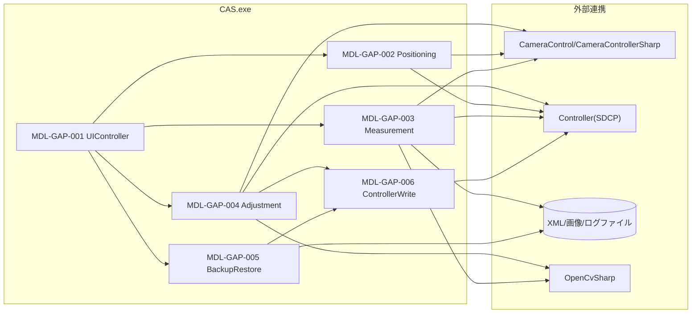
```mermaid
flowchart LR
    subgraph CAS["CAS.exe"]
        UI["MDL-GAP-001 UIController"]
        POS["MDL-GAP-002 Positioning"]
        MEAS["MDL-GAP-003 Measurement"]
        ADJ["MDL-GAP-004 Adjustment"]
        BAK["MDL-GAP-005 BackupRestore"]
        WRT["MDL-GAP-006 ControllerWrite"]
    end

    subgraph External["外部連携"]
        CAM["CameraControl/CameraControllerSharp"]
        CTRL["Controller(SDCP)"]
        FS[("XML/画像/ログファイル")]
        CV["OpenCvSharp"]
    end

    UI --> POS
    UI --> MEAS
    UI --> ADJ
    UI --> BAK
    ADJ --> WRT
    ADJ --> CAM
    ADJ --> CTRL
    ADJ --> CV
    BAK --> WRT
    POS --> CAM
    POS --> CTRL
    MEAS --> CAM
    MEAS --> CV
    MEAS --> FS
    MEAS --> CTRL
    BAK --> FS
    WRT --> CTRL
```

### 2-2. 配置一覧

| 配置区分 | 配置先パス/ノード | 配置モジュール | 配置理由 |
|----------|-------------------|----------------|----------|
| 実行モジュール | CAS/Functions/GapCamera.cs | MDL-GAP-001〜006 | Gap輝度比計測・Gap補正処理を単一機能ファイルに集約しているため |
| 外部カメラ連携 | CameraControl.dll | Positioning/Measurement | 撮影・AF・ライブビューのため |
| 外部制御連携 | Controller (SDCP) | ControllerWrite/BackupRestore | 補正値設定・Write・Reconfigのため |
| ファイル永続化 | 測定フォルダ/任意XMLパス | Measurement/BackupRestore | 計測結果・補正値の保存/読込のため |

---

## 3. モジュール仕様オーバービュー

### 3-1. モジュール分類別サマリ

| 分類 | 対象モジュール | 処理概要 | 主なインタフェース |
|------|----------------|----------|--------------------|
| 画面 | GapCameraUIController | ボタンイベント、進捗ウィンドウ、完了/異常通知 | `btnGapCamMeasStart_Click`, `btnGapCamAdjStart_Click` |
| ビジネスロジック | Positioning/Measurement/Adjustment | 位置合わせ、計測、補正計算、結果表示 | `tbtnGapCamSetPos_Click`, `measureGapAsync`, `adjustGapRegAsync` |
| データアクセス | GapBackupRestoreService | XML入出力と内部データ変換 | `backupGapRegAsync`, `restoreGapRegAsync` |
| 外部IF | GapControllerWriteService | SDCPコマンド送信、Write/Reconfig手順 | `setGapCvCell*`, `writeGapCellCorrectionValueWithReconfig` |

### 3-2. モジュール別オーバービュー

| モジュールID | モジュール名 | 分類 | 処理概要 | インタフェース名 | 引数 | 返り値 |
|--------------|--------------|------|----------|------------------|------|--------|
| MDL-GAP-001 | GapCameraUIController | 画面 | Gap処理の起動/終了制御 | `btnGapCamMeasStart_Click` | sender,e | void |
| MDL-GAP-002 | GapCameraPositioning | BIZ | 位置合わせ実行・更新 | `tbtnGapCamSetPos_Click` | sender,e | void |
| MDL-GAP-003 | GapMeasurementEngine | BIZ | 計測実行・解析結果作成 | `measureGapAsync` | `List<UnitInfo>` | void |
| MDL-GAP-004 | GapAdjustmentEngine | BIZ | 計測結果読込・補正値計算・評価 | `adjustGapRegAsync` | `List<UnitInfo>` | void |
| MDL-GAP-005 | GapBackupRestoreService | DAL/IF | 補正値の保存/復元 | `backupGapRegAsync` | path | void |
| MDL-GAP-006 | GapControllerWriteService | IF | Controllerへの確定書込み | `writeGapCellCorrectionValueWithReconfig` | なし | bool |

---

## 4. モジュール仕様（詳細）

### 4-1. MDL-GAP-001: GapCameraUIController

#### 4-1-1. 基本情報

| 項目 | 内容 |
|------|------|
| モジュールID | MDL-GAP-001 |
| モジュール名 | GapCameraUIController |
| 分類 | 画面/ビジネスロジック |
| 呼出元 | オペレータUI操作 |
| 呼出先 | MDL-GAP-002〜006 |
| トランザクション | 無 |
| 再実行性 | 可（処理完了/エラー後に再実行可能） |

#### 4-1-2. 処理フロー

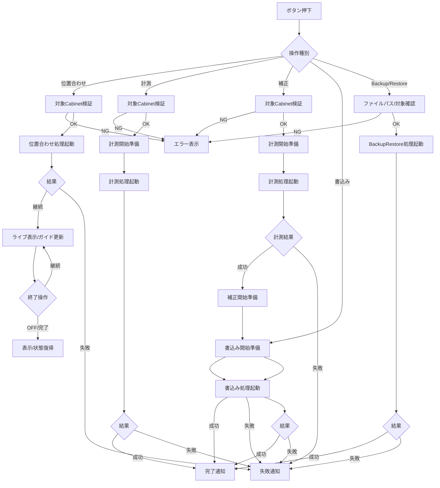
```mermaid
flowchart TD
    A[ボタン押下] --> B{操作種別}
    B -->|位置合わせ| C[対象Cabinet検証]
    C -->|NG| D[エラー表示]
    C -->|OK| E[位置合わせ処理起動]
    E --> F{結果}
    F -->|継続| G[ライブ表示/ガイド更新]
    G --> H{終了操作}
    H -->|OFF/完了| I[表示/状態復帰]
    H -->|継続| G
    F -->|失敗| J[失敗通知]
    B -->|計測| K[対象Cabinet検証]
    K -->|NG| D
    K -->|OK| L[計測開始準備]
    L --> M[計測処理起動]
    M --> N{結果}
    N -->|成功| O[完了通知]
    N -->|失敗| J
    B -->|補正| P[対象Cabinet検証]
    P -->|NG| D
    P -->|OK| Q[計測開始準備]
    Q --> R[計測処理起動]
    R --> S{計測結果}
    S -->|成功| T[補正開始準備]
    S -->|失敗| J
    T --> U[補正処理起動]
    U --> V{補正結果}
    V -->|成功| O
    V -->|失敗| J
    B -->|書込み| U[書込み開始準備]
    U --> V[書込み処理起動]
    V --> W{結果}
    W -->|成功| O
    W -->|失敗| J
    B -->|Backup/Restore| X[ファイルパス/対象確認]
    X -->|NG| D
    X -->|OK| Y[BackupRestore処理起動]
    Y --> Z{結果}
    Z -->|成功| O
    Z -->|失敗| J
```

#### 4-1-3. 処理手順

| 手順No. | 処理内容 | 入力 | 出力 | 操作対象 | 備考 |
|---------|----------|------|------|----------|------|
| 1 | 操作種別判定 | 押下ボタン/トグル種別 | 処理分岐 | GapタブUI | 位置合わせ、計測、計測後補正、書込み、Backup/Restoreを判定 |
| 2 | 対象Cabinet/入力値チェック | Cabinet選択状態、ファイルパス等 | 実行可否 | 画面選択配列、入力UI | `CheckSelectedUnits`、入力不備時はエラー表示 |
| 3 | 位置合わせ開始/更新 | 対象Cabinet、表示設定 | ライブ表示、ガイド状態 | `tbtnGapCamSetPos`、画像UI | 位置合わせ時のみ。ON/OFFとタイマ更新を制御 |
| 4 | 計測開始準備（計測/補正時） | 対象Cabinet、処理種別 | Progress UI、画面操作禁止 | `WindowProgress`、`tcMain.IsEnabled` | 計測開始時に進捗表示と排他制御を設定 |
| 5 | 計測処理起動 | 対象Cabinet | 計測結果、測定ファイル | GapMeasurementEngine | `measureGapAsync` をTask.Runで起動 |
| 6 | 補正対象Cabinet検証（補正時） | Cabinet選択状態 | 実行可否 | 画面選択配列 | `CheckSelectedUnits` で矩形確認 |
| 7 | 補正計測開始準備 | 計測対象、処理種別 | Progress UI、画面操作禁止 | `WindowProgress` | 補正時の計測開始準備 |
| 8 | 補正計測処理起動 | 計測対象 | 計測結果 | GapMeasurementEngine | `measureGapAsync` をTask.Runで起動 |
| 9 | 補正開始準備 | 計測結果、補正対象、処理種別 | Progress UI、画面操作禁止 | `WindowProgress`、`tcMain.IsEnabled` | 補正開始時に進捗表示と排他制御を設定 |
| 10 | 補正処理起動 | 計測結果、対象Cabinet | 補正値、補正結果 | GapAdjustmentEngine | `adjustGapRegAsync` をTask.Runで起動 |
| 11 | Backup/Restore処理起動 | path、対象種別 | 保存/復元結果 | BackupRestoreService | path確認後に対象処理を起動 |
| 12 | 後処理 | 実行結果 | 通知・状態復帰 | UI/設定 | 完了/失敗通知、ThroughMode解除、表示復帰等 |

#### 4-1-4. 操作対象仕様（画面、テーブル、ファイル）

| 対象種別 | 対象名 | 操作内容 | 操作タイミング | 主キー/識別子 | 備考 |
|----------|--------|----------|----------------|---------------|------|
| 画面 | Gapタブ | ボタン操作/結果表示 | ユーザー操作時 | コントロール名 | 計測/計測後補正/書込み/Backup/Restore |
| 画面 | `tbtnGapCamSetPos` | ON/OFF切替 | 位置合わせ開始/終了時 | ToggleState | 位置合わせトグル |
| 画面 | `imgGapCamCameraView` | ライブ表示/ガイド更新 | 位置合わせ中 | ImageControl | タイマ更新で反映 |
| 画面 | WindowProgress | 表示/更新/Close | 処理開始〜終了 | ウィンドウインスタンス | 中断操作含む |
| 画面 | ファイルダイアログ | XMLパス選択 | Backup/Restore開始時 | ダイアログインスタンス | path確定用 |
| ファイル | Gap補正XML | 読込/書込 | Backup/Restore時 | path | 補正値保存/復元 |
| ファイル | 測定ログ | 出力 | 実行中 | 日時フォルダ | `saveLog` |

#### 4-1-5. インタフェース仕様（引数・返り値）

| 項目 | 内容 |
|------|------|
| インタフェース名 | Gap系イベントハンドラ群 |
| 概要 | 位置合わせ、計測、計測後補正、書込み、Backup/RestoreのUIイベントを業務処理へ中継する |
| シグネチャ | `private async void btnGapCamBackup_Click(object sender, RoutedEventArgs e)`、`private async void btnGapCamRestore_Click(object sender, RoutedEventArgs e)`、`private async void btnGapCamRestoreBulk_Click(object sender, RoutedEventArgs e)`、`unsafe private void tbtnGapCamSetPos_Click(object sender, RoutedEventArgs e)`、`private async void btnGapCamMeasStart_Click(object sender, RoutedEventArgs e)` ほか |
| 呼出条件 | Gapタブのボタン/トグル操作 |

引数一覧

| No. | 引数名 | 型 | 必須 | 説明 | バリデーション |
|-----|--------|----|------|------|----------------|
| 1 | sender | object | Y | イベント送信元 | null許容 |
| 2 | e | RoutedEventArgs/EventArgs | Y | イベント情報 | 操作元イベント型と整合 |

返り値一覧

| No. | 項目名 | 型 | 説明 | 備考 |
|-----|--------|----|------|------|
| 1 | なし | void | UIイベント処理 | 非同期イベントを含む。例外は内部catch |

#### 4-1-6. 例外処理仕様

| No. | 例外/エラー条件 | 検知方法 | 対応内容 | ユーザー通知 | ログ出力 | リトライ/継続可否 |
|-----|------------------|----------|----------|--------------|----------|------------------|
| 1 | 対象Cabinet不正 | `CheckSelectedUnits` 例外 | 処理中断/タブ復帰 | エラーダイアログ | 任意ログ | 可 |
| 2 | 位置合わせ開始/更新失敗 | 位置合わせ処理例外 | 位置合わせ停止、表示/状態復帰 | CAS Error表示 | 任意ログ | 可 |
| 3 | 計測結果未生成 | 補正開始時の内部状態確認 | 補正開始中断 | エラーダイアログ | 任意ログ | 可 |
| 4 | ファイルパス不正、未選択 | 入力値チェック、ダイアログ結果 | Backup/Restore開始中断 | エラーダイアログまたは無処理終了 | 任意ログ | 可 |
| 5 | 実処理失敗 | Task例外、BackupRestore処理例外 | 後処理実施し失敗通知 | CAS Error表示 | saveLog | 可 |
| 6 | ユーザー中断 | `CameraCasUserAbortException` | 中断として終了 | Abort表示 | saveLog | 可 |

#### 4-1-7. ログ仕様

| ログ種別 | 出力条件 | 出力項目 | 保持期間 | マスキング方針 |
|----------|----------|----------|----------|----------------|
| 実行ログ | 処理開始/終了/主要ステップ | 時刻、処理名、進捗 | 測定フォルダ世代管理 | 個人情報なし |

### 4-2. MDL-GAP-002: GapCameraPositioning

#### 4-2-1. 基本情報

| 項目 | 内容 |
|------|------|
| モジュールID | MDL-GAP-002 |
| モジュール名 | GapCameraPositioning |
| 分類 | ビジネスロジック |
| 呼出元 | UIController |
| 呼出先 | CameraControl, Controller, 画像表示 |
| トランザクション | 無 |
| 再実行性 | 可（位置合わせの再開始可能） |

#### 4-2-2. 処理フロー

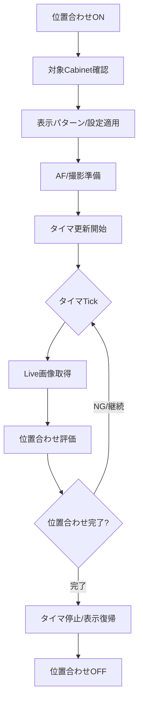
```mermaid
flowchart TD
    A[位置合わせON] --> B[対象Cabinet確認]
    B --> C[表示パターン/設定適用]
    C --> D[AF/撮影準備]
    D --> E[タイマ更新開始]
    E --> F{タイマTick}
    F --> G[Live画像取得]
    G --> H[位置合わせ評価]
    H --> I{位置合わせ完了?}
    I -->|NG/継続| F
    I -->|完了| J[タイマ停止/表示復帰]
    J --> K[位置合わせOFF]
```

#### 4-2-3. 処理手順

| 手順No. | 処理内容 | 入力 | 出力 | 操作対象 | 備考 |
|---------|----------|------|------|----------|------|
| 1 | 測定レベル設定 | モデル名 | m_MeasureLevel | Settings | B/Cモデル分岐 |
| 2 | 撮影条件選択 | カメラ名 | m_ShootCondition | Settings.GapCam | A6400/A7分岐 |
| 3 | 対象抽出 | Cabinet選択 | `lstTgtUnits`,`m_lstCamPosUnits` | 画面配列 | 矩形チェックあり |
| 4 | ThroughMode/表示制御 | targetUnits | 表示状態 | Controller | `SetThroughMode`,`outputGapCamTargetArea_EdgeExpand` |
| 5 | タイマ駆動補正 | live画像 | 位置補正ガイド | UI画像 | `timerGapCam_Tick` |

#### 4-2-4. 操作対象仕様（画面、テーブル、ファイル）

| 対象種別 | 対象名 | 操作内容 | 操作タイミング | 主キー/識別子 | 備考 |
|----------|--------|----------|----------------|---------------|------|
| 画面 | `tbtnGapCamSetPos` | ON/OFF切替 | ユーザー操作 | ToggleState | 実行中はタイマ連動 |
| 画面 | `imgGapCamCameraView` | ライブ表示更新 | タイマTick | ImageControl | 位置合わせ用 |
| 外部IF | Controller | パターン/画質設定 | 位置合わせ開始時 | ControllerID | 複数Controller対応 |

#### 4-2-5. インタフェース仕様（引数・返り値）

| 項目 | 内容 |
|------|------|
| インタフェース名 | 位置合わせ処理 |
| 概要 | 位置合わせ開始・更新・停止を制御 |
| シグネチャ | `unsafe private void tbtnGapCamSetPos_Click(object sender, RoutedEventArgs e)` |
| 呼出条件 | トグルON/OFF、タイマ更新 |

引数一覧

| No. | 引数名 | 型 | 必須 | 説明 | バリデーション |
|-----|--------|----|------|------|----------------|
| 1 | sender | object | Y | トリガUI | - |
| 2 | e | RoutedEventArgs | Y | イベント情報 | - |

返り値一覧

| No. | 項目名 | 型 | 説明 | 備考 |
|-----|--------|----|------|------|
| 1 | なし | void | UI制御のみ | 例外は通知 |

#### 4-2-6. 例外処理仕様

| No. | 例外/エラー条件 | 検知方法 | 対応内容 | ユーザー通知 | ログ出力 | リトライ/継続可否 |
|-----|------------------|----------|----------|--------------|----------|------------------|
| 1 | 設定値不正（距離/高さ等） | Parse失敗 | 位置合わせ停止 | CAS Error | 任意 | 可 |
| 2 | 位置合わせ中例外 | try-catch | ThroughMode解除・設定復帰 | CAS Error | 任意 | 可 |

#### 4-2-7. ログ仕様

| ログ種別 | 出力条件 | 出力項目 | 保持期間 | マスキング方針 |
|----------|----------|----------|----------|----------------|
| 実行ログ | ON/OFF、主要設定適用時 | LEDモデル、設定値、処理状態 | 測定フォルダ世代管理 | 機密値除外 |

### 4-3. MDL-GAP-003: GapMeasurementEngine

#### 4-3-1. 基本情報

| 項目 | 内容 |
|------|------|
| モジュールID | MDL-GAP-003 |
| モジュール名 | GapMeasurementEngine |
| 分類 | ビジネスロジック |
| 呼出元 | UIController |
| 呼出先 | CameraControl、OpenCv、ファイルI/O |
| トランザクション | 無 |
| 再実行性 | 可 |

#### 4-3-2. 処理フロー

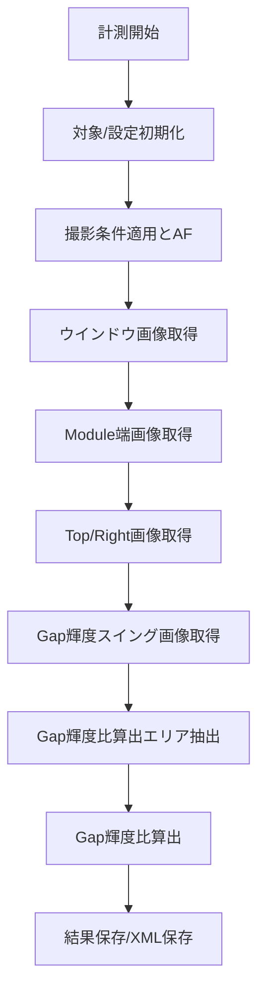
```mermaid
flowchart TD
    A[計測開始] --> B[対象/設定初期化]
    B --> C[撮影条件適用とAF]
    C --> D[ウインドウ画像取得]
    D --> E[Module端画像取得]
    E --> F[Top/Right画像取得]
    F --> G[Gap輝度スイング画像取得]
    G --> H[Gap輝度比算出エリア抽出]
    H --> I[Gap輝度比算出]
    I --> J[結果保存/XML保存]
```

#### 4-3-3. 処理手順

| 手順No. | 処理内容 | 入力 | 出力 | 操作対象 | 備考 |
|---------|----------|------|------|----------|------|
| 1 | 測定フォルダ作成 | 実行日時 | `m_CamMeasPath` | ファイルシステム | Gap_yyyyMMddHHmm |
| 2 | 設定保存 | 現在ユーザー設定 | `m_lstUserSetting` | Controller設定 | 後で復帰 |
| 3 | 撮影準備 | ShootCondition | カメラ設定反映 | CameraControl | `SetCameraSettings`,`AutoFocus` |
| 4 | 画像取得 | 対象Cabinet | 撮影画像 | カメラ/ファイル | 複数回撮影 |
| 5 | 解析 | 画像群 | Gap補正データ | OpenCv処理 | `storeGapCp` |
| 6 | 結果保存 | 解析データ | GapMeasResult.xml | ファイル | `GapCamCorrectionValue.SaveToXmlFile` |
| 7 | 復帰処理 | 一時設定 | 通常設定 | Controller | ThroughMode解除＋UserSetting復帰 |

#### 4-3-4. 操作対象仕様（画面、テーブル、ファイル）

| 対象種別 | 対象名 | 操作内容 | 操作タイミング | 主キー/識別子 | 備考 |
|----------|--------|----------|----------------|---------------|------|
| ファイル | Top/Right画像 | 出力/読込 | 計測実行中 | 連番ファイル名 | fn_Top/fn_Right |
| ファイル | GapMeasResult.xml | 出力 | 計測完了時 | パス | 補正値計算元 |
| 外部IF | CameraControl | 撮影/AF | 計測前〜中 | カメラ接続状態 | 失敗時例外 |

#### 4-3-5. インタフェース仕様（引数・返り値）

| 項目 | 内容 |
|------|------|
| インタフェース名 | measureGapAsync |
| 概要 | Gap計測主処理 |
| シグネチャ | `unsafe private void measureGapAsync(List<UnitInfo> lstTgtUnit)` |
| 呼出条件 | 計測開始ボタン |

引数一覧

| No. | 引数名 | 型 | 必須 | 説明 | バリデーション |
|-----|--------|----|------|------|----------------|
| 1 | lstTgtUnit | List<UnitInfo> | Y | 計測対象Cabinet群 | 空不可/矩形前提 |

返り値一覧

| No. | 項目名 | 型 | 説明 | 備考 |
|-----|--------|----|------|------|
| 1 | なし | void | 結果は内部状態/ファイルへ出力 | 例外で失敗通知 |

#### 4-3-6. 例外処理仕様

| No. | 例外/エラー条件 | 検知方法 | 対応内容 | ユーザー通知 | ログ出力 | リトライ/継続可否 |
|-----|------------------|----------|----------|--------------|----------|------------------|
| 1 | 撮影失敗 | CameraControl戻り/例外 | 処理中断 | CAS Error | saveLog | 可 |
| 2 | 解析失敗 | 画像解析例外 | 処理中断 | CAS Error | saveLog | 可 |
| 3 | 中断操作 | Abort例外 | 安全終了 | Abort表示 | saveLog | 可 |

#### 4-3-7. ログ仕様

| ログ種別 | 出力条件 | 出力項目 | 保持期間 | マスキング方針 |
|----------|----------|----------|----------|----------------|
| 計測ログ | 主要ステップ進行時 | ステップ名、対象、時刻 | 測定フォルダ世代管理 | 個人情報なし |

### 4-4. MDL-GAP-004: GapAdjustmentEngine

#### 4-4-1. 基本情報

| 項目 | 内容 |
|------|------|
| モジュールID | MDL-GAP-004 |
| モジュール名 | GapAdjustmentEngine |
| 分類 | ビジネスロジック |
| 呼出元 | UIController |
| 呼出先 | ControllerWriteService、表示更新 |
| トランザクション | 無 |
| 再実行性 | 可 |

#### 4-4-2. 処理フロー

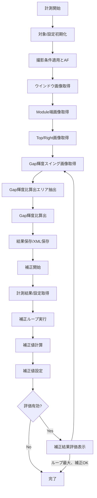
```mermaid
flowchart TD
    A[計測開始] --> B[対象/設定初期化]
    B --> C[撮影条件適用とAF]
    C --> D[ウインドウ画像取得]
    D --> E[Module端画像取得]
    E --> F[Top/Right画像取得]
    F --> G[Gap輝度スイング画像取得]
    G --> H[Gap輝度比算出エリア抽出]
    H --> I[Gap輝度比算出]
    I --> J[結果保存/XML保存]
    J --> K[補正開始] --> L[計測結果/設定取得]
    L --> P[補正ループ実行]
    P --> Q[補正値計算]
    Q --> R[補正値設定]
    R --> S{評価有効?}
    S -->|Yes| T[補正結果評価表示]
    T --> G
    S -->|No| U[結果表示更新]
    T --> |ループ最大、補正OK| U[完了]
```

#### 4-4-3. 処理手順

| 手順No. | 処理内容 | 入力 | 出力 | 操作対象 | 備考 |
|---------|----------|------|------|----------|------|
| 1 | 計測結果/補正条件取得 | 計測結果、UI設定 | `m_MaxNumOfAdjustment`,`m_EvaluateAdjustmentResult` | 内部状態、UI項目 | 計測結果未生成時はエラー |
| 2 | 補正実行 | 計測結果、対象Cabinet | 補正値更新 | 内部配列 | `adjustGapRegAsync` |
| 3 | 補正値計算 | 計測結果、現レジスタ/ゲイン | 新レジスタ値 | 補正データ | `calcNewRegCell` |
| 4 | 補正値反映 | 新補正値 | Controller設定状態 | SDCP | setGap*群 |
| 5 | 結果表示 | 計算結果 | Before/Result表示 | UI | `dispGapResult` |

#### 4-4-4. 操作対象仕様（画面、テーブル、ファイル）

| 対象種別 | 対象名 | 操作内容 | 操作タイミング | 主キー/識別子 | 備考 |
|----------|--------|----------|----------------|---------------|------|
| 画面 | 補正結果表示領域 | 更新 | 補正完了時 | DispType | Before/Result |
| 外部IF | Controller | 補正値設定 | 補正ループ中 | UnitInfo | CmdGapCorrectValueSet系 |
| ファイル | 実行ログ | 追記 | 補正中 | 測定フォルダ | stepログ |

#### 4-4-5. インタフェース仕様（引数・返り値）

| 項目 | 内容 |
|------|------|
| インタフェース名 | adjustGapRegAsync |
| 概要 | Gap輝度比計測結果に基づく補正主処理 |
| シグネチャ | `unsafe private void adjustGapRegAsync(List<UnitInfo> lstTgtUnit)` |
| 呼出条件 | 補正開始ボタン |

引数一覧

| No. | 引数名 | 型 | 必須 | 説明 | バリデーション |
|-----|--------|----|------|------|----------------|
| 1 | lstTgtUnit | List<UnitInfo> | Y | 補正対象Cabinet群 | 空不可、計測結果生成済み |

返り値一覧

| No. | 項目名 | 型 | 説明 | 備考 |
|-----|--------|----|------|------|
| 1 | なし | void | 内部状態更新 | 例外で失敗通知 |

#### 4-4-6. 例外処理仕様

| No. | 例外/エラー条件 | 検知方法 | 対応内容 | ユーザー通知 | ログ出力 | リトライ/継続可否 |
|-----|------------------|----------|----------|--------------|----------|------------------|
| 1 | 補正計算失敗 | 例外捕捉 | 処理停止 | CAS Error | saveLog | 可 |
| 2 | Controller反映失敗 | SDCP送信例外 | 処理停止 | CAS Error | saveLog | 可 |
| 3 | 中断操作 | Abort例外 | 安全停止 | Abort表示 | saveLog | 可 |

#### 4-4-7. ログ仕様

| ログ種別 | 出力条件 | 出力項目 | 保持期間 | マスキング方針 |
|----------|----------|----------|----------|----------------|
| 補正ログ | 補正ステップ進行時 | ステップ、対象、補正値 | 測定フォルダ世代管理 | 機密値除外 |

### 4-5. MDL-GAP-005: GapBackupRestoreService

#### 4-5-1. 基本情報

| 項目 | 内容 |
|------|------|
| モジュールID | MDL-GAP-005 |
| モジュール名 | GapBackupRestoreService |
| 分類 | データアクセス/IF |
| 呼出元 | UIController |
| 呼出先 | ファイルシステム、ControllerWriteService |
| トランザクション | 無 |
| 再実行性 | 可 |

#### 4-5-2. 処理フロー

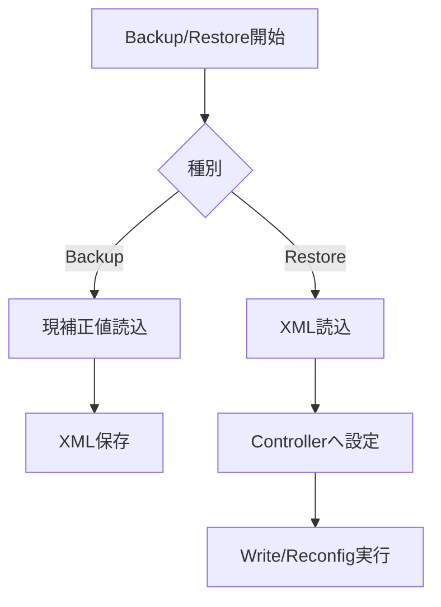
```mermaid
flowchart TD
    A[Backup/Restore開始] --> B{種別}
    B -->|Backup| C[現補正値読込]
    C --> D[XML保存]
    B -->|Restore| E[XML読込]
    E --> F[Controllerへ設定]
    F --> G[Write/Reconfig実行]
```

#### 4-5-3. 処理手順

| 手順No. | 処理内容 | 入力 | 出力 | 操作対象 | 備考 |
|---------|----------|------|------|----------|------|
| 1 | XMLパス確定 | ファイルダイアログ | path | OSダイアログ | LastBackupFileを初期値利用 |
| 2 | Backup実行 | path | XML | ファイルI/O | `backupGapRegAsync` |
| 3 | Restore実行 | path | 補正値適用状態 | 内部+Controller | `restoreGapRegAsync` |
| 4 | Bulk Restore | path | 一括適用状態 | 内部+Controller | `restoreBulkGapRegAsync` |
| 5 | Write確定 | 更新Cabinet | ROM反映 | ControllerWriteService | Reconfig含む |

#### 4-5-4. 操作対象仕様（画面、テーブル、ファイル）

| 対象種別 | 対象名 | 操作内容 | 操作タイミング | 主キー/識別子 | 備考 |
|----------|--------|----------|----------------|---------------|------|
| ファイル | Gap補正XML | 読込/書込 | Backup/Restore時 | path | UTF-8 XML |
| 外部IF | Controller | 復元後の確定書込み | Restore完了時 | UnitInfo | Write必須 |

#### 4-5-5. インタフェース仕様（引数・返り値）

| 項目 | 内容 |
|------|------|
| インタフェース名 | backupGapRegAsync / restoreGapRegAsync / restoreBulkGapRegAsync |
| 概要 | 補正値の保存・復元 |
| シグネチャ | `unsafe private void backupGapRegAsync(string path)` ほか |
| 呼出条件 | Backup/Restoreボタン押下 |

引数一覧

| No. | 引数名 | 型 | 必須 | 説明 | バリデーション |
|-----|--------|----|------|------|----------------|
| 1 | path | string | Y | XML保存/読込パス | 空/存在チェック |

返り値一覧

| No. | 項目名 | 型 | 説明 | 備考 |
|-----|--------|----|------|------|
| 1 | なし | void | UI側で成否通知 | 例外時失敗 |

#### 4-5-6. 例外処理仕様

| No. | 例外/エラー条件 | 検知方法 | 対応内容 | ユーザー通知 | ログ出力 | リトライ/継続可否 |
|-----|------------------|----------|----------|--------------|----------|------------------|
| 1 | XML読込失敗 | Load例外 | 処理停止 | CAS Error | 任意 | 可 |
| 2 | XML保存失敗 | Save例外 | 処理停止 | CAS Error | 任意 | 可 |
| 3 | 復元後書込み失敗 | Write処理失敗 | 処理停止 | CAS Error | 任意 | 可 |

#### 4-5-7. ログ仕様

| ログ種別 | 出力条件 | 出力項目 | 保持期間 | マスキング方針 |
|----------|----------|----------|----------|----------------|
| 実行ログ | Backup/Restore開始・終了 | path、件数、結果 | 測定フォルダ世代管理 | 個人情報なし |

### 4-6. MDL-GAP-006: GapControllerWriteService

#### 4-6-1. 基本情報

| 項目 | 内容 |
|------|------|
| モジュールID | MDL-GAP-006 |
| モジュール名 | GapControllerWriteService |
| 分類 | 外部IF |
| 呼出元 | AdjustmentEngine, BackupRestoreService |
| 呼出先 | Controller(SDCP) |
| トランザクション | 無 |
| 再実行性 | 条件付き可（再実行で復旧可能） |

#### 4-6-2. 処理フロー

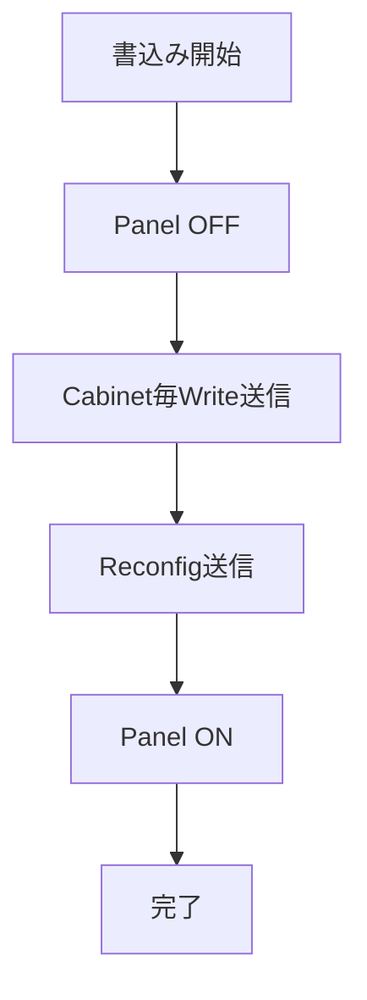
```mermaid
flowchart TD
    A[書込み開始] --> C[Panel OFF]
    C --> D[Cabinet毎Write送信]
    D --> E[Reconfig送信]
    E --> F[Panel ON]
    F --> G[完了]
```

#### 4-6-3. 処理手順

| 手順No. | 処理内容 | 入力 | 出力 | 操作対象 | 備考 |
|---------|----------|------|------|----------|------|
| 1 | 進捗初期化 | modifiedUnits数 | WholeSteps | Progress | 4 + Cabinet数 |
| 2 | Panel OFF | controller一覧 | 電源OFF状態 | Controller | 10秒待機 |
| 3 | Cabinet毎Write | Cabinet識別 | 書込み要求送信 | Controller | CmdGapCellCorrectWrite |
| 4 | Reconfig | 全Controller | 再構成完了 | Controller | Target=true設定後送信 |
| 5 | Panel ON | controller一覧 | 電源ON状態 | Controller | 終了 |

#### 4-6-4. 操作対象仕様（画面、テーブル、ファイル）

| 対象種別 | 対象名 | 操作内容 | 操作タイミング | 主キー/識別子 | 備考 |
|----------|--------|----------|----------------|---------------|------|
| 外部IF | Controller | 電源OFF/ON | 書込み前後 | IPAddress | 全Controller対象 |
| 外部IF | Controller | GapWriteコマンド | Cabinetループ中 | Port/Cabinet | lstModifiedUnits |
| 外部IF | Controller | Reconfig | Write後 | controller target | sendReconfig |

#### 4-6-5. インタフェース仕様（引数・返り値）

| 項目 | 内容 |
|------|------|
| インタフェース名 | writeGapCellCorrectionValueWithReconfig |
| 概要 | Controllerへの補正値確定反映 |
| シグネチャ | `private bool writeGapCellCorrectionValueWithReconfig()` |
| 呼出条件 | ROM書込みまたはRestore後 |

引数一覧

| No. | 引数名 | 型 | 必須 | 説明 | バリデーション |
|-----|--------|----|------|------|----------------|
| 1 | なし | - | - | 内部状態利用 | lstModifiedUnits非空推奨 |

返り値一覧

| No. | 項目名 | 型 | 説明 | 備考 |
|-----|--------|----|------|------|
| 1 | result | bool | true: 処理完了 | 例外時は上位で失敗扱い |

#### 4-6-6. 例外処理仕様

| No. | 例外/エラー条件 | 検知方法 | 対応内容 | ユーザー通知 | ログ出力 | リトライ/継続可否 |
|-----|------------------|----------|----------|--------------|----------|------------------|
| 1 | SDCP送信失敗 | 送信例外 | 処理停止 | CAS Error | 実行ログ | 可 |
| 2 | Reconfig失敗 | 応答/例外 | 処理停止 | CAS Error | 実行ログ | 可 |
| 3 | 電源制御失敗 | 応答/例外 | 処理停止 | CAS Error | 実行ログ | 可 |

#### 4-6-7. ログ仕様

| ログ種別 | 出力条件 | 出力項目 | 保持期間 | マスキング方針 |
|----------|----------|----------|----------|----------------|
| 実行ログ | Write開始〜終了 | Step、対象Cabinet、結果 | 測定フォルダ世代管理 | 機密値除外 |

---

## 5. コード仕様

### 5-1. コード一覧

| コード名称 | コード値 | 内容説明 | 利用箇所 | 備考 |
|------------|----------|----------|----------|------|
| GapStatus | Before | 補正前表示状態 | 結果表示 | enum |
| GapStatus | Result | 補正後表示状態 | 結果表示 | enum |
| GapStatus | Measure | 計測表示状態 | 結果表示 | enum |
| CaptureNum | 3 | 撮影回数 | 計測処理 | 定数 |
| GapTrimmingAreaMin | 50 | トリミング最小 | 解析処理 | 定数 |
| GapTrimmingAreaMax | 5000 | トリミング最大 | 解析処理 | 定数 |
| 補正初期値 | 128 | レジスタ初期値(100%相当) | Backup/Restore/補正 | GapCellCorrectValue |

### 5-2. コード定義ルール

| 項目 | ルール |
|------|--------|
| 補正値範囲 | `correctValue_Min`〜`correctValue_Max` にクリップ |
| Cabinet識別変換 | `PortNo`,`UnitNo` をSDCPコマンドバイトへ変換 |
| 条件コンパイル | `CameraPosition`,`BulkSetCorrectValue`,`Auto_WriteData` など運用定義に従う |

---

## 6. メッセージ仕様

### 6-1. メッセージ一覧

| メッセージ名称 | メッセージID | 種別 | 表示メッセージ | 内容説明 | 対応アクション |
|----------------|--------------|------|----------------|----------|----------------|
| 計測完了 | GAP-I-001 | 情報 | Measurement Gap Complete! | 計測成功 | OK |
| 計測失敗 | GAP-E-001 | 異常通知 | Failed in Measurement Gap. | 計測失敗 | 再実行 |
| 補正完了 | GAP-I-002 | 情報 | Adjustment Gap Complete! | 補正成功 | 結果確認 |
| 補正失敗 | GAP-E-002 | 異常通知 | Failed in Adjustment Gap. | 補正失敗 | 再実行 |
| ROM書込み完了 | GAP-I-003 | 情報 | Writing Gap correction value to ROM Complete! | 書込み成功 | OK |
| ROM書込み失敗 | GAP-E-003 | 異常通知 | Failed in writing Gap corection value to ROM. | 書込み失敗 | 再実行 |
| Backup完了 | GAP-I-004 | 情報 | Backup Gap Correction Values Complete! | 保存成功 | OK |
| Restore完了 | GAP-I-005 | 情報 | Restore Gap Correction Values Complete! | 復元成功 | OK |
| ユーザー中断 | GAP-W-001 | 警告 | Abort! | ユーザー中断 | 再実行 |

### 6-2. メッセージ運用ルール

| 項目 | ルール |
|------|--------|
| ID採番 | `GAP-{I/W/E}-連番` |
| 多言語対応 | 無（英語メッセージ固定） |
| 表示経路 | `WindowMessage` / `ShowMessageWindow` |

---

## 7. 関連システムインタフェース仕様

### 7-1. インタフェース一覧

| IF ID | I/O | インタフェースシステム名 | インタフェースファイル名 | インタフェースタイミング | インタフェース方法 | インタフェースエラー処理方法 | インタフェース処理のリラン定義 | インタフェース処理のロギングインタフェース |
|------|-----|--------------------------|--------------------------|--------------------------|--------------------|------------------------------|--------------------------------|------------------------------------------|
| IF-GAP-001 | OUT | CameraControl | DLL API | 位置合わせ/計測時 | メソッド呼び出し | 例外捕捉・処理停止 | オペレータ再実行 | saveLog |
| IF-GAP-002 | OUT | Controller | SDCPコマンド | 補正/書込み/表示時 | TCP送信 | 例外捕捉・処理停止 | オペレータ再実行 | saveLog |
| IF-GAP-003 | IN/OUT | ファイルシステム | XML/画像/ログ | 計測/Backup/Restore時 | ファイルI/O | 例外捕捉・処理停止 | パス修正後再実行 | saveLog |

### 7-2. インタフェースデータ項目定義

| IF ID | データ項目名 | データ項目の説明 | データ項目の位置 | 書式 | 必須 | エラー時の代替値 | 備考 |
|------|--------------|------------------|------------------|------|------|------------------|------|
| IF-GAP-001 | ShootCondition | 撮影条件 | API引数 | object | Y | なし | 機種別設定 |
| IF-GAP-002 | CmdGapCellCorrectValueSet | Cell補正設定コマンド | byte配列 | binary | Y | なし | Edge毎設定 |
| IF-GAP-002 | CmdGapCellCorrectWrite | ROM書込みコマンド | byte配列 | binary | Y | なし | Cabinet毎送信 |
| IF-GAP-003 | GapCamCorrectionValue[] | 補正バックアップデータ | XML要素 | UTF-8 XML | Y | なし | Save/Load対象 |

### 7-3. インタフェース処理シーケンス

#### 7-3-1. 補正値書込み処理シーケンス

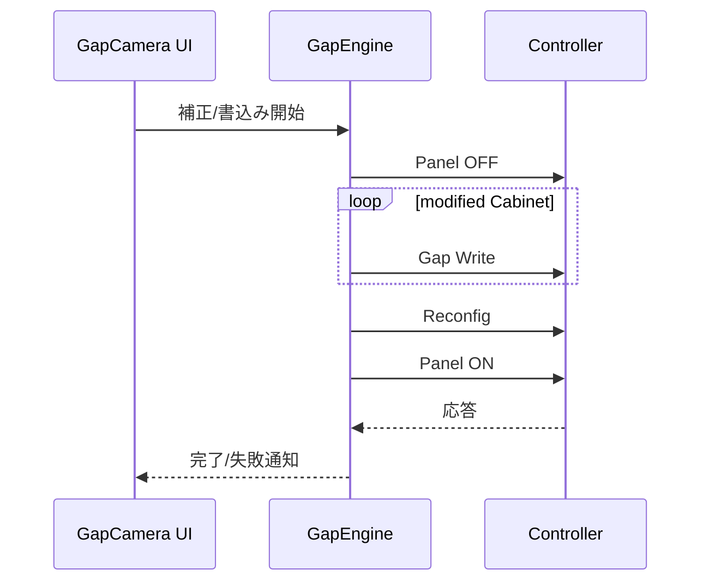
```mermaid
sequenceDiagram
    participant UI as GapCamera UI
    participant GAP as GapEngine
    participant CTRL as Controller

    UI->>GAP: 補正/書込み開始
    GAP->>CTRL: Panel OFF
    loop modified Cabinet
        GAP->>CTRL: Gap Write
    end
    GAP->>CTRL: Reconfig
    GAP->>CTRL: Panel ON
    CTRL-->>GAP: 応答
    GAP-->>UI: 完了/失敗通知
```

#### 7-3-2. 計測処理シーケンス

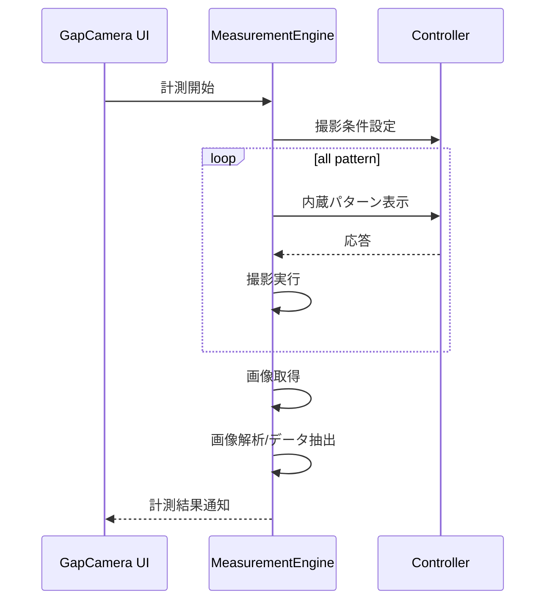
```mermaid
sequenceDiagram
    participant UI as GapCamera UI
    participant MEAS as MeasurementEngine
    participant CTRL as Controller

    UI->>MEAS: 計測開始
    MEAS->>CTRL: 撮影条件設定
    loop all pattern
        MEAS->>CTRL: 内蔵パターン表示
        CTRL-->>MEAS: 応答
        MEAS->>MEAS: 撮影実行
    end
    MEAS->>MEAS: 画像取得
    MEAS->>MEAS: 画像解析/データ抽出
    MEAS-->>UI: 計測結果通知
```

#### 7-3-3. 補正処理シーケンス

```mermaid
sequenceDiagram
    participant UI as GapCamera UI
    participant ADJ as AdjustmentEngine
    participant MEAS as MeasurementEngine
    participant CTRL as Controller

    UI->>ADJ: 補正開始
    ADJ->>MEAS: 計測開始
    MEAS->>CTRL: 撮影条件設定
    loop all pattern
        MEAS->>CTRL: 内蔵パターン表示
        CTRL-->>MEAS: 応答
        MEAS->>MEAS: 撮影実行
    end
    MEAS->>MEAS: 画像取得
    MEAS->>MEAS: 画像解析/データ抽出
    MEAS->>ADJ: Gap輝度比通知
    ADJ->>ADJ: Gap補正値算出
    ADJ->>CTRL: 補正値反映
    ADJ->>UI: 結果通知
```
---

## 8. メソッド仕様

本章は、UfCamera_詳細設計書と章立て・節建・粒度を合わせるため、以下の節順で記載する。

| 並び順 | 節 | 主担当モジュール | 主な責務 |
|--------|----|------------------|----------|
| 1 | 8-1 | MainWindow / GapCamera | UIイベント起点の制御処理 |
| 2 | 8-2 | GapCamera | 計測・補正の業務処理 |
| 3 | 8-3 | GapCamera / SDCPClass | 設定値の取得・設定・書込み |
| 4 | 8-4 | GapCamera | 補助計算と補正演算 |
| 5 | 8-5 | TransformImage | 連携モジュール呼出し |
| 6 | 8-6 | EstimateCameraPos | 姿勢推定連携メンバ定義 |
| 7 | 8-7 | UfCamera 参照節 | 相互参照方針と追従ルール |

### 8-1. UIイベント・制御メソッド

#### 8-1-1. btnGapCamBackup_Click

| 項目 | 内容 |
|------|------|
| シグネチャ | `private async void btnGapCamBackup_Click(object sender, RoutedEventArgs e)` |
| 概要 | 補正値バックアップ処理を開始する |

引数: `sender`, `e`  
返り値: なし（void）

処理概要（詳細）

| 手順No. | 処理内容 | 詳細 |
|---------|----------|------|
| 1 | 保存先選択ダイアログ表示 | `SaveFileDialog` を初期化し、前回保存先（`Settings.Ins.GapCam.LastBackupFile`）を優先表示する。 |
| 2 | 入力確定判定 | ユーザーが `OK` を選択した場合のみ後続処理を実行する。Cancel時は無処理終了。 |
| 3 | 実行準備 | `tcMain.IsEnabled = false`、`actionButton` 実行、進捗ウィンドウ表示を行う。 |
| 4 | バックアップ実行 | `Task.Run(() => backupGapRegAsync(path))` でXML書き出しを実行する。 |
| 5 | 終了処理 | 成否メッセージ表示、進捗ウィンドウClose、サウンド再生、`releaseButton`、`tcMain.IsEnabled = true` を実施する。 |

入力条件・前提条件

| 区分 | 条件 | NG時挙動 |
|------|------|----------|
| ファイルパス | 保存先パスが選択されていること | ダイアログを閉じて処理終了（エラーなし） |
| 保存先 | 指定先へ書込み可能であること | 例外を捕捉しエラー通知、失敗終了 |

主要呼出し先

| 呼出し先 | 役割 | 同期/非同期 |
|----------|------|--------------|
| `backupGapRegAsync` | Gap補正値のXMLバックアップを実行する | 非同期（`Task.Run`） |
| `WindowProgress` | 処理進捗を表示する | 同期 |
| `ShowMessageWindow` / `WindowMessage` | 異常と完了を通知する | 同期 |

例外時仕様

| ケース | 捕捉方法 | 通知 | 後処理 |
|--------|----------|------|--------|
| バックアップ実行失敗 | `Exception` | `CAS Error!` ダイアログ | `status=false`、エラーメッセージ表示、UI復帰 |

シーケンス図

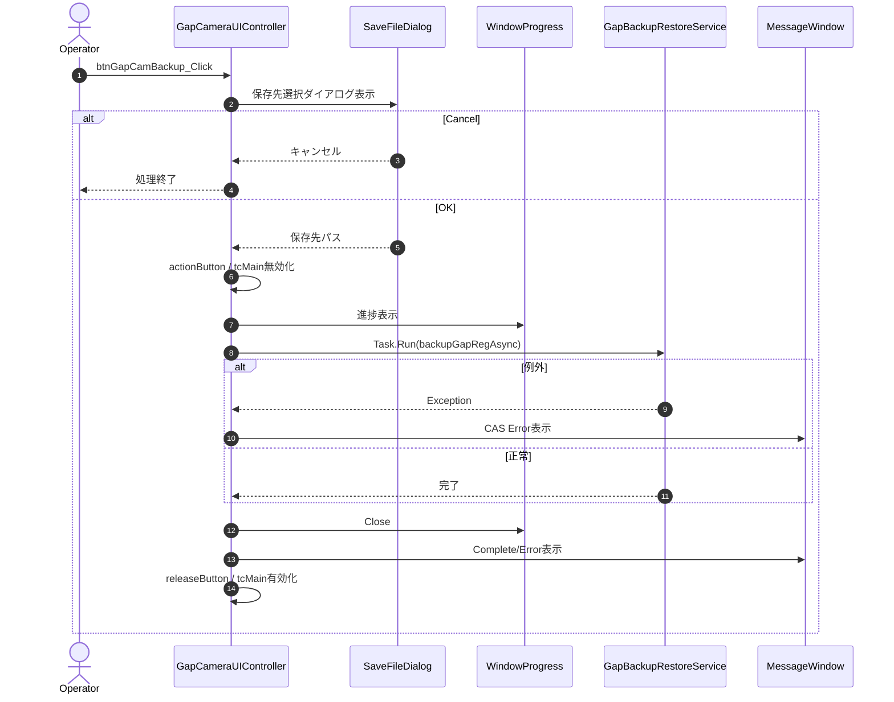
```mermaid
sequenceDiagram
    autonumber
    actor OP as Operator
    participant UI as GapCameraUIController
    participant DLG as SaveFileDialog
    participant PRG as WindowProgress
    participant BAK as GapBackupRestoreService
    participant MSG as MessageWindow

    OP->>UI: btnGapCamBackup_Click
    UI->>DLG: 保存先選択ダイアログ表示
    alt Cancel
        DLG-->>UI: キャンセル
        UI-->>OP: 処理終了
    else OK
        DLG-->>UI: 保存先パス
        UI->>UI: actionButton / tcMain無効化
        UI->>PRG: 進捗表示
        UI->>BAK: Task.Run(backupGapRegAsync)
        alt 例外
            BAK-->>UI: Exception
            UI->>MSG: CAS Error表示
        else 正常
            BAK-->>UI: 完了
        end
        UI->>PRG: Close
        UI->>MSG: Complete/Error表示
        UI->>UI: releaseButton / tcMain有効化
    end
```

#### 8-1-2. btnGapCamRestore_Click

| 項目 | 内容 |
|------|------|
| シグネチャ | `private async void btnGapCamRestore_Click(object sender, RoutedEventArgs e)` |
| 概要 | 補正値リストア（通常書込み）を開始する |

引数: `sender`, `e`  
返り値: なし（void）

処理概要（詳細）

| 手順No. | 処理内容 | 詳細 |
|---------|----------|------|
| 1 | 読込ファイル選択 | `OpenFileDialog` を表示し、前回利用ファイルを初期値に設定する。 |
| 2 | 入力確定判定 | `OK` 選択時のみ処理続行。Cancel時は無処理終了。 |
| 3 | 実行準備 | `tcMain.IsEnabled = false`、`actionButton` 実行、進捗ウィンドウ表示を行う。 |
| 4 | リストア実行 | 条件コンパイルにより実行先を切替える。`BulkSetCorrectValue` 有効時は `restoreBulkGapRegAsync`、無効時は `restoreGapRegAsync` を実行する。 |
| 5 | 終了処理 | 成否メッセージ表示、進捗ウィンドウClose、サウンド再生、`releaseButton`、`tcMain.IsEnabled = true` を実施する。 |

入力条件・前提条件

| 区分 | 条件 | NG時挙動 |
|------|------|----------|
| ファイル選択 | 読込元XMLが選択済みであること | ダイアログ終了で処理終了（エラーなし） |
| ファイル実体 | XMLファイルが存在しアクセス可能であること | 例外を捕捉しエラー通知、失敗終了 |

主要呼出し先

| 呼出し先 | 役割 | 同期/非同期 |
|----------|------|--------------|
| `restoreGapRegAsync` | 補正値復元を実行する - 通常設定 | 非同期（`Task.Run`） |
| `restoreBulkGapRegAsync` | 補正値復元を実行する - 一括設定 | 非同期（`Task.Run`） |
| `WindowProgress` | 処理進捗を表示する | 同期 |

例外時仕様

| ケース | 捕捉方法 | 通知 | 後処理 |
|--------|----------|------|--------|
| リストア実行失敗 | `Exception` | `CAS Error!` ダイアログ | `status=false`、エラーメッセージ表示、UI復帰 |

シーケンス図

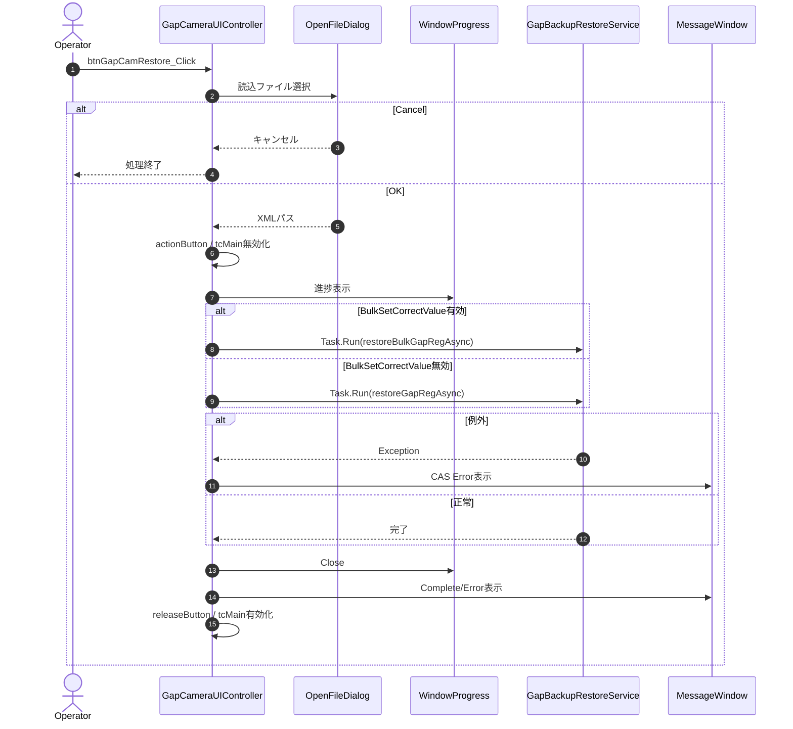
```mermaid
sequenceDiagram
    autonumber
    actor OP as Operator
    participant UI as GapCameraUIController
    participant DLG as OpenFileDialog
    participant PRG as WindowProgress
    participant RST as GapBackupRestoreService
    participant MSG as MessageWindow

    OP->>UI: btnGapCamRestore_Click
    UI->>DLG: 読込ファイル選択
    alt Cancel
        DLG-->>UI: キャンセル
        UI-->>OP: 処理終了
    else OK
        DLG-->>UI: XMLパス
        UI->>UI: actionButton / tcMain無効化
        UI->>PRG: 進捗表示
        alt BulkSetCorrectValue有効
            UI->>RST: Task.Run(restoreBulkGapRegAsync)
        else BulkSetCorrectValue無効
            UI->>RST: Task.Run(restoreGapRegAsync)
        end
        alt 例外
            RST-->>UI: Exception
            UI->>MSG: CAS Error表示
        else 正常
            RST-->>UI: 完了
        end
        UI->>PRG: Close
        UI->>MSG: Complete/Error表示
        UI->>UI: releaseButton / tcMain有効化
    end
```

#### 8-1-3. btnGapCamRestoreBulk_Click

| 項目 | 内容 |
|------|------|
| シグネチャ | `private async void btnGapCamRestoreBulk_Click(object sender, RoutedEventArgs e)` |
| 概要 | 補正値リストア（一括書込み）を開始する |

引数: `sender`, `e`  
返り値: なし（void）

処理概要（詳細）

| 手順No. | 処理内容 | 詳細 |
|---------|----------|------|
| 1 | 読込ファイル選択 | `OpenFileDialog` で復元対象XMLを選択する。 |
| 2 | 実行準備 | `tcMain.IsEnabled = false`、`actionButton` 実行、進捗ウィンドウ表示を行う。 |
| 3 | 一括復元実行 | `Task.Run(() => restoreBulkGapRegAsync(path))` で一括復元処理を実行する。 |
| 4 | 成否判定 | 例外有無で `status` を更新し、完了メッセージを切替える。 |
| 5 | 終了処理 | 進捗ウィンドウClose、サウンド再生、`releaseButton`、`tcMain.IsEnabled = true` を実施する。 |

入力条件・前提条件

| 区分 | 条件 | NG時挙動 |
|------|------|----------|
| ファイル選択 | 読込元XMLが選択済みであること | ダイアログ終了で処理終了（エラーなし） |
| ファイル実体 | XMLファイルが存在しアクセス可能であること | 例外を捕捉しエラー通知、失敗終了 |

主要呼出し先

| 呼出し先 | 役割 | 同期/非同期 |
|----------|------|--------------|
| `restoreBulkGapRegAsync` | 補正値復元を実行する - 一括設定 | 非同期（`Task.Run`） |
| `WindowProgress` | 処理進捗を表示する | 同期 |
| `WindowMessage` | 完了と失敗を通知する | 同期 |

例外時仕様

| ケース | 捕捉方法 | 通知 | 後処理 |
|--------|----------|------|--------|
| 一括復元失敗 | `Exception` | `CAS Error!` ダイアログ | `status=false`、失敗通知、UI復帰 |

シーケンス図

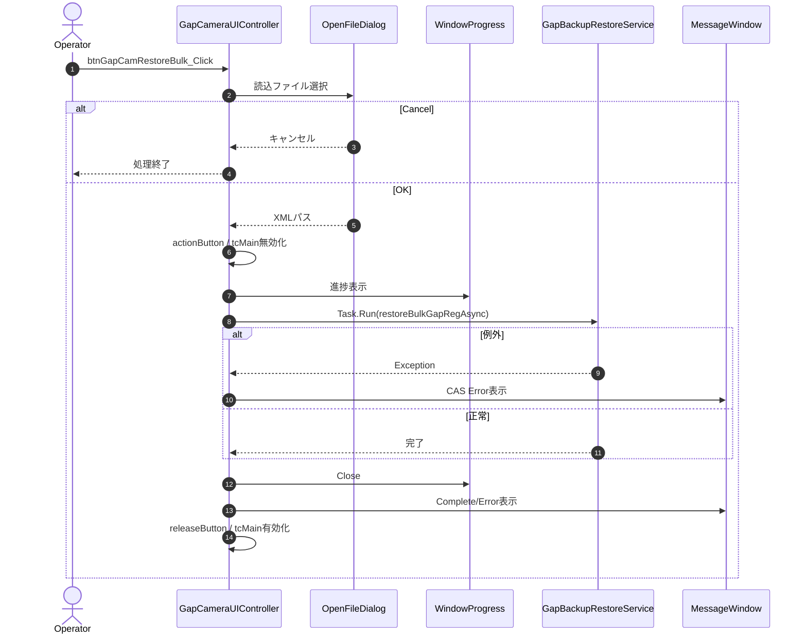
```mermaid
sequenceDiagram
    autonumber
    actor OP as Operator
    participant UI as GapCameraUIController
    participant DLG as OpenFileDialog
    participant PRG as WindowProgress
    participant RST as GapBackupRestoreService
    participant MSG as MessageWindow

    OP->>UI: btnGapCamRestoreBulk_Click
    UI->>DLG: 読込ファイル選択
    alt Cancel
        DLG-->>UI: キャンセル
        UI-->>OP: 処理終了
    else OK
        DLG-->>UI: XMLパス
        UI->>UI: actionButton / tcMain無効化
        UI->>PRG: 進捗表示
        UI->>RST: Task.Run(restoreBulkGapRegAsync)
        alt 例外
            RST-->>UI: Exception
            UI->>MSG: CAS Error表示
        else 正常
            RST-->>UI: 完了
        end
        UI->>PRG: Close
        UI->>MSG: Complete/Error表示
        UI->>UI: releaseButton / tcMain有効化
    end
```

#### 8-1-4. tbtnGapCamSetPos_Click

| 項目 | 内容 |
|------|------|
| シグネチャ | `unsafe private void tbtnGapCamSetPos_Click(object sender, RoutedEventArgs e)` |
| 概要 | カメラ位置合わせモードの開始/停止を制御する |

引数: `sender`, `e`  
返り値: なし（void）

処理概要（詳細）

| 手順No. | 処理内容 | 詳細 |
|---------|----------|------|
| 1 | 初期設定 | 操作音再生、LEDモデルに応じた測定レベル設定、カメラ種別に応じた撮影条件設定を行う。 |
| 2 | ON時の対象検証 | `tbtnGapCamSetPos.IsChecked == true` の場合に `CheckSelectedUnits(..., out m_lstCamPosUnits, true)` を実行し、対象妥当性を確認する。 |
| 3 | ON時のカメラ位置合わせ準備 | 画質設定対象コントローラ選定、ユーザー設定退避、調整設定適用、AF実行、`SetCamPosTarget` 実行を行う。 |
| 4 | ON時の表示遷移 | `tcGapCamView.SelectedIndex = 1` へ切替え、`timerGapCam.Enabled = true` で周期更新を開始する。 |
| 5 | OFF時処理 | OFF遷移時は `txtbStatus.Text = "Done."` を設定し、周期停止後の復帰処理は他経路（Tick内例外処理や開始側停止処理）で実施する。 |

入力条件・前提条件

| 区分 | 条件 | NG時挙動 |
|------|------|----------|
| 対象選択 | 位置合わせ対象Cabinetが矩形で選択されていること | エラー表示、トグルOFF、`tcGapCamView=0` で終了 |
| カメラ/制御系 | AF、設定反映、内部信号出力が可能であること | 例外捕捉後に設定復帰と信号停止を実行して終了 |

主要呼出し先

| 呼出し先 | 役割 | 同期/非同期 |
|----------|------|--------------|
| `CheckSelectedUnits` | 位置合わせ対象の妥当性を検証する | 同期 |
| `getUserSettingSetPos` / `setAdjustSettingSetPos` | 位置合わせ用画質設定を退避・適用する | 同期 |
| `AutoFocus` | AFを実行する | 同期 |
| `SetCamPosTarget` | 目標位置マーカーを生成する | 同期 |

例外時仕様

| ケース | 捕捉方法 | 通知 | 後処理 |
|--------|----------|------|--------|
| 対象検証失敗 | `CheckSelectedUnits` 例外 | `CAS Error!` ダイアログ | トグルOFF、タブ0へ復帰 |
| 位置合わせ準備失敗 | `Exception` | `CAS Error!` ダイアログ | ThroughMode解除、ユーザー設定復元、内部信号OFF |

シーケンス図

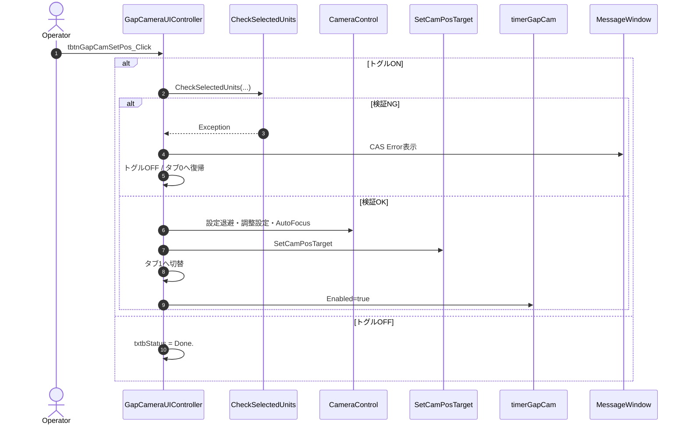
```mermaid
sequenceDiagram
    autonumber
    actor OP as Operator
    participant UI as GapCameraUIController
    participant VAL as CheckSelectedUnits
    participant CAM as CameraControl
    participant POS as SetCamPosTarget
    participant TMR as timerGapCam
    participant MSG as MessageWindow

    OP->>UI: tbtnGapCamSetPos_Click
    alt トグルON
        UI->>VAL: CheckSelectedUnits(...)
        alt 検証NG
            VAL-->>UI: Exception
            UI->>MSG: CAS Error表示
            UI->>UI: トグルOFF / タブ0へ復帰
        else 検証OK
            UI->>CAM: 設定退避・調整設定・AutoFocus
            UI->>POS: SetCamPosTarget
            UI->>UI: タブ1へ切替
            UI->>TMR: Enabled=true
        end
    else トグルOFF
        UI->>UI: txtbStatus = Done.
    end
```

#### 8-1-5. SetCamPosTarget

| 項目 | 内容 |
|------|------|
| シグネチャ | `void SetCamPosTarget(ImageType_CamPos imageType = ImageType_CamPos.LiveView, bool log = false, List<UnitInfo> lstUnit = null, double zDistanceSpec = 0)` |
| 概要 | 選択された補正対象 Unit の配置から 3D→2D 透視変換を用いてカメラ位置を決定し、撮影時の画像座標範囲・Z距離チェック・はみ出し判定を実行する |

引数

| No. | 引数名 | 型 | 必須 | 説明 |
|-----|--------|----|------|------|
| 1 | imageType | ImageType_CamPos | N | 撮影画像タイプ（`LiveView` or `JPEG`）、内部状態 `m_ImageType_CamPos` へ記録 |
| 2 | log | bool | N | ログ出力を有効にするかのフラグ（デバッグ用） |
| 3 | lstUnit | List<UnitInfo> | N | Z距離・はみ出しチェック対象の Unit リスト（null 時はスキップ） |
| 4 | zDistanceSpec | double | N | 許容最大 Z 距離の仕様値（0 時は遠すぎチェックをスキップ） |

返り値: なし（void）

処理概要（詳細）

| 手順No. | 処理内容 | 詳細 |
|---------|----------|------|
| 1 | 入力画像タイプ記録 | `m_ImageType_CamPos = imageType` を設定。`imageType == LiveView` 時は `CameraParameter(f=16.0, SensorResH=1024, SensorResV=680)`、`JPEG` 時は `CameraParameter(f=16.0, SensorResH=3008, SensorResV=2000)` を選択する。 |
| 2 | 対象Unit範囲計算 | `m_lstCamPosUnits` を走査して X/Y の最小値・最大値から `startX/endX/startY/endY` を算出し、Cabinet 枚数 `m_CabinetXNum_CamPos / m_CabinetYNum_CamPos` を決定する。 |
| 3 | LEDモデル判定 | `allocInfo.LEDModel`（P12 or P15）に応じて Cabinet/Module サイズ `m_CabinetDx/Dy`、`m_ModuleDx/Dy` を設定、モジュール数 `m_ModuleXNum / m_ModuleYNum` を計算する。 |
| 4 | 撮像素子有効範囲設定 | ユーザー設定 `Settings.Ins.GapCam.CamPos_SizeMin/Max` に応じた撮影倍率を定義し、`tgtCamPos_canUse`（各隅の有効範囲座標）を設定する。 |
| 5 | Cabinet座標と高さ計算 | `allocInfo.lstUnits[startX][startY]` から Cabinet 幅/高さを取得、対象 Wall の垂直サイズ・オフセットを計算、`InstallationWallBottomHeight`・`TargetWallCenterHeight`・`CameraPosHeight` を決定する。 |
| 6 | 3D→2D変換設定 | 補正対象 Cabinet の4隅の 3D座標を 25%・75% 位置で取得し、`TransformImage` オブジェクトへ登録、カメラパラメータ・平行移動・回転（あおり角度 `tiltAngle`）を設定する。 |
| 7 | 基準撮影座標計算 | `transform.Calc()` を実行して 3D→2D 変換を行い、`tgtCamPos`（TopLeft/TopRight/BottomRight/BottomLeft の画像座標）に結果を格納する。 |
| 8 | 防抖動判定 | 撮影領域の横/縦サイズが撮像素子の 30% 未満の場合、`m_PreventionHanting = true` を設定する。 |
| 9 | 規格撮影座標計算 | `CamPos_SizeMin/Max` に応じた Z距離で再度 `transform.Calc()` を実行し、横線長・縦線長を `tgtCamPos_HorLineSpec / tgtCamPos_VerLineSpec` へ格納する。 |
| 10 | Z距離チェック初期化 | 補正対象 Unit が存在する場合、各Unit の 3D 頂点から最大・最小 Z距離を計算し、後段のチェック用に `longestZ`・`shortestZ` を初期化する。 |
| 11 | Z距離チェック実行 | `lstUnit != null` 時、各Unit について最大 Z距離が `zDistanceSpec` を超えないか、最小 Z距離が `m_WorkDistance * 0.86` 未満でないかをチェックし、違反時は例外を送出する。 |
| 12 | 撮影エリア内チェック | 補正対象Unit の変換結果が `tgtCamPos_canUse` 内に完全に収まっていることをチェックし、はみ出しがある場合は例外を送出する。 |

入力条件・前提条件

| 区分 | 条件 | NG時挙動 |
|------|------|----------|
| 対象Unit | `m_lstCamPosUnits.Count > 0` であること | `tgtCamPos = null` を設定して return |
| LEDモデル | `allocInfo.LEDModel` が P12 または P15 であること | 処理スキップ（`tgtCamPos = null`） |
| 座標情報 | `allocInfo.lstUnits[x][y].CabinetPos` が有効であること | 3D→2D変換で異常終了 |
| Z距離仕様 | `zDistanceSpec > 0` または `lstUnit != null` であること | チェック項目を条件分岐で選別 |

主要状態更新

| 状態変数 | 更新内容 | 更新タイミング |
|----------|----------|----------------|
| `m_ImageType_CamPos` | 撮影画像タイプを記録 | 手順1 |
| `tgtCamPos` | 補正対象 Cabinet の撮影画像座標（4隅）を更新 | 手順7 |
| `tgtCamPos_canUse` | 撮像素子の有効範囲座標を更新 | 手順4 |
| `tgtCamPos_HorLineSpec / VerLineSpec` | 仕様書所定の倍率別に計算した横/縦線長を更新 | 手順9 |
| `m_PreventionHanting` | 防抖動フラグを更新 | 手順8 |

条件分岐仕様

| 条件 | 挙動 |
|------|------|
| `imageType == LiveView / JPEG` | カメラパラメータ（解像度）を切り替える。 |
| `allocInfo.LEDModel == P12 or P15` | Cabinet/Module サイズと幾何係数 `k` を設定する。 |
| `NO_CONTROLLER` | 幾何係数 `k` を HP224 規格に合わせて計算、座標をスケーリングする。 |
| `cameraPosDefault == true` | `CameraPosHeight = TargetWallCenterHeight`（デフォルト高さ）を使用。 |
| `cameraPosDefault == false` | `CameraPosHeight`・`InstallationWallBottomHeight` をユーザー設定値から取得。 |
| `lstUnit != null` | Z距離・はみ出しチェックを実行する（null時スキップ）。 |
| `TempFile` | 中間結果（Cabinet 座標・画像座標のCSV）をファイル出力する。 |

主要呼出し先

| 呼出し先 | 役割 | 同期/非同期 |
|----------|------|--------------|
| `SetCabinetPos` | 対象Unit の Cabinet 3D座標を計算 | 同期 |
| `MoveCabinetPos` | 平行移動・回転後の Cabinet 座標を更新 | 同期 |
| `TransformImage.Calc()` | 3D→2D 透視変換を実行 | 同期 |

例外時仕様（中断含む）

| ケース | 捕捉方法 | 通知/伝播 | 後処理 |
|--------|----------|-----------|--------|
| Z距離が長すぎ | `longestZ > zDistanceSpec` 判定 | Exception 送出 | 撮影設定見直し要求 |
| Z距離が短すぎ | `shortestZ < m_WorkDistance * 0.86` 判定 | Exception 送出 | 撮影設定見直し要求 |
| 撮影エリアからはみ出し | `imageXMin/Max, imageYMin/Max` との比較 | Exception 送出 | Cabinet 選択や高さ調整を要求 |
| 座標計算失敗 | `TransformImage.Calc()` 下位例外 | 呼出元へ再送出 | 処理中断 |

シーケンス図

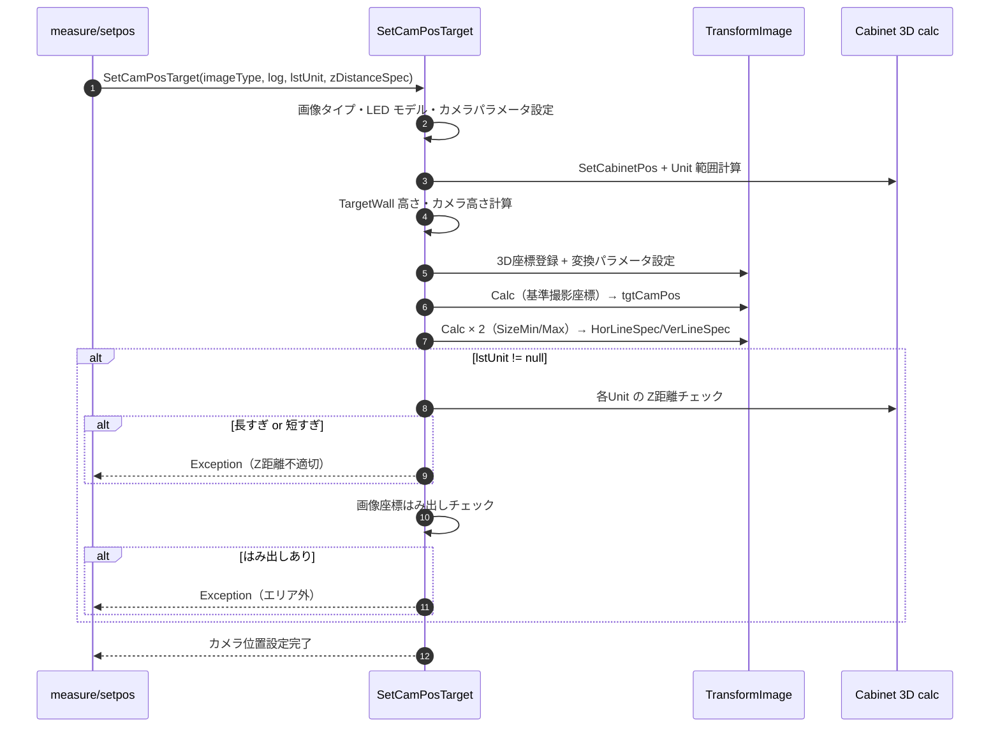
```mermaid
sequenceDiagram
    autonumber
    participant M as measure/setpos
    participant S as SetCamPosTarget
    participant T as TransformImage
    participant C as Cabinet 3D calc

    M->>S: SetCamPosTarget(imageType, log, lstUnit, zDistanceSpec)
    S->>S: 画像タイプ・LED モデル・カメラパラメータ設定
    S->>C: SetCabinetPos + Unit 範囲計算
    S->>S: TargetWall 高さ・カメラ高さ計算
    S->>T: 3D座標登録 + 変換パラメータ設定
    S->>T: Calc（基準撮影座標）→ tgtCamPos
    S->>T: Calc × 2（SizeMin/Max）→ HorLineSpec/VerLineSpec
    alt lstUnit != null
        S->>C: 各Unit の Z距離チェック
        alt 長すぎ or 短すぎ
            S-->>M: Exception（Z距離不適切）
        end
        S->>S: 画像座標はみ出しチェック
        alt はみ出しあり
            S-->>M: Exception（エリア外）
        end
    end
    S-->>M: カメラ位置設定完了
```

#### 8-1-6. timerGapCam_Tick

| 項目 | 内容 |
|------|------|
| シグネチャ | `private void timerGapCam_Tick(object sender, EventArgs e)` |
| 概要 | 位置合わせ中の周期更新処理を実行する |

引数: `sender`, `e`  
返り値: なし（void）

処理概要（詳細）

| 手順No. | 処理内容 | 詳細 |
|---------|----------|------|
| 1 | タイマ再入防止 | `CameraPosition` 有効時は先頭で `timerGapCam.Enabled = false` とし、重複実行を防止する。 |
| 2 | 位置合わせ更新 | `AdjustCameraPosition`（または旧系 `SetPosMain`）を呼び出し、ライブ表示とガイド評価を更新する。 |
| 3 | 例外時の設定復帰 | ThroughMode解除、ユーザー設定復元、内部信号OFFを実行する。 |
| 4 | 位置合わせ停止 | タイマ停止、トグルOFF、`tbtnGapCamSetPos_Click` 呼び出しで停止遷移を確定する。 |
| 5 | エラー通知 | `CAS Error!` ダイアログを表示する。 |

入力条件・前提条件

| 区分 | 条件 | NG時挙動 |
|------|------|----------|
| 位置合わせ状態 | `tbtnGapCamSetPos` がONで周期更新対象が有効であること | 例外時に停止処理へ遷移 |
| 画像入力/制御系 | ライブビュー取得と制御コマンド実行が可能であること | 例外時に設定復帰し停止 |

主要呼出し先

| 呼出し先 | 役割 | 同期/非同期 |
|----------|------|--------------|
| `AdjustCameraPosition` / `SetPosMain` | 位置合わせを更新する | 同期 |
| `SetThroughMode` / `setUserSettingSetPos` | 例外時に設定を復帰する | 同期 |
| `stopIntSig` | 内部信号を停止する | 同期 |

例外時仕様

| ケース | 捕捉方法 | 通知 | 後処理 |
|--------|----------|------|--------|
| 位置合わせ更新例外 | `Exception` | `CAS Error!` ダイアログ | 設定復帰、停止遷移、トグルOFF |

シーケンス図

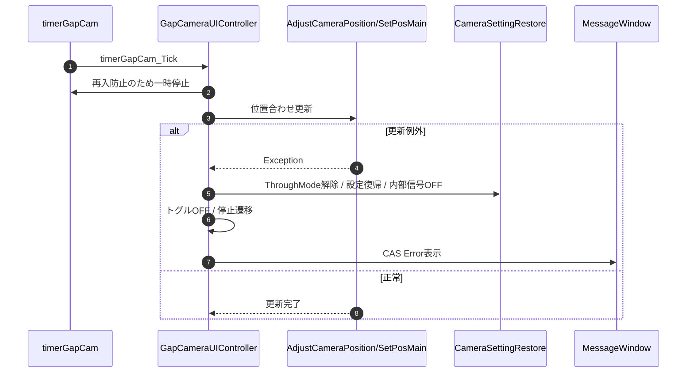
```mermaid
sequenceDiagram
    autonumber
    participant TMR as timerGapCam
    participant UI as GapCameraUIController
    participant POS as AdjustCameraPosition/SetPosMain
    participant SET as CameraSettingRestore
    participant MSG as MessageWindow

    TMR->>UI: timerGapCam_Tick
    UI->>TMR: 再入防止のため一時停止
    UI->>POS: 位置合わせ更新
    alt 更新例外
        POS-->>UI: Exception
        UI->>SET: ThroughMode解除 / 設定復帰 / 内部信号OFF
        UI->>UI: トグルOFF / 停止遷移
        UI->>MSG: CAS Error表示
    else 正常
        POS-->>UI: 更新完了
    end
```

#### 8-1-7. btnGapCamMeasStart_Click

| 項目 | 内容 |
|------|------|
| シグネチャ | `private async void btnGapCamMeasStart_Click(object sender, RoutedEventArgs e)` |
| 概要 | Gap計測処理を開始する |

引数: `sender`, `e`  
返り値: なし（void）

処理概要（詳細）

| 手順No. | 処理内容 | 詳細 |
|---------|----------|------|
| 1 | 二重起動抑止付き開始処理 | `actionButton` を呼び出し、計測開始状態へ遷移する。 |
| 2 | 対象Cabinet検証 | `CheckSelectedUnits(aryUnitGapCam, out lstTgtUnit, true, out m_lstCamPosUnits, true)` を実行し、選択不備・矩形不成立を検出する。 |
| 3 | 進捗ウィンドウ初期化 | `WindowProgress("Measurement Gap Progress", 180, 400, TAbortType.Measurement)` を表示し、開始メッセージを出力する。 |
| 4 | 位置合わせモード停止 | `tbtnGapCamSetPos` または `timerGapCam` が有効な場合、位置合わせを停止して通常設定へ復帰する。必要時は待機フラグを立てる。 |
| 5 | 画面排他・表示切替 | `tcMain.IsEnabled = false`、`clearGapResult(DispType.Measure)`、`tcGapCamView.SelectedIndex = 4` を実行し、計測画面へ遷移する。 |
| 6 | 計測作業ディレクトリ準備 | `m_CamMeasPath` を日時ベースで生成し、未存在時はディレクトリを作成する。 |
| 7 | 進捗タイマ開始 | `initialGapCameraMeasurementProcessSec` で概算秒数を算出し、残り時間タイマを開始する。 |
| 8 | 計測主処理の非同期実行 | `Task.Run(() => measureGapAsync(lstTgtUnit))` を実行する。`finally` で ThroughMode 解除・ユーザー設定復元を必ず実施する。 |
| 9 | 例外ハンドリング | `CameraCasUserAbortException` は中断扱い（Abort通知）、その他例外はエラー扱い（CAS Error通知）とし、`status` を失敗に設定する。 |
| 10 | 終了処理 | 進捗タイマ停止、完了/失敗メッセージ表示、必要時 `dispGapResult(true)`、進捗ウィンドウClose、サウンド再生、`releaseButton`、`tcMain.IsEnabled = true` を実行する。 |

入力条件・前提条件

| 区分 | 条件 | NG時挙動 |
|------|------|----------|
| 対象選択 | 計測対象Cabinetが選択済みで矩形成立していること | 例外メッセージ表示後、`tcGapCamView.SelectedIndex = 0` に戻して処理終了 |
| 位置合わせ状態 | 計測開始時に位置合わせ更新処理が停止可能であること | 停止/復帰失敗時はエラー表示して処理終了 |
| 出力先 | `m_CamMeasPath` 配下の保存先が作成可能であること | 作成不可時は例外として失敗終了 |

UI状態遷移

| タイミング | `tcMain.IsEnabled` | `tcGapCamView.SelectedIndex` | `winProgress` |
|------------|--------------------|------------------------------|---------------|
| 開始前 | true | 現在値 | 非表示 |
| 計測開始直後 | false | 4（計測ページ） | 表示（残り時間タイマ開始） |
| 正常終了 | true | 4（結果表示継続） | Close |
| 異常/中断終了 | true | 4（失敗結果表示あり） | Close |

主要呼出し先

| 呼出し先 | 役割 | 同期/非同期 |
|----------|------|--------------|
| `CheckSelectedUnits` | 対象Cabinetの妥当性を検証する | 同期 |
| `tbtnGapCamSetPos_Click` | 位置合わせ停止へ遷移する | 同期 |
| `clearGapResult` | Gap計測結果表示を初期化する | 同期 |
| `initialGapCameraMeasurementProcessSec` | 進捗見積り時間を算出する | 同期 |
| `saveLog` | 計測開始と作業ディレクトリ生成を記録する | 同期 |
| `measureGapAsync` | Gap計測主処理を実行する | 非同期（`Task.Run`） |
| `SetThroughMode` / `setUserSetting` | カメラ設定を通常状態へ復帰する | 同期（`finally`で保証） |
| `dispGapResult` | 失敗時結果表示を更新する | 同期 |

例外時仕様（中断含む）

| ケース | 捕捉方法 | 通知 | 後処理 |
|--------|----------|------|--------|
| ユーザー中断 | `CameraCasUserAbortException` | `Abort!` ダイアログ | `status=false`、`winProgress.Operation=None`、UI復帰 |
| 業務/システム例外 | `Exception` | `CAS Error!` ダイアログ | `status=false`、失敗結果表示、UI復帰 |
| 事前検証エラー | `CheckSelectedUnits` の例外 | `CAS Error!` ダイアログ | タブ復帰、ボタン解放、処理未実行で終了 |

シーケンス図

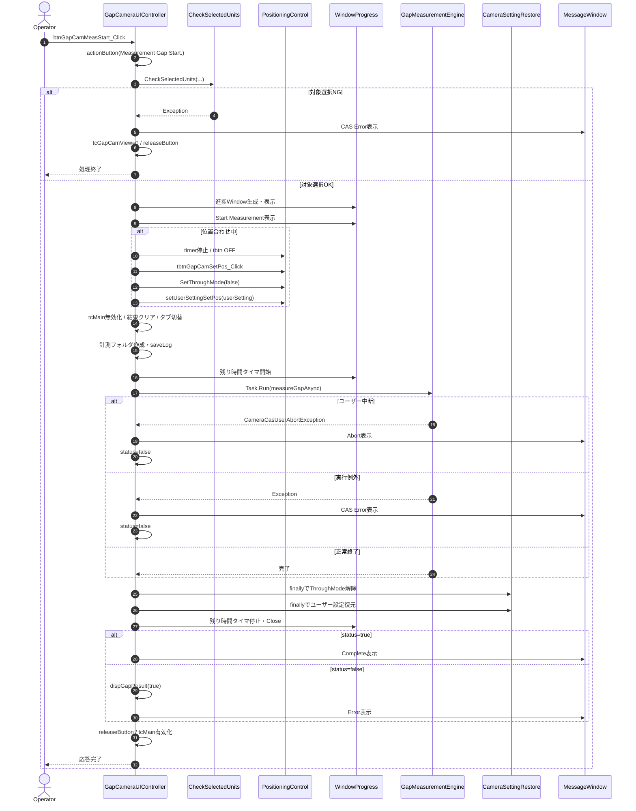
```mermaid
sequenceDiagram
    autonumber
    actor OP as Operator
    participant UI as GapCameraUIController
    participant VAL as CheckSelectedUnits
    participant POS as PositioningControl
    participant PRG as WindowProgress
    participant MEAS as GapMeasurementEngine
    participant SET as CameraSettingRestore
    participant MSG as MessageWindow

    OP->>UI: btnGapCamMeasStart_Click
    UI->>UI: actionButton(Measurement Gap Start.)
    UI->>VAL: CheckSelectedUnits(...)

    alt 対象選択NG
        VAL-->>UI: Exception
        UI->>MSG: CAS Error表示
        UI->>UI: tcGapCamView=0 / releaseButton
        UI-->>OP: 処理終了
    else 対象選択OK
        UI->>PRG: 進捗Window生成・表示
        UI->>PRG: Start Measurement表示

        alt 位置合わせ中
            UI->>POS: timer停止 / tbtn OFF
            UI->>POS: tbtnGapCamSetPos_Click
            UI->>POS: SetThroughMode(false)
            UI->>POS: setUserSettingSetPos(userSetting)
        end

        UI->>UI: tcMain無効化 / 結果クリア / タブ切替
        UI->>UI: 計測フォルダ作成・saveLog
        UI->>PRG: 残り時間タイマ開始

        UI->>MEAS: Task.Run(measureGapAsync)
        alt ユーザー中断
            MEAS-->>UI: CameraCasUserAbortException
            UI->>MSG: Abort表示
            UI->>UI: status=false
        else 実行例外
            MEAS-->>UI: Exception
            UI->>MSG: CAS Error表示
            UI->>UI: status=false
        else 正常終了
            MEAS-->>UI: 完了
        end

        UI->>SET: finallyでThroughMode解除
        UI->>SET: finallyでユーザー設定復元

        UI->>PRG: 残り時間タイマ停止・Close
        alt status=true
            UI->>MSG: Complete表示
        else status=false
            UI->>UI: dispGapResult(true)
            UI->>MSG: Error表示
        end

        UI->>UI: releaseButton / tcMain有効化
        UI-->>OP: 応答完了
    end
```

#### 8-1-8. btnGapCamAdjStart_Click

| 項目 | 内容 |
|------|------|
| シグネチャ | `private async void btnGapCamAdjStart_Click(object sender, RoutedEventArgs e)` |
| 概要 | 計測完了後のGap補正処理を開始する |

引数: `sender`, `e`  
返り値: なし（void）

処理概要（詳細）

| 手順No. | 処理内容 | 詳細 |
|---------|----------|------|
| 1 | 開始処理・対象検証 | `actionButton` 実行後、`CheckSelectedUnits(..., true, out m_lstCamPosUnits, true)` で対象妥当性を確認する。 |
| 2 | 進捗UI初期化 | `WindowProgress("Adjustment Gap Progress", 180, 400, TAbortType.Adjustment)` を表示し、計測フォルダ作成と開始ログ出力を行う。 |
| 3 | 位置合わせ停止 | 位置合わせ中はタイマ停止・トグルOFF・`tbtnGapCamSetPos_Click` 実行で停止し、必要に応じて設定復帰を行う。 |
| 4 | 画面排他・表示準備 | `tcMain.IsEnabled = false`、結果表示クリア、`tcGapCamView.SelectedIndex = 2` へ遷移する。 |
| 5 | 補正主処理実行 | 調整回数・評価フラグを読込み、`Task.Run(() => adjustGapRegAsync(lstTgtUnit))` を実行する。 |
| 6 | finally復帰 | `m_lstUserSetting != null` の場合、ThroughMode解除とユーザー設定復元を必ず実行する。 |
| 7 | 終了処理 | 成否メッセージ表示、必要時 `dispGapResult(true)`、`btnGapCamRomStart.IsEnabled` 制御、`tcMain.IsEnabled = true` を実施する。 |

入力条件・前提条件

| 区分 | 条件 | NG時挙動 |
|------|------|----------|
| 対象選択 | 補正対象Cabinetが矩形で選択されていること | エラー表示、タブ0へ復帰、ボタン解放で終了 |
| 設定入力 | `comboBoxGapCameraNumOfAdjustment` が数値変換可能であること | 例外扱いで失敗終了 |
| 出力先 | 計測フォルダ作成が可能であること | 例外扱いで失敗終了 |

主要呼出し先

| 呼出し先 | 役割 | 同期/非同期 |
|----------|------|--------------|
| `CheckSelectedUnits` | 対象Cabinetの妥当性を検証する | 同期 |
| `tbtnGapCamSetPos_Click` | 位置合わせ停止へ遷移する | 同期 |
| `clearGapResult` | Gap補正結果表示を初期化する | 同期 |
| `adjustGapRegAsync` | Gap補正主処理を実行する | 非同期（`Task.Run`） |
| `initialGapCameraAdjustmentProcessSec` | 進捗見積り時間を算出する | 同期 |
| `saveLog` | 補正開始と進捗準備を記録する | 同期 |
| `SetThroughMode` / `setUserSetting` | `finally` で設定を復帰する | 同期 |
| `initialGapCameraROMWriteProcessSec` | Auto_WriteData 時のROM書込み進捗見積りを算出する | 同期 |
| `romSaveAsync` | Auto_WriteData 有効時にROM書込みを実行する | 非同期（`Task.Run`） |
| `dispGapResult` | 失敗時結果表示を更新する | 同期 |

例外時仕様（中断含む）

| ケース | 捕捉方法 | 通知 | 後処理 |
|--------|----------|------|--------|
| ユーザー中断 | `CameraCasUserAbortException` | `Abort!` ダイアログ | `status=false`、`winProgress.Operation=None`、UI復帰 |
| 業務/システム例外 | `Exception` | `CAS Error!` ダイアログ | `status=false`、失敗結果表示、UI復帰 |

条件分岐仕様（`Auto_WriteData`）

| 条件 | 挙動 |
|------|------|
| `Auto_WriteData` 有効 | 補正完了後に確認ダイアログを表示し、Yes選択時は `romSaveAsync` を続行実行する。 |
| `Auto_WriteData` 無効 | 補正完了メッセージを表示し、`Write Data` ボタン押下待ちに遷移する。 |

シーケンス図

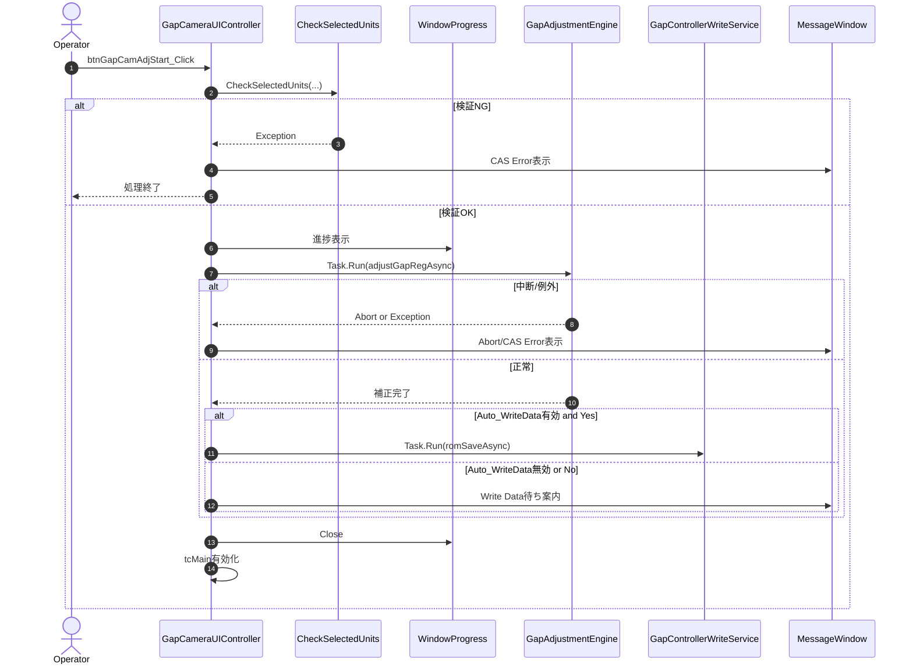
```mermaid
sequenceDiagram
    autonumber
    actor OP as Operator
    participant UI as GapCameraUIController
    participant VAL as CheckSelectedUnits
    participant PRG as WindowProgress
    participant ADJ as GapAdjustmentEngine
    participant ROM as GapControllerWriteService
    participant MSG as MessageWindow

    OP->>UI: btnGapCamAdjStart_Click
    UI->>VAL: CheckSelectedUnits(...)
    alt 検証NG
        VAL-->>UI: Exception
        UI->>MSG: CAS Error表示
        UI-->>OP: 処理終了
    else 検証OK
        UI->>PRG: 進捗表示
        UI->>ADJ: Task.Run(adjustGapRegAsync)
        alt 中断/例外
            ADJ-->>UI: Abort or Exception
            UI->>MSG: Abort/CAS Error表示
        else 正常
            ADJ-->>UI: 補正完了
            alt Auto_WriteData有効 and Yes
                UI->>ROM: Task.Run(romSaveAsync)
            else Auto_WriteData無効 or No
                UI->>MSG: Write Data待ち案内
            end
        end
        UI->>PRG: Close
        UI->>UI: tcMain有効化
    end
```

#### 8-1-9. btnGapCamRomStart_Click

| 項目 | 内容 |
|------|------|
| シグネチャ | `private async void btnGapCamRomStart_Click(object sender, RoutedEventArgs e)` |
| 概要 | ROM書込み処理を開始する |

引数: `sender`, `e`  
返り値: なし（void）

処理概要（詳細）

| 手順No. | 処理内容 | 詳細 |
|---------|----------|------|
| 1 | 開始処理 | `actionButton` を実行し、ROM書込み開始状態へ遷移する。 |
| 2 | 位置合わせ停止 | `timerGapCam` 有効時は停止し、トグルOFFと `tbtnGapCamSetPos_Click` を呼び出して待機フラグを設定する。 |
| 3 | 画面排他・対象検証 | `tcMain.IsEnabled = false` 後、`CheckSelectedUnits` で対象Cabinet妥当性を検証する。 |
| 4 | 書込み実行 | `tcGapCamView.SelectedIndex = 3` へ遷移し、進捗ウィンドウ表示後に `Task.Run(() => romSaveAsync(lstTgtUnit))` を実行する。 |
| 5 | 終了処理 | 成否メッセージ表示、必要時 `dispGapResult(true)`、進捗Close、`releaseButton`、`tcMain.IsEnabled = true` を実施する。 |

入力条件・前提条件

| 区分 | 条件 | NG時挙動 |
|------|------|----------|
| 対象選択 | 書込み対象Cabinetが選択済みであること | エラー表示、タブ0へ復帰、ボタン解放、UI復帰 |
| 前段処理 | 補正値がROM書込み可能な状態であること | `romSaveAsync` 側例外として失敗終了 |

主要呼出し先

| 呼出し先 | 役割 | 同期/非同期 |
|----------|------|--------------|
| `CheckSelectedUnits` | 書込み対象の妥当性を検証する | 同期 |
| `romSaveAsync` | ROM書込み主処理を実行する | 非同期（`Task.Run`） |
| `dispGapResult` | 失敗時結果表示を更新する | 同期 |

例外時仕様

| ケース | 捕捉方法 | 通知 | 後処理 |
|--------|----------|------|--------|
| 対象検証エラー | `CheckSelectedUnits` 例外 | `CAS Error!` ダイアログ | タブ0復帰、ボタン解放、UI復帰 |
| ROM書込み失敗 | `Exception` | `CAS Error!` ダイアログ | `status=false`、失敗表示、UI復帰 |

シーケンス図

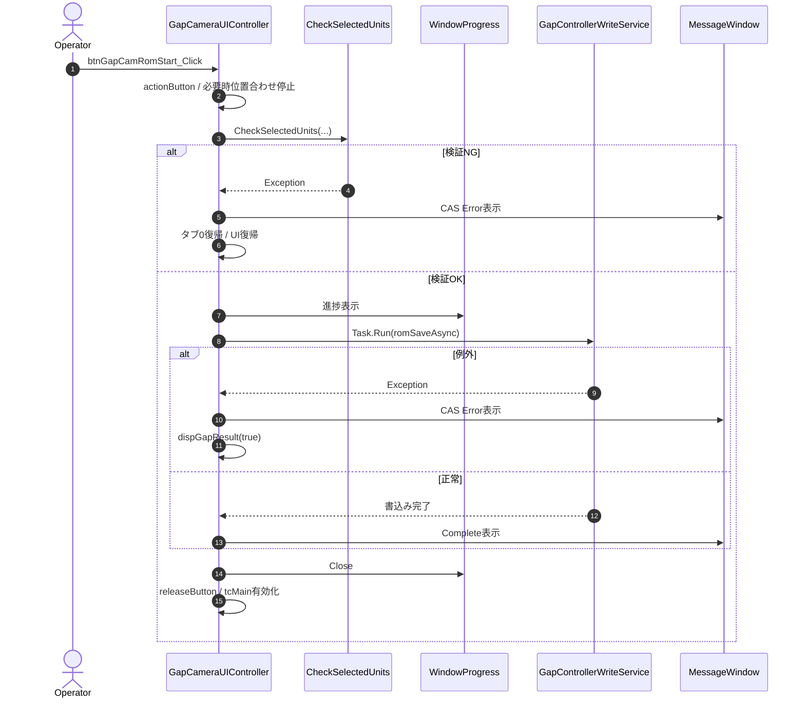
```mermaid
sequenceDiagram
    autonumber
    actor OP as Operator
    participant UI as GapCameraUIController
    participant VAL as CheckSelectedUnits
    participant PRG as WindowProgress
    participant ROM as GapControllerWriteService
    participant MSG as MessageWindow

    OP->>UI: btnGapCamRomStart_Click
    UI->>UI: actionButton / 必要時位置合わせ停止
    UI->>VAL: CheckSelectedUnits(...)
    alt 検証NG
        VAL-->>UI: Exception
        UI->>MSG: CAS Error表示
        UI->>UI: タブ0復帰 / UI復帰
    else 検証OK
        UI->>PRG: 進捗表示
        UI->>ROM: Task.Run(romSaveAsync)
        alt 例外
            ROM-->>UI: Exception
            UI->>MSG: CAS Error表示
            UI->>UI: dispGapResult(true)
        else 正常
            ROM-->>UI: 書込み完了
            UI->>MSG: Complete表示
        end
        UI->>PRG: Close
        UI->>UI: releaseButton / tcMain有効化
    end
```

#### 8-1-10. AdjustCameraPosition

| 項目 | 内容 |
|------|------|
| シグネチャ | `private void AdjustCameraPosition(System.Windows.Forms.Timer timer, System.Windows.Controls.Image img, ToggleButton tbtn)` |
| 概要 | 位置合わせ用の撮影・タイル検出・姿勢推定を実行し、ガイド表示と次工程可否を更新する |

引数

| No. | 引数名 | 型 | 必須 | 説明 |
|-----|--------|----|------|------|
| 1 | timer | System.Windows.Forms.Timer | Y | 位置合わせ更新周期を制御するタイマ |
| 2 | img | System.Windows.Controls.Image | Y | 処理画像とガイドを表示するImageコントロール |
| 3 | tbtn | ToggleButton | Y | 位置合わせON/OFF状態を持つトグル |

返り値: なし（void）

処理概要（詳細）

| 手順No. | 処理内容 | 詳細 |
|---------|----------|------|
| 1 | タイマ停止・作業パス初期化 | 冒頭で `timer.Enabled = false` とし、`black/raster/tile` の作業ファイルパスを初期化する。 |
| 2 | 撮影/検出 | `captureCamPos`、`detectTileCamPos`、`detectSatAreaCamPos` を実行し、位置合わせ素材を取得する。 |
| 3 | タイル整列と姿勢推定 | `getTilePosition` でタイル格子を整列し、`estimateCamPos` と `MoveCabinetPos` でPan/Tilt/Roll・XYZを推定する。 |
| 4 | 判定/UI反映 | 規格内判定に応じて `textboxGapCamPos` と矢印UIを更新し、`btnGapCamMeasStart`/`btnGapCamAdjStart` の可否を切替える。 |
| 5 | 終了判定 | トグル状態を再確認し、OFF時はThroughMode解除・設定復帰・内部信号OFFを実行する。ON時はタイマを再開する。 |

入力条件・前提条件

| 区分 | 条件 | NG時挙動 |
|------|------|----------|
| 位置合わせ状態 | ThroughModeと位置合わせ用設定が事前に有効化されていること | 撮影/表示失敗として終了処理へ遷移 |
| 表示先 | `img` が有効な表示コントロールであること | 処理画像表示に失敗し下位例外 |
| 幾何情報 | `m_CabinetXNum_CamPos`、`m_CabinetYNum_CamPos`、規格値群が設定済みであること | 姿勢推定または判定で異常 |

主要状態更新

| 状態変数 | 更新内容 | 更新タイミング |
|----------|----------|----------------|
| `m_CamPos_*` | Pan/Tilt/Roll、XYZ、辺長 | 手順3 |
| `m_Enable_Capture_MaskImage` | 次回黒/ラスター再取得要否 | 判定結果に応じて更新 |
| `textboxGapCamPos` | `OK/NG` と色 | 手順4 |
| `btnGapCamMeasStart` / `btnGapCamAdjStart` | 次工程の活性/非活性 | 手順4 |

条件分岐仕様

| 条件 | 挙動 |
|------|------|
| `NO_CONTROLLER` | ThroughMode解除や内部信号OFFをスキップする。 |
| `tbtnGapCamSetPos.IsChecked != true` | 中断扱いで復帰処理を実行し、その時点で終了する。 |
| 規格判定OK | `textboxGapCamPos = OK`、次工程を有効化する。 |
| 規格判定NG | ガイド矢印と `NG` 表示を更新し、通常モードでは次工程を無効化する。 |

主要呼出し先

| 呼出し先 | 役割 | 同期/非同期 |
|----------|------|--------------|
| `captureCamPos` | 位置合わせ用画像を取得する | 同期 |
| `detectTileCamPos` / `detectSatAreaCamPos` | タイルと飽和領域を抽出する | 同期 |
| `getTilePosition` | タイル点を行列整列する | 同期 |
| `estimateCamPos` / `MoveCabinetPos` | カメラ姿勢を推定し座標へ反映する | 同期 |
| `SetThroughMode` / `setUserSettingSetPos` / `stopIntSig` | 位置合わせ終了時の設定復帰と信号停止を実行する | 同期 |

例外時仕様

| ケース | 捕捉方法 | 通知 | 後処理 |
|--------|----------|------|--------|
| 撮影/検出失敗 | `try-catch` | `CAS Error!` ダイアログ | トグルOFF、タブ復帰、ThroughMode解除、設定復帰、内部信号OFF |
| タイル整列失敗 | `try-catch` | UIガイド更新不可 | 処理継続で再試行機会を残す |

シーケンス図

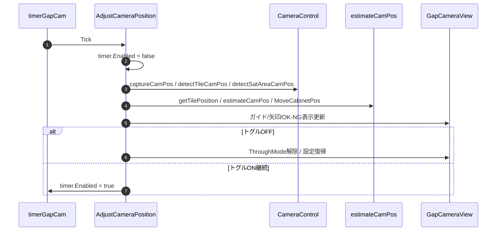
```mermaid
sequenceDiagram
    autonumber
    participant T as timerGapCam
    participant M as AdjustCameraPosition
    participant CAM as CameraControl
    participant ANA as estimateCamPos
    participant UI as GapCameraView

    T->>M: Tick
    M->>M: timer.Enabled = false
    M->>CAM: captureCamPos / detectTileCamPos / detectSatAreaCamPos
    M->>ANA: getTilePosition / estimateCamPos / MoveCabinetPos
    M->>UI: ガイド/矢印/OK-NG表示更新
    alt トグルOFF
        M->>UI: ThroughMode解除 / 設定復帰
    else トグルON継続
        M->>T: timer.Enabled = true
    end
```

### 8-2. 業務処理メソッド

#### 8-2-1. measureGapAsync

| 項目 | 内容 |
|------|------|
| シグネチャ | `unsafe private void measureGapAsync(List<UnitInfo> lstTgtUnit)` |
| 概要 | Gap計測の主処理（撮影・解析・結果保存）を実行する |

引数

| No. | 引数名 | 型 | 必須 | 説明 |
|-----|--------|----|------|------|
| 1 | lstTgtUnit | List<UnitInfo> | Y | 計測対象Cabinet一覧 |

返り値: なし（void）

処理概要（詳細）

| 手順No. | 処理内容 | 詳細 |
|---------|----------|------|
| 1 | 計測状態初期化 | `m_GapStatus = GapStatus.Measure`、`m_AdjustCount = 0`、`clearGapResult(DispType.Measure)` を実行する。 |
| 2 | 対象範囲算出・ログ出力 | `lstTgtUnit` からX/Y最小最大を算出し、対象Cabinet範囲をログ出力する。 |
| 3 | 進捗・ワーク領域初期化 | `winProgress.SetWholeSteps(66)`、`lstGapCamCp` 初期化、OpenCvSharp DLL存在確認を行う。 |
| 4 | 計測条件決定 | LEDモデルに応じて `m_MeasureLevel` を決定し、カメラ機種に応じて `m_ShootCondition` を設定する。 |
| 5 | レイアウト幾何情報算出 | 対象Cabinetの行列数、Cabinet/Module寸法、Panel寸法を算出し、対象モデル外の場合は処理を終了する。 |
| 6 | コントローラ準備 | 対象コントローラ抽出、Cabinet ON、ユーザー設定退避、調整設定適用、Layout情報OFFを実施する。 |
| 7 | オートフォーカス実行 | 進捗更新後、チェッカ信号出力とAFを実行し、必要時はAF画像（ARW/バイナリ）を保存する。 |
| 8 | 開始時カメラ姿勢取得 | `SetCamPosTarget` 後に `GetCameraPosition` を最大3回試行し、不適切姿勢時はエラーとする。 |
| 9 | 撮影処理 | `captureGapImages(m_CamMeasPath)` を実行して必要画像を取得する。 |
| 10 | 解析処理 | 中断不可状態へ遷移後、`calcGapGain(lstTgtUnit, m_CamMeasPath)` で補正計算用データを生成する。 |
| 11 | 終了時カメラ姿勢取得 | 終了時姿勢を最大3回試行で取得し、不適切姿勢時はエラー扱いとする。 |
| 12 | 設定復帰・表示更新 | ThroughMode解除、ユーザー設定復元、`dispGapResult()`、基準信号出力、ログ世代管理、完了ログ出力を実施する。 |

入力条件・前提条件

| 区分 | 条件 | NG時挙動 |
|------|------|----------|
| 対象一覧 | `lstTgtUnit` が有効で対象矩形が成立していること | 下位処理例外として呼出元へ送出 |
| 実行環境 | OpenCvSharp DLL、カメラ、コントローラ通信が利用可能であること | 例外を送出し上位で異常終了 |
| モデル定義 | LEDモデルがP12/P15系の想定モデルであること | 条件分岐で処理中断（早期return） |

主要状態更新

| 状態変数 | 更新内容 | 更新タイミング |
|----------|----------|----------------|
| `m_GapStatus` | `Measure` に設定 | 処理開始時 |
| `m_AdjustCount` | `0` に初期化 | 処理開始時 |
| `m_MeasureLevel` | LEDモデル別レベル値 | 計測条件決定時 |
| `m_ShootCondition` | カメラ機種別撮影条件 | 計測条件決定時 |
| `m_lstUserSetting` | 退避設定の一時保持/復帰後null化 | 設定退避時/復帰完了時 |

主要呼出し先

| 呼出し先 | 役割 | 同期/非同期 |
|----------|------|--------------|
| `CheckOpenCvSharpDll` | 解析ライブラリ事前検証 | 同期 |
| `outputGapCamTargetArea_EdgeExpand` | 対象コントローラ抽出 | 同期 |
| `getUserSetting` / `setAdjustSetting` / `setUserSetting` | 画質設定を退避・適用・復元する | 同期 |
| `AutoFocus` | AFを実行する | 同期 |
| `SetCamPosTarget` / `GetCameraPosition` | カメラ位置基準を設定し姿勢を取得する | 同期 |
| `captureGapImages` | 計測画像を取得する | 同期 |
| `calcGapGain` | 画像解析と補正値算出用データを生成する | 同期 |
| `dispGapResult` | 計測結果表示を更新する | 同期 |

条件分岐仕様

| 条件 | 挙動 |
|------|------|
| `NO_CONTROLLER` | コントローラ設定変更・内部信号制御をスキップする。 |
| `NO_CAP` | 実撮影/AF画像保存をスキップし、擬似待機中心の流れで進行する。 |
| `appliMode == Developer` | カメラ位置不適合時も一部例外送出を抑止して継続可能。 |

例外時仕様

| ケース | 捕捉方法 | 通知/伝播 | 後処理 |
|--------|----------|-----------|--------|
| OpenCV・I/O・通信失敗 | 下位処理から `Exception` | 呼出元へ再送出 | 呼出元のcatch/finallyでUI復帰 |
| ユーザー中断 | `CameraCasUserAbortException`（下位処理由来） | 呼出元へ再送出 | 呼出元でAbort通知 |
| カメラ位置不適合 | 姿勢取得結果判定 | `Exception` 送出（Developerモード除く） | 計測中断 |

シーケンス図

```mermaid
sequenceDiagram
    autonumber
    participant UI as btnGapCamMeasStart_Click
    participant MEAS as measureGapAsync
    participant CTRL as Controller/SDCP
    participant CAM as CameraControl
    participant ANA as calcGapGain
    participant DISP as GapResultView

    UI->>MEAS: Task.Run(measureGapAsync(lstTgtUnit))
    MEAS->>MEAS: 状態初期化・条件決定
    MEAS->>CTRL: 対象抽出/電源ON/調整設定
    MEAS->>CAM: AutoFocus
    MEAS->>CAM: 開始時カメラ姿勢取得(最大3回)
    alt 姿勢不適合(非Developer)
        CAM-->>MEAS: NG
        MEAS-->>UI: Exception
    else 姿勢OK
        CAM-->>MEAS: OK
        MEAS->>CAM: captureGapImages
        MEAS->>ANA: calcGapGain
        MEAS->>CAM: 終了時カメラ姿勢取得(最大3回)
        MEAS->>CTRL: ThroughMode解除/設定復帰
        MEAS->>DISP: dispGapResult
        MEAS-->>UI: 完了
    end
```

#### 8-2-2. adjustGapRegAsync

| 項目 | 内容 |
|------|------|
| シグネチャ | `unsafe private void adjustGapRegAsync(List<UnitInfo> lstTgtUnit)` |
| 概要 | Gap計測結果に基づく補正の主処理（補正値算出・反映）を実行する |

引数

| No. | 引数名 | 型 | 必須 | 説明 |
|-----|--------|----|------|------|
| 1 | lstTgtUnit | List<UnitInfo> | Y | 計測済みの補正対象Cabinet一覧 |

返り値: なし（void）

処理概要（詳細）

| 手順No. | 処理内容 | 詳細 |
|---------|----------|------|
| 1 | 補正状態初期化 | `m_GapStatus = GapStatus.Before`、`m_AdjustCount = 0`、表示クリア（Before/Result）を実行する。 |
| 2 | 対象範囲算出・進捗初期化 | 対象Cabinet範囲をログ出力し、`winProgress.SetWholeSteps(64)` を設定する。 |
| 3 | 補正条件決定 | OpenCV DLL確認、LEDモデル別 `m_MeasureLevel`、カメラ別 `m_ShootCondition`、レイアウト幾何情報を設定する。 |
| 4 | コントローラ準備 | 対象コントローラ抽出、Cabinet ON、ユーザー設定退避、調整設定適用、Layout情報OFFを行う。 |
| 5 | AF・開始姿勢取得 | AF実行後、`SetCamPosTarget` と `GetCameraPosition`（最大3回）で開始姿勢を検証する。 |
| 6 | 初期撮影・初期解析 | 補正無効状態で基準画像撮影（`captureGapImages`）し、`calcGapGain` で初期偏差を算出する。 |
| 7 | 初期結果保存 | `GapBeforeResult.xml` を保存し、結果表示へ切替える。 |
| 8 | 補正ループ実行 | 最大 `m_MaxNumOfAdjustment` 回で、補正値計算・書込み・再撮影・再解析・CSV結果保存を実施する。 |
| 9 | 規格判定 | 各辺の `GapGain` を `AdjustSpec`（またはZ距離仕様）で判定し、全点規格内で早期終了する。 |
| 10 | 仕上げ撮影・最終保存 | 必要時に白画像を撮影し、`GapAdjustResult.xml` を保存する。 |
| 11 | 設定復帰 | ThroughMode解除、ユーザー設定復元、信号出力復帰、ログ世代管理を実施する。 |
| 12 | 結果確定 | `btnGapCamRomStart` を有効化し、評価結果をUIへ反映する。 |

入力条件・前提条件

| 区分 | 条件 | NG時挙動 |
|------|------|----------|
| 対象一覧 | `lstTgtUnit` が有効で対象矩形が成立していること | 下位例外として呼出元へ送出 |
| 実行環境 | カメラ撮影・SDCP通信・OpenCV解析が可能であること | 例外送出で補正中断 |
| 調整設定 | `m_MaxNumOfAdjustment`、`m_EvaluateAdjustmentResult` が事前設定済みであること | 呼出元側で失敗扱い |

主要状態更新

| 状態変数 | 更新内容 | 更新タイミング |
|----------|----------|----------------|
| `m_GapStatus` | `Before` → `Result` へ遷移 | 補正前初期化時/各ループ終了時 |
| `m_AdjustCount` | 0からループ回数を加算 | 補正ループ中 |
| `lstGapCamCp` | 補正対象・計測結果・補正値を保持 | 初期解析後〜ループ終了 |
| `lstModifiedUnits` | 書込み対象Unit一覧を保持 | 補正値反映時 |
| `m_lstUserSetting` | 設定退避・復帰後null化 | 設定退避時/復帰完了時 |

主要呼出し先

| 呼出し先 | 役割 | 同期/非同期 |
|----------|------|--------------|
| `captureGapImages` | 補正前/補正後の撮影 | 同期 |
| `calcGapGain` | Gap輝度比解析 | 同期 |
| `calcNewRegCell` | 新規補正値算出 | 同期 |
| `setGapCellCorrectValue` / `setGapCvCellBulk` | 補正値反映（単発/一括） | 同期 |
| `setGapCellCorrectValueForXML` | XML保存用値反映 | 同期 |
| `GapCamCorrectionValue.SaveToXmlFile` | `GapBeforeResult.xml` / `GapAdjustResult.xml` 保存 | 同期 |

条件分岐仕様

| 条件 | 挙動 |
|------|------|
| `m_EvaluateAdjustmentResult == false` | 補正値反映後の再測定を省略し、ループを早期終了する。 |
| `BulkSetCorrectValue` | 初回補正時にModule単位一括書込みを優先する。 |
| `Spec_by_Zdistance` | 判定閾値をCabinet位置別スペックに切替える。 |
| `NO_CONTROLLER` / `NO_CAP` | 制御・撮影処理を一部スキップし、擬似処理中心で進行する。 |

例外時仕様（中断含む）

| ケース | 捕捉方法 | 通知/伝播 | 後処理 |
|--------|----------|-----------|--------|
| 撮影/解析/通信失敗 | 下位処理 `Exception` | 呼出元へ再送出 | 呼出元で失敗通知とUI復帰 |
| ユーザー中断 | `CameraCasUserAbortException` | 呼出元へ再送出 | 呼出元でAbort通知 |
| カメラ位置不適合 | 姿勢取得判定 | 例外送出（Developerモード除く） | 補正中断 |

シーケンス図

```mermaid
sequenceDiagram
    autonumber
    participant UI as btnGapCamAdjStart_Click
    participant ADJ as adjustGapRegAsync
    participant CAM as CameraControl
    participant ANA as calcGapGain
    participant SDCP as ControllerWrite
    participant FS as File(XML/CSV)

    UI->>ADJ: Task.Run(adjustGapRegAsync(lstTgtUnit))
    ADJ->>ADJ: 状態初期化・条件決定
    ADJ->>CAM: AF/開始姿勢取得
    ADJ->>CAM: captureGapImages
    ADJ->>ANA: calcGapGain(初期)
    ADJ->>FS: GapBeforeResult.xml保存
    loop 補正ループ(最大回数)
        ADJ->>SDCP: 補正値算出・反映
        alt 結果評価有効
            ADJ->>CAM: 再撮影
            ADJ->>ANA: 再解析
            ADJ->>FS: result/correctReg CSV保存
        end
        alt 全点規格内
            ADJ-->>ADJ: 早期終了
        end
    end
    ADJ->>FS: GapAdjustResult.xml保存
    ADJ->>ADJ: 設定復帰・結果反映
    ADJ-->>UI: 完了
```

#### 8-2-3. romSaveAsync

| 項目 | 内容 |
|------|------|
| シグネチャ | `private void romSaveAsync(List<UnitInfo> lstTgtUnit)` |
| 概要 | 補正値のROM書込みを実行する |

引数

| No. | 引数名 | 型 | 必須 | 説明 |
|-----|--------|----|------|------|
| 1 | lstTgtUnit | List<UnitInfo> | Y | 書込み対象Cabinet一覧 |

返り値: なし（void）

処理概要（詳細）

| 手順No. | 処理内容 | 詳細 |
|---------|----------|------|
| 1 | 開始ログ出力 | `saveLog("Start ROM writing.")` を出力する。 |
| 2 | ROM書込み実行 | `writeGapCellCorrectionValueWithReconfig()` でPanel OFF→Write→Reconfig→Panel ONを実施する。 |
| 3 | 信号表示復帰 | `outputIntSigFlat` と `cmbxPatternGapCam` 更新で表示状態を補正後基準へ戻す。 |
| 4 | 終了ログ出力 | `saveLog("Finish ROM writing.")` を出力する。 |

入力条件・前提条件

| 区分 | 条件 | NG時挙動 |
|------|------|----------|
| 書込み対象 | `lstModifiedUnits` へ対象Unitが格納済みであること | Write実施数が不足し、結果不整合の可能性 |
| 通信環境 | SDCP通信とReconfig実行が可能であること | 例外送出で呼出元へ失敗通知 |

主要状態更新

| 状態変数 | 更新内容 | 更新タイミング |
|----------|----------|----------------|
| `winProgress` | 書込み進捗表示を更新 | `writeGapCellCorrectionValueWithReconfig` 内 |
| `cmbxPatternGapCam.SelectedIndex` | 測定レベルに応じて更新 | 書込み後 |

主要呼出し先

| 呼出し先 | 役割 | 同期/非同期 |
|----------|------|--------------|
| `writeGapCellCorrectionValueWithReconfig` | 実ROM書込み（Write+Reconfig） | 同期 |
| `outputIntSigFlat` | 補正後表示信号へ復帰 | 同期 |

例外時仕様

| ケース | 捕捉方法 | 通知/伝播 | 後処理 |
|--------|----------|-----------|--------|
| Write/Reconfig失敗 | 下位処理 `Exception` | 呼出元へ再送出 | 呼出元で失敗表示・UI復帰 |

シーケンス図

```mermaid
sequenceDiagram
    autonumber
    participant UI as btnGapCamRomStart_Click
    participant ROM as romSaveAsync
    participant WRT as writeGapCellCorrectionValueWithReconfig
    participant CTRL as SDCP Controller

    UI->>ROM: Task.Run(romSaveAsync)
    ROM->>WRT: 書込み開始
    WRT->>CTRL: Panel OFF
    WRT->>CTRL: UnitごとWrite
    WRT->>CTRL: Reconfig
    WRT->>CTRL: Panel ON
    WRT-->>ROM: 完了
    ROM->>ROM: 表示パターン復帰
    ROM-->>UI: 完了
```

#### 8-2-4. backupGapRegAsync

| 項目 | 内容 |
|------|------|
| シグネチャ | `unsafe private void backupGapRegAsync(string path)` |
| 概要 | 補正値をXMLへバックアップする |

引数

| No. | 引数名 | 型 | 必須 | 説明 |
|-----|--------|----|------|------|
| 1 | path | string | Y | 保存先XMLパス |

返り値: なし（void）

処理概要（詳細）

| 手順No. | 処理内容 | 詳細 |
|---------|----------|------|
| 1 | 出力リスト初期化 | `List<GapCamCorrectionValue>` を初期化する。 |
| 2 | Step数設定 | LEDモデルに応じて進捗Stepを算出し、`winProgress.SetWholeSteps(step)` を設定する。 |
| 3 | モデル依存寸法設定 | Cabinet/Module寸法とモジュール数をモデル別に決定する。 |
| 4 | Unit走査 | 全Unitを走査し、有効Unitごとに `GapCamCorrectionValue` を生成する。 |
| 5 | 補正値読出し | Cabinet補正値（条件付き）と全Module補正値を `getGapCvUnit` / `getGapCvCell` で取得する。 |
| 6 | XML保存 | `GapCamCorrectionValue.SaveToXmlFile(path, lstGapCv)` で永続化する。 |

入力条件・前提条件

| 区分 | 条件 | NG時挙動 |
|------|------|----------|
| 保存先 | `path` が有効な保存可能パスであること | 例外送出で呼出元へ失敗通知 |
| 通信環境 | SDCP読出しコマンドが利用可能であること | 例外または不完全値でバックアップ失敗 |

主要状態更新

| 状態変数 | 更新内容 | 更新タイミング |
|----------|----------|----------------|
| `m_ModuleXNum` / `m_ModuleYNum` | モジュール構成数を設定 | モデル依存寸法設定時 |
| `winProgress` | 読出し進捗を更新 | Unit/Module読出し時 |

主要呼出し先

| 呼出し先 | 役割 | 同期/非同期 |
|----------|------|--------------|
| `getGapCvUnit` | Cabinet補正値取得 | 同期 |
| `getGapCvCell` | Module補正値取得 | 同期 |
| `GapCamCorrectionValue.SaveToXmlFile` | XML保存 | 同期 |

条件分岐仕様

| 条件 | 挙動 |
|------|------|
| `No_CabinetCorrectionValue` | Cabinet補正値取得をスキップする。 |
| LEDモデル種別 | Step数およびモジュール構成数を切替える。 |

例外時仕様

| ケース | 捕捉方法 | 通知/伝播 | 後処理 |
|--------|----------|-----------|--------|
| SDCP読出し失敗 | 下位処理 `Exception` | 呼出元へ再送出 | 呼出元でエラー通知 |
| XML保存失敗 | ファイルI/O例外 | 呼出元へ再送出 | 部分データは破棄 |

シーケンス図

```mermaid
sequenceDiagram
    autonumber
    participant UI as btnGapCamBackup_Click
    participant BAK as backupGapRegAsync
    participant SDCP as Controller
    participant FS as BackupXML

    UI->>BAK: Task.Run(backupGapRegAsync(path))
    BAK->>BAK: Step/モデル設定
    loop 全Unit
        BAK->>SDCP: getGapCvUnit(条件付き)
        loop 全Module
            BAK->>SDCP: getGapCvCell
        end
    end
    BAK->>FS: SaveToXmlFile
    BAK-->>UI: 完了
```

#### 8-2-5. restoreGapRegAsync

| 項目 | 内容 |
|------|------|
| シグネチャ | `private void restoreGapRegAsync(string path)` |
| 概要 | XML補正値を復元（通常設定）する |

引数

| No. | 引数名 | 型 | 必須 | 説明 |
|-----|--------|----|------|------|
| 1 | path | string | Y | 読込元XMLパス |

返り値: なし（void）

処理概要（詳細）

| 手順No. | 処理内容 | 詳細 |
|---------|----------|------|
| 1 | XML読込 | `GapCamCorrectionValue.LoadFromXmlFile(path, out lstGapCv)` を実行する。 |
| 2 | Step数設定 | `countUnits()*13` で進捗Stepを設定する。 |
| 3 | Unit反映 | Unit補正値（条件付き）と全Module補正値を `setGapCvUnit` / `setGapCvCell` で反映する。 |
| 4 | 変更Unit記録 | 書込み対象を `lstModifiedUnits` へ蓄積する。 |
| 5 | 書込み確定 | `writeGapCellCorrectionValueWithReconfig()` を実行してWrite/Reconfigを確定する。 |

入力条件・前提条件

| 区分 | 条件 | NG時挙動 |
|------|------|----------|
| 入力ファイル | `path` に有効なGap補正XMLが存在すること | 読込例外で処理中断 |
| 通信環境 | SDCP設定・Write/Reconfigが可能であること | 例外送出で呼出元へ失敗通知 |

主要状態更新

| 状態変数 | 更新内容 | 更新タイミング |
|----------|----------|----------------|
| `lstModifiedUnits` | 書込み対象Unit一覧を保持 | Unit反映時 |
| `winProgress` | 復元進捗を更新 | Unit/Module反映時 |

主要呼出し先

| 呼出し先 | 役割 | 同期/非同期 |
|----------|------|--------------|
| `LoadFromXmlFile` | 補正値読込 | 同期 |
| `setGapCvUnit` / `setGapCvCell` | Unit/Module補正値設定 | 同期 |
| `writeGapCellCorrectionValueWithReconfig` | 書込み確定 | 同期 |

条件分岐仕様

| 条件 | 挙動 |
|------|------|
| `No_CabinetCorrectionValue` | Unit補正値設定をスキップし、Cellのみ復元する。 |

例外時仕様

| ケース | 捕捉方法 | 通知/伝播 | 後処理 |
|--------|----------|-----------|--------|
| XML読込失敗 | `LoadFromXmlFile` 例外 | 呼出元へ再送出 | 処理中断 |
| 設定/書込み失敗 | SDCP関連例外 | 呼出元へ再送出 | 一部反映の可能性あり |

シーケンス図

```mermaid
sequenceDiagram
    autonumber
    participant UI as btnGapCamRestore_Click
    participant RST as restoreGapRegAsync
    participant FS as BackupXML
    participant SDCP as Controller

    UI->>RST: Task.Run(restoreGapRegAsync(path))
    RST->>FS: LoadFromXmlFile
    loop 各Cabinet
        RST->>SDCP: setGapCvUnit(条件付き)
        loop 各Module
            RST->>SDCP: setGapCvCell
        end
    end
    RST->>SDCP: writeGapCellCorrectionValueWithReconfig
    RST-->>UI: 完了
```

#### 8-2-6. restoreBulkGapRegAsync

| 項目 | 内容 |
|------|------|
| シグネチャ | `private void restoreBulkGapRegAsync(string path)` |
| 概要 | XML補正値を復元（一括設定）する |

引数

| No. | 引数名 | 型 | 必須 | 説明 |
|-----|--------|----|------|------|
| 1 | path | string | Y | 読込元XMLパス |

返り値: なし（void）

処理概要（詳細）

| 手順No. | 処理内容 | 詳細 |
|---------|----------|------|
| 1 | XML読込 | `GapCamCorrectionValue.LoadFromXmlFile(path, out lstGapCv)` を実行する。 |
| 2 | Step数設定 | LEDモデルに応じたStep数を設定する（8または12系）。 |
| 3 | 一括復元 | Unit補正値（条件付き）と全Module補正値を `setGapCvCellBulk` で反映する。 |
| 4 | 変更Unit記録 | `lstModifiedUnits` へ対象Unitを蓄積する。 |
| 5 | 書込み確定 | `writeGapCellCorrectionValueWithReconfig()` を実行して確定する。 |

入力条件・前提条件

| 区分 | 条件 | NG時挙動 |
|------|------|----------|
| 入力ファイル | `path` に有効なGap補正XMLが存在すること | 読込例外で処理中断 |
| 通信環境 | Bulk設定コマンドおよびWrite/Reconfigが可能であること | 例外送出で呼出元へ失敗通知 |

主要状態更新

| 状態変数 | 更新内容 | 更新タイミング |
|----------|----------|----------------|
| `lstModifiedUnits` | 書込み対象Unit一覧を保持 | Unit反映時 |
| `winProgress` | 一括復元進捗を更新 | Module反映時 |

主要呼出し先

| 呼出し先 | 役割 | 同期/非同期 |
|----------|------|--------------|
| `LoadFromXmlFile` | 補正値読込 | 同期 |
| `setGapCvCellBulk` | Module補正値一括設定 | 同期 |
| `writeGapCellCorrectionValueWithReconfig` | 書込み確定 | 同期 |

条件分岐仕様

| 条件 | 挙動 |
|------|------|
| `No_CabinetCorrectionValue` | Unit補正値設定をスキップする。 |
| LEDモデル種別 | Step数計算とモジュール想定を切替える。 |

例外時仕様

| ケース | 捕捉方法 | 通知/伝播 | 後処理 |
|--------|----------|-----------|--------|
| XML読込失敗 | `LoadFromXmlFile` 例外 | 呼出元へ再送出 | 処理中断 |
| 一括設定/書込み失敗 | SDCP関連例外 | 呼出元へ再送出 | 一部反映の可能性あり |

シーケンス図

```mermaid
sequenceDiagram
    autonumber
    participant UI as btnGapCamRestoreBulk_Click
    participant RST as restoreBulkGapRegAsync
    participant FS as BackupXML
    participant SDCP as Controller

    UI->>RST: Task.Run(restoreBulkGapRegAsync(path))
    RST->>FS: LoadFromXmlFile
    loop 各Cabinet
        RST->>SDCP: setGapCvUnit(条件付き)
        loop 各Module
            RST->>SDCP: setGapCvCellBulk
        end
    end
    RST->>SDCP: writeGapCellCorrectionValueWithReconfig
    RST-->>UI: 完了
```

#### 8-2-7. captureGapImages

| 項目 | 内容 |
|------|------|
| シグネチャ | `unsafe private void captureGapImages(string measPath)` |
| 概要 | Gap計測用の撮影シーケンスを実行し、解析用画像群を保存する |

引数

| No. | 引数名 | 型 | 必須 | 説明 |
|-----|--------|----|------|------|
| 1 | measPath | string | Y | 画像保存先ディレクトリパス |

返り値: なし（void）

責務分担（パターン表示と撮影）

| 項目 | 内容 |
|------|------|
| 本メソッドの責務 | 内蔵パターン表示（`outputIntSig*`、`outputGapCamTargetArea*`）、表示後待機、撮影シーケンス制御 |
| `CaptureImage` の責務 | 撮影要求投入、保存完了待機、再試行（再接続） |
| 呼出し順序 | 「パターン表示」→「`Thread.Sleep(PatternWait)`」→「`CaptureImage(...)`」 |
| 備考 | パターン表示は撮影直前に都度実行し、画像ごとに表示条件を切り替える |

処理概要（詳細）

| 手順No. | 処理内容 | 詳細 |
|---------|----------|------|
| 1 | 対象Cabinet再取得 | `CheckSelectedUnits` をDispatcher経由で実行し、対象矩形を確定する。 |
| 2 | 初期状態調整 | `MultiController` 条件時は半分タイル用フラグ（`m_bottomHalfTile`、`m_rightHalfTile`）を初期化する。 |
| 3 | 映り込み事前検査 | 計測/補正前状態では `CheckLightingReflection` を実行し、照明反射リスクを確認する。 |
| 4 | 黒画像取得 | 全黒信号を出力して `Black` 系画像を撮影し、ARW読込後にMAT形式で保存する。 |
| 5 | フラット画像取得 | 対象領域出力後に `Flat` 画像を撮影し、MAT形式へ変換保存する。 |
| 6 | 白画像取得 | 全白（または対象白）を撮影し、`WhiteBefore`/`WhiteMeasure` を状態別に保存する。 |
| 7 | 対象エリア画像取得 | `MultiController` ではTop/Rightを分離、単一系ではArea画像を取得して保存する。 |
| 8 | モアレ検査画像取得 | モアレ領域特定用画像と確認画像を撮影し、`checkMoire` で判定する。 |
| 9 | Trimming画像取得 | `captureGapTrimmingAreaImage(measPath)` を呼び出してTop/Right分割領域画像を取得する。 |
| 10 | Gapスイング撮影 | `captureGapFlatImageSwing(measPath, lstTgtUnit)` を実行し、複数信号レベルのGap画像群を保存する。 |
| 11 | 出力復帰 | 処理終端で対象エリア信号を復帰出力し、次工程の解析入力状態を整える。 |

入力条件・前提条件

| 区分 | 条件 | NG時挙動 |
|------|------|----------|
| 保存先 | `measPath` が有効で書込み可能であること | ファイル保存例外で処理中断 |
| 対象選択 | Gap対象Cabinetが矩形選択されていること | `CheckSelectedUnits` 例外を上位へ送出 |
| カメラ制御 | `CaptureImage`、ARW読込、MAT保存が利用可能であること | 例外送出で処理中断 |
| 信号制御 | 内部信号出力コマンドが利用可能であること | 例外送出または画像不足で後続失敗 |

主要状態更新

| 状態変数 | 更新内容 | 更新タイミング |
|----------|----------|----------------|
| `m_bottomHalfTile` / `m_rightHalfTile` | 複数コントローラ境界用フラグ初期化/利用 | 処理開始時〜Trimming撮影時 |
| `TrimAreaTopPos` / `TrimAreaRightPos` | Trimming中心位置を計算・保持 | `captureGapTrimmingAreaImage` 実行時 |
| `winProgress` | 進捗メッセージ・ステップ更新 | 各撮影ステップ |

主要呼出し先

| 呼出し先 | 役割 | 同期/非同期 |
|----------|------|--------------|
| `CheckSelectedUnits` | 対象Cabinet妥当性確認 | 同期 |
| `CheckLightingReflection` | 映り込み検査 | 同期 |
| `CaptureImage` | ARW撮影 | 同期 |
| `loadArwFile` / `SaveMatBinary` | ARW読込・MAT保存 | 同期 |
| `calcMoireCheckArea` / `checkMoire` | モアレ領域計算・判定 | 同期 |
| `captureGapTrimmingAreaImage` | Trimming画像撮影 | 同期 |
| `captureGapFlatImageSwing` | Gapスイング画像撮影 | 同期 |

条件分岐仕様

| 条件 | 挙動 |
|------|------|
| `NO_CONTROLLER` | 信号出力系をスキップし、撮影/保存中心で進行する。 |
| `NO_CAP` | 実カメラ撮影をスキップし、既存ファイル前提で進行する。 |
| `MultiController` | Top/Right分離撮影、半分タイル撮影、境界拡張ロジックを有効化する。 |
| `Reflection` | 黒画像の複数枚撮影と反射考慮ロジックを有効化する。 |
| `CorrectTargetEdge` | 対象エッジ拡張出力を利用する。 |

例外時仕様（中断含む）

| ケース | 捕捉方法 | 通知/伝播 | 後処理 |
|--------|----------|-----------|--------|
| ARW保存未完了 | `checkFileSize` 判定 | `Exception` を上位へ送出 | 当該ステップで中断 |
| ARW読込失敗 | `loadArwFile` 例外 | 一部箇所は再試行後、それでも失敗時は送出 | 処理中断 |
| ユーザー中断 | `CameraCasUserAbortException` | 上位へ再送出 | 呼出元で中断通知 |
| 対象選択不正 | `CheckSelectedUnits` 例外 | 上位へ再送出 | 呼出元で失敗処理 |

シーケンス図

```mermaid
sequenceDiagram
    autonumber
    participant CALLER as measure/adjust
    participant CAP as captureGapImages
    participant SIG as SignalOutput
    participant CAM as CameraControl
    participant FS as File(ARW/MAT)
    participant ANA as Moire/Trimming

    CALLER->>CAP: captureGapImages(measPath)
    CAP->>CAP: CheckSelectedUnits/初期化
    loop 各撮影種別（黒/フラット/白/Area/Moire）
        CAP->>SIG: 種別に応じた内蔵パターン表示
        CAP->>CAM: Thread.Sleep(PatternWait) 後に CaptureImage(imgPath[, m_ShootCondition])
        CAM-->>CAP: ARW
        CAP->>FS: loadArwFile + SaveMatBinary
    end
    CAP->>ANA: calcMoireCheckArea / checkMoire
    CAP->>ANA: captureGapTrimmingAreaImage
    CAP->>ANA: captureGapFlatImageSwing
    CAP->>SIG: 対象エリア出力復帰
    CAP-->>CALLER: 完了
```

#### 8-2-8. CaptureImage

| 項目 | 内容 |
|------|------|
| シグネチャ | `private void CaptureImage(string imgPath)` / `private void CaptureImage(string imgPath, ShootCondition condition)` |
| 概要 | カメラ制御プロセスへ撮影要求を渡し、画像保存完了まで待機する共通撮影メソッド |

責務境界（内蔵パターン表示）

| 項目 | 内容 |
|------|------|
| 本メソッドの責務 | 撮影要求の投入、完了待機、再試行（再接続） |
| 呼出側の責務 | 内蔵パターン表示（`outputIntSig*`、`outputGapCamTargetArea*`）と表示後の待機 |
| 代表呼出元 | `captureGapImages`、`captureGapTrimmingAreaImage`、`captureGapFlatImageSwing` |
| 備考 | 実装上、`CaptureImage` 内ではパターン出力APIを呼び出していない |

引数

| No. | 引数名 | 型 | 必須 | 説明 |
|-----|--------|----|------|------|
| 1 | imgPath | string | Y | 保存先の拡張子なしファイルパス |
| 2 | condition | ShootCondition | N | 撮影条件（F値、SS、ISO等）。指定時はこの条件で撮影 |

返り値: なし（void）

処理概要（詳細）

| 手順No. | 処理内容 | 詳細 |
|---------|----------|------|
| 1 | 中断チェック | `CheckUserAbort()` を実行し、ユーザー中断要求があれば例外で終了する。 |
| 2 | 旧ファイル削除 | `imgPath + .arw/.jpg` が存在する場合は削除し、待機判定の誤検知を防ぐ。 |
| 3 | 制御プロセス確認 | `StartCameraController()` で `AlphaCameraController` 起動状態を保証する。 |
| 4 | 撮影指示データ作成 | `CameraControlData` を構成し、`ImgPath`、`ShootFlag=true`、`LiveViewFlag=0` を設定する。 |
| 5 | 条件設定分岐 | 引数なし版は既存 `CamCont.xml` から前回条件を読込、引数あり版は `condition` を明示設定する。 |
| 6 | 指示保存 | `CameraControlData.SaveToXmlFile(CamContFile, cont)` で撮影要求を永続化する。 |
| 7 | 撮影完了待機 | `Wait4Capturing(imgPath)` で完了待ちを行う。失敗時は再接続後に1回再試行する。 |
| 8 | 完了処理 | シャッター音再生後、`CameraWait` 分だけ待機し、次撮影に備える。 |

入力条件・前提条件

| 区分 | 条件 | NG時挙動 |
|------|------|----------|
| 保存先 | `imgPath` の親ディレクトリに書込み可能であること | 保存/待機失敗として例外またはreturn |
| 制御ファイル | `CamContFile` へ読み書き可能であること | XMLアクセス失敗時はreturn |
| カメラ状態 | カメラ接続・制御プロセスが利用可能であること | 再接続を試み、失敗時は例外送出 |
| 撮影条件 | 引数あり版では `condition` が妥当であること | 不正値時はカメラ制御側で失敗 |

主要状態更新

| 状態変数 | 更新内容 | 更新タイミング |
|----------|----------|----------------|
| `CamContFile` | 撮影要求（条件/保存先/フラグ）を保存 | 手順6 |
| 画像ファイル（`.arw`/`.jpg`） | 既存削除後に新規出力 | 手順2〜7 |
| カメラ接続状態 | 待機失敗時に `DisconnectCamera`→`ConnectCamera` で再確立 | 手順7（例外時） |

主要呼出し先

| 呼出し先 | 役割 | 同期/非同期 |
|----------|------|--------------|
| `CheckUserAbort` | ユーザー中断要求の検出 | 同期 |
| `StartCameraController` | 撮影制御プロセス起動確認 | 同期 |
| `CameraControlData.LoadFromXmlFile` | 既存撮影条件の読込（引数なし版） | 同期 |
| `CameraControlData.SaveToXmlFile` | 撮影要求保存 | 同期 |
| `Wait4Capturing` | 撮影完了待機 | 同期 |
| `DisconnectCamera` / `ConnectCamera` | 失敗時の再接続 | 同期 |

条件分岐仕様

| 条件 | 挙動 |
|------|------|
| `CaptureImage(imgPath)` | 既存の撮影条件を引き継いで撮影する。 |
| `CaptureImage(imgPath, condition)` | 呼出し時に指定された条件で撮影する。 |
| `CamContFile` 読込不可（引数なし版） | `catch { return; }` で処理終了する。 |
| `Wait4Capturing` 失敗 | カメラ再接続後に同一要求を再送し、再待機する。 |

例外時仕様（中断含む）

| ケース | 捕捉方法 | 通知/伝播 | 後処理 |
|--------|----------|-----------|--------|
| ユーザー中断 | `CheckUserAbort` 例外 | 呼出元へ伝播 | 以降撮影を中断 |
| 制御XML書込失敗 | `SaveToXmlFile` 例外 | 当該メソッド内で `return` | 無音で終了 |
| 撮影待機失敗 | `Wait4Capturing` 例外 | 再接続後に再試行、再失敗時は例外伝播 | 接続再初期化 |
| 旧ファイル削除失敗 | `File.Delete` 例外（環境依存） | 呼出元へ例外伝播 | 処理中断 |

シーケンス図

```mermaid
sequenceDiagram
    autonumber
    participant CALLER as Gap処理
    participant CAP as CaptureImage
    participant CC as AlphaCameraController
    participant CFG as CamCont.xml
    participant CAM as Camera

    CALLER->>CAP: CaptureImage(imgPath[, condition])
    CAP->>CAP: CheckUserAbort / 旧ファイル削除
    CAP->>CC: StartCameraController
    CAP->>CFG: SaveToXmlFile(ShootFlag=true)
    CAP->>CC: Wait4Capturing(imgPath)
    CC->>CAM: シャッター実行
    CAM-->>CC: 画像保存完了
    CC-->>CAP: 完了通知
    CAP-->>CALLER: return
```

#### 8-2-9. captureGapTrimmingAreaImage

| 項目 | 内容 |
|------|------|
| シグネチャ | `unsafe private void captureGapTrimmingAreaImage(string measPath)` |
| 概要 | Gap補正点抽出用のGapPos/Top/Right画像群を撮影し、Trimming中心座標を更新する |

引数

| No. | 引数名 | 型 | 必須 | 説明 |
|-----|--------|----|------|------|
| 1 | measPath | string | Y | Trimming系画像の保存先ディレクトリパス |

返り値: なし（void）

責務分担（パターン表示と撮影）

| 項目 | 内容 |
|------|------|
| 本メソッドの責務 | Trimmingパターン表示、撮影シーケンス制御、MAT保存、中心位置配列更新 |
| `CaptureImage` の責務 | 撮影要求投入、保存完了待機、再試行（再接続） |
| 呼出し順序 | 「パターン表示」→「`Thread.Sleep(PatternWait)`」→「`CaptureImage(...)`」 |

処理概要（詳細）

| 手順No. | 処理内容 | 詳細 |
|---------|----------|------|
| 1 | 初期パターン表示 | Cell位置抽出用に `outputIntSigHatchInv` を表示し、`PatternWait` 待機する。 |
| 2 | GapPos画像取得 | `CaptureNum` 回ループで `GapPos{n}` を撮影し、ARW読込後にMAT保存する。 |
| 3 | Top/Bottom走査条件算出 | `TrimAreaNum` と `TrimmingOffset/Size` から `step` を算出し、`TrimAreaTopPos` 配列を準備する。 |
| 4 | Top画像群取得 | 各 `n` でTop/Bottomパターン表示後に `Top{n}` を撮影・保存し、中心座標を `TrimAreaTopPos[n]` へ反映する。 |
| 5 | Top HalfTile取得 | `MultiController && m_bottomHalfTile` の場合は `Top{n}_Half` も追加撮影・保存する。 |
| 6 | Right/Left走査条件算出 | 高さ方向 `step` を再算出し、`TrimAreaRightPos` 配列を準備する。 |
| 7 | Right画像群取得 | 各 `n` でRight/Leftパターン表示後に `Right{n}` を撮影・保存し、中心座標を `TrimAreaRightPos[n]` へ反映する。 |
| 8 | Right HalfTile取得 | `MultiController && m_rightHalfTile` の場合は `Right{n}_Half` も追加撮影・保存する。 |

入力条件・前提条件

| 区分 | 条件 | NG時挙動 |
|------|------|----------|
| 保存先 | `measPath` が有効で書込み可能であること | 保存失敗例外で中断 |
| カメラ制御 | `CaptureImage` / ARW読込 / MAT保存が利用可能であること | 例外送出で中断 |
| 設定値 | `TrimmingOffset`、`TrimmingSize`、`TrimAreaNum` が妥当であること | タイル縮退・座標不整合の可能性 |
| 表示制御 | パターン出力APIが利用可能であること | 後続撮影品質低下または失敗 |

主要状態更新

| 状態変数 | 更新内容 | 更新タイミング |
|----------|----------|----------------|
| `TrimAreaTopPos` | Top系列の中心座標を格納 | 手順4 |
| `TrimAreaRightPos` | Right系列の中心座標を格納 | 手順7 |
| `winProgress` | GapPos/Top/Rightの進捗を更新 | 各撮影ステップ |

条件分岐仕様

| 条件 | 挙動 |
|------|------|
| `NO_CONTROLLER` | パターン出力をスキップし、撮影/保存中心で進行する。 |
| `NO_CAP` | 実カメラ撮影をスキップし、既存ファイル前提で進行する。 |
| `OutputOnlyGreen` | R/Bを0にした緑系パターンで表示する。 |
| `MultiController` | `Top/Right` のHalfTile撮影分岐を有効化する。 |
| `Coverity` | `step` 計算時にfloat経由の安全側キャストを行う。 |

主要呼出し先

| 呼出し先 | 役割 | 同期/非同期 |
|----------|------|--------------|
| `outputIntSigHatchInv` / `outputIntSigHatch` | Trimming用パターン表示 | 同期 |
| `CaptureImage` | ARW撮影 | 同期 |
| `loadArwFile` / `SaveMatBinary` | ARW読込・MAT保存 | 同期 |
| `checkFileSize` | 保存完了判定 | 同期 |

例外時仕様（中断含む）

| ケース | 捕捉方法 | 通知/伝播 | 後処理 |
|--------|----------|-----------|--------|
| ARW保存未完了 | `checkFileSize` 判定 | `Exception` を上位へ送出 | 当該ステップで中断 |
| ARW読込失敗 | `loadArwFile` 例外 | 一部箇所は1秒待機後に再試行、失敗時は送出 | 処理中断 |
| MAT保存失敗 | `SaveMatBinary` 例外 | 1秒待機後に再試行、失敗時は送出 | 処理中断 |
| ユーザー中断 | `CameraCasUserAbortException` | 上位へ再送出 | 呼出元で中断通知 |

シーケンス図

```mermaid
sequenceDiagram
    autonumber
    participant CAP as captureGapImages
    participant TRI as captureGapTrimmingAreaImage
    participant SIG as SignalOutput
    participant CAM as CaptureImage
    participant FS as File(ARW/MAT)

    CAP->>TRI: captureGapTrimmingAreaImage(measPath)
    TRI->>SIG: HatchInv表示
    loop GapPos (n=0..CaptureNum-1)
        TRI->>CAM: CaptureImage(GapPos{n})
        TRI->>FS: loadArwFile + SaveMatBinary
    end
    loop Top (n=0..TrimAreaNum-1)
        TRI->>SIG: Top/Bottomパターン表示
        TRI->>CAM: CaptureImage(Top{n})
        TRI->>FS: loadArwFile + SaveMatBinary
        alt MultiController && bottomHalf
            TRI->>CAM: CaptureImage(Top{n}_Half)
            TRI->>FS: loadArwFile + SaveMatBinary
        end
    end
    loop Right (n=0..TrimAreaNum-1)
        TRI->>SIG: Right/Leftパターン表示
        TRI->>CAM: CaptureImage(Right{n})
        TRI->>FS: loadArwFile + SaveMatBinary
        alt MultiController && rightHalf
            TRI->>CAM: CaptureImage(Right{n}_Half)
            TRI->>FS: loadArwFile + SaveMatBinary
        end
    end
    TRI-->>CAP: TrimAreaTopPos / TrimAreaRightPos 更新完了
```

#### 8-2-10. captureGapFlatImageSwing

| 項目 | 内容 |
|------|------|
| シグネチャ | `unsafe private void captureGapFlatImageSwing(string measPath, List<UnitInfo> lstTgtUnit)` |
| 概要 | 複数信号レベルでGap画像群を撮影し、後段のゲイン推定用データを生成する |

引数

| No. | 引数名 | 型 | 必須 | 説明 |
|-----|--------|----|------|------|
| 1 | measPath | string | Y | Gapスイング画像の保存先ディレクトリパス |
| 2 | lstTgtUnit | List<UnitInfo> | Y | 対象Cabinet一覧（パターン表示範囲決定に使用） |

返り値: なし（void）

責務分担（パターン表示と撮影）

| 項目 | 内容 |
|------|------|
| 本メソッドの責務 | 信号レベル列生成、FlatGapパターン表示、レベル別画像撮影制御、MAT保存 |
| `CaptureImage` の責務 | 撮影要求投入、保存完了待機、再試行（再接続） |
| 呼出し順序 | 「（必要時）黒表示撮影」→「FlatGap表示」→「`Thread.Sleep(PatternWait)`」→「`CaptureImage(...)`」 |

処理概要（詳細）

| 手順No. | 処理内容 | 詳細 |
|---------|----------|------|
| 1 | レベル比率決定 | `m_GapStatus` に応じて比率配列を選択する（Before/Measure: 0.80〜1.20、その他: 0.96〜1.04）。 |
| 2 | 信号レベル生成 | `m_MeasureLevel` をガンマ空間で換算し、比率適用後に `gapLevel[]` を算出する。 |
| 3 | レベル単位進捗更新 | 各 `gapLevel[n]` ごとに進捗メッセージ更新とログ出力を行う。 |
| 4 | 反射用黒撮影（条件付き） | `Reflection` 有効時は各レベルごとに全黒表示で `CaptureNum` 回撮影し、`*_Black_*` を保存する。 |
| 5 | FlatGap表示 | `outputIntSigFlatGap` で対象領域のGap信号を表示し、`PatternWait` 待機する。 |
| 6 | Gap画像撮影 | 各レベルで `CaptureNum` 回撮影し、`GapBefore_*` / `GapResult_*` / `GapMeasure_*` を状態別命名で保存する。 |
| 7 | ARW→MAT変換 | 各撮影ファイルについて保存完了確認、ARW読込、1ch MAT変換、`SaveMatBinary` を実施する。 |

入力条件・前提条件

| 区分 | 条件 | NG時挙動 |
|------|------|----------|
| 保存先 | `measPath` が有効で書込み可能であること | 保存失敗例外で中断 |
| 状態値 | `m_GapStatus` が Before/Result/Measure 等の想定値であること | ファイル命名が不定になる可能性 |
| カメラ制御 | `CaptureImage` / ARW読込 / MAT保存が利用可能であること | 例外送出で中断 |
| 測定設定 | `m_MeasureLevel` が有効範囲内であること | レベル算出・露光結果が不正化 |

主要状態更新

| 状態変数 | 更新内容 | 更新タイミング |
|----------|----------|----------------|
| `winProgress` | レベル単位の進捗更新 | 手順3 |
| 出力ファイル群 | `Gap*_{level}_{cap}` と `*_Black_*` を生成 | 手順4/6 |
| MATファイル群 | ARWを変換した解析入力ファイルを生成 | 手順7 |

条件分岐仕様

| 条件 | 挙動 |
|------|------|
| `m_GapStatus == Before or Measure` | レベル比率を9点（5%刻み）で生成する。 |
| それ以外の状態 | レベル比率を5点（2%刻み）で生成する。 |
| `Reflection` | 各レベルで黒撮影ループ（`*_Black_*`）を追加実行する。 |
| `NO_CONTROLLER` | パターン表示をスキップし、撮影/保存中心で進行する。 |
| `NO_CAP` | 実撮影をスキップし、既存ファイル前提で進行する。 |
| `OutputOnlyGreen` | FlatGap表示時にG成分中心で出力する。 |

主要呼出し先

| 呼出し先 | 役割 | 同期/非同期 |
|----------|------|--------------|
| `outputIntSigFlat` | 反射判定用の全黒表示 | 同期 |
| `outputIntSigFlatGap` | レベル別Gapパターン表示 | 同期 |
| `CaptureImage` | ARW撮影 | 同期 |
| `checkFileSize` | 保存完了判定 | 同期 |
| `loadArwFile` / `SaveMatBinary` | ARW読込・MAT保存 | 同期 |

例外時仕様（中断含む）

| ケース | 捕捉方法 | 通知/伝播 | 後処理 |
|--------|----------|-----------|--------|
| ARW保存未完了 | `checkFileSize` 判定 | `Exception` を上位へ送出 | 当該レベルで中断 |
| ARW読込失敗 | `loadArwFile` 例外 | 一部箇所は1秒待機後に再試行、失敗時は送出 | 処理中断 |
| MAT保存失敗 | `SaveMatBinary` 例外 | 1秒待機後に再試行、失敗時は送出 | 処理中断 |
| ユーザー中断 | `CameraCasUserAbortException` | 上位へ再送出 | 呼出元で中断通知 |

シーケンス図

```mermaid
sequenceDiagram
    autonumber
    participant CAP as captureGapImages
    participant SW as captureGapFlatImageSwing
    participant SIG as SignalOutput
    participant CAM as CaptureImage
    participant FS as File(ARW/MAT)

    CAP->>SW: captureGapFlatImageSwing(measPath, lstTgtUnit)
    SW->>SW: gapLevel[] 生成（状態別）
    loop 各gapLevel
        alt Reflection
            loop cap=0..CaptureNum-1
                SW->>SIG: 全黒表示
                SW->>CAM: CaptureImage(*_Black_*)
                SW->>FS: loadArwFile + SaveMatBinary
            end
        end
        SW->>SIG: outputIntSigFlatGap(level)
        loop cap=0..CaptureNum-1
            SW->>CAM: CaptureImage(Gap*_{level}_{cap})
            SW->>FS: loadArwFile + SaveMatBinary
        end
    end
    SW-->>CAP: レベル別Gap画像保存完了
```

#### 8-2-11. GetCameraPosition

| 項目 | 内容 |
|------|------|
| シグネチャ | `private bool GetCameraPosition(System.Windows.Controls.Image img)` |
| 概要 | 計測開始前にカメラ姿勢を1回取得し、規格判定用の内部状態を更新する |

引数

| No. | 引数名 | 型 | 必須 | 説明 |
|-----|--------|----|------|------|
| 1 | img | System.Windows.Controls.Image | Y | 撮影画像や処理結果を表示するImageコントロール |

返り値: 姿勢取得結果（bool）

処理概要（詳細）

| 手順No. | 処理内容 | 詳細 |
|---------|----------|------|
| 1 | 作業パス初期化 | `black/raster/tile` の一時パスを設定し、`m_Enable_Capture_MaskImage = true` にする。 |
| 2 | 撮影/タイル検出 | `captureCamPos` と `detectTileCamPos(..., true)` を実行して姿勢推定用データを取得する。 |
| 3 | タイル整列 | `getTilePosition` で `m_CabinetXNum_CamPos*2` × `m_CabinetYNum_CamPos*2` の格子へ整列する。 |
| 4 | 姿勢反映 | `estimateCamPos`、`MoveCabinetPos`、`calc_Spec_by_Zdistance` を実行し、姿勢関連の内部値を更新する。 |
| 5 | 判定結果返却 | 規格判定に基づき `true/false` を返す。下位例外は上位へ送出する。 |

入力条件・前提条件

| 区分 | 条件 | NG時挙動 |
|------|------|----------|
| 表示先 | `img` が有効であること | 撮影処理または表示処理例外 |
| カメラ位置基準 | `SetCamPosTarget` 実行済みで、対象Cabinetと規格が設定済みであること | 判定不能または姿勢不適合 |
| 撮影環境 | タイル検出可能な画像が取得できること | 下位例外を上位へ送出 |

主要状態更新

| 状態変数 | 更新内容 | 更新タイミング |
|----------|----------|----------------|
| `m_CamPos_BlackImagePath` など | 一時画像パス | 手順1 |
| `m_Enable_Capture_MaskImage` | 強制再取得フラグ | 手順1 |
| `m_CamPos_*` | 姿勢・辺長・座標系関連値 | 手順4 |

条件分岐仕様

| 条件 | 挙動 |
|------|------|
| `NO_CAP` | 実撮影をスキップし既存ファイル前提で進行する。 |
| タイル整列失敗 | 例外を送出し、呼出元で再試行/失敗判断する。 |
| 規格判定NG | `false` を返し、呼出元に姿勢不適合を通知する。 |

主要呼出し先

| 呼出し先 | 役割 | 同期/非同期 |
|----------|------|--------------|
| `captureCamPos` | 姿勢推定用画像取得 | 同期 |
| `detectTileCamPos` | タイル領域抽出 | 同期 |
| `getTilePosition` | タイル整列 | 同期 |
| `estimateCamPos` | Pan/Tilt/Roll・XYZ推定 | 同期 |
| `MoveCabinetPos` / `calc_Spec_by_Zdistance` | Cabinet位置反映・規格再計算 | 同期 |

例外時仕様

| ケース | 捕捉方法 | 通知/伝播 | 後処理 |
|--------|----------|-----------|--------|
| 撮影失敗 | 下位 `Exception` | 上位へ再送出 | 呼出元で失敗処理 |
| タイル整列失敗 | 下位 `Exception` | 上位へ再送出 | 呼出元で再試行/中断判断 |

シーケンス図

```mermaid
sequenceDiagram
    autonumber
    participant CALLER as measure/adjust
    participant M as GetCameraPosition
    participant CAM as CameraControl
    participant ANA as estimateCamPos

    CALLER->>M: GetCameraPosition(img)
    M->>CAM: captureCamPos
    M->>CAM: detectTileCamPos
    M->>ANA: getTilePosition / estimateCamPos
    M->>ANA: MoveCabinetPos / calc_Spec_by_Zdistance
    M-->>CALLER: true/false
```

#### 8-2-12. SaveMatBinary

| 項目 | 内容 |
|------|------|
| シグネチャ | `unsafe bool SaveMatBinary(Mat mat, string filename)` |
| 概要 | OpenCV `Mat` を独自バイナリ形式で保存し、必要に応じて暗号化してARW元ファイルを削除する |

引数

| No. | 引数名 | 型 | 必須 | 説明 |
|-----|--------|----|------|------|
| 1 | mat | Mat | Y | 保存対象のOpenCV画像データ |
| 2 | filename | string | Y | 拡張子なしの保存先ベースパス |

返り値: 保存結果（bool）

処理概要（詳細）

| 手順No. | 処理内容 | 詳細 |
|---------|----------|------|
| 1 | 出力パス決定 | `filename` に `.matbin` を付与して保存先を決定する。 |
| 2 | 出力用Mat準備 | `Coverity` 有効時は `using`、無効時は通常生成で `destMat` を作成し、`mat.ConvertTo(destMat, mat.Type())` を実行する。 |
| 3 | ヘッダ書込 | `type`、`width`、`height`、`channels` を `BinaryWriter` で順に書き出す。 |
| 4 | 画素列書込 | 1行ずつ `Marshal.Copy` で `byte[]` へコピーし、行単位で順次出力する。 |
| 5 | 暗号化/平文削除 | `NoEncript` 無効時は `EncryptFile(filename, filename + "x", ...)` を実行し、平文 `.matbin` を削除する。 |
| 6 | 関連ファイル整理 | 同名 `.arw` が存在する場合は削除し、`true` を返す。 |

入力条件・前提条件

| 区分 | 条件 | NG時挙動 |
|------|------|----------|
| 入力画像 | `mat` が有効な `Mat` であること | 下位例外で保存失敗 |
| 保存先 | `filename` の親フォルダへ書込み可能であること | ファイル作成例外 |
| 暗号化設定 | `NoEncript` 無効時は暗号化キー/IVが有効であること | 暗号化例外 |

条件分岐仕様

| 条件 | 挙動 |
|------|------|
| `Coverity` | `destMat` を `using` スコープで扱い、明示 `Dispose` を省略する。 |
| `NoEncript` | 暗号化せず平文 `.matbin` を残す。 |
| 同名 `.arw` 存在 | `.matbin` 保存後に削除してストレージを整理する。 |

主要呼出し先

| 呼出し先 | 役割 | 同期/非同期 |
|----------|------|--------------|
| `Mat.ConvertTo` | 出力用 `Mat` へ型変換 | 同期 |
| `BinaryWriter` / `FileStream` | ヘッダ・画素データ書込 | 同期 |
| `Marshal.Copy` | 行単位のメモリコピー | 同期 |
| `EncryptFile` | 保存ファイルの暗号化 | 同期 |
| `File.Delete` | 平文 `.matbin` / 元 `.arw` の削除 | 同期 |

例外時仕様

| ケース | 捕捉方法 | 通知/伝播 | 後処理 |
|--------|----------|-----------|--------|
| ファイル作成失敗 | 下位 `Exception` | 呼出元へ再送出 | 保存中断 |
| 暗号化失敗 | 下位 `Exception` | 呼出元へ再送出 | 中間ファイルが残る可能性あり |

シーケンス図

```mermaid
sequenceDiagram
    autonumber
    participant CALLER as capture/analysis
    participant M as SaveMatBinary
    participant FS as FileSystem
    participant ENC as EncryptFile

    CALLER->>M: SaveMatBinary(mat, filename)
    M->>M: filename += .matbin
    M->>FS: ヘッダ書込
    loop 各行
        M->>FS: 画素列書込
    end
    alt NoEncript無効
        M->>ENC: EncryptFile(matbin -> matbinx)
        M->>FS: 平文 matbin 削除
    end
    M->>FS: 同名 arw 削除
    M-->>CALLER: true
```

#### 8-2-13. LoadMatBinary

| 項目 | 内容 |
|------|------|
| シグネチャ | `unsafe bool LoadMatBinary(string filename, out Mat mat)` |
| 概要 | 独自バイナリ形式の `Mat` を復号・読込して OpenCV `Mat` を再構成する |

引数

| No. | 引数名 | 型 | 必須 | 説明 |
|-----|--------|----|------|------|
| 1 | filename | string | Y | 拡張子なしの入力ベースパス |
| 2 | mat(out) | Mat | Y | 復元後のOpenCV画像データ格納先 |

返り値: 読込結果（bool）

処理概要（詳細）

| 手順No. | 処理内容 | 詳細 |
|---------|----------|------|
| 1 | 中断確認 | 冒頭で `CheckUserAbort()` を呼び、ユーザー中断を確認する。 |
| 2 | 入力パス決定 | `filename` に `.matbin` を付与し、`NoEncript` 無効時は `.matbinx` から復号する。 |
| 3 | ヘッダ読込 | `type`、`width`、`height`、`channels` を順次読込み、出力 `Mat` を生成する。 |
| 4 | 画素列復元 | 1行ずつ `byte[]` を読込み、`Marshal.Copy` で `mat.Data` へコピーする。 |
| 5 | 後処理 | `NoEncript` 無効時は復号した平文 `.matbin` を削除し、`true` を返す。 |

入力条件・前提条件

| 区分 | 条件 | NG時挙動 |
|------|------|----------|
| 入力ファイル | `filename.matbin` または `filename.matbinx` が存在すること | FileOpen例外 |
| 中断状態 | ユーザー中断要求が未発生であること | `CameraCasUserAbortException` 等で中断 |
| ヘッダ整合性 | 先頭32byteが type/width/height/ch として読めること | `Mat` 生成失敗または復元不正 |

条件分岐仕様

| 条件 | 挙動 |
|------|------|
| `NoEncript` | 復号を行わず平文 `.matbin` を直接読込む。 |
| `NoEncript` 無効 | `.matbinx` を一時平文 `.matbin` へ復号してから読込む。 |
| ユーザー中断 | 冒頭 `CheckUserAbort()` で即時中断する。 |

主要呼出し先

| 呼出し先 | 役割 | 同期/非同期 |
|----------|------|--------------|
| `CheckUserAbort` | ユーザー中断確認 | 同期 |
| `DecryptFile` | 暗号化 `.matbinx` の復号 | 同期 |
| `FileStream` / `BitConverter.ToInt64` | ヘッダ情報読込 | 同期 |
| `Marshal.Copy` | 行単位の画素データ復元 | 同期 |
| `File.Delete` | 復号平文 `.matbin` の削除 | 同期 |

例外時仕様

| ケース | 捕捉方法 | 通知/伝播 | 後処理 |
|--------|----------|-----------|--------|
| ユーザー中断 | `CheckUserAbort` 例外 | 呼出元へ再送出 | 読込中断 |
| 復号失敗 | 下位 `Exception` | 呼出元へ再送出 | 平文ファイル未生成 |
| 読込失敗 | 下位 `Exception` | 呼出元へ再送出 | `mat` は未初期化または途中状態 |

シーケンス図

```mermaid
sequenceDiagram
    autonumber
    participant CALLER as analysis
    participant M as LoadMatBinary
    participant DEC as DecryptFile
    participant FS as FileSystem

    CALLER->>M: LoadMatBinary(filename, out mat)
    M->>M: CheckUserAbort()
    alt NoEncript無効
        M->>DEC: DecryptFile(matbinx -> matbin)
    end
    M->>FS: ヘッダ読込
    loop 各行
        M->>FS: 画素列読込
    end
    alt NoEncript無効
        M->>FS: 平文 matbin 削除
    end
    M-->>CALLER: true, mat
```

#### 8-2-14. checkFileSize

| 項目 | 内容 |
|------|------|
| シグネチャ | `bool checkFileSize(string path)` |
| 概要 | 画像保存ファイルのサイズ安定と排他オープン可否を確認し、保存完了を判定する |

引数

| No. | 引数名 | 型 | 必須 | 説明 |
|-----|--------|----|------|------|
| 1 | path | string | Y | 保存完了判定対象のファイルパス |

返り値: 判定結果（bool）

処理概要（詳細）

| 手順No. | 処理内容 | 詳細 |
|---------|----------|------|
| 1 | サイズ安定監視開始 | `Stopwatch` を起動し、対象ファイルのサイズを100ms間隔で2回取得する。 |
| 2 | サイズ変動判定 | サイズが一致すれば安定とみなし、10秒超過なら失敗として終了する。 |
| 3 | 排他オープン確認 | `FileShare.None` で `FileStream` を開けるかを繰返し確認する。 |
| 4 | タイムアウト判定 | 排他オープンが10秒以内に成功しなければ失敗とする。 |
| 5 | 結果返却 | サイズ安定かつ排他オープン成功時に `true` を返す。 |

入力条件・前提条件

| 区分 | 条件 | NG時挙動 |
|------|------|----------|
| 対象ファイル | `path` にファイルが生成済みであること | `FileInfo` / `FileStream` の下位例外または `false` |
| 監視時間 | 保存完了まで10秒以内であること | `false` を返却 |

条件分岐仕様

| 条件 | 挙動 |
|------|------|
| サイズ2回一致 | サイズ安定とみなし排他確認フェーズへ進む。 |
| サイズ未一致が10秒継続 | 監視失敗として `false` を返す。 |
| 排他オープン成功 | 保存完了とみなし `true` を返す。 |
| 排他オープン失敗が10秒継続 | 書込継続中またはロック中として `false` を返す。 |

主要呼出し先

| 呼出し先 | 役割 | 同期/非同期 |
|----------|------|--------------|
| `FileInfo.Length` | ファイルサイズ監視 | 同期 |
| `Stopwatch` | タイムアウト管理 | 同期 |
| `FileStream(path, ..., FileShare.None)` | 書込完了・排他解放確認 | 同期 |
| `Thread.Sleep` | 監視間隔待機 | 同期 |

例外時仕様

| ケース | 捕捉方法 | 通知/伝播 | 後処理 |
|--------|----------|-----------|--------|
| サイズ未安定 | タイムアウト判定 | 例外なし | `false` を返却 |
| 排他解放待ち超過 | `catch` + タイムアウト判定 | 例外なし | `false` を返却 |

シーケンス図

```mermaid
sequenceDiagram
    autonumber
    participant CALLER as capture
    participant M as checkFileSize
    participant FS as FileSystem

    CALLER->>M: checkFileSize(path)
    loop 10秒以内
        M->>FS: FileInfo.Length を2回取得
        alt サイズ一致
            break サイズ安定
        end
    end
    alt サイズ未安定
        M-->>CALLER: false
    else サイズ安定
        loop 10秒以内
            M->>FS: FileStream(FileShare.None) 試行
            alt Open成功
                M-->>CALLER: true
            end
        end
        M-->>CALLER: false
    end
```

### 8-3. 設定・データ書込みメソッド

#### 8-3-1. setGapCvUnit

| 項目 | 内容 |
|------|------|
| シグネチャ | `private void setGapCvUnit(UnitInfo unit, GapCellCorrectValue cv)` |
| 概要 | Cabinet単位の補正値をSDCPで設定する |

引数

| No. | 引数名 | 型 | 必須 | 説明 |
|-----|--------|----|------|------|
| 1 | unit | UnitInfo | Y | 対象Cabinet |
| 2 | cv | GapCellCorrectValue | Y | 8辺補正値 |

返り値: なし（void）

処理概要（詳細）

| 手順No. | 処理内容 | 詳細 |
|---------|----------|------|
| 1 | 入力検証 | `unit == null` の場合は無処理で終了する。 |
| 2 | コマンド雛形作成 | `CmdGapCorrectValueSet` を複製し、対象Unitアドレスを設定する。 |
| 3 | 8辺値設定 | TopLeft〜RightBottom の各辺を `cmd[8]`（辺種別）と `cmd[20]`（値）へ順次設定する。 |
| 4 | SDCP送信 | 各辺ごとに `sendSdcpCommand(..., wait=100, ip)` を実行する。 |

入力条件・前提条件

| 区分 | 条件 | NG時挙動 |
|------|------|----------|
| 対象Unit | `unit` が有効で `ControllerID/PortNo/UnitNo` を保持していること | null時は即return |
| 通信環境 | 対象ControllerへSDCP送信可能であること | 送信例外を呼出元へ送出 |

主要呼出し先

| 呼出し先 | 役割 | 同期/非同期 |
|----------|------|--------------|
| `sendSdcpCommand` | Cabinet補正値の辺別設定 | 同期 |

例外時仕様

| ケース | 捕捉方法 | 通知/伝播 | 後処理 |
|--------|----------|-----------|--------|
| SDCP送信失敗 | 下位処理 `Exception` | 呼出元へ再送出 | 途中辺まで反映の可能性あり |

シーケンス図

```mermaid
sequenceDiagram
    autonumber
    participant CALLER as restore/adjust
    participant M as setGapCvUnit
    participant SDCP as Controller

    CALLER->>M: setGapCvUnit(unit, cv)
    alt unit is null
        M-->>CALLER: return
    else valid unit
        loop 8 edges
            M->>SDCP: CmdGapCorrectValueSet(edge,value)
        end
        M-->>CALLER: 完了
    end
```

#### 8-3-2. setGapCvCell

| 項目 | 内容 |
|------|------|
| シグネチャ | `private void setGapCvCell(UnitInfo unit, int cell, GapCellCorrectValue cv)` |
| 概要 | Cell単位の補正値を辺ごとに設定する |

引数

| No. | 引数名 | 型 | 必須 | 説明 |
|-----|--------|----|------|------|
| 1 | unit | UnitInfo | Y | 対象Cabinet |
| 2 | cell | int | Y | Cell番号（1ベース） |
| 3 | cv | GapCellCorrectValue | Y | 8辺補正値 |

返り値: なし（void）

処理概要（詳細）

| 手順No. | 処理内容 | 詳細 |
|---------|----------|------|
| 1 | 辺展開 | `GapCellCorrectValue` の8辺値をEdge_1〜Edge_8へ展開する。 |
| 2 | 辺別設定呼出し | 各辺ごとに `setGapCvCellEdge(unit, cell, edge, value)` を呼び出す。 |

入力条件・前提条件

| 区分 | 条件 | NG時挙動 |
|------|------|----------|
| 対象Cell | `cell` が1ベースの有効範囲であること | 下位処理結果に依存（不正値送信の可能性） |
| 対象Unit | `unit` が有効であること | 下位 `setGapCvCellEdge` 側でreturn |

主要呼出し先

| 呼出し先 | 役割 | 同期/非同期 |
|----------|------|--------------|
| `setGapCvCellEdge` | Cell辺単位の補正値設定 | 同期 |

例外時仕様

| ケース | 捕捉方法 | 通知/伝播 | 後処理 |
|--------|----------|-----------|--------|
| 辺別設定失敗 | 下位処理 `Exception` | 呼出元へ再送出 | 一部辺のみ反映の可能性あり |

シーケンス図

```mermaid
sequenceDiagram
    autonumber
    participant CALLER as restore/adjust
    participant M as setGapCvCell
    participant EDGE as setGapCvCellEdge

    CALLER->>M: setGapCvCell(unit, cell, cv)
    loop Edge_1..Edge_8
        M->>EDGE: setGapCvCellEdge(unit,cell,edge,value)
    end
    M-->>CALLER: 完了
```

#### 8-3-3. setGapCvCellEdge

| 項目 | 内容 |
|------|------|
| シグネチャ | `private void setGapCvCellEdge(UnitInfo unit, int cell, EdgePosition targetEdge, int value)` |
| 概要 | Cellの指定辺へ補正値を設定する |

引数

| No. | 引数名 | 型 | 必須 | 説明 |
|-----|--------|----|------|------|
| 1 | unit | UnitInfo | Y | 対象Cabinet |
| 2 | cell | int | Y | Cell番号 |
| 3 | targetEdge | EdgePosition | Y | 対象辺 |
| 4 | value | int | Y | 補正値 |

返り値: なし（void）

処理概要（詳細）

| 手順No. | 処理内容 | 詳細 |
|---------|----------|------|
| 1 | 入力検証 | `unit == null` の場合はreturnする。 |
| 2 | コマンド生成 | `CmdGapCellCorrectValueSet` を複製し、Unitアドレス・Cell・Edge・Valueを設定する。 |
| 3 | SDCP送信 | `sendSdcpCommand(cmd, 100, ip)` を実行する。 |

入力条件・前提条件

| 区分 | 条件 | NG時挙動 |
|------|------|----------|
| 対象Unit | `unit` が有効であること | null時は無処理終了 |
| 値範囲 | `value` がbyteへ変換可能範囲であること | キャスト値で送信（仕様外値は機器依存） |

主要呼出し先

| 呼出し先 | 役割 | 同期/非同期 |
|----------|------|--------------|
| `sendSdcpCommand` | Cell/Edge単位補正値設定 | 同期 |

例外時仕様

| ケース | 捕捉方法 | 通知/伝播 | 後処理 |
|--------|----------|-----------|--------|
| SDCP送信失敗 | 下位処理 `Exception` | 呼出元へ再送出 | 呼出元で失敗処理 |

シーケンス図

```mermaid
sequenceDiagram
    autonumber
    participant CALLER as setGapCvCell
    participant M as setGapCvCellEdge
    participant SDCP as Controller

    CALLER->>M: setGapCvCellEdge(unit,cell,edge,value)
    alt unit is null
        M-->>CALLER: return
    else valid unit
        M->>SDCP: CmdGapCellCorrectValueSet
        M-->>CALLER: 完了
    end
```

#### 8-3-4. setGapCvCellBulk

| 項目 | 内容 |
|------|------|
| シグネチャ | `private void setGapCvCellBulk(UnitInfo unit, int cell, GapCellCorrectValue cv)` |
| 概要 | Cell補正値を一括コマンドで設定する |

引数

| No. | 引数名 | 型 | 必須 | 説明 |
|-----|--------|----|------|------|
| 1 | unit | UnitInfo | Y | 対象Cabinet |
| 2 | cell | int | Y | Cell番号 |
| 3 | cv | GapCellCorrectValue | Y | 8辺補正値 |

返り値: なし（void）

処理概要（詳細）

| 手順No. | 処理内容 | 詳細 |
|---------|----------|------|
| 1 | 入力検証 | `unit == null` の場合はreturnする。 |
| 2 | Bulkコマンド生成 | `CmdGapCellCorrectValueSetBulk` へCell、Unitアドレス、8辺値を格納する。 |
| 3 | 一括送信 | `sendSdcpCommand(...,100,ip)` を1回送信し、8辺を一括反映する。 |

入力条件・前提条件

| 区分 | 条件 | NG時挙動 |
|------|------|----------|
| 対象Unit | `unit` が有効であること | null時は無処理終了 |
| Bulk対応 | 対象FWがBulkコマンドを受理すること | 送信失敗は例外送出 |

主要呼出し先

| 呼出し先 | 役割 | 同期/非同期 |
|----------|------|--------------|
| `sendSdcpCommand` | Cell補正値一括反映 | 同期 |

例外時仕様

| ケース | 捕捉方法 | 通知/伝播 | 後処理 |
|--------|----------|-----------|--------|
| Bulk送信失敗 | 下位処理 `Exception` | 呼出元へ再送出 | 呼出元で失敗処理 |

シーケンス図

```mermaid
sequenceDiagram
    autonumber
    participant CALLER as restoreBulk/adjust
    participant M as setGapCvCellBulk
    participant SDCP as Controller

    CALLER->>M: setGapCvCellBulk(unit,cell,cv)
    alt unit is null
        M-->>CALLER: return
    else valid unit
        M->>SDCP: CmdGapCellCorrectValueSetBulk(8edges)
        M-->>CALLER: 完了
    end
```

#### 8-3-5. writeGapCellCorrectionValueWithReconfig

| 項目 | 内容 |
|------|------|
| シグネチャ | `private bool writeGapCellCorrectionValueWithReconfig()` |
| 概要 | Write/Reconfig/Panel制御を標準手順で実行する |

引数: なし

返り値

| No. | 項目名 | 型 | 説明 |
|-----|--------|----|------|
| 1 | result | bool | true: 正常終了 |

処理概要（詳細）

| 手順No. | 処理内容 | 詳細 |
|---------|----------|------|
| 1 | Step設定 | `4 + lstModifiedUnits.Count` を進捗総Stepへ設定する。 |
| 2 | Panel OFF | 全Controllerへ `CmdUnitPowerOff` を送信し、待機する。 |
| 3 | Write | 変更対象Unitごとに `CmdGapCellCorrectWrite` を送信する。 |
| 4 | Reconfig | 対象Controllerを有効化して `sendReconfig()` を実行する。 |
| 5 | Panel ON | 全Controllerへ `CmdUnitPowerOn` を送信し、進捗を完了させる。 |
| 6 | 戻り値返却 | 正常終了時 `true` を返す。 |

入力条件・前提条件

| 区分 | 条件 | NG時挙動 |
|------|------|----------|
| 対象一覧 | `lstModifiedUnits` が更新済みであること | Write対象不足により反映漏れの可能性 |
| 通信環境 | Power/Write/Reconfigコマンド実行が可能であること | 例外送出で上位失敗 |

主要状態更新

| 状態変数 | 更新内容 | 更新タイミング |
|----------|----------|----------------|
| `winProgress` | Stepカウント・メッセージ更新 | 各処理段階 |
| Controller.Target | Reconfig送信対象をtrue化 | Reconfig直前 |

主要呼出し先

| 呼出し先 | 役割 | 同期/非同期 |
|----------|------|--------------|
| `sendSdcpCommand` | Panel OFF/ON、Unit Write送信 | 同期 |
| `sendReconfig` | 設定確定反映 | 同期 |

例外時仕様

| ケース | 捕捉方法 | 通知/伝播 | 後処理 |
|--------|----------|-----------|--------|
| Power/Write/Reconfig失敗 | 下位処理 `Exception` | 呼出元へ再送出 | 呼出元でエラー通知 |

シーケンス図

```mermaid
sequenceDiagram
    autonumber
    participant CALLER as restore/romSave
    participant W as writeGapCellCorrectionValueWithReconfig
    participant C as Controllers

    CALLER->>W: writeGapCellCorrectionValueWithReconfig()
    W->>C: Panel OFF
    loop modified units
        W->>C: GapCellCorrectWrite
    end
    W->>C: Reconfig
    W->>C: Panel ON
    W-->>CALLER: true
```

#### 8-3-6. getGapCvUnit

| 項目 | 内容 |
|------|------|
| シグネチャ | `private void getGapCvUnit(UnitInfo unit, ref GapCellCorrectValue cv)` |
| 概要 | Cabinet単位の補正値（8辺）をSDCPで取得する |

引数

| No. | 引数名 | 型 | 必須 | 説明 |
|-----|--------|----|------|------|
| 1 | unit | UnitInfo | Y | 対象Cabinet |
| 2 | cv | ref GapCellCorrectValue | Y | 取得値格納先（参照渡し） |

返り値: なし（void）

処理概要（詳細）

| 手順No. | 処理内容 | 詳細 |
|---------|----------|------|
| 1 | 出力初期化 | `cv = new GapCellCorrectValue()` で初期化する。 |
| 2 | 入力検証 | `unit == null` の場合は無処理で終了する。 |
| 3 | コマンド雛形作成 | `CmdGapCorrectValueGet` を複製し、対象Unitアドレスを設定する。 |
| 4 | 8辺順次取得 | `cmd[8]` を 0..7 に切替え、`sendSdcpCommand` の応答hex文字列を数値へ変換して `cv` の各辺へ格納する。 |

入力条件・前提条件

| 区分 | 条件 | NG時挙動 |
|------|------|----------|
| 対象Unit | `unit` が有効で `ControllerID/PortNo/UnitNo` を保持していること | null時return |
| 通信環境 | 対象ControllerへSDCP GET送信が可能であること | 送信例外を呼出元へ送出 |
| 応答形式 | 応答文字列が16進数変換可能であること | 変換例外を呼出元へ送出 |

主要呼出し先

| 呼出し先 | 役割 | 同期/非同期 |
|----------|------|--------------|
| `sendSdcpCommand` | Cabinet補正値の辺別取得 | 同期 |
| `Convert.ToInt32(...,16)` | 16進応答の数値化 | 同期 |

例外時仕様

| ケース | 捕捉方法 | 通知/伝播 | 後処理 |
|--------|----------|-----------|--------|
| SDCP取得失敗 | 下位処理 `Exception` | 呼出元へ再送出 | 取得途中の値で中断 |
| 応答変換失敗 | `Convert.ToInt32` 例外 | 呼出元へ再送出 | 取得中断 |

シーケンス図

```mermaid
sequenceDiagram
    autonumber
    participant CALLER as backup/adjust
    participant M as getGapCvUnit
    participant SDCP as Controller

    CALLER->>M: getGapCvUnit(unit, ref cv)
    alt unit is null
        M-->>CALLER: return
    else valid unit
        loop Edge 0..7
            M->>SDCP: CmdGapCorrectValueGet(edge)
            SDCP-->>M: hex string
            M->>M: hex->int 変換してcvへ格納
        end
        M-->>CALLER: 完了
    end
```

#### 8-3-7. getGapCvCell

| 項目 | 内容 |
|------|------|
| シグネチャ | `private void getGapCvCell(UnitInfo unit, int cell, ref GapCellCorrectValue cv)` |
| 概要 | Cell単位の補正値（8辺）をSDCPで取得する |

引数

| No. | 引数名 | 型 | 必須 | 説明 |
|-----|--------|----|------|------|
| 1 | unit | UnitInfo | Y | 対象Cabinet |
| 2 | cell | int | Y | Cell番号（1ベース） |
| 3 | cv | ref GapCellCorrectValue | Y | 取得値格納先（参照渡し） |

返り値: なし（void）

処理概要（詳細）

| 手順No. | 処理内容 | 詳細 |
|---------|----------|------|
| 1 | 出力初期化 | `cv = new GapCellCorrectValue()` を設定する。 |
| 2 | 条件分岐 | `NO_CONTROLLER` 時は全辺128を設定して終了する。 |
| 3 | 入力検証 | 通常系では `unit == null` の場合は終了する。 |
| 4 | コマンド送信 | `CmdGapCellCorrectValueGet` にUnitアドレスと `cell` を設定して送信する。 |
| 5 | 特殊応答判定 | 応答が `"0180"` の場合は既定値のまま終了する。 |
| 6 | 8辺展開 | 応答16進文字列を2桁ずつ分割し、TopLeft〜BottomRightへ格納する。 |
| 7 | 変換失敗対応 | 文字列分割/変換失敗時は `catch` で無処理returnする。 |

入力条件・前提条件

| 区分 | 条件 | NG時挙動 |
|------|------|----------|
| 対象Unit | `unit` が有効であること（通常系） | null時return |
| 対象Cell | `cell` が機器仕様上の有効範囲であること | 応答異常または変換失敗 |
| 通信環境 | SDCP GET送信が可能であること | 例外送出 |

条件分岐仕様

| 条件 | 挙動 |
|------|------|
| `NO_CONTROLLER` | 各辺を128で固定設定する。 |
| 応答 `"0180"` | 実値展開を行わず終了する。 |

主要呼出し先

| 呼出し先 | 役割 | 同期/非同期 |
|----------|------|--------------|
| `sendSdcpCommand` | Cell補正値取得 | 同期 |
| `Convert.ToInt32(...,16)` | 16進応答の数値化 | 同期 |

例外時仕様

| ケース | 捕捉方法 | 通知/伝播 | 後処理 |
|--------|----------|-----------|--------|
| SDCP取得失敗 | 下位処理 `Exception` | 呼出元へ再送出 | 取得中断 |
| 文字列変換失敗 | `catch` で吸収 | 例外非送出 | 既定値のままreturn |

シーケンス図

```mermaid
sequenceDiagram
    autonumber
    participant CALLER as backup/adjust
    participant M as getGapCvCell
    participant SDCP as Controller

    CALLER->>M: getGapCvCell(unit, cell, ref cv)
    alt NO_CONTROLLER
        M->>M: cvの全辺を128で設定
        M-->>CALLER: return
    else Controller使用
        alt unit is null
            M-->>CALLER: return
        else valid
            M->>SDCP: CmdGapCellCorrectValueGet(cell)
            SDCP-->>M: hex string
            alt response == 0180
                M-->>CALLER: return
            else normal response
                M->>M: 8辺へ分割・変換格納
                M-->>CALLER: 完了
            end
        end
    end
```

#### 8-3-8. setGapCellCorrectValue

| 項目 | 内容 |
|------|------|
| シグネチャ | `private void setGapCellCorrectValue(UnitInfo unit, CellNum CellNo, EdgePosition targetEdge, int value)` |
| 概要 | Cell境界補正値を対象Unitと隣接Unitへ反映し、必要に応じSDCP送信と変更Unit管理を行う |

引数

| No. | 引数名 | 型 | 必須 | 説明 |
|-----|--------|----|------|------|
| 1 | unit | UnitInfo | Y | 補正対象の基準Cabinet |
| 2 | CellNo | CellNum | Y | 対象Cell番号 |
| 3 | targetEdge | EdgePosition | Y | 設定対象の辺 |
| 4 | value | int | Y | 反映する補正値 |

返り値: なし（void）

処理概要（詳細）

| 手順No. | 処理内容 | 詳細 |
|---------|----------|------|
| 1 | 入力検証 | `unit == null` の場合はreturnする。 |
| 2 | 対象Unit反映 | 対象Cell/Edgeへ `value` を設定し、`BulkSetCorrectValue` 無効時はSDCP送信する。 |
| 3 | 内部配列更新 | `lstGapCamCp` の対象Unit側 `AryCvCell` を更新し、`lstModifiedUnits` へ追加する。 |
| 4 | 隣接側解決 | `getNextCell` で隣接Unit/Cell/Edgeを取得する。 |
| 5 | 隣接Unit反映 | 隣接側へ同値を反映し、条件に応じSDCP送信、`lstGapCamCp` と `lstModifiedUnits` を更新する。 |

入力条件・前提条件

| 区分 | 条件 | NG時挙動 |
|------|------|----------|
| 対象Unit | `unit` が有効であること | null時は無処理終了 |
| 補正値 | `value` が機器仕様範囲内であること | 下位処理または後続Writeで異常の可能性 |
| 内部配列 | `lstGapCamCp` が対象Cabinet情報を保持していること | 対象値更新漏れの可能性 |

主要状態更新

| 状態変数 | 更新内容 | 更新タイミング |
|----------|----------|----------------|
| `lstGapCamCp` | 対象/隣接Cell補正値 | 手順3,5 |
| `lstModifiedUnits` | Write対象Cabinet一覧 | 手順3,5 |

条件分岐仕様

| 条件 | 挙動 |
|------|------|
| `NO_CONTROLLER` | SDCP送信を行わず内部状態更新のみ実施する。 |
| `BulkSetCorrectValue` | 隣接Unitが `lstGapCamCp` に含まれない場合のみSDCP送信する。 |
| `nextUnit == null` | 隣接反映を行わず対象Unitのみで終了する。 |

主要呼出し先

| 呼出し先 | 役割 | 同期/非同期 |
|----------|------|--------------|
| `getNextCell` | 隣接Unit/Cell/Edgeの解決 | 同期 |
| `sendSdcpCommand` | Gap Cell補正値設定コマンド送信 | 同期 |
| `SDCPClass.CmdGapCellCorrectValueSet` | 設定コマンド雛形 | 同期 |

例外時仕様

| ケース | 捕捉方法 | 通知/伝播 | 後処理 |
|--------|----------|-----------|--------|
| SDCP送信失敗 | 下位 `Exception` | 呼出元へ再送出 | 当該補正反映を中断 |
| 隣接Unitなし | `nextUnit == null` 判定 | 例外なし | 対象Unitのみ更新して終了 |

シーケンス図

```mermaid
sequenceDiagram
    autonumber
    participant CALLER as adjust/restore
    participant M as setGapCellCorrectValue
    participant N as getNextCell
    participant SDCP as Controller

    CALLER->>M: setGapCellCorrectValue(unit, cell, edge, value)
    M->>M: 対象Unitの内部値更新
    alt SDCP送信あり
        M->>SDCP: 対象Unitへ設定送信
    end
    M->>N: getNextCell(...)
    alt nextUnitあり
        M->>M: 隣接Unitの内部値更新
        alt 送信条件成立
            M->>SDCP: 隣接Unitへ設定送信
        end
    end
    M-->>CALLER: 完了
```

#### 8-3-9. setGapCellCorrectValueForXML

| 項目 | 内容 |
|------|------|
| シグネチャ | `private void setGapCellCorrectValueForXML(UnitInfo unit, CellNum CellNo, EdgePosition targetEdge, int value)` |
| 概要 | XML出力用に、SDCP送信なしで `lstGapCamCp` の対象/隣接Cell補正値を更新する |

引数

| No. | 引数名 | 型 | 必須 | 説明 |
|-----|--------|----|------|------|
| 1 | unit | UnitInfo | Y | 補正対象の基準Cabinet |
| 2 | CellNo | CellNum | Y | 対象Cell番号 |
| 3 | targetEdge | EdgePosition | Y | 設定対象の辺 |
| 4 | value | int | Y | XML出力用に保持する補正値 |

返り値: なし（void）

処理概要（詳細）

| 手順No. | 処理内容 | 詳細 |
|---------|----------|------|
| 1 | 入力検証 | `unit == null` の場合はreturnする。 |
| 2 | 対象Unit更新 | `lstGapCamCp` の対象Unit・対象Cell・対象Edgeへ `value` を格納する。 |
| 3 | 隣接側解決 | `getNextCell` で隣接Unit/Cell/Edgeを取得する。 |
| 4 | 隣接Unit更新 | 隣接Unitが存在する場合、反対側Edgeへ同値を格納する。 |
| 5 | 終了 | SDCP送信は行わず、メモリ上のXML出力対象データのみ更新して終了する。 |

入力条件・前提条件

| 区分 | 条件 | NG時挙動 |
|------|------|----------|
| 対象Unit | `unit` が有効であること | null時は無処理終了 |
| 内部配列 | `lstGapCamCp` がXML出力対象を保持していること | 対象更新漏れの可能性 |

主要状態更新

| 状態変数 | 更新内容 | 更新タイミング |
|----------|----------|----------------|
| `lstGapCamCp` | 対象/隣接CellのXML出力用補正値 | 手順2,4 |

条件分岐仕様

| 条件 | 挙動 |
|------|------|
| `nextUnit == null` | 隣接側更新を行わず対象Unitのみ更新する。 |
| 対象Unit未検出 | 一致要素がない場合は該当更新をスキップする。 |

主要呼出し先

| 呼出し先 | 役割 | 同期/非同期 |
|----------|------|--------------|
| `getNextCell` | 隣接Unit/Cell/Edgeの解決 | 同期 |
| `lstGapCamCp` | XML出力対象データ更新先 | 同期 |

例外時仕様

| ケース | 捕捉方法 | 通知/伝播 | 後処理 |
|--------|----------|-----------|--------|
| 隣接Unitなし | `nextUnit == null` 判定 | 例外なし | 対象Unitのみ更新して終了 |
| 対象未存在 | ループ未一致 | 例外なし | 該当要素のみ未更新で終了 |

シーケンス図

```mermaid
sequenceDiagram
    autonumber
    participant CALLER as backup/xml-save
    participant M as setGapCellCorrectValueForXML
    participant N as getNextCell
    participant BUF as lstGapCamCp

    CALLER->>M: setGapCellCorrectValueForXML(unit, cell, edge, value)
    M->>BUF: 対象Unitの対象辺を更新
    M->>N: getNextCell(...)
    alt nextUnitあり
        M->>BUF: 隣接Unitの反対辺を更新
    end
    M-->>CALLER: 完了
```

### 8-4. 補助計算・補正演算メソッド

#### 8-4-1. getCv

| 項目 | 内容 |
|------|------|
| シグネチャ | `private int getCv(GapCamCorrectionValue cv, GapCamCp cp)` |
| 概要 | 対象位置の現在補正値を取得する |

引数: `cv`, `cp`  
返り値: 補正レジスタ値（int）

処理概要（詳細）

| 手順No. | 処理内容 | 詳細 |
|---------|----------|------|
| 1 | 対象種別判定 | `cp.CellNo == NA` ならUnit値、そうでなければCell値を参照対象にする。 |
| 2 | 位置対応値取得 | `cp.Pos`（TopLeft等）に対応する補正値を `cv.CvUnit` または `cv.AryCvCell` から取得する。 |
| 3 | 元レジスタ保存 | 取得値を `cp.RegOrg` に格納する。 |
| 4 | 値返却 | 取得レジスタ値を戻り値として返す。 |

条件分岐仕様

| 条件 | 挙動 |
|------|------|
| `No_CabinetCorrectionValue` | Unit参照時は固定値128を返す。 |
| `CorrectTargetEdge` | Left/Bottom系ポジションも取得対象に含める。 |

主要呼出し先

| 呼出し先 | 役割 | 同期/非同期 |
|----------|------|--------------|
| なし（内部プロパティ参照のみ） | `GapCamCorrectionValue` / `GapCamCp` から対象値を選択取得 | 同期 |

例外時仕様

| ケース | 捕捉方法 | 通知/伝播 | 後処理 |
|--------|----------|-----------|--------|
| 想定外Pos | 該当分岐なし | 既定値0のまま返却 | 呼出元で後続計算 |

シーケンス図

```mermaid
sequenceDiagram
    autonumber
    participant ADJ as adjustGapRegAsync
    participant M as getCv

    ADJ->>M: getCv(cv, cp)
    M->>M: Unit/Cell判定
    M->>M: Posに対応する値取得
    M->>M: cp.RegOrg更新
    M-->>ADJ: reg
```

#### 8-4-2. calcNewRegUnit

| 項目 | 内容 |
|------|------|
| シグネチャ | `private int calcNewRegUnit(int curReg, double gapGain)` |
| 概要 | Cabinet補正値を計算する（現状は未実装） |

引数: `curReg`, `gapGain`  
返り値: 新補正値（現状0）

処理概要（詳細）

| 手順No. | 処理内容 | 詳細 |
|---------|----------|------|
| 1 | 入力受領 | 現在値 `curReg` と計測ゲイン `gapGain` を受け取る。 |
| 2 | 戻り値返却 | 現行実装では常に `0` を返す。 |

主要呼出し先

| 呼出し先 | 役割 | 同期/非同期 |
|----------|------|--------------|
| なし | 現行実装は計算ロジック未実装（定数返却のみ） | 同期 |

実装状態

| 項目 | 内容 |
|------|------|
| 実装状況 | TODO（計算ロジック未実装） |
| 影響 | Unit補正は実質無効。Cell補正中心で運用される。 |

シーケンス図

```mermaid
sequenceDiagram
    autonumber
    participant ADJ as adjustGapRegAsync
    participant M as calcNewRegUnit

    ADJ->>M: calcNewRegUnit(curReg,gapGain)
    M-->>ADJ: 0
```

#### 8-4-3. calcNewRegCell

| 項目 | 内容 |
|------|------|
| シグネチャ | `private int calcNewRegCell(int curReg, double gapGain)` |
| 概要 | Cell補正値をゲイン換算で計算し範囲制限する |

引数: `curReg`, `gapGain`  
返り値: 新補正値（int）

処理概要（詳細）

| 手順No. | 処理内容 | 詳細 |
|---------|----------|------|
| 1 | 係数計算 | 仕様ゲイン範囲(75.0%-124.8%)から係数 `k=(1.248-0.75)/255` を算出する。 |
| 2 | 現在ゲイン変換 | `curReg` を `curGain = 1 + k*(curReg-128)` へ変換する。 |
| 3 | 目標ゲイン計算 | `newGain = curGain * (1.0 / gapGain)` で補正後ゲインを求める。 |
| 4 | レジスタ逆変換 | `newReg = ((newGain-1)/k)+128` を四捨五入して算出する。 |
| 5 | 範囲クランプ | `correctValue_Min`〜`correctValue_Max` の範囲へ丸める。 |
| 6 | 値返却 | 新規レジスタ値を返す。 |

入力条件・前提条件

| 区分 | 条件 | NG時挙動 |
|------|------|----------|
| `gapGain` | 0以外であること | 0付近は計算値発散（呼出元で実質回避が前提） |
| レジスタ範囲 | `curReg` が整数値であること | 演算後クランプで補正 |

主要呼出し先

| 呼出し先 | 役割 | 同期/非同期 |
|----------|------|--------------|
| `Math`（四則演算/丸め） | ゲイン-レジスタ相互変換と四捨五入相当計算 | 同期 |
| `correctValue_Min` / `correctValue_Max` | 補正値の上下限クランプ | 同期 |

例外時仕様

| ケース | 捕捉方法 | 通知/伝播 | 後処理 |
|--------|----------|-----------|--------|
| 非数値演算 | 浮動小数演算結果 | 例外は通常発生しない | クランプ後返却 |

シーケンス図

```mermaid
sequenceDiagram
    autonumber
    participant ADJ as adjustGapRegAsync
    participant M as calcNewRegCell

    ADJ->>M: calcNewRegCell(curReg,gapGain)
    M->>M: reg→gain変換
    M->>M: 逆ゲイン適用
    M->>M: gain→reg逆変換
    M->>M: min/maxクランプ
    M-->>ADJ: newReg
```

#### 8-4-4. setGapCorrectValue

| 項目 | 内容 |
|------|------|
| シグネチャ | `private void setGapCorrectValue(UnitInfo unit, CorrectPosition pos, int value)` |
| 概要 | Cabinet境界の補正値を設定する |

引数: `unit`, `pos`, `value`  
返り値: なし（void）

処理概要（詳細）

| 手順No. | 処理内容 | 詳細 |
|---------|----------|------|
| 1 | 入力検証 | `unit == null` の場合はreturnする。 |
| 2 | 対象Unit反映 | `CmdGapCorrectValueSet` を生成し、`pos` 対応辺へ `value` を設定して送信する。 |
| 3 | 隣接Unit探索 | `pos` から隣接方向を算出し、隣接Unitを取得する。 |
| 4 | 隣接Unit反映 | 反対側辺番号へ同一値を設定し、Gap両側の整合を取る。 |

入力条件・前提条件

| 区分 | 条件 | NG時挙動 |
|------|------|----------|
| 対象Unit | `unit` が有効であること | null時return |
| 隣接Unit | 配列範囲内に隣接Unitが存在すること | 取得失敗時は対象Unitのみ反映 |

条件分岐仕様

| 条件 | 挙動 |
|------|------|
| `CorrectTargetEdge` | 8方向ポジションを明示対応し、隣接辺のマッピングを切替える。 |
| `Coverity` | null判定と座標参照順を安全側へ変更する。 |

主要呼出し先

| 呼出し先 | 役割 | 同期/非同期 |
|----------|------|--------------|
| `sendSdcpCommand` | 対象Unit/隣接UnitへGap補正値コマンドを送信 | 同期 |
| `SDCPClass.CmdGapCorrectValueSet` | Gap補正値設定コマンド雛形の生成元 | 同期 |
| `dicController` | Unitに対応するControllerの送信先IP解決 | 同期 |
| `aryUnitUf` | 隣接Unit探索（反対辺への同値反映先決定） | 同期 |

例外時仕様

| ケース | 捕捉方法 | 通知/伝播 | 後処理 |
|--------|----------|-----------|--------|
| 隣接参照失敗 | `try-catch` で配列参照 | 例外を握りつぶしてreturn | 片側のみ設定 |
| SDCP送信失敗 | 下位処理 `Exception` | 呼出元へ再送出 | 呼出元で失敗処理 |

シーケンス図

```mermaid
sequenceDiagram
    autonumber
    participant ADJ as adjustGapRegAsync
    participant M as setGapCorrectValue
    participant SDCP as Controller

    ADJ->>M: setGapCorrectValue(unit,pos,value)
    M->>SDCP: 対象Unitの辺へ設定
    M->>M: 隣接Unit/反対辺を算出
    alt 隣接Unitあり
        M->>SDCP: 隣接Unitの反対辺へ設定
    end
    M-->>ADJ: 完了
```

#### 8-4-5. storeGapCp

| 項目 | 内容 |
|------|------|
| シグネチャ | `private void storeGapCp(List<UnitInfo> lstTgtUnit, string measPath)` |
| 概要 | Top/Rightトリミング領域を補正点群へ再構成し、後段ゲイン推定用の `lstGapCamCp` を確定する |

引数

| No. | 引数名 | 型 | 必須 | 説明 |
|-----|--------|----|------|------|
| 1 | lstTgtUnit | List<UnitInfo> | Y | 補正対象Unitの矩形集合 |
| 2 | measPath | string | Y | Top/Rightトリミング画像の保存先ベースパス |

返り値: なし（void）

処理概要（詳細）

| 手順No. | 処理内容 | 詳細 |
|---------|----------|------|
| 1 | 解析バッファ初期化 | `CaptureTilt` / `RotateRect` 条件に応じ、Top/Rightのトリミング領域バッファ（`Area` または `RotatedRect`）を `TrimAreaNum` 本分確保する。 |
| 2 | Top画像群読込 | `n=0..TrimAreaNum-1` で `measPath + fn_Top + n` を読み、`getTrimmingAreaGap(file, TopLeft, lstTgtUnit, out ...)` で領域抽出する。進捗文言とログを更新する。 |
| 3 | Right画像群読込 | `n=0..TrimAreaNum-1` で `measPath + fn_Right + n` を読み、`getTrimmingAreaGap(file, RightTop, lstTgtUnit, out ...)` を実行する。 |
| 4 | 対象矩形算出 | `lstTgtUnit` から `StartUnitX/Y` と `EndUnitX/Y` を求め、対象幅 `LenX/LenY` を決定する。 |
| 5 | エッジ補正可否判定 | `CorrectTargetEdge` 時は `checkWallEdge` で壁端状態（Top/Bottom/Left/Right）を取得し、`MultiController` 時は module単位の補正有効フラグへ変換する。 |
| 6 | Cabinetループ開始 | 対象Cabinetごとに `GapCamCorrectionValue` を生成し、`searchUnit` で `Unit` を結び付ける。 |
| 7 | 水平方向補正点生成 | TopLeft/TopRightそれぞれについて、module行列を走査し `GapCamCp(Direction=Horizontally)` を構築する。最上段/最下段の補正可否は `topEdge`/`bottomEdge`（または module有効フラグ）で分岐する。 |
| 8 | 垂直方向補正点生成 | RightTop/RightBottomそれぞれについて、module行列を走査し `GapCamCp(Direction=Vertically)` を構築する。最左/最右境界は `leftEdge`/`rightEdge`（または module有効フラグ）で分岐する。 |
| 9 | 補正点群蓄積 | Cabinet単位で構築した `gapCv` を `lstGapCamCp` へ追加する。 |
| 10 | デバッグ可視化（任意） | `MultiControllerTest && TempFile` 時は `topPattern.jpg/rightPattern.jpg` に補正点情報を書き込み、配置妥当性を可視化する。 |

入力条件・前提条件

| 区分 | 条件 | NG時挙動 |
|------|------|----------|
| 入力画像 | `measPath` 配下に `fn_Top*` / `fn_Right*` が存在し、`TrimAreaNum` 分そろっていること | 下位例外で処理中断 |
| 対象選択 | `lstTgtUnit` が矩形選択（連続したUnit領域）を満たすこと | インデックス不整合または補正点欠落 |
| 事前状態 | 呼出元で `lstGapCamCp` が初期化済みであること | 旧データ混在の可能性 |
| モジュール設定 | `m_ModuleXNum/m_ModuleYNum`（非CaptureTilt時は `m_ModuleCountX/m_ModuleCountY`）が設定済みであること | Cell対応付け不整合 |

主要状態更新

| 状態変数 | 更新内容 | 更新タイミング |
|----------|----------|----------------|
| `lstGapCamCp` | Cabinet単位の `GapCamCorrectionValue` を追加 | 手順9 |
| `gapCv.lstCellCp` | Top/Right由来の `GapCamCp` 群を登録 | 手順7-8 |
| `winProgress` | Top/Right画像ロード進捗とメッセージ更新 | 手順2-3 |

条件分岐仕様

| 条件 | 挙動 |
|------|------|
| `CaptureTilt` | 2次元インデックス配列ベースでTop/Right領域を参照し、module単位補正点を構築する。無効時は1次元リストをY/Xソートして行単位に再配置する。 |
| `RotateRect` | `GapCamCp.CamArea` 型を `RotatedRect[]` に切替える。無効時は `Area[]` を使用する。 |
| `CorrectTargetEdge` | 壁端に接する外周補正の追加/スキップを制御する。 |
| `MultiController` | 上下左右のmodule補正有効フラグを用いて、外周境界での参照インデックスと補正点生成を切替える。 |
| `MultiControllerTest` + `TempFile` | 補正点座標を画像へ描画してデバッグ出力する。 |

主要呼出し先

| 呼出し先 | 役割 | 同期/非同期 |
|----------|------|--------------|
| `getTrimmingAreaGap` | 画像からトリミング領域抽出 | 同期 |
| `checkWallEdge` | 補正対象エッジ可否判定 | 同期 |
| `searchUnit` | 座標から対象Unit解決 | 同期 |
| `winProgress.ShowMessage/PutForward1Step` | UI進捗表示 | 同期 |

例外時仕様（中断含む）

| ケース | 捕捉方法 | 通知/伝播 | 後処理 |
|--------|----------|-----------|--------|
| 画像読込失敗 | `getTrimmingAreaGap` 下位例外 | 呼出元へ再送出 | 以降の補正点生成を中断 |
| 領域抽出失敗 | `getTrimmingAreaGap` 下位例外 | 呼出元へ再送出 | `lstGapCamCp` は途中状態の可能性 |
| 想定外インデックス | 条件分岐/前提不一致での下位例外 | 呼出元へ再送出 | 後続 `calcGapPos` へ進まない |

シーケンス図

```mermaid
sequenceDiagram
    autonumber
    participant G as calcGapGain
    participant S as storeGapCp
    participant IMG as getTrimmingAreaGap
    participant E as checkWallEdge
    participant BUF as lstGapCamCp

    G->>S: storeGapCp(lstTgtUnit,measPath)
    loop Top/Right画像群
        S->>IMG: getTrimmingAreaGap(file,dir,...)
        IMG-->>S: trimming areas
    end
    S->>E: checkWallEdge(...)
    E-->>S: top/bottom/left/right
    loop 各Cabinet/Cell
        S->>S: Top/Right補正点を構築
        S->>BUF: GapCamCorrectionValueを追加
    end
    S-->>G: 補正点登録完了
```

#### 8-4-6. calcMoireCheckArea

| 項目 | 内容 |
|------|------|
| シグネチャ | `unsafe void calcMoireCheckArea(string moireArea, string black, out List<Area> lstArea)` |
| 概要 | モアレ判定対象画像と黒画像の差分から、モアレ評価用の8領域を抽出する |

引数

| No. | 引数名 | 型 | 必須 | 説明 |
|-----|--------|----|------|------|
| 1 | moireArea | string | Y | モアレ領域抽出用の対象画像パス |
| 2 | black | string | Y | 黒画像パス（差分基準） |
| 3 | lstArea(out) | List<Area> | Y | 抽出されたモアレ評価領域8点（出力） |

返り値: なし（void）

処理概要（詳細）

| 手順No. | 処理内容 | 詳細 |
|---------|----------|------|
| 1 | 入力画像読込 | `LoadMatBinary` で `moireArea` と `black` のMATを読込む。 |
| 2 | 差分画像生成 | `moire - black` を画素単位で計算し、負値は0へクリップする。 |
| 3 | 8bit化・2値化 | 差分を8bitへ変換し、`Threshold(Otsu)` で2値化する。 |
| 4 | 形態学処理 | `MorphologyEx(Close)` を適用し、領域の欠けや分断を抑える。 |
| 5 | ブロブ抽出 | `CvBlobs` で連結領域を抽出し、`calcArea` 基準の面積範囲でフィルタする。 |
| 6 | 最低数チェック | 抽出領域が8未満の場合は異常として例外送出する。 |
| 7 | 中心近傍8領域選別 | 画像中心からの距離が近い順に8領域を選び、`lstArea` として返す。 |

入力条件・前提条件

| 区分 | 条件 | NG時挙動 |
|------|------|----------|
| 入力画像 | `moireArea` / `black` のMATが読込可能であること | 画像読込例外で中断 |
| 領域抽出 | 有効ブロブが8個以上得られること | 例外送出（Large Tile表示確認を促す） |
| 画像寸法 | 2画像の寸法が一致していること | 差分計算時に異常終了の可能性 |

条件分岐仕様

| 条件 | 挙動 |
|------|------|
| `Coverity` | `using` を使ったリソース解放パスで処理する。 |
| `TempFile` | 中間の2値画像/クロージング画像を一時保存する。 |

主要呼出し先

| 呼出し先 | 役割 | 同期/非同期 |
|----------|------|--------------|
| `LoadMatBinary` | MAT画像読込 | 同期 |
| `Cv2.Threshold` | Otsu二値化 | 同期 |
| `Cv2.MorphologyEx` | 閉処理（Close） | 同期 |
| `CvBlobs` | 連結領域抽出 | 同期 |
| `calcArea` | 代表面積算出（面積フィルタ基準） | 同期 |

例外時仕様

| ケース | 捕捉方法 | 通知/伝播 | 後処理 |
|--------|----------|-----------|--------|
| 画像読込失敗 | `LoadMatBinary` 例外 | 呼出元へ再送出 | 処理中断 |
| 領域不足（<8） | 件数判定 | `Exception` 送出 | モアレ判定処理を中断 |

シーケンス図

```mermaid
sequenceDiagram
    autonumber
    participant CAP as captureGapImages
    participant AREA as calcMoireCheckArea
    participant IMG as MatBinary
    participant CV as OpenCV

    CAP->>AREA: calcMoireCheckArea(moireArea, black, out lstArea)
    AREA->>IMG: LoadMatBinary(moireArea/black)
    AREA->>CV: 差分生成 + Otsu二値化 + Close
    AREA->>CV: Blob抽出 + 面積フィルタ
    AREA->>AREA: 中心近傍8領域を選別
    AREA-->>CAP: lstArea
```

#### 8-4-7. checkMoire

| 項目 | 内容 |
|------|------|
| シグネチャ | `unsafe private void checkMoire(string moireCheck, List<Area> lstArea)` |
| 概要 | 指定領域ごとにDFTベースのモアレ指数を算出し、しきい値判定する |

引数

| No. | 引数名 | 型 | 必須 | 説明 |
|-----|--------|----|------|------|
| 1 | moireCheck | string | Y | モアレ評価対象画像パス |
| 2 | lstArea | List<Area> | Y | 評価対象のROI領域リスト |

返り値: なし（void）

処理概要（詳細）

| 手順No. | 処理内容 | 詳細 |
|---------|----------|------|
| 1 | 判定条件準備 | `moireThreshold = Settings.Ins.GapCam.MoireSpec` を取得し、結果配列を準備する。 |
| 2 | 判定画像読込 | `LoadMatBinary(moireCheck)` で評価対象画像を読込む。 |
| 3 | ROIサイズ最適化 | 各 `Area` について正方ROIを作成し、`Dft.GetOptimalSize` でDFT最適サイズへ調整する。 |
| 4 | ROI正規化 | ROIの平均輝度で正規化し、行/列方向のシェーディング補正を適用する。 |
| 5 | 周波数解析 | `Dft` でスペクトラム画像を生成し、低周波中心成分を除外して指標値（標準偏差/平均）を算出する。 |
| 6 | 領域別指標蓄積 | 各ROIのモアレ指標を `moireValue[n]` へ格納する。 |
| 7 | 総合判定 | 全領域平均を `moire` とし、`moire > moireThreshold` なら例外送出する。 |

入力条件・前提条件

| 区分 | 条件 | NG時挙動 |
|------|------|----------|
| 判定画像 | `moireCheck` のMATが読込可能であること | 読込例外で中断 |
| 領域リスト | `lstArea` が空でないこと | 平均計算不正/判定不能 |
| ROIサイズ | DFT最適サイズが1以上で算出可能であること | 例外送出（表示状態確認を促す） |

条件分岐仕様

| 条件 | 挙動 |
|------|------|
| `Coverity` | `using` ベースで中間Matの解放パスを分岐する。 |
| `TempFile` | ROIログ画像（原画像/補正後/DFT）を一時保存する。 |

主要呼出し先

| 呼出し先 | 役割 | 同期/非同期 |
|----------|------|--------------|
| `LoadMatBinary` | 判定画像読込 | 同期 |
| `Dft.GetOptimalSize` | DFT可能サイズ算出 | 同期 |
| `Dft.TransForm` / `GetSpectrumImage` | 周波数スペクトラム生成 | 同期 |
| `Cv2.MeanStdDev` | 指標値算出（平均・標準偏差） | 同期 |

例外時仕様

| ケース | 捕捉方法 | 通知/伝播 | 後処理 |
|--------|----------|-----------|--------|
| 最適サイズ算出不能 | `size == 1` 判定 | `Exception` 送出 | モアレ判定を中断 |
| モアレ過大 | `moire > moireThreshold` | `Exception` 送出 | 上位で計測失敗として扱う |
| 画像読込失敗 | `LoadMatBinary` 例外 | 呼出元へ再送出 | 処理中断 |

シーケンス図

```mermaid
sequenceDiagram
    autonumber
    participant CAP as captureGapImages
    participant CHK as checkMoire
    participant IMG as MatBinary
    participant DFT as Dft/OpenCV

    CAP->>CHK: checkMoire(moireCheck, lstArea)
    CHK->>IMG: LoadMatBinary(moireCheck)
    loop 各Area
        CHK->>DFT: ROI切出し/正規化/シェーディング補正
        CHK->>DFT: DFT + 低周波除外 + 指標算出
    end
    CHK->>CHK: 全Area平均とSpec比較
    alt moire > spec
        CHK-->>CAP: Exception(モアレ検出)
    else spec内
        CHK-->>CAP: 正常終了
    end
```

#### 8-4-8. calcGapGain

| 項目 | 内容 |
|------|------|
| シグネチャ | `unsafe private void calcGapGain(List<UnitInfo> lstTgtUnit, string measPath)` |
| 概要 | GapPos/フラット白スイング画像を用いて補正点ごとのコントラスト特性を回帰し、最終補正ゲインを `lstGapCamCp` へ反映する |

引数

| No. | 引数名 | 型 | 必須 | 説明 |
|-----|--------|----|------|------|
| 1 | lstTgtUnit | List<UnitInfo> | Y | 補正対象 Unit 一覧（`storeGapCp` の補正点生成に使用） |
| 2 | measPath | string | Y | Gap関連画像/結果CSVの入出力ディレクトリ |

返り値: なし（void）

処理概要（詳細）

| 手順No. | 処理内容 | 詳細 |
|---------|----------|------|
| 1 | 前処理実行判定 | `m_GapStatus` が `Before` または `Measure` の場合のみ、対象領域生成・補正点構築・GapPos再計算を実施する。 |
| 2 | 対象領域マスク生成 | `makeTargetArea` を呼び出し、黒画像差分から解析対象マスクを生成する（`Reflection`/`MultiController` で分岐）。 |
| 3 | 補正点構築 | `storeGapCp(lstTgtUnit, measPath)` を実行し、`lstGapCamCp`（Unit/Cell補正点集合）を構築する。 |
| 4 | GapPos平均化 | `GapPos*.matbin(x)` を `CaptureNum` 枚ロードして平均化し、`matAvg` を作成する。 |
| 5 | GapPos更新 | `fn_Flat` を読込んで `calcGapPos(matAvg, flat, measPath)` を実行し、`m_MatGapPos` を更新する。 |
| 6 | レベル一覧抽出 | ステータス別ファイル群（`GapBefore_*` / `GapResult_*` / `GapMeasure_*`）から信号レベルを重複排除して昇順化する。 |
| 7 | レベル別点ゲイン算出 | 各レベルで `_fn_FlatWhite` を設定し、`calcCpGainRaw(measPath)` を呼び出して各補正点の `GapGain/Slope/Offset` を更新する。 |
| 8 | 回帰入力系列作成 | `lstGapCamCp` を走査し、補正点ごとに `GapSwing` を作成して `GapMeas(level, slope, offset, gapGain)` を追加する。 |
| 9 | 一次回帰 | 各 `GapSwing` の `Meas` から `Point2f(x=RatioLevel, y=GapGain)` を作成し `Cv2.FitLine(DistanceTypes.L1)` を実行する。戻り値 `line` から `a = line.Vy / line.Vx`、`b = -line.Vy / line.Vx * line.X1 + line.Y1` を算出し、`currentSigLevel = pow(m_MeasureLevel / 1023, 2.2)` を求める。続いて `TargetSigLevel = (Settings.Ins.GapCam.TargetGain - b) / a`、`CurrentContrast = a * currentSigLevel + b`、`Gain = currentSigLevel / TargetSigLevel` を計算して `GapSwing` へ格納する。 |
| 10 | 近傍再回帰 | ターゲット信号レベル±10% に入る点が3点超ある場合、近傍点のみで再回帰して推定値を更新する。 |
| 11 | 結果ファイル名決定 | `m_GapStatus` と `m_AdjustCount`、`NoEncript` に応じて `GapBefore`/`GapMeasure`/`GapAdjust(_n)` の拡張子（`.csv`/`.csvx`）を決定する。 |
| 12 | 結果出力 | `GapSwing` 一覧を1行ずつ書き出す。`NO_CAP` 時はヘッダ2行（SignalLevel/RatioLevel）も出力する。 |
| 13 | 復号確認出力（任意） | 暗号化出力時は確認用に `.csvx` を読込んで復号し、拡張子なしファイルへ平文を書き戻す。 |
| 14 | 最終ゲイン反映 | `listGapSwing[idx].Gain` を `lstGapCamCp` の Unit/Cell 各 `cp.GapGain` へ順次反映する。 |

入力条件・前提条件

| 区分 | 条件 | NG時挙動 |
|------|------|----------|
| 入力画像群 | `GapPos`、`fn_Flat`、レベル別 `GapBefore/Result/Measure` 画像が揃っていること | `LoadMatBinary`/`Directory.GetFiles` 例外で中断 |
| 補正点前提 | `lstTgtUnit` が補正対象の配置条件を満たすこと | `storeGapCp` 下位処理で中断 |
| 回帰設定 | `Settings.Ins.GapCam.TargetGain`、`m_MeasureLevel`、`CaptureNum` が妥当であること | 推定ゲインが不安定または異常値 |
| 出力先 | `measPath` に書込み権限があること | CSV/CSVX 書込み例外で中断 |

主要状態更新

| 状態変数 | 更新内容 | 更新タイミング |
|----------|----------|----------------|
| `lstGapCamCp` | 補正点群生成後、最終的に各 `cp.GapGain` を更新 | 手順3,14 |
| `_fn_FlatWhite` | レベルごとの解析対象ファイル名へ切替え | 手順7 |
| `m_MatGapPos` | GapPos2値化画像を更新 | 手順5 |
| `GapBefore/Measure/Adjust(.csv/.csvx)` | 回帰結果を保存 | 手順12 |
| `winProgress` | GapPos処理のメッセージ・進捗を更新 | 手順5 前後 |

条件分岐仕様

| 条件 | 挙動 |
|------|------|
| `m_GapStatus == Before or Measure` | 前処理（`makeTargetArea`/`storeGapCp`/`calcGapPos`）を実行する。`Result` 時はスキップ。 |
| `Reflection` | `makeTargetArea` 呼出し時の黒画像指定を `_0` 付きに切替える。 |
| `MultiController` | `makeTargetArea` を Top/Right の2回呼び出し、方向別マスクを生成する。 |
| `NoEncript` | 入力拡張子を `.matbin`、出力を `.csv` とする。未定義時は `.matbinx` / `.csvx` を使用。 |
| `CorrectTargetEdge` | `GapSwing` へ積む代表座標の採用条件（TopLeft/RightTop/BottomLeft/LeftTop）を拡張する。 |
| `RotateRect` | `GapSwing` 生成時の座標取得に `Center` を使用（未定義時は `CenterPos`）。 |
| `NO_CAP` | 出力ファイル先頭にヘッダ行（SignalLevel/RatioLevel）を追加する。 |

主要呼出し先

| 呼出し先 | 役割 | 同期/非同期 |
|----------|------|--------------|
| `makeTargetArea` | 解析対象マスク生成 | 同期 |
| `storeGapCp` | 補正点群構築 | 同期 |
| `calcGapPos` | GapPos平均画像から補正点位置更新 | 同期 |
| `calcCpGainRaw` | レベル単位の点ゲイン計算 | 同期 |
| `Cv2.FitLine` | スイング系列の線形回帰 | 同期 |
| `Encrypt` / `Decrypt` | `.csvx` 暗号化出力と確認復号 | 同期 |

例外時仕様（中断含む）

| ケース | 捕捉方法 | 通知/伝播 | 後処理 |
|--------|----------|-----------|--------|
| 画像読込失敗 | `LoadMatBinary` 系例外 | 呼出元へ再送出 | 解析中断 |
| 領域/補正点生成失敗 | `makeTargetArea` / `storeGapCp` / `calcGapPos` 下位例外 | 呼出元へ再送出 | 補正点未確定で中断 |
| 回帰失敗 | `Cv2.FitLine` 下位例外 | 呼出元へ再送出 | 当該解析を中断 |
| 出力ファイル失敗 | CSV書込み/暗号化例外 | 呼出元へ再送出 | 解析結果未保存 |

シーケンス図

```mermaid
sequenceDiagram
    autonumber
    participant M as measure/adjust
    participant G as calcGapGain
    participant A as makeTargetArea/storeGapCp/calcGapPos
    participant C as calcCpGainRaw
    participant F as FitLine/CSV

    M->>G: calcGapGain(lstTgtUnit, measPath)
    alt Before or Measure
        G->>A: makeTargetArea + storeGapCp
        G->>A: GapPos平均化 + calcGapPos
    end
    G->>G: レベル一覧抽出
    loop 各レベル
        G->>C: calcCpGainRaw(measPath)
        C-->>G: 点ごとのGapGain/Slope/Offset
        G->>G: GapSwingへ蓄積
    end
    G->>F: FitLineでGain推定 + CSV出力
    G->>G: lstGapCamCpへ最終Gain反映
    G-->>M: 完了
```

#### 8-4-9. makeTargetArea

| 項目 | 内容 |
|------|------|
| シグネチャ | `unsafe private void makeTargetArea(string file, string black, ExpandType type)` / `unsafe private void makeTargetArea(string file, string black)` |
| 概要 | 対象エリア画像と黒画像から有効マスクを生成し、過飽和（サチリ）を検出する |

引数

| No. | 引数名 | 型 | 必須 | 説明 |
|-----|--------|----|------|------|
| 1 | file | string | Y | 対象エリア画像（MAT）のベースパス |
| 2 | black | string | Y | 黒画像（MAT）のベースパス |
| 3 | type | ExpandType | N | MultiController時の対象種別（Top/Right） |

返り値: なし（void）

処理概要（詳細）

| 手順No. | 処理内容 | 詳細 |
|---------|----------|------|
| 1 | 進捗更新 | `winProgress` とログへ「Calc Target area」を出力する。 |
| 2 | 入力画像読込 | `LoadMatBinary` で `file` と `black` を読込む（`black.matbin` 不在時は `_0` をフォールバック）。 |
| 3 | 差分画像生成 | `file - black` を画素単位で計算し、負値は0へクリップした16bit差分画像を作成する。 |
| 4 | 2値化前処理 | 差分を8bit化し、`Threshold(Otsu)` で2値化して候補領域を抽出する。 |
| 5 | 領域抽出 | `CvBlobs` で連結領域を抽出し、`GapTrimmingAreaMin` 以上でフィルタする。 |
| 6 | 対象マスク生成 | 最大Blob輪郭を描画→FloodFill→反転→分離し、`m_MatMask` または `m_MatMaskTop/Right` を更新する。 |
| 7 | サチリチェック | マスク適用画像を作成し、高輝度2値化（0.9*255）後のBlob有無で過飽和を判定する。 |
| 8 | 結果判定 | サチリBlobが存在する場合は例外送出、なければ正常終了する。 |

入力条件・前提条件

| 区分 | 条件 | NG時挙動 |
|------|------|----------|
| 入力画像 | `file` と `black` のMATが読込可能であること | 例外送出で中断 |
| 画像整合 | 2画像の寸法が一致していること | 差分処理で異常終了の可能性 |
| 領域抽出 | 有効Blobが検出できること | 下位処理で例外またはマスク不正 |
| 輝度条件 | 過飽和が発生していないこと | 例外送出（Wall画像設定確認） |

主要状態更新

| 状態変数 | 更新内容 | 更新タイミング |
|----------|----------|----------------|
| `m_MatMask` | 単一系の対象マスクを更新 | 手順6 |
| `m_MatMaskTop` / `m_MatMaskRight` | 複数コントローラ系のTop/Rightマスクを更新 | 手順6 |
| `winProgress` | 対象領域計算の進捗を更新 | 手順1 |

条件分岐仕様

| 条件 | 挙動 |
|------|------|
| `MultiController` | `type` に応じて Top/Right の別マスクへ保存する。 |
| `Coverity` | `using` ベースの解放経路で一時Mat管理を行う。 |
| `TempFile` | 中間画像（MeasArea/Bin/TargetArea/SaturationCheck）を保存する。 |
| `MultiControllerTest` | 実測差分の代わりに `Temp\topWindow.jpg/rightWindow.jpg` を使用する。 |

主要呼出し先

| 呼出し先 | 役割 | 同期/非同期 |
|----------|------|--------------|
| `LoadMatBinary` | MAT画像読込 | 同期 |
| `Cv2.Threshold` | Otsu二値化/高輝度二値化 | 同期 |
| `CvBlobs` | 連結領域抽出・最大Blob取得 | 同期 |
| `Cv2.BitwiseNot` | マスク反転生成 | 同期 |

例外時仕様（中断含む）

| ケース | 捕捉方法 | 通知/伝播 | 後処理 |
|--------|----------|-----------|--------|
| 入力読込失敗 | `try-catch`（`LoadMatBinary`） | `Exception(ex.Message)` を再送出 | 途中Matを解放 |
| マスク生成失敗 | Blob/輪郭処理の下位例外 | 呼出元へ再送出 | 処理中断 |
| 過飽和検出 | `maxBlob != null` 判定 | `Exception` 送出 | 補正処理を中断 |

シーケンス図

```mermaid
sequenceDiagram
    autonumber
    participant G as calcGapGain
    participant T as makeTargetArea
    participant IMG as MatBinary
    participant CV as OpenCV

    G->>T: makeTargetArea(file, black[, type])
    T->>IMG: LoadMatBinary(file/black)
    T->>CV: 差分生成 + Otsu二値化 + Blob抽出
    T->>CV: 最大Blobからマスク生成
    T->>CV: マスク適用 + サチリ判定
    alt 過飽和あり
        T-->>G: Exception(too bright)
    else 正常
        T-->>G: 対象マスク更新完了
    end
```

#### 8-4-10. getTrimmingAreaGap

| 項目 | 内容 |
|------|------|
| シグネチャ | `unsafe private void getTrimmingAreaGap(string file, CorrectPosition pos, List<UnitInfo> lstTgtUnit, out RotatedRect[,] lstArea)` / `unsafe private void getTrimmingAreaGap(string file, CorrectPosition pos, List<UnitInfo> lstTgtUnit, out Area[,] lstArea)` / `unsafe private void getTrimmingAreaGap(string file, CorrectPosition pos, List<UnitInfo> lstTgtUnit, out List<Area> lstArea)` |
| 概要 | タイル表示画像をマスク・2値化・Blob解析して、補正点生成用トリミング領域群を抽出する |

引数

| No. | 引数名 | 型 | 必須 | 説明 |
|-----|--------|----|------|------|
| 1 | file | string | Y | 解析対象画像（MAT）のベースパス |
| 2 | pos | CorrectPosition | Y | 解析方向（Top系/Right系） |
| 3 | lstTgtUnit | List<UnitInfo> | Y | 対象Unit一覧（タイル期待数算出に使用） |
| 4 | lstArea(out) | `RotatedRect[,]` / `Area[,]` / `List<Area>` | Y | 抽出されたトリミング領域（条件コンパイルで型が切替） |

返り値: なし（void）

処理概要（詳細）

| 手順No. | 処理内容 | 詳細 |
|---------|----------|------|
| 1 | 画像読込 | `LoadMatBinary` で `file` を読み、入力画素（16bit）を取得する。 |
| 2 | 半タイル画像読込（任意） | `MultiController` かつ半タイル有効時は `file + "_Half"` を読み込み、後段の差分加算に使用する。 |
| 3 | 黒差分準備（任意） | `Reflection` 時は `fn_BlackFile + "_0"` を読込んで反射成分除去用バッファを準備する。 |
| 4 | マスク適用画像生成 | `m_MatMask`（または `m_MatMaskTop/Right`）で有効画素を選別し、必要に応じて `Trim - Black (+Half-Black)` を計算する。 |
| 5 | 8bit化・2値化 | 16bit画像を8bitへ変換し、`Threshold(Otsu)` で2値化する。 |
| 6 | 形態学処理 | マスクコピー後に `MorphologyEx(Close)` を実施し、タイル領域の欠損を補完する。 |
| 7 | Blob抽出・ノイズ除去 | `CvBlobs` で連結領域を抽出し、平均面積ベースで小領域を除去する。 |
| 8 | タイル配列化 | `getTilePosition`（MultiController）または期待タイル数計算（非CaptureTilt）で、必要数・並びを確定する。 |
| 9 | 出力領域生成 | `RotateRect` 時は輪郭から `MinAreaRect` を生成、非RotateRect時は `blob.Rect` から `Area` を生成して `lstArea` へ格納する。 |
| 10 | 後処理 | 一時 `Mat` / マスクを解放し、必要時は `TempFile` へ中間画像を保存する。 |

入力条件・前提条件

| 区分 | 条件 | NG時挙動 |
|------|------|----------|
| 入力画像 | `file` のMATが存在し読込可能であること | 下位例外を再送出して中断 |
| マスク状態 | `m_MatMask`（または `m_MatMaskTop/Right`）が事前に生成済みであること | 抽出結果不正または例外 |
| 対象選択 | `lstTgtUnit` が対象範囲を正しく表していること | 期待タイル数不一致で例外 |
| 画像品質 | タイルが十分に点灯し、ノイズより面積優位であること | Blob不足例外で中断 |

主要状態更新

| 状態変数 | 更新内容 | 更新タイミング |
|----------|----------|----------------|
| `lstArea(out)` | 方向別トリミング領域を格納 | 手順9 |
| `_mask`（ローカル） | 使用方向に応じたマスクへ差替え | 手順4 |
| `gray/binary/closing`（ローカル） | 2値化・形態学処理結果を保持 | 手順5-6 |

条件分岐仕様

| 条件 | 挙動 |
|------|------|
| `CaptureTilt` | 2次元配列（`Area[,]`/`RotatedRect[,]`）を返す。無効時は `List<Area>` を返す。 |
| `RotateRect` | Blob外接矩形ではなく輪郭ベースの最小回転矩形を算出する。 |
| `MultiController` | `m_MatMaskTop/Right` と `m_topTileNum*`/`m_rightTileNum*` を使って方向別に配列化する。 |
| `CorrectTargetEdge` | 壁端補正時の有効インデックス範囲（start/end x,y）を調整する。 |
| `Reflection` | `black` 差分を用いた輝度補正で反射成分を低減する。 |
| `MultiControllerTest` | 実画像の代わりに `Temp\topTile.jpg/rightTile.jpg` を入力として使う。 |
| `TempFile` | Gray/Binary/Select などの中間画像を保存する。 |
| `Coverity` | `using` 管理と例外経路リーク対策を有効化する。 |

主要呼出し先

| 呼出し先 | 役割 | 同期/非同期 |
|----------|------|--------------|
| `LoadMatBinary` | MAT画像読込 | 同期 |
| `Cv2.Threshold` | Otsu二値化 | 同期 |
| `Cv2.MorphologyEx` | クロージング処理 | 同期 |
| `CvBlobs` | Blob抽出・面積フィルタ | 同期 |
| `getTilePosition` | タイル位置の列/行ソート | 同期 |
| `checkWallEdge` | 壁端情報判定（CorrectTargetEdge時） | 同期 |

例外時仕様（中断含む）

| ケース | 捕捉方法 | 通知/伝播 | 後処理 |
|--------|----------|-----------|--------|
| 入力画像読込失敗 | `LoadMatBinary` 下位例外 | 呼出元へ再送出 | 一時Mat解放後に中断 |
| タイル不足 | `blobs.Count < spec` または `getTilePosition` 例外 | `Exception` 送出 | 補正点生成フローを中断 |
| タイル並び替え失敗 | 上下探索で候補なし | `Exception("Failed to sort tiles...")` | 処理中断 |
| マスク/閾値異常 | 下位OpenCV例外 | 呼出元へ再送出 | 中間結果は破棄 |

シーケンス図

```mermaid
sequenceDiagram
    autonumber
    participant S as storeGapCp
    participant T as getTrimmingAreaGap
    participant IMG as MatBinary
    participant CV as OpenCV
    participant TP as getTilePosition

    S->>T: getTrimmingAreaGap(file, pos, lstTgtUnit, out lstArea)
    T->>IMG: LoadMatBinary(file[, black/half])
    T->>CV: Mask適用 + 差分生成 + Otsu2値化
    T->>CV: Morphology(Close) + Blob抽出
    alt MultiController
        T->>TP: getTilePosition(blobs, tileNumX, tileNumY)
        TP-->>T: 配列化済みBlob
    else 非MultiController
        T->>T: 期待タイル数算出/範囲調整
    end
    T->>T: Area/RotatedRectへ変換
    T-->>S: lstArea(out)
```

#### 8-4-11. getTilePosition

| 項目 | 内容 |
|------|------|
| シグネチャ | `void getTilePosition(CvBlobs blobs, int hNum, int vNum, out CvBlob[,] aryBlob)` |
| 概要 | Blob集合を列方向に再配置し、各列をY座標順に整列したタイル配列 `aryBlob[hNum,vNum]` を生成する |

引数

| No. | 引数名 | 型 | 必須 | 説明 |
|-----|--------|----|------|------|
| 1 | blobs | CvBlobs | Y | 入力Blob集合（タイル候補） |
| 2 | hNum | int | Y | 想定タイル列数 |
| 3 | vNum | int | Y | 想定タイル行数 |
| 4 | aryBlob(out) | CvBlob[,] | Y | 列×行に整列済みタイル配列 |

返り値: なし（void）

処理概要（詳細）

| 手順No. | 処理内容 | 詳細 |
|---------|----------|------|
| 1 | 入力妥当性確認 | `ShowPattern_CamPos` 時は `blobs == null` を即時例外とする。 |
| 2 | 出力配列確保 | `aryBlob = new CvBlob[hNum, vNum]` を初期化する。 |
| 3 | 必要個数チェック | `blobs.Count < hNum * vNum` の場合、個数不一致例外を送出する。 |
| 4 | 面積上位の候補抽出 | `LargestBlob()` を `hNum*vNum` 回取得し、`listBlobs` へ移してノイズ成分を除外する。 |
| 5 | 再チェック | 抽出後 `listBlobs.Count != hNum * vNum` の場合、個数不一致例外を送出する。 |
| 6 | 列起点決定 | 各列ごとに、残候補から最小X重心Blobを選び列の起点（index=0）として登録する。 |
| 7 | 上下探索で列補完 | 起点から上方向（-45〜-135°）/下方向（45〜135°）の最近傍Blobを探索し、距離が短い側を順次採用する。 |
| 8 | 単行列の特例処理 | `vNum == 1` の場合は探索を省略し、起点をそのまま `aryBlob[x,0]` へ格納する。 |
| 9 | 列内Yソート | 列分の候補が揃ったら `Centroid.Y` 昇順で並び替え、`aryBlob[x,*]` に確定する。 |
| 10 | 全列完了 | `hNum` 列の処理完了後、呼出元へ整列配列を返す。 |

入力条件・前提条件

| 区分 | 条件 | NG時挙動 |
|------|------|----------|
| 入力集合 | `blobs` が有効な連結領域集合であること | `No tiles found` 例外（条件付き） |
| 期待個数 | タイル候補が `hNum*vNum` 以上あること | 個数不一致例外で中断 |
| 幾何条件 | 列内で上下方向最近傍探索が成立する配置であること | 列ソート失敗例外で中断 |

主要状態更新

| 状態変数 | 更新内容 | 更新タイミング |
|----------|----------|----------------|
| `aryBlob` | 列・行整列済みの最終タイル配列を構築 | 手順2,9 |
| `listBlobs` | 候補タイルの作業集合を保持し、採用ごとに削除 | 手順4,6-7 |
| `u_ref` / `d_ref` | 上下探索の基準重心を更新 | 手順7 |

条件分岐仕様

| 条件 | 挙動 |
|------|------|
| `ShowPattern_CamPos` | `blobs == null` のとき早期例外（`No tiles found.`）を有効化する。 |
| `vNum == 1` | 上下探索を実施せず、列起点Blobを直接結果へ格納する。 |
| `uBlob/dBlob` 取得結果 | 双方未検出は失敗例外、片側のみ/両側検出時は距離比較で採用側を決定する。 |

主要呼出し先

| 呼出し先 | 役割 | 同期/非同期 |
|----------|------|--------------|
| `blobs.LargestBlob` | 面積上位Blobの順次取得 | 同期 |
| `blobs.Remove` | 採用済みBlobの除外 | 同期 |
| `Math.Asin` / `Math.Sqrt` | 方向判定角度・距離計算 | 同期 |
| `OrderBy(blob => blob.Centroid.Y)` | 列内Y座標ソート | 同期 |

例外時仕様（中断含む）

| ケース | 捕捉方法 | 通知/伝播 | 後処理 |
|--------|----------|-----------|--------|
| Blob未入力 | `blobs == null`（条件付き） | `Exception("No tiles found.")` | 処理中断 |
| 個数不足 | `blobs.Count < hNum*vNum` / 抽出後不一致 | `Exception("The number of found tiles is not correct...")` | 処理中断 |
| 列探索失敗 | 上下探索で候補が得られない | `Exception("Failed to sort tiles. (Column=...)")` | 処理中断 |

シーケンス図

```mermaid
sequenceDiagram
    autonumber
    participant T as getTrimmingAreaGap
    participant P as getTilePosition
    participant B as CvBlobs
    participant A as aryBlob

    T->>P: getTilePosition(blobs, hNum, vNum, out aryBlob)
    P->>B: Count確認 / LargestBlob抽出
    loop hNum列
        P->>P: 最小X Blobを列起点に設定
        alt vNum == 1
            P->>A: aryBlob[x,0] を確定
        else 複数行
            loop 列内 vNum 個まで
                P->>P: 上下候補探索 + 距離比較
            end
            P->>P: Centroid.Y 昇順で列ソート
            P->>A: aryBlob[x,*] を確定
        end
    end
    P-->>T: aryBlob(out)
```

#### 8-4-12. getTilePos

| 項目 | 内容 |
|------|------|
| シグネチャ | `void getTilePos(CvBlobs blobs, int[] tileNum, out CvBlob[][] aryBlob)` |
| 概要 | 列ごとに必要タイル数が異なる条件で、Blob集合を列単位に整列してジャグ配列 `aryBlob` に格納する |

引数

| No. | 引数名 | 型 | 必須 | 説明 |
|-----|--------|----|------|------|
| 1 | blobs | CvBlobs | Y | 入力Blob集合（タイル候補） |
| 2 | tileNum | int[] | Y | 各列の期待タイル数配列 |
| 3 | aryBlob(out) | CvBlob[][] | Y | 列ごとの可変長タイル配列 |

返り値: なし（void）

処理概要（詳細）

| 手順No. | 処理内容 | 詳細 |
|---------|----------|------|
| 1 | 出力配列初期化 | `tileNum.Length` 列のジャグ配列を確保し、各列に `tileNum[i]` 要素を割り当てる。 |
| 2 | 入力妥当性確認 | `blobs == null` の場合は `No tiles found.` 例外を送出する。 |
| 3 | 必要総数算出 | `tileNum` の総和 `num` を計算し、必要Blob総数を決定する。 |
| 4 | 個数チェック | `blobs.Count < num` の場合、個数不一致例外を送出する。 |
| 5 | 候補抽出 | `LargestBlob()` を `num` 回取得して `listBlobs` に退避し、採用済みを `blobs.Remove` で除外する。 |
| 6 | 再チェック | `listBlobs.Count != num` の場合、個数不一致例外を送出する。 |
| 7 | 列起点選定 | 各列 `x` ごとに、残候補の最小X重心Blobを起点として `aryClmBlob[0]` に登録する。 |
| 8 | 上下探索で列充填 | 起点から上方向/下方向の最近傍Blobを角度条件（上:-45〜-135°、下:45〜135°）で探索し、距離が短い側を順次採用する。 |
| 9 | 列内Yソート | 列長 `tileNum[x]` 分が揃ったら `Centroid.Y` 昇順でソートし、`aryBlob[x]` に確定する。 |
| 10 | 全列完了 | 全列の整列完了後、呼出元へ `aryBlob` を返す。 |

入力条件・前提条件

| 区分 | 条件 | NG時挙動 |
|------|------|----------|
| 入力集合 | `blobs` が有効なBlob集合であること | `No tiles found.` 例外で中断 |
| 列定義 | `tileNum` が列ごとの期待数を正しく保持していること | 総数不整合または列探索失敗 |
| 期待個数 | 候補Blobが `sum(tileNum)` 以上存在すること | 個数不一致例外で中断 |

主要状態更新

| 状態変数 | 更新内容 | 更新タイミング |
|----------|----------|----------------|
| `aryBlob` | 列ごとの整列済みタイル配列を構築 | 手順1,9 |
| `listBlobs` | 作業中の候補集合を保持し、採用に応じて削除 | 手順5,7-8 |
| `u_ref` / `d_ref` | 上下探索の基準重心を更新 | 手順8 |

条件分岐仕様

| 条件 | 挙動 |
|------|------|
| `uBlob.index == -1 && dBlob.index == -1` | 列探索失敗として `Fail to sort blob. (H=x)` を送出する。 |
| `dBlob.index == -1 || uBlob.dist <= dBlob.dist` | 上側候補を採用し、`u_ref` を更新する。 |
| `uBlob.index == -1 || uBlob.dist > dBlob.dist` | 下側候補を採用し、`d_ref` を更新する。 |
| `index == tileNum[x]` | 当該列の探索を終了し、Yソート後に次列へ進む。 |

主要呼出し先

| 呼出し先 | 役割 | 同期/非同期 |
|----------|------|--------------|
| `blobs.LargestBlob` | 面積上位Blob抽出 | 同期 |
| `blobs.Remove` | 採用済みBlobの除外 | 同期 |
| `Math.Sqrt` / `Math.Asin` | 方向角・距離計算 | 同期 |
| `OrderBy(blob => blob.Centroid.Y)` | 列内のY順ソート | 同期 |

例外時仕様（中断含む）

| ケース | 捕捉方法 | 通知/伝播 | 後処理 |
|--------|----------|-----------|--------|
| 入力Blobなし | `blobs == null` | `Exception("No tiles found.")` | 処理中断 |
| 個数不足/不一致 | `blobs.Count < num` または `listBlobs.Count != num` | `Exception("The number of found tiles is not correct...")` | 処理中断 |
| 列探索失敗 | 上下候補が見つからない | `Exception("Fail to sort blob. (H=...)")` | 処理中断 |

シーケンス図

```mermaid
sequenceDiagram
    autonumber
    participant C as Caller
    participant P as getTilePos
    participant B as CvBlobs
    participant A as aryBlob[][]

    C->>P: getTilePos(blobs, tileNum, out aryBlob)
    P->>P: num = sum(tileNum)
    P->>B: LargestBlobをnum回抽出
    loop 列 x in tileNum
        P->>P: 最小X起点を登録
        loop index == tileNum[x] まで
            P->>P: 上下候補探索 + 距離比較
        end
        P->>P: Y座標で列ソート
        P->>A: aryBlob[x] を確定
    end
    P-->>C: aryBlob(out)
```

#### 8-4-13. calcGapPos

| 項目 | 内容 |
|------|------|
| シグネチャ | `unsafe private void calcGapPos(Mat mat, Mat flat, string measPath)` |
| 概要 | Gap位置計測用の平均画像にシェーディング補正とマスク処理を施し、補正点位置の推定に使用する2値化GapPos画像 `m_MatGapPos` を生成する |

引数

| No. | 引数名 | 型 | 必須 | 説明 |
|-----|--------|----|------|------|
| 1 | mat | Mat | Y | GapPos平均化済みの16bit浮動小数点画像 |
| 2 | flat | Mat | Y | シェーディング補正基準のフラット画像 |
| 3 | measPath | string | Y | マスクファイル（fn_MaskFile）の参照先パス |

返り値: なし（void）

処理概要（詳細）

| 手順No. | 処理内容 | 詳細 |
|---------|----------|------|
| 1 | 早期終了 | `MultiControllerTest` 時は処理を行わず即時 `return` する。 |
| 2 | マスク画像取得 | `MultiController` 時は `m_MatMaskTop` と `m_MatMaskRight` を `BitwiseOr` 合成。その他は `m_MatMask.Clone()` を使用する。 |
| 3 | フラット平均算出 | マスク有効画素内の `flat`（`Reflection` 時は `flat - black`）輝度総和を計算し、画素数で除算して平均 `avg` を求める。 |
| 4 | シェーディング補正 | 有効画素ごとに `gain = avg / flat[x,y]` を乗算して輝度を正規化し、16bit補正済み画像 `_mat` を生成する（`Reflection` 時は `mat - black` 差分に対して補正）。 |
| 5 | 8bit変換 | `_mat` を `1/16` スケールで 8bit グレー画像 `gray` へ変換する。 |
| 6 | マスク適用 | `gray` にマスクをコピーして `maskedGray` を生成し、マスク領域のみ有効化する。 |
| 7 | 面積妥当性チェック | `maskedGray` をOtsu2値化して最大BlobサイズとマスクBlobサイズを比較し、差が10px超の場合は検出エラーを送出する（`CaptureTilt` 時スキップ）。 |
| 8 | GapPos2値化 | `ImageScale_x5` 時は `maskedGray` を5倍に拡大してからOtsu2値化し、`m_MatGapPos` へ格納する。無効時は直接Otsu2値化して格納する。 |
| 9 | 後処理 | 一時 `Mat`（`gray`/`maskedGray`/`_mat`/`mask`）を解放する。 |

入力条件・前提条件

| 区分 | 条件 | NG時挙動 |
|------|------|----------|
| マスク画像 | `m_MatMask`（または `m_MatMaskTop/Right`）が有効であること | マスク適用時に異常終了 |
| フラット画像 | `flat` が `mat` と同サイズの有効な画像であること | シェーディング補正が正しく動作しない |
| GapPos検出 | ハッチパターン点灯時に有効なGap領域が写っていること | 面積チェック例外で中断 |

主要状態更新

| 状態変数 | 更新内容 | 更新タイミング |
|----------|----------|----------------|
| `m_MatGapPos` | 2値化GapPos画像を更新（旧オブジェクトを解放してから差替え） | 手順8 |

条件分岐仕様

| 条件 | 挙動 |
|------|------|
| `MultiControllerTest` | 処理全体をスキップして即時 `return`。 |
| `MultiController` | マスクを `BitwiseOr(Top, Right)` で合成する。 |
| `Reflection` | フラット・入力両方から黒画像を差し引いてシェーディング補正する。 |
| `CaptureTilt` | 面積妥当性チェック（手順7）をスキップする。 |
| `ImageScale_x5` | `maskedGray` を5倍に拡大してから2値化し、高解像度GapPos画像を生成する。 |
| `Coverity` | `using` スコープで中間Mat の例外時リークを防止する。 |
| `TempFile` | 中間画像（GapPos原画像/補正済み/マスク/GapPos2値）を保存する。 |

主要呼出し先

| 呼出し先 | 役割 | 同期/非同期 |
|----------|------|--------------|
| `LoadMatBinary` | 黒画像読込（Reflection時） | 同期 |
| `Cv2.BitwiseOr` | Top/Rightマスク合成（MultiController時） | 同期 |
| `Cv2.Resize` | GapPos画像の5倍拡大（ImageScale_x5時） | 同期 |
| `CvBlobs` | マスク/GapPos Blobサイズ取得（面積チェック用） | 同期 |
| `Mat.Threshold(Otsu)` | GapPos最終2値化 | 同期 |

例外時仕様（中断含む）

| ケース | 捕捉方法 | 通知/伝播 | 後処理 |
|--------|----------|-----------|--------|
| GapPos検出領域が小さい | `|maskWidth - gapPosWidth| > 10 || |maskHeight - gapPosHeight| > 10` 判定 | `Exception("The detected Gap area size is too small...")` 送出 | `m_MatGapPos` は未更新のまま |
| 黒画像読込失敗 | `LoadMatBinary` 下位例外（Reflection時） | 呼出元へ再送出 | 処理中断 |

シーケンス図

```mermaid
sequenceDiagram
    autonumber
    participant G as calcGapGain
    participant P as calcGapPos
    participant IMG as MatBinary/flat
    participant CV as OpenCV

    G->>P: calcGapPos(mat, flat, measPath)
    alt MultiControllerTest
        P-->>G: return（スキップ）
    end
    P->>P: マスク取得（BitwiseOr or Clone）
    P->>IMG: avg算出（flat/blackで正規化）
    P->>CV: シェーディング補正 → _mat
    P->>CV: 8bit変換 → gray
    P->>CV: gray × mask → maskedGray
    alt 非CaptureTilt
        P->>CV: Blob面積チェック
        alt 差 > 10px
            P-->>G: Exception（GapPos面積不足）
        end
    end
    alt ImageScale_x5
        P->>CV: Resize × 5 → Otsu → m_MatGapPos
    else 標準
        P->>CV: Otsu → m_MatGapPos
    end
    P-->>G: m_MatGapPos 更新完了
```

#### 8-4-14. calcCpGainRaw

| 項目 | 内容 |
|------|------|
| シグネチャ | `unsafe private void calcCpGainRaw(string measPath)` |
| 概要 | 指定信号レベルのフラット白画像を平均化・黒差分処理し、`lstGapCamCp` の全補正点に対してゲイン計算（`calcGapGain`）を実行する |

引数

| No. | 引数名 | 型 | 必須 | 説明 |
|-----|--------|----|------|------|
| 1 | measPath | string | Y | フラット白画像・黒画像の保存先パス（ファイル名に信号レベルを含む） |

返り値: なし（void）

処理概要（詳細）

| 手順No. | 処理内容 | 詳細 |
|---------|----------|------|
| 1 | 進捗更新 | `winProgress` に「Load Gap image」メッセージを表示し、ログへ出力する。 |
| 2 | フラット白画像平均化 | `measPath + _fn_FlatWhite + "_" + n` を `CaptureNum` 枚読込み、32bit 浮動小数点形式で総和したうえで `CaptureNum` で除算して平均画像 `matAvg` を生成する。 |
| 3 | 黒画像平均化（任意） | `Reflection` 時は `measPath + _fn_FlatWhite + "_Black_" + n` を `CaptureNum` 枚読込み、同様に平均画像 `matBlack` を生成する。 |
| 4 | 黒差分適用（任意） | `Reflection` 時は `matAvg` 各画素から `matBlack` を差し引き（負値は0クリップ）、反射成分を除去する。 |
| 5 | 進捗更新 | `winProgress.PutForward1Step()` で進捗を1ステップ進め、「Calc Gap gain」メッセージを表示する。 |
| 6 | 信号レベル解析 | `_fn_FlatWhite` のファイル名を `_` で分割し、整数部分を `sigLevel` として取得する。 |
| 7 | 補正点ゲイン計算 | `lstGapCamCp` 内の全 `GapCamCp` に対して `calcGapGain(matAvg, cp, sigLevel)` を呼出し、コントラスト/輝度を算出する。 |
| 8 | 後処理 | `matAvg`（および `matBlack`）を解放し、`GC.Collect()` を実行する。 |

入力条件・前提条件

| 区分 | 条件 | NG時挙動 |
|------|------|----------|
| 入力画像 | `measPath + _fn_FlatWhite + "_" + n` が `CaptureNum` 枚存在すること | `LoadMatBinary` 例外で中断 |
| 黒画像（任意） | `Reflection` 時は `_Black_n` ファイルが `CaptureNum` 枚存在すること | `LoadMatBinary` 例外で中断 |
| 補正点状態 | `lstGapCamCp` が `storeGapCp` により初期化済みであること | ゲイン計算が行われない |
| GapPos画像 | `m_MatGapPos` が `calcGapPos` により生成済みであること | `calcGapGain` 内部で異常 |

主要状態更新

| 状態変数 | 更新内容 | 更新タイミング |
|----------|----------|----------------|
| `lstGapCamCp[*].lstCellCp[*].GapSwing` | 各補正点の入力レベル別ゲインを蓄積 | 手順7 |
| `winProgress` | ロード/計算それぞれのメッセージと進捗を更新 | 手順1,5 |

条件分岐仕様

| 条件 | 挙動 |
|------|------|
| `Reflection` | 黒画像平均化と `matAvg - matBlack` 差分処理を実施する。無効時は `matAvg` をそのまま使用する。 |
| `Coverity` | `using` ブロックで加算用の一時 `Mat` のリークを防止する。 |
| `TempFile` | 平均化フラット/黒画像・差分結果の中間JPEG、および特定補正点のCSVデータを保存する。 |

主要呼出し先

| 呼出し先 | 役割 | 同期/非同期 |
|----------|------|--------------|
| `LoadMatBinary` | フラット白/黒画像の読込 | 同期 |
| `calcGapGain` | 補正点ごとのゲイン計算 | 同期 |
| `winProgress.ShowMessage/PutForward1Step` | UI進捗表示 | 同期 |

例外時仕様（中断含む）

| ケース | 捕捉方法 | 通知/伝播 | 後処理 |
|--------|----------|-----------|--------|
| 画像読込失敗 | `LoadMatBinary` 下位例外 | 呼出元へ再送出 | 一時Matが未解放の可能性（Coverity時は `using` で保護） |
| ゲイン計算失敗 | `calcGapGain` 下位例外 | 呼出元へ再送出 | 残補正点の処理は中断 |

シーケンス図

```mermaid
sequenceDiagram
    autonumber
    participant G as calcGapGain（上位）
    participant R as calcCpGainRaw
    participant IMG as MatBinary
    participant CG as calcGapGain（下位）

    G->>R: calcCpGainRaw(measPath)
    loop n=0..CaptureNum-1
        R->>IMG: LoadMatBinary(_fn_FlatWhite_n)
    end
    R->>R: matAvg = 合計 / CaptureNum
    alt Reflection
        loop n=0..CaptureNum-1
            R->>IMG: LoadMatBinary(_fn_FlatWhite_Black_n)
        end
        R->>R: matAvg -= matBlack（負値0クリップ）
    end
    loop 全GapCamCp
        R->>CG: calcGapGain(matAvg, cp, sigLevel)
        CG-->>R: ゲイン蓄積
    end
    R->>R: matAvg 解放 + GC.Collect()
    R-->>G: 完了
```

#### 8-4-15. calcGapGain（補正点単位）

| 項目 | 内容 |
|------|------|
| シグネチャ | `unsafe private void calcGapGain(Mat mat, GapCamCp cp, int sigLevel, bool debug = false)` |
| 概要 | 1補正点の複数トリム領域から Gap 輝度・周辺輝度・コントラストを算出し、端点外挿で `cp.GapGain/Slope/Offset` を更新する |

引数

| No. | 引数名 | 型 | 必須 | 説明 |
|-----|--------|----|------|------|
| 1 | mat | Mat | Y | `calcCpGainRaw` で生成した平均化済みフラット画像（32FC1） |
| 2 | cp | GapCamCp | Y | 補正対象の1点情報（`CamArea`/`Pos`/`Direction` を保持） |
| 3 | sigLevel | int | Y | 解析中の信号レベル（デバッグ出力ラベルに使用） |
| 4 | debug | bool | N | `TempFile` 有効時に中間CSVを出力するかのフラグ |

返り値: なし（void）

処理概要（詳細）

| 手順No. | 処理内容 | 詳細 |
|---------|----------|------|
| 1 | 作業配列初期化 | `gapContrast[]`、`gapBright[]`、`aroundBright[]`（要素数=`TrimAreaNum`）を初期化する。 |
| 2 | トリム領域切出し | 各 `n` について `cp.CamArea[n]` の矩形を取得し、`mat` から `flat` を切り出す（`RotateRect` 時は `BoundingRect` を使用）。 |
| 3 | Gapマスク生成 | `m_MatGapPos` の同領域を取り出し、背景マスクとの AND で `maskGap` を作成する。 |
| 4 | Gap輝度算出 | `target`（必要に応じ拡大）に対し `MeanStdDev(..., maskGap)` を実行し、Gap輝度 `gap` を求める。 |
| 5 | 周辺マスク生成 | Gap領域を膨張→反転して `maskAround` を作成し、`MeanStdDev(..., maskAround)` で周辺輝度 `around` を求める。 |
| 6 | 指標蓄積 | `gapContrast[n] = gap/around`、`gapBright[n]`、`aroundBright[n]` を保存する。 |
| 7 | 代表輝度設定 | `cp.Pos` に応じて先頭または末尾トリム値を `cp.Gap` と `cp.Around` に設定する。 |
| 8 | 直線近似 | `gapContrast[]` と位置配列から `Point2f(x, y=gapContrast[n])` を `TrimAreaNum` 点生成する。Top系（`TopLeft/TopRight/BottomLeft/BottomRight`）は `x=TrimAreaTopPos[n]`、Right系（`RightTop/RightBottom/LeftTop/LeftBottom`）は `x=TrimAreaRightPos[n]` を使い、`Cv2.FitLine(DistanceTypes.L1, 0, 0.01, 0.01)` の戻り値 `line` から `a = line.Vy / line.Vx`、`b = -line.Vy / line.Vx * line.X1 + line.Y1` を算出する。 |
| 9 | 端点外挿 | 手順8で得た直線 `y = a*x + b` に対し、Top系は Left側（`TopLeft`/`BottomLeft`）で `cp.GapGain = a*0 + b`、Right側（`TopRight`/`BottomRight`）で `cp.GapGain = a*(modDx - 1) + b` を採用する。Right系は Top側（`RightTop`/`LeftTop`）で `cp.GapGain = a*0 + b`、Bottom側（`RightBottom`/`LeftBottom`）で `cp.GapGain = a*(modDy - 1) + b` を採用し、モジュール端の推定コントラストを補正ゲイン値として確定する。 |
| 10 | 係数反映 | 手順8で得た近似係数を `cp.Slope = a`、`cp.Offset = b` として保持する。これらはレベルスイング集約時に `GapMeas(level, slope, offset, gapGain)` の入力として `listGapSwing` へ格納され、後段の `calcGapGain(List<UnitInfo>, string)` で `TargetSigLevel`・`CurrentContrast`・最終 `Gain` を算出する基礎データとして再利用される。 |

入力条件・前提条件

| 区分 | 条件 | NG時挙動 |
|------|------|----------|
| 画像入力 | `mat` が有効で、`cp.CamArea[]` が画像範囲内に収まること | 切出し時に下位例外 |
| GapPos | `m_MatGapPos` が生成済みであること | マスク生成で異常 |
| 幾何情報 | `TrimAreaNum`、`TrimAreaTopPos/RightPos`、`modDx/modDy` が設定済みであること | 近似・外挿結果が不正 |

主要状態更新

| 状態変数 | 更新内容 | 更新タイミング |
|----------|----------|----------------|
| `cp.Gap` | 代表トリム領域の Gap 輝度 | 手順7 |
| `cp.Around` | 代表トリム領域の周辺輝度 | 手順7 |
| `cp.GapGain` | 端点外挿した補正ゲイン | 手順9 |
| `cp.Slope` / `cp.Offset` | 近似直線係数 | 手順10 |

条件分岐仕様

| 条件 | 挙動 |
|------|------|
| `ImageScale_x5` | 切出し画像を5倍へ拡大して `m_MatGapPos`（5倍座標）と整合させて計算する。 |
| `RotateRect` | 回転矩形頂点から `matMaskRotate` を生成し、Gap/周辺マスクを有効領域内に制限する。 |
| `Coverity` | `using` スコープで `invGap`/`localGapDilate` など一時 `Mat` の解放漏れを抑止する。 |
| `CorrectTargetEdge` | `cp.Pos` 判定対象を拡張し、Bottom/Left 側端点の `GapGain` 外挿条件を有効化する。 |
| `TempFile && debug` | `flat.csv`、`GapBright.csv`、`AroundBright.csv`、`GapContrast.csv` 等の中間CSVを出力する。 |

主要呼出し先

| 呼出し先 | 役割 | 同期/非同期 |
|----------|------|--------------|
| `Cv2.Resize` | `ImageScale_x5` 時の切出し画像拡大 | 同期 |
| `Cv2.BitwiseAnd/BitwiseNot/Dilate` | Gap/周辺マスク生成 | 同期 |
| `Cv2.MeanStdDev` | Gap輝度・周辺輝度の統計算出 | 同期 |
| `Cv2.FitLine` | トリム列のコントラスト直線近似 | 同期 |

例外時仕様（中断含む）

| ケース | 捕捉方法 | 通知/伝播 | 後処理 |
|--------|----------|-----------|--------|
| 切出し範囲不正 | `mat[startY,endY,startX,endX]` 等の下位例外 | 呼出元へ再送出 | 当該補正点で中断 |
| マスク演算失敗 | OpenCV演算の下位例外 | 呼出元へ再送出 | 当該レベル処理を中断 |
| 近似不能 | 点群異常（`FitLine` 下位例外） | 呼出元へ再送出 | `cp` 更新は未完了 |

シーケンス図

```mermaid
sequenceDiagram
    autonumber
    participant R as calcCpGainRaw
    participant C as calcGapGain(mat, cp)
    participant CV as OpenCV

    R->>C: calcGapGain(matAvg, cp, sigLevel)
    loop n=0..TrimAreaNum-1
        C->>CV: 切出し(flat/target) + Gap/周辺マスク生成
        C->>CV: MeanStdDev(gap, around)
        C->>C: gapContrast[n], gapBright[n], aroundBright[n] を更新
    end
    C->>CV: FitLine(TrimAreaPos, gapContrast)
    C->>C: cp.Gap / cp.Around / cp.GapGain / cp.Slope / cp.Offset 更新
    C-->>R: 完了
```

---

#### 8-4-16. checkWallEdge

| 項目 | 内容 |
|------|------|
| シグネチャ | `void checkWallEdge(List<UnitInfo> lstTgtUnit, out bool topEdge, out bool bottomEdge, out bool leftEdge, out bool rightEdge)` |
| 概要 | 選択Cabinet群の外周について、物理的な壁端または欠損端かどうかを上下左右別に判定する |

引数

| No. | 引数名 | 型 | 必須 | 説明 |
|-----|--------|----|------|------|
| 1 | lstTgtUnit | List<UnitInfo> | Y | 壁端判定対象のCabinet集合 |
| 2 | topEdge(out) | bool | Y | 上辺が壁端/欠損端かの出力 |
| 3 | bottomEdge(out) | bool | Y | 下辺が壁端/欠損端かの出力 |
| 4 | leftEdge(out) | bool | Y | 左辺が壁端/欠損端かの出力 |
| 5 | rightEdge(out) | bool | Y | 右辺が壁端/欠損端かの出力 |

返り値: なし（void）

処理概要（詳細）

| 手順No. | 処理内容 | 詳細 |
|---------|----------|------|
| 1 | 選択範囲算出 | `lstTgtUnit` の `X/Y` 最小最大から選択領域の矩形範囲を取得する。 |
| 2 | インデックス変換 | 内部配列参照用に `startX/startY/endX/endY` を1ベースから0ベースへ変換する。 |
| 3 | 左右端判定 | 左隣・右隣列を走査し、配列端到達または `null` Cabinet があれば該当辺を `true` とする。 |
| 4 | 上下端判定 | 上隣・下隣行を走査し、配列端到達または `null` Cabinet があれば該当辺を `true` とする。 |
| 5 | 結果返却 | 4方向の壁端判定結果を `out` 引数へ設定して返す。 |

入力条件・前提条件

| 区分 | 条件 | NG時挙動 |
|------|------|----------|
| 対象集合 | `lstTgtUnit` が空でなく、矩形選択に相当する座標集合であること | 最小最大算出不正または配列参照例外 |
| 配置情報 | `allocInfo.lstUnits` がCabinet配置で初期化済みであること | 下位配列参照例外 |

条件分岐仕様

| 条件 | 挙動 |
|------|------|
| 左端が配列境界 | `leftEdge = true` とする。 |
| 左隣列に `null` が存在 | 物理欠損端とみなし `leftEdge = true` とする。 |
| 右端/上端/下端も同様 | 各辺で境界到達または `null` 検出時に該当 `*Edge = true` とする。 |

主要呼出し先

| 呼出し先 | 役割 | 同期/非同期 |
|----------|------|--------------|
| `allocInfo.lstUnits` | 隣接Cabinet存在判定 | 同期 |

例外時仕様

| ケース | 捕捉方法 | 通知/伝播 | 後処理 |
|--------|----------|-----------|--------|
| 範囲外入力 | 下位配列参照例外 | 呼出元へ再送出 | 壁端判定中断 |
| 欠損Cabinet検出 | `null` 判定 | 例外なし | 当該辺を壁端扱い |

シーケンス図

```mermaid
sequenceDiagram
    autonumber
    participant CALLER as storeGapCp/outputArea
    participant M as checkWallEdge
    participant ALLOC as allocInfo.lstUnits

    CALLER->>M: checkWallEdge(lstTgtUnit, out ...)
    M->>M: startX/startY/endX/endY 算出
    M->>M: 1ベース -> 0ベース変換
    M->>ALLOC: 左右隣列を走査
    M->>ALLOC: 上下隣行を走査
    M-->>CALLER: top/bottom/left/right
```

#### 8-4-17. outputGapCamTargetArea_EdgeExpand

| 項目 | 内容 |
|------|------|
| シグネチャ | `private void outputGapCamTargetArea_EdgeExpand(List<UnitInfo> lstTgtUnit, ExpandType type, bool white = false)` |
| 概要 | 対象Cabinet領域を上下左右へ拡張判定し、Controller別ウィンドウ信号を出力する |

引数

| No. | 引数名 | 型 | 必須 | 説明 |
|-----|--------|----|------|------|
| 1 | lstTgtUnit | List<UnitInfo> | Y | パターン表示対象のCabinet集合 |
| 2 | type | ExpandType | Y | Top/Right/Both の拡張種別 |
| 3 | white | bool | N | 白表示で出力するかどうか |

返り値: なし（void）

処理概要（詳細）

| 手順No. | 処理内容 | 詳細 |
|---------|----------|------|
| 1 | 対象領域集約 | `lstTgtUnit` からController単位の `WindowSigInfo` を作成する。 |
| 2 | 外周隣接判定 | 上下左右それぞれで隣接Cabinetの有無を判定し、拡張可否フラグ（`m_Expand*`）を更新する。 |
| 3 | 拡張領域反映 | 拡張可能な辺について隣接Cabinet側のウィンドウ矩形を取り込み、必要時は半タイルフラグを更新する。 |
| 4 | タイル数更新 | `type` に応じて `m_topTileNumX/Y` または `m_rightTileNumX/Y` を再計算する。 |
| 5 | 信号出力 | `outputIntSigWindowByController`（通常）またはデバッグ描画（`NO_CONTROLLER`/`TempFile`）で表示を反映する。 |
| 6 | 対象Controller設定 | 対象に含まれたControllerの `Target=true` を設定する。 |

入力条件・前提条件

| 区分 | 条件 | NG時挙動 |
|------|------|----------|
| 対象集合 | `lstTgtUnit` が矩形選択として整列していること | 隣接計算不整合または表示範囲不正 |
| 配置情報 | `allocInfo.lstUnits`、`cabiDx/cabiDy`、`modDx/modDy` が設定済みであること | 範囲計算またはタイル数更新で異常 |
| 通信環境 | `NO_CONTROLLER` 無効時はController出力が可能であること | SDCP出力例外 |

主要状態更新

| 状態変数 | 更新内容 | 更新タイミング |
|----------|----------|----------------|
| `m_ExpandTop/Bottom/Left/Right` | 外周拡張有無 | 手順2 |
| `m_bottomHalfTile` / `m_rightHalfTile` | 半タイル撮影要否 | 手順3 |
| `m_topTileNumX/Y` / `m_rightTileNumX/Y` | 解析用タイル数 | 手順4 |
| `Controller.Target` | Reconfig対象フラグ | 手順6 |

条件分岐仕様

| 条件 | 挙動 |
|------|------|
| `type == ExpandType.Top` | 上下方向中心の拡張とTopタイル数更新を行う。 |
| `type == ExpandType.Right` | 左右方向中心の拡張とRightタイル数更新を行う。 |
| `type == ExpandType.Both` | 上下左右すべての拡張判定を行う。 |
| `NO_CONTROLLER` | 実出力を行わず、デバッグ描画や内部状態更新のみ実施する。 |
| `white == true` | 白信号レベルでウィンドウ出力する。 |

主要呼出し先

| 呼出し先 | 役割 | 同期/非同期 |
|----------|------|--------------|
| `allocInfo.lstUnits` | 隣接Cabinet探索 | 同期 |
| `outputIntSigFlat` | 前回表示クリア | 同期 |
| `outputIntSigWindowByController` | Controller別ウィンドウ出力 | 同期 |
| `dicController` | 出力先Controller解決 | 同期 |

例外時仕様

| ケース | 捕捉方法 | 通知/伝播 | 後処理 |
|--------|----------|-----------|--------|
| 対象外参照 | 隣接探索時のnull判定 | 例外なし | 当該辺の拡張を行わない |
| SDCP出力失敗 | 下位 `Exception` | 呼出元へ再送出 | 位置合わせ処理側で失敗通知 |

シーケンス図

```mermaid
sequenceDiagram
    autonumber
    participant CALLER as SetCamPosTarget/measure
    participant M as outputGapCamTargetArea_EdgeExpand
    participant ALLOC as allocInfo.lstUnits
    participant CTRL as Controllers

    CALLER->>M: outputGapCamTargetArea_EdgeExpand(lstTgtUnit, type)
    M->>M: Controller別WindowSigInfo生成
    M->>ALLOC: 隣接Cabinet探索
    M->>M: 拡張フラグ/半タイル/タイル数更新
    alt NO_CONTROLLER無効
        M->>CTRL: outputIntSigFlat / outputIntSigWindowByController
    end
    M->>CTRL: Target=true 更新
    M-->>CALLER: 完了
```

#### 8-4-18. calcArea

| 項目 | 内容 |
|------|------|
| シグネチャ | `private double calcArea(CvBlobs blobs)` |
| 概要 | トリミング領域ブロブ群から代表面積を算出し、面積フィルタ基準値を返す |

引数

| No. | 引数名 | 型 | 必須 | 説明 |
|-----|--------|----|------|------|
| 1 | blobs | CvBlobs | Y | 2値化後に抽出された連結領域群 |

返り値: 代表面積（double）

処理概要（詳細）

| 手順No. | 処理内容 | 詳細 |
|---------|----------|------|
| 1 | 面積フィルタ | `blobs.FilterByArea(GapTrimmingAreaMin, TrimmingAreaMax)` を適用する。 |
| 2 | 件数判定 | 有効ブロブが0件の場合は `0` を返す。 |
| 3 | 面積収集/整列 | 各ブロブ面積を配列化し昇順ソートする。 |
| 4 | 中央上位帯平均 | `55%`〜`80%` 区間の面積平均を算出し代表値とする。 |
| 5 | 値返却 | `Coverity` 分岐では0除算を回避し、代表面積を返す。 |

入力条件・前提条件

| 区分 | 条件 | NG時挙動 |
|------|------|----------|
| ブロブ群 | `blobs` が初期化済みであること | 下位例外または面積0 |
| 面積閾値 | `GapTrimmingAreaMin` と `TrimmingAreaMax` が妥当であること | フィルタ結果が空となり0返却 |

条件分岐仕様

| 条件 | 挙動 |
|------|------|
| フィルタ後 `blobs.Count < 1` | `0` を返して終了する。 |
| `Coverity` | `count > 0` を確認して0除算を回避する。 |
| フィルタ後に十分な候補あり | 中央上位帯平均を代表面積として返す。 |

主要呼出し先

| 呼出し先 | 役割 | 同期/非同期 |
|----------|------|--------------|
| `CvBlobs.FilterByArea` | 外れ値ブロブ除去 | 同期 |
| `List<double>.Sort` | 面積の昇順整列 | 同期 |

例外時仕様

| ケース | 捕捉方法 | 通知/伝播 | 後処理 |
|--------|----------|-----------|--------|
| 面積候補不足 | `count == 0` 判定 | 例外なし | `0` を返却 |
| ブロブ入力不正 | 下位例外 | 呼出元へ再送出 | 呼出元で抽出処理中断 |

シーケンス図

```mermaid
sequenceDiagram
    autonumber
    participant CALLER as calcMoireCheckArea/getTrimmingAreaGap
    participant M as calcArea
    participant B as CvBlobs

    CALLER->>M: calcArea(blobs)
    M->>B: FilterByArea(min, max)
    alt count < 1
        M-->>CALLER: 0
    else 候補あり
        M->>M: 面積配列化・ソート
        M->>M: 55%-80%帯の平均算出
        M-->>CALLER: area
    end
```

#### 8-4-19. dispGapResult

| 項目 | 内容 |
|------|------|
| シグネチャ | `async private void dispGapResult(bool error = false)` |
| 概要 | Gap計測・調整結果を集計してUIへ表示する。エラー時は Before/Result/Measure 全判定欄を NG（赤）に設定する。 |

引数

| No. | 引数名 | 型 | 必須 | 説明 |
|-----|--------|----|------|------|
| 1 | error | bool | N | エラー強制フラグ（既定 false） |

返り値: なし（void）

処理概要（詳細）

| 手順No. | 処理内容 | 詳細 |
|---------|----------|------|
| 1 | エラー時即時設定 | `error == true` 時は Before/Result/Measure の判定テキストを `"NG"` へ更新して return する。 |
| 2 | コントラスト配列初期化 | `m_GapContrast` / `m_WarningCorrectValue` を Cabinet×Module×Position で確保し NaN / true で初期化する。 |
| 3 | 補正点集計 | `lstGapCamCp` の全補正点を走査し、GapGain から TargetGain を引いた差分を格納して Max/Min/Ave/σを算出する。 |
| 4 | NG判定 | `AdjustSpec` 超過補正点を NG としてリストアップする。 |
| 5 | 画面更新 | `m_GapStatus` に応じて Before/Result/Measure の各統計テキストと OK/NG 判定欄を Dispatcher 経由で更新する。 |
| 6 | 結果画像保存 | `makeResultImage()` でビットマップを生成し BMP・MatBinary で保存後、UI 画像コントロールへ反映する。 |

入力条件・前提条件

| 区分 | 条件 | NG時挙動 |
|------|------|----------|
| 補正点データ | `lstGapCamCp` が設定済みであること | 集計結果が空 / ゼロ除算 |
| Cabinet構成 | `m_CabinetXNum` / `m_CabinetYNum` が正しく設定済みであること | 配列確保失敗 |

条件分岐仕様

| 条件 | 挙動 |
|------|------|
| `error == true` | Before/Result/Measure を一括 NG 設定して即 return する。 |
| `m_GapStatus == Before` | Before 欄へ統計値・OK/NG を反映する。 |
| `m_GapStatus == Result` | Result 欄へ統計値・NG リスト・OK/NG を反映する。 |
| `m_GapStatus == Measure` | Measure 欄へ統計値・OK/NG を反映する。 |

主要呼出し先

| 呼出し先 | 役割 | 同期/非同期 |
|----------|------|--------------|
| `btnGapCamMeasStart_Click`（8-1-7） | 計測失敗時の結果反映 | 非同期 |
| `btnGapCamAdjStart_Click`（8-1-8） | 調整失敗時の結果反映 | 非同期 |
| `btnGapCamRomStart_Click`（8-1-9） | ROM書込み失敗時の結果反映 | 非同期 |
| `measureGapAsync`（8-2-1） | 計測完了後の結果表示 | 非同期 |
| `adjustGapRegAsync`（8-2-2） | 調整完了後の結果表示 | 非同期 |
| `makeResultImage` | 結果ビットマップを生成する | 同期 |
| `SaveMatBinary` | 結果画像をMatBinaryとして保存する | 同期 |

例外時仕様

| ケース | 捕捉方法 | 通知/伝播 | 後処理 |
|--------|----------|-----------|--------|
| 下位処理失敗 | 下位例外または戻り値異常 | 呼出元へ通知 | 安全停止または設定復帰 |

シーケンス図

```mermaid
sequenceDiagram
    autonumber
    participant CALLER as Caller
    participant M as dispGapResult
    participant UI as Dispatcher/UI

    CALLER->>M: dispGapResult(error)
    alt error == true
        M->>UI: Before/Result/Measure → NG
        M-->>CALLER: return
    else 正常
        M->>M: m_GapContrast 集計
        M->>M: Max/Min/Ave/σ・NG判定
        M->>UI: 統計値・OK/NG 表示
        M->>M: makeResultImage / SaveMatBinary
        M->>UI: imgGapCam* 更新
        M-->>CALLER: 完了
    end
```

#### 8-4-20. clearGapResult

| 項目 | 内容 |
|------|------|
| シグネチャ | `async private void clearGapResult(DispType type)` |
| 概要 | 指定した表示タイプのGap計測結果表示（判定欄・統計テキスト・画像）を初期化する。 |

引数

| No. | 引数名 | 型 | 必須 | 説明 |
|-----|--------|----|------|------|
| 1 | type | DispType | Y | クリア対象の表示タイプ（Before / Result / Measure） |

返り値: なし（void）

処理概要（詳細）

| 手順No. | 処理内容 | 詳細 |
|---------|----------|------|
| 1 | 判定欄クリア | `type` に応じた判定テキストボックスを空白・グレーへ Dispatcher 経由で更新する。 |
| 2 | 統計欄クリア | Max/Min/PP/3σ/Ave および NG リスト（Result のみ）を空白へ更新する。 |
| 3 | 画像クリア | `clearResultImage()` でグレーキャンバスを生成し、対象 `imgGapCam*` コントロールへ反映する。 |

入力条件・前提条件

| 区分 | 条件 | NG時挙動 |
|------|------|----------|
| UI | Dispatcher が利用可能であること | 更新失敗 |
| type | 有効な DispType 値であること | いずれの分岐にも入らず画像のみクリア |

条件分岐仕様

| 条件 | 挙動 |
|------|------|
| `type == Before` | Before 判定欄・統計欄をクリアし Before 画像をグレーに戻す。 |
| `type == Result` | Result 判定欄・統計欄（NG リスト含む）をクリアし Result 画像をグレーに戻す。 |
| `type == Measure` | Measure 判定欄・統計欄をクリアし Measure 画像をグレーに戻す。 |

主要呼出し先

| 呼出し先 | 役割 | 同期/非同期 |
|----------|------|--------------|
| `btnGapCamMeasStart_Click`（8-1-7） | 計測開始前の表示初期化 | 非同期 |
| `btnGapCamAdjStart_Click`（8-1-8） | 調整開始前の表示初期化 | 非同期 |
| `measureGapAsync`（8-2-1） | 計測状態リセット時の表示初期化 | 非同期 |
| `clearResultImage` | グレーキャンバスを生成する | 同期 |

例外時仕様

| ケース | 捕捉方法 | 通知/伝播 | 後処理 |
|--------|----------|-----------|--------|
| Dispatcher 失敗 | 下位例外 | 呼出元へ伝播 | UI 未更新のまま継続 |

シーケンス図

```mermaid
sequenceDiagram
    autonumber
    participant CALLER as Caller
    participant M as clearGapResult
    participant UI as Dispatcher/UI

    CALLER->>M: clearGapResult(type)
    M->>UI: 判定欄・統計欄を空白/グレーへ
    M->>M: clearResultImage()
    M->>UI: imgGapCam* をグレー画像へ
    M-->>CALLER: 完了
```

#### 8-4-21. initialGapCameraMeasurementProcessSec

| 項目 | 内容 |
|------|------|
| シグネチャ | `private int initialGapCameraMeasurementProcessSec(int cabinetCount)` |
| 概要 | 計測処理の各ステップ推定秒数を算出して `m_AryProcessSec` へ格納し、合計値を返す。 |

引数

| No. | 引数名 | 型 | 必須 | 説明 |
|-----|--------|----|------|------|
| 1 | cabinetCount | int | Y | 対象Cabinet数 |

返り値: int（合計推定秒数）

処理概要（詳細）

| 手順No. | 処理内容 | 詳細 |
|---------|----------|------|
| 1 | ステップ0（初期設定） | `GAP_INITIAL_SETTINGS_SEC` + `USER_SETTING_SEC` + `ADJUST_SETTING_SEC` を算出する。 |
| 2 | ステップ1（AF） | `AUTO_FOCUS_SEC` を算出する。 |
| 3 | ステップ2（姿勢取得） | `STORE_CAMERA_POSITION_SEC` を算出する。 |
| 4 | ステップ3（撮影） | Black/Flat/White/TargetArea/MoireArea/MoireCheck/TopBottom/LeftRight/Gap の各撮影定数を合算する。 |
| 5 | ステップ4（解析） | TopBottom/LeftRight/Gap 読込と cabinet 数による GapGain 計算時間を合算する。 |
| 6 | ステップ5（復帰） | `STORE_CAMERA_POSITION_SEC` + `ADJUST_SETTING_SEC` + `USER_SETTING_SEC` を算出する。 |
| 7 | 格納・返却 | `m_AryProcessSec[6]` へ格納してログ出力し合計を返す。 |

入力条件・前提条件

| 区分 | 条件 | NG時挙動 |
|------|------|----------|
| `cabinetCount` | 1 以上の正整数であること | ステップ4の乗算値がゼロになる |

条件分岐仕様

| 条件 | 挙動 |
|------|------|
| 正常系 | 定数群から 6 ステップ合計秒数を算出して返す。 |

主要呼出し先

| 呼出し先 | 役割 | 同期/非同期 |
|----------|------|--------------|
| `btnGapCamMeasStart_Click`（8-1-7） | 進捗タイマ開始前の推定秒数算出 | 同期 |
| 計測定数群 | 各撮影・処理ステップの定数参照 | 同期 |

例外時仕様

| ケース | 捕捉方法 | 通知/伝播 | 後処理 |
|--------|----------|-----------|--------|
| 演算オーバーフロー | 下位例外 | 呼出元へ伝播 | タイマ未起動 |

シーケンス図

```mermaid
sequenceDiagram
    autonumber
    participant CALLER as btnGapCamMeasStart_Click
    participant M as initialGapCameraMeasurementProcessSec

    CALLER->>M: initialGapCameraMeasurementProcessSec(cabinetCount)
    M->>M: 6ステップ推定秒数算出
    M->>M: m_AryProcessSec 格納
    M-->>CALLER: processSec
```

#### 8-4-22. initialGapCameraAdjustmentProcessSec

| 項目 | 内容 |
|------|------|
| シグネチャ | `private int initialGapCameraAdjustmentProcessSec(int count)` |
| 概要 | 調整処理の各ステップ推定秒数を算出して `m_AryProcessSec` へ格納し、合計値を返す。 |

引数

| No. | 引数名 | 型 | 必須 | 説明 |
|-----|--------|----|------|------|
| 1 | count | int | Y | 対象Cabinet数 |

返り値: int（合計推定秒数）

処理概要（詳細）

| 手順No. | 処理内容 | 詳細 |
|---------|----------|------|
| 1 | ステップ0〜4 | 計測処理と同様の定数から初期〜解析までを算出する。 |
| 2 | ステップ5（補正設定） | `m_EvaluateAdjustmentResult` フラグに応じて、評価撮影あり/なしの2通りで算出する。 |
| 3 | ステップ6（全白撮影） | `m_EvaluateAdjustmentResult == true` の場合のみ `GAP_CAPTURE_WHITE_IMAGE_SEC + STORE_CAMERA_POSITION_SEC` を追加する。 |
| 4 | ステップ7（復帰） | `ADJUST_SETTING_SEC + USER_SETTING_SEC` を算出する。 |
| 5 | 格納・返却 | `m_AryProcessSec[8]` へ格納してログ出力し合計を返す。 |

入力条件・前提条件

| 区分 | 条件 | NG時挙動 |
|------|------|----------|
| `count` | 1 以上の正整数であること | ステップ4/5 の乗算値がゼロになる |
| `moduleCount` | 有効な Module 数が設定済みであること | ステップ5 の乗算値が不正になる |

条件分岐仕様

| 条件 | 挙動 |
|------|------|
| `m_EvaluateAdjustmentResult == true` | 評価用撮影・解析時間をステップ5/6 へ追加する。 |
| `m_EvaluateAdjustmentResult == false` | 一括補正設定時間のみをステップ5 とし、ステップ6 は 0 にする。 |

主要呼出し先

| 呼出し先 | 役割 | 同期/非同期 |
|----------|------|--------------|
| `btnGapCamAdjStart_Click`（8-1-8） | 進捗タイマ開始前の推定秒数算出 | 同期 |
| 調整定数群 | 各ステップの定数参照 | 同期 |

例外時仕様

| ケース | 捕捉方法 | 通知/伝播 | 後処理 |
|--------|----------|-----------|--------|
| 演算オーバーフロー | 下位例外 | 呼出元へ伝播 | タイマ未起動 |

シーケンス図

```mermaid
sequenceDiagram
    autonumber
    participant CALLER as btnGapCamAdjStart_Click
    participant M as initialGapCameraAdjustmentProcessSec

    CALLER->>M: initialGapCameraAdjustmentProcessSec(count)
    M->>M: 8ステップ推定秒数算出
    M->>M: m_AryProcessSec 格納
    M-->>CALLER: processSec
```

#### 8-4-23. initialGapCameraROMWriteProcessSec

| 項目 | 内容 |
|------|------|
| シグネチャ | `private int initialGapCameraROMWriteProcessSec()` |
| 概要 | ROM書込み処理の各ステップ推定秒数を算出して `m_AryProcessSec` へ格納し、合計値を返す。 |

引数

引数: なし

返り値: int（合計推定秒数）

処理概要（詳細）

| 手順No. | 処理内容 | 詳細 |
|---------|----------|------|
| 1 | ステップ定義 | `GAP_WRITE_PANEL_OFF` / `GAP_WRITE_THREAD_SLEEP` / `GAP_WRITE_WRITE_CORRECTION_VALUE` / `GAP_WRITE_THREAD_SLEEP` / `UNIT_RECONFIG_SEC` / `GAP_WRITE_PANEL_ON` の 6 ステップを定義する。 |
| 2 | 格納・返却 | `m_AryProcessSec[6]` へ格納してログ出力し合計を返す。 |

入力条件・前提条件

| 区分 | 条件 | NG時挙動 |
|------|------|----------|
| 定数 | ROM書込み定数群が正しく定義されていること | 誤った推定時間を返す |

条件分岐仕様

| 条件 | 挙動 |
|------|------|
| 正常系 | 固定 6 ステップの合計秒数を返す。 |

主要呼出し先

| 呼出し先 | 役割 | 同期/非同期 |
|----------|------|--------------|
| `btnGapCamAdjStart_Click`（8-1-8） | Auto_WriteData 時のROM書込み進捗見積りに使用 | 同期 |
| ROM書込み定数群 | 各ステップの定数参照 | 同期 |

例外時仕様

| ケース | 捕捉方法 | 通知/伝播 | 後処理 |
|--------|----------|-----------|--------|
| 演算オーバーフロー | 下位例外 | 呼出元へ伝播 | タイマ未起動 |

シーケンス図

```mermaid
sequenceDiagram
    autonumber
    participant CALLER as btnGapCamAdjStart_Click
    participant M as initialGapCameraROMWriteProcessSec

    CALLER->>M: initialGapCameraROMWriteProcessSec()
    M->>M: 6ステップ定義 / m_AryProcessSec 格納
    M-->>CALLER: processSec
```

### 8-5. 連携モジュールメソッド

#### 8-5-1. Set3DPoints

| 項目 | 内容 |
|------|------|
| シグネチャ | `public void Set3DPoints(int pos, float X, float Y, float Z)` |
| 概要 | 投影対象となる3D座標を同次座標系の4点配列へ設定する |

引数

| No. | 引数名 | 型 | 必須 | 説明 |
|-----|--------|----|------|------|
| 1 | pos | int | Y | 設定対象点のインデックス（0-3） |
| 2 | X | float | Y | 3D点のX座標 |
| 3 | Y | float | Y | 3D点のY座標 |
| 4 | Z | float | Y | 3D点のZ座標 |

返り値: なし（void）

処理概要（詳細）

| 手順No. | 処理内容 | 詳細 |
|---------|----------|------|
| 1 | 対象点選択 | `m_Mat3DPoints[pos]` を設定対象として選択する。 |
| 2 | 座標格納 | 行0-2へ `X/Y/Z` を設定する。 |
| 3 | 同次座標化 | 行3へ `1.0f` を設定し、4x1同次座標ベクトルとして保持する。 |

入力条件・前提条件

| 区分 | 条件 | NG時挙動 |
|------|------|----------|
| 点インデックス | `pos` が 0-3 の範囲内であること | 配列参照例外 |
| 座標値 | `X/Y/Z` が計算可能な実数であること | 後続投影結果が不正 |

条件分岐仕様

| 条件 | 挙動 |
|------|------|
| 条件分岐なし | 指定インデックスの4x1行列へ固定位置で代入する。 |

主要呼出し先

| 呼出し先 | 役割 | 同期/非同期 |
|----------|------|--------------|
| `Mat.Set` | 3D点成分の代入 | 同期 |

例外時仕様

| ケース | 捕捉方法 | 通知/伝播 | 後処理 |
|--------|----------|-----------|--------|
| `pos` 範囲外 | 下位配列参照例外 | 呼出元へ再送出 | 当該点設定中断 |

シーケンス図

```mermaid
sequenceDiagram
    autonumber
    participant CALLER as GapCamera
    participant T as TransformImage

    CALLER->>T: Set3DPoints(pos, X, Y, Z)
    T->>T: m_Mat3DPoints[pos][0..2] = X,Y,Z
    T->>T: m_Mat3DPoints[pos][3] = 1.0
    T-->>CALLER: 完了
```

#### 8-5-2. SetTranslation

| 項目 | 内容 |
|------|------|
| シグネチャ | `public void SetTranslation(float X, float Y, float Z)` |
| 概要 | 3D点へ適用する並進行列を設定する |

引数

| No. | 引数名 | 型 | 必須 | 説明 |
|-----|--------|----|------|------|
| 1 | X | float | Y | 並進X量 |
| 2 | Y | float | Y | 並進Y量 |
| 3 | Z | float | Y | 並進Z量 |

返り値: なし（void）

処理概要（詳細）

| 手順No. | 処理内容 | 詳細 |
|---------|----------|------|
| 1 | 単位行列化 | `m_MatTranslation` を4x4単位行列形に設定する。 |
| 2 | 並進成分設定 | 第4列へ `X/Y/Z` を格納する。 |

入力条件・前提条件

| 区分 | 条件 | NG時挙動 |
|------|------|----------|
| 並進量 | `X/Y/Z` が計算可能な実数であること | 後続投影結果が不正 |

条件分岐仕様

| 条件 | 挙動 |
|------|------|
| 条件分岐なし | 常に4x4並進行列を再構築する。 |

主要呼出し先

| 呼出し先 | 役割 | 同期/非同期 |
|----------|------|--------------|
| `Mat.Set` | 並進行列要素の代入 | 同期 |

例外時仕様

| ケース | 捕捉方法 | 通知/伝播 | 後処理 |
|--------|----------|-----------|--------|
| 行列代入失敗 | 下位例外 | 呼出元へ再送出 | 行列設定中断 |

シーケンス図

```mermaid
sequenceDiagram
    autonumber
    participant CALLER as GapCamera
    participant T as TransformImage

    CALLER->>T: SetTranslation(X, Y, Z)
    T->>T: 4x4単位行列を設定
    T->>T: 第4列へX,Y,Zを設定
    T-->>CALLER: 完了
```

#### 8-5-3. SetRx

| 項目 | 内容 |
|------|------|
| シグネチャ | `public void SetRx(double degrees)` |
| 概要 | X軸回転行列を設定する |

引数

| No. | 引数名 | 型 | 必須 | 説明 |
|-----|--------|----|------|------|
| 1 | degrees | double | Y | X軸回転角度（度） |

返り値: なし（void）

処理概要（詳細）

| 手順No. | 処理内容 | 詳細 |
|---------|----------|------|
| 1 | 角度変換 | `degrees / 180 * PI` でラジアン換算する。 |
| 2 | 行列構築 | `cos/sin` を用いて `m_MatRx` の回転成分を設定する。 |
| 3 | 同次成分設定 | 最終行・列を同次変換用値へ設定する。 |

入力条件・前提条件

| 区分 | 条件 | NG時挙動 |
|------|------|----------|
| 角度 | `degrees` が計算可能な実数であること | 後続投影結果が不正 |

条件分岐仕様

| 条件 | 挙動 |
|------|------|
| 条件分岐なし | 常にX軸回転行列を再計算する。 |

主要呼出し先

| 呼出し先 | 役割 | 同期/非同期 |
|----------|------|--------------|
| `Math.Cos` / `Math.Sin` | 回転成分算出 | 同期 |
| `Mat.Set` | 回転行列要素の代入 | 同期 |

例外時仕様

| ケース | 捕捉方法 | 通知/伝播 | 後処理 |
|--------|----------|-----------|--------|
| 行列代入失敗 | 下位例外 | 呼出元へ再送出 | 行列設定中断 |

シーケンス図

```mermaid
sequenceDiagram
    autonumber
    participant CALLER as GapCamera
    participant T as TransformImage

    CALLER->>T: SetRx(degrees)
    T->>T: cos/sin 計算
    T->>T: m_MatRx を設定
    T-->>CALLER: 完了
```

#### 8-5-4. SetRy

| 項目 | 内容 |
|------|------|
| シグネチャ | `public void SetRy(double degrees)` |
| 概要 | Y軸回転行列を設定する |

引数

| No. | 引数名 | 型 | 必須 | 説明 |
|-----|--------|----|------|------|
| 1 | degrees | double | Y | Y軸回転角度（度） |

返り値: なし（void）

処理概要（詳細）

| 手順No. | 処理内容 | 詳細 |
|---------|----------|------|
| 1 | 角度変換 | `degrees / 180 * PI` でラジアン換算する。 |
| 2 | 行列構築 | `cos/sin` を用いて `m_MatRy` の回転成分を設定する。 |
| 3 | 同次成分設定 | 最終行・列を同次変換用値へ設定する。 |

入力条件・前提条件

| 区分 | 条件 | NG時挙動 |
|------|------|----------|
| 角度 | `degrees` が計算可能な実数であること | 後続投影結果が不正 |

条件分岐仕様

| 条件 | 挙動 |
|------|------|
| 条件分岐なし | 常にY軸回転行列を再計算する。 |

主要呼出し先

| 呼出し先 | 役割 | 同期/非同期 |
|----------|------|--------------|
| `Math.Cos` / `Math.Sin` | 回転成分算出 | 同期 |
| `Mat.Set` | 回転行列要素の代入 | 同期 |

例外時仕様

| ケース | 捕捉方法 | 通知/伝播 | 後処理 |
|--------|----------|-----------|--------|
| 行列代入失敗 | 下位例外 | 呼出元へ再送出 | 行列設定中断 |

シーケンス図

```mermaid
sequenceDiagram
    autonumber
    participant CALLER as GapCamera
    participant T as TransformImage

    CALLER->>T: SetRy(degrees)
    T->>T: cos/sin 計算
    T->>T: m_MatRy を設定
    T-->>CALLER: 完了
```

#### 8-5-5. SetRz

| 項目 | 内容 |
|------|------|
| シグネチャ | `public void SetRz(double degrees)` |
| 概要 | Z軸回転行列を設定する |

引数

| No. | 引数名 | 型 | 必須 | 説明 |
|-----|--------|----|------|------|
| 1 | degrees | double | Y | Z軸回転角度（度） |

返り値: なし（void）

処理概要（詳細）

| 手順No. | 処理内容 | 詳細 |
|---------|----------|------|
| 1 | 角度変換 | `degrees / 180 * PI` でラジアン換算する。 |
| 2 | 行列構築 | `cos/sin` を用いて `m_MatRz` の回転成分を設定する。 |
| 3 | 同次成分設定 | 最終行・列を同次変換用値へ設定する。 |

入力条件・前提条件

| 区分 | 条件 | NG時挙動 |
|------|------|----------|
| 角度 | `degrees` が計算可能な実数であること | 後続投影結果が不正 |

条件分岐仕様

| 条件 | 挙動 |
|------|------|
| 条件分岐なし | 常にZ軸回転行列を再計算する。 |

主要呼出し先

| 呼出し先 | 役割 | 同期/非同期 |
|----------|------|--------------|
| `Math.Cos` / `Math.Sin` | 回転成分算出 | 同期 |
| `Mat.Set` | 回転行列要素の代入 | 同期 |

例外時仕様

| ケース | 捕捉方法 | 通知/伝播 | 後処理 |
|--------|----------|-----------|--------|
| 行列代入失敗 | 下位例外 | 呼出元へ再送出 | 行列設定中断 |

シーケンス図

```mermaid
sequenceDiagram
    autonumber
    participant CALLER as GapCamera
    participant T as TransformImage

    CALLER->>T: SetRz(degrees)
    T->>T: cos/sin 計算
    T->>T: m_MatRz を設定
    T-->>CALLER: 完了
```

#### 8-5-6. SetShiftToCameraCoordinate

| 項目 | 内容 |
|------|------|
| シグネチャ | `public void SetShiftToCameraCoordinate(float X, float Y, float Z)` |
| 概要 | ワールド座標からカメラ座標へのシフト量を設定する |

引数

| No. | 引数名 | 型 | 必須 | 説明 |
|-----|--------|----|------|------|
| 1 | X | float | Y | カメラ座標系へのXシフト量 |
| 2 | Y | float | Y | カメラ座標系へのYシフト量 |
| 3 | Z | float | Y | カメラ座標系へのZシフト量 |

返り値: なし（void）

処理概要（詳細）

| 手順No. | 処理内容 | 詳細 |
|---------|----------|------|
| 1 | シフト量設定 | `m_MatShiftToCameraCoordinate` の各成分へ `X/Y/Z` を設定する。 |

入力条件・前提条件

| 区分 | 条件 | NG時挙動 |
|------|------|----------|
| シフト量 | `X/Y/Z` が計算可能な実数であること | 後続投影結果が不正 |

条件分岐仕様

| 条件 | 挙動 |
|------|------|
| 条件分岐なし | 常に3x1シフトベクトルを上書きする。 |

主要呼出し先

| 呼出し先 | 役割 | 同期/非同期 |
|----------|------|--------------|
| `Mat.Set` | シフトベクトル要素の代入 | 同期 |

例外時仕様

| ケース | 捕捉方法 | 通知/伝播 | 後処理 |
|--------|----------|-----------|--------|
| 行列代入失敗 | 下位例外 | 呼出元へ再送出 | 設定中断 |

シーケンス図

```mermaid
sequenceDiagram
    autonumber
    participant CALLER as GapCamera
    participant T as TransformImage

    CALLER->>T: SetShiftToCameraCoordinate(X, Y, Z)
    T->>T: シフトベクトル設定
    T-->>CALLER: 完了
```

#### 8-5-7. CameraParam.Set

| 項目 | 内容 |
|------|------|
| シグネチャ | `public void Set(double f, double SensorSizeH, double SensorSizeV, int SensorPxH, int SensorPxV)` |
| 概要 | 投影計算で使用するカメラ内部パラメータを更新する |

引数

| No. | 引数名 | 型 | 必須 | 説明 |
|-----|--------|----|------|------|
| 1 | f | double | Y | 焦点距離 |
| 2 | SensorSizeH | double | Y | センサ横幅 |
| 3 | SensorSizeV | double | Y | センサ縦幅 |
| 4 | SensorPxH | int | Y | センサ横画素数 |
| 5 | SensorPxV | int | Y | センサ縦画素数 |

返り値: なし（void）

処理概要（詳細）

| 手順No. | 処理内容 | 詳細 |
|---------|----------|------|
| 1 | 焦点距離設定 | `m_f` を更新する。 |
| 2 | センササイズ設定 | `m_SensorSizeH`、`m_SensorSizeV` を更新する。 |
| 3 | センサ画素数設定 | `m_SensorPxH`、`m_SensorPxV` を更新する。 |

入力条件・前提条件

| 区分 | 条件 | NG時挙動 |
|------|------|----------|
| 光学パラメータ | `f`、センササイズが正値であること | 後続投影結果が不正 |
| 画素数 | `SensorPxH/V` が正整数であること | 後続投影結果が不正 |

条件分岐仕様

| 条件 | 挙動 |
|------|------|
| 条件分岐なし | 受領した値で内部パラメータを単純更新する。 |

主要呼出し先

| 呼出し先 | 役割 | 同期/非同期 |
|----------|------|--------------|
| なし | 内部メンバ更新のみ | 同期 |

例外時仕様

| ケース | 捕捉方法 | 通知/伝播 | 後処理 |
|--------|----------|-----------|--------|
| 想定外値入力 | 明示チェックなし | 例外なし | 後続投影結果へ影響 |

シーケンス図

```mermaid
sequenceDiagram
    autonumber
    participant CALLER as GapCamera
    participant C as CameraParam

    CALLER->>C: Set(f, sizeH, sizeV, pxH, pxV)
    C->>C: 内部カメラパラメータ更新
    C-->>CALLER: 完了
```

#### 8-5-8. Calc

| 項目 | 内容 |
|------|------|
| シグネチャ | `public void Calc()` |
| 概要 | 登録済み3D点へ並進・回転・カメラ座標シフトを適用し、2D投影点と移動後3D点を算出する |

引数: なし

返り値: なし（void）

処理概要（詳細）

| 手順No. | 処理内容 | 詳細 |
|---------|----------|------|
| 1 | 4点ループ開始 | `n=0..3` の各3D点について投影処理を実行する。 |
| 2 | 並進・回転適用 | `m_MatTranslation * m_Mat3DPoints[n]` の後、`Rz * (Ry * (Rx * ...))` を適用する。 |
| 3 | カメラ座標変換 | 4次元結果を3次元へ落とし、`m_MatShiftToCameraCoordinate` を加算する。 |
| 4 | 2D投影算出 | カメラパラメータを用いて `m_ImagePoints[n]` の `X/Y` を算出する。 |
| 5 | 移動後3D点保持 | `m_MatMoved3DPoints[n]` へ変換後 `X/Y/Z` を格納する。 |
| 6 | 一時Mat解放 | ループ内の一時 `Mat` を `Dispose` する。 |

入力条件・前提条件

| 区分 | 条件 | NG時挙動 |
|------|------|----------|
| 入力点 | 4点すべてに `Set3DPoints` 済みであること | 投影結果が未定義 |
| 変換行列 | `SetTranslation`、`SetRx/Ry/Rz`、`SetShiftToCameraCoordinate` 済みであること | 投影結果が不正 |
| カメラパラメータ | `CameraParameter.Set` で実機相当値が設定済みであること | 2D投影点が不正 |

主要状態更新

| 状態変数 | 更新内容 | 更新タイミング |
|----------|----------|----------------|
| `m_ImagePoints` | 投影後2D座標4点 | 手順4 |
| `m_MatMoved3DPoints` | カメラ座標系の3D点 | 手順5 |

条件分岐仕様

| 条件 | 挙動 |
|------|------|
| 条件分岐なし | 4点すべてへ同一の行列変換と投影計算を適用する。 |

主要呼出し先

| 呼出し先 | 役割 | 同期/非同期 |
|----------|------|--------------|
| `Mat` の乗算 | 並進・回転変換 | 同期 |
| `Point2f` | 投影後2D座標の保持 | 同期 |
| `Dispose` | 一時行列解放 | 同期 |

例外時仕様

| ケース | 捕捉方法 | 通知/伝播 | 後処理 |
|--------|----------|-----------|--------|
| 行列演算失敗 | 下位例外 | 呼出元へ再送出 | 当該投影計算中断 |
| Z成分不正 | 明示チェックなし | 例外なし | 投影座標が不正値化する可能性 |

シーケンス図

```mermaid
sequenceDiagram
    autonumber
    participant CALLER as GapCamera
    participant T as TransformImage

    CALLER->>T: Calc()
    loop 4 points
        T->>T: 並進行列適用
        T->>T: Rz * Ry * Rx 回転適用
        T->>T: カメラ座標系へシフト
        T->>T: 2D投影点を算出
        T->>T: 移動後3D点を保持
    end
    T-->>CALLER: ImagePoints / Moved3DPoints 更新完了
```

#### 8-5-9. GetMoved3DPoints

| 項目 | 内容 |
|------|------|
| シグネチャ | `public void GetMoved3DPoints(int pos, out float X, out float Y, out float Z)` |
| 概要 | `Calc()` で更新済みの移動後3D点を取得する |

引数

| No. | 引数名 | 型 | 必須 | 説明 |
|-----|--------|----|------|------|
| 1 | pos | int | Y | 取得対象点のインデックス（0-3） |
| 2 | X(out) | float | Y | 取得後X座標 |
| 3 | Y(out) | float | Y | 取得後Y座標 |
| 4 | Z(out) | float | Y | 取得後Z座標 |

返り値: なし（void）

処理概要（詳細）

| 手順No. | 処理内容 | 詳細 |
|---------|----------|------|
| 1 | 初期化 | `X=Y=Z=0` を設定する。 |
| 2 | 対象点読出し | `m_MatMoved3DPoints[pos]` の各要素を取得する。 |
| 3 | out返却 | 読み出した `X/Y/Z` を `out` 引数へ返す。 |

入力条件・前提条件

| 区分 | 条件 | NG時挙動 |
|------|------|----------|
| 点インデックス | `pos` が 0-3 の範囲内であること | 配列参照例外 |
| 事前計算 | `Calc()` 実行済みであること | 初期値または古い値を返す可能性 |

条件分岐仕様

| 条件 | 挙動 |
|------|------|
| 条件分岐なし | 指定点の3成分をそのまま返す。 |

主要呼出し先

| 呼出し先 | 役割 | 同期/非同期 |
|----------|------|--------------|
| `Mat.At<float>` | 移動後3D点成分の読出し | 同期 |

例外時仕様

| ケース | 捕捉方法 | 通知/伝播 | 後処理 |
|--------|----------|-----------|--------|
| `pos` 範囲外 | 下位配列参照例外 | 呼出元へ再送出 | 取得中断 |

シーケンス図

```mermaid
sequenceDiagram
    autonumber
    participant CALLER as GapCamera
    participant T as TransformImage

    CALLER->>T: GetMoved3DPoints(pos, out X, out Y, out Z)
    T->>T: m_MatMoved3DPoints[pos] 読出し
    T-->>CALLER: X, Y, Z
```

#### 8-5-10. ImagePoints

| 項目 | 内容 |
|------|------|
| シグネチャ | `public Point2f[] ImagePoints { get; }` |
| 概要 | `Calc()` または `Calc2()` で算出した4点分の2D投影座標を返す参照プロパティ |

引数: なし

返り値

| 項目 | 型 | 説明 |
|------|----|------|
| ImagePoints | Point2f[] | 左上、右上、右下、左下の順で保持された投影後2D座標配列 |

処理概要（詳細）

| 手順No. | 処理内容 | 詳細 |
|---------|----------|------|
| 1 | 内部配列参照返却 | `m_ImagePoints` の参照をそのまま返す。 |
| 2 | 呼出元利用 | GapCamera 側では目標枠設定、辺長算出、CSV出力、撮像範囲判定に利用する。 |

入力条件・前提条件

| 区分 | 条件 | NG時挙動 |
|------|------|----------|
| 事前計算 | `Calc()` または `Calc2()` 実行後であること | 未初期化要素または古い値を参照する可能性 |
| 配列前提 | 4点分の投影結果を扱うこと | 添字前提の呼出元処理が破綻する |

条件分岐仕様

| 条件 | 挙動 |
|------|------|
| 条件分岐なし | 常に内部配列の参照を返す。 |

主要呼出し先

| 呼出し先 | 役割 | 同期/非同期 |
|----------|------|--------------|
| なし | 内部配列参照返却のみ | 同期 |

例外時仕様

| ケース | 捕捉方法 | 通知/伝播 | 後処理 |
|--------|----------|-----------|--------|
| 明示例外なし | 該当なし | なし | 呼出元が返却値を評価 |

シーケンス図

```mermaid
sequenceDiagram
    autonumber
    participant CALLER as GapCamera
    participant T as TransformImage

    CALLER->>T: ImagePoints
    T-->>CALLER: m_ImagePoints 参照
    CALLER->>CALLER: 角点参照 / 距離計算 / CSV出力
```

### 8-6. EstimateCameraPos連携メンバ

#### 8-6-1. CameraParameter.Set

| 項目 | 内容 |
|------|------|
| シグネチャ | `public void Set(double f, double SensorSizeH, double SensorSizeV, int SensorPxH, int SensorPxV)` |
| 概要 | 姿勢推定で使用する内部カメラパラメータを更新する |

引数

| No. | 引数名 | 型 | 必須 | 説明 |
|-----|--------|----|------|------|
| 1 | f | double | Y | 焦点距離 |
| 2 | SensorSizeH | double | Y | センサ横幅 |
| 3 | SensorSizeV | double | Y | センサ縦幅 |
| 4 | SensorPxH | int | Y | センサ横画素数 |
| 5 | SensorPxV | int | Y | センサ縦画素数 |

返り値: なし（void）

処理概要（詳細）

| 手順No. | 処理内容 | 詳細 |
|---------|----------|------|
| 1 | 焦点距離設定 | `m_f` を更新する。 |
| 2 | センササイズ設定 | `m_SensorSizeH`、`m_SensorSizeV` を更新する。 |
| 3 | 画素数設定 | `m_SensorPxH`、`m_SensorPxV` を更新する。 |

入力条件・前提条件

| 区分 | 条件 | NG時挙動 |
|------|------|----------|
| 光学パラメータ | `f`、センササイズが正値であること | `Estimate()` 結果が不正 |
| 画素数 | `SensorPxH/V` が正整数であること | カメラ行列が不正 |

条件分岐仕様

| 条件 | 挙動 |
|------|------|
| 条件分岐なし | 受領値で内部パラメータを単純更新する。 |

主要呼出し先

| 呼出し先 | 役割 | 同期/非同期 |
|----------|------|--------------|
| なし | 内部メンバ更新のみ | 同期 |

例外時仕様

| ケース | 捕捉方法 | 通知/伝播 | 後処理 |
|--------|----------|-----------|--------|
| 想定外値入力 | 明示チェックなし | 例外なし | 後続 `Estimate()` の結果へ影響 |

シーケンス図

```mermaid
sequenceDiagram
    autonumber
    participant CALLER as GapCamera
    participant C as EstimateCameraPos.CameraParam

    CALLER->>C: Set(f, sizeH, sizeV, pxH, pxV)
    C->>C: 内部カメラパラメータ更新
    C-->>CALLER: 完了
```

#### 8-6-2. ImagePoints

| 項目 | 内容 |
|------|------|
| シグネチャ | `public Point2f[] ImagePoints { set; }` |
| 概要 | SolvePnP 入力となる画像上2D点列を設定する |

引数

| No. | 引数名 | 型 | 必須 | 説明 |
|-----|--------|----|------|------|
| 1 | value | Point2f[] | Y | 検出済み画像座標列 |

返り値: なし（set アクセサ）

処理概要（詳細）

| 手順No. | 処理内容 | 詳細 |
|---------|----------|------|
| 1 | 配列保持 | 入力配列参照を `m_ImagePoints` に保持する。 |
| 2 | 後続推定連携 | `Estimate()` で `Mat` 化して SolvePnP へ渡される。 |

入力条件・前提条件

| 区分 | 条件 | NG時挙動 |
|------|------|----------|
| 点数整合 | `ObjectPoints` と同数であること | SolvePnP が失敗する可能性 |
| 座標品質 | 誤検出が少ない2D座標列であること | 推定姿勢が不安定 |

条件分岐仕様

| 条件 | 挙動 |
|------|------|
| 条件分岐なし | 受け取った配列参照を上書き保持する。 |

主要呼出し先

| 呼出し先 | 役割 | 同期/非同期 |
|----------|------|--------------|
| なし | メンバ参照代入のみ | 同期 |

例外時仕様

| ケース | 捕捉方法 | 通知/伝播 | 後処理 |
|--------|----------|-----------|--------|
| null 設定 | 明示チェックなし | 例外なし | 後続 `Estimate()` で失敗する可能性 |

シーケンス図

```mermaid
sequenceDiagram
    autonumber
    participant CALLER as GapCamera
    participant E as EstimateCameraPos

    CALLER->>E: ImagePoints = imagePoints
    E->>E: m_ImagePoints 更新
    E-->>CALLER: 完了
```

#### 8-6-3. ObjectPoints

| 項目 | 内容 |
|------|------|
| シグネチャ | `public Point3f[] ObjectPoints { set; }` |
| 概要 | SolvePnP 入力となるワールド座標系3D点列を設定する |

引数

| No. | 引数名 | 型 | 必須 | 説明 |
|-----|--------|----|------|------|
| 1 | value | Point3f[] | Y | 対応する3D座標列 |

返り値: なし（set アクセサ）

処理概要（詳細）

| 手順No. | 処理内容 | 詳細 |
|---------|----------|------|
| 1 | 配列保持 | 入力配列参照を `m_ObjectPoints` に保持する。 |
| 2 | 後続推定連携 | `Estimate()` で `Mat` 化して SolvePnP へ渡される。 |

入力条件・前提条件

| 区分 | 条件 | NG時挙動 |
|------|------|----------|
| 点数整合 | `ImagePoints` と同数であること | SolvePnP が失敗する可能性 |
| 座標系整合 | 2D点列と同じ対応順であること | 推定姿勢が誤る |

条件分岐仕様

| 条件 | 挙動 |
|------|------|
| 条件分岐なし | 受け取った配列参照を上書き保持する。 |

主要呼出し先

| 呼出し先 | 役割 | 同期/非同期 |
|----------|------|--------------|
| なし | メンバ参照代入のみ | 同期 |

例外時仕様

| ケース | 捕捉方法 | 通知/伝播 | 後処理 |
|--------|----------|-----------|--------|
| null 設定 | 明示チェックなし | 例外なし | 後続 `Estimate()` で失敗する可能性 |

シーケンス図

```mermaid
sequenceDiagram
    autonumber
    participant CALLER as GapCamera
    participant E as EstimateCameraPos

    CALLER->>E: ObjectPoints = objectPoints
    E->>E: m_ObjectPoints 更新
    E-->>CALLER: 完了
```

#### 8-6-4. Estimate

| 項目 | 内容 |
|------|------|
| シグネチャ | `public void Estimate()` |
| 概要 | 2D/3D対応点とカメラパラメータから SolvePnP で回転・並進を推定する |

引数: なし

返り値: なし（void）

処理概要（詳細）

| 手順No. | 処理内容 | 詳細 |
|---------|----------|------|
| 1 | 入力 `Mat` 構築 | 歪係数、回転ベクトル、並進ベクトル、2D/3D点 `Mat` を using で生成する。 |
| 2 | カメラ行列生成 | 焦点距離とセンサ寸法から `CAMERA_MATRIX` を構築する。 |
| 3 | PnP解法実行 | `Cv2.SolvePnP(..., SolvePnPFlags.Iterative)` で姿勢を推定する。 |
| 4 | 回転角変換 | `rvec` を `Marshal.Copy` で `m_Rot` に取り込み、ラジアンから度へ変換する。 |
| 5 | 並進取得 | `Cv2.Rodrigues` で回転行列化し、逆行列と `tvec` から `m_Trans` を算出する。 |
| 6 | 後始末 | 生成した `Mat` を `Dispose` または using により解放する。 |

入力条件・前提条件

| 区分 | 条件 | NG時挙動 |
|------|------|----------|
| 2D点列 | `ImagePoints` 設定済みで、十分な対応点数があること | SolvePnP 失敗 |
| 3D点列 | `ObjectPoints` 設定済みで、2D点と順序整合すること | 推定結果が不正 |
| カメラ条件 | `CameraParameter.Set` 済みであること | カメラ行列が不正 |

主要状態更新

| 状態変数 | 更新内容 | 更新タイミング |
|----------|----------|----------------|
| `m_Rot` | 推定回転角（度）3要素 | 手順4 |
| `m_Trans` | 推定並進量3要素 | 手順5 |

条件分岐仕様

| 条件 | 挙動 |
|------|------|
| 解法選択 | 常に `SolvePnPFlags.Iterative` を使用する。 |
| 失敗時分岐 | 明示的な戻り値判定は行わず、下位例外または結果値に依存する。 |

主要呼出し先

| 呼出し先 | 役割 | 同期/非同期 |
|----------|------|--------------|
| `Cv2.SolvePnP` | 姿勢推定を実行する | 同期 |
| `Cv2.Rodrigues` | 回転ベクトルから回転行列へ変換 | 同期 |
| `Marshal.Copy` | `Mat` から配列へ値転送 | 同期 |

例外時仕様

| ケース | 捕捉方法 | 通知/伝播 | 後処理 |
|--------|----------|-----------|--------|
| SolvePnP 失敗 | 下位例外または不正値 | 呼出元へ再送出または結果値反映 | using により一時リソース解放 |
| 入力未設定 | 下位 `Mat` 生成/呼出し例外 | 呼出元へ再送出 | 推定中断 |

シーケンス図

```mermaid
sequenceDiagram
    autonumber
    participant CALLER as GapCamera
    participant E as EstimateCameraPos
    participant CV as OpenCV

    CALLER->>E: Estimate()
    E->>E: CAMERA_MATRIX 構築
    E->>CV: SolvePnP(imagePoints, objectPoints, ...)
    CV-->>E: rvec, tvec
    E->>CV: Rodrigues(rvec)
    CV-->>E: 回転行列
    E->>E: Rot / Trans 更新
    E-->>CALLER: 推定完了
```

#### 8-6-5. Rot

| 項目 | 内容 |
|------|------|
| シグネチャ | `public double[] Rot { get; }` |
| 概要 | `Estimate()` で算出した回転角配列を返す |

引数: なし

返り値

| 項目 | 型 | 説明 |
|------|----|------|
| Rot | double[] | X/Y/Z 軸回りの回転角（度） |

処理概要（詳細）

| 手順No. | 処理内容 | 詳細 |
|---------|----------|------|
| 1 | 内部配列参照返却 | `m_Rot` の参照をそのまま返す。 |
| 2 | 呼出元利用 | GapCamera 側で Pan/Tilt/Roll 算出に利用する。 |

入力条件・前提条件

| 区分 | 条件 | NG時挙動 |
|------|------|----------|
| 事前推定 | `Estimate()` 実行済みであること | `null` または古い値参照の可能性 |

条件分岐仕様

| 条件 | 挙動 |
|------|------|
| 条件分岐なし | 常に内部配列参照を返す。 |

主要呼出し先

| 呼出し先 | 役割 | 同期/非同期 |
|----------|------|--------------|
| なし | 内部配列参照返却のみ | 同期 |

例外時仕様

| ケース | 捕捉方法 | 通知/伝播 | 後処理 |
|--------|----------|-----------|--------|
| 明示例外なし | 該当なし | なし | 呼出元が返却値を評価 |

シーケンス図

```mermaid
sequenceDiagram
    autonumber
    participant CALLER as GapCamera
    participant E as EstimateCameraPos

    CALLER->>E: Rot
    E-->>CALLER: m_Rot 参照
```

#### 8-6-6. Trans

| 項目 | 内容 |
|------|------|
| シグネチャ | `public double[] Trans { get; }` |
| 概要 | `Estimate()` で算出した並進量配列を返す |

引数: なし

返り値

| 項目 | 型 | 説明 |
|------|----|------|
| Trans | double[] | X/Y/Z 方向の推定並進量 |

処理概要（詳細）

| 手順No. | 処理内容 | 詳細 |
|---------|----------|------|
| 1 | 内部配列参照返却 | `m_Trans` の参照をそのまま返す。 |
| 2 | 呼出元利用 | GapCamera 側で Tx/Ty/Tz 算出に利用する。 |

入力条件・前提条件

| 区分 | 条件 | NG時挙動 |
|------|------|----------|
| 事前推定 | `Estimate()` 実行済みであること | `null` または古い値参照の可能性 |

条件分岐仕様

| 条件 | 挙動 |
|------|------|
| 条件分岐なし | 常に内部配列参照を返す。 |

主要呼出し先

| 呼出し先 | 役割 | 同期/非同期 |
|----------|------|--------------|
| なし | 内部配列参照返却のみ | 同期 |

例外時仕様

| ケース | 捕捉方法 | 通知/伝播 | 後処理 |
|--------|----------|-----------|--------|
| 明示例外なし | 該当なし | なし | 呼出元が返却値を評価 |

シーケンス図

```mermaid
sequenceDiagram
    autonumber
    participant CALLER as GapCamera
    participant E as EstimateCameraPos

    CALLER->>E: Trans
    E-->>CALLER: m_Trans 参照
```

### 8-7. 相互参照メソッド

本節の対象メソッドは、GapCamera 側では呼出し・連携責務のみを持ち、実装詳細の正本は
`docs/UfCamera_詳細設計書.md` とする。

#### 8-7-1. 参照方針

| 項目 | 内容 |
|------|------|
| 目的 | GapCamera/UfCamera 間で重複記載を避け、カメラ制御・読込系メソッドの詳細仕様を UfCamera 側へ集約する。 |
| GapCamera記載範囲 | 呼出し契機、主要呼出し先、失敗時リカバリ（再接続・再試行）までを記載する。 |
| 詳細記載先 | `docs/UfCamera_詳細設計書.md`（第4章・第8章） |

#### 8-7-2. 参照対象メソッド一覧

| No. | メソッド名 | GapCameraでの主な利用場面 | 参照先（UfCamera_詳細設計書） |
|-----|-----------|--------------------------|------------------------------|
| 1 | StartCameraController | 撮影前の制御プロセス起動保証 | 第4章 `4-2. MDL-UF-002: UfCameraConnectionService`、第8章 `8-1. UIイベント・位置合わせ系メソッド` |
| 2 | ConnectCamera | 撮影前接続・待機失敗時の再接続 | 第4章 `4-2. MDL-UF-002: UfCameraConnectionService`、`8-1-2. btnUfCamConnect_Click` |
| 3 | DisconnectCamera | 再接続時の既存接続解除 | 第4章 `4-2. MDL-UF-002: UfCameraConnectionService`、`8-1-3. btnUfCamDisconnect_Click` |
| 4 | Wait4Capturing | シャッタ実行後の撮影完了待機 | 第4章 `4-4. MDL-UF-004: UfMeasurementEngine`、`8-2-4. CaptureUfImages` |
| 5 | loadArwFile | ARW読込（撮影結果のMat化前処理） | 第4章 `4-6. MDL-UF-006: UfResultLoadService`、第8章 `8-2. U/F計測系メソッド` |
| 6 | SetCabinetPos | Cabinet空間座標の初期設定 | `8-3-1. SetCabinetPos` |
| 7 | MoveCabinetPos | 姿勢推定後のCabinet座標補正 | 第4章 `4-5. MDL-UF-005: UfAdjustmentEngine`、第8章 `8-4. U/F調整系メソッド` |
| 8 | searchUnit | 座標に対するUnit解決 | 第4章 `4-3. MDL-UF-003: UfCameraPositioning`、第8章 `8-3. 位置・基準Cabinet算出系メソッド` |
| 9 | CameraDataClass.LoadFromXmlFile | カメラ制御設定XML・補正XMLの読込 | 第4章 `4-6. MDL-UF-006: UfResultLoadService`、第8章 `8-2. U/F計測系メソッド` |
| 10 | CameraDataClass.SaveToXmlFile | カメラ制御設定XML・補正XMLの保存 | 第4章 `4-6. MDL-UF-006: UfResultLoadService`、第8章 `8-2. U/F計測系メソッド` |

#### 8-7-3. メソッド別記載（参照定義）

##### 8-7-3-1. StartCameraController

| 項目 | 内容 |
|------|------|
| GapCameraでの扱い | 呼出しタイミングのみ本書管理（撮影前起動保証）。 |
| 詳細仕様 | `docs/UfCamera_詳細設計書.md` を参照。 |

##### 8-7-3-2. ConnectCamera

| 項目 | 内容 |
|------|------|
| GapCameraでの扱い | 接続要求と再接続リカバリ契機を本書管理。 |
| 詳細仕様 | `docs/UfCamera_詳細設計書.md` を参照。 |

##### 8-7-3-3. DisconnectCamera

| 項目 | 内容 |
|------|------|
| GapCameraでの扱い | 再接続前の切断契機を本書管理。 |
| 詳細仕様 | `docs/UfCamera_詳細設計書.md` を参照。 |

##### 8-7-3-4. Wait4Capturing

| 項目 | 内容 |
|------|------|
| GapCameraでの扱い | 撮影待機の呼出し条件・再試行条件を本書管理。 |
| 詳細仕様 | `docs/UfCamera_詳細設計書.md` を参照。 |

##### 8-7-3-5. loadArwFile

| 項目 | 内容 |
|------|------|
| GapCameraでの扱い | 読込失敗時の再試行/中断条件を本書管理。 |
| 詳細仕様 | `docs/UfCamera_詳細設計書.md` を参照。 |

##### 8-7-3-6. SetCabinetPos

| 項目 | 内容 |
|------|------|
| GapCameraでの扱い | 呼出し元業務フローと引数値（距離等）を本書管理。 |
| 詳細仕様 | `docs/UfCamera_詳細設計書.md` の `8-3-1. SetCabinetPos` を参照。 |

##### 8-7-3-7. MoveCabinetPos

| 項目 | 内容 |
|------|------|
| GapCameraでの扱い | 姿勢推定結果反映の呼出し順と補正意図を本書管理。 |
| 詳細仕様 | `docs/UfCamera_詳細設計書.md` を参照。 |

##### 8-7-3-8. searchUnit

| 項目 | 内容 |
|------|------|
| GapCameraでの扱い | 座標→Unit 紐付けの利用箇所を本書管理。 |
| 詳細仕様 | `docs/UfCamera_詳細設計書.md` を参照。 |

##### 8-7-3-9. CameraDataClass.LoadFromXmlFile

| 項目 | 内容 |
|------|------|
| GapCameraでの扱い | XML読込の呼出し契機と失敗時の再試行/中断条件を本書管理。 |
| 詳細仕様 | `docs/UfCamera_詳細設計書.md` を参照。 |

##### 8-7-3-10. CameraDataClass.SaveToXmlFile

| 項目 | 内容 |
|------|------|
| GapCameraでの扱い | XML保存の呼出し契機と失敗時の戻り方針を本書管理。 |
| 詳細仕様 | `docs/UfCamera_詳細設計書.md` を参照。 |

## 9. 変更履歴

| 版数 | 日付 | 変更者 | 変更内容 |
|------|------|--------|----------|
| 0.1 | 2026/04/16 | システム分析チーム | 新規作成（GapCamera.cs主体） |
| 0.2 | 2026/04/16 | システム分析チーム | 8章をメソッド単位の小見出し形式へ細分化 |
| 0.3 | 2026/04/17 | システム分析チーム | 8章の粒度・表記を最終統一（8-1〜8-4詳細化、図追加、引数名統一） |
| 0.4 | 2026/04/17 | システム分析チーム | 8-4へ `calcMoireCheckArea` / `checkMoire` を追加（モアレ判定仕様を詳細化） |
| 0.5 | 2026/04/17 | システム分析チーム | 8-2へ `captureGapTrimmingAreaImage` を追加（Trimming撮影フロー詳細化） |
| 0.6 | 2026/04/17 | システム分析チーム | 8-2へ `captureGapFlatImageSwing` を追加（レベルスイング撮影フロー詳細化） |
| 0.7 | 2026/04/17 | システム分析チーム | 8-4へ `calcGapGain` を追加（ゲイン推定フロー詳細化） |
| 0.8 | 2026/04/17 | システム分析チーム | 8-4へ `makeTargetArea` を追加（対象マスク生成とサチリ判定を詳細化） |
| 0.9 | 2026/04/17 | システム分析チーム | 8-4-5 `storeGapCp` を最新実装分岐に合わせて同粒度化（状態更新・分岐・例外仕様を補強） |
| 1.0 | 2026/04/17 | システム分析チーム | 8-4-10 `getTrimmingAreaGap` を追加（トリミング領域抽出フローを条件分岐込みで詳細化） |
| 1.1 | 2026/04/17 | システム分析チーム | 8-4-11 `getTilePosition` を追加（タイル列整列ロジックと失敗条件を詳細化） |
| 1.2 | 2026/04/17 | システム分析チーム | 8-4-12 `getTilePos` を追加（列別可変タイル整列ロジックを詳細化） |
| 1.3 | 2026/04/17 | システム分析チーム | 8-4-5 `storeGapCp` の引数定義を表形式へ統一し、章内の粒度を整合 |
| 1.4 | 2026/04/17 | システム分析チーム | 8-4-6/8-4-7 の引数定義を表形式へ統一し、章内フォーマットを整合 |
| 1.5 | 2026/04/17 | システム分析チーム | 8-4-13 `calcGapPos` を追加（GapPos2値化フローとシェーディング補正・面積チェックを詳細化） |
| 1.6 | 2026/04/17 | システム分析チーム | 8-4-14 `calcCpGainRaw` を追加（フラット白平均化・黒差分・補正点ゲイン計算フローを詳細化） |
| 1.7 | 2026/04/17 | システム分析チーム | 8-4-15 `calcGapGain(Mat, GapCamCp, int, bool)` を追加（補正点単位のマスク統計・線形近似・端点外挿を詳細化） |
| 1.8 | 2026/04/17 | システム分析チーム | 8-4-8 `calcGapGain(List<UnitInfo>, string)` を再詳細化（引数表・分岐・出力/復号フローを実装準拠で補強） |
| 1.9 | 2026/04/17 | システム分析チーム | `SetCamPosTarget` を追加（LED仕様判定・3D→2D変換・Z距離/はみ出しチェックフローを詳細化、現行構成では 8-1-5） |
| 2.0 | 2026/04/17 | システム分析チーム | 8章の記載順を実装順に整理し、`SetCamPosTarget` を 8-4 から 8-1 へ移動、見出し番号を再採番 |
| 2.1 | 2026/04/20 | システム分析チーム | 8章へ `AdjustCameraPosition`、`GetCameraPosition`、`setGapCellCorrectValue`、`setGapCellCorrectValueForXML`、`outputGapCamTargetArea_EdgeExpand`、`calcArea` を追加（主要呼出し先の未記載を解消） |
| 2.2 | 2026/04/20 | システム分析チーム | 8章へ `SaveMatBinary`、`LoadMatBinary`、`checkFileSize`、`checkWallEdge` を追加し、8-4の補助メソッド順を依存順へ調整 |
| 2.3 | 2026/04/20 | システム分析チーム | 8章全節を点検し、後追い追加した節の粒度を既存高粒度節に合わせて再統一（引数表・前提条件・条件分岐・シーケンス図を補完） |
| 2.4 | 2026/04/20 | システム分析チーム | 8-5 を新設し、`TransformImage.cs` で GapCamera から利用しているメソッド群（座標設定、回転、投影、3D取得）を追加 |
| 2.5 | 2026/04/20 | システム分析チーム | 8-5 へ `ImagePoints` を補記し、8-6 を新設して `EstimateCameraPos.cs` の実使用メンバ（入力点設定、推定実行、結果参照）を追加 |
| 2.6 | 2026/04/20 | システム分析チーム | 8-7 を新設し、`StartCameraController`、`ConnectCamera`、`DisconnectCamera`、`Wait4Capturing`、`loadArwFile`、`SetCabinetPos`、`MoveCabinetPos`、`searchUnit` を UfCamera 詳細設計書参照へ整理 |
| 2.7 | 2026/04/20 | システム分析チーム | 8-7 の UfCamera参照対象へ `CameraDataClass.LoadFromXmlFile`、`CameraDataClass.SaveToXmlFile` を追加 |
| 2.8 | 2026/04/20 | システム分析チーム | 8章冒頭に章構成表を追加し、UfCamera詳細設計書と章立て・節建・粒度（8-1〜8-7）の対応関係を明示 |
| 2.9 | 2026/04/20 | システム分析チーム | UfCamera詳細設計書と節名語彙を統一するため、8-1〜8-7 の見出し表現を共通化 |
| 3.0 | 2026/04/20 | システム分析チーム | 8章冒頭の章構成表について「主な責務」欄の語彙をUfCamera詳細設計書と完全一致に統一 |
| 3.1 | 2026/04/20 | システム分析チーム | 8章全節を実装照合し、8-1-7/8-1-8 の「主要呼出し先」に clearGapResult・initialGapCamera*ProcessSec・saveLog 等の記載漏れを補完 |
| 3.2 | 2026/04/20 | システム分析チーム | UfCamera詳細設計書との完全整合に向けて、8章「主要呼出し先」の呼出し先記法・役割文言・非同期表記を統一 |
| 3.3 | 2026/04/20 | システム分析チーム | 8章「主要呼出し先」に出現していた未記載の GapCamera.cs 内メソッドを 8-4 へ追加補完（dispGapResult / clearGapResult / initialGapCamera*ProcessSec） |

---

## 10. 記入ガイド（運用時に削除可）

- `CameraPosition`、`BulkSetCorrectValue`、`Auto_WriteData` 等の条件コンパイル差分は、運用ビルド定義に合わせて本書を更新する。
- `calcNewRegUnit` の仕様確定後、8章・4章の該当箇所を更新する。
- SDCPコマンド定義（Cmd*）の改版時は、7章IF項目と8章メソッド仕様の両方を同時更新する。
