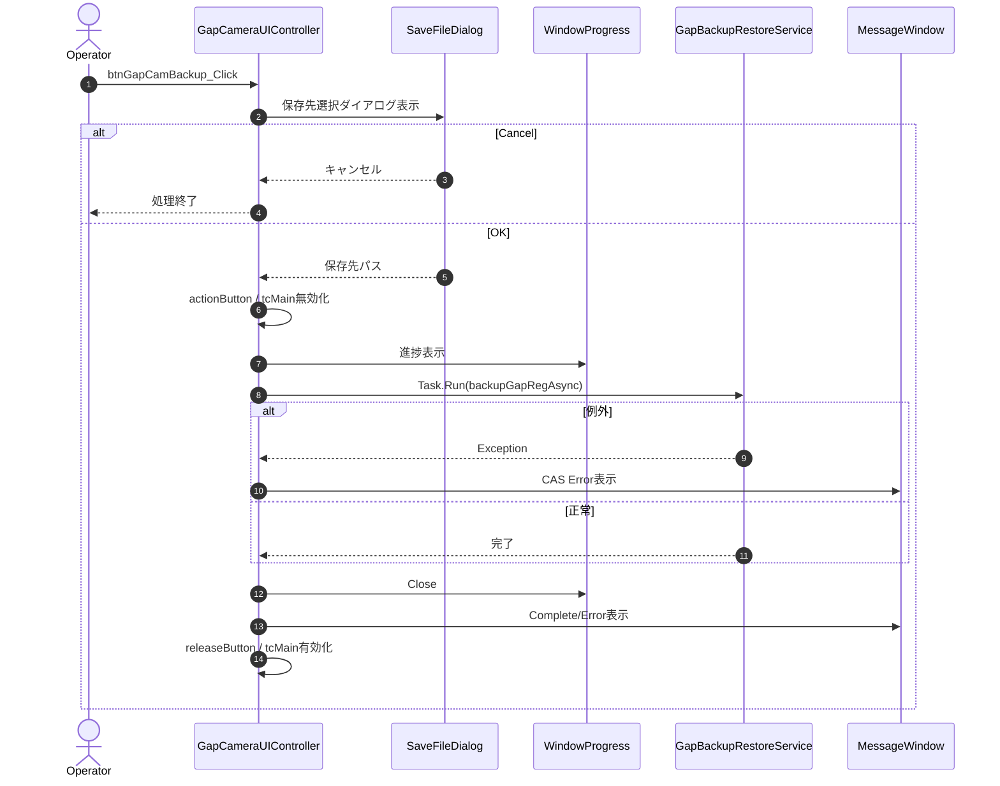

# 08-1. UIイベント・制御メソッド

### 8-1-1. btnGapCamBackup_Click

| 項目 | 内容 |
|------|------|
| シグネチャ | `private async void btnGapCamBackup_Click(object sender, RoutedEventArgs e)` |
| 概要 | 補正値バックアップ処理を開始する |

引数: `sender`, `e`  
返り値: なし（void）

処理概要（詳細）

| 手順No. | 処理内容 | 詳細 |
|---------|----------|------|
| 1 | 保存先選択ダイアログ表示 | `SaveFileDialog` を初期化し、前回保存先（`Settings.Ins.GapCam.LastBackupFile`）を優先表示する。 |
| 2 | 入力確定判定 | ユーザーが `OK` を選択した場合のみ後続処理を実行する。Cancel時は無処理終了。 |
| 3 | 実行準備 | `tcMain.IsEnabled = false`、`actionButton` 実行、進捗ウィンドウ表示を行う。 |
| 4 | バックアップ実行 | `Task.Run(() => backupGapRegAsync(path))` でXML書き出しを実行する。 |
| 5 | 終了処理 | 成否メッセージ表示、進捗ウィンドウClose、サウンド再生、`releaseButton`、`tcMain.IsEnabled = true` を実施する。 |

入力条件・前提条件

| 区分 | 条件 | NG時挙動 |
|------|------|----------|
| ファイルパス | 保存先パスが選択されていること | ダイアログを閉じて処理終了（エラーなし） |
| 保存先 | 指定先へ書込み可能であること | 例外を捕捉しエラー通知、失敗終了 |

主要呼出し先

| 呼出し先 | 役割 | 同期/非同期 |
|----------|------|--------------|
| `backupGapRegAsync` | Gap補正値のXMLバックアップを実行する | 非同期（`Task.Run`） |
| `WindowProgress` | 処理進捗を表示する | 同期 |
| `ShowMessageWindow` / `WindowMessage` | 異常と完了を通知する | 同期 |

例外時仕様

| ケース | 捕捉方法 | 通知 | 後処理 |
|--------|----------|------|--------|
| バックアップ実行失敗 | `Exception` | `CAS Error!` ダイアログ | `status=false`、エラーメッセージ表示、UI復帰 |

シーケンス図

