# UfCamera 詳細設計書

| 項目 | 内容 |
|------|------|
| プロジェクト名 | ColorAlignmentSoftware |
| システム名 | CAS UfCamera |
| ドキュメント名 | 詳細設計書 |
| 作成日 | 2026/04/17 |
| 作成者 | システム分析チーム |
| バージョン | 0.1 |
| 関連資料 | UfCamera_要件定義書.md, UfCamera_基本設計書.md |

---

## 1. モジュール一覧

### 1-1. モジュール一覧表

| No. | モジュールID | モジュール名 | 分類 | 主責務 | 配置先 | 備考 |
|-----|--------------|--------------|------|--------|--------|------|
| 1 | MDL-UF-001 | UfCameraUIController | 画面/ビジネスロジック | U/Fタブのイベント受付、進捗表示、実行制御 | CAS/Functions/UfCamera.cs | MainWindow partial class |
| 2 | MDL-UF-002 | UfCameraConnectionService | 画面/外部IF | カメラ接続、切断、U/F・Gap UI状態同期 | CAS/Functions/UfCamera.cs | ConnectCamera/DisconnectCamera 呼出し |
| 3 | MDL-UF-003 | UfCameraPositioning | ビジネスロジック | カメラ位置合わせ、ライブ更新、空間座標設定 | CAS/Functions/UfCamera.cs | tbtnUfCamSetPos_Click, timerUfCam_Tick 中心 |
| 4 | MDL-UF-004 | UfMeasurementEngine | ビジネスロジック | U/F計測、画像取得、解析結果生成、XML保存 | CAS/Functions/UfCamera.cs | MeasureUfAsync 中心 |
| 5 | MDL-UF-005 | UfAdjustmentEngine | ビジネスロジック | 調整方式別の補正計算、hc.bin生成、書込みデータ準備 | CAS/Functions/UfCamera.cs | AdjustUfCamAsync 中心 |
| 6 | MDL-UF-006 | UfResultLoadService | データアクセス/IF | 測定結果XML読込と画面再表示 | CAS/Functions/UfCamera.cs | btnUfCamResultOpen_Click |

### 1-2. モジュール命名規約

| 項目 | 規約 |
|------|------|
| 命名方針 | クラス/メソッドは PascalCase、イベントは control_event 形式 |
| ID採番規則 | MDL-UF-001 から連番 |
| 分類コード | SCR:画面, BIZ:ビジネスロジック, DAL:データアクセス, IF:外部IF |

---

## 2. モジュール配置図（モジュールの物理配置設計）

### 2-1. 物理配置図

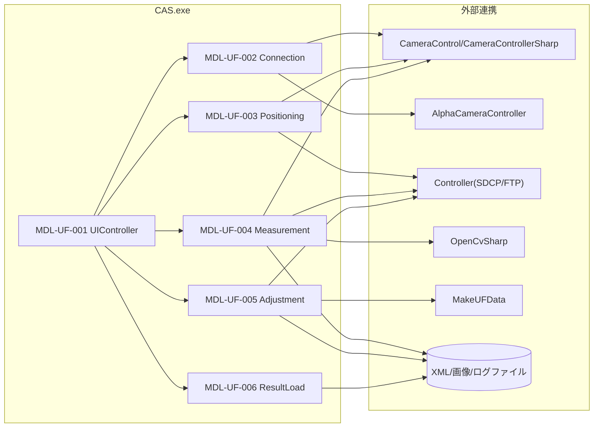
```mermaid
flowchart LR
    subgraph CAS["CAS.exe"]
        UI["MDL-UF-001 UIController"]
        CON["MDL-UF-002 Connection"]
        POS["MDL-UF-003 Positioning"]
        MEAS["MDL-UF-004 Measurement"]
        ADJ["MDL-UF-005 Adjustment"]
        RES["MDL-UF-006 ResultLoad"]
    end

    subgraph External["外部連携"]
        CAM["CameraControl/CameraControllerSharp"]
        ACC["AlphaCameraController"]
        CTRL["Controller(SDCP/FTP)"]
        CV["OpenCvSharp"]
        MK["MakeUFData"]
        FS[("XML/画像/ログファイル")]
    end

    UI --> CON
    UI --> POS
    UI --> MEAS
    UI --> ADJ
    UI --> RES
    CON --> CAM
    CON --> ACC
    POS --> CAM
    POS --> CTRL
    MEAS --> CAM
    MEAS --> CV
    MEAS --> CTRL
    MEAS --> FS
    ADJ --> MK
    ADJ --> CTRL
    ADJ --> FS
    RES --> FS
```

### 2-2. 配置一覧

| 配置区分 | 配置先パス/ノード | 配置モジュール | 配置理由 |
|----------|-------------------|----------------|----------|
| 実行モジュール | CAS/Functions/UfCamera.cs | MDL-UF-001〜006 | U/F計測・調整機能が単一機能ファイルに集約されているため |
| 外部カメラ連携 | CameraControl.dll | Connection/Positioning/Measurement | 接続、AF、撮影、ライブビューのため |
| 外部カメラ実行 | Components/AlphaCameraController.exe | Connection/Measurement | CamCont.xml を介した撮影制御のため |
| 外部補正計算 | MakeUFData | Adjustment | FMT抽出、XYZ変換、統計、補正ファイル生成のため |
| 外部制御連携 | Controller (SDCP/FTP) | Positioning/Measurement/Adjustment | ThroughMode、パターン表示、電源制御、調整データ反映のため |
| ファイル永続化 | 測定フォルダ/ログフォルダ | Measurement/Adjustment/ResultLoad | 計測結果、調整結果、画像、ログの保存/読込のため |

---

## 3. モジュール仕様オーバービュー

### 3-1. モジュール分類別サマリ

| 分類 | 対象モジュール | 処理概要 | 主なインタフェース |
|------|----------------|----------|--------------------|
| 画面 | UfCameraUIController | ボタンイベント、対象選択、進捗表示、完了/異常通知 | btnUfCamMeasStart_Click, btnUfCamAdjustStart_Click |
| 画面/外部IF | UfCameraConnectionService | カメラ接続・切断、Gap側UI同期 | btnUfCamConnect_Click, btnUfCamDisconnect_Click |
| ビジネスロジック | UfCameraPositioning | 位置合わせ、AF、ライブ更新、Cabinet空間座標設定 | tbtnUfCamSetPos_Click, timerUfCam_Tick, SetCabinetPos |
| ビジネスロジック | UfMeasurementEngine | U/F計測、Black/Mask/Module/Flat画像取得、解析結果保存 | MeasureUfAsync, CaptureUfImages |
| ビジネスロジック | UfAdjustmentEngine | 方式別補正点抽出、補正値計算、hc.bin生成 | AdjustUfCamAsync, AdjustUfCamCabinet |
| データアクセス | UfResultLoadService | UfMeasResult.xml 読込、画面再表示 | btnUfCamResultOpen_Click |

### 3-2. モジュール別オーバービュー

| モジュールID | モジュール名 | 分類 | 処理概要 | インタフェース名 | 引数 | 返り値 |
|--------------|--------------|------|----------|------------------|------|--------|
| MDL-UF-001 | UfCameraUIController | 画面 | U/F処理の起動/終了制御 | btnUfCamMeasStart_Click | sender,e | void |
| MDL-UF-002 | UfCameraConnectionService | 画面/IF | カメラ接続状態とUIを同期 | btnUfCamConnect_Click | sender,e | void |
| MDL-UF-003 | UfCameraPositioning | BIZ | 位置合わせ実行・更新・空間座標設定 | tbtnUfCamSetPos_Click | sender,e | void |
| MDL-UF-004 | UfMeasurementEngine | BIZ | 撮影・解析・計測結果作成 | MeasureUfAsync | List<UnitInfo>, path ほか | void |
| MDL-UF-005 | UfAdjustmentEngine | BIZ | 調整方式別の補正主処理 | AdjustUfCamAsync | logDir, List<UnitInfo> ほか | void |
| MDL-UF-006 | UfResultLoadService | DAL/IF | 計測結果XML読込と表示更新 | btnUfCamResultOpen_Click | sender,e | void |

---

## 4. モジュール仕様（詳細）

### 4-1. MDL-UF-001: UfCameraUIController

#### 4-1-1. 基本情報

| 項目 | 内容 |
|------|------|
| モジュールID | MDL-UF-001 |
| モジュール名 | UfCameraUIController |
| 分類 | 画面/ビジネスロジック |
| 呼出元 | オペレータUI操作 |
| 呼出先 | MDL-UF-002〜006 |
| トランザクション | 無 |
| 再実行性 | 可（処理完了/エラー後に再実行可能） |

#### 4-1-2. 処理フロー

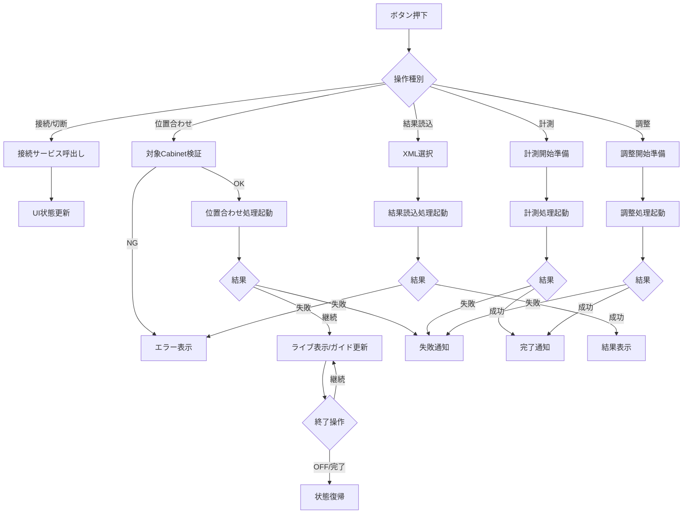
```mermaid
flowchart TD
    A[ボタン押下] --> B{操作種別}
    B -->|接続/切断| C[接続サービス呼出し]
    C --> D[UI状態更新]
    B -->|位置合わせ| E[対象Cabinet検証]
    E -->|NG| F[エラー表示]
    E -->|OK| G[位置合わせ処理起動]
    G --> H{結果}
    H -->|継続| I[ライブ表示/ガイド更新]
    I --> J{終了操作}
    J -->|OFF/完了| K[状態復帰]
    J -->|継続| I
    H -->|失敗| L[失敗通知]
    B -->|計測| M[計測開始準備]
    M --> N[計測処理起動]
    N --> O{結果}
    O -->|成功| P[完了通知]
    O -->|失敗| L
    B -->|調整| Q[調整開始準備]
    Q --> R[調整処理起動]
    R --> S{結果}
    S -->|成功| P
    S -->|失敗| L
    B -->|結果読込| T[XML選択]
    T --> U[結果読込処理起動]
    U --> V{結果}
    V -->|成功| W[結果表示]
    V -->|失敗| F
```

#### 4-1-3. 処理手順

| 手順No. | 処理内容 | 入力 | 出力 | 操作対象 | 備考 |
|---------|----------|------|------|----------|------|
| 1 | 操作種別判定 | 押下ボタン/トグル種別 | 処理分岐 | U/FタブUI | 接続、位置合わせ、計測、調整、結果読込を判定 |
| 2 | 対象Cabinet/入力値チェック | Cabinet選択状態、距離、高さ、基準Cabinet指定 | 実行可否 | 画面選択配列、入力UI | CheckSelectedUnits、CheckShootingDist |
| 3 | 位置合わせ開始/更新 | 対象Cabinet、表示設定 | ライブ表示、ガイド状態 | tbtnUfCamSetPos、画像UI | ON/OFF とタイマ更新を制御 |
| 4 | 計測開始準備 | 対象Cabinet、距離条件 | Progress UI、画面操作禁止 | WindowProgress、tcMain.IsEnabled | 位置合わせ停止と保存先準備を含む |
| 5 | 計測処理起動 | 対象Cabinet、measPath | 計測結果、測定ファイル | UfMeasurementEngine | MeasureUfAsync を Task.Run で起動 |
| 6 | 調整開始準備 | 対象Cabinet、調整方式、基準Cabinet、視聴点 | Progress UI、画面操作禁止 | WindowProgress | 目標色度設定と logDir 作成を含む |
| 7 | 調整処理起動 | 調整条件、logDir | 調整結果、反映対象ファイル | UfAdjustmentEngine | AdjustUfCamAsync を Task.Run で起動 |
| 8 | 結果読込処理起動 | XMLパス | 測定結果表示 | UfResultLoadService | UfCamMeasLog.LoadFromXmlFile |
| 9 | 後処理 | 実行結果 | 通知・状態復帰 | UI/設定 | 完了/失敗通知、ThroughMode解除、表示復帰等 |

#### 4-1-4. 操作対象仕様（画面、テーブル、ファイル）

| 対象種別 | 対象名 | 操作内容 | 操作タイミング | 主キー/識別子 | 備考 |
|----------|--------|----------|----------------|---------------|------|
| 画面 | U/Fタブ | ボタン操作/結果表示 | ユーザー操作時 | コントロール名 | 接続、位置合わせ、計測、調整、結果読込 |
| 画面 | tbtnUfCamSetPos | ON/OFF切替 | 位置合わせ開始/終了時 | ToggleState | 位置合わせトグル |
| 画面 | imgUfCamCameraView | ライブ表示/ガイド更新 | 位置合わせ中 | ImageControl | タイマ更新で反映 |
| 画面 | WindowProgress | 表示/更新/Close | 処理開始〜終了 | ウィンドウインスタンス | 中断操作含む |
| 画面 | ファイルダイアログ | XMLパス選択 | 結果読込時 | ダイアログインスタンス | path確定用 |
| ファイル | UfMeasResult.xml | 読込/書込 | 計測/読込時 | path | 測定結果保存/再表示 |
| ファイル | UnitCpInfo.xml | 書込 | 調整完了時 | path | 調整結果保存 |

#### 4-1-5. インタフェース仕様（引数・返り値）

| 項目 | 内容 |
|------|------|
| インタフェース名 | U/F系イベントハンドラ群 |
| 概要 | 接続、位置合わせ、計測、調整、結果読込のUIイベントを業務処理へ中継する |
| シグネチャ | private async void btnUfCamMeasStart_Click(object sender, RoutedEventArgs e)、private async void btnUfCamAdjustStart_Click(object sender, RoutedEventArgs e)、private void tbtnUfCamSetPos_Click(object sender, RoutedEventArgs e) ほか |
| 呼出条件 | U/Fタブのボタン/トグル操作 |

引数一覧

| No. | 引数名 | 型 | 必須 | 説明 | バリデーション |
|-----|--------|----|------|------|----------------|
| 1 | sender | object | Y | イベント送信元 | null許容 |
| 2 | e | RoutedEventArgs/EventArgs | Y | イベント情報 | 操作元イベント型と整合 |

返り値一覧

| No. | 項目名 | 型 | 説明 | 備考 |
|-----|--------|----|------|------|
| 1 | なし | void | UIイベント処理 | 非同期イベントを含む。例外は内部catch |

#### 4-1-6. 例外処理仕様

| No. | 例外/エラー条件 | 検知方法 | 対応内容 | ユーザー通知 | ログ出力 | リトライ/継続可否 |
|-----|------------------|----------|----------|--------------|----------|------------------|
| 1 | 対象Cabinet不正 | CheckSelectedUnits 例外 | 処理中断/タブ復帰 | CAS Error表示 | saveUfLog | 可 |
| 2 | 入力値不正（距離、高さ、基準Cabinet） | Parse失敗、CheckObjectiveCabinet 例外 | 処理中断 | CAS Error表示 | saveUfLog | 可 |
| 3 | カメラ未接続 | IsCameraOpened 判定 | 調整開始中断 | CAS Error表示 | saveUfLog | 可 |
| 4 | 実処理失敗 | Task例外 | 後処理実施し失敗通知 | CAS Error表示 | saveUfLog | 可 |
| 5 | ユーザー中断 | CameraCasUserAbortException | 中断として終了 | Abort表示 | saveUfLog | 可 |

#### 4-1-7. ログ仕様

| ログ種別 | 出力条件 | 出力項目 | 保持期間 | マスキング方針 |
|----------|----------|----------|----------|----------------|
| 実行ログ | 処理開始/終了/主要ステップ | 時刻、処理名、対象、進捗 | 測定/ログフォルダ世代管理 | 個人情報なし |

### 4-2. MDL-UF-002: UfCameraConnectionService

#### 4-2-1. 基本情報

| 項目 | 内容 |
|------|------|
| モジュールID | MDL-UF-002 |
| モジュール名 | UfCameraConnectionService |
| 分類 | 画面/外部IF |
| 呼出元 | UIController |
| 呼出先 | CameraControl, AlphaCameraController, GapCamera UI |
| トランザクション | 無 |
| 再実行性 | 可 |

#### 4-2-2. 処理フロー

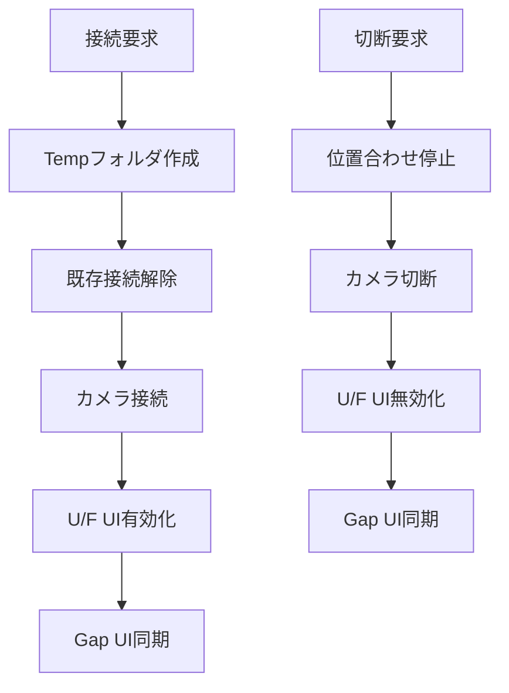
```mermaid
flowchart TD
    A[接続要求] --> B[Tempフォルダ作成]
    B --> C[既存接続解除]
    C --> D[カメラ接続]
    D --> E[U/F UI有効化]
    E --> F[Gap UI同期]
    G[切断要求] --> H[位置合わせ停止]
    H --> I[カメラ切断]
    I --> J[U/F UI無効化]
    J --> K[Gap UI同期]
```

#### 4-2-3. 処理手順

| 手順No. | 処理内容 | 入力 | 出力 | 操作対象 | 備考 |
|---------|----------|------|------|----------|------|
| 1 | カメラ選択同期 | U/Fカメラ選択 | Settings.Ins.Camera.Name | カメラ設定 | Gap側コンボも同期 |
| 2 | レンズCD同期 | U/Fレンズ選択 | 選択済みレンズCD | レンズ設定 | Gap側コンボも同期 |
| 3 | 接続準備 | Tempパス | Tempフォルダ | ファイルシステム | 未存在時のみ作成 |
| 4 | 接続/切断実行 | 接続要求 | カメラ接続状態 | CameraControl | DisconnectCamera/ConnectCamera |
| 5 | UI活性制御 | 接続状態 | 各種ボタン活性状態 | U/F・Gap UI | Developerモード分岐あり |

#### 4-2-4. 操作対象仕様（画面、テーブル、ファイル）

| 対象種別 | 対象名 | 操作内容 | 操作タイミング | 主キー/識別子 | 備考 |
|----------|--------|----------|----------------|---------------|------|
| 画面 | cmbxUfCamCamera | 選択反映 | カメラ選択変更時 | SelectedIndex | Settings同期 |
| 画面 | cmbxUfCamLensCd | 選択反映 | レンズ変更時 | SelectedIndex | Gap側同期 |
| 画面 | btnUfCamConnect/Disconnect | 活性制御 | 接続状態変更時 | IsEnabled | Gap側ボタンも同期 |
| ファイル | tempPath | 作成 | 接続開始時 | path | 一時保存先 |

#### 4-2-5. インタフェース仕様（引数・返り値）

| 項目 | 内容 |
|------|------|
| インタフェース名 | 接続/切断処理 |
| 概要 | カメラ接続状態とU/F・Gap UI状態を同期制御 |
| シグネチャ | private void btnUfCamConnect_Click(object sender, RoutedEventArgs e)、private void btnUfCamDisconnect_Click(object sender, RoutedEventArgs e) |
| 呼出条件 | 接続/切断ボタン押下 |

引数一覧

| No. | 引数名 | 型 | 必須 | 説明 | バリデーション |
|-----|--------|----|------|------|----------------|
| 1 | sender | object | Y | イベント送信元 | - |
| 2 | e | RoutedEventArgs | Y | イベント情報 | - |

返り値一覧

| No. | 項目名 | 型 | 説明 | 備考 |
|-----|--------|----|------|------|
| 1 | なし | void | UI状態更新のみ | 例外は通知 |

#### 4-2-6. 例外処理仕様

| No. | 例外/エラー条件 | 検知方法 | 対応内容 | ユーザー通知 | ログ出力 | リトライ/継続可否 |
|-----|------------------|----------|----------|--------------|----------|------------------|
| 1 | カメラ接続失敗 | ConnectCamera 例外 | 接続中断 | CAS Error表示 | 任意 | 可 |
| 2 | レンズ一覧更新失敗 | ShowLensCdFiles 例外 | UI維持 | CAS Error表示 | 任意 | 可 |

#### 4-2-7. ログ仕様

| ログ種別 | 出力条件 | 出力項目 | 保持期間 | マスキング方針 |
|----------|----------|----------|----------|----------------|
| 実行ログ | 接続/切断、選択変更時 | カメラ名、レンズCD、接続状態 | 実行中 | 個人情報なし |

### 4-3. MDL-UF-003: UfCameraPositioning

#### 4-3-1. 基本情報

| 項目 | 内容 |
|------|------|
| モジュールID | MDL-UF-003 |
| モジュール名 | UfCameraPositioning |
| 分類 | ビジネスロジック |
| 呼出元 | UIController |
| 呼出先 | CameraControl, Controller, 画像表示 |
| トランザクション | 無 |
| 再実行性 | 可 |

#### 4-3-2. 処理フロー

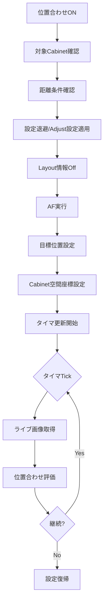
```mermaid
flowchart TD
    A[位置合わせON] --> B[対象Cabinet確認]
    B --> C[距離条件確認]
    C --> D[設定退避/Adjust設定適用]
    D --> E[Layout情報Off]
    E --> F[AF実行]
    F --> G[目標位置設定]
    G --> H[Cabinet空間座標設定]
    H --> I[タイマ更新開始]
    I --> J{タイマTick}
    J --> K[ライブ画像取得]
    K --> L[位置合わせ評価]
    L --> M{継続?}
    M -->|Yes| J
    M -->|No| N[設定復帰]
```

#### 4-3-3. 処理手順

| 手順No. | 処理内容 | 入力 | 出力 | 操作対象 | 備考 |
|---------|----------|------|------|----------|------|
| 1 | 測定レベル設定 | モデル設定 | m_MeasureLevel | 内部状態 | brightness.UF_20pc |
| 2 | 対象抽出 | Cabinet選択 | lstTgtUnits | 画面配列 | 矩形チェックあり |
| 3 | ユーザー設定退避 | 現在設定 | userSetting | Controller設定 | getUserSettingSetPos |
| 4 | 位置合わせ設定適用 | 退避前設定 | Adjust設定 | Controller | setAdjustSettingSetPos |
| 5 | AF/ガイド準備 | ShootCondition | AF完了状態 | CameraControl | outputIntSigChecker, AutoFocus |
| 6 | 空間座標設定 | 対象Cabinet、距離条件 | CabinetCoordinate | 内部配列 | SetCamPosTarget, SetCabinetPos |
| 7 | タイマ更新 | ライブ画像 | ガイド評価結果 | UI画像 | AdjustCameraPosUf |

#### 4-3-4. 操作対象仕様（画面、テーブル、ファイル）

| 対象種別 | 対象名 | 操作内容 | 操作タイミング | 主キー/識別子 | 備考 |
|----------|--------|----------|----------------|---------------|------|
| 画面 | tbtnUfCamSetPos | ON/OFF切替 | ユーザー操作 | ToggleState | 実行中はタイマ連動 |
| 画面 | imgUfCamCameraView | ライブ表示更新 | タイマTick | ImageControl | 位置合わせ用 |
| 画面 | txtbStatus | ステータス表示 | 開始/停止時 | Text | Setting Camera Position... |
| 外部IF | Controller | Layout情報Off、ThroughMode関連 | 位置合わせ開始時 | ControllerID | 複数Controller対応 |

#### 4-3-5. インタフェース仕様（引数・返り値）

| 項目 | 内容 |
|------|------|
| インタフェース名 | 位置合わせ処理 |
| 概要 | 位置合わせ開始・更新・停止を制御 |
| シグネチャ | private void tbtnUfCamSetPos_Click(object sender, RoutedEventArgs e)、private void timerUfCam_Tick(object sender, EventArgs e)、private void SetCabinetPos(List<UnitInfo> lstTgtUnits, double dist, double wallH, double camH) |
| 呼出条件 | トグルON/OFF、タイマ更新、計測/調整の前後 |

引数一覧

| No. | 引数名 | 型 | 必須 | 説明 | バリデーション |
|-----|--------|----|------|------|----------------|
| 1 | lstTgtUnits | List<UnitInfo> | Y | 位置合わせ対象Cabinet群 | 空不可/矩形前提 |
| 2 | dist | double | Y | 撮影距離 | CheckShootingDist |
| 3 | wallH | double | N | Wall下端高さ | Custom時のみ有効 |
| 4 | camH | double | N | カメラ高さ | Custom時のみ有効 |

返り値一覧

| No. | 項目名 | 型 | 説明 | 備考 |
|-----|--------|----|------|------|
| 1 | なし | void | UI制御と内部座標設定 | 例外は通知 |

#### 4-3-6. 例外処理仕様

| No. | 例外/エラー条件 | 検知方法 | 対応内容 | ユーザー通知 | ログ出力 | リトライ/継続可否 |
|-----|------------------|----------|----------|--------------|----------|------------------|
| 1 | 設定値不正（距離/高さ等） | Parse失敗 | 位置合わせ停止 | CAS Error表示 | 任意 | 可 |
| 2 | 位置合わせ準備失敗 | AutoFocus、Layout制御例外 | ThroughMode解除・設定復帰 | CAS Error表示 | 任意 | 可 |
| 3 | タイマ更新例外 | AdjustCameraPosUf 例外 | 内部信号停止、トグルOFF | CAS Error表示 | 任意 | 可 |

#### 4-3-7. ログ仕様

| ログ種別 | 出力条件 | 出力項目 | 保持期間 | マスキング方針 |
|----------|----------|----------|----------|----------------|
| 実行ログ | ON/OFF、主要設定適用時 | 距離条件、対象Cabinet、処理状態 | 測定フォルダ世代管理 | 機密値除外 |

### 4-4. MDL-UF-004: UfMeasurementEngine

#### 4-4-1. 基本情報

| 項目 | 内容 |
|------|------|
| モジュールID | MDL-UF-004 |
| モジュール名 | UfMeasurementEngine |
| 分類 | ビジネスロジック |
| 呼出元 | UIController |
| 呼出先 | CameraControl、OpenCv、Controller、ファイルI/O |
| トランザクション | 無 |
| 再実行性 | 可 |

#### 4-4-2. 処理フロー

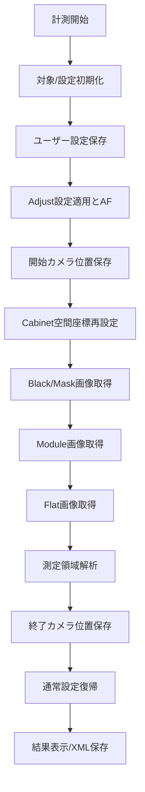
```mermaid
flowchart TD
    A[計測開始] --> B[対象/設定初期化]
    B --> C[ユーザー設定保存]
    C --> D[Adjust設定適用とAF]
    D --> E[開始カメラ位置保存]
    E --> F[Cabinet空間座標再設定]
    F --> G[Black/Mask画像取得]
    G --> H[Module画像取得]
    H --> I[Flat画像取得]
    I --> J[測定領域解析]
    J --> K[終了カメラ位置保存]
    K --> L[通常設定復帰]
    L --> M[結果表示/XML保存]
```

#### 4-4-3. 処理手順

| 手順No. | 処理内容 | 入力 | 出力 | 操作対象 | 備考 |
|---------|----------|------|------|----------|------|
| 1 | 測定フォルダ作成 | 実行日時 | measPath | ファイルシステム | UF_yyyyMMddHHmm |
| 2 | 設定保存 | 現在ユーザー設定 | m_lstUserSetting | Controller設定 | 後で復帰 |
| 3 | 撮影準備 | ShootCondition | カメラ設定反映 | CameraControl | setAdjustSetting, AutoFocus |
| 4 | カメラ位置確認 | ライブ画像 | startCamPos | CameraControl | GetCameraPosUf, CheckCameraPos |
| 5 | 画像取得 | 対象Cabinet | 撮影画像 | カメラ/ファイル | Black、Mask、Module、Flat |
| 6 | 解析 | 画像群、ViewPoint | U/F計測結果 | OpenCv処理 | calcMeasAreaPv |
| 7 | 結果保存 | 計測データ | UfMeasResult.xml | ファイル | UfCamMeasLog.SaveToXmlFile |
| 8 | 復帰処理 | 一時設定 | 通常設定 | Controller | ThroughMode解除＋UserSetting復帰 |

#### 4-4-4. 操作対象仕様（画面、テーブル、ファイル）

| 対象種別 | 対象名 | 操作内容 | 操作タイミング | 主キー/識別子 | 備考 |
|----------|--------|----------|----------------|---------------|------|
| ファイル | UfMeasResult.xml | 出力 | 計測完了時 | path | 測定結果保存 |
| ファイル | Black/Mask/Module/Flat画像 | 出力/読込 | 計測実行中 | 連番ファイル名 | fn_BlackFile 等 |
| 外部IF | CameraControl | 撮影/AF | 計測前〜中 | カメラ接続状態 | 失敗時例外 |
| 外部IF | Controller | パターン、電源制御 | 計測前〜中 | ControllerID | CmdUnitPowerOn 等 |

#### 4-4-5. インタフェース仕様（引数・返り値）

| 項目 | 内容 |
|------|------|
| インタフェース名 | MeasureUfAsync |
| 概要 | U/F計測主処理 |
| シグネチャ | private void MeasureUfAsync(List<UnitInfo> lstTgtCabi, string measPath, ViewPoint vp, double dist, double wallH, double camH, bool targetOnly = false) |
| 呼出条件 | 計測開始ボタン、調整後再計測 |

引数一覧

| No. | 引数名 | 型 | 必須 | 説明 | バリデーション |
|-----|--------|----|------|------|----------------|
| 1 | lstTgtCabi | List<UnitInfo> | Y | 計測対象Cabinet群 | 空不可/矩形前提 |
| 2 | measPath | string | Y | 計測ログ保存フォルダ | 書込可能パス |
| 3 | vp | ViewPoint | Y | 視聴点補正条件 | 計測単体では無効値 |
| 4 | dist | double | Y | 撮影距離 | CheckShootingDist |
| 5 | wallH | double | N | Wall下端高さ | Custom時のみ |
| 6 | camH | double | N | カメラ高さ | Custom時のみ |
| 7 | targetOnly | bool | N | Flat画像を対象のみで撮影するか | Debug用途 |

返り値一覧

| No. | 項目名 | 型 | 説明 | 備考 |
|-----|--------|----|------|------|
| 1 | なし | void | 結果は内部状態/ファイルへ出力 | 例外で失敗通知 |

#### 4-4-6. 例外処理仕様

| No. | 例外/エラー条件 | 検知方法 | 対応内容 | ユーザー通知 | ログ出力 | リトライ/継続可否 |
|-----|------------------|----------|----------|--------------|----------|------------------|
| 1 | カメラ位置取得失敗 | GetCameraPosUf 戻り値/例外 | 処理中断 | CAS Error表示 | saveUfLog | 可 |
| 2 | カメラ位置不適切 | CheckCameraPos false | 処理中断 | CAS Error表示 | saveUfLog | 可 |
| 3 | 撮影失敗 | CaptureImage/AutoFocus 例外 | 処理中断 | CAS Error表示 | saveUfLog | 可 |
| 4 | 解析失敗 | calcMeasAreaPv 例外 | 処理中断 | CAS Error表示 | saveUfLog | 可 |
| 5 | 中断操作 | CameraCasUserAbortException | 安全終了 | Abort表示 | saveUfLog | 可 |

#### 4-4-7. ログ仕様

| ログ種別 | 出力条件 | 出力項目 | 保持期間 | マスキング方針 |
|----------|----------|----------|----------|----------------|
| 計測ログ | 主要ステップ進行時 | ステップ名、対象、時刻、保存先 | 測定フォルダ世代管理 | 個人情報なし |

### 4-5. MDL-UF-005: UfAdjustmentEngine

#### 4-5-1. 基本情報

| 項目 | 内容 |
|------|------|
| モジュールID | MDL-UF-005 |
| モジュール名 | UfAdjustmentEngine |
| 分類 | ビジネスロジック |
| 呼出元 | UIController |
| 呼出先 | MakeUFData、Controller、ファイルI/O |
| トランザクション | 無 |
| 再実行性 | 可 |

#### 4-5-2. 処理フロー

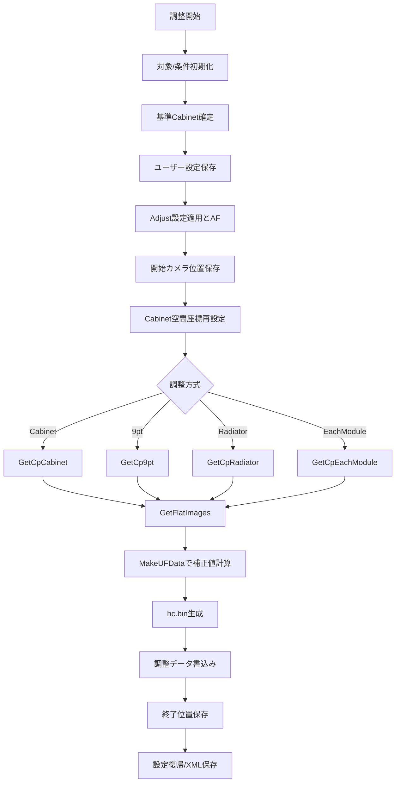
```mermaid
flowchart TD
    A[調整開始] --> B[対象/条件初期化]
    B --> C[基準Cabinet確定]
    C --> D[ユーザー設定保存]
    D --> E[Adjust設定適用とAF]
    E --> F[開始カメラ位置保存]
    F --> G[Cabinet空間座標再設定]
    G --> H{調整方式}
    H -->|Cabinet| I[GetCpCabinet]
    H -->|9pt| J[GetCp9pt]
    H -->|Radiator| K[GetCpRadiator]
    H -->|EachModule| L[GetCpEachModule]
    I --> M[GetFlatImages]
    J --> M
    K --> M
    L --> M
    M --> N[MakeUFDataで補正値計算]
    N --> O[hc.bin生成]
    O --> P[調整データ書込み]
    P --> Q[終了位置保存]
    Q --> R[設定復帰/XML保存]
```

#### 4-5-3. 処理手順

| 手順No. | 処理内容 | 入力 | 出力 | 操作対象 | 備考 |
|---------|----------|------|------|----------|------|
| 1 | 調整条件取得 | 調整方式、目標Cabinet、視聴点 | type, lstObjCabi, vp | UI項目 | Cabinet/9pt/Radiator/EachModule |
| 2 | 基準Cabinet検証 | lstObjCabi, lstTgtCabi | 実行可否 | 内部状態 | CheckObjectiveCabinet |
| 3 | 設定保存/準備 | 現在ユーザー設定 | m_lstUserSetting | Controller設定 | setChromTarget 含む |
| 4 | 位置確認 | ライブ画像 | startCamPos | CameraControl | GetCameraPosUf, CheckCameraPos |
| 5 | 補正点抽出 | 調整方式別条件 | lstUnitCpInfo, lstRefPoints | 画像処理 | GetCpCabinet 等 |
| 6 | Flat画像平均値取得 | 調整対象 | 測定値付与済み補正点 | OpenCv処理 | GetFlatImages |
| 7 | FMT読込とXYZ更新 | hc.bin、基準値 | 新補正データ | MakeUFData | ExtractFmt, Fmt2XYZ, ModifyXYZCam |
| 8 | 調整ファイル生成 | 新補正データ | adjusted hc.bin | Tempフォルダ | OverWritePixelData |
| 9 | 調整データ反映 | 移動ファイル一覧 | Controller更新 | SDCP/FTP | writeAdjustedData |
| 10 | 結果保存 | 調整結果 | UnitCpInfo.xml | ファイル | UfCamAdjLog.SaveToXmlFile |

#### 4-5-4. 操作対象仕様（画面、テーブル、ファイル）

| 対象種別 | 対象名 | 操作内容 | 操作タイミング | 主キー/識別子 | 備考 |
|----------|--------|----------|----------------|---------------|------|
| 画面 | 調整条件UI | 読込 | 調整開始時 | 調整方式/基準指定 | rbUfCam9pt ほか |
| 外部IF | MakeUFData | 補正演算 | 調整ループ中 | UnitInfo | FMT抽出、XYZ変換、統計 |
| 外部IF | Controller | Cabinet電源制御、データ反映 | 調整中 | ControllerID | writeAdjustedData |
| ファイル | UnitCpInfo.xml | 出力 | 調整完了時 | path | 調整結果保存 |
| ファイル | Temp hc.bin | 出力 | Cabinet毎 | Unit識別 | MoveFileに登録 |

#### 4-5-5. インタフェース仕様（引数・返り値）

| 項目 | 内容 |
|------|------|
| インタフェース名 | AdjustUfCamAsync |
| 概要 | U/F調整主処理 |
| シグネチャ | private void AdjustUfCamAsync(string logDir, List<UnitInfo> lstTgtCabi, UfCamAdjustType type, List<UnitInfo> lstObjCabi, ObjectiveLine objEdge, ViewPoint vp, double dist, double wallH, double camH) |
| 呼出条件 | 調整開始ボタン |

引数一覧

| No. | 引数名 | 型 | 必須 | 説明 | バリデーション |
|-----|--------|----|------|------|----------------|
| 1 | logDir | string | Y | 調整ログ保存フォルダ | 書込可能パス |
| 2 | lstTgtCabi | List<UnitInfo> | Y | 調整対象Cabinet群 | 空不可/矩形前提 |
| 3 | type | UfCamAdjustType | Y | 調整方式 | enum値 |
| 4 | lstObjCabi | List<UnitInfo> | Y | 基準Cabinet群 | 範囲内必須 |
| 5 | objEdge | ObjectiveLine | N | Line指定情報 | Lineモード時のみ |
| 6 | vp | ViewPoint | Y | 視聴点補正条件 | UI設定反映 |
| 7 | dist | double | Y | 撮影距離 | CheckShootingDist |
| 8 | wallH | double | N | Wall下端高さ | Custom時のみ |
| 9 | camH | double | N | カメラ高さ | Custom時のみ |

返り値一覧

| No. | 項目名 | 型 | 説明 | 備考 |
|-----|--------|----|------|------|
| 1 | なし | void | 内部状態更新とファイル出力 | 例外で失敗通知 |

#### 4-5-6. 例外処理仕様

| No. | 例外/エラー条件 | 検知方法 | 対応内容 | ユーザー通知 | ログ出力 | リトライ/継続可否 |
|-----|------------------|----------|----------|--------------|----------|------------------|
| 1 | 基準Cabinet不正 | CheckObjectiveCabinet 例外 | 処理停止 | CAS Error表示 | saveUfLog | 可 |
| 2 | 補正点抽出失敗 | GetCp系例外 | 処理停止 | CAS Error表示 | saveUfLog | 可 |
| 3 | 補正データ欠損 | checkDataFile false | 処理停止 | CAS Error表示 | saveUfLog | 可 |
| 4 | MakeUFData演算失敗 | false戻り/例外 | 処理停止 | CAS Error表示 | saveUfLog | 可 |
| 5 | 調整データ反映失敗 | writeAdjustedData 失敗 | 処理停止 | CAS Error表示 | saveUfLog | 可 |
| 6 | 中断操作 | CameraCasUserAbortException | 安全停止 | Abort表示 | saveUfLog | 可 |

#### 4-5-7. ログ仕様

| ログ種別 | 出力条件 | 出力項目 | 保持期間 | マスキング方針 |
|----------|----------|----------|----------|----------------|
| 調整ログ | 調整ステップ進行時 | ステップ、対象Cabinet、調整方式、保存先 | ログフォルダ世代管理 | 機密値除外 |

### 4-6. MDL-UF-006: UfResultLoadService

#### 4-6-1. 基本情報

| 項目 | 内容 |
|------|------|
| モジュールID | MDL-UF-006 |
| モジュール名 | UfResultLoadService |
| 分類 | データアクセス/IF |
| 呼出元 | UIController |
| 呼出先 | ファイルシステム、結果表示 |
| トランザクション | 無 |
| 再実行性 | 可 |

#### 4-6-2. 処理フロー

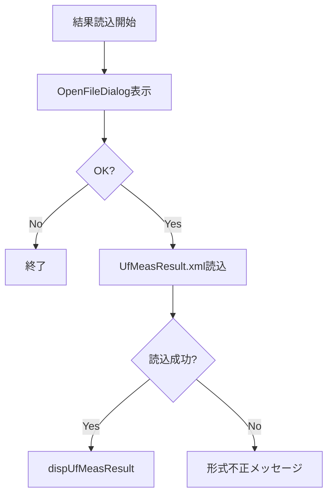
```mermaid
flowchart TD
    A[結果読込開始] --> B[OpenFileDialog表示]
    B --> C{OK?}
    C -->|No| D[終了]
    C -->|Yes| E[UfMeasResult.xml読込]
    E --> F{読込成功?}
    F -->|Yes| G[dispUfMeasResult]
    F -->|No| H[形式不正メッセージ]
```

#### 4-6-3. 処理手順

| 手順No. | 処理内容 | 入力 | 出力 | 操作対象 | 備考 |
|---------|----------|------|------|----------|------|
| 1 | ダイアログ初期化 | applicationPath + MeasDir | OpenFileDialog | OSダイアログ | xmlフィルタ指定 |
| 2 | XMLパス確定 | ダイアログ結果 | path | OSダイアログ | Cancel時無処理終了 |
| 3 | XML読込 | path | ufCamMeasLog | ファイルI/O | LoadFromXmlFile |
| 4 | 結果表示更新 | ufCamMeasLog | 画面表示 | UI | dispUfMeasResult |

#### 4-6-4. 操作対象仕様（画面、テーブル、ファイル）

| 対象種別 | 対象名 | 操作内容 | 操作タイミング | 主キー/識別子 | 備考 |
|----------|--------|----------|----------------|---------------|------|
| 画面 | btnUfCamResultOpen | 押下 | ユーザー操作 | Button | 結果読込起点 |
| ファイル | UfMeasResult.xml | 読込 | 結果読込時 | path | XML形式 |
| 画面 | U/F結果表示領域 | 更新 | 読込成功時 | 表示状態 | dispUfMeasResult |

#### 4-6-5. インタフェース仕様（引数・返り値）

| 項目 | 内容 |
|------|------|
| インタフェース名 | btnUfCamResultOpen_Click |
| 概要 | 保存済みU/F計測結果XMLを読込み、結果表示へ再展開する |
| シグネチャ | private void btnUfCamResultOpen_Click(object sender, RoutedEventArgs e) |
| 呼出条件 | 結果読込ボタン押下 |

引数一覧

| No. | 引数名 | 型 | 必須 | 説明 | バリデーション |
|-----|--------|----|------|------|----------------|
| 1 | sender | object | Y | イベント送信元 | - |
| 2 | e | RoutedEventArgs | Y | イベント情報 | - |

返り値一覧

| No. | 項目名 | 型 | 説明 | 備考 |
|-----|--------|----|------|------|
| 1 | なし | void | 読込結果を画面へ反映 | 例外時は通知 |

#### 4-6-6. 例外処理仕様

| No. | 例外/エラー条件 | 検知方法 | 対応内容 | ユーザー通知 | ログ出力 | リトライ/継続可否 |
|-----|------------------|----------|----------|--------------|----------|------------------|
| 1 | XML形式不正 | LoadFromXmlFile 例外 | 読込停止 | CAS Error表示 | 任意 | 可 |
| 2 | ファイル未存在/アクセス不可 | ダイアログまたはLoad例外 | 読込停止 | CAS Error表示 | 任意 | 可 |

#### 4-6-7. ログ仕様

| ログ種別 | 出力条件 | 出力項目 | 保持期間 | マスキング方針 |
|----------|----------|----------|----------|----------------|
| 実行ログ | 結果読込時 | 読込パス、成否 | 実行中 | 個人情報なし |

---

## 5. コード仕様

### 5-1. コード一覧

| コード名称 | コード値 | 内容説明 | 利用箇所 | 備考 |
|------------|----------|----------|----------|------|
| UfCamAdjustType | Cabinet | Cabinet単位のU/F調整 | 調整処理 | enum |
| UfCamAdjustType | Cabi_9pt | 9点基準のU/F調整 | 調整処理 | enum |
| UfCamAdjustType | Radiator | Radiator基準のU/F調整 | 調整処理 | enum |
| UfCamAdjustType | EachModule | Module単位のU/F調整 | 調整処理 | enum |
| brightness.UF_20pc | 20IRE | 位置合わせ/計測のマスク信号レベル | 位置合わせ、計測、調整 | 定数 |
| UF_RE_CALC_STEP_3_PROCESS_SEC | 実装定義値 | 調整処理ステップ概算秒数 | 9pt/Radiator/EachModule | 進捗表示用 |

### 5-2. コード定義ルール

| 項目 | ルール |
|------|--------|
| 調整方式切替 | rbUfCamEachMod、rbUfCamRadiator、rbUfCam9pt の状態から enum に変換 |
| 基準Cabinet決定 | 中央、個別、Line指定の3系統で List<UnitInfo> を生成 |
| 画像保存規則 | UF_yyyyMMddHHmm、CamUF_yyyyMMddHHmm 形式でフォルダ採番 |
| 条件コンパイル | ForCrosstalkCameraUF、NO_PROC、NO_CAP 等の運用定義に従う |

---

## 6. メッセージ仕様

### 6-1. メッセージ一覧

| メッセージ名称 | メッセージID | 種別 | 表示メッセージ | 内容説明 | 対応アクション |
|----------------|--------------|------|----------------|----------|----------------|
| 計測完了 | UF-I-001 | 情報 | Measurement UF Complete! | 計測成功 | OK |
| 計測失敗 | UF-E-001 | 異常通知 | Failed in Measurement UF. | 計測失敗 | 再実行 |
| 調整完了 | UF-I-002 | 情報 | UF Camera Adjustment Complete! | 調整成功 | 結果確認 |
| 調整失敗 | UF-E-002 | 異常通知 | Failed in Adjustment UF. | 調整失敗 | 再実行 |
| カメラ未接続 | UF-E-003 | 異常通知 | Camera is not opened. | 調整開始前に未接続 | 接続確認 |
| カメラ位置取得失敗 | UF-E-004 | 異常通知 | Failed to get the camera position. | カメラ位置取得失敗 | 再位置合わせ |
| カメラ位置不適切 | UF-E-005 | 異常通知 | The camera position is inappropriate. | 位置ずれ検出 | 再位置合わせ |
| 基準Line選択過多 | UF-W-001 | 警告 | Up to 2 lines can be selected. | 基準Lineを3本以上選択 | 再選択 |
| 結果XML形式不正 | UF-E-006 | 異常通知 | The format of the opened file is incorrect. | 計測結果XMLの形式不正 | 再選択 |
| ユーザー中断 | UF-W-002 | 警告 | Abort! | ユーザー中断 | 再実行 |

### 6-2. メッセージ運用ルール

| 項目 | ルール |
|------|--------|
| ID採番 | UF-{I/W/E}-連番 |
| 多言語対応 | 無（英語メッセージ固定） |
| 表示経路 | WindowMessage / ShowMessageWindow |

---

## 7. 関連システムインタフェース仕様

### 7-1. インタフェース一覧

| IF ID | I/O | インタフェースシステム名 | インタフェースファイル名 | インタフェースタイミング | インタフェース方法 | インタフェースエラー処理方法 | インタフェース処理のリラン定義 | インタフェース処理のロギングインタフェース |
|------|-----|--------------------------|--------------------------|--------------------------|--------------------|------------------------------|--------------------------------|------------------------------------------|
| IF-UF-001 | OUT | CameraControl | DLL API | 接続/位置合わせ/計測/調整時 | メソッド呼出し | 例外捕捉・処理停止 | オペレータ再実行 | saveUfLog |
| IF-UF-002 | OUT | AlphaCameraController | CamCont.xml | 撮影設定/撮影時 | ファイル連携 | 例外捕捉・処理停止 | オペレータ再実行 | saveUfLog |
| IF-UF-003 | OUT | Controller | SDCP/FTP | 位置合わせ/計測/調整時 | TCP送信/ファイル転送 | 例外捕捉・処理停止 | オペレータ再実行 | saveUfLog |
| IF-UF-004 | IN/OUT | ファイルシステム | XML/画像/ログ | 計測/調整/結果読込時 | ファイルI/O | 例外捕捉・処理停止 | パス修正後再実行 | saveUfLog |

### 7-2. インタフェースデータ項目定義

| IF ID | データ項目名 | データ項目の説明 | データ項目の位置 | 書式 | 必須 | エラー時の代替値 | 備考 |
|------|--------------|------------------|------------------|------|------|------------------|------|
| IF-UF-001 | ShootCondition | 撮影条件 | API引数 | object | Y | なし | SetPosSetting/MeasAreaSetting |
| IF-UF-002 | CamCont.xml | AlphaCameraController 連携設定 | XMLファイル | UTF-8 XML | Y | なし | 保存先、AF条件等 |
| IF-UF-003 | SDCPコマンド | 内蔵パターン、ThroughMode、電源制御 | byte配列 | binary | Y | なし | CmdUnitPowerOn 等 |
| IF-UF-004 | UfCamMeasLog | U/F計測結果 | XML要素 | UTF-8 XML | Y | なし | Save/Load対象 |
| IF-UF-004 | UfCamAdjLog | U/F調整結果 | XML要素 | UTF-8 XML | Y | なし | UnitCpInfo.xml |

### 7-3. インタフェース処理シーケンス

#### 7-3-1. 計測処理シーケンス

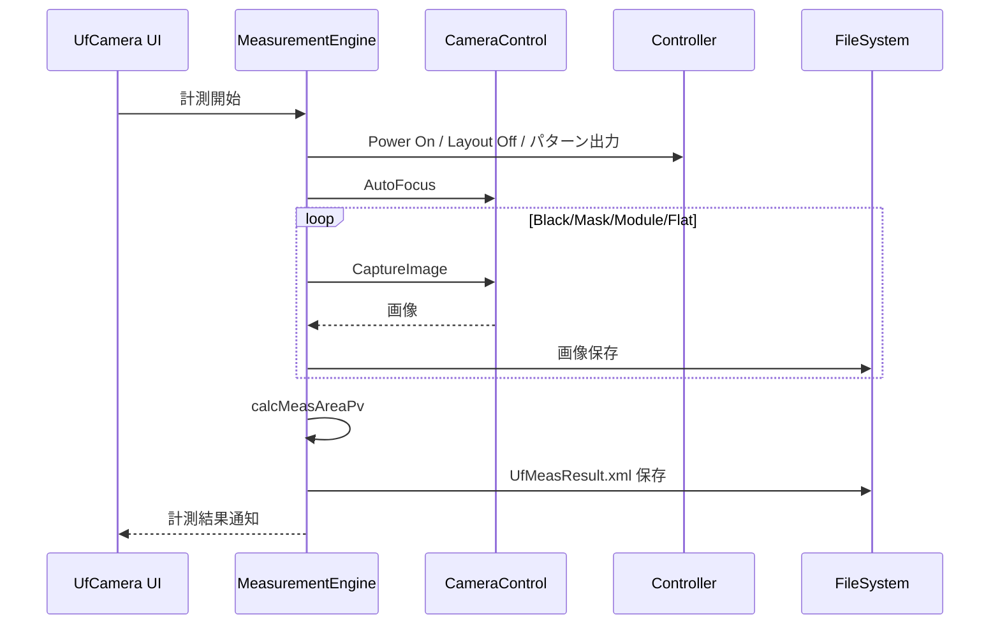
```mermaid
sequenceDiagram
    participant UI as UfCamera UI
    participant MEAS as MeasurementEngine
    participant CAM as CameraControl
    participant CTRL as Controller
    participant FS as FileSystem

    UI->>MEAS: 計測開始
    MEAS->>CTRL: Power On / Layout Off / パターン出力
    MEAS->>CAM: AutoFocus
    loop Black/Mask/Module/Flat
        MEAS->>CAM: CaptureImage
        CAM-->>MEAS: 画像
        MEAS->>FS: 画像保存
    end
    MEAS->>MEAS: calcMeasAreaPv
    MEAS->>FS: UfMeasResult.xml 保存
    MEAS-->>UI: 計測結果通知
```

#### 7-3-2. 調整処理シーケンス

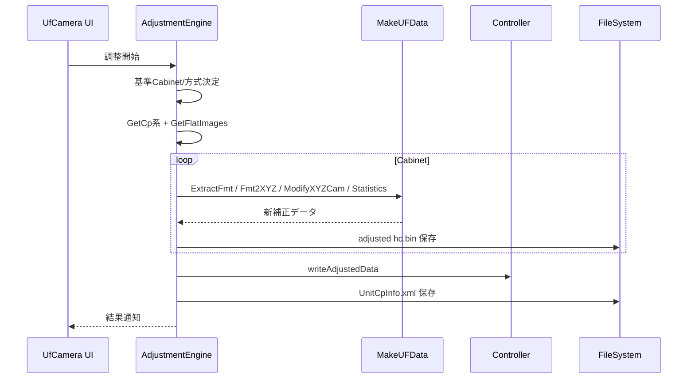
```mermaid
sequenceDiagram
    participant UI as UfCamera UI
    participant ADJ as AdjustmentEngine
    participant MK as MakeUFData
    participant CTRL as Controller
    participant FS as FileSystem

    UI->>ADJ: 調整開始
    ADJ->>ADJ: 基準Cabinet/方式決定
    ADJ->>ADJ: GetCp系 + GetFlatImages
    loop Cabinet
        ADJ->>MK: ExtractFmt / Fmt2XYZ / ModifyXYZCam / Statistics
        MK-->>ADJ: 新補正データ
        ADJ->>FS: adjusted hc.bin 保存
    end
    ADJ->>CTRL: writeAdjustedData
    ADJ->>FS: UnitCpInfo.xml 保存
    ADJ-->>UI: 結果通知
```

#### 7-3-3. 結果読込処理シーケンス

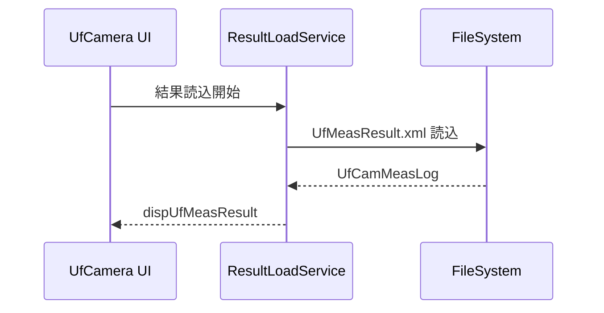
```mermaid
sequenceDiagram
    participant UI as UfCamera UI
    participant RES as ResultLoadService
    participant FS as FileSystem

    UI->>RES: 結果読込開始
    RES->>FS: UfMeasResult.xml 読込
    FS-->>RES: UfCamMeasLog
    RES-->>UI: dispUfMeasResult
```

## 8. メソッド仕様

本章は、機能とモジュール境界が追いやすいように、以下の順で節を配置する。

| 並び順 | 節 | 主担当モジュール | 主な責務 |
|--------|----|------------------|----------|
| 1 | 8-1 | MainWindow / UfCamera | UIイベント起点の制御処理 |
| 2 | 8-2 | UfCamera | 計測・補正の業務処理 |
| 3 | 8-3 | UfCamera / UnitInfo | 設定値の取得・設定・書込み |
| 4 | 8-4 | UfCamera / MakeUFData / UfAdjustUnit | 補助計算と補正演算 |
| 5 | 8-5 | UfCamera + 連携モジュール | 連携モジュール呼出し |
| 6 | 8-6 | EstimateCameraPos 連携要素 | 姿勢推定連携メンバ定義 |
| 7 | 8-7 | GapCamera 参照節 | 相互参照方針と追従ルール |

### 8-1. UIイベント・制御メソッド

#### 8-1-1. cmbxUfCamCamera_SelectionChanged

| 項目 | 内容 |
|------|------|
| シグネチャ | private void cmbxUfCamCamera_SelectionChanged(object sender, SelectionChangedEventArgs e) |
| 概要 | U/F側カメラ選択をGap側とSettingsへ同期する |

引数: sender, e
返り値: なし（void）

処理概要（詳細）

| 手順No. | 処理内容 | 詳細 |
|---------|----------|------|
| 1 | Gap側選択同期 | cmbxGapCamCamera.SelectedIndex を U/F選択値へ合わせる。 |
| 2 | 設定反映 | Settings.Ins.Camera.Name へカメラ名を設定する。 |
| 3 | レンズ一覧更新 | ShowLensCdFiles を呼び出して対応レンズCD一覧を更新する。 |

主要呼出し先

| 呼出し先 | 役割 | 同期/非同期 |
|----------|------|--------------|
| ShowLensCdFiles | レンズCD一覧更新 | 同期 |

入力条件・前提条件

| 区分 | 条件 | NG時挙動 |
|------|------|----------|
| 実行前提 | 本節の処理概要に記載した前段処理が完了していること | 例外通知して処理中断 |
| 入力値 | 引数/内部状態が有効範囲であること | 例外通知して処理中断 |

条件分岐仕様

| 条件 | 挙動 |
|------|------|
| `type == UfCamAdjustType.EachModule` | `AdjustUfCamEachModule` を呼び出す。 |
| `type == UfCamAdjustType.Radiator` | `AdjustUfCamRadiator` を呼び出す。 |
| `type == UfCamAdjustType.Cabi_9pt` | `AdjustUfCam9pt` を呼び出す。 |
| 上記以外 | `AdjustUfCamCabinet` を呼び出す。 |
| 方式別調整内 `ExtractFmt` | 各Cabinetループで必ず1回実行し、失敗時は `Failed in ExtractFmt.` 例外を送出して中断する。 |
| 方式別調整内 `Fmt2XYZ*` | `ForCrosstalkCameraUF` 有効時は LEDモデルにより `Fmt2XYZ_Crosstalk` / `Fmt2XYZ` を分岐、無効時は `Fmt2XYZ` 固定。失敗時は `Failed in Fmt2XYZ.` 例外。 |
| 方式別調整内 `ModifyXYZCam*` | `ufCamAdjAlgo == CommonColor` なら `ModifyXYZCam` 系、その他は `ModifyXYZCamCommonLed`。失敗時は `Failed in ModifyXYZCam.` 例外。 |
| 方式別調整内 `Statistics*` | `ForCrosstalkCameraUF` 有効時は `Statistics_CameraUF`、無効時は `Statistics(-1, ...)`。失敗時は `Failed in Statistics.` 例外。 |

例外時仕様

| ケース | 捕捉方法 | 通知 | 後処理 |
|--------|----------|------|--------|
| 同期/設定反映失敗 | Exception | CAS Error表示 | 無処理終了 |

シーケンス図

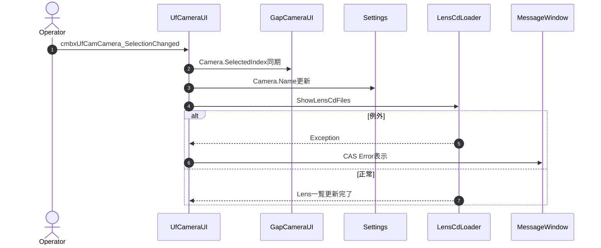
```mermaid
sequenceDiagram
    autonumber
    actor OP as Operator
    participant UF as UfCameraUI
    participant GAP as GapCameraUI
    participant SET as Settings
    participant LENS as LensCdLoader
    participant MSG as MessageWindow

    OP->>UF: cmbxUfCamCamera_SelectionChanged
    UF->>GAP: Camera.SelectedIndex同期
    UF->>SET: Camera.Name更新
    UF->>LENS: ShowLensCdFiles
    alt 例外
        LENS-->>UF: Exception
        UF->>MSG: CAS Error表示
    else 正常
        LENS-->>UF: Lens一覧更新完了
    end
```

#### 8-1-2. btnUfCamConnect_Click

| 項目 | 内容 |
|------|------|
| シグネチャ | private void btnUfCamConnect_Click(object sender, RoutedEventArgs e) |
| 概要 | カメラ接続を行い、U/F・Gap両タブの関連UIを有効化する |

引数: sender, e
返り値: なし（void）

処理概要（詳細）

| 手順No. | 処理内容 | 詳細 |
|---------|----------|------|
| 1 | 開始状態遷移 | actionButton で接続開始状態へ遷移する。 |
| 2 | Tempフォルダ作成 | tempPath 未存在時に作成する。 |
| 3 | 接続切替 | 既存接続を DisconnectCamera で解除し、ConnectCamera を実行する。 |
| 4 | U/F UI更新 | 接続済み前提でコンボ固定、切断ボタンと位置合わせグループを有効化する。 |
| 5 | Gap UI同期 | Gap側の接続関連コントロールも同様に有効化する。 |
| 6 | Developerモード分岐 | Developer時のみ計測/調整ボタン群を有効化する。 |

入力条件・前提条件

| 区分 | 条件 | NG時挙動 |
|------|------|----------|
| Tempパス | 作成可能であること | 例外通知して終了 |
| カメラ接続 | ConnectCamera が成功すること | 例外通知して終了 |

主要呼出し先

| 呼出し先 | 役割 | 同期/非同期 |
|----------|------|--------------|
| actionButton | 接続開始時のUI状態遷移 | 同期 |
| DisconnectCamera | 既存接続解除 | 同期 |
| ConnectCamera | カメラ接続 | 同期 |

条件分岐仕様

| 条件 | 挙動 |
|------|------|
| 正常系 | 処理概要（詳細）の手順に従って処理を継続する。 |
| 異常系 | 例外時仕様に従って通知または中断する。 |

例外時仕様

| ケース | 捕捉方法 | 通知 | 後処理 |
|--------|----------|------|--------|
| 接続失敗 | Exception | CAS Error表示 | UIは直前状態のまま |

シーケンス図

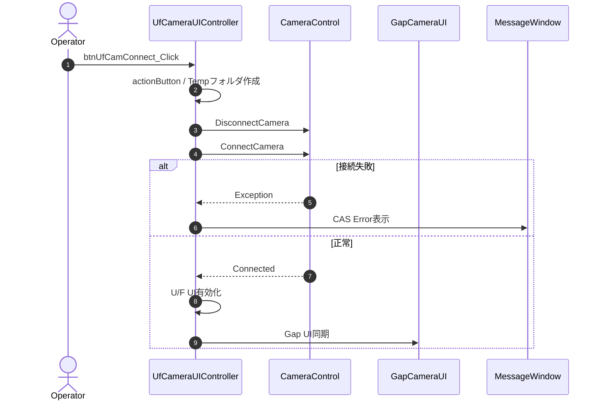
```mermaid
sequenceDiagram
    autonumber
    actor OP as Operator
    participant UI as UfCameraUIController
    participant CAM as CameraControl
    participant GAP as GapCameraUI
    participant MSG as MessageWindow

    OP->>UI: btnUfCamConnect_Click
    UI->>UI: actionButton / Tempフォルダ作成
    UI->>CAM: DisconnectCamera
    UI->>CAM: ConnectCamera
    alt 接続失敗
        CAM-->>UI: Exception
        UI->>MSG: CAS Error表示
    else 正常
        CAM-->>UI: Connected
        UI->>UI: U/F UI有効化
        UI->>GAP: Gap UI同期
    end
```

#### 8-1-3. btnUfCamDisconnect_Click

| 項目 | 内容 |
|------|------|
| シグネチャ | private void btnUfCamDisconnect_Click(object sender, RoutedEventArgs e) |
| 概要 | カメラ切断と位置合わせ停止を行い、関連UIを無効化する |

引数: sender, e
返り値: なし（void）

処理概要（詳細）

| 手順No. | 処理内容 | 詳細 |
|---------|----------|------|
| 1 | 開始状態遷移 | actionButton を実行する。 |
| 2 | 位置合わせ停止フラグ設定 | tbtnUfCamSetPos と tbtnGapCamSetPos を false にする。 |
| 3 | カメラ切断 | DisconnectCamera を実行する。 |
| 4 | U/F UI無効化 | 接続、計測、調整、位置合わせ関連を無効化する。 |
| 5 | Gap UI無効化 | Gap側の接続、計測、調整、位置合わせ関連を無効化する。 |

入力条件・前提条件

| 区分 | 条件 | NG時挙動 |
|------|------|----------|
| 接続状態 | カメラ接続済み、または切断可能状態であること | 例外通知して処理を中断 |
| 位置合わせ状態 | タイマ停止処理が可能であること | 停止不可時はエラー通知後に強制OFF |

主要呼出し先

| 呼出し先 | 役割 | 同期/非同期 |
|----------|------|--------------|
| DisconnectCamera | カメラ接続解除 | 同期 |
| actionButton | UI状態遷移管理 | 同期 |

条件分岐仕様

| 条件 | 挙動 |
|------|------|
| 正常系 | 処理概要（詳細）の手順に従って処理を継続する。 |
| 異常系 | 例外時仕様に従って通知または中断する。 |

例外時仕様

| ケース | 捕捉方法 | 通知 | 後処理 |
|--------|----------|------|--------|
| 切断失敗 | Exception | CAS Error表示 | UIを安全側(無効)へ寄せる |
| 停止処理失敗 | Exception | CAS Error表示 | tbtnUfCamSetPos=false を維持 |

シーケンス図

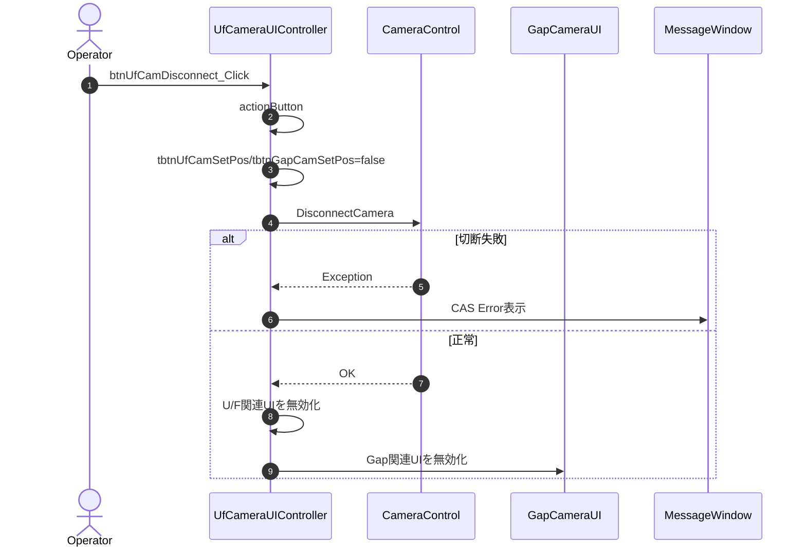
```mermaid
sequenceDiagram
    autonumber
    actor OP as Operator
    participant UI as UfCameraUIController
    participant CAM as CameraControl
    participant GAP as GapCameraUI
    participant MSG as MessageWindow

    OP->>UI: btnUfCamDisconnect_Click
    UI->>UI: actionButton
    UI->>UI: tbtnUfCamSetPos/tbtnGapCamSetPos=false
    UI->>CAM: DisconnectCamera
    alt 切断失敗
        CAM-->>UI: Exception
        UI->>MSG: CAS Error表示
    else 正常
        CAM-->>UI: OK
        UI->>UI: U/F関連UIを無効化
        UI->>GAP: Gap関連UIを無効化
    end
```

#### 8-1-4. btnUfCamMeasStart_Click

| 項目 | 内容 |
|------|------|
| シグネチャ | private async void btnUfCamMeasStart_Click(object sender, RoutedEventArgs e) |
| 概要 | U/F計測処理を開始する |

引数: sender, e
返り値: なし（void）

処理概要（詳細）

| 手順No. | 処理内容 | 詳細 |
|---------|----------|------|
| 1 | 開始処理 | ufCamMeasLog 初期化と actionButton 実行を行う。 |
| 2 | 対象Cabinet検証 | CheckSelectedUnits で選択不備・矩形不成立を検出する。 |
| 3 | 対象Controller初期化 | dicController.Target を対象Cabinetに合わせて更新する。 |
| 4 | Progress初期化 | WindowProgress を Measurement モードで生成し開始メッセージを表示する。 |
| 5 | 位置合わせ停止 | 位置合わせ中ならタイマ停止、トグルOFF、通常設定復帰を実施する。 |
| 6 | 距離条件取得 | dist、wallH、camH をUIから取得し CheckShootingDist を実施する。 |
| 7 | 保存先準備 | measPath を UF_yyyyMMddHHmm 形式で作成し m_CamUfMeasPath へ保持する。 |
| 8 | 非同期計測実行 | Task.Run で MeasureUfAsync を起動する。 |
| 9 | finally処理 | ThroughMode解除、ユーザー設定復帰、不要画像削除、XML保存、ログ世代管理を行う。 |
| 10 | 終了通知 | Measurement UF Complete または Failed in Measurement UF を表示し UIを復帰する。 |

入力条件・前提条件

| 区分 | 条件 | NG時挙動 |
|------|------|----------|
| 対象選択 | 計測対象Cabinetが矩形成立していること | エラー表示後に tcUfCamView=0 へ戻して終了 |
| 距離条件 | dist が取得可能で仕様範囲内であること | 例外通知して終了 |
| 保存先 | measPath 配下へ書込み可能であること | 例外通知して終了 |

主要呼出し先

| 呼出し先 | 役割 | 同期/非同期 |
|----------|------|--------------|
| actionButton / releaseButton | 開始・終了時のUI状態遷移 | 同期 |
| CheckSelectedUnits | 対象Cabinetの妥当性検証 | 同期 |
| CheckShootingDist | 撮影距離条件の妥当性確認 | 同期 |
| MeasureUfAsync | U/F計測主処理 | 非同期（Task.Run） |
| SetThroughMode / setUserSettingSetPos | 位置合わせ停止時の画質設定復帰 | 同期 |
| DeleteUnwantedImagesMeas | 不要画像削除 | 同期 |
| UfCamMeasLog.SaveToXmlFile | 計測結果XML保存 | 同期 |
| ManageLogGen | 測定ログ世代管理 | 同期 |

条件分岐仕様

| 条件 | 挙動 |
|------|------|
| 正常系 | 処理概要（詳細）の手順に従って処理を継続する。 |
| 異常系 | 例外時仕様に従って通知または中断する。 |

例外時仕様

| ケース | 捕捉方法 | 通知 | 後処理 |
|--------|----------|------|--------|
| 対象検証失敗 | CheckSelectedUnits 例外 | CAS Error表示 | releaseButton 実行 |
| ユーザー中断 | CameraCasUserAbortException | Abort表示 | status=false、Progress操作終了 |
| 計測失敗 | Exception | CAS Error表示 | status=false、UI復帰 |

シーケンス図

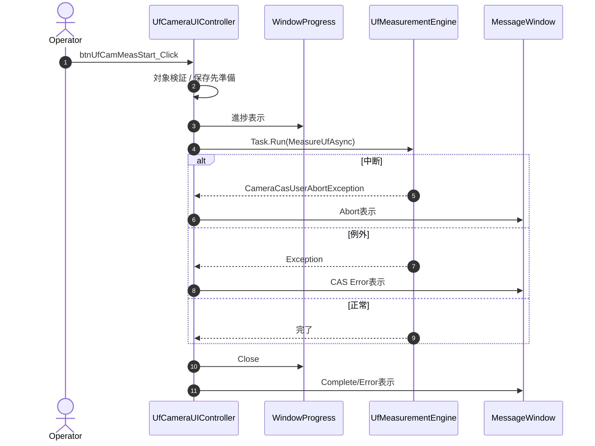
```mermaid
sequenceDiagram
    autonumber
    actor OP as Operator
    participant UI as UfCameraUIController
    participant PRG as WindowProgress
    participant MEAS as UfMeasurementEngine
    participant MSG as MessageWindow

    OP->>UI: btnUfCamMeasStart_Click
    UI->>UI: 対象検証 / 保存先準備
    UI->>PRG: 進捗表示
    UI->>MEAS: Task.Run(MeasureUfAsync)
    alt 中断
        MEAS-->>UI: CameraCasUserAbortException
        UI->>MSG: Abort表示
    else 例外
        MEAS-->>UI: Exception
        UI->>MSG: CAS Error表示
    else 正常
        MEAS-->>UI: 完了
    end
    UI->>PRG: Close
    UI->>MSG: Complete/Error表示
```

#### 8-1-5. btnUfCamAdjustStart_Click

| 項目 | 内容 |
|------|------|
| シグネチャ | private async void btnUfCamAdjustStart_Click(object sender, RoutedEventArgs e) |
| 概要 | U/F調整処理を開始し、必要に応じて調整後再計測を行う |

引数: sender, e
返り値: なし（void）

処理概要（詳細）

| 手順No. | 処理内容 | 詳細 |
|---------|----------|------|
| 1 | 初期化 | ufCamAdjLog 初期化と actionButton 実行を行う。 |
| 2 | 対象Cabinet検証 | CheckSelectedUnits により調整対象を検証する。 |
| 3 | Progress初期化 | Adjustment モードの WindowProgress を表示する。 |
| 4 | 位置合わせ停止 | 実行中の位置合わせを停止し通常設定へ戻す。 |
| 5 | 実行前条件確認 | IsCameraOpened を確認し未接続時は終了する。 |
| 6 | 保存先準備 | logDir を CamUF_yyyyMMddHHmm 形式で作成する。 |
| 7 | 調整条件確定 | 調整方式、視聴点、基準Cabinet、距離条件をUIから取得する。 |
| 8 | 調整主処理起動 | Task.Run で AdjustUfCamAsync を起動する。 |
| 9 | 任意再計測 | cbUfCamMeasResult が true の場合、MeasureUfAsync を再実行する。 |
| 10 | finally処理 | 設定復帰、XML保存、ログ世代管理、メッセージ表示、UI復帰を行う。 |

主要呼出し先

| 呼出し先 | 役割 | 同期/非同期 |
|----------|------|--------------|
| StoreObjectiveCabinet | 基準Cabinet決定 | 同期 |
| CheckObjectiveCabinet | 基準Cabinet妥当性検証 | 同期 |
| AdjustUfCamAsync | U/F調整主処理 | 非同期（Task.Run） |
| MeasureUfAsync | 調整後再計測 | 非同期（Task.Run） |

入力条件・前提条件

| 区分 | 条件 | NG時挙動 |
|------|------|----------|
| 実行前提 | 本節の処理概要に記載した前段処理が完了していること | 例外通知して処理中断 |
| 入力値 | 引数/内部状態が有効範囲であること | 例外通知して処理中断 |

条件分岐仕様

| 条件 | 挙動 |
|------|------|
| 正常系 | 処理概要（詳細）の手順に従って処理を継続する。 |
| 異常系 | 例外時仕様に従って通知または中断する。 |

例外時仕様

| ケース | 捕捉方法 | 通知 | 後処理 |
|--------|----------|------|--------|
| カメラ未接続 | IsCameraOpened false | CAS Error表示 | tcMain を復帰 |
| 基準Cabinet不正 | CheckObjectiveCabinet 例外 | CAS Error表示 | status=false |
| ユーザー中断 | CameraCasUserAbortException | Abort表示 | status=false |
| 調整失敗 | Exception | CAS Error表示 | status=false、UI復帰 |

シーケンス図

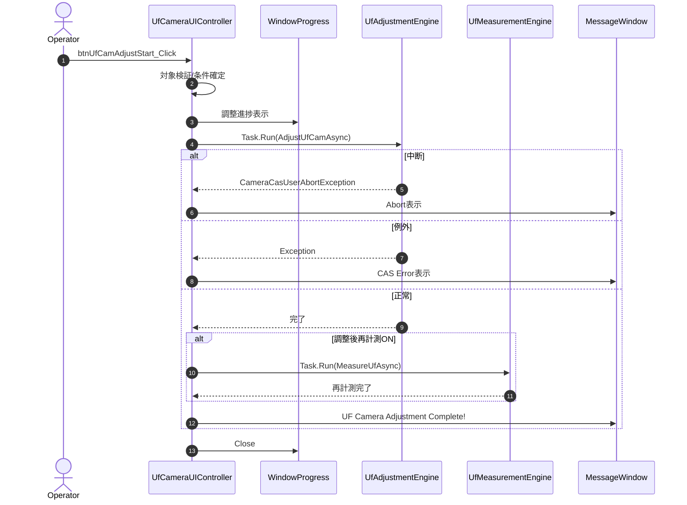
```mermaid
sequenceDiagram
    autonumber
    actor OP as Operator
    participant UI as UfCameraUIController
    participant PRG as WindowProgress
    participant ADJ as UfAdjustmentEngine
    participant MEAS as UfMeasurementEngine
    participant MSG as MessageWindow

    OP->>UI: btnUfCamAdjustStart_Click
    UI->>UI: 対象検証/条件確定
    UI->>PRG: 調整進捗表示
    UI->>ADJ: Task.Run(AdjustUfCamAsync)
    alt 中断
        ADJ-->>UI: CameraCasUserAbortException
        UI->>MSG: Abort表示
    else 例外
        ADJ-->>UI: Exception
        UI->>MSG: CAS Error表示
    else 正常
        ADJ-->>UI: 完了
        alt 調整後再計測ON
            UI->>MEAS: Task.Run(MeasureUfAsync)
            MEAS-->>UI: 再計測完了
        end
        UI->>MSG: UF Camera Adjustment Complete!
    end
    UI->>PRG: Close
```

#### 8-1-6. cbUfCamTgtCabi_Checked

| 項目 | 内容 |
|------|------|
| シグネチャ | private void cbUfCamTgtCabi_Checked(object sender, RoutedEventArgs e) |
| 概要 | 基準Line選択数と組合せの妥当性を検証する |

引数: sender, e
返り値: なし（void）

処理概要（詳細）

| 手順No. | 処理内容 | 詳細 |
|---------|----------|------|
| 1 | 選択数集計 | Top/Bottom/Left/Right の選択数を数える。 |
| 2 | 上限判定 | 3本以上選択時はメッセージ表示し当該チェックを戻す。 |
| 3 | 排他判定 | Top+Bottom または Left+Right の同時選択時はメッセージ表示し当該チェックを戻す。 |

入力条件・前提条件

| 区分 | 条件 | NG時挙動 |
|------|------|----------|
| イベント送信元 | CheckBox であること | キャスト失敗時は無処理終了 |
| 選択状態 | 1〜2本選択、かつ対向辺同時選択なし | 警告表示し送信元を false へ戻す |

主要呼出し先

| 呼出し先 | 役割 | 同期/非同期 |
|----------|------|--------------|
| showMessageWindow | 警告メッセージ表示 | 同期 |

条件分岐仕様

| 条件 | 挙動 |
|------|------|
| 正常系 | 処理概要（詳細）の手順に従って処理を継続する。 |
| 異常系 | 例外時仕様に従って通知または中断する。 |

例外時仕様

| ケース | 捕捉方法 | 通知 | 後処理 |
|--------|----------|------|--------|
| 選択規則違反 | 条件分岐 | Up to 2 lines can be selected. | 対象チェックを解除 |

シーケンス図

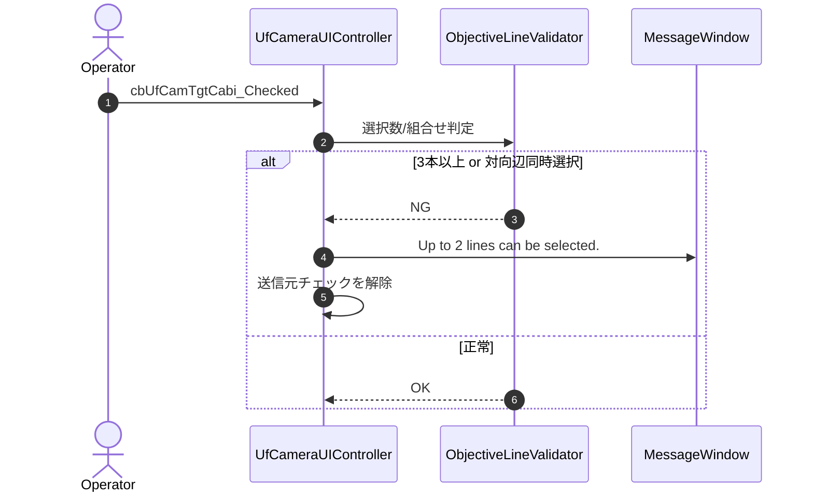
```mermaid
sequenceDiagram
    autonumber
    actor OP as Operator
    participant UI as UfCameraUIController
    participant LINE as ObjectiveLineValidator
    participant MSG as MessageWindow

    OP->>UI: cbUfCamTgtCabi_Checked
    UI->>LINE: 選択数/組合せ判定
    alt 3本以上 or 対向辺同時選択
        LINE-->>UI: NG
        UI->>MSG: Up to 2 lines can be selected.
        UI->>UI: 送信元チェックを解除
    else 正常
        LINE-->>UI: OK
    end
```

#### 8-1-7. tbtnUfCamSetPos_Click

| 項目 | 内容 |
|------|------|
| シグネチャ | private void tbtnUfCamSetPos_Click(object sender, RoutedEventArgs e) |
| 概要 | カメラ位置合わせモードの開始/停止を制御する |

引数: sender, e
返り値: なし（void）

処理概要（詳細）

| 手順No. | 処理内容 | 詳細 |
|---------|----------|------|
| 1 | 開始音再生 | playSound を実行しステータス表示を更新する。 |
| 2 | ON時の距離条件確認 | dist、wallH、camH を取得し CheckShootingDist を実施する。 |
| 3 | ON時の対象検証 | CheckSelectedUnits で矩形成立を確認する。 |
| 4 | ON時の設定退避/適用 | getUserSettingSetPos、setAdjustSettingSetPos、Layout情報Off を実施する。 |
| 5 | AFと目標位置設定 | outputIntSigChecker 後に AutoFocus と SetCamPosTarget を実行する。 |
| 6 | Cabinet空間座標設定 | SetCabinetPos を実行する。 |
| 7 | 表示切替/タイマ開始 | tcUfCamView=1 とし timerUfCam.Enabled=true を設定する。 |
| 8 | OFF時処理 | ステータスを Done. に戻す。 |

入力条件・前提条件

| 区分 | 条件 | NG時挙動 |
|------|------|----------|
| 実行前提 | 本節の処理概要に記載した前段処理が完了していること | 例外通知して処理中断 |
| 入力値 | 引数/内部状態が有効範囲であること | 例外通知して処理中断 |

条件分岐仕様

| 条件 | 挙動 |
|------|------|
| 正常系 | 処理概要（詳細）の手順に従って処理を継続する。 |
| 異常系 | 例外時仕様に従って通知または中断する。 |

主要呼出し先

| 呼出し先 | 役割 | 同期/非同期 |
|----------|------|--------------|
| playSound | 開始音再生 | 同期 |
| CheckShootingDist | 距離条件妥当性確認 | 同期 |
| CheckSelectedUnits | 対象Cabinetの矩形成立確認 | 同期 |
| getUserSettingSetPos / setAdjustSettingSetPos | ユーザー設定退避と位置合わせ用設定適用 | 同期 |
| outputIntSigChecker / AutoFocus | 内部信号出力とAF実行 | 同期 |
| SetCamPosTarget / SetCabinetPos | 目標位置算出とCabinet空間座標設定 | 同期 |
| timerUfCam.Enabled 設定 | 位置合わせタイマ開始 | 同期 |

例外時仕様

| ケース | 捕捉方法 | 通知 | 後処理 |
|--------|----------|------|--------|
| 対象検証失敗 | CheckSelectedUnits 例外 | CAS Error表示 | トグルOFF、タブ0へ復帰 |
| 準備処理失敗 | Exception | CAS Error表示 | ThroughMode解除、設定復帰、内部信号OFF |

シーケンス図

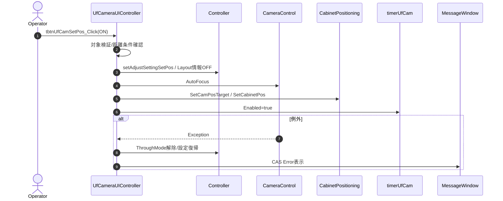
```mermaid
sequenceDiagram
    autonumber
    actor OP as Operator
    participant UI as UfCameraUIController
    participant CTRL as Controller
    participant CAM as CameraControl
    participant POS as CabinetPositioning
    participant TMR as timerUfCam
    participant MSG as MessageWindow

    OP->>UI: tbtnUfCamSetPos_Click(ON)
    UI->>UI: 対象検証/距離条件確認
    UI->>CTRL: setAdjustSettingSetPos / Layout情報OFF
    UI->>CAM: AutoFocus
    UI->>POS: SetCamPosTarget / SetCabinetPos
    UI->>TMR: Enabled=true
    alt 例外
        CAM-->>UI: Exception
        UI->>CTRL: ThroughMode解除/設定復帰
        UI->>MSG: CAS Error表示
    end
```

#### 8-1-8. timerUfCam_Tick

| 項目 | 内容 |
|------|------|
| シグネチャ | private void timerUfCam_Tick(object sender, EventArgs e) |
| 概要 | 位置合わせ中の周期更新処理を実行する |

引数: sender, e
返り値: なし（void）

処理概要（詳細）

| 手順No. | 処理内容 | 詳細 |
|---------|----------|------|
| 1 | 位置合わせ更新 | AdjustCameraPosUf を呼び出してライブ表示とガイド評価を更新する。 |
| 2 | 例外時の設定復帰 | ThroughMode解除、ユーザー設定復帰、内部信号OFFを実施する。 |
| 3 | 位置合わせ停止 | タイマ停止、トグルOFF、tbtnUfCamSetPos_Click 呼出しで停止遷移を確定する。 |
| 4 | エラー通知 | CAS Errorダイアログを表示する。 |

入力条件・前提条件

| 区分 | 条件 | NG時挙動 |
|------|------|----------|
| 位置合わせ状態 | tbtnUfCamSetPos=true かつ timerUfCam.Enabled=true | 条件不成立時は更新スキップ |
| カメラ状態 | IsCameraOpened=true が維持されること | 例外で停止遷移 |

主要呼出し先

| 呼出し先 | 役割 | 同期/非同期 |
|----------|------|--------------|
| AdjustCameraPosUf | ライブ画像取得と位置合わせ評価 | 同期 |
| SetThroughMode | Through Mode解除 | 同期 |
| setUserSettingSetPos | 位置合わせ用退避設定の復元 | 同期 |
| stopIntSig | 内部信号停止 | 同期 |

条件分岐仕様

| 条件 | 挙動 |
|------|------|
| 正常系 | 処理概要（詳細）の手順に従って処理を継続する。 |
| 異常系 | 例外時仕様に従って通知または中断する。 |

例外時仕様

| ケース | 捕捉方法 | 通知 | 後処理 |
|--------|----------|------|--------|
| ライブ更新失敗 | Exception | CAS Error表示 | タイマ停止、トグルOFF、設定復帰 |

シーケンス図

```mermaid
sequenceDiagram
    autonumber
    participant TMR as timerUfCam
    participant UI as UfCameraUIController
    participant POS as AdjustCameraPosUf
    participant SET as SettingRestore
    participant MSG as MessageWindow

    TMR->>UI: timerUfCam_Tick
    UI->>POS: AdjustCameraPosUf
    alt 例外
        POS-->>UI: Exception
        UI->>SET: ThroughMode解除/setUserSettingSetPos/stopIntSig
        UI->>UI: timer停止/トグルOFF
        UI->>MSG: CAS Error表示
    else 正常
        POS-->>UI: 更新完了
    end
```

#### 8-1-9. btnUfCamResultOpen_Click

| 項目 | 内容 |
|------|------|
| シグネチャ | private void btnUfCamResultOpen_Click(object sender, RoutedEventArgs e) |
| 概要 | 保存済みU/F計測結果XMLを読込み、結果表示へ再展開する |

引数: sender, e
返り値: なし（void）

処理概要（詳細）

| 手順No. | 処理内容 | 詳細 |
|---------|----------|------|
| 1 | OpenFileDialog 初期化 | 測定フォルダを初期ディレクトリに設定する。 |
| 2 | XML選択 | OK時のみ後続処理を実行する。 |
| 3 | XML読込 | UfCamMeasLog.LoadFromXmlFile を実行する。 |
| 4 | 結果表示 | dispUfMeasResult を呼び出す。 |
| 5 | 例外時通知 | 形式不正メッセージを表示する。 |

入力条件・前提条件

| 区分 | 条件 | NG時挙動 |
|------|------|----------|
| ファイル選択 | XMLファイルが選択されること | Cancel時は無処理終了 |
| ファイル形式 | UfCamMeasLog 形式と整合すること | 形式不正メッセージ表示 |

主要呼出し先

| 呼出し先 | 役割 | 同期/非同期 |
|----------|------|--------------|
| OpenFileDialog | 結果XMLパスの選択 | 同期 |
| UfCamMeasLog.LoadFromXmlFile | 計測結果の読込 | 同期 |
| dispUfMeasResult | 画面への再表示 | 同期 |

条件分岐仕様

| 条件 | 挙動 |
|------|------|
| 正常系 | 処理概要（詳細）の手順に従って処理を継続する。 |
| 異常系 | 例外時仕様に従って通知または中断する。 |

例外時仕様

| ケース | 捕捉方法 | 通知 | 後処理 |
|--------|----------|------|--------|
| XML形式不正 | Exception | The format of the opened file is incorrect. | 画面状態を維持 |
| 読込失敗 | Exception | CAS Error表示 | 処理中断 |

シーケンス図

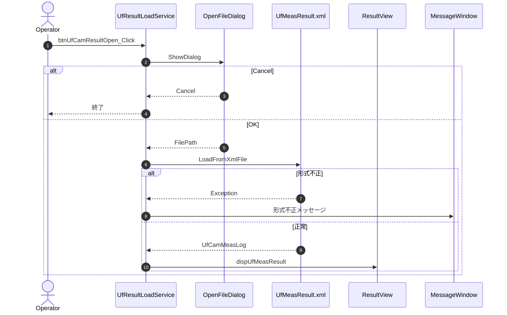
```mermaid
sequenceDiagram
    autonumber
    actor OP as Operator
    participant UI as UfResultLoadService
    participant DLG as OpenFileDialog
    participant XML as UfMeasResult.xml
    participant VIEW as ResultView
    participant MSG as MessageWindow

    OP->>UI: btnUfCamResultOpen_Click
    UI->>DLG: ShowDialog
    alt Cancel
        DLG-->>UI: Cancel
        UI-->>OP: 終了
    else OK
        DLG-->>UI: FilePath
        UI->>XML: LoadFromXmlFile
        alt 形式不正
            XML-->>UI: Exception
            UI->>MSG: 形式不正メッセージ
        else 正常
            XML-->>UI: UfCamMeasLog
            UI->>VIEW: dispUfMeasResult
        end
    end
```

#### 8-1-10. cmbxUfCamLensCd_SelectionChanged

| 項目 | 内容 |
|------|------|
| シグネチャ | private void cmbxUfCamLensCd_SelectionChanged(object sender, SelectionChangedEventArgs e) |
| 概要 | U/F側レンズCD選択をGap側へ同期する |

引数: sender, e
返り値: なし（void）

処理概要（詳細）

| 手順No. | 処理内容 | 詳細 |
|---------|----------|------|
| 1 | 選択状態取得 | cmbxUfCamLensCd.SelectedIndex を取得する。 |
| 2 | Gap側同期 | cmbxGapCamLensCd.SelectedIndex へ同値を設定する。 |
| 3 | 終了 | 同期完了後に処理を終了する。 |

入力条件・前提条件

| 区分 | 条件 | NG時挙動 |
|------|------|----------|
| レンズ一覧 | U/FとGapのレンズ候補数が整合していること | 例外通知して終了 |
| 選択値 | SelectedIndex が有効範囲であること | 例外通知して終了 |

主要呼出し先

| 呼出し先 | 役割 | 同期/非同期 |
|----------|------|--------------|
| cmbxGapCamLensCd | Gap側レンズ選択UI | 同期 |

条件分岐仕様

| 条件 | 挙動 |
|------|------|
| 正常系 | 処理概要（詳細）の手順に従って処理を継続する。 |
| 異常系 | 例外時仕様に従って通知または中断する。 |

例外時仕様

| ケース | 捕捉方法 | 通知 | 後処理 |
|--------|----------|------|--------|
| 選択同期失敗 | Exception | CAS Error表示 | 無処理終了 |

シーケンス図

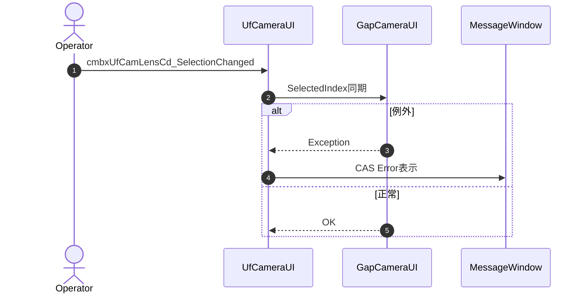
```mermaid
sequenceDiagram
    autonumber
    actor OP as Operator
    participant UF as UfCameraUI
    participant GAP as GapCameraUI
    participant MSG as MessageWindow

    OP->>UF: cmbxUfCamLensCd_SelectionChanged
    UF->>GAP: SelectedIndex同期
    alt 例外
        GAP-->>UF: Exception
        UF->>MSG: CAS Error表示
    else 正常
        GAP-->>UF: OK
    end
```

### 8-2. 業務処理メソッド

#### 8-2-1. MeasureUfAsync

| 項目 | 内容 |
|------|------|
| シグネチャ | private void MeasureUfAsync(List<UnitInfo> lstTgtCabi, string measPath, ViewPoint vp, double dist, double wallH, double camH, bool targetOnly = false) |
| 概要 | U/F計測の主処理を実行し、撮影、解析、結果表示までを一括制御する |

引数: lstTgtCabi, measPath, vp, dist, wallH, camH, targetOnly
返り値: なし（void）

処理概要（詳細）

| 手順No. | 処理内容 | 詳細 |
|---------|----------|------|
| 1 | Progress初期化 | 全体ステップ数、残り時間を初期化する。 |
| 2 | 環境確認 | OpenCvSharp DLL の存在を確認する。 |
| 3 | 前処理 | Cabinet Power On、SetCamPosTarget、ユーザー設定退避、Adjust設定適用を行う。 |
| 4 | AF実行 | SetPosSetting で AutoFocus を行う。 |
| 5 | カメラ位置取得 | GetCameraPosUf と CheckCameraPos により開始位置を確定する。 |
| 6 | Cabinet座標補正 | SetCabinetPos と MoveCabinetPos を行い、CheckCpAngle で角度上限を確認する。 |
| 7 | 画像取得 | CaptureUfImages を呼び出し計測画像一式を保存する。 |
| 8 | 解析 | calcMeasAreaPv で Cabinet/Module の測定値を計算する。 |
| 9 | 後処理 | 終了カメラ位置保存、内部信号停止、通常設定復帰、結果表示を行う。 |

主要呼出し先

| 呼出し先 | 役割 | 同期/非同期 |
|----------|------|--------------|
| CheckOpenCvSharpDll | 解析環境確認 | 同期 |
| outputIntSigChecker | パターン表示の事前初期化 | 同期 |
| sendSdcpCommand | Cabinet電源投入と表示制御 | 同期 |
| SetCamPosTarget | カメラ目標位置の再設定 | 同期 |
| getUserSetting / setAdjustSetting | ユーザー設定退避と調整用設定適用 | 同期 |
| AutoFocus | AF実行 | 同期 |
| GetCameraPosUf / CheckCameraPos | 開始時カメラ位置取得と妥当性確認 | 同期 |
| CalcTargetArea | 撮影エリア占有率算出 | 同期 |
| SetCabinetPos / MoveCabinetPos | Cabinet空間座標設定とズレ反映 | 同期 |
| CheckCpAngle | 調整点角度上限確認 | 同期 |
| CaptureUfImages | 計測画像取得 | 同期 |
| calcMeasAreaPv | 測定領域解析 | 同期 |
| stopIntSig | 内部信号停止 | 同期 |
| SetThroughMode / setUserSetting | 通常設定復帰 | 同期 |
| dispUfMeasResult | 測定結果表示 | 同期 |

入力条件・前提条件

| 区分 | 条件 | NG時挙動 |
|------|------|----------|
| 実行前提 | 本節の処理概要に記載した前段処理が完了していること | 例外通知して処理中断 |
| 入力値 | 引数/内部状態が有効範囲であること | 例外通知して処理中断 |

条件分岐仕様

| 条件 | 挙動 |
|------|------|
| 正常系 | 処理概要（詳細）の手順に従って処理を継続する。 |
| 異常系 | 例外時仕様に従って通知または中断する。 |

例外時仕様

| ケース | 捕捉方法 | 通知/伝播 | 後処理 |
|--------|----------|-----------|--------|
| カメラ位置取得失敗 | false戻り/Exception | 呼出元へ送出 | 処理中断 |
| カメラ位置不適切 | CheckCameraPos false | 呼出元へ送出 | 再位置合わせ要求 |
| 角度超過 | CheckCpAngle 例外 | 呼出元へ送出 | 距離条件見直し要求 |

シーケンス図

```mermaid
sequenceDiagram
    autonumber
    participant UI as btnUfCamMeasStart_Click
    participant MEAS as MeasureUfAsync
    participant CTRL as Controller
    participant CAM as CameraControl
    participant CAP as CaptureUfImages
    participant ANA as calcMeasAreaPv

    UI->>MEAS: Task.Run(MeasureUfAsync)
    MEAS->>CTRL: PowerOn/設定適用
    MEAS->>CAM: AutoFocus
    MEAS->>CAM: GetCameraPosUf/CheckCameraPos
    MEAS->>CAP: CaptureUfImages
    CAP-->>MEAS: Black/Mask/Module/Flat
    MEAS->>ANA: calcMeasAreaPv
    ANA-->>MEAS: 測定結果
    MEAS->>CTRL: ThroughMode解除/設定復帰
    MEAS-->>UI: 完了
```

#### 8-2-2. CalcTargetArea

| 項目 | 内容 |
|------|------|
| シグネチャ | private double CalcTargetArea(CvBlob[,] aryBlob) |
| 概要 | 対象Cabinet群のBlob外接領域から画像占有面積を算出する |

引数: aryBlob
返り値: area（double）

処理概要（詳細）

| 手順No. | 処理内容 | 詳細 |
|---------|----------|------|
| 1 | 初期化 | minX/minY を最大値、maxX/maxY を最小値で初期化する。 |
| 2 | Blob走査 | aryBlob 内の有効Blobを走査し外接矩形の境界を更新する。 |
| 3 | 面積算出 | (maxX-minX)×(maxY-minY) で対象面積を算出する。 |
| 4 | 戻り値返却 | 面積を double で返却する。 |

例外時仕様: 有効Blobが存在しない場合は 0 を返す。

入力条件・前提条件

| 区分 | 条件 | NG時挙動 |
|------|------|----------|
| 実行前提 | 本節の処理概要に記載した前段処理が完了していること | 例外通知して処理中断 |
| 入力値 | 引数/内部状態が有効範囲であること | 例外通知して処理中断 |

条件分岐仕様

| 条件 | 挙動 |
|------|------|
| 正常系 | 処理概要（詳細）の手順に従って処理を継続する。 |
| 異常系 | 例外時仕様に従って通知または中断する。 |

主要呼出し先

| 呼出し先 | 役割 | 同期/非同期 |
|----------|------|--------------|
| `CvBlob[,]` 要素参照 | Blobの有効判定と境界値取得 | 同期 |
| `Math.Min` / `Math.Max` | 外接矩形境界の更新 | 同期 |
| 基本算術演算（減算・乗算） | 面積計算 `(maxX-minX)*(maxY-minY)` | 同期 |

シーケンス図

```mermaid
sequenceDiagram
    autonumber
    participant CALLER as MeasureUfAsync
    participant CALC as CalcTargetArea
    participant BLOB as CvBlob[,]

    CALLER->>CALC: CalcTargetArea(aryBlob)
    CALC->>BLOB: 有効Blob走査
    CALC->>CALC: min/max境界更新
    CALC->>CALC: 面積算出
    CALC-->>CALLER: area
```

#### 8-2-3. CheckCpAngle

| 項目 | 内容 |
|------|------|
| シグネチャ | private void CheckCpAngle(List<UnitInfo> lstTgtCabi) |
| 概要 | 調整点の Pan/Tilt が上限を超えていないか確認する |

引数: lstTgtCabi
返り値: なし（void）

処理概要（詳細）

| 手順No. | 処理内容 | 詳細 |
|---------|----------|------|
| 1 | 対象走査 | lstTgtCabi を順次走査する。 |
| 2 | 角度取得 | 各Cabinetの CabinetPos から Pan/Tilt を取得する。 |
| 3 | 上限判定 | |Pan| > PanLimit または |Tilt| > TiltLimit を判定する。 |
| 4 | エラー送出 | 上限超過時は距離条件見直しを促す Exception を送出する。 |

例外時仕様: PanLimit または TiltLimit 超過時に Exception を送出する。

入力条件・前提条件

| 区分 | 条件 | NG時挙動 |
|------|------|----------|
| 実行前提 | 本節の処理概要に記載した前段処理が完了していること | 例外通知して処理中断 |
| 入力値 | 引数/内部状態が有効範囲であること | 例外通知して処理中断 |

条件分岐仕様

| 条件 | 挙動 |
|------|------|
| 正常系 | 処理概要（詳細）の手順に従って処理を継続する。 |
| 異常系 | 例外時仕様に従って通知または中断する。 |

主要呼出し先

| 呼出し先 | 役割 | 同期/非同期 |
|----------|------|--------------|
| `List<UnitInfo>` 走査 | 対象Cabinet反復処理 | 同期 |
| `CabinetPos` 参照 | 各Cabinetの Pan/Tilt 取得 | 同期 |
| `Math.Abs` | 角度絶対値を算出し上限比較 | 同期 |
| `Exception` 送出 | Pan/Tilt 上限超過時に異常通知 | 同期 |

シーケンス図

```mermaid
sequenceDiagram
    autonumber
    participant CALLER as Measure/Adjust
    participant CHK as CheckCpAngle
    participant POS as CabinetPos

    CALLER->>CHK: CheckCpAngle(lstTgtCabi)
    loop 各Cabinet
        CHK->>POS: Pan/Tilt取得
        CHK->>CHK: 上限判定
    end
    alt 上限超過
        CHK-->>CALLER: Exception
    else 正常
        CHK-->>CALLER: 完了
    end
```

#### 8-2-4. CaptureUfImages

| 項目 | 内容 |
|------|------|
| シグネチャ | private void CaptureUfImages(List<UnitInfo> lstTgtCabi, string measPath, bool targetOnly) |
| 概要 | Black、Mask、Module、Flat の計測画像一式を取得する |

引数: lstTgtCabi, measPath, targetOnly
返り値: なし（void）

処理概要（詳細）

| 手順No. | 処理内容 | 詳細 |
|---------|----------|------|
| 1 | Black画像取得 | 内部信号停止状態で Black を撮影する。 |
| 2 | Mask画像取得 | OutputTargetArea 実行後にエリア画像を撮影する。 |
| 3 | Module画像取得 | CaptureModuleAreaImage を呼び出す。 |
| 4 | Flat画像取得 | CaptureMeasFlatImage を呼び出す。 |
| 5 | 内部信号停止 | stopIntSig を実行する。 |

入力条件・前提条件

| 区分 | 条件 | NG時挙動 |
|------|------|----------|
| 実行前提 | 本節の処理概要に記載した前段処理が完了していること | 例外通知して処理中断 |
| 入力値 | 引数/内部状態が有効範囲であること | 例外通知して処理中断 |

条件分岐仕様

| 条件 | 挙動 |
|------|------|
| 正常系 | 処理概要（詳細）の手順に従って処理を継続する。 |
| 異常系 | 例外時仕様に従って通知または中断する。 |

主要呼出し先

| 呼出し先 | 役割 | 同期/非同期 |
|----------|------|--------------|
| `CaptureImage` | Black/Mask 画像の撮影実行 | 同期 |
| `OutputTargetArea` | Mask撮影用の対象エリア表示 | 同期 |
| `CaptureModuleAreaImage` | Module画像群の取得 | 同期 |
| `CaptureMeasFlatImage` | Flat画像群の取得 | 同期 |
| `stopIntSig` | 内部信号停止 | 同期 |

シーケンス図

```mermaid
sequenceDiagram
    autonumber
    participant MEAS as MeasureUfAsync
    participant CAP as CaptureUfImages
    participant CTRL as Controller
    participant CAM as CameraControl
    participant FS as FileSystem

    MEAS->>CAP: CaptureUfImages
    CAP->>CTRL: Blackパターン
    CAP->>CAM: CaptureImage(Black)
    CAM->>FS: Black保存
    CAP->>CTRL: TargetAreaパターン
    CAP->>CAM: CaptureImage(Mask)
    CAM->>FS: Mask保存
    CAP->>CAM: CaptureModuleAreaImage
    CAP->>CAM: CaptureMeasFlatImage
    CAP->>CTRL: stopIntSig
```

#### 8-2-5. CaptureModuleAreaImage

| 項目 | 内容 |
|------|------|
| シグネチャ | private void CaptureModuleAreaImage(string path) |
| 概要 | Module単位の測定エリア画像を順次取得する |

引数: path
返り値: なし（void）

処理概要（詳細）

| 手順No. | 処理内容 | 詳細 |
|---------|----------|------|
| 1 | Moduleループ | moduleCount に従い開始座標を算出する。 |
| 2 | パターン出力 | outputIntSigHatch で対象Moduleを強調表示する。 |
| 3 | 撮影 | CaptureImage で Module画像を保存する。 |

入力条件・前提条件

| 区分 | 条件 | NG時挙動 |
|------|------|----------|
| 実行前提 | 本節の処理概要に記載した前段処理が完了していること | 例外通知して処理中断 |
| 入力値 | 引数/内部状態が有効範囲であること | 例外通知して処理中断 |

条件分岐仕様

| 条件 | 挙動 |
|------|------|
| 正常系 | 処理概要（詳細）の手順に従って処理を継続する。 |
| 異常系 | 例外時仕様に従って通知または中断する。 |

主要呼出し先

| 呼出し先 | 役割 | 同期/非同期 |
|----------|------|--------------|
| `moduleCount` / ループ制御 | Module単位の反復処理 | 同期 |
| `outputIntSigHatch` | 対象Module強調パターン出力 | 同期 |
| `CaptureImage` | Module画像の撮影実行 | 同期 |
| ファイル保存処理 | 撮影結果の永続化 | 同期 |

シーケンス図

```mermaid
sequenceDiagram
    autonumber
    participant CAP as CaptureUfImages
    participant MOD as CaptureModuleAreaImage
    participant CTRL as Controller
    participant CAM as CameraControl
    participant FS as FileSystem

    CAP->>MOD: CaptureModuleAreaImage(path)
    loop 各Module
        MOD->>CTRL: outputIntSigHatch
        MOD->>CAM: CaptureImage
        CAM->>FS: Module画像保存
    end
    MOD-->>CAP: 完了
```

#### 8-2-6. CaptureMeasFlatImage

| 項目 | 内容 |
|------|------|
| シグネチャ | private void CaptureMeasFlatImage(string path, List<UnitInfo> lstTgtCabi, bool targetOnly = false) |
| 概要 | Flat画像群を取得し、U/F測定の平均値計算入力を準備する |

引数: path, lstTgtCabi, targetOnly
返り値: なし（void）

処理概要（詳細）

| 手順No. | 処理内容 | 詳細 |
|---------|----------|------|
| 1 | Flat表示準備 | 各色ごとに outputIntSigFlat または OutputTargetArea を呼び出し、Flat表示状態に遷移する。 |
| 2 | 撮影範囲決定 | targetOnly=true の場合は対象Cabinetのみ、それ以外は全Cabinetを対象にする。 |
| 3 | Flat撮影 | Red、Green、Blue、White の順に CaptureImage を実行し Flat画像を保存する。 |
| 4 | 色切替待機 | 各色撮影の間で Thread.Sleep により表示更新待ちを入れる。 |

入力条件・前提条件

| 区分 | 条件 | NG時挙動 |
|------|------|----------|
| 保存先 | path が書込み可能であること | 例外通知して中断 |
| 対象Cabinet | lstTgtCabi が空でないこと | 例外通知して中断 |

例外時仕様: 撮影失敗時は Exception を送出し、呼出元で安全復帰する。

条件分岐仕様

| 条件 | 挙動 |
|------|------|
| 正常系 | 処理概要（詳細）の手順に従って処理を継続する。 |
| 異常系 | 例外時仕様に従って通知または中断する。 |

主要呼出し先

| 呼出し先 | 役割 | 同期/非同期 |
|----------|------|--------------|
| `outputIntSigFlat` | 全Cabinet対象のFlat表示 | 同期 |
| `OutputTargetArea` | `targetOnly=true` 時の対象Cabinet限定表示 | 同期 |
| `CaptureImage` | Flat画像の撮影実行 | 同期 |
| `Thread.Sleep` | 各色撮影間の待機 | 同期 |

シーケンス図

```mermaid
sequenceDiagram
    autonumber
    participant CAP as CaptureUfImages
    participant FLAT as CaptureMeasFlatImage
    participant CTRL as Controller
    participant CAM as CameraControl
    participant FS as FileSystem

    CAP->>FLAT: CaptureMeasFlatImage(path, lstTgtCabi, targetOnly)
    loop Red / Green / Blue / White
        alt targetOnly=true
            FLAT->>CTRL: OutputTargetArea
        else targetOnly=false
            FLAT->>CTRL: outputIntSigFlat
        end
        FLAT->>CAM: CaptureImage(Flat)
        CAM->>FS: Flat画像保存
        FLAT->>FLAT: Thread.Sleep
    end
    FLAT-->>CAP: 完了
```

### 8-3. 設定・データ書込みメソッド

#### 8-3-1. SetCabinetPos

| 項目 | 内容 |
|------|------|
| シグネチャ | private void SetCabinetPos(List<UnitInfo> lstTgtUnits, double dist) / private void SetCabinetPos(List<UnitInfo> lstTgtUnits, double dist, double wallH, double camH) |
| 概要 | 撮影距離と壁条件に基づき、全Cabinetの空間座標を設定する |

引数: lstTgtUnits, dist, wallH, camH
返り値: なし（void）

処理概要（詳細）

| 手順No. | 処理内容 | 詳細 |
|---------|----------|------|
| 1 | 相対位置計算 | CalcRelativePosition で pan、tilt、x、y を取得する。 |
| 2 | Curve形状判定 | rbConfigWallFormCurve が true の場合は壁形状ファイルを読込む。 |
| 3 | 有効Cabinet走査 | Blank除外後の有効領域サイズを actMaxX, actMaxY として算出する。 |
| 4 | 原点Cabinet設定 | 左下原点から tempCabiPos 配列へ CabinetCoordinate を展開する。 |
| 5 | 実座標反映 | allocInfo.lstUnits の CabinetPos へ変換結果を反映する。 |

入力条件・前提条件

| 区分 | 条件 | NG時挙動 |
|------|------|----------|
| 実行前提 | 本節の処理概要に記載した前段処理が完了していること | 例外通知して処理中断 |
| 入力値 | 引数/内部状態が有効範囲であること | 例外通知して処理中断 |

条件分岐仕様

| 条件 | 挙動 |
|------|------|
| 正常系 | 処理概要（詳細）の手順に従って処理を継続する。 |
| 異常系 | 例外時仕様に従って通知または中断する。 |

主要呼出し先

| 呼出し先 | 役割 | 同期/非同期 |
|----------|------|--------------|
| `CalcRelativePosition` | 撮影条件から pan、tilt、x、y を算出 | 同期 |
| `LoadWallFormFile` | Curve壁形状ファイルを読込む | 同期 |
| `allocInfo.lstUnits` 更新 | CabinetPos へ変換結果を反映 | 同期 |

例外時仕様

| ケース | 捕捉方法 | 通知/伝播 | 後処理 |
|--------|----------|-----------|--------|
| 壁形状ファイル読込失敗 | LoadWallFormFile 例外 | Exception再送出 | 呼出元で停止 |

シーケンス図

```mermaid
sequenceDiagram
    autonumber
    participant CALLER as Positioning/Measure/Adjust
    participant POS as SetCabinetPos
    participant GEO as CalcRelativePosition
    participant WALL as WallFormFile
    participant ALLOC as allocInfo

    CALLER->>POS: SetCabinetPos(lstTgtUnits, dist,...)
    POS->>GEO: CalcRelativePosition
    alt Curve壁
        POS->>WALL: LoadWallFormFile
    end
    POS->>POS: 有効Cabinet走査/原点計算
    POS->>ALLOC: CabinetPos反映
    POS-->>CALLER: 完了
```

#### 8-3-2. StoreObjectiveCabinet（中央選択）

| 項目 | 内容 |
|------|------|
| シグネチャ | private void StoreObjectiveCabinet(List<UnitInfo> lstTgtUnit, out List<UnitInfo> lstObjCabi) |
| 概要 | 調整対象範囲の中央にあるCabinetを基準Cabinetとして決定する |

引数: lstTgtUnit, out lstObjCabi
返り値: なし（void）

処理概要（詳細）

| 手順No. | 処理内容 | 詳細 |
|---------|----------|------|
| 1 | 境界算出 | lstTgtUnit の min/max 座標を取得する。 |
| 2 | 中央座標算出 | X/Y中央位置を計算する。 |
| 3 | 最近傍選定 | 中央座標に最も近い Cabinet を探索する。 |
| 4 | 結果格納 | 選定Cabinetを lstObjCabi へ追加する。 |

例外時仕様: 対象Cabinetが空の場合は Exception を送出する。

入力条件・前提条件

| 区分 | 条件 | NG時挙動 |
|------|------|----------|
| 実行前提 | 本節の処理概要に記載した前段処理が完了していること | 例外通知して処理中断 |
| 入力値 | 引数/内部状態が有効範囲であること | 例外通知して処理中断 |

条件分岐仕様

| 条件 | 挙動 |
|------|------|
| 正常系 | 処理概要（詳細）の手順に従って処理を継続する。 |
| 異常系 | 例外時仕様に従って通知または中断する。 |

主要呼出し先

| 呼出し先 | 役割 | 同期/非同期 |
|----------|------|--------------|
| `List<UnitInfo>` 走査 | 境界算出と最近傍Cabinet探索 | 同期 |
| 中央座標計算 | X/Y中央位置を算出 | 同期 |
| 最近傍比較処理 | 中央座標に最も近い Cabinet を選定 | 同期 |

シーケンス図

```mermaid
sequenceDiagram
    autonumber
    participant CALLER as AdjustStart
    participant OBJ as StoreObjectiveCabinet(中央)
    participant UNITS as TargetUnits

    CALLER->>OBJ: StoreObjectiveCabinet(lstTgtUnit, out lstObjCabi)
    OBJ->>UNITS: 境界(min/max)取得
    OBJ->>OBJ: 中央座標計算
    OBJ->>UNITS: 最近傍Cabinet探索
    OBJ-->>CALLER: lstObjCabi
```

#### 8-3-3. StoreObjectiveCabinet（個別指定）

| 項目 | 内容 |
|------|------|
| シグネチャ | private void StoreObjectiveCabinet(string target, out List<UnitInfo> lstObjCabi) |
| 概要 | Cx-y-z 形式の文字列から基準Cabinetを特定する |

引数: target, out lstObjCabi
返り値: なし（void）

処理概要（詳細）

| 手順No. | 処理内容 | 詳細 |
|---------|----------|------|
| 1 | 文字列分解 | target を - 区切りで分解する。 |
| 2 | 識別子変換 | ControllerID、PortNo、UnitNo を整数化する。 |
| 3 | Cabinet走査 | allocInfo.lstUnits を走査し一致Cabinetを検索する。 |
| 4 | 結果格納 | 発見した Cabinet を lstObjCabi へ追加する。 |

入力条件・前提条件

| 区分 | 条件 | NG時挙動 |
|------|------|----------|
| 実行前提 | 本節の処理概要に記載した前段処理が完了していること | 例外通知して処理中断 |
| 入力値 | 引数/内部状態が有効範囲であること | 例外通知して処理中断 |

条件分岐仕様

| 条件 | 挙動 |
|------|------|
| 正常系 | 処理概要（詳細）の手順に従って処理を継続する。 |
| 異常系 | 例外時仕様に従って通知または中断する。 |

主要呼出し先

| 呼出し先 | 役割 | 同期/非同期 |
|----------|------|--------------|
| `string.Split` | `Cx-y-z` 文字列を要素分解 | 同期 |
| 整数変換処理 | ControllerID、PortNo、UnitNo を数値化 | 同期 |
| `allocInfo.lstUnits` 走査 | 一致Cabinetを検索 | 同期 |

シーケンス図

```mermaid
sequenceDiagram
    autonumber
    participant CALLER as AdjustStart
    participant OBJ as StoreObjectiveCabinet(個別)
    participant ALLOC as allocInfo.lstUnits

    CALLER->>OBJ: StoreObjectiveCabinet(target, out lstObjCabi)
    OBJ->>OBJ: target分解(Cx-y-z)
    OBJ->>OBJ: ID整数化
    OBJ->>ALLOC: 一致Cabinet検索
    OBJ-->>CALLER: lstObjCabi
```

#### 8-3-4. StoreObjectiveCabinet（Line指定）

| 項目 | 内容 |
|------|------|
| シグネチャ | private void StoreObjectiveCabinet(List<UnitInfo> lstTgtUnit, ObjectiveLine edge, out List<UnitInfo> lstObjCabi) |
| 概要 | 調整対象範囲の上端、下端、左端、右端から基準Cabinet群を選定する |

引数: lstTgtUnit, edge, out lstObjCabi
返り値: なし（void）

処理概要（詳細）

| 手順No. | 処理内容 | 詳細 |
|---------|----------|------|
| 1 | 端指定確認 | edge の Top/Bottom/Left/Right 指定状態を確認する。 |
| 2 | 端座標算出 | 指定された端の最小/最大X,Yを計算する。 |
| 3 | Cabinet抽出 | 端座標に一致する Cabinet 群を抽出する。 |
| 4 | 結果統合 | 重複を排除し lstObjCabi へ格納する。 |

例外時仕様: 基準Lineが1本も選択されていない場合は Exception を送出する。

入力条件・前提条件

| 区分 | 条件 | NG時挙動 |
|------|------|----------|
| 実行前提 | 本節の処理概要に記載した前段処理が完了していること | 例外通知して処理中断 |
| 入力値 | 引数/内部状態が有効範囲であること | 例外通知して処理中断 |

条件分岐仕様

| 条件 | 挙動 |
|------|------|
| 正常系 | 処理概要（詳細）の手順に従って処理を継続する。 |
| 異常系 | 例外時仕様に従って通知または中断する。 |

主要呼出し先

| 呼出し先 | 役割 | 同期/非同期 |
|----------|------|--------------|
| `ObjectiveLine` 状態参照 | Top/Bottom/Left/Right 指定状態を判定 | 同期 |
| 端座標算出処理 | 指定辺の最小/最大 X,Y を算出 | 同期 |
| `List<UnitInfo>` フィルタリング | 端座標に一致する Cabinet 群を抽出 | 同期 |

シーケンス図

```mermaid
sequenceDiagram
    autonumber
    participant CALLER as AdjustStart
    participant OBJ as StoreObjectiveCabinet(Line)
    participant EDGE as ObjectiveLine
    participant UNITS as TargetUnits

    CALLER->>OBJ: StoreObjectiveCabinet(lstTgtUnit, edge, out lstObjCabi)
    OBJ->>EDGE: Top/Bottom/Left/Right状態確認
    alt 1本も未選択
        OBJ-->>CALLER: Exception
    else 選択あり
        OBJ->>UNITS: 端座標一致Cabinet抽出
        OBJ-->>CALLER: lstObjCabi
    end
```

#### 8-3-5. CheckObjectiveCabinet

| 項目 | 内容 |
|------|------|
| シグネチャ | private void CheckObjectiveCabinet(List<UnitInfo> lstObjCabi, List<UnitInfo> lstTgtUnit) |
| 概要 | 基準Cabinetが調整対象Cabinetに含まれていることを検証する |

引数: lstObjCabi, lstTgtUnit
返り値: なし（void）

処理概要（詳細）

| 手順No. | 処理内容 | 詳細 |
|---------|----------|------|
| 1 | 対象展開 | lstObjCabi を順次走査する。 |
| 2 | 所属判定 | 各基準Cabinetが lstTgtUnit 内に存在するか比較する。 |
| 3 | 不整合検出 | 非包含Cabinetを検出した場合はエラー情報を生成する。 |
| 4 | 例外送出 | 不整合ありの場合は Exception を送出する。 |

例外時仕様: 範囲外の基準Cabinetが含まれる場合は Exception を送出する。

入力条件・前提条件

| 区分 | 条件 | NG時挙動 |
|------|------|----------|
| 実行前提 | 本節の処理概要に記載した前段処理が完了していること | 例外通知して処理中断 |
| 入力値 | 引数/内部状態が有効範囲であること | 例外通知して処理中断 |

条件分岐仕様

| 条件 | 挙動 |
|------|------|
| 正常系 | 処理概要（詳細）の手順に従って処理を継続する。 |
| 異常系 | 例外時仕様に従って通知または中断する。 |

主要呼出し先

| 呼出し先 | 役割 | 同期/非同期 |
|----------|------|--------------|
| `lstObjCabi` 走査 | 基準Cabinet を順次展開 | 同期 |
| `lstTgtUnit` 含有判定 | 調整対象範囲への所属を確認 | 同期 |
| `Exception` 送出 | 範囲外Cabinet検出時の異常通知 | 同期 |

シーケンス図

```mermaid
sequenceDiagram
    autonumber
    participant CALLER as AdjustStart
    participant CHK as CheckObjectiveCabinet
    participant OBJ as lstObjCabi
    participant TGT as lstTgtUnit

    CALLER->>CHK: CheckObjectiveCabinet(lstObjCabi, lstTgtUnit)
    loop 各基準Cabinet
        CHK->>TGT: 含有判定
    end
    alt 範囲外あり
        CHK-->>CALLER: Exception
    else 全件OK
        CHK-->>CALLER: 完了
    end
```

#### 8-3-6. SetCamPosTarget

| 項目 | 内容 |
|------|------|
| シグネチャ | `void SetCamPosTarget(ImageType_CamPos imageType = ImageType_CamPos.LiveView, bool log = false, List<UnitInfo> lstUnit = null, double zDistanceSpec = 0)` |
| 概要 | 位置合わせ用の目標カメラ姿勢・有効撮像範囲・各種スペック値を算出し、後続の姿勢判定処理で参照する内部状態を更新する。 |

引数

| No. | 引数名 | 型 | 必須 | 説明 |
|-----|--------|----|------|------|
| 1 | imageType | ImageType_CamPos | N | 目標算出時に使用する画像種別（既定: LiveView） |
| 2 | log | bool | N | 実行ログ出力有無（既定: false） |
| 3 | lstUnit | List<UnitInfo> | N | 目標算出対象のCabinet群（未指定時は内部保持値を使用） |
| 4 | zDistanceSpec | double | N | Z距離判定用スペック値（既定: 0） |

返り値: なし（void）

処理概要（詳細）

| 手順No. | 処理内容 | 詳細 |
|---------|----------|------|
| 1 | 対象範囲取得 | 位置合わせ対象Cabinet群から `startX/endX/startY/endY` を算出し、X/Y方向Cabinet数を確定する。 |
| 2 | モデル別パラメータ設定 | LEDモデルに応じて Cabinet/Module寸法、カメラパラメータ、使用可能範囲（canUse領域）を設定する。 |
| 3 | 空間座標計算 | `SetCabinetPos` を呼び出してCabinet座標系を更新し、対象Wallサイズとオフセットを算出する。 |
| 4 | 高さ・距離条件反映 | ユーザー設定（壁高、カメラ高、撮影距離）と既定値から目標高さ条件を決定する。 |
| 5 | 目標姿勢生成 | 3D→2D投影と画角判定により `tgtCamPos`、`tgtCamPos_canUse`、判定スペック値を更新する。 |

入力条件・前提条件

| 区分 | 条件 | NG時挙動 |
|------|------|----------|
| 実行前提 | 位置合わせ対象Cabinet（`m_lstCamPosUnits`）が1件以上設定済みであること | 対象なし時は `tgtCamPos = null` で終了 |
| モデル情報 | `allocInfo.LEDModel` がサポート対象モデルであること | 対象外モデルは処理を打ち切る |
| UI設定値 | 撮影距離・壁高さ・カメラ高さの入力値が数値変換可能であること | 変換失敗時は例外で上位へ伝播 |

条件分岐仕様

| 条件 | 挙動 |
|------|------|
| `m_lstCamPosUnits.Count <= 0` | 目標姿勢を未設定として即時終了する。 |
| LiveView/JPEG | センサ解像度（1024x680 / 3008x2000）を切替える。 |
| カメラ位置既定/ユーザー指定 | 壁高・カメラ高の適用元を切替える。 |
| LEDモデル種別 | P1.2/P1.5、4x2/4x3 構成の寸法定数を切替える。 |

主要呼出し先

| 呼出し先 | 役割 | 同期/非同期 |
|----------|------|--------------|
| `tbtnUfCamSetPos_Click` | 位置合わせ開始時の目標再算出 | 同期 |
| `MeasureUfAsync` | 測定前の目標再算出 | 同期 |
| `AdjustUfCamAsync` | 調整前の目標再算出 | 同期 |
| `SetCabinetPos` | Cabinet空間座標系の再計算 | 同期 |

例外時仕様

| ケース | 捕捉方法 | 通知/伝播 | 後処理 |
|--------|----------|-----------|--------|
| 撮影距離/高さの数値変換失敗 | 下位例外 | 呼出元へ送出 | 位置合わせ開始を中断 |
| サポート外LEDモデル | モデル判定 | 例外なしで処理打切り | 目標更新なし |
| 対象Cabinet未設定 | 件数判定 | 例外なし | `tgtCamPos` を null 設定 |

シーケンス図

```mermaid
sequenceDiagram
    autonumber
    participant CALLER as SetPos/Measure/Adjust
    participant POS as SetCamPosTarget
    participant GEO as SetCabinetPos

    CALLER->>POS: SetCamPosTarget(...)
    POS->>POS: 対象範囲・モデル別パラメータ決定
    POS->>GEO: SetCabinetPos(m_lstCamPosUnits, 0)
    POS->>POS: 壁条件/距離条件から目標姿勢生成
    POS-->>CALLER: tgtCamPos / 判定スペック更新
```

#### 8-3-7. searchUnit

| 項目 | 内容 |
|------|------|
| シグネチャ | `private UnitInfo searchUnit(List<UnitInfo> lstTgtUnit, int x, int y)` |
| 概要 | 対象Cabinet一覧から、指定座標（X,Y）に一致するUnitInfoを検索して返す。 |

引数

| No. | 引数名 | 型 | 必須 | 説明 |
|-----|--------|----|------|------|
| 1 | lstTgtUnit | List<UnitInfo> | Y | 検索対象Cabinet一覧 |
| 2 | x | int | Y | 検索対象X座標（1基数） |
| 3 | y | int | Y | 検索対象Y座標（1基数） |

返り値: UnitInfo（未検出時は null）

処理概要（詳細）

| 手順No. | 処理内容 | 詳細 |
|---------|----------|------|
| 1 | 初期化 | 戻り値用の `tgtUnit` を null で初期化する。 |
| 2 | 線形検索 | `lstTgtUnit` を先頭から走査し、`unit.X == x && unit.Y == y` を満たす要素を探索する。 |
| 3 | 結果確定 | 一致要素を検出した時点で `tgtUnit` に格納し、ループを終了する。 |
| 4 | 返却 | 一致要素があればその UnitInfo、なければ null を返す。 |

入力条件・前提条件

| 区分 | 条件 | NG時挙動 |
|------|------|----------|
| 実行前提 | `lstTgtUnit` が null でないこと | null時は下位例外の可能性 |
| 入力値 | `x`,`y` が対象座標系（1基数）に整合すること | 未検出（null返却） |

条件分岐仕様

| 条件 | 挙動 |
|------|------|
| 一致要素あり | 一致した最初の要素を返す（早期終了）。 |
| 一致要素なし | null を返す。 |

主要呼出し先

| 呼出し先 | 役割 | 同期/非同期 |
|----------|------|--------------|
| `SetCamPosTarget` 内の目標算出処理 | 目標Cabinet探索 | 同期 |
| `GetTiltAngle` | 指定Cabinet中心のTilt角取得前のCabinet解決 | 同期 |
| U/F補正点関連処理 | 座標→Cabinet解決 | 同期 |

例外時仕様

| ケース | 捕捉方法 | 通知/伝播 | 後処理 |
|--------|----------|-----------|--------|
| `lstTgtUnit` が null | 下位例外 | 呼出元へ送出 | 当該処理中断 |
| 座標不一致 | 一致要素なし判定 | 例外なし（null返却） | 呼出元でnull評価 |

シーケンス図

```mermaid
sequenceDiagram
    autonumber
    participant CALLER as Caller
    participant S as searchUnit
    participant L as lstTgtUnit

    CALLER->>S: searchUnit(lstTgtUnit, x, y)
    loop 各Unit
        S->>L: X/Y一致判定
        alt 一致
            S-->>CALLER: UnitInfo
        end
    end
    S-->>CALLER: null（一致なし）
```

### 8-4. 補助計算・補正演算メソッド

#### 8-4-1. AdjustUfCamAsync

| 項目 | 内容 |
|------|------|
| シグネチャ | private void AdjustUfCamAsync(string logDir, List<UnitInfo> lstTgtCabi, UfCamAdjustType type, List<UnitInfo> lstObjCabi, ObjectiveLine objEdge, ViewPoint vp, double dist, double wallH, double camH) |
| 概要 | U/F調整の主処理を実行し、方式別補正計算と調整データ反映までを一括制御する |

引数: logDir, lstTgtCabi, type, lstObjCabi, objEdge, vp, dist, wallH, camH
返り値: なし（void）

処理概要（詳細）

| 手順No. | 処理内容 | 詳細 |
|---------|----------|------|
| 1 | ステップ数設定 | 調整方式に応じて全体ステップ数を設定する。 |
| 2 | 前処理 | OpenCvSharp DLL確認、Power On、SetCamPosTarget、MakeUFData 初期化を行う。 |
| 3 | 設定保存/適用 | ユーザー設定保存、Adjust設定適用、Layout情報Off を行う。 |
| 4 | AF/位置取得 | AutoFocus、GetCameraPosUf、CheckCameraPos を実施する。 |
| 5 | Cabinet座標補正 | SetCabinetPos、MoveCabinetPos、CheckCpAngle を行う。 |
| 6 | 方式別調整 | type に応じて AdjustUfCamCabinet、AdjustUfCam9pt、AdjustUfCamRadiator、AdjustUfCamEachModule を呼ぶ。 |
| 7 | 書込み | writeAdjustedData により調整済みファイルを反映する。 |
| 8 | 後処理 | Power On、終了位置保存、内部信号停止、通常設定復帰、White表示を行う。 |

主要呼出し先

| 呼出し先 | 役割 | 同期/非同期 |
|----------|------|--------------|
| CheckOpenCvSharpDll | 環境確認 | 同期 |
| outputIntSigChecker | パターン表示の事前初期化 | 同期 |
| sendSdcpCommand | Cabinet電源投入と表示制御 | 同期 |
| SetCamPosTarget | カメラ目標位置の再設定 | 同期 |
| getUserSetting / setAdjustSetting | ユーザー設定退避と調整用設定適用 | 同期 |
| AutoFocus | AF実行 | 同期 |
| GetCameraPosUf / CheckCameraPos | 開始・終了カメラ位置取得と妥当性確認 | 同期 |
| CalcTargetArea | 撮影エリア占有率算出 | 同期 |
| SetCabinetPos / MoveCabinetPos | Cabinet空間座標設定とズレ反映 | 同期 |
| CheckCpAngle | 調整点角度上限確認 | 同期 |
| AdjustUfCamCabinet/9pt/Radiator/EachModule | 方式別調整 | 同期 |
| writeAdjustedData | 調整済みデータ反映 | 同期 |
| stopIntSig | 内部信号停止 | 同期 |
| SetThroughMode / setUserSetting | 通常設定復帰 | 同期 |
| DeleteUnwantedImagesAdj | 不要画像削除 | 同期 |
| outputFlatPattern | White画像表示 | 同期 |

入力条件・前提条件

| 区分 | 条件 | NG時挙動 |
|------|------|----------|
| 実行前提 | 本節の処理概要に記載した前段処理が完了していること | 例外通知して処理中断 |
| 入力値 | 引数/内部状態が有効範囲であること | 例外通知して処理中断 |

条件分岐仕様

| 条件 | 挙動 |
|------|------|
| 正常系 | 処理概要（詳細）の手順に従って処理を継続する。 |
| 異常系 | 例外時仕様に従って通知または中断する。 |

シーケンス図

```mermaid
sequenceDiagram
    autonumber
    participant UI as btnUfCamAdjustStart_Click
    participant ADJ as AdjustUfCamAsync
    participant MODE as AdjustUfCamCabinet/9pt/Radiator/EachModule
    participant MK as MakeUFData
    participant CTRL as Controller
    participant FS as FileSystem

    UI->>ADJ: Task.Run(AdjustUfCamAsync)
    ADJ->>CTRL: PowerOn/設定適用/AF
    ADJ->>MODE: 方式別調整呼出し
    MODE->>MK: ExtractFmt/Fmt2XYZ/ModifyXYZCam/Statistics
    MK-->>MODE: 補正データ
    MODE->>FS: adjusted hc.bin保存
    ADJ->>CTRL: writeAdjustedData
    ADJ->>FS: UnitCpInfo.xml保存
    ADJ-->>UI: 完了
```

#### 8-4-2. AdjustUfCamCabinet

| 項目 | 内容 |
|------|------|
| シグネチャ | private void AdjustUfCamCabinet(List<UnitInfo> lstTgtUnit, List<UnitInfo> lstObjCabi, ObjectiveLine objEdge, ViewPoint vp, string logDir, out List<MoveFile> lstMoveFile) |
| 概要 | CabinetモードのU/F調整を実行する |

引数: lstTgtUnit, lstObjCabi, objEdge, vp, logDir, out lstMoveFile
返り値: なし（void）

処理概要（詳細）

| 手順No. | 処理内容 | 詳細 |
|---------|----------|------|
| 1 | 補正点抽出 | GetCpCabinet で Cabinet単位の補正点を抽出する。 |
| 2 | Flat画像反映 | GetFlatImages で補正点へ測定平均値を格納する。 |
| 3 | データ存在確認 | checkDataFile で hc.bin の存在を確認する。 |
| 4 | Cabinetループ | ExtractFmt、Fmt2XYZ系、CalcReferenceValue、ModifyXYZCam系、Statistics系を順次実行する。 |
| 5 | 調整ファイル生成 | OverWritePixelData で adjusted hc.bin を生成し MoveFile に登録する。 |
| 6 | 基準点保存 | RefPoint.xml を保存する。 |

例外時仕様: target cabinet area 未選択、hc.bin 不在、MakeUFData の各工程失敗時は Exception を送出する。

入力条件・前提条件

| 区分 | 条件 | NG時挙動 |
|------|------|----------|
| 実行前提 | 本節の処理概要に記載した前段処理が完了していること | 例外通知して処理中断 |
| 入力値 | 引数/内部状態が有効範囲であること | 例外通知して処理中断 |

条件分岐仕様

| 条件 | 挙動 |
|------|------|
| `ExtractFmt` | Cabinetごとに必ず実行。失敗時は `Failed in ExtractFmt.` 例外で中断。 |
| `Fmt2XYZ*`（`ForCrosstalkCameraUF` 有効） | `m_lstCrosstalkInfo` から対象Cabinet（ControllerID/X/Y一致）を検索し、LEDモデルが `ZRD_BH12D/BH15D/CH12D/CH15D` 系（S3含む）なら `Fmt2XYZ_Crosstalk(...)`、それ以外は `Fmt2XYZ(...)`。 |
| `Fmt2XYZ`（`ForCrosstalkCameraUF` 無効） | 常に `Fmt2XYZ(...)` を実行する。 |
| `ModifyXYZCam*` | `ufCamAdjAlgo == CommonColor` の場合、LEDモデルが上記対象なら `ModifyXYZCam(..., true)`、対象外なら `ModifyXYZCam(..., false)`（`ForCrosstalkCameraUF` 無効時は3引数版）。それ以外は `ModifyXYZCamCommonLed(...)`。 |
| `Statistics*` | `ForCrosstalkCameraUF` 有効時は `Statistics_CameraUF(unitCpInfo.Unit, ...)`、無効時は `Statistics(-1, ...)`。 |

主要呼出し先

| 呼出し先 | 役割 | 同期/非同期 |
|----------|------|--------------|
| `GetCpCabinet` | Cabinet単位の補正点を抽出 | 同期 |
| `GetFlatImages` | Flat画像から補正点測定値を取得 | 同期 |
| `checkDataFile` | `hc.bin` 存在確認 | 同期 |
| `ExtractFmt` / `Fmt2XYZ` / `Fmt2XYZ_Crosstalk` | 補正元FMTデータ展開とXYZ変換（クロストーク分岐含む） | 同期 |
| `CalcReferenceValue` / `ModifyXYZCam` / `ModifyXYZCamCommonLed` / `Statistics` / `Statistics_CameraUF` | 基準値算出、補正反映、統計算出（条件分岐含む） | 同期 |
| `OverWritePixelData` | adjusted `hc.bin` を生成 | 同期 |

シーケンス図

```mermaid
sequenceDiagram
    autonumber
    participant ADJ as AdjustUfCamAsync
    participant CAB as AdjustUfCamCabinet
    participant MK as MakeUFData
    participant FS as FileSystem

    ADJ->>CAB: AdjustUfCamCabinet(...)
    CAB->>CAB: GetCpCabinet / GetFlatImages
    CAB->>CAB: checkDataFile(hc.bin)
    loop Cabinet
        CAB->>MK: ExtractFmt/Fmt2XYZ/ModifyXYZCam/Statistics
        MK-->>CAB: 補正データ
        CAB->>FS: adjusted hc.bin保存
    end
    CAB->>FS: RefPoint.xml保存
    CAB-->>ADJ: lstMoveFile
```

#### 8-4-3. AdjustUfCam9pt

| 項目 | 内容 |
|------|------|
| シグネチャ | private void AdjustUfCam9pt(List<UnitInfo> lstTgtCabi, List<UnitInfo> lstObjCabi, ObjectiveLine objEdge, ViewPoint vp, string logDir, out List<MoveFile> lstMoveFile) |
| 概要 | 9点モードのU/F調整を実行する |

引数: lstTgtCabi, lstObjCabi, objEdge, vp, logDir, out lstMoveFile
返り値: なし（void）

処理概要（詳細）

| 手順No. | 処理内容 | 詳細 |
|---------|----------|------|
| 1 | 補正点抽出 | GetCp9pt で9点基準の補正点を抽出する。 |
| 2 | Flat画像反映 | GetFlatImages で補正点へ測定値を反映する。 |
| 3 | データ確認 | checkDataFile で hc.bin の存在を確認する。 |
| 4 | Cabinetループ | ExtractFmt、Fmt2XYZ系、ModifyXYZCam系(Cabi_9pt)、Statistics系を実行する。 |
| 5 | ファイル生成 | OverWritePixelData で adjusted hc.bin を生成し lstMoveFile に登録する。 |
| 6 | 基準点保存 | RefPoint.xml を保存する。 |

処理差分

| 項目 | Cabinetモードとの差分 |
|------|------------------------|
| 補正点抽出 | GetCp9pt を使用し9点基準の補正点を作成する |
| 補正方式 | ModifyXYZCam に UfCamAdjustType.Cabi_9pt を指定する |
| Progress更新 | dispatcher.Invoke で残り時間を再計算する |

例外時仕様: 9点抽出失敗、hc.bin 不在、MakeUFData 失敗時は Exception を送出する。

入力条件・前提条件

| 区分 | 条件 | NG時挙動 |
|------|------|----------|
| 実行前提 | 本節の処理概要に記載した前段処理が完了していること | 例外通知して処理中断 |
| 入力値 | 引数/内部状態が有効範囲であること | 例外通知して処理中断 |

条件分岐仕様

| 条件 | 挙動 |
|------|------|
| `ExtractFmt` | Cabinetごとに必ず実行。失敗時は `Failed in ExtractFmt.` 例外で中断。 |
| `Fmt2XYZ*` | `ForCrosstalkCameraUF` 有効時は LEDモデル条件で `Fmt2XYZ_Crosstalk` / `Fmt2XYZ` を分岐、無効時は `Fmt2XYZ` 固定。 |
| `ModifyXYZCam*` | `ufCamAdjAlgo == CommonColor` の場合は `ModifyXYZCam(UfCamAdjustType.Cabi_9pt, ..., useCrosstalk)` 系、それ以外は `ModifyXYZCamCommonLed(UfCamAdjustType.Cabi_9pt, ...)`。 |
| `Statistics*` | `ForCrosstalkCameraUF` 有効時は `Statistics_CameraUF`、無効時は `Statistics(-1, ...)`。 |

主要呼出し先

| 呼出し先 | 役割 | 同期/非同期 |
|----------|------|--------------|
| `GetCp9pt` | 9点基準の補正点を抽出 | 同期 |
| `GetFlatImages` | Flat画像から補正点測定値を取得 | 同期 |
| `checkDataFile` | `hc.bin` 存在確認 | 同期 |
| `ExtractFmt` / `Fmt2XYZ` / `Fmt2XYZ_Crosstalk` | 補正元FMTデータ展開とXYZ変換（クロストーク分岐含む） | 同期 |
| `ModifyXYZCam` / `ModifyXYZCamCommonLed` / `Statistics` / `Statistics_CameraUF` | 9点補正反映と統計算出（条件分岐含む） | 同期 |
| `OverWritePixelData` / `dispatcher.Invoke` | adjusted `hc.bin` 生成と進捗更新 | 同期 |

シーケンス図

```mermaid
sequenceDiagram
    autonumber
    participant ADJ as AdjustUfCamAsync
    participant N9 as AdjustUfCam9pt
    participant MK as MakeUFData
    participant PRG as WindowProgress

    ADJ->>N9: AdjustUfCam9pt(...)
    N9->>N9: GetCp9pt / GetFlatImages
    loop Cabinet
        N9->>MK: ModifyXYZCam(Cabi_9pt)
        MK-->>N9: 更新データ
        N9->>PRG: 残り時間更新
    end
    N9-->>ADJ: lstMoveFile
```

#### 8-4-4. AdjustUfCamRadiator

| 項目 | 内容 |
|------|------|
| シグネチャ | private void AdjustUfCamRadiator(List<UnitInfo> lstTgtCabi, List<UnitInfo> lstObjCabi, ObjectiveLine objEdge, ViewPoint vp, string logDir, out List<MoveFile> lstMoveFile) |
| 概要 | RadiatorモードのU/F調整を実行する |

引数: lstTgtCabi, lstObjCabi, objEdge, vp, logDir, out lstMoveFile
返り値: なし（void）

処理概要（詳細）

| 手順No. | 処理内容 | 詳細 |
|---------|----------|------|
| 1 | 補正点抽出 | GetCpRadiator でRadiator基準の補正点を抽出する。 |
| 2 | Flat画像反映 | GetFlatImages で補正点へ測定値を反映する。 |
| 3 | データ確認 | checkDataFile で hc.bin の存在を確認する。 |
| 4 | Cabinetループ | ExtractFmt、Fmt2XYZ系、ModifyXYZCam系(Radiator)、Statistics系を実行する。 |
| 5 | ファイル生成 | OverWritePixelData で adjusted hc.bin を生成し lstMoveFile に登録する。 |
| 6 | 基準点保存 | RefPoint.xml を保存する。 |

処理差分

| 項目 | Cabinetモードとの差分 |
|------|------------------------|
| 補正点抽出 | GetCpRadiator を使用する |
| 補正方式 | ModifyXYZCam に UfCamAdjustType.Radiator を指定する |
| 対象粒度 | Cabinet単位で Radiator基準の補正を行う |

例外時仕様: Radiator抽出失敗、hc.bin 不在、MakeUFData 失敗時は Exception を送出する。

入力条件・前提条件

| 区分 | 条件 | NG時挙動 |
|------|------|----------|
| 実行前提 | 本節の処理概要に記載した前段処理が完了していること | 例外通知して処理中断 |
| 入力値 | 引数/内部状態が有効範囲であること | 例外通知して処理中断 |

条件分岐仕様

| 条件 | 挙動 |
|------|------|
| `ExtractFmt` | Cabinetごとに必ず実行。失敗時は `Failed in ExtractFmt.` 例外で中断。 |
| `Fmt2XYZ*` | `ForCrosstalkCameraUF` 有効時は LEDモデル条件で `Fmt2XYZ_Crosstalk` / `Fmt2XYZ` を分岐、無効時は `Fmt2XYZ` 固定。 |
| `ModifyXYZCam*` | `ufCamAdjAlgo == CommonColor` の場合は `ModifyXYZCam(UfCamAdjustType.Radiator, ..., useCrosstalk)` 系、それ以外は `ModifyXYZCamCommonLed(UfCamAdjustType.Radiator, ...)`。 |
| `Statistics*` | `ForCrosstalkCameraUF` 有効時は `Statistics_CameraUF`、無効時は `Statistics(-1, ...)`。 |

主要呼出し先

| 呼出し先 | 役割 | 同期/非同期 |
|----------|------|--------------|
| `GetCpRadiator` | Radiator基準の補正点を抽出 | 同期 |
| `GetFlatImages` | Flat画像から補正点測定値を取得 | 同期 |
| `checkDataFile` | `hc.bin` 存在確認 | 同期 |
| `ExtractFmt` / `Fmt2XYZ` / `Fmt2XYZ_Crosstalk` | 補正元FMTデータ展開とXYZ変換（クロストーク分岐含む） | 同期 |
| `ModifyXYZCam` / `ModifyXYZCamCommonLed` / `Statistics` / `Statistics_CameraUF` | Radiator補正反映と統計算出（条件分岐含む） | 同期 |
| `OverWritePixelData` | adjusted `hc.bin` を生成 | 同期 |

シーケンス図

```mermaid
sequenceDiagram
    autonumber
    participant ADJ as AdjustUfCamAsync
    participant RAD as AdjustUfCamRadiator
    participant MK as MakeUFData
    participant FS as FileSystem

    ADJ->>RAD: AdjustUfCamRadiator(...)
    RAD->>RAD: GetCpRadiator / GetFlatImages
    loop Cabinet
        RAD->>MK: ModifyXYZCam(Radiator)
        MK-->>RAD: 更新データ
        RAD->>FS: adjusted hc.bin保存
    end
    RAD-->>ADJ: lstMoveFile
```

#### 8-4-5. AdjustUfCamEachModule

| 項目 | 内容 |
|------|------|
| シグネチャ | private void AdjustUfCamEachModule(List<UnitInfo> lstTgtCabi, List<UnitInfo> lstObjCabi, ObjectiveLine objEdge, ViewPoint vp, string logDir, out List<MoveFile> lstMoveFile) |
| 概要 | Each ModuleモードのU/F調整を実行する |

引数: lstTgtCabi, lstObjCabi, objEdge, vp, logDir, out lstMoveFile
返り値: なし（void）

処理概要（詳細）

| 手順No. | 処理内容 | 詳細 |
|---------|----------|------|
| 1 | 補正点抽出 | GetCpEachModule でModule単位の補正点を抽出する。 |
| 2 | Flat画像反映 | GetFlatImages で補正点へ測定値を反映する。 |
| 3 | データ確認 | checkDataFile で hc.bin の存在を確認する。 |
| 4 | Cabinetループ | ExtractFmt、Fmt2XYZ系、ModifyXYZCam系(EachModule)、Statistics系を実行する。 |
| 5 | ファイル生成 | OverWritePixelData で adjusted hc.bin を生成し lstMoveFile に登録する。 |
| 6 | 基準点保存 | RefPoint.xml を保存する。 |

処理差分

| 項目 | Cabinetモードとの差分 |
|------|------------------------|
| 補正点抽出 | GetCpEachModule を使用する |
| 補正方式 | ModifyXYZCam に UfCamAdjustType.EachModule を指定する |
| 取得ステップ | Module数に比例して補正点抽出ステップが増加する |

例外時仕様: Module抽出失敗、hc.bin 不在、MakeUFData 失敗時は Exception を送出する。

入力条件・前提条件

| 区分 | 条件 | NG時挙動 |
|------|------|----------|
| 実行前提 | 本節の処理概要に記載した前段処理が完了していること | 例外通知して処理中断 |
| 入力値 | 引数/内部状態が有効範囲であること | 例外通知して処理中断 |

条件分岐仕様

| 条件 | 挙動 |
|------|------|
| `ExtractFmt` | Cabinetごとに必ず実行。失敗時は `Failed in ExtractFmt.` 例外で中断。 |
| `Fmt2XYZ*` | `ForCrosstalkCameraUF` 有効時は LEDモデル条件で `Fmt2XYZ_Crosstalk` / `Fmt2XYZ` を分岐、無効時は `Fmt2XYZ` 固定。 |
| `ModifyXYZCam*` | `ufCamAdjAlgo == CommonColor` の場合は `ModifyXYZCam(UfCamAdjustType.EachModule, ..., useCrosstalk)` 系、それ以外は `ModifyXYZCamCommonLed(UfCamAdjustType.EachModule, ...)`。 |
| `Statistics*` | `ForCrosstalkCameraUF` 有効時は `Statistics_CameraUF`、無効時は `Statistics(-1, ...)`。 |

主要呼出し先

| 呼出し先 | 役割 | 同期/非同期 |
|----------|------|--------------|
| `GetCpEachModule` | Module単位の補正点を抽出 | 同期 |
| `GetFlatImages` | Flat画像から補正点測定値を取得 | 同期 |
| `checkDataFile` | `hc.bin` 存在確認 | 同期 |
| `ExtractFmt` / `Fmt2XYZ` / `Fmt2XYZ_Crosstalk` | 補正元FMTデータ展開とXYZ変換（クロストーク分岐含む） | 同期 |
| `ModifyXYZCam` / `ModifyXYZCamCommonLed` / `Statistics` / `Statistics_CameraUF` | Module単位補正反映と統計算出（条件分岐含む） | 同期 |
| `OverWritePixelData` | adjusted `hc.bin` を生成 | 同期 |

シーケンス図

```mermaid
sequenceDiagram
    autonumber
    participant ADJ as AdjustUfCamAsync
    participant MOD as AdjustUfCamEachModule
    participant MK as MakeUFData
    participant FS as FileSystem

    ADJ->>MOD: AdjustUfCamEachModule(...)
    MOD->>MOD: GetCpEachModule / GetFlatImages
    loop Cabinet and Module
        MOD->>MK: ModifyXYZCam(EachModule)
        MK-->>MOD: 更新データ
        MOD->>FS: adjusted hc.bin保存
    end
    MOD-->>ADJ: lstMoveFile
```

#### 8-4-6. ExtractFmt（MakeUFData）

| 項目 | 内容 |
|------|------|
| シグネチャ | bool m_MakeUFData.ExtractFmt(string filePath, LEDModel ledModel) |
| 概要 | 対象Cabinetの hc.bin から補正対象のFMTデータを抽出し、後続演算用の内部バッファへ展開する |

引数: filePath, ledModel
返り値: bool（成功=true）

処理概要（詳細）

| 手順No. | 処理内容 | 詳細 |
|---------|----------|------|
| 1 | 入力検証 | filePath の存在とアクセス可否を確認する。 |
| 2 | バイナリ読込 | hc.bin を読込み、対象LEDモデルのフォーマット定義に従って解析する。 |
| 3 | FMT展開 | 解析したヘッダ情報（モデル/解像度/チャネル構成）を検証し、R/G/B各チャネルの画素補正テーブルを Cabinet-Module-画素インデックスへ対応付けて内部バッファへ展開する。破損値や範囲外値は異常として失敗扱いにする。 |
| 4 | 戻り値返却 | 展開成功時 true、失敗時 false を返す。 |

入力条件・前提条件

| 区分 | 条件 | NG時挙動 |
|------|------|----------|
| 入力ファイル | filePath に hc.bin が存在すること | false を返却し呼出元で例外化 |
| モデル定義 | ledModel がサポート対象であること | false を返却 |

主要呼出し先

| 呼出し先 | 役割 | 同期/非同期 |
|----------|------|--------------|
| File I/O | hc.bin 読込 | 同期 |
| MakeUFData内部デコーダ | FMTデータ解析 | 同期 |

条件分岐仕様

| 条件 | 挙動 |
|------|------|
| 正常系 | 処理概要（詳細）の手順に従って処理を継続する。 |
| 異常系 | 例外時仕様に従って通知または中断する。 |

例外時仕様

| ケース | 捕捉方法 | 通知/伝播 | 後処理 |
|--------|----------|-----------|--------|
| hc.bin 不在/破損 | 戻り値 false | 呼出元で Failed in ExtractFmt. | 当該Cabinet処理中断 |

シーケンス図

```mermaid
sequenceDiagram
    autonumber
    participant ADJ as AdjustUfCam*
    participant MK as MakeUFData
    participant FS as FileSystem

    ADJ->>MK: ExtractFmt(filePath, ledModel)
    MK->>FS: hc.bin読込
    MK->>MK: FMT解析/内部展開
    alt 失敗
        MK-->>ADJ: false
    else 成功
        MK-->>ADJ: true
    end
```

#### 8-4-7. Fmt2XYZ（MakeUFData）

| 項目 | 内容 |
|------|------|
| シグネチャ | bool m_MakeUFData.Fmt2XYZ(double rx, double ry, double gx, double gy, double bx, double by, double wLv, double wx, double wy) |
| 概要 | 抽出済みFMTデータと目標色度条件から、各画素のXYZ値を逆算する |

引数: rx, ry, gx, gy, bx, by, wLv, wx, wy
返り値: bool（成功=true）

処理概要（詳細）

| 手順No. | 処理内容 | 詳細 |
|---------|----------|------|
| 1 | 目標値設定 | RGBWの目標色度（rx/ry, gx/gy, bx/by, wx/wy）および白色輝度 wLv を演算入力として取り込む。 |
| 2 | 変換行列構築 | rx/ry/gx/gy/bx/by/wx/wy/wLv から RGB→XYZ 変換行列（3×3）を構築する。白色点の輝度スケールを白色輝度 wLv で正規化する。 |
| 3 | 画素単位変換 | ExtractFmt で展開済みのFMTバッファを画素ごとに走査し、各画素のRGB補正値に変換行列を乗じて XYZ 値を算出する。 |
| 4 | 内部保持 | 後続の ModifyXYZCam が参照する内部XYZバッファに算出結果を上書き保存する。 |
| 5 | 戻り値返却 | 演算成功時 true、失敗時 false を返す。 |

入力条件・前提条件

| 区分 | 条件 | NG時挙動 |
|------|------|----------|
| 前段処理 | ExtractFmt が成功済みであること | false を返却 |
| 目標値 | RGBWターゲット値が有効範囲にあること | false を返却 |

主要呼出し先

| 呼出し先 | 役割 | 同期/非同期 |
|----------|------|--------------|
| MakeUFData色変換エンジン | FMT→XYZ 変換 | 同期 |

条件分岐仕様

| 条件 | 挙動 |
|------|------|
| 正常系 | 処理概要（詳細）の手順に従って処理を継続する。 |
| 異常系 | 例外時仕様に従って通知または中断する。 |

例外時仕様

| ケース | 捕捉方法 | 通知/伝播 | 後処理 |
|--------|----------|-----------|--------|
| 変換失敗 | 戻り値 false | 呼出元で Failed in Fmt2XYZ. | 当該Cabinet処理中断 |

シーケンス図

```mermaid
sequenceDiagram
    autonumber
    participant ADJ as AdjustUfCam*
    participant MK as MakeUFData

    ADJ->>MK: Fmt2XYZ(rx,ry,gx,gy,bx,by,wLv,wx,wy)
    MK->>MK: 目標色度読込
    MK->>MK: FMT→XYZ変換
    MK-->>ADJ: true/false
```

#### 8-4-8. ModifyXYZCam（MakeUFData）

| 項目 | 内容 |
|------|------|
| シグネチャ | bool m_MakeUFData.ModifyXYZCam(UfCamAdjustType type, UfCamCorrectionPoint refPoint, UfCamCabinetCpInfo unitCpInfo) / bool m_MakeUFData.ModifyXYZCam(UfCamAdjustType type, UfCamCorrectionPoint refPoint, UfCamCabinetCpInfo unitCpInfo, bool useCrosstalk) |
| 概要 | 基準点と実測差分から画素ごとのXYZ補正量を適用し、方式別の新規補正データを生成する |

引数: type, refPoint, unitCpInfo, useCrosstalk
返り値: bool（成功=true）

処理概要（詳細）

| 手順No. | 処理内容 | 詳細 |
|---------|----------|------|
| 1 | 補正方式判定 | type（Cabinet/9pt/Radiator/EachModule）を評価し、後続の差分計算アルゴリズムを切り替える。 |
| 2 | 基準値算出 | CalcReferenceValue により lstRefPoints と unitCpInfo の計測位置から内挿補間し、各画素に対する基準目標値（XYZ）を refPoint へ出力する。 |
| 3 | 計測差分算出 | unitCpInfo に格納された実測XYZ値と手順2で得た基準XYZ値の差分（ΔX, ΔY, ΔZ）を画素ごとに算出する。 |
| 4 | XYZ補正反映 | Fmt2XYZ で生成済みの内部XYZバッファに差分を加算し、画素ごとのXYZデータを更新する。 |
| 5 | クロストーク分岐 | useCrosstalk=true かつ対象LEDモデル（ZRD_BH12D/BH15D/CH12D/CH15D 系）の場合は、Fmt2XYZ_Crosstalk 経路で算出されたクロストーク係数を重ねて補正する。false または対象外モデルの場合はクロストーク補正をスキップする。 |
| 6 | 戻り値返却 | 更新成功時 true、失敗時 false を返す。 |

入力条件・前提条件

| 区分 | 条件 | NG時挙動 |
|------|------|----------|
| 前段処理 | ExtractFmt/Fmt2XYZ が成功済みであること | false を返却 |
| 参照点 | refPoint が有効であること | false を返却 |
| 実測値 | unitCpInfo に測定値が格納済みであること | false を返却 |

主要呼出し先

| 呼出し先 | 役割 | 同期/非同期 |
|----------|------|--------------|
| MakeUFData内部補正ロジック | XYZ差分反映 | 同期 |

条件分岐仕様

| 条件 | 挙動 |
|------|------|
| 正常系 | 処理概要（詳細）の手順に従って処理を継続する。 |
| 異常系 | 例外時仕様に従って通知または中断する。 |

例外時仕様

| ケース | 捕捉方法 | 通知/伝播 | 後処理 |
|--------|----------|-----------|--------|
| 補正演算失敗 | 戻り値 false | 呼出元で Failed in ModifyXYZCam. | 当該Cabinet処理中断 |

シーケンス図

```mermaid
sequenceDiagram
    autonumber
    participant ADJ as AdjustUfCam*
    participant MK as MakeUFData

    ADJ->>MK: ModifyXYZCam(type, refPoint, unitCpInfo[, useCrosstalk])
    MK->>MK: 方式判定
    MK->>MK: 参照点との差分でXYZ更新
    alt クロストーク有効
        MK->>MK: Crosstalk補正適用
    end
    MK-->>ADJ: true/false
```

#### 8-4-9. Statistics（MakeUFData）

| 項目 | 内容 |
|------|------|
| シグネチャ | bool m_MakeUFData.Statistics(int mode, out double targetYw, out double targetYr, out double targetYg, out double targetYb, out int ucr, out int ucg, out int ucb) |
| 概要 | 更新済みXYZデータからRGBWの目標輝度と補正係数を算出し、最終書込みデータを確定する |

引数: mode, out targetYw, out targetYr, out targetYg, out targetYb, out ucr, out ucg, out ucb
返り値: bool（成功=true）

処理概要（詳細）

| 手順No. | 処理内容 | 詳細 |
|---------|----------|------|
| 1 | 入力状態確認 | ModifyXYZCam 後の内部XYZバッファが有効かを確認する。 |
| 2 | 全画素統計算出 | mode=-1 で内部XYZバッファの全画素を走査し、RGBW各チャネルの平均・分散を算出して目標輝度（targetYw / targetYr / targetYg / targetYb）を出力する。 |
| 3 | 補正係数算出 | 目標輝度と現在の画素分布から最終書込み用ゲイン係数（ucr / ucg / ucb）を算出する。算出値は後続の OverWritePixelData が新 hc.bin を生成する際の入力となる。 |
| 4 | 出力変数書出し | out 引数（targetYw/r/g/b, ucr/ucg/ucb）へ算出結果を書き出す。 |
| 5 | 戻り値返却 | 算出成功時 true、失敗時 false を返す。 |

入力条件・前提条件

| 区分 | 条件 | NG時挙動 |
|------|------|----------|
| 前段処理 | ModifyXYZCam が成功済みであること | false を返却 |
| 出力先変数 | out 引数を受け取れる状態であること | false を返却 |

主要呼出し先

| 呼出し先 | 役割 | 同期/非同期 |
|----------|------|--------------|
| MakeUFData統計ロジック | RGBW統計算出 | 同期 |

条件分岐仕様

| 条件 | 挙動 |
|------|------|
| 正常系 | 処理概要（詳細）の手順に従って処理を継続する。 |
| 異常系 | 例外時仕様に従って通知または中断する。 |

例外時仕様

| ケース | 捕捉方法 | 通知/伝播 | 後処理 |
|--------|----------|-----------|--------|
| 統計計算失敗 | 戻り値 false | 呼出元で Failed in Statistics. | 当該Cabinet処理中断 |

シーケンス図

```mermaid
sequenceDiagram
    autonumber
    participant ADJ as AdjustUfCam*
    participant MK as MakeUFData

    ADJ->>MK: Statistics(-1, out targetYw..., out ucr...)
    MK->>MK: RGBW統計算出
    MK->>MK: 補正係数算出
    MK-->>ADJ: true/false + out値
```

#### 8-4-10. Fmt2XYZ_Crosstalk（MakeUFData）

| 項目 | 内容 |
|------|------|
| シグネチャ | bool m_MakeUFData.Fmt2XYZ_Crosstalk(double rx, double ry, double gx, double gy, double bx, double by, double wLv, double wx, double wy, CrosstalkValue crosstalk) |
| 概要 | クロストーク補正量を加味して FMT から XYZ を逆算し、後続の方式別補正に用いる内部XYZバッファを更新する |

引数: rx, ry, gx, gy, bx, by, wLv, wx, wy, crosstalk
返り値: bool（成功=true）

処理概要（詳細）

| 手順No. | 処理内容 | 詳細 |
|---------|----------|------|
| 1 | 前提確認 | ExtractFmt 成功済みかつ crosstalk 情報が取得済みであることを確認する。 |
| 2 | 目標値設定 | RGBWの目標色度（rx/ry, gx/gy, bx/by, wx/wy）および白色輝度 wLv を演算入力へ設定する。 |
| 3 | クロストーク係数照合 | m_lstCrosstalkInfo を ControllerID / X / Y で検索し、処理対象 Cabinet に対応する CrosstalkValue（`info.Crosstalk`）を取得する。対象LEDモデル（ZRD_BH12D/BH15D/CH12D/CH15D 系）の場合のみ本メソッドを使用し、それ以外は通常の Fmt2XYZ にフォールバックする。 |
| 4 | 変換行列構築（クロストーク込み） | rx/ry/gx/gy/bx/by/wx/wy/wLv から基本 RGB→XYZ 変換行列を構築した後、取得した CrosstalkValue の係数を乗じてクロストーク混色分を補正した変換行列を生成する。 |
| 5 | 画素単位変換 | ExtractFmt 展開済みの FMT バッファを画素ごとに走査し、手順4の変換行列を適用して XYZ 値を算出する。 |
| 6 | 内部保持 | 後段の ModifyXYZCam が参照するXYZバッファを算出結果で更新する。 |
| 7 | 戻り値返却 | 演算成功時 true、失敗時 false を返す。 |

入力条件・前提条件

| 区分 | 条件 | NG時挙動 |
|------|------|----------|
| 前段処理 | ExtractFmt が成功済みであること | false を返却 |
| クロストーク情報 | 対象Cabinetに対応する crosstalk が取得できること | false を返却 |
| 目標値 | RGBWターゲット値が有効範囲にあること | false を返却 |

主要呼出し先

| 呼出し先 | 役割 | 同期/非同期 |
|----------|------|--------------|
| MakeUFDataクロストーク演算 | Crosstalk反映付き色変換 | 同期 |

条件分岐仕様

| 条件 | 挙動 |
|------|------|
| 正常系 | 処理概要（詳細）の手順に従って処理を継続する。 |
| 異常系 | 例外時仕様に従って通知または中断する。 |

例外時仕様

| ケース | 捕捉方法 | 通知/伝播 | 後処理 |
|--------|----------|-----------|--------|
| 変換失敗 | 戻り値 false | 呼出元で Failed in Fmt2XYZ. | 当該Cabinet処理中断 |
| Crosstalk不整合 | 戻り値 false | 呼出元で Failed in Fmt2XYZ. | Crosstalkなし分岐へ戻さず中断 |

シーケンス図

```mermaid
sequenceDiagram
    autonumber
    participant ADJ as AdjustUfCam*
    participant MK as MakeUFData

    ADJ->>MK: Fmt2XYZ_Crosstalk(..., crosstalk)
    MK->>MK: Crosstalk補正量適用
    MK->>MK: FMT→XYZ変換
    MK-->>ADJ: true/false
```

#### 8-4-11. Statistics_CameraUF（MakeUFData）

| 項目 | 内容 |
|------|------|
| シグネチャ | bool m_MakeUFData.Statistics_CameraUF(UnitInfo unit, out double targetYw, out double targetYr, out double targetYg, out double targetYb) |
| 概要 | Camera UF 用の統計ロジックで対象Cabinet単位のRGBW目標輝度を算出し、最終補正データ生成へ渡す |

引数: unit, out targetYw, out targetYr, out targetYg, out targetYb
返り値: bool（成功=true）

処理概要（詳細）

| 手順No. | 処理内容 | 詳細 |
|---------|----------|------|
| 1 | 入力確認 | unit が有効であり、対象Cabinetに対応する内部XYZが準備済みか確認する。 |
| 2 | Cabinet単位XYZ走査 | `unit`（ControllerID / PortNo / UnitNo）で識別される Cabinet に属する画素の内部XYZバッファを走査し、RGBW各チャネルの輝度（Y値）を収集する。通常の `Statistics(-1, ...)` が全画素一括で統計を行うのに対し、本メソッドはCabinet単位に限定して統計を行う（`ForCrosstalkCameraUF` ビルド定義時のみ使用）。 |
| 3 | 目標輝度算出 | 収集した輝度分布から RGBW の目標輝度（targetYw / targetYr / targetYg / targetYb）を算出して out 引数へ書き出す。クロストーク経路では `ucr/ucg/ucb` を使用しないため、本メソッドはゲイン係数を出力しない。 |
| 4 | 後続処理への連携 | 算出した targetYw/r/g/b は後続の OverWritePixelData が新 hc.bin を書き出す際の入力となる。 |
| 5 | 戻り値返却 | 算出成功時 true、失敗時 false を返す。 |

入力条件・前提条件

| 区分 | 条件 | NG時挙動 |
|------|------|----------|
| 前段処理 | ModifyXYZCam が成功済みであること | false を返却 |
| 対象Cabinet | unit が null でないこと | false を返却 |

主要呼出し先

| 呼出し先 | 役割 | 同期/非同期 |
|----------|------|--------------|
| MakeUFData CameraUF統計ロジック | Cabinet単位RGBW統計 | 同期 |

条件分岐仕様

| 条件 | 挙動 |
|------|------|
| 正常系 | 処理概要（詳細）の手順に従って処理を継続する。 |
| 異常系 | 例外時仕様に従って通知または中断する。 |

例外時仕様

| ケース | 捕捉方法 | 通知/伝播 | 後処理 |
|--------|----------|-----------|--------|
| 統計計算失敗 | 戻り値 false | 呼出元で Failed in Statistics. | 当該Cabinet処理中断 |

シーケンス図

```mermaid
sequenceDiagram
    autonumber
    participant ADJ as AdjustUfCam*
    participant MK as MakeUFData

    ADJ->>MK: Statistics_CameraUF(unit, out targetY*)
    MK->>MK: Cabinet単位統計計算
    MK-->>ADJ: true/false + out targetY*
```

#### 8-4-12. CalcReferenceValue

| 項目 | 内容 |
|------|------|
| シグネチャ | `private void CalcReferenceValue(UfCamCabinetCpInfo unitCpInfo, List<UfCamCorrectionPoint> lstRefPoints, ObjectiveLine objEdge, out UfCamCorrectionPoint refPt)` |
| 概要 | 調整対象Cabinetに対する基準画素値（R/G/B）を、基準Cabinet情報から算出する。 |

引数

| No. | 引数名 | 型 | 必須 | 説明 |
|-----|--------|----|------|------|
| 1 | unitCpInfo | UfCamCabinetCpInfo | Y | 調整対象Cabinetの補正点情報 |
| 2 | lstRefPoints | List<UfCamCorrectionPoint> | Y | 基準点群 |
| 3 | objEdge | ObjectiveLine | N | 基準ライン指定（null は Default/Cabinet 基準） |
| 4 | refPt(out) | UfCamCorrectionPoint | Y | 算出した基準目標値 |

返り値: なし（void）

処理概要（詳細）

| 手順No. | 処理内容 | 詳細 |
|---------|----------|------|
| 1 | 基準モード判定 | `objEdge == null` の場合は `lstRefPoints[0]` をそのまま基準値として採用する。 |
| 2 | ライン本数計数 | Top/Bottom/Left/Right の指定数をカウントし、1辺か2辺かを判定する。 |
| 3 | 1辺基準算出 | Top/Bottom 指定時は同一 `X`、Left/Right 指定時は同一 `Y` の基準点平均値を算出する。 |
| 4 | 2辺基準算出 | 水平側平均 `refPtH` と垂直側平均 `refPtV` を求め、Cabinet距離で重み付け平均する。 |
| 5 | 出力反映 | 算出した R/G/B と基準Unit情報を `refPt` に設定する。 |

入力条件・前提条件

| 区分 | 条件 | NG時挙動 |
|------|------|----------|
| 実行前提 | `unitCpInfo`、`lstRefPoints` が有効で、基準点が最低1件存在すること | 例外送出または不正値 |
| ライン指定 | `objEdge` の指定本数が 0/1/2 の想定内であること | 想定外本数は例外 |

条件分岐仕様

| 条件 | 挙動 |
|------|------|
| `objEdge == null` | Default/Cabinet 基準として `lstRefPoints[0]` を採用する。 |
| `lineCount == 1` | 同一行または同一列の基準点平均を `refPt` に設定する。 |
| `lineCount == 2` | H/V 2系統平均を距離重み付きで合成して `refPt` に設定する。 |
| その他 | `Incorrect number of lines selected.` 例外を送出する。 |

主要呼出し先

| 呼出し先 | 役割 | 同期/非同期 |
|----------|------|--------------|
| `AdjustUfCamCabinet` / `AdjustUfCam9pt` / `AdjustUfCamRadiator` / `AdjustUfCamEachModule` | 補正ループ内で基準値算出に利用 | 同期 |
| `Math.Abs` | 距離重み付け計算（`distH`/`distV`） | 同期 |

例外時仕様

| ケース | 捕捉方法 | 通知/伝播 | 後処理 |
|--------|----------|-----------|--------|
| ライン指定本数不正 | `lineCount` 判定 | 例外を上位へ送出 | 当該Cabinet処理中断 |
| 基準点不足 | 平均算出時（count==0） | 0除算回避で `count=1` として継続 | 平均値は安全側で算出 |

シーケンス図

```mermaid
sequenceDiagram
    autonumber
    participant ADJ as AdjustUfCam*
    participant REF as CalcReferenceValue
    participant PTS as lstRefPoints

    ADJ->>REF: CalcReferenceValue(unitCpInfo, lstRefPoints, objEdge, out refPt)
    REF->>REF: objEdge / lineCount 判定
    alt lineCount == 1
        REF->>PTS: 同一行/列の平均値算出
    else lineCount == 2
        REF->>PTS: H側平均(refPtH), V側平均(refPtV)算出
        REF->>REF: 距離重み付き平均で合成
    else objEdge == null
        REF->>PTS: 先頭基準値を採用
    end
    REF-->>ADJ: refPt
```

#### 8-4-13. OverWritePixelData（MakeUFData）

| 項目 | 内容 |
|------|------|
| シグネチャ | `public bool m_MakeUFData.OverWritePixelData(string fileName, string ledModel, bool allowCvLimit = false)` |
| 概要 | 補正済み画素データ（m_pFmtCreated）を元 hc.bin へ上書きし、Module単位CRCと全体CRCを再計算して adjusted hc.bin を生成する。 |

引数

| No. | 引数名 | 型 | 必須 | 説明 |
|-----|--------|----|------|------|
| 1 | fileName | string | Y | 出力先 adjusted hc.bin パス |
| 2 | ledModel | string | Y | LEDモデル名（データ長/Module構成判定に使用） |
| 3 | allowCvLimit | bool | N | 補正値パック時の制限許可フラグ（既定 false） |

返り値: bool（成功=true）

処理概要（詳細）

| 手順No. | 処理内容 | 詳細 |
|---------|----------|------|
| 1 | 元データ読込 | `m_SourceCellDataFileName` の hc.bin を読込み、出力バッファへ複製する。 |
| 2 | モデル別長さ決定 | `ledModel` に応じて `hcDataLength`、`hcModuleDataLength`、`hcCcDataLength` を選択する。 |
| 3 | Moduleループ処理 | Moduleごとに画素補正領域を取り出し、`m_pFmtCreated` から 9要素を読んで `PackCcDataPat3(..., allowCvLimit)` で8byteへパックして上書きする。 |
| 4 | Module CRC更新 | Module内のCCデータCRCとHeader CRCを再計算して更新する。 |
| 5 | 全体CRC更新・書出し | 全体データCRCと先頭Header CRCを再計算し、`fileName` に書き出して true を返す。 |

入力条件・前提条件

| 区分 | 条件 | NG時挙動 |
|------|------|----------|
| 前段処理 | `ExtractFmt` / `Fmt2XYZ` / `ModifyXYZCam` / `Statistics*` が成功し、`m_pFmtCreated` が更新済みであること | 不正データ書込みまたは失敗 |
| 入力ファイル | `m_SourceCellDataFileName` が存在し読込み可能であること | 例外送出 |
| 出力先 | `fileName` の親ディレクトリへ書込み可能であること | 例外送出 |

条件分岐仕様

| 条件 | 挙動 |
|------|------|
| LEDモデル種別 | P1.2/P1.5、4x2/4x3 構成に応じてデータ長を切替える。 |
| `allowCvLimit` | `PackCcDataPat3` 内の補正値制限可否を切替える。 |
| 例外発生 | 呼出元（AdjustUfCam*）側で捕捉し、`Failed in OverWritePixelData.` として処理を中断する。 |

主要呼出し先

| 呼出し先 | 役割 | 同期/非同期 |
|----------|------|--------------|
| `AdjustUfCamCabinet` / `AdjustUfCam9pt` / `AdjustUfCamRadiator` / `AdjustUfCamEachModule` | 調整ファイル生成で呼出し | 同期 |
| `CMakeUFData.PackCcDataPat3` | 画素補正値を8byte形式へパック | 同期 |
| `MainWindow.CalcCrc` | Module/全体CRC再計算 | 同期 |
| `File.ReadAllBytes` / `File.WriteAllBytes` | 元データ読込とadjustedファイル出力 | 同期 |

例外時仕様

| ケース | 捕捉方法 | 通知/伝播 | 後処理 |
|--------|----------|-----------|--------|
| 元データ読込失敗 | 下位例外 | 上位へ送出 | 当該Cabinet処理中断 |
| CRC更新・書出し失敗 | 下位例外 | 上位へ送出 | `lstMoveFile` へ未登録 |
| 戻り値 false | 呼出元判定 | `Failed in OverWritePixelData.` | 当該Cabinet処理中断 |

シーケンス図

```mermaid
sequenceDiagram
    autonumber
    participant ADJ as AdjustUfCam*
    participant MK as MakeUFData
    participant FS as FileSystem

    ADJ->>MK: OverWritePixelData(adjustedFile, ledModel, allowCvLimit)
    MK->>FS: source hc.bin 読込
    MK->>MK: Module単位で画素補正値上書き
    MK->>MK: Module CRC / Header CRC 更新
    MK->>MK: 全体CRC更新
    MK->>FS: adjusted hc.bin 書出し
    MK-->>ADJ: true/false
```

#### 8-4-14. OverWritePixelDataWithCrosstalk（MakeUFData）

| 項目 | 内容 |
|------|------|
| シグネチャ | `public bool m_MakeUFData.OverWritePixelDataWithCrosstalk(string fileName, string ledModel, bool allowCvLimit = false)` |
| 概要 | クロストーク補正値をModuleヘッダへ反映しつつ、対象Moduleの画素補正値を上書きしてCRCを再計算し、adjusted hc.bin を生成する。 |

引数

| No. | 引数名 | 型 | 必須 | 説明 |
|-----|--------|----|------|------|
| 1 | fileName | string | Y | 出力先 adjusted hc.bin パス |
| 2 | ledModel | string | Y | LEDモデル名（データ長/Module構成判定に使用） |
| 3 | allowCvLimit | bool | N | 補正値パック時の制限許可フラグ（既定 false） |

返り値: bool（成功=true）

処理概要（詳細）

| 手順No. | 処理内容 | 詳細 |
|---------|----------|------|
| 1 | 元データ読込 | `m_SourceCellDataFileName` を読込み、出力バッファへ複製する。 |
| 2 | モデル別長さ決定 | `ledModel` に応じて `hcDataLength`、`hcModuleDataLength`、`hcCcDataLength` を選択する。 |
| 3 | クロストーク情報反映 | `m_IsCtcOverwrite` かつ `m_CorUncCrosstalk` に対象Moduleが存在する場合、VDIを1へ更新し、R/G/Bクロストーク高色補正値を書き込む。 |
| 4 | 画素補正値上書き | `m_CorUncCrosstalk` に対象Moduleが存在する場合のみ、`m_pFmtCreated` を `PackCcDataPat3(..., allowCvLimit)` で8byte化して画素領域へ反映する。 |
| 5 | CRC再計算・書出し | Module単位CRC、全体CRC、Header CRCを再計算し、`fileName` へ書き出して true を返す。 |

入力条件・前提条件

| 区分 | 条件 | NG時挙動 |
|------|------|----------|
| 前段処理 | `m_pFmtCreated` と `m_CorUncCrosstalk` が対象Moduleに対して準備済みであること | 対象Module反映漏れまたは失敗 |
| 入力ファイル | `m_SourceCellDataFileName` が存在し読込み可能であること | 例外送出 |
| クロストーク値 | `m_CorUncCrosstalk` の R/G/B 値が `float` 範囲内であること | false を返却 |

条件分岐仕様

| 条件 | 挙動 |
|------|------|
| LEDモデル種別 | P1.2/P1.5、4x2/4x3 構成に応じてデータ長を切替える。 |
| `m_IsCtcOverwrite` かつ対象Module存在 | VDIを有効化し、クロストーク高色補正値を書き込む。 |
| 対象Module非該当 | 画素補正値上書きを行わず、既存値を維持してCRC更新のみ行う。 |
| クロストーク値範囲外 | false を返して中断する。 |

主要呼出し先

| 呼出し先 | 役割 | 同期/非同期 |
|----------|------|--------------|
| `CMakeUFData.PackCcDataPat3` | 画素補正値を8byte形式へパック | 同期 |
| `MainWindow.CalcCrc` | Module/全体CRC再計算 | 同期 |
| `File.ReadAllBytes` / `File.WriteAllBytes` | 元データ読込とadjustedファイル出力 | 同期 |
| `BitConverter.GetBytes` | クロストーク補正値のbyte列化 | 同期 |

例外時仕様

| ケース | 捕捉方法 | 通知/伝播 | 後処理 |
|--------|----------|-----------|--------|
| 元データ読込/書出し失敗 | 下位例外 | 上位へ送出 | 当該処理中断 |
| クロストーク値範囲外 | 範囲判定（float変換前） | false を返却 | 当該Module以降処理中断 |
| 呼出元判定で失敗 | 戻り値 false | 呼出元で失敗通知 | 当該Cabinet処理中断 |

シーケンス図

```mermaid
sequenceDiagram
    autonumber
    participant CALLER as Adjust* / UfAdjust*
    participant MK as MakeUFData
    participant FS as FileSystem

    CALLER->>MK: OverWritePixelDataWithCrosstalk(file, ledModel, allowCvLimit)
    MK->>FS: source hc.bin 読込
    MK->>MK: Moduleループ
    alt CTC上書き対象
        MK->>MK: VDI更新 + CTC(R/G/B)書込み
        MK->>MK: 画素補正値上書き
    end
    MK->>MK: Module CRC / 全体CRC / Header CRC 更新
    MK->>FS: adjusted hc.bin 書出し
    MK-->>CALLER: true/false
```

#### 8-4-15. OverWritePixelData系メソッド差分比較

| 比較観点 | OverWritePixelData | OverWritePixelDataWithCrosstalk |
|----------|--------------------|----------------------------------|
| 主目的 | 補正画素値の上書きとCRC更新 | 補正画素値上書き + クロストーク情報（VDI/高色補正値）反映 |
| シグネチャ | `OverWritePixelData(fileName, ledModel, allowCvLimit=false)` | `OverWritePixelDataWithCrosstalk(fileName, ledModel, allowCvLimit=false)` |
| 画素上書き対象 | 全Module（ループ全域） | `m_CorUncCrosstalk` に存在するModuleのみ |
| CTCデータ書込み | なし | `m_IsCtcOverwrite` かつ対象Module存在時に実施 |
| VDI更新 | なし | CTC Data Valid Indicator を有効化 |
| 追加変換処理 | なし | `BitConverter.GetBytes` で CTC(R/G/B) をbyte列化 |
| 共通処理 | LEDモデル別データ長切替、`PackCcDataPat3`、Module/全体CRC再計算、`File.WriteAllBytes` | 同左 |
| 失敗戻り | 例外中心（呼出元捕捉） | 例外に加えてCTC値範囲外で `false` を返却 |

使い分け指針

| 条件 | 選択すべきメソッド |
|------|---------------------|
| クロストーク補正を反映しない通常調整 | `OverWritePixelData` |
| クロストーク補正値（VDI/高色補正値）をhc.binへ反映する調整 | `OverWritePixelDataWithCrosstalk` |

呼出し元一覧

| 呼出し元 | OverWritePixelData | OverWritePixelDataWithCrosstalk | 備考 |
|----------|--------------------|----------------------------------|------|
| `AdjustUfCamCabinet`（UfCamera） | ○ | - | `m_MakeUFData.OverWritePixelData(..., true)` を使用 |
| `AdjustUfCam9pt`（UfCamera） | ○ | - | `m_MakeUFData.OverWritePixelData(..., true)` を使用 |
| `AdjustUfCamRadiator`（UfCamera） | ○ | - | `m_MakeUFData.OverWritePixelData(..., true)` を使用 |
| `AdjustUfCamEachModule`（UfCamera） | ○ | - | `m_MakeUFData.OverWritePixelData(..., true)` を使用 |
| `UfAdjustCell` | ○ | ○ | 通常経路/クロストーク経路でメソッドを切替 |
| `UfAdjustUnit` | ○ | ○ | 通常経路/クロストーク経路でメソッドを切替 |
| `UfManual` | ○ | - | 手動補正フローで通常版を使用 |

#### 8-4-16. checkDataFile（UfAdjustUnit依存）

| 項目 | 内容 |
|------|------|
| シグネチャ | `private bool checkDataFile(List<UnitInfo> lstUnit, out FileDirectory targetDir, DataType dataType = DataType.HcData)` |
| 概要 | 指定Cabinet群について、バックアップディレクトリ階層（Latest/Previous/Initial）を順に探索し、対象データの存在可否と使用ディレクトリを返す。 |

引数

| No. | 引数名 | 型 | 必須 | 説明 |
|-----|--------|----|------|------|
| 1 | lstUnit | List<UnitInfo> | Y | 存在確認対象Cabinet一覧 |
| 2 | targetDir(out) | FileDirectory | Y | 発見したデータ格納ディレクトリ |
| 3 | dataType | DataType | N | 確認対象データ種別（既定: HcData） |

返り値: bool（全Cabinet分が存在するディレクトリを発見した場合 true）

処理概要（詳細）

| 手順No. | 処理内容 | 詳細 |
|---------|----------|------|
| 1 | ログ開始 | `Settings.Ins.ExecLog` が有効なら開始ログを出力する。 |
| 2 | Latest確認 | `Backup_Latest` 配下で全Cabinetのファイル存在を確認する。全件存在時は `targetDir=Backup_Latest` で true を返す。 |
| 3 | Previous確認 | Latest不成立時、`Backup_Previous` を同様に確認する。全件存在時は `targetDir=Backup_Previous` で true を返す。 |
| 4 | Initial確認 | Previous不成立時、`Backup_Initial` を同様に確認する。全件存在時は `targetDir=Backup_Initial` で true を返す。 |
| 5 | 失敗返却 | いずれも不成立の場合 `targetDir=Backup_Initial` を設定し false を返す。 |

入力条件・前提条件

| 区分 | 条件 | NG時挙動 |
|------|------|----------|
| 実行前提 | `lstUnit` が空でなく、対象Cabinet情報が有効であること | 全件確認不能で false の可能性 |
| ファイル体系 | バックアップフォルダ構成と `makeFilePath` 規約が整合していること | 既存データがあっても未検出となる可能性 |

条件分岐仕様

| 条件 | 挙動 |
|------|------|
| Latest 全件存在 | `targetDir=Backup_Latest`、true 返却 |
| Latest不成立かつ Previous 全件存在 | `targetDir=Backup_Previous`、true 返却 |
| 上記不成立かつ Initial 全件存在 | `targetDir=Backup_Initial`、true 返却 |
| 全フォルダ不成立 | `targetDir=Backup_Initial`、false 返却 |

主要呼出し先

| 呼出し先 | 役割 | 同期/非同期 |
|----------|------|--------------|
| `AdjustUfCamCabinet` / `AdjustUfCam9pt` / `AdjustUfCamRadiator` / `AdjustUfCamEachModule` | 補正元 `hc.bin` 存在確認 | 同期 |
| `makeFilePath` | Cabinet別データファイルパス生成 | 同期 |
| `File.Exists` | 実ファイル存在判定 | 同期 |

例外時仕様

| ケース | 捕捉方法 | 通知/伝播 | 後処理 |
|--------|----------|-----------|--------|
| ファイル未検出 | 戻り値 false | 呼出元で `The UF data file(hc.bin) was not found.` 例外化 | 当該調整処理中断 |
| ログ出力失敗 | 下位例外（内部で吸収） | 伝播なし | 存在確認処理は継続 |

シーケンス図

```mermaid
sequenceDiagram
    autonumber
    participant ADJ as AdjustUfCam*
    participant CHK as checkDataFile
    participant FS as FileSystem

    ADJ->>CHK: checkDataFile(lstUnit, out targetDir)
    CHK->>FS: Backup_Latest 全件確認
    alt Latest成立
        CHK-->>ADJ: true, Backup_Latest
    else Latest不成立
        CHK->>FS: Backup_Previous 全件確認
        alt Previous成立
            CHK-->>ADJ: true, Backup_Previous
        else Previous不成立
            CHK->>FS: Backup_Initial 全件確認
            CHK-->>ADJ: true/false, Backup_Initial
        end
    end
```

### 8-5. 連携モジュールメソッド

本節は、8-1〜8-4 の主要呼出し先に登場する補助メソッドを、機能・モジュール順でメソッド単位（8-5-x-x）に整理して記載する。

並び規則（8-5内）

| ブロック | 対象 | 収録範囲 |
|----------|------|----------|
| 8-5-1 | 接続・状態管理補助（UfCamera内部） | ShowLensCdFiles〜Wait4Capturing |
| 8-5-2 | 位置・姿勢計算補助（UfCamera内部） | getUserSettingSetPos〜MoveCabinetPos |
| 8-5-3 | 計測/表示/入出力連携（UfCamera + CameraDataClass + MainWindow + GapCamera） | CheckOpenCvSharpDll〜outputIntSigWindowByController |
| 8-5-4 | 補正点抽出・結果出力補助（UfCamera内部） | GetCpCabinet〜outputFlatPattern |

#### 8-5-1-1. ShowLensCdFiles

| 項目 | 内容 |
|------|------|
| シグネチャ | `public void ShowLensCdFiles(int CameraSelection)` |
| 概要 | 選択カメラに応じてレンズCD候補をUIへ反映する。 |

引数

| No. | 引数名 | 型 | 必須 | 説明 |
|-----|--------|----|------|------|
| 1 | CameraSelection | int | Y | カメラ選択インデックス |

返り値: なし（void）

処理概要（詳細）

| 手順No. | 処理内容 | 詳細 |
|---------|----------|------|
| 1 | 前提確認 | 入力値・内部状態・依存リソースを確認する。 |
| 2 | 主処理実行 | 選択カメラに応じてレンズCD候補をUIへ反映する。 |
| 3 | 結果反映 | 呼出元へ成否を返し、必要な内部状態を更新する。 |

入力条件・前提条件

| 区分 | 条件 | NG時挙動 |
|------|------|----------|
| 実行前提 | 関連モジュール、設定、入出力パスが初期化済みであること | 例外送出または処理中断 |
| 入力値 | 引数値が仕様範囲内であること | 異常通知して処理中断 |

条件分岐仕様

| 条件 | 挙動 |
|------|------|
| 正常系 | 主処理を完了し結果を返却する。 |
| 異常系 | 例外時仕様に従って通知・復帰する。 |

主要呼出し先

| 呼出し先 | 役割 | 同期/非同期 |
|----------|------|--------------|
| cmbxUfCamCamera_SelectionChanged | 本メソッドの主な利用元 | 同期 |

例外時仕様

| ケース | 捕捉方法 | 通知/伝播 | 後処理 |
|--------|----------|-----------|--------|
| 下位処理失敗 | 下位例外または戻り値異常 | 呼出元へ通知 | 安全停止または設定復帰 |

シーケンス図

```mermaid
sequenceDiagram
    autonumber
    participant CALLER as Caller
    participant M as ShowLensCdFiles

    CALLER->>M: ShowLensCdFiles(...)
    M-->>CALLER: result
```

#### 8-5-1-2. ConnectCamera

| 項目 | 内容 |
|------|------|
| シグネチャ | `private void ConnectCamera()` |
| 概要 | U/Fカメラ接続と関連初期化を実行する。 |

引数

引数: なし

返り値: なし（void）

処理概要（詳細）

| 手順No. | 処理内容 | 詳細 |
|---------|----------|------|
| 1 | 前提確認 | 入力値・内部状態・依存リソースを確認する。 |
| 2 | 主処理実行 | U/Fカメラ接続と関連初期化を実行する。 |
| 3 | 結果反映 | 呼出元へ成否を返し、必要な内部状態を更新する。 |

入力条件・前提条件

| 区分 | 条件 | NG時挙動 |
|------|------|----------|
| 実行前提 | 関連モジュール、設定、入出力パスが初期化済みであること | 例外送出または処理中断 |
| 入力値 | 引数値が仕様範囲内であること | 異常通知して処理中断 |

条件分岐仕様

| 条件 | 挙動 |
|------|------|
| 正常系 | 主処理を完了し結果を返却する。 |
| 異常系 | 例外時仕様に従って通知・復帰する。 |

主要呼出し先

| 呼出し先 | 役割 | 同期/非同期 |
|----------|------|--------------|
| btnUfCamConnect_Click | 本メソッドの主な利用元 | 同期 |

例外時仕様

| ケース | 捕捉方法 | 通知/伝播 | 後処理 |
|--------|----------|-----------|--------|
| 下位処理失敗 | 下位例外または戻り値異常 | 呼出元へ通知 | 安全停止または設定復帰 |

シーケンス図

```mermaid
sequenceDiagram
    autonumber
    participant CALLER as Caller
    participant M as ConnectCamera

    CALLER->>M: ConnectCamera(...)
    M-->>CALLER: result
```

#### 8-5-1-3. DisconnectCamera

| 項目 | 内容 |
|------|------|
| シグネチャ | `private void DisconnectCamera()` |
| 概要 | U/Fカメラ切断と停止処理を実行する。 |

引数

引数: なし

返り値: なし（void）

処理概要（詳細）

| 手順No. | 処理内容 | 詳細 |
|---------|----------|------|
| 1 | 前提確認 | 入力値・内部状態・依存リソースを確認する。 |
| 2 | 主処理実行 | U/Fカメラ切断と停止処理を実行する。 |
| 3 | 結果反映 | 呼出元へ成否を返し、必要な内部状態を更新する。 |

入力条件・前提条件

| 区分 | 条件 | NG時挙動 |
|------|------|----------|
| 実行前提 | 関連モジュール、設定、入出力パスが初期化済みであること | 例外送出または処理中断 |
| 入力値 | 引数値が仕様範囲内であること | 異常通知して処理中断 |

条件分岐仕様

| 条件 | 挙動 |
|------|------|
| 正常系 | 主処理を完了し結果を返却する。 |
| 異常系 | 例外時仕様に従って通知・復帰する。 |

主要呼出し先

| 呼出し先 | 役割 | 同期/非同期 |
|----------|------|--------------|
| btnUfCamConnect_Click, btnUfCamDisconnect_Click | 本メソッドの主な利用元 | 同期 |

例外時仕様

| ケース | 捕捉方法 | 通知/伝播 | 後処理 |
|--------|----------|-----------|--------|
| 下位処理失敗 | 下位例外または戻り値異常 | 呼出元へ通知 | 安全停止または設定復帰 |

シーケンス図

```mermaid
sequenceDiagram
    autonumber
    participant CALLER as Caller
    participant M as DisconnectCamera

    CALLER->>M: DisconnectCamera(...)
    M-->>CALLER: result
```

#### 8-5-1-4. CheckSelectedUnits

| 項目 | 内容 |
|------|------|
| シグネチャ | `private void CheckSelectedUnits(UnitToggleButton[,] aryUnit, out List<UnitInfo> lstTgtUnit)` |
| 概要 | 対象Cabinet選択の妥当性を検証する。 |

引数

| No. | 引数名 | 型 | 必須 | 説明 |
|-----|--------|----|------|------|
| 1 | aryUnit | UnitToggleButton[,] | Y | 選択状態配列 |`n| 2 | lstTgtUnit(out) | List<UnitInfo> | Y | 有効対象Cabinet一覧 |

返り値: なし（void）

処理概要（詳細）

| 手順No. | 処理内容 | 詳細 |
|---------|----------|------|
| 1 | 前提確認 | 入力値・内部状態・依存リソースを確認する。 |
| 2 | 主処理実行 | 対象Cabinet選択の妥当性を検証する。 |
| 3 | 結果反映 | 呼出元へ成否を返し、必要な内部状態を更新する。 |

入力条件・前提条件

| 区分 | 条件 | NG時挙動 |
|------|------|----------|
| 実行前提 | 関連モジュール、設定、入出力パスが初期化済みであること | 例外送出または処理中断 |
| 入力値 | 引数値が仕様範囲内であること | 異常通知して処理中断 |

条件分岐仕様

| 条件 | 挙動 |
|------|------|
| 正常系 | 主処理を完了し結果を返却する。 |
| 異常系 | 例外時仕様に従って通知・復帰する。 |

主要呼出し先

| 呼出し先 | 役割 | 同期/非同期 |
|----------|------|--------------|
| btnUfCamMeasStart_Click, btnUfCamAdjustStart_Click, tbtnUfCamSetPos_Click | 本メソッドの主な利用元 | 同期 |

例外時仕様

| ケース | 捕捉方法 | 通知/伝播 | 後処理 |
|--------|----------|-----------|--------|
| 下位処理失敗 | 下位例外または戻り値異常 | 呼出元へ通知 | 安全停止または設定復帰 |

シーケンス図

```mermaid
sequenceDiagram
    autonumber
    participant CALLER as Caller
    participant M as CheckSelectedUnits

    CALLER->>M: CheckSelectedUnits(...)
    M-->>CALLER: result
```

#### 8-5-1-5. CheckShootingDist

| 項目 | 内容 |
|------|------|
| シグネチャ | `private void CheckShootingDist(double dist)` |
| 概要 | 撮影距離がモデル仕様範囲内か確認する。 |

引数

| No. | 引数名 | 型 | 必須 | 説明 |
|-----|--------|----|------|------|
| 1 | dist | double | Y | 撮影距離 |

返り値: なし（void）

処理概要（詳細）

| 手順No. | 処理内容 | 詳細 |
|---------|----------|------|
| 1 | 前提確認 | 入力値・内部状態・依存リソースを確認する。 |
| 2 | 主処理実行 | 撮影距離がモデル仕様範囲内か確認する。 |
| 3 | 結果反映 | 呼出元へ成否を返し、必要な内部状態を更新する。 |

入力条件・前提条件

| 区分 | 条件 | NG時挙動 |
|------|------|----------|
| 実行前提 | 関連モジュール、設定、入出力パスが初期化済みであること | 例外送出または処理中断 |
| 入力値 | 引数値が仕様範囲内であること | 異常通知して処理中断 |

条件分岐仕様

| 条件 | 挙動 |
|------|------|
| 正常系 | 主処理を完了し結果を返却する。 |
| 異常系 | 例外時仕様に従って通知・復帰する。 |

主要呼出し先

| 呼出し先 | 役割 | 同期/非同期 |
|----------|------|--------------|
| btnUfCamMeasStart_Click, tbtnUfCamSetPos_Click, btnUfCamAdjustStart_Click | 本メソッドの主な利用元 | 同期 |

例外時仕様

| ケース | 捕捉方法 | 通知/伝播 | 後処理 |
|--------|----------|-----------|--------|
| 下位処理失敗 | 下位例外または戻り値異常 | 呼出元へ通知 | 安全停止または設定復帰 |

シーケンス図

```mermaid
sequenceDiagram
    autonumber
    participant CALLER as Caller
    participant M as CheckShootingDist

    CALLER->>M: CheckShootingDist(...)
    M-->>CALLER: result
```

#### 8-5-1-6. ManageLogGen

| 項目 | 内容 |
|------|------|
| シグネチャ | `private void ManageLogGen(string dir, string key)` |
| 概要 | ログ世代を上限管理して古い世代を削除する。 |

引数

| No. | 引数名 | 型 | 必須 | 説明 |
|-----|--------|----|------|------|
| 1 | dir | string | Y | ログ格納ディレクトリ |`n| 2 | key | string | Y | 世代管理キー |

返り値: なし（void）

処理概要（詳細）

| 手順No. | 処理内容 | 詳細 |
|---------|----------|------|
| 1 | 前提確認 | 入力値・内部状態・依存リソースを確認する。 |
| 2 | 主処理実行 | ログ世代を上限管理して古い世代を削除する。 |
| 3 | 結果反映 | 呼出元へ成否を返し、必要な内部状態を更新する。 |

入力条件・前提条件

| 区分 | 条件 | NG時挙動 |
|------|------|----------|
| 実行前提 | 関連モジュール、設定、入出力パスが初期化済みであること | 例外送出または処理中断 |
| 入力値 | 引数値が仕様範囲内であること | 異常通知して処理中断 |

条件分岐仕様

| 条件 | 挙動 |
|------|------|
| 正常系 | 主処理を完了し結果を返却する。 |
| 異常系 | 例外時仕様に従って通知・復帰する。 |

主要呼出し先

| 呼出し先 | 役割 | 同期/非同期 |
|----------|------|--------------|
| btnUfCamMeasStart_Click, btnUfCamAdjustStart_Click | 本メソッドの主な利用元 | 同期 |

例外時仕様

| ケース | 捕捉方法 | 通知/伝播 | 後処理 |
|--------|----------|-----------|--------|
| 下位処理失敗 | 下位例外または戻り値異常 | 呼出元へ通知 | 安全停止または設定復帰 |

シーケンス図

```mermaid
sequenceDiagram
    autonumber
    participant CALLER as Caller
    participant M as ManageLogGen

    CALLER->>M: ManageLogGen(...)
    M-->>CALLER: result
```

#### 8-5-1-7. SetThroughMode

| 項目 | 内容 |
|------|------|
| シグネチャ | `private bool SetThroughMode(bool flag)` |
| 概要 | 全ControllerへThroughModeを反映する。 |

引数

| No. | 引数名 | 型 | 必須 | 説明 |
|-----|--------|----|------|------|
| 1 | flag | bool | Y | ThroughMode設定値 |

返り値: bool

処理概要（詳細）

| 手順No. | 処理内容 | 詳細 |
|---------|----------|------|
| 1 | 前提確認 | 入力値・内部状態・依存リソースを確認する。 |
| 2 | 主処理実行 | 全ControllerへThroughModeを反映する。 |
| 3 | 結果反映 | 呼出元へ成否を返し、必要な内部状態を更新する。 |

入力条件・前提条件

| 区分 | 条件 | NG時挙動 |
|------|------|----------|
| 実行前提 | 関連モジュール、設定、入出力パスが初期化済みであること | 例外送出または処理中断 |
| 入力値 | 引数値が仕様範囲内であること | 異常通知して処理中断 |

条件分岐仕様

| 条件 | 挙動 |
|------|------|
| 正常系 | 主処理を完了し結果を返却する。 |
| 異常系 | 例外時仕様に従って通知・復帰する。 |

主要呼出し先

| 呼出し先 | 役割 | 同期/非同期 |
|----------|------|--------------|
| btnUfCamMeasStart_Click, timerUfCam_Tick, MeasureUfAsync, AdjustUfCamAsync | 本メソッドの主な利用元 | 同期 |

例外時仕様

| ケース | 捕捉方法 | 通知/伝播 | 後処理 |
|--------|----------|-----------|--------|
| 下位処理失敗 | 下位例外または戻り値異常 | 呼出元へ通知 | 安全停止または設定復帰 |

シーケンス図

```mermaid
sequenceDiagram
    autonumber
    participant CALLER as Caller
    participant M as SetThroughMode

    CALLER->>M: SetThroughMode(...)
    M-->>CALLER: result
```

#### 8-5-1-8. dispUfMeasResult

| 項目 | 内容 |
|------|------|
| シグネチャ | `private void dispUfMeasResult()` |
| 概要 | 計測結果を集計してUIへ表示する。 |

引数

引数: なし

返り値: なし（void）

処理概要（詳細）

| 手順No. | 処理内容 | 詳細 |
|---------|----------|------|
| 1 | 前提確認 | 入力値・内部状態・依存リソースを確認する。 |
| 2 | 主処理実行 | 計測結果を集計してUIへ表示する。 |
| 3 | 結果反映 | 呼出元へ成否を返し、必要な内部状態を更新する。 |

入力条件・前提条件

| 区分 | 条件 | NG時挙動 |
|------|------|----------|
| 実行前提 | 関連モジュール、設定、入出力パスが初期化済みであること | 例外送出または処理中断 |
| 入力値 | 引数値が仕様範囲内であること | 異常通知して処理中断 |

条件分岐仕様

| 条件 | 挙動 |
|------|------|
| 正常系 | 主処理を完了し結果を返却する。 |
| 異常系 | 例外時仕様に従って通知・復帰する。 |

主要呼出し先

| 呼出し先 | 役割 | 同期/非同期 |
|----------|------|--------------|
| btnUfCamResultOpen_Click, MeasureUfAsync | 本メソッドの主な利用元 | 同期 |

例外時仕様

| ケース | 捕捉方法 | 通知/伝播 | 後処理 |
|--------|----------|-----------|--------|
| 下位処理失敗 | 下位例外または戻り値異常 | 呼出元へ通知 | 安全停止または設定復帰 |

シーケンス図

```mermaid
sequenceDiagram
    autonumber
    participant CALLER as Caller
    participant M as dispUfMeasResult

    CALLER->>M: dispUfMeasResult(...)
    M-->>CALLER: result
```

#### 8-5-1-9. StartCameraController

| 項目 | 内容 |
|------|------|
| シグネチャ | `private void StartCameraController()` |
| 概要 | AlphaCameraController プロセスの起動状態を確認し、未起動時のみ実行ファイルを起動する。 |

引数

引数: なし

返り値: なし（void）

処理概要（詳細）

| 手順No. | 処理内容 | 詳細 |
|---------|----------|------|
| 1 | 起動状態確認 | `ChechCcProcess()` を呼び出し、`AlphaCameraController` プロセスの存在を確認する。 |
| 2 | 起動情報構築 | 未起動時は `ProcessStartInfo` を生成し、`applicationPath\\Components\\AlphaCameraController.exe` を実行対象に設定する。 |
| 3 | プロセス起動 | `Process.Start(...)` でカメラ制御プロセスを起動する。 |

入力条件・前提条件

| 区分 | 条件 | NG時挙動 |
|------|------|----------|
| 実行前提 | `applicationPath` が有効で、コンポーネント実行ファイルが配置済みであること | 起動失敗で下位例外 |
| 依存処理 | 呼出し元が撮影/AF/接続処理の開始前に呼び出すこと | カメラ制御ファイル反映失敗の可能性 |

条件分岐仕様

| 条件 | 挙動 |
|------|------|
| `ChechCcProcess() == true` | 既存プロセスを再利用し、起動処理を行わない。 |
| `ChechCcProcess() == false` | `AlphaCameraController.exe` を新規起動する。 |

主要呼出し先

| 呼出し先 | 役割 | 同期/非同期 |
|----------|------|--------------|
| `ConnectCamera` | 接続処理開始前の制御プロセス起動保証 | 同期 |
| `CaptureImage`（2オーバーロード） | 撮影前の制御プロセス起動保証 | 同期 |
| `AutoFocus` | AF実行前の制御プロセス起動保証 | 同期 |
| `ChechCcProcess` / `Process.Start` | 起動状態判定とプロセス生成 | 同期 |

例外時仕様

| ケース | 捕捉方法 | 通知/伝播 | 後処理 |
|--------|----------|-----------|--------|
| 実行ファイル不在/起動失敗 | 下位例外 | 呼出元へ伝播 | 呼出元側で接続/撮影処理を中断 |

シーケンス図

```mermaid
sequenceDiagram
    autonumber
    participant CALLER as Connect/Capture/AF
    participant SCC as StartCameraController
    participant PROC as OS Process

    CALLER->>SCC: StartCameraController()
    SCC->>SCC: ChechCcProcess()
    alt 未起動
        SCC->>PROC: Process.Start(AlphaCameraController.exe)
    else 起動済み
        SCC->>SCC: 何もしない
    end
    SCC-->>CALLER: 完了
```

#### 8-5-1-10. Wait4Capturing

| 項目 | 内容 |
|------|------|
| シグネチャ | `private void Wait4Capturing(string imgPath)` |
| 概要 | 撮影完了ファイル（jpg/arw）の生成をポーリング監視し、タイムアウト時に例外を送出する。 |

引数

| No. | 引数名 | 型 | 必須 | 説明 |
|-----|--------|----|------|------|
| 1 | imgPath | string | Y | 拡張子なしの撮影結果ファイルベースパス |

返り値: なし（void）

処理概要（詳細）

| 手順No. | 処理内容 | 詳細 |
|---------|----------|------|
| 1 | 監視開始時刻記録 | `startTime = DateTime.Now` を保持し、監視ループを開始する。 |
| 2 | 生成ファイル確認 | `imgPath + ".jpg"` または `imgPath + ".arw"` の存在を確認し、存在すれば即時 return する。 |
| 3 | 制御プロセス健全性維持 | ループ内で `StartCameraController()` を呼び、制御プロセス停止時の再起動を試みる。 |
| 4 | タイムアウト判定 | 経過時間が `Settings.Ins.Camera.CaptureTimeout` を超えた場合、`Faild to save Picture data.` 例外を送出する。 |
| 5 | 再試行待機 | `Thread.Sleep(1)` 後に再チェックを継続する。 |

入力条件・前提条件

| 区分 | 条件 | NG時挙動 |
|------|------|----------|
| 実行前提 | 呼出し元で撮影要求（ShootFlag設定・制御ファイル保存）が実施済みであること | 監視継続後タイムアウト例外 |
| 入力値 | `imgPath` が有効な保存先を指すこと | 監視継続後タイムアウト例外 |
| 設定値 | `CaptureTimeout` が適切な監視時間として設定済みであること | 早期/過剰待機の可能性 |

条件分岐仕様

| 条件 | 挙動 |
|------|------|
| `.jpg` または `.arw` 存在 | 撮影完了とみなし正常終了する。 |
| 制御プロセス停止 | `StartCameraController()` により再起動を試みる。 |
| タイムアウト超過 | 例外を送出して呼出元へ失敗を通知する。 |

主要呼出し先

| 呼出し先 | 役割 | 同期/非同期 |
|----------|------|--------------|
| `CaptureImage(string)` | 撮影完了待機 | 同期 |
| `CaptureImage(string, ShootCondition)` | 撮影完了待機 | 同期 |
| `AutoFocus` | AF用撮影完了待機 | 同期 |
| `StartCameraController` | 監視中の制御プロセス再起動保証 | 同期 |
| `File.Exists` / `Thread.Sleep` | ファイル監視と再試行待機 | 同期 |

例外時仕様

| ケース | 捕捉方法 | 通知/伝播 | 後処理 |
|--------|----------|-----------|--------|
| 保存完了タイムアウト | 経過時間判定 | 例外を呼出元へ送出 | 呼出元で再接続/再試行処理へ遷移 |

シーケンス図

```mermaid
sequenceDiagram
    autonumber
    participant CALLER as CaptureImage/AutoFocus
    participant W as Wait4Capturing
    participant FS as FileSystem
    participant SCC as StartCameraController

    CALLER->>W: Wait4Capturing(imgPath)
    loop timeoutまで
        W->>FS: jpg/arw 存在確認
        alt 存在
            W-->>CALLER: return
        else 未生成
            W->>SCC: StartCameraController()
            W->>W: timeout判定
        end
    end
    W-->>CALLER: Exception(Faild to save Picture data.)
```

#### 8-5-2-1. getUserSettingSetPos

| 項目 | 内容 |
|------|------|
| シグネチャ | `private bool getUserSettingSetPos(out UserSetting userSetting)` |
| 概要 | 位置合わせ前のユーザー設定を退避する。 |

引数

| No. | 引数名 | 型 | 必須 | 説明 |
|-----|--------|----|------|------|
| 1 | userSetting(out) | UserSetting | Y | 退避対象ユーザー設定 |

返り値: bool

処理概要（詳細）

| 手順No. | 処理内容 | 詳細 |
|---------|----------|------|
| 1 | 前提確認 | 入力値・内部状態・依存リソースを確認する。 |
| 2 | 主処理実行 | 位置合わせ前のユーザー設定を退避する。 |
| 3 | 結果反映 | 呼出元へ成否を返し、必要な内部状態を更新する。 |

入力条件・前提条件

| 区分 | 条件 | NG時挙動 |
|------|------|----------|
| 実行前提 | 関連モジュール、設定、入出力パスが初期化済みであること | 例外送出または処理中断 |
| 入力値 | 引数値が仕様範囲内であること | 異常通知して処理中断 |

条件分岐仕様

| 条件 | 挙動 |
|------|------|
| 正常系 | 主処理を完了し結果を返却する。 |
| 異常系 | 例外時仕様に従って通知・復帰する。 |

主要呼出し先

| 呼出し先 | 役割 | 同期/非同期 |
|----------|------|--------------|
| tbtnUfCamSetPos_Click | 本メソッドの主な利用元 | 同期 |

例外時仕様

| ケース | 捕捉方法 | 通知/伝播 | 後処理 |
|--------|----------|-----------|--------|
| 下位処理失敗 | 下位例外または戻り値異常 | 呼出元へ通知 | 安全停止または設定復帰 |

シーケンス図

```mermaid
sequenceDiagram
    autonumber
    participant CALLER as Caller
    participant M as getUserSettingSetPos

    CALLER->>M: getUserSettingSetPos(...)
    M-->>CALLER: result
```

#### 8-5-2-2. setAdjustSettingSetPos

| 項目 | 内容 |
|------|------|
| シグネチャ | `private void setAdjustSettingSetPos()` |
| 概要 | 位置合わせ用の調整設定へ切り替える。 |

引数

引数: なし

返り値: なし（void）

処理概要（詳細）

| 手順No. | 処理内容 | 詳細 |
|---------|----------|------|
| 1 | 前提確認 | 入力値・内部状態・依存リソースを確認する。 |
| 2 | 主処理実行 | 位置合わせ用の調整設定へ切り替える。 |
| 3 | 結果反映 | 呼出元へ成否を返し、必要な内部状態を更新する。 |

入力条件・前提条件

| 区分 | 条件 | NG時挙動 |
|------|------|----------|
| 実行前提 | 関連モジュール、設定、入出力パスが初期化済みであること | 例外送出または処理中断 |
| 入力値 | 引数値が仕様範囲内であること | 異常通知して処理中断 |

条件分岐仕様

| 条件 | 挙動 |
|------|------|
| 正常系 | 主処理を完了し結果を返却する。 |
| 異常系 | 例外時仕様に従って通知・復帰する。 |

主要呼出し先

| 呼出し先 | 役割 | 同期/非同期 |
|----------|------|--------------|
| tbtnUfCamSetPos_Click | 本メソッドの主な利用元 | 同期 |

例外時仕様

| ケース | 捕捉方法 | 通知/伝播 | 後処理 |
|--------|----------|-----------|--------|
| 下位処理失敗 | 下位例外または戻り値異常 | 呼出元へ通知 | 安全停止または設定復帰 |

シーケンス図

```mermaid
sequenceDiagram
    autonumber
    participant CALLER as Caller
    participant M as setAdjustSettingSetPos

    CALLER->>M: setAdjustSettingSetPos(...)
    M-->>CALLER: result
```

#### 8-5-2-3. setUserSettingSetPos

| 項目 | 内容 |
|------|------|
| シグネチャ | `private void setUserSettingSetPos(UserSetting userSetting)` |
| 概要 | 退避していたユーザー設定を復元する。 |

引数

| No. | 引数名 | 型 | 必須 | 説明 |
|-----|--------|----|------|------|
| 1 | userSetting | UserSetting | Y | 復元対象ユーザー設定 |

返り値: なし（void）

処理概要（詳細）

| 手順No. | 処理内容 | 詳細 |
|---------|----------|------|
| 1 | 前提確認 | 入力値・内部状態・依存リソースを確認する。 |
| 2 | 主処理実行 | 退避していたユーザー設定を復元する。 |
| 3 | 結果反映 | 呼出元へ成否を返し、必要な内部状態を更新する。 |

入力条件・前提条件

| 区分 | 条件 | NG時挙動 |
|------|------|----------|
| 実行前提 | 関連モジュール、設定、入出力パスが初期化済みであること | 例外送出または処理中断 |
| 入力値 | 引数値が仕様範囲内であること | 異常通知して処理中断 |

条件分岐仕様

| 条件 | 挙動 |
|------|------|
| 正常系 | 主処理を完了し結果を返却する。 |
| 異常系 | 例外時仕様に従って通知・復帰する。 |

主要呼出し先

| 呼出し先 | 役割 | 同期/非同期 |
|----------|------|--------------|
| btnUfCamMeasStart_Click, btnUfCamAdjustStart_Click, timerUfCam_Tick, tbtnUfCamSetPos_Click | 本メソッドの主な利用元 | 同期 |

例外時仕様

| ケース | 捕捉方法 | 通知/伝播 | 後処理 |
|--------|----------|-----------|--------|
| 下位処理失敗 | 下位例外または戻り値異常 | 呼出元へ通知 | 安全停止または設定復帰 |

シーケンス図

```mermaid
sequenceDiagram
    autonumber
    participant CALLER as Caller
    participant M as setUserSettingSetPos

    CALLER->>M: setUserSettingSetPos(...)
    M-->>CALLER: result
```

#### 8-5-2-4. AdjustCameraPosUf

| 項目 | 内容 |
|------|------|
| シグネチャ | `private void AdjustCameraPosUf(System.Windows.Forms.Timer timer, System.Windows.Controls.Image img, ToggleButton tbtn)` |
| 概要 | ライブ画像解析でカメラ姿勢を評価しUIへ反映する。 |

引数

| No. | 引数名 | 型 | 必須 | 説明 |
|-----|--------|----|------|------|
| 1 | timer | System.Windows.Forms.Timer | Y | 位置合わせ監視タイマ |`n| 2 | img | System.Windows.Controls.Image | Y | ガイド表示先 |`n| 3 | tbtn | ToggleButton | Y | 位置合わせON/OFFトグル |

返り値: なし（void）

処理概要（詳細）

| 手順No. | 処理内容 | 詳細 |
|---------|----------|------|
| 1 | 前提確認 | 入力値・内部状態・依存リソースを確認する。 |
| 2 | 主処理実行 | ライブ画像解析でカメラ姿勢を評価しUIへ反映する。 |
| 3 | 結果反映 | 呼出元へ成否を返し、必要な内部状態を更新する。 |

入力条件・前提条件

| 区分 | 条件 | NG時挙動 |
|------|------|----------|
| 実行前提 | 関連モジュール、設定、入出力パスが初期化済みであること | 例外送出または処理中断 |
| 入力値 | 引数値が仕様範囲内であること | 異常通知して処理中断 |

条件分岐仕様

| 条件 | 挙動 |
|------|------|
| 正常系 | 主処理を完了し結果を返却する。 |
| 異常系 | 例外時仕様に従って通知・復帰する。 |

主要呼出し先

| 呼出し先 | 役割 | 同期/非同期 |
|----------|------|--------------|
| timerUfCam_Tick | 本メソッドの主な利用元 | 同期 |

例外時仕様

| ケース | 捕捉方法 | 通知/伝播 | 後処理 |
|--------|----------|-----------|--------|
| 下位処理失敗 | 下位例外または戻り値異常 | 呼出元へ通知 | 安全停止または設定復帰 |

シーケンス図

```mermaid
sequenceDiagram
    autonumber
    participant CALLER as Caller
    participant M as AdjustCameraPosUf

    CALLER->>M: AdjustCameraPosUf(...)
    M-->>CALLER: result
```

#### 8-5-2-5. CalcRelativePosition

| 項目 | 内容 |
|------|------|
| シグネチャ | `private void CalcRelativePosition(List<UnitInfo> lstTgtUnits, double dist, double wallH, double camH, out double pan, out double tilt, out double x, out double y)` |
| 概要 | 対象範囲と壁条件から相対姿勢を算出する。 |

引数

| No. | 引数名 | 型 | 必須 | 説明 |
|-----|--------|----|------|------|
| 1 | lstTgtUnits | List<UnitInfo> | Y | 対象Cabinet一覧 |`n| 2 | dist | double | Y | 撮影距離 |`n| 3 | wallH | double | Y | 壁高さ |`n| 4 | camH | double | Y | カメラ高さ |`n| 5 | pan/tilt/x/y(out) | double | Y | 相対姿勢算出結果 |

返り値: なし（void）

処理概要（詳細）

| 手順No. | 処理内容 | 詳細 |
|---------|----------|------|
| 1 | 前提確認 | 入力値・内部状態・依存リソースを確認する。 |
| 2 | 主処理実行 | 対象範囲と壁条件から相対姿勢を算出する。 |
| 3 | 結果反映 | 呼出元へ成否を返し、必要な内部状態を更新する。 |

入力条件・前提条件

| 区分 | 条件 | NG時挙動 |
|------|------|----------|
| 実行前提 | 関連モジュール、設定、入出力パスが初期化済みであること | 例外送出または処理中断 |
| 入力値 | 引数値が仕様範囲内であること | 異常通知して処理中断 |

条件分岐仕様

| 条件 | 挙動 |
|------|------|
| 正常系 | 主処理を完了し結果を返却する。 |
| 異常系 | 例外時仕様に従って通知・復帰する。 |

主要呼出し先

| 呼出し先 | 役割 | 同期/非同期 |
|----------|------|--------------|
| SetCabinetPos | 本メソッドの主な利用元 | 同期 |

例外時仕様

| ケース | 捕捉方法 | 通知/伝播 | 後処理 |
|--------|----------|-----------|--------|
| 下位処理失敗 | 下位例外または戻り値異常 | 呼出元へ通知 | 安全停止または設定復帰 |

シーケンス図

```mermaid
sequenceDiagram
    autonumber
    participant CALLER as Caller
    participant M as CalcRelativePosition

    CALLER->>M: CalcRelativePosition(...)
    M-->>CALLER: result
```

#### 8-5-2-6. LoadWallFormFile

| 項目 | 内容 |
|------|------|
| シグネチャ | `private void LoadWallFormFile(out double[] rotateAngle)` |
| 概要 | 壁形状ファイルから回転角配列を読み込む。 |

引数

| No. | 引数名 | 型 | 必須 | 説明 |
|-----|--------|----|------|------|
| 1 | rotateAngle(out) | double[] | Y | 壁形状回転角配列 |

返り値: なし（void）

処理概要（詳細）

| 手順No. | 処理内容 | 詳細 |
|---------|----------|------|
| 1 | 前提確認 | 入力値・内部状態・依存リソースを確認する。 |
| 2 | 主処理実行 | 壁形状ファイルから回転角配列を読み込む。 |
| 3 | 結果反映 | 呼出元へ成否を返し、必要な内部状態を更新する。 |

入力条件・前提条件

| 区分 | 条件 | NG時挙動 |
|------|------|----------|
| 実行前提 | 関連モジュール、設定、入出力パスが初期化済みであること | 例外送出または処理中断 |
| 入力値 | 引数値が仕様範囲内であること | 異常通知して処理中断 |

条件分岐仕様

| 条件 | 挙動 |
|------|------|
| 正常系 | 主処理を完了し結果を返却する。 |
| 異常系 | 例外時仕様に従って通知・復帰する。 |

主要呼出し先

| 呼出し先 | 役割 | 同期/非同期 |
|----------|------|--------------|
| SetCabinetPos | 本メソッドの主な利用元 | 同期 |

例外時仕様

| ケース | 捕捉方法 | 通知/伝播 | 後処理 |
|--------|----------|-----------|--------|
| 下位処理失敗 | 下位例外または戻り値異常 | 呼出元へ通知 | 安全停止または設定復帰 |

シーケンス図

```mermaid
sequenceDiagram
    autonumber
    participant CALLER as Caller
    participant M as LoadWallFormFile

    CALLER->>M: LoadWallFormFile(...)
    M-->>CALLER: result
```

#### 8-5-2-7. MoveCabinetPos

| 項目 | 内容 |
|------|------|
| シグネチャ | `private void MoveCabinetPos(double pan, double tilt, double roll, double dx, double dy, double dz)` |
| 概要 | Cabinet座標を回転・並進して再配置する。 |

引数

| No. | 引数名 | 型 | 必須 | 説明 |
|-----|--------|----|------|------|
| 1 | pan/tilt/roll | double | Y | 回転量 |`n| 2 | dx/dy/dz | double | Y | 並進量 |

返り値: なし（void）

処理概要（詳細）

| 手順No. | 処理内容 | 詳細 |
|---------|----------|------|
| 1 | 前提確認 | 入力値・内部状態・依存リソースを確認する。 |
| 2 | 主処理実行 | Cabinet座標を回転・並進して再配置する。 |
| 3 | 結果反映 | 呼出元へ成否を返し、必要な内部状態を更新する。 |

入力条件・前提条件

| 区分 | 条件 | NG時挙動 |
|------|------|----------|
| 実行前提 | 関連モジュール、設定、入出力パスが初期化済みであること | 例外送出または処理中断 |
| 入力値 | 引数値が仕様範囲内であること | 異常通知して処理中断 |

条件分岐仕様

| 条件 | 挙動 |
|------|------|
| 正常系 | 主処理を完了し結果を返却する。 |
| 異常系 | 例外時仕様に従って通知・復帰する。 |

主要呼出し先

| 呼出し先 | 役割 | 同期/非同期 |
|----------|------|--------------|
| MeasureUfAsync, AdjustUfCamAsync, SetCabinetPos | 本メソッドの主な利用元 | 同期 |

例外時仕様

| ケース | 捕捉方法 | 通知/伝播 | 後処理 |
|--------|----------|-----------|--------|
| 下位処理失敗 | 下位例外または戻り値異常 | 呼出元へ通知 | 安全停止または設定復帰 |

シーケンス図

```mermaid
sequenceDiagram
    autonumber
    participant CALLER as Caller
    participant M as MoveCabinetPos

    CALLER->>M: MoveCabinetPos(...)
    M-->>CALLER: result
```

##### 8-5-3-A. UfCamera.cs（計測・撮影・解析補助）

#### 8-5-3-1. CheckOpenCvSharpDll

| 項目 | 内容 |
|------|------|
| シグネチャ | `private void CheckOpenCvSharpDll()` |
| 概要 | OpenCvSharp関連DLLの存在を確認し不足を補完する。 |

引数

引数: なし

返り値: なし（void）

処理概要（詳細）

| 手順No. | 処理内容 | 詳細 |
|---------|----------|------|
| 1 | 前提確認 | 入力値・内部状態・依存リソースを確認する。 |
| 2 | 主処理実行 | OpenCvSharp関連DLLの存在を確認し不足を補完する。 |
| 3 | 結果反映 | 呼出元へ成否を返し、必要な内部状態を更新する。 |

入力条件・前提条件

| 区分 | 条件 | NG時挙動 |
|------|------|----------|
| 実行前提 | 関連モジュール、設定、入出力パスが初期化済みであること | 例外送出または処理中断 |
| 入力値 | 引数値が仕様範囲内であること | 異常通知して処理中断 |

条件分岐仕様

| 条件 | 挙動 |
|------|------|
| 正常系 | 主処理を完了し結果を返却する。 |
| 異常系 | 例外時仕様に従って通知・復帰する。 |

主要呼出し先

| 呼出し先 | 役割 | 同期/非同期 |
|----------|------|--------------|
| MeasureUfAsync, AdjustUfCamAsync | 本メソッドの主な利用元 | 同期 |

例外時仕様

| ケース | 捕捉方法 | 通知/伝播 | 後処理 |
|--------|----------|-----------|--------|
| 下位処理失敗 | 下位例外または戻り値異常 | 呼出元へ通知 | 安全停止または設定復帰 |

シーケンス図

```mermaid
sequenceDiagram
    autonumber
    participant CALLER as Caller
    participant M as CheckOpenCvSharpDll

    CALLER->>M: CheckOpenCvSharpDll(...)
    M-->>CALLER: result
```

#### 8-5-3-2. AutoFocus

| 項目 | 内容 |
|------|------|
| シグネチャ | `private bool AutoFocus(ShootCondition condition, AfAreaSetting afArea = null)` |
| 概要 | 撮影条件に基づいてAFを実行する。 |

引数

| No. | 引数名 | 型 | 必須 | 説明 |
|-----|--------|----|------|------|
| 1 | condition | ShootCondition | Y | 撮影条件 |`n| 2 | afArea | AfAreaSetting | N | AFエリア設定 |

返り値: bool

処理概要（詳細）

| 手順No. | 処理内容 | 詳細 |
|---------|----------|------|
| 1 | 前提確認 | 入力値・内部状態・依存リソースを確認する。 |
| 2 | 主処理実行 | 撮影条件に基づいてAFを実行する。 |
| 3 | 結果反映 | 呼出元へ成否を返し、必要な内部状態を更新する。 |

入力条件・前提条件

| 区分 | 条件 | NG時挙動 |
|------|------|----------|
| 実行前提 | 関連モジュール、設定、入出力パスが初期化済みであること | 例外送出または処理中断 |
| 入力値 | 引数値が仕様範囲内であること | 異常通知して処理中断 |

条件分岐仕様

| 条件 | 挙動 |
|------|------|
| 正常系 | 主処理を完了し結果を返却する。 |
| 異常系 | 例外時仕様に従って通知・復帰する。 |

主要呼出し先

| 呼出し先 | 役割 | 同期/非同期 |
|----------|------|--------------|
| tbtnUfCamSetPos_Click, MeasureUfAsync, AdjustUfCamAsync | 本メソッドの主な利用元 | 同期 |

例外時仕様

| ケース | 捕捉方法 | 通知/伝播 | 後処理 |
|--------|----------|-----------|--------|
| 下位処理失敗 | 下位例外または戻り値異常 | 呼出元へ通知 | 安全停止または設定復帰 |

シーケンス図

```mermaid
sequenceDiagram
    autonumber
    participant CALLER as Caller
    participant M as AutoFocus

    CALLER->>M: AutoFocus(...)
    M-->>CALLER: result
```

#### 8-5-3-3. GetCameraPosUf

| 項目 | 内容 |
|------|------|
| シグネチャ | `private bool GetCameraPosUf(System.Windows.Controls.Image img, out CvBlob[,] aryBlob, out CameraPosition camPos)` |
| 概要 | タイル検出結果からカメラ姿勢を推定する。 |

引数

| No. | 引数名 | 型 | 必須 | 説明 |
|-----|--------|----|------|------|
| 1 | img | System.Windows.Controls.Image | Y | 処理画像表示先 |`n| 2 | aryBlob(out) | CvBlob[,] | Y | 検出Blob配列 |`n| 3 | camPos(out) | CameraPosition | Y | 推定姿勢 |

返り値: bool

処理概要（詳細）

| 手順No. | 処理内容 | 詳細 |
|---------|----------|------|
| 1 | 前提確認 | 入力値・内部状態・依存リソースを確認する。 |
| 2 | 主処理実行 | タイル検出結果からカメラ姿勢を推定する。 |
| 3 | 結果反映 | 呼出元へ成否を返し、必要な内部状態を更新する。 |

入力条件・前提条件

| 区分 | 条件 | NG時挙動 |
|------|------|----------|
| 実行前提 | 関連モジュール、設定、入出力パスが初期化済みであること | 例外送出または処理中断 |
| 入力値 | 引数値が仕様範囲内であること | 異常通知して処理中断 |

条件分岐仕様

| 条件 | 挙動 |
|------|------|
| 正常系 | 主処理を完了し結果を返却する。 |
| 異常系 | 例外時仕様に従って通知・復帰する。 |

主要呼出し先

| 呼出し先 | 役割 | 同期/非同期 |
|----------|------|--------------|
| MeasureUfAsync, AdjustUfCamAsync | 本メソッドの主な利用元 | 同期 |

例外時仕様

| ケース | 捕捉方法 | 通知/伝播 | 後処理 |
|--------|----------|-----------|--------|
| 下位処理失敗 | 下位例外または戻り値異常 | 呼出元へ通知 | 安全停止または設定復帰 |

シーケンス図

```mermaid
sequenceDiagram
    autonumber
    participant CALLER as Caller
    participant M as GetCameraPosUf

    CALLER->>M: GetCameraPosUf(...)
    M-->>CALLER: result
```

#### 8-5-3-4. CheckCameraPos

| 項目 | 内容 |
|------|------|
| シグネチャ | `private bool CheckCameraPos(CvBlob[,] aryBlob, CameraPosition camPos)` |
| 概要 | 推定姿勢が規格内か判定する。 |

引数

| No. | 引数名 | 型 | 必須 | 説明 |
|-----|--------|----|------|------|
| 1 | aryBlob | CvBlob[,] | Y | 検出Blob配列 |`n| 2 | camPos | CameraPosition | Y | 推定姿勢 |

返り値: bool

処理概要（詳細）

| 手順No. | 処理内容 | 詳細 |
|---------|----------|------|
| 1 | 前提確認 | 入力値・内部状態・依存リソースを確認する。 |
| 2 | 主処理実行 | 推定姿勢が規格内か判定する。 |
| 3 | 結果反映 | 呼出元へ成否を返し、必要な内部状態を更新する。 |

入力条件・前提条件

| 区分 | 条件 | NG時挙動 |
|------|------|----------|
| 実行前提 | 関連モジュール、設定、入出力パスが初期化済みであること | 例外送出または処理中断 |
| 入力値 | 引数値が仕様範囲内であること | 異常通知して処理中断 |

条件分岐仕様

| 条件 | 挙動 |
|------|------|
| 正常系 | 主処理を完了し結果を返却する。 |
| 異常系 | 例外時仕様に従って通知・復帰する。 |

主要呼出し先

| 呼出し先 | 役割 | 同期/非同期 |
|----------|------|--------------|
| MeasureUfAsync, AdjustUfCamAsync | 本メソッドの主な利用元 | 同期 |

例外時仕様

| ケース | 捕捉方法 | 通知/伝播 | 後処理 |
|--------|----------|-----------|--------|
| 下位処理失敗 | 下位例外または戻り値異常 | 呼出元へ通知 | 安全停止または設定復帰 |

シーケンス図

```mermaid
sequenceDiagram
    autonumber
    participant CALLER as Caller
    participant M as CheckCameraPos

    CALLER->>M: CheckCameraPos(...)
    M-->>CALLER: result
```

#### 8-5-3-5. CaptureImage

| 項目 | 内容 |
|------|------|
| シグネチャ | `private void CaptureImage(string imgPath) / private void CaptureImage(string imgPath, ShootCondition condition)` |
| 概要 | カメラ撮影を実行し保存完了を待機する。 |

引数

| No. | 引数名 | 型 | 必須 | 説明 |
|-----|--------|----|------|------|
| 1 | imgPath | string | Y | 保存先画像パス |`n| 2 | condition | ShootCondition | N | 撮影条件上書き |

返り値: なし（void）

処理概要（詳細）

| 手順No. | 処理内容 | 詳細 |
|---------|----------|------|
| 1 | 前提確認 | 入力値・内部状態・依存リソースを確認する。 |
| 2 | 主処理実行 | カメラ撮影を実行し保存完了を待機する。 |
| 3 | 結果反映 | 呼出元へ成否を返し、必要な内部状態を更新する。 |

入力条件・前提条件

| 区分 | 条件 | NG時挙動 |
|------|------|----------|
| 実行前提 | 関連モジュール、設定、入出力パスが初期化済みであること | 例外送出または処理中断 |
| 入力値 | 引数値が仕様範囲内であること | 異常通知して処理中断 |

条件分岐仕様

| 条件 | 挙動 |
|------|------|
| 正常系 | 主処理を完了し結果を返却する。 |
| 異常系 | 例外時仕様に従って通知・復帰する。 |

主要呼出し先

| 呼出し先 | 役割 | 同期/非同期 |
|----------|------|--------------|
| CaptureUfImages, CaptureModuleAreaImage, CaptureMeasFlatImage | 本メソッドの主な利用元 | 同期 |

例外時仕様

| ケース | 捕捉方法 | 通知/伝播 | 後処理 |
|--------|----------|-----------|--------|
| 下位処理失敗 | 下位例外または戻り値異常 | 呼出元へ通知 | 安全停止または設定復帰 |

シーケンス図

```mermaid
sequenceDiagram
    autonumber
    participant CALLER as Caller
    participant M as CaptureImage

    CALLER->>M: CaptureImage(...)
    M-->>CALLER: result
```

#### 8-5-3-6. OutputTargetArea

| 項目 | 内容 |
|------|------|
| シグネチャ | `private void OutputTargetArea(List<UnitInfo> lstTgtUnits, bool isGreen = false) / private void OutputTargetArea(List<UnitInfo> lstTgtUnits, int r, int g, int b)` |
| 概要 | 対象Cabinet領域のみ点灯パターンを出力する。 |

引数

| No. | 引数名 | 型 | 必須 | 説明 |
|-----|--------|----|------|------|
| 1 | lstTgtUnits | List<UnitInfo> | Y | 表示対象Cabinet |`n| 2 | isGreen / r,g,b | bool / int | N | 色指定 |

返り値: なし（void）

処理概要（詳細）

| 手順No. | 処理内容 | 詳細 |
|---------|----------|------|
| 1 | 前提確認 | 入力値・内部状態・依存リソースを確認する。 |
| 2 | 主処理実行 | 対象Cabinet領域のみ点灯パターンを出力する。 |
| 3 | 結果反映 | 呼出元へ成否を返し、必要な内部状態を更新する。 |

入力条件・前提条件

| 区分 | 条件 | NG時挙動 |
|------|------|----------|
| 実行前提 | 関連モジュール、設定、入出力パスが初期化済みであること | 例外送出または処理中断 |
| 入力値 | 引数値が仕様範囲内であること | 異常通知して処理中断 |

条件分岐仕様

| 条件 | 挙動 |
|------|------|
| 正常系 | 主処理を完了し結果を返却する。 |
| 異常系 | 例外時仕様に従って通知・復帰する。 |

主要呼出し先

| 呼出し先 | 役割 | 同期/非同期 |
|----------|------|--------------|
| CaptureUfImages, CaptureMeasFlatImage | 本メソッドの主な利用元 | 同期 |

例外時仕様

| ケース | 捕捉方法 | 通知/伝播 | 後処理 |
|--------|----------|-----------|--------|
| 下位処理失敗 | 下位例外または戻り値異常 | 呼出元へ通知 | 安全停止または設定復帰 |

シーケンス図

```mermaid
sequenceDiagram
    autonumber
    participant CALLER as Caller
    participant M as OutputTargetArea

    CALLER->>M: OutputTargetArea(...)
    M-->>CALLER: result
```

#### 8-5-3-7. calcMeasAreaPv

| 項目 | 内容 |
|------|------|
| シグネチャ | `private void calcMeasAreaPv(List<UnitInfo> lstTgtCabi, string path, ViewPoint vp)` |
| 概要 | 測定エリア解析と画素値算出を実行する。 |

引数

| No. | 引数名 | 型 | 必須 | 説明 |
|-----|--------|----|------|------|
| 1 | lstTgtCabi | List<UnitInfo> | Y | 対象Cabinet |`n| 2 | path | string | Y | 解析対象パス |`n| 3 | vp | ViewPoint | Y | 視点情報 |

返り値: なし（void）

処理概要（詳細）

| 手順No. | 処理内容 | 詳細 |
|---------|----------|------|
| 1 | 前提確認 | 入力値・内部状態・依存リソースを確認する。 |
| 2 | 主処理実行 | 測定エリア解析と画素値算出を実行する。 |
| 3 | 結果反映 | 呼出元へ成否を返し、必要な内部状態を更新する。 |

入力条件・前提条件

| 区分 | 条件 | NG時挙動 |
|------|------|----------|
| 実行前提 | 関連モジュール、設定、入出力パスが初期化済みであること | 例外送出または処理中断 |
| 入力値 | 引数値が仕様範囲内であること | 異常通知して処理中断 |

条件分岐仕様

| 条件 | 挙動 |
|------|------|
| 正常系 | 主処理を完了し結果を返却する。 |
| 異常系 | 例外時仕様に従って通知・復帰する。 |

主要呼出し先

| 呼出し先 | 役割 | 同期/非同期 |
|----------|------|--------------|
| MeasureUfAsync | 本メソッドの主な利用元 | 同期 |

例外時仕様

| ケース | 捕捉方法 | 通知/伝播 | 後処理 |
|--------|----------|-----------|--------|
| 下位処理失敗 | 下位例外または戻り値異常 | 呼出元へ通知 | 安全停止または設定復帰 |

シーケンス図

```mermaid
sequenceDiagram
    autonumber
    participant CALLER as Caller
    participant M as calcMeasAreaPv

    CALLER->>M: calcMeasAreaPv(...)
    M-->>CALLER: result
```

#### 8-5-3-8. DeleteUnwantedImagesMeas

| 項目 | 内容 |
|------|------|
| シグネチャ | `private void DeleteUnwantedImagesMeas(string path)` |
| 概要 | 計測中間画像を削除して後片付けする。 |

引数

| No. | 引数名 | 型 | 必須 | 説明 |
|-----|--------|----|------|------|
| 1 | path | string | Y | 削除対象ディレクトリ |

返り値: なし（void）

処理概要（詳細）

| 手順No. | 処理内容 | 詳細 |
|---------|----------|------|
| 1 | 前提確認 | 入力値・内部状態・依存リソースを確認する。 |
| 2 | 主処理実行 | 計測中間画像を削除して後片付けする。 |
| 3 | 結果反映 | 呼出元へ成否を返し、必要な内部状態を更新する。 |

入力条件・前提条件

| 区分 | 条件 | NG時挙動 |
|------|------|----------|
| 実行前提 | 関連モジュール、設定、入出力パスが初期化済みであること | 例外送出または処理中断 |
| 入力値 | 引数値が仕様範囲内であること | 異常通知して処理中断 |

条件分岐仕様

| 条件 | 挙動 |
|------|------|
| 正常系 | 主処理を完了し結果を返却する。 |
| 異常系 | 例外時仕様に従って通知・復帰する。 |

主要呼出し先

| 呼出し先 | 役割 | 同期/非同期 |
|----------|------|--------------|
| btnUfCamMeasStart_Click | 本メソッドの主な利用元 | 同期 |

例外時仕様

| ケース | 捕捉方法 | 通知/伝播 | 後処理 |
|--------|----------|-----------|--------|
| 下位処理失敗 | 下位例外または戻り値異常 | 呼出元へ通知 | 安全停止または設定復帰 |

シーケンス図

```mermaid
sequenceDiagram
    autonumber
    participant CALLER as Caller
    participant M as DeleteUnwantedImagesMeas

    CALLER->>M: DeleteUnwantedImagesMeas(...)
    M-->>CALLER: result
```

#### 8-5-3-9. loadArwFile

| 項目 | 内容 |
|------|------|
| シグネチャ | `private void loadArwFile(string file, out AcqARW arwHelper, bool loadLedCt = false)` |
| 概要 | ARWファイルを読込み、ヘッダ/IFD展開、カメラ・レンズ・ズーム妥当性を検証し、必要時にLED校正テーブルを読込む。 |

引数

| No. | 引数名 | 型 | 必須 | 説明 |
|-----|--------|----|------|------|
| 1 | file | string | Y | 読込み対象ARWファイルパス |
| 2 | arwHelper(out) | AcqARW | Y | 展開結果格納先 |
| 3 | loadLedCt | bool | N | LED校正テーブル読込有無（既定 false） |

返り値: なし（void）

処理概要（詳細）

| 手順No. | 処理内容 | 詳細 |
|---------|----------|------|
| 1 | 中断確認 | `CheckUserAbort()` でユーザー中断要求を確認する。 |
| 2 | ARW読込 | 指定ファイルを `FileStream` で読込み、`buffer` を生成する。 |
| 3 | ARW展開 | `AcqARW` の `SetARW` / `SetTiffHeader` / `Set*IFD` を順次実行し、失敗時は `LastErrorMessage` で例外化する。 |
| 4 | 機種/レンズ/ズーム検証 | 設定カメラ（ILCE-6400/ILCE-7RM3）に対して Model、LensModel、FocalLength（ワイド端）を検証する。 |
| 5 | LED校正読込（任意） | `loadLedCt == true` の場合、LEDモデル補正名を正規化して `LedCorrectionData` を読込み、SHA256を更新する。 |

入力条件・前提条件

| 区分 | 条件 | NG時挙動 |
|------|------|----------|
| 入力ファイル | `file` が存在し、ARW形式として読込可能であること | 下位例外または展開例外 |
| 設定整合 | `Settings.Ins.Camera.Name` と撮影データの機種・レンズ・ズームが整合すること | 例外送出 |
| 校正データ | `loadLedCt=true` 時に対応XMLが存在すること | 読込例外送出 |

条件分岐仕様

| 条件 | 挙動 |
|------|------|
| カメラ設定が ILCE-6400 | 登録レンズ（LensNames[0]/[2]）かつズーム16mmを検証する。 |
| カメラ設定が ILCE-7RM3 | 登録レンズ（LensNames[1]）かつズーム24mmを検証する。 |
| `loadLedCt == true` | LEDモデル（S3派生含む）を正規化して `LedCorrectionData` を読込む。 |
| それ以外の機種 | `An unregistered camera is being used.` 例外を送出する。 |

主要呼出し先

| 呼出し先 | 役割 | 同期/非同期 |
|----------|------|--------------|
| `calcMeasAreaPv` | 計測画像解析前のARW読込 | 同期 |
| `GetFlatImages` | Flat画像群の読込 | 同期 |
| 調整ログ生成系処理 | Black/Flat ARW読込 | 同期 |
| `AcqARW.Set*` / `LedCorrectionData.LoadFromXmlFile` | ARW展開と校正テーブル読込 | 同期 |

例外時仕様

| ケース | 捕捉方法 | 通知/伝播 | 後処理 |
|--------|----------|-----------|--------|
| ARW展開失敗 | `Set*` 戻り値 false | `LastErrorMessage` 付きで上位へ送出 | 当該画像処理中断 |
| 機種/レンズ/ズーム不一致 | 条件判定 | 例外を上位へ送出 | 計測/調整処理中断 |
| 校正XML読込失敗 | 下位例外 | 上位へ送出 | 校正反映を中断 |

シーケンス図

```mermaid
sequenceDiagram
    autonumber
    participant CALLER as Meas/Adjust Helper
    participant L as loadArwFile
    participant ARW as AcqARW
    participant LCD as LedCorrectionData

    CALLER->>L: loadArwFile(file, out arwHelper, loadLedCt)
    L->>L: CheckUserAbort()
    L->>ARW: SetARW/SetTiffHeader/Set*IFD
    L->>L: 機種・レンズ・ズーム検証
    alt loadLedCt=true
        L->>LCD: LoadFromXmlFile(lcdFile)
    end
    L-->>CALLER: arwHelper
```

##### 8-5-3-B. CameraDataClass.cs（制御条件XML入出力）

#### 8-5-3-10. CameraControlData.LoadFromXmlFile

| 項目 | 内容 |
|------|------|
| シグネチャ | `public static bool CameraControlData.LoadFromXmlFile(string path, out CameraControlData data)` |
| 概要 | カメラ制御XMLを逆シリアル化して `CameraControlData` を復元する。ファイルアクセス競合時は再試行する。 |

引数

| No. | 引数名 | 型 | 必須 | 説明 |
|-----|--------|----|------|------|
| 1 | path | string | Y | 読込み対象XMLファイルパス |
| 2 | data(out) | CameraControlData | Y | 復元結果格納先 |

返り値: bool（成功=true）

処理概要（詳細）

| 手順No. | 処理内容 | 詳細 |
|---------|----------|------|
| 1 | 初期化 | `count=0`、`data=null` で開始する。 |
| 2 | 読込試行 | `StreamReader` + `XmlSerializer(typeof(CameraControlData))` で逆シリアル化する。 |
| 3 | 成功判定 | 逆シリアル化成功時に true を返す。 |
| 4 | 再試行 | 失敗時は `count` を増加し、上限超過まで `Thread.Sleep(100)` 後に再試行する。 |
| 5 | 失敗終了 | `count > 10` の場合は例外を再送出する。 |

入力条件・前提条件

| 区分 | 条件 | NG時挙動 |
|------|------|----------|
| 入力ファイル | `path` に有効なCameraControlData XMLが存在すること | 再試行後に例外送出 |
| 書式整合 | XML構造が `CameraControlData` と整合すること | 逆シリアル化失敗 |

条件分岐仕様

| 条件 | 挙動 |
|------|------|
| 読込成功 | `data` を復元して true を返す。 |
| 読込失敗かつ `count <= 10` | 100ms待機後に再試行する。 |
| 読込失敗かつ `count > 10` | 例外を送出して終了する。 |

主要呼出し先

| 呼出し先 | 役割 | 同期/非同期 |
|----------|------|--------------|
| `CaptureImage(string)` | 前回制御条件の読込 | 同期 |
| `CloseCamera` | CloseFlag更新前の既存条件読込 | 同期 |
| `XmlSerializer.Deserialize` | CameraControlData復元 | 同期 |

例外時仕様

| ケース | 捕捉方法 | 通知/伝播 | 後処理 |
|--------|----------|-----------|--------|
| ファイルアクセス拒否・ロック | catchで再試行 | 11回超過時に例外送出 | 呼出元で撮影/接続処理を中断または復旧 |
| XML不正 | 逆シリアル化例外 | 11回超過時に例外送出 | 呼出元側で新規データ生成等へ分岐 |

シーケンス図

```mermaid
sequenceDiagram
    autonumber
    participant CALLER as CaptureImage/CloseCamera
    participant L as CameraControlData.LoadFromXmlFile
    participant FS as FileSystem
    participant XS as XmlSerializer

    CALLER->>L: LoadFromXmlFile(path, out data)
    loop 最大11回
        L->>FS: StreamReader(path)
        L->>XS: Deserialize
        alt 成功
            L-->>CALLER: true, data
        else 失敗
            L->>L: Sleep(100ms)
        end
    end
    L-->>CALLER: Exception
```

#### 8-5-3-11. CameraControlData.SaveToXmlFile

| 項目 | 内容 |
|------|------|
| シグネチャ | `public static bool CameraControlData.SaveToXmlFile(string path, CameraControlData data)` |
| 概要 | `CameraControlData` をXMLへシリアル化保存する。アクセス競合時は再試行し、上限超過時は例外送出する。 |

引数

| No. | 引数名 | 型 | 必須 | 説明 |
|-----|--------|----|------|------|
| 1 | path | string | Y | 保存先XMLファイルパス |
| 2 | data | CameraControlData | Y | 保存対象データ |

返り値: bool（成功=true）

処理概要（詳細）

| 手順No. | 処理内容 | 詳細 |
|---------|----------|------|
| 1 | 初期化 | `count=0` で保存ループを開始する。 |
| 2 | Writer設定 | `XmlWriterSettings`（Indent/Tab/NewLineOnAttributes）を設定する。 |
| 3 | 保存試行 | `XmlWriter.Create(path, settings)` と `XmlSerializer.Serialize(writer, data)` で保存する。 |
| 4 | 成功判定 | 保存成功時に true を返す。 |
| 5 | 再試行/失敗終了 | 失敗時は `count` 増加、`Thread.Sleep(100)` して再試行し、`count > 10` で例外送出する。 |

入力条件・前提条件

| 区分 | 条件 | NG時挙動 |
|------|------|----------|
| 出力先 | `path` の親ディレクトリへ書込み可能であること | 再試行後に例外送出 |
| 保存対象 | `data` がシリアル化可能状態であること | 保存失敗 |

条件分岐仕様

| 条件 | 挙動 |
|------|------|
| 保存成功 | true を返す。 |
| 保存失敗かつ `count <= 10` | 100ms待機後に再試行する。 |
| 保存失敗かつ `count > 10` | 例外を送出して終了する。 |

主要呼出し先

| 呼出し先 | 役割 | 同期/非同期 |
|----------|------|--------------|
| `CaptureImage`（2オーバーロード） | ShootFlag付き制御条件保存 | 同期 |
| `AutoFocus` | AF条件保存 | 同期 |
| `CloseCamera` | CloseFlag保存 | 同期 |
| `XmlSerializer.Serialize` | CameraControlDataのXML保存 | 同期 |

例外時仕様

| ケース | 捕捉方法 | 通知/伝播 | 後処理 |
|--------|----------|-----------|--------|
| 書込み競合・アクセス拒否 | catchで再試行 | 11回超過時に例外送出 | 呼出元で再接続/再試行へ分岐 |
| 保存先不正 | 下位例外 | 11回超過時に例外送出 | 当該撮影/AF処理中断 |

シーケンス図

```mermaid
sequenceDiagram
    autonumber
    participant CALLER as CaptureImage/AutoFocus/CloseCamera
    participant S as CameraControlData.SaveToXmlFile
    participant XW as XmlWriter
    participant XS as XmlSerializer

    CALLER->>S: SaveToXmlFile(path, data)
    loop 最大11回
        S->>XW: XmlWriter.Create(path, settings)
        S->>XS: Serialize(data)
        alt 成功
            S-->>CALLER: true
        else 失敗
            S->>S: Sleep(100ms)
        end
    end
    S-->>CALLER: Exception
```

##### 8-5-3-C. MainWindow.xaml.cs（内部信号パターン出力）

#### 8-5-3-12. outputIntSigFlat

| 項目 | 内容 |
|------|------|
| シグネチャ | `private void outputIntSigFlat(int r = 492, int g = 492, int b = 492)` |
| 概要 | 画面全体へ単色フラット内部信号を出力する。 |

引数

| No. | 引数名 | 型 | 必須 | 説明 |
|-----|--------|----|------|------|
| 1 | r | int | N | Redレベル（既定492） |
| 2 | g | int | N | Greenレベル（既定492） |
| 3 | b | int | N | Blueレベル（既定492） |

返り値: なし（void）

処理概要（詳細）

| 手順No. | 処理内容 | 詳細 |
|---------|----------|------|
| 1 | コマンド生成 | Flat出力用内部信号コマンドを生成する。 |
| 2 | 色設定 | RGBレベルをコマンドへ設定する。 |
| 3 | 送信 | 全Controllerへ送信し表示を更新する。 |

入力条件・前提条件

| 区分 | 条件 | NG時挙動 |
|------|------|----------|
| 実行前提 | Controller通信が有効であること | 送信失敗時は上位で例外処理 |

条件分岐仕様

| 条件 | 挙動 |
|------|------|
| `NO_CONTROLLER` | 実送信を省略し内部状態更新のみ行う。 |

主要呼出し先

| 呼出し先 | 役割 | 同期/非同期 |
|----------|------|--------------|
| `GapCamera` / `UfCamera` | パターン表示（Flat） | 同期 |

例外時仕様

| ケース | 捕捉方法 | 通知/伝播 | 後処理 |
|--------|----------|-----------|--------|
| 送信失敗 | 下位例外 | 呼出元へ送出 | 当該表示処理中断 |

シーケンス図

```mermaid
sequenceDiagram
    autonumber
    participant CALLER as Gap/Uf Flow
    participant SIG as outputIntSigFlat
    participant CTRL as Controllers

    CALLER->>SIG: outputIntSigFlat(r,g,b)
    SIG->>CTRL: Flatコマンド送信
    SIG-->>CALLER: 完了
```

#### 8-5-3-13. outputIntSigWindow

| 項目 | 内容 |
|------|------|
| シグネチャ | `private void outputIntSigWindow(int startX, int startY, int height, int width, int R = 492, int G = 492, int B = 492)` |
| 概要 | 指定矩形領域へ内部信号ウィンドウを出力する。 |

引数

| No. | 引数名 | 型 | 必須 | 説明 |
|-----|--------|----|------|------|
| 1 | startX/startY | int | Y | 表示開始座標 |
| 2 | height/width | int | Y | 表示サイズ |
| 3 | R/G/B | int | N | 色レベル（既定492） |

返り値: なし（void）

処理概要（詳細）

| 手順No. | 処理内容 | 詳細 |
|---------|----------|------|
| 1 | パラメータ設定 | 開始座標、サイズ、色をコマンドへ設定する。 |
| 2 | 出力 | 対象Controllerへウィンドウ信号を送信する。 |
| 3 | 表示反映 | 指定領域のみ点灯状態に更新する。 |

入力条件・前提条件

| 区分 | 条件 | NG時挙動 |
|------|------|----------|
| 領域条件 | 座標/サイズが画面範囲内であること | 範囲外は表示不正または例外 |

条件分岐仕様

| 条件 | 挙動 |
|------|------|
| `NO_CONTROLLER` | 実送信を省略する。 |

主要呼出し先

| 呼出し先 | 役割 | 同期/非同期 |
|----------|------|--------------|
| `GapCamera` / `UfCamera` | 対象領域表示 | 同期 |

例外時仕様

| ケース | 捕捉方法 | 通知/伝播 | 後処理 |
|--------|----------|-----------|--------|
| 領域設定不正/送信失敗 | 下位例外 | 呼出元へ送出 | 当該表示処理中断 |

シーケンス図

```mermaid
sequenceDiagram
    autonumber
    participant CALLER as Gap/Uf Flow
    participant SIG as outputIntSigWindow
    participant CTRL as Controllers

    CALLER->>SIG: outputIntSigWindow(startX,startY,h,w,R,G,B)
    SIG->>CTRL: Windowコマンド送信
    SIG-->>CALLER: 完了
```

#### 8-5-3-14. outputIntSigHatch

| 項目 | 内容 |
|------|------|
| シグネチャ | `private void outputIntSigHatch(int startX, int startY, int height, int width, int pitchH, int pitchV, int R = 492, int G = 492, int B = 492)` |
| 概要 | 指定領域へハッチパターン内部信号を出力する。 |

引数

| No. | 引数名 | 型 | 必須 | 説明 |
|-----|--------|----|------|------|
| 1 | startX/startY | int | Y | 表示開始座標 |
| 2 | height/width | int | Y | 表示サイズ |
| 3 | pitchH/pitchV | int | Y | ハッチピッチ |
| 4 | R/G/B | int | N | 色レベル（既定492） |

返り値: なし（void）

処理概要（詳細）

| 手順No. | 処理内容 | 詳細 |
|---------|----------|------|
| 1 | パターン設定 | 座標、サイズ、ピッチ、色をコマンドへ設定する。 |
| 2 | 送信 | ハッチコマンドをControllerへ送信する。 |
| 3 | 表示更新 | 対象領域へハッチ表示を反映する。 |

入力条件・前提条件

| 区分 | 条件 | NG時挙動 |
|------|------|----------|
| ピッチ条件 | `pitchH`/`pitchV` が有効な正値であること | 表示不正または例外 |

条件分岐仕様

| 条件 | 挙動 |
|------|------|
| `NO_CONTROLLER` | 実送信を省略する。 |

主要呼出し先

| 呼出し先 | 役割 | 同期/非同期 |
|----------|------|--------------|
| `GapCamera` / `UfCamera` | モジュール強調表示 | 同期 |

例外時仕様

| ケース | 捕捉方法 | 通知/伝播 | 後処理 |
|--------|----------|-----------|--------|
| パラメータ不正/送信失敗 | 下位例外 | 呼出元へ送出 | 当該表示処理中断 |

シーケンス図

```mermaid
sequenceDiagram
    autonumber
    participant CALLER as Gap/Uf Flow
    participant SIG as outputIntSigHatch
    participant CTRL as Controllers

    CALLER->>SIG: outputIntSigHatch(...)
    SIG->>CTRL: Hatchコマンド送信
    SIG-->>CALLER: 完了
```

#### 8-5-3-15. outputIntSigHatchInv

| 項目 | 内容 |
|------|------|
| シグネチャ | `private void outputIntSigHatchInv(int startX, int startY, int height, int width, int pitchH, int pitchV, int R = 492, int G = 492, int B = 492)` |
| 概要 | 指定領域へ反転ハッチパターン内部信号を出力する。 |

引数

| No. | 引数名 | 型 | 必須 | 説明 |
|-----|--------|----|------|------|
| 1 | startX/startY | int | Y | 表示開始座標 |
| 2 | height/width | int | Y | 表示サイズ |
| 3 | pitchH/pitchV | int | Y | ハッチピッチ |
| 4 | R/G/B | int | N | 色レベル（既定492） |

返り値: なし（void）

処理概要（詳細）

| 手順No. | 処理内容 | 詳細 |
|---------|----------|------|
| 1 | パターン設定 | 反転ハッチ用の座標/サイズ/ピッチ/色を設定する。 |
| 2 | 送信 | 反転ハッチコマンドをControllerへ送信する。 |
| 3 | 表示更新 | 対象領域へ反転ハッチ表示を反映する。 |

入力条件・前提条件

| 区分 | 条件 | NG時挙動 |
|------|------|----------|
| ピッチ条件 | `pitchH`/`pitchV` が有効な正値であること | 表示不正または例外 |

条件分岐仕様

| 条件 | 挙動 |
|------|------|
| `NO_CONTROLLER` | 実送信を省略する。 |

主要呼出し先

| 呼出し先 | 役割 | 同期/非同期 |
|----------|------|--------------|
| `GapCamera` | Gap測定/補正時の反転ハッチ表示 | 同期 |

例外時仕様

| ケース | 捕捉方法 | 通知/伝播 | 後処理 |
|--------|----------|-----------|--------|
| パラメータ不正/送信失敗 | 下位例外 | 呼出元へ送出 | 当該表示処理中断 |

シーケンス図

```mermaid
sequenceDiagram
    autonumber
    participant CALLER as Gap Flow
    participant SIG as outputIntSigHatchInv
    participant CTRL as Controllers

    CALLER->>SIG: outputIntSigHatchInv(...)
    SIG->>CTRL: HatchInvコマンド送信
    SIG-->>CALLER: 完了
```

#### 8-5-3-16. outputIntSigFlatGap

| 項目 | 内容 |
|------|------|
| シグネチャ | `private void outputIntSigFlatGap(int startX, int startY, int height, int width, int pitchH, int pitchV, int FlatR, int FlatG, int FlatB, int GapR, int GapG, int GapB)` |
| 概要 | Flat色とGap色を組み合わせたGap補正用パターンを指定領域へ出力する。 |

引数

| No. | 引数名 | 型 | 必須 | 説明 |
|-----|--------|----|------|------|
| 1 | startX/startY | int | Y | 表示開始座標 |
| 2 | height/width | int | Y | 表示サイズ |
| 3 | pitchH/pitchV | int | Y | Gapパターンピッチ |
| 4 | FlatR/FlatG/FlatB | int | Y | Flat色レベル |
| 5 | GapR/GapG/GapB | int | Y | Gap色レベル |

返り値: なし（void）

処理概要（詳細）

| 手順No. | 処理内容 | 詳細 |
|---------|----------|------|
| 1 | パラメータ設定 | Flat色・Gap色と領域情報をコマンドへ設定する。 |
| 2 | 送信 | GapパターンコマンドをControllerへ送信する。 |
| 3 | 表示更新 | Gap補正用表示へ切替える。 |

入力条件・前提条件

| 区分 | 条件 | NG時挙動 |
|------|------|----------|
| 色条件 | Flat/Gap色が機器許容範囲内であること | 表示不正または例外 |

条件分岐仕様

| 条件 | 挙動 |
|------|------|
| `NO_CONTROLLER` | 実送信を省略する。 |

主要呼出し先

| 呼出し先 | 役割 | 同期/非同期 |
|----------|------|--------------|
| `GapCamera` | Gap補正表示 | 同期 |

例外時仕様

| ケース | 捕捉方法 | 通知/伝播 | 後処理 |
|--------|----------|-----------|--------|
| パラメータ不正/送信失敗 | 下位例外 | 呼出元へ送出 | 当該表示処理中断 |

シーケンス図

```mermaid
sequenceDiagram
    autonumber
    participant CALLER as Gap Flow
    participant SIG as outputIntSigFlatGap
    participant CTRL as Controllers

    CALLER->>SIG: outputIntSigFlatGap(...)
    SIG->>CTRL: FlatGapコマンド送信
    SIG-->>CALLER: 完了
```

#### 8-5-3-17. outputIntSigChecker

| 項目 | 内容 |
|------|------|
| シグネチャ | `private void outputIntSigChecker(int startX, int startY, int height, int width, int pitchH, int pitchV, int R = 492, int G = 492, int B = 492)` |
| 概要 | 指定領域へチェッカーパターン内部信号を出力する。 |

引数

| No. | 引数名 | 型 | 必須 | 説明 |
|-----|--------|----|------|------|
| 1 | startX/startY | int | Y | 表示開始座標 |
| 2 | height/width | int | Y | 表示サイズ |
| 3 | pitchH/pitchV | int | Y | チェッカーピッチ |
| 4 | R/G/B | int | N | 色レベル（既定492） |

返り値: なし（void）

処理概要（詳細）

| 手順No. | 処理内容 | 詳細 |
|---------|----------|------|
| 1 | パターン設定 | チェッカー出力用の領域・ピッチ・色を設定する。 |
| 2 | 送信 | チェッカーコマンドをControllerへ送信する。 |
| 3 | 表示更新 | 指定領域をチェッカーパターン表示へ更新する。 |

入力条件・前提条件

| 区分 | 条件 | NG時挙動 |
|------|------|----------|
| 領域/ピッチ条件 | 座標・サイズ・ピッチが有効範囲内であること | 表示不正または例外 |

条件分岐仕様

| 条件 | 挙動 |
|------|------|
| `NO_CONTROLLER` | 実送信を省略する。 |

主要呼出し先

| 呼出し先 | 役割 | 同期/非同期 |
|----------|------|--------------|
| `GapCamera` / `UfCamera` | 位置合わせ・AF前表示・解析補助表示 | 同期 |

例外時仕様

| ケース | 捕捉方法 | 通知/伝播 | 後処理 |
|--------|----------|-----------|--------|
| 送信失敗 | 下位例外 | 呼出元へ送出 | 当該表示処理中断 |

シーケンス図

```mermaid
sequenceDiagram
    autonumber
    participant CALLER as Gap/Uf Flow
    participant SIG as outputIntSigChecker
    participant CTRL as Controllers

    CALLER->>SIG: outputIntSigChecker(...)
    SIG->>CTRL: Checkerコマンド送信
    SIG-->>CALLER: 完了
```

##### 8-5-3-D. GapCamera.cs（Controller単位表示制御）

#### 8-5-3-18. outputIntSigWindowByController

| 項目 | 内容 |
|------|------|
| シグネチャ | `private void outputIntSigWindowByController(int startX, int startY, int height, int width, ControllerInfo cont, int R = 492, int G = 492, int B = 492)` |
| 概要 | 指定したController 1台に対して、指定矩形領域へ内部信号ウィンドウを出力する。 |

引数

| No. | 引数名 | 型 | 必須 | 説明 |
|-----|--------|----|------|------|
| 1 | startX/startY | int | Y | 表示開始座標 |
| 2 | height/width | int | Y | 表示サイズ |
| 3 | cont | ControllerInfo | Y | 出力対象Controller |
| 4 | R/G/B | int | N | 色レベル（既定492） |

返り値: なし（void）

処理概要（詳細）

| 手順No. | 処理内容 | 詳細 |
|---------|----------|------|
| 1 | コマンド設定 | 対象領域、対象Controller、RGBレベルを設定する。 |
| 2 | 単体送信 | 指定した `cont` にのみWindowコマンドを送信する。 |
| 3 | 表示反映 | 対象Controllerの表示を更新する。 |

入力条件・前提条件

| 区分 | 条件 | NG時挙動 |
|------|------|----------|
| 対象Controller | `cont` が有効な接続情報を保持していること | 送信失敗または例外 |
| 領域条件 | 座標/サイズがパネル仕様範囲内であること | 表示不正または例外 |

条件分岐仕様

| 条件 | 挙動 |
|------|------|
| `cont == null` または通信不可 | コマンド送信失敗として上位へ伝播する。 |
| 送信成功 | 対象Controllerのみ表示が更新される。 |

主要呼出し先

| 呼出し先 | 役割 | 同期/非同期 |
|----------|------|--------------|
| `GapCamera` | Controller単位の測定領域表示制御 | 同期 |

例外時仕様

| ケース | 捕捉方法 | 通知/伝播 | 後処理 |
|--------|----------|-----------|--------|
| 通信失敗/Controller情報不正 | 下位例外 | 呼出元へ送出 | 当該表示処理中断 |

シーケンス図

```mermaid
sequenceDiagram
    autonumber
    participant CALLER as Gap Flow
    participant SIG as outputIntSigWindowByController
    participant CONT as ControllerInfo

    CALLER->>SIG: outputIntSigWindowByController(startX,startY,h,w,cont,R,G,B)
    SIG->>CONT: Windowコマンド送信
    SIG-->>CALLER: 完了
```

#### 8-5-4-1. GetCpCabinet

| 項目 | 内容 |
|------|------|
| シグネチャ | `private void GetCpCabinet(... out List<UfCamCabinetCpInfo> lstCabiCpInfo, out List<UfCamCorrectionPoint> lstRefPoints)` |
| 概要 | Cabinet方式の補正点と基準点を抽出する。 |

引数

| No. | 引数名 | 型 | 必須 | 説明 |
|-----|--------|----|------|------|
| 1 | lstTgtCabi/lstObjCabi | List<UnitInfo> | Y | 対象/基準Cabinet |`n| 2 | objEdge/vp/logDir | ObjectiveLine/ViewPoint/string | Y | 抽出条件 |`n| 3 | lstCabiCpInfo/lstRefPoints(out) | List<> | Y | 補正点/基準点 |

返り値: なし（void）

処理概要（詳細）

| 手順No. | 処理内容 | 詳細 |
|---------|----------|------|
| 1 | 前提確認 | 入力値・内部状態・依存リソースを確認する。 |
| 2 | 主処理実行 | Cabinet方式の補正点と基準点を抽出する。 |
| 3 | 結果反映 | 呼出元へ成否を返し、必要な内部状態を更新する。 |

入力条件・前提条件

| 区分 | 条件 | NG時挙動 |
|------|------|----------|
| 実行前提 | 関連モジュール、設定、入出力パスが初期化済みであること | 例外送出または処理中断 |
| 入力値 | 引数値が仕様範囲内であること | 異常通知して処理中断 |

条件分岐仕様

| 条件 | 挙動 |
|------|------|
| 正常系 | 主処理を完了し結果を返却する。 |
| 異常系 | 例外時仕様に従って通知・復帰する。 |

主要呼出し先

| 呼出し先 | 役割 | 同期/非同期 |
|----------|------|--------------|
| AdjustUfCamCabinet | 本メソッドの主な利用元 | 同期 |

例外時仕様

| ケース | 捕捉方法 | 通知/伝播 | 後処理 |
|--------|----------|-----------|--------|
| 下位処理失敗 | 下位例外または戻り値異常 | 呼出元へ通知 | 安全停止または設定復帰 |

シーケンス図

```mermaid
sequenceDiagram
    autonumber
    participant CALLER as Caller
    participant M as GetCpCabinet

    CALLER->>M: GetCpCabinet(...)
    M-->>CALLER: result
```

#### 8-5-4-2. GetCp9pt

| 項目 | 内容 |
|------|------|
| シグネチャ | `private void GetCp9pt(... out List<UfCamCabinetCpInfo> lstUnitCpInfo, out List<UfCamCorrectionPoint> lstRefPoints)` |
| 概要 | 9点方式の補正点と基準点を抽出する。 |

引数

| No. | 引数名 | 型 | 必須 | 説明 |
|-----|--------|----|------|------|
| 1 | lstTgtCabi/lstObjCabi | List<UnitInfo> | Y | 対象/基準Cabinet |`n| 2 | objEdge/vp/logDir | ObjectiveLine/ViewPoint/string | Y | 抽出条件 |`n| 3 | lstUnitCpInfo/lstRefPoints(out) | List<> | Y | 補正点/基準点 |

返り値: なし（void）

処理概要（詳細）

| 手順No. | 処理内容 | 詳細 |
|---------|----------|------|
| 1 | 前提確認 | 入力値・内部状態・依存リソースを確認する。 |
| 2 | 主処理実行 | 9点方式の補正点と基準点を抽出する。 |
| 3 | 結果反映 | 呼出元へ成否を返し、必要な内部状態を更新する。 |

入力条件・前提条件

| 区分 | 条件 | NG時挙動 |
|------|------|----------|
| 実行前提 | 関連モジュール、設定、入出力パスが初期化済みであること | 例外送出または処理中断 |
| 入力値 | 引数値が仕様範囲内であること | 異常通知して処理中断 |

条件分岐仕様

| 条件 | 挙動 |
|------|------|
| 正常系 | 主処理を完了し結果を返却する。 |
| 異常系 | 例外時仕様に従って通知・復帰する。 |

主要呼出し先

| 呼出し先 | 役割 | 同期/非同期 |
|----------|------|--------------|
| AdjustUfCam9pt | 本メソッドの主な利用元 | 同期 |

例外時仕様

| ケース | 捕捉方法 | 通知/伝播 | 後処理 |
|--------|----------|-----------|--------|
| 下位処理失敗 | 下位例外または戻り値異常 | 呼出元へ通知 | 安全停止または設定復帰 |

シーケンス図

```mermaid
sequenceDiagram
    autonumber
    participant CALLER as Caller
    participant M as GetCp9pt

    CALLER->>M: GetCp9pt(...)
    M-->>CALLER: result
```

#### 8-5-4-3. GetCpRadiator

| 項目 | 内容 |
|------|------|
| シグネチャ | `private void GetCpRadiator(... out List<UfCamCabinetCpInfo> lstUnitCpInfo, out List<UfCamCorrectionPoint> lstRefPoints)` |
| 概要 | Radiator方式の補正点と基準点を抽出する。 |

引数

| No. | 引数名 | 型 | 必須 | 説明 |
|-----|--------|----|------|------|
| 1 | lstTgtCabi/lstObjCabi | List<UnitInfo> | Y | 対象/基準Cabinet |`n| 2 | objEdge/vp/logDir | ObjectiveLine/ViewPoint/string | Y | 抽出条件 |`n| 3 | lstUnitCpInfo/lstRefPoints(out) | List<> | Y | 補正点/基準点 |

返り値: なし（void）

処理概要（詳細）

| 手順No. | 処理内容 | 詳細 |
|---------|----------|------|
| 1 | 前提確認 | 入力値・内部状態・依存リソースを確認する。 |
| 2 | 主処理実行 | Radiator方式の補正点と基準点を抽出する。 |
| 3 | 結果反映 | 呼出元へ成否を返し、必要な内部状態を更新する。 |

入力条件・前提条件

| 区分 | 条件 | NG時挙動 |
|------|------|----------|
| 実行前提 | 関連モジュール、設定、入出力パスが初期化済みであること | 例外送出または処理中断 |
| 入力値 | 引数値が仕様範囲内であること | 異常通知して処理中断 |

条件分岐仕様

| 条件 | 挙動 |
|------|------|
| 正常系 | 主処理を完了し結果を返却する。 |
| 異常系 | 例外時仕様に従って通知・復帰する。 |

主要呼出し先

| 呼出し先 | 役割 | 同期/非同期 |
|----------|------|--------------|
| AdjustUfCamRadiator | 本メソッドの主な利用元 | 同期 |

例外時仕様

| ケース | 捕捉方法 | 通知/伝播 | 後処理 |
|--------|----------|-----------|--------|
| 下位処理失敗 | 下位例外または戻り値異常 | 呼出元へ通知 | 安全停止または設定復帰 |

シーケンス図

```mermaid
sequenceDiagram
    autonumber
    participant CALLER as Caller
    participant M as GetCpRadiator

    CALLER->>M: GetCpRadiator(...)
    M-->>CALLER: result
```

#### 8-5-4-4. GetCpEachModule

| 項目 | 内容 |
|------|------|
| シグネチャ | `private void GetCpEachModule(... out List<UfCamCabinetCpInfo> lstUnitCpInfo, out List<UfCamCorrectionPoint> lstRefPoints)` |
| 概要 | EachModule方式の補正点と基準点を抽出する。 |

引数

| No. | 引数名 | 型 | 必須 | 説明 |
|-----|--------|----|------|------|
| 1 | lstTgtCabi/lstObjCabi | List<UnitInfo> | Y | 対象/基準Cabinet |`n| 2 | objEdge/vp/logDir | ObjectiveLine/ViewPoint/string | Y | 抽出条件 |`n| 3 | lstUnitCpInfo/lstRefPoints(out) | List<> | Y | 補正点/基準点 |

返り値: なし（void）

処理概要（詳細）

| 手順No. | 処理内容 | 詳細 |
|---------|----------|------|
| 1 | 前提確認 | 入力値・内部状態・依存リソースを確認する。 |
| 2 | 主処理実行 | EachModule方式の補正点と基準点を抽出する。 |
| 3 | 結果反映 | 呼出元へ成否を返し、必要な内部状態を更新する。 |

入力条件・前提条件

| 区分 | 条件 | NG時挙動 |
|------|------|----------|
| 実行前提 | 関連モジュール、設定、入出力パスが初期化済みであること | 例外送出または処理中断 |
| 入力値 | 引数値が仕様範囲内であること | 異常通知して処理中断 |

条件分岐仕様

| 条件 | 挙動 |
|------|------|
| 正常系 | 主処理を完了し結果を返却する。 |
| 異常系 | 例外時仕様に従って通知・復帰する。 |

主要呼出し先

| 呼出し先 | 役割 | 同期/非同期 |
|----------|------|--------------|
| AdjustUfCamEachModule | 本メソッドの主な利用元 | 同期 |

例外時仕様

| ケース | 捕捉方法 | 通知/伝播 | 後処理 |
|--------|----------|-----------|--------|
| 下位処理失敗 | 下位例外または戻り値異常 | 呼出元へ通知 | 安全停止または設定復帰 |

シーケンス図

```mermaid
sequenceDiagram
    autonumber
    participant CALLER as Caller
    participant M as GetCpEachModule

    CALLER->>M: GetCpEachModule(...)
    M-->>CALLER: result
```

#### 8-5-4-5. GetFlatImages

| 項目 | 内容 |
|------|------|
| シグネチャ | `private void GetFlatImages(ref List<UfCamCorrectionPoint> lstRefPoints, ref List<UfCamCabinetCpInfo> lstUnitCpInfo, string logDir)` |
| 概要 | 調整用Flat画像を取得して補正点へ測定値を付与する。 |

引数

| No. | 引数名 | 型 | 必須 | 説明 |
|-----|--------|----|------|------|
| 1 | lstRefPoints(ref) | List<UfCamCorrectionPoint> | Y | 基準点群 |`n| 2 | lstUnitCpInfo(ref) | List<UfCamCabinetCpInfo> | Y | 補正点群 |`n| 3 | logDir | string | Y | ログディレクトリ |

返り値: なし（void）

処理概要（詳細）

| 手順No. | 処理内容 | 詳細 |
|---------|----------|------|
| 1 | 前提確認 | 入力値・内部状態・依存リソースを確認する。 |
| 2 | 主処理実行 | 調整用Flat画像を取得して補正点へ測定値を付与する。 |
| 3 | 結果反映 | 呼出元へ成否を返し、必要な内部状態を更新する。 |

入力条件・前提条件

| 区分 | 条件 | NG時挙動 |
|------|------|----------|
| 実行前提 | 関連モジュール、設定、入出力パスが初期化済みであること | 例外送出または処理中断 |
| 入力値 | 引数値が仕様範囲内であること | 異常通知して処理中断 |

条件分岐仕様

| 条件 | 挙動 |
|------|------|
| 正常系 | 主処理を完了し結果を返却する。 |
| 異常系 | 例外時仕様に従って通知・復帰する。 |

主要呼出し先

| 呼出し先 | 役割 | 同期/非同期 |
|----------|------|--------------|
| AdjustUfCamCabinet, AdjustUfCam9pt, AdjustUfCamRadiator, AdjustUfCamEachModule | 本メソッドの主な利用元 | 同期 |

例外時仕様

| ケース | 捕捉方法 | 通知/伝播 | 後処理 |
|--------|----------|-----------|--------|
| 下位処理失敗 | 下位例外または戻り値異常 | 呼出元へ通知 | 安全停止または設定復帰 |

シーケンス図

```mermaid
sequenceDiagram
    autonumber
    participant CALLER as Caller
    participant M as GetFlatImages

    CALLER->>M: GetFlatImages(...)
    M-->>CALLER: result
```

#### 8-5-4-6. writeAdjustedData

| 項目 | 内容 |
|------|------|
| シグネチャ | `private bool writeAdjustedData(List<MoveFile> lstMoveFiles)` |
| 概要 | 生成済み調整データをControllerへ転送する。 |

引数

| No. | 引数名 | 型 | 必須 | 説明 |
|-----|--------|----|------|------|
| 1 | lstMoveFiles | List<MoveFile> | Y | 転送対象ファイル一覧 |

返り値: bool

処理概要（詳細）

| 手順No. | 処理内容 | 詳細 |
|---------|----------|------|
| 1 | 前提確認 | 入力値・内部状態・依存リソースを確認する。 |
| 2 | 主処理実行 | 生成済み調整データをControllerへ転送する。 |
| 3 | 結果反映 | 呼出元へ成否を返し、必要な内部状態を更新する。 |

入力条件・前提条件

| 区分 | 条件 | NG時挙動 |
|------|------|----------|
| 実行前提 | 関連モジュール、設定、入出力パスが初期化済みであること | 例外送出または処理中断 |
| 入力値 | 引数値が仕様範囲内であること | 異常通知して処理中断 |

条件分岐仕様

| 条件 | 挙動 |
|------|------|
| 正常系 | 主処理を完了し結果を返却する。 |
| 異常系 | 例外時仕様に従って通知・復帰する。 |

主要呼出し先

| 呼出し先 | 役割 | 同期/非同期 |
|----------|------|--------------|
| AdjustUfCamAsync | 本メソッドの主な利用元 | 同期 |

例外時仕様

| ケース | 捕捉方法 | 通知/伝播 | 後処理 |
|--------|----------|-----------|--------|
| 下位処理失敗 | 下位例外または戻り値異常 | 呼出元へ通知 | 安全停止または設定復帰 |

シーケンス図

```mermaid
sequenceDiagram
    autonumber
    participant CALLER as Caller
    participant M as writeAdjustedData

    CALLER->>M: writeAdjustedData(...)
    M-->>CALLER: result
```

#### 8-5-4-7. DeleteUnwantedImagesAdj

| 項目 | 内容 |
|------|------|
| シグネチャ | `private void DeleteUnwantedImagesAdj(string path)` |
| 概要 | 調整中間画像を削除して後片付けする。 |

引数

| No. | 引数名 | 型 | 必須 | 説明 |
|-----|--------|----|------|------|
| 1 | path | string | Y | 削除対象ディレクトリ |

返り値: なし（void）

処理概要（詳細）

| 手順No. | 処理内容 | 詳細 |
|---------|----------|------|
| 1 | 前提確認 | 入力値・内部状態・依存リソースを確認する。 |
| 2 | 主処理実行 | 調整中間画像を削除して後片付けする。 |
| 3 | 結果反映 | 呼出元へ成否を返し、必要な内部状態を更新する。 |

入力条件・前提条件

| 区分 | 条件 | NG時挙動 |
|------|------|----------|
| 実行前提 | 関連モジュール、設定、入出力パスが初期化済みであること | 例外送出または処理中断 |
| 入力値 | 引数値が仕様範囲内であること | 異常通知して処理中断 |

条件分岐仕様

| 条件 | 挙動 |
|------|------|
| 正常系 | 主処理を完了し結果を返却する。 |
| 異常系 | 例外時仕様に従って通知・復帰する。 |

主要呼出し先

| 呼出し先 | 役割 | 同期/非同期 |
|----------|------|--------------|
| AdjustUfCamAsync | 本メソッドの主な利用元 | 同期 |

例外時仕様

| ケース | 捕捉方法 | 通知/伝播 | 後処理 |
|--------|----------|-----------|--------|
| 下位処理失敗 | 下位例外または戻り値異常 | 呼出元へ通知 | 安全停止または設定復帰 |

シーケンス図

```mermaid
sequenceDiagram
    autonumber
    participant CALLER as Caller
    participant M as DeleteUnwantedImagesAdj

    CALLER->>M: DeleteUnwantedImagesAdj(...)
    M-->>CALLER: result
```

#### 8-5-4-8. outputFlatPattern

| 項目 | 内容 |
|------|------|
| シグネチャ | `private void outputFlatPattern(int r, int g, int b)` |
| 概要 | 調整後の表示復帰としてFlatパターンを出力する。 |

引数

| No. | 引数名 | 型 | 必須 | 説明 |
|-----|--------|----|------|------|
| 1 | r | int | Y | 赤レベル |`n| 2 | g | int | Y | 緑レベル |`n| 3 | b | int | Y | 青レベル |

返り値: なし（void）

処理概要（詳細）

| 手順No. | 処理内容 | 詳細 |
|---------|----------|------|
| 1 | 前提確認 | 入力値・内部状態・依存リソースを確認する。 |
| 2 | 主処理実行 | 調整後の表示復帰としてFlatパターンを出力する。 |
| 3 | 結果反映 | 呼出元へ成否を返し、必要な内部状態を更新する。 |

入力条件・前提条件

| 区分 | 条件 | NG時挙動 |
|------|------|----------|
| 実行前提 | 関連モジュール、設定、入出力パスが初期化済みであること | 例外送出または処理中断 |
| 入力値 | 引数値が仕様範囲内であること | 異常通知して処理中断 |

条件分岐仕様

| 条件 | 挙動 |
|------|------|
| 正常系 | 主処理を完了し結果を返却する。 |
| 異常系 | 例外時仕様に従って通知・復帰する。 |

主要呼出し先

| 呼出し先 | 役割 | 同期/非同期 |
|----------|------|--------------|
| AdjustUfCamAsync | 本メソッドの主な利用元 | 同期 |

例外時仕様

| ケース | 捕捉方法 | 通知/伝播 | 後処理 |
|--------|----------|-----------|--------|
| 下位処理失敗 | 下位例外または戻り値異常 | 呼出元へ通知 | 安全停止または設定復帰 |

シーケンス図

```mermaid
sequenceDiagram
    autonumber
    participant CALLER as Caller
    participant M as outputFlatPattern

    CALLER->>M: outputFlatPattern(...)
    M-->>CALLER: result
```

### 8-6. EstimateCameraPos連携メンバ

本節は、GapCamera_詳細設計書の 8-6 と章立て・節建・粒度を合わせるための対応節である。UfCamera では推定処理を主に `GetCameraPosUf` / `CheckCameraPos` 側で実装しているため、以下は連携観点の対応定義を記載する。

#### 8-6-1. CameraParameter.Set

| 項目 | 内容 |
|------|------|
| 概要 | カメラ内部/外部パラメータ設定に相当する連携点。UfCamera では姿勢推定前提として内部で吸収される。 |
| Uf側対応 | `8-5-3-3 GetCameraPosUf` |

#### 8-6-2. ImagePoints

| 項目 | 内容 |
|------|------|
| 概要 | 画像上特徴点集合の連携点。UfCamera では Blob 検出結果を入力として扱う。 |
| Uf側対応 | `8-5-3-3 GetCameraPosUf`（`CvBlob[,] aryBlob`） |

#### 8-6-3. ObjectPoints

| 項目 | 内容 |
|------|------|
| 概要 | 物体座標系の基準点集合連携。UfCamera では Cabinet/Unit 幾何情報から間接的に供給される。 |
| Uf側対応 | `8-3-1 SetCabinetPos`、`8-3-6 SetCamPosTarget` |

#### 8-6-4. Estimate

| 項目 | 内容 |
|------|------|
| 概要 | 姿勢推定実行の連携点。UfCamera では位置推定処理を `GetCameraPosUf` に集約する。 |
| Uf側対応 | `8-5-3-3 GetCameraPosUf` |

#### 8-6-5. Rot

| 項目 | 内容 |
|------|------|
| 概要 | 推定回転成分（Rotation）の受渡し連携点。 |
| Uf側対応 | `8-5-3-3 GetCameraPosUf` の `CameraPosition` 内回転成分 |

#### 8-6-6. Trans

| 項目 | 内容 |
|------|------|
| 概要 | 推定並進成分（Translation）の受渡し連携点。 |
| Uf側対応 | `8-5-3-3 GetCameraPosUf` の `CameraPosition` 内並進成分 |

### 8-7. 相互参照メソッド

本節は、GapCamera_詳細設計書の 8-7（UfCamera参照メソッド）と対になる参照節として、UfCamera から GapCamera 側処理を参照する箇所を定義する。

#### 8-7-1. 参照方針

| 項目 | 内容 |
|------|------|
| 参照目的 | 共通表示信号や補正前提条件の整合を、Gap/Uf 間で仕様同期する。 |
| 運用方針 | 実装責務は保持し、重複実装は行わず参照リンクで追跡する。 |

#### 8-7-2. 参照対象メソッド一覧

| No. | Gap側メソッド | 参照理由 | Uf側での利用箇所 |
|-----|---------------|----------|------------------|
| 1 | `outputIntSigWindowByController` | Controller単位表示仕様の整合 | `8-5-3-18`（Gap側実装参照） |
| 2 | `outputIntSigFlatGap` | Gap補正表示ロジック整合 | `8-5-3-16` 連携仕様 |
| 3 | `setGapCvCell` 系 | SDCP書込み整合 | `8-4` 調整仕様比較時の参照 |

#### 8-7-3. メソッド別記載（参照定義）

| 参照先 | 参照粒度 | Uf側反映規則 |
|--------|----------|--------------|
| GapCamera_詳細設計書 8-5/8-6 | メソッド単位 | 署名変更・分岐追加時は本書 8-5-3 および本節を同時更新する。 |
| GapCamera_詳細設計書 8-3 | 処理群単位 | SDCP/ROM書込み仕様変更時は本書 8-4 の前提条件へ反映する。 |

---

## 9. 変更履歴

| 版数 | 日付 | 変更者 | 変更内容 |
|------|------|--------|----------|
| 0.1 | 2026/04/17 | システム分析チーム | 新規作成（UfCamera.cs主体） |
| 0.2 | 2026/04/17 | システム分析チーム | GapCamera詳細設計書と章立てを整合（9章採番、10章記入ガイド追加） |
| 0.3 | 2026/04/17 | システム分析チーム | 8章の粒度を詳細化（前提条件、主要呼出し先、例外仕様、処理手順を補強。レンズ選択イベントを追加） |
| 0.4 | 2026/04/20 | システム分析チーム | 8章メソッド仕様の不足節を補完し、GapCamera詳細設計書と同等テンプレート（入力条件・条件分岐・主要呼出し先）へ統一 |
| 0.4 | 2026/04/17 | システム分析チーム | 8章へシーケンス図を追加（UIイベント、計測主処理、調整主処理、座標設定、画像取得フロー） |
| 0.5 | 2026/04/17 | システム分析チーム | 補助メソッドを含む8章全メソッドへシーケンス図を追加し、図の密度をGapCamera詳細設計書に整合 |
| 0.6 | 2026/04/17 | システム分析チーム | MakeUFData主要呼出し（ExtractFmt/Fmt2XYZ/ModifyXYZCam/Statistics）を8-4へメソッド単位で追加し、粒度を整合 |
| 0.7 | 2026/04/17 | システム分析チーム | Crosstalk分岐の MakeUFData 呼出し（Fmt2XYZ_Crosstalk/Statistics_CameraUF）を8-4へ追加し、実装分岐粒度を整合 |
| 0.8 | 2026/04/20 | システム分析チーム | 8-5 を一覧表から詳細テンプレート形式へ再編（引数・処理概要・前提条件・条件分岐・主要呼出し先・例外時仕様・シーケンス図を追加） |
| 0.9 | 2026/04/20 | システム分析チーム | 8-5 をメソッド単位（8-5-x-x）へ再構成し、各節を既存テンプレート項目へ統一 |
| 1.0 | 2026/04/20 | システム分析チーム | 8-4-12 `CalcReferenceValue` を単独節として追加し、実装準拠の分岐仕様（Default/1辺/2辺）を記載 |
| 1.1 | 2026/04/20 | システム分析チーム | 8-4-13 `OverWritePixelData` を単独節として追加し、モデル別長さ選択・CRC再計算・書出しフローを記載 |
| 1.2 | 2026/04/20 | システム分析チーム | 8-4-14 `OverWritePixelDataWithCrosstalk` を単独節として追加し、VDI更新・CTC値書込み・条件付き画素上書きフローを記載 |
| 1.3 | 2026/04/20 | システム分析チーム | 8-4-15 を追加し、`OverWritePixelData` と `OverWritePixelDataWithCrosstalk` の差分比較表と使い分け指針を追記 |
| 1.4 | 2026/04/20 | システム分析チーム | 8-4-15 に呼出し元一覧を追加し、UfCamera系/UfAdjust系/UfManualでの使い分けを明確化 |
| 1.5 | 2026/04/20 | システム分析チーム | 8-3-6 `SetCamPosTarget` を単独節として追加し、目標姿勢算出・モデル別分岐・前提条件を明記 |
| 1.6 | 2026/04/20 | システム分析チーム | 8-3-7 `searchUnit` を単独節として追加し、座標検索ロジック・戻り値仕様・呼出し元を明記 |
| 1.7 | 2026/04/20 | システム分析チーム | 8-5-1-9 `StartCameraController` を単独節として追加し、プロセス起動判定・起動フロー・呼出し元を明記 |
| 1.8 | 2026/04/20 | システム分析チーム | 8-5-1-10 `Wait4Capturing` を単独節として追加し、ファイル監視・タイムアウト・再起動連携を明記 |
| 1.9 | 2026/04/20 | システム分析チーム | 8-5-3-9 `loadArwFile` を単独節として追加し、ARW展開・機種検証・LED校正読込分岐を明記 |
| 2.0 | 2026/04/20 | システム分析チーム | 8-4-16 `checkDataFile` を単独節として追加し、バックアップ探索順（Latest/Previous/Initial）と返却条件を明記 |
| 2.1 | 2026/04/20 | システム分析チーム | 8-5-3-10/11 に `CameraControlData.LoadFromXmlFile` / `CameraControlData.SaveToXmlFile` を追加し、再試行仕様と呼出し元を明記 |
| 2.2 | 2026/04/20 | システム分析チーム | 8-5-3-12〜17 に `outputIntSig*`（Flat/Window/Hatch/HatchInv/FlatGap/Checker）を追加し、Gap/Ufでの表示用途と引数仕様を明記 |
| 2.3 | 2026/04/20 | システム分析チーム | 8-5-3-18 `outputIntSigWindowByController` を追加し、Controller単位出力の用途・引数・例外伝播を明記 |
| 2.4 | 2026/04/20 | システム分析チーム | 8章の節順を機能/モジュール軸で再整理し、章冒頭の並び規則表と8-5内ブロック定義を追加 |
| 2.5 | 2026/04/20 | システム分析チーム | 8-5-3 内をモジュール小見出し（UfCamera / CameraDataClass / MainWindow / GapCamera）で物理配置し、個別メソッドの並びを明確化 |
| 2.6 | 2026/04/20 | システム分析チーム | GapCamera詳細設計書との節構成整合のため、8-6（EstimateCameraPos連携メンバ）と8-7（GapCamera参照メソッド）を追加 |
| 2.7 | 2026/04/20 | システム分析チーム | GapCamera詳細設計書と節名語彙を統一するため、8-1〜8-7 の見出し表現を共通化 |
| 2.8 | 2026/04/20 | システム分析チーム | 8章冒頭の章構成表について「主な責務」欄の語彙をGapCamera詳細設計書と完全一致に統一 |
| 2.9 | 2026/04/20 | システム分析チーム | AdjustUfCam*（8-4-1〜8-4-5）における ExtractFmt/Fmt2XYZ/Fmt2XYZ_Crosstalk/ModifyXYZCam/Statistics の条件分岐を実装準拠で明確化 |

---

## 10. 記入ガイド（運用時に削除可）

- `ForCrosstalkCameraUF`、`NO_PROC`、`NO_CAP` 等の条件コンパイル差分は、運用ビルド定義に合わせて本書を更新する。
- U/F調整方式の追加・削除時は、4章モジュール仕様、6章メッセージ仕様、8章メソッド仕様を同時に更新する。
- MakeUFData 側の入出力仕様改版時は、7章IF項目と8-4調整系メソッドの処理手順を同時に更新する。

