# UfCamera 詳細設計書

| 項目 | 内容 |
|------|------|
| プロジェクト名 | ColorAlignmentSoftware |
| システム名 | CAS UfCamera |
| ドキュメント名 | 詳細設計書 |
| 作成日 | 2026/04/17 |
| 作成者 | システム分析チーム |
| バージョン | 0.1 |
| 関連資料 | UfCamera_要件定義書.md, UfCamera_基本設計書.md |

---

## 1. モジュール一覧

### 1-1. モジュール一覧表

| No. | モジュールID | モジュール名 | 分類 | 主責務 | 配置先 | 備考 |
|-----|--------------|--------------|------|--------|--------|------|
| 1 | MDL-UF-001 | UfCameraUIController | 画面/ビジネスロジック | U/Fタブのイベント受付、進捗表示、実行制御 | CAS/Functions/UfCamera.cs | MainWindow partial class |
| 2 | MDL-UF-002 | UfCameraConnectionService | 画面/外部IF | カメラ接続、切断、U/F・Gap UI状態同期 | CAS/Functions/UfCamera.cs | ConnectCamera/DisconnectCamera 呼出し |
| 3 | MDL-UF-003 | UfCameraPositioning | ビジネスロジック | カメラ位置合わせ、ライブ更新、空間座標設定 | CAS/Functions/UfCamera.cs | tbtnUfCamSetPos_Click, timerUfCam_Tick 中心 |
| 4 | MDL-UF-004 | UfMeasurementEngine | ビジネスロジック | U/F計測、画像取得、解析結果生成、XML保存 | CAS/Functions/UfCamera.cs | MeasureUfAsync 中心 |
| 5 | MDL-UF-005 | UfAdjustmentEngine | ビジネスロジック | 調整方式別の補正計算、hc.bin生成、書込みデータ準備 | CAS/Functions/UfCamera.cs | AdjustUfCamAsync 中心 |
| 6 | MDL-UF-006 | UfResultLoadService | データアクセス/IF | 測定結果XML読込と画面再表示 | CAS/Functions/UfCamera.cs | btnUfCamResultOpen_Click |

### 1-2. モジュール命名規約

| 項目 | 規約 |
|------|------|
| 命名方針 | クラス/メソッドは PascalCase、イベントは control_event 形式 |
| ID採番規則 | MDL-UF-001 から連番 |
| 分類コード | SCR:画面, BIZ:ビジネスロジック, DAL:データアクセス, IF:外部IF |

---

## 2. モジュール配置図（モジュールの物理配置設計）

### 2-1. 物理配置図

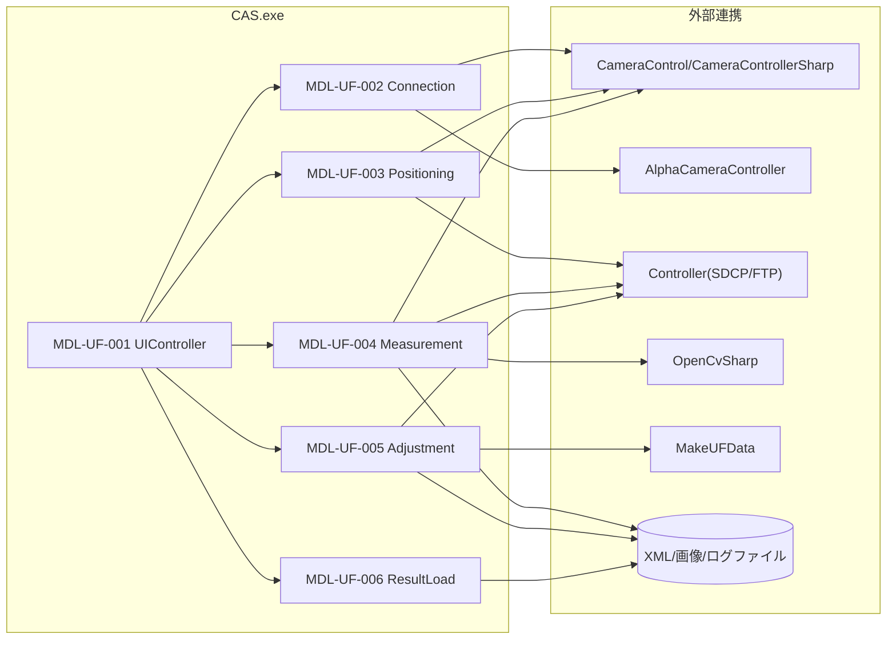
```mermaid
flowchart LR
    subgraph CAS["CAS.exe"]
        UI["MDL-UF-001 UIController"]
        CON["MDL-UF-002 Connection"]
        POS["MDL-UF-003 Positioning"]
        MEAS["MDL-UF-004 Measurement"]
        ADJ["MDL-UF-005 Adjustment"]
        RES["MDL-UF-006 ResultLoad"]
    end

    subgraph External["外部連携"]
        CAM["CameraControl/CameraControllerSharp"]
        ACC["AlphaCameraController"]
        CTRL["Controller(SDCP/FTP)"]
        CV["OpenCvSharp"]
        MK["MakeUFData"]
        FS[("XML/画像/ログファイル")]
    end

    UI --> CON
    UI --> POS
    UI --> MEAS
    UI --> ADJ
    UI --> RES
    CON --> CAM
    CON --> ACC
    POS --> CAM
    POS --> CTRL
    MEAS --> CAM
    MEAS --> CV
    MEAS --> CTRL
    MEAS --> FS
    ADJ --> MK
    ADJ --> CTRL
    ADJ --> FS
    RES --> FS
```

### 2-2. 配置一覧

| 配置区分 | 配置先パス/ノード | 配置モジュール | 配置理由 |
|----------|-------------------|----------------|----------|
| 実行モジュール | CAS/Functions/UfCamera.cs | MDL-UF-001〜006 | U/F計測・調整機能が単一機能ファイルに集約されているため |
| 外部カメラ連携 | CameraControl.dll | Connection/Positioning/Measurement | 接続、AF、撮影、ライブビューのため |
| 外部カメラ実行 | Components/AlphaCameraController.exe | Connection/Measurement | CamCont.xml を介した撮影制御のため |
| 外部補正計算 | MakeUFData | Adjustment | FMT抽出、XYZ変換、統計、補正ファイル生成のため |
| 外部制御連携 | Controller (SDCP/FTP) | Positioning/Measurement/Adjustment | ThroughMode、パターン表示、電源制御、調整データ反映のため |
| ファイル永続化 | 測定フォルダ/ログフォルダ | Measurement/Adjustment/ResultLoad | 計測結果、調整結果、画像、ログの保存/読込のため |

---

## 3. モジュール仕様オーバービュー

### 3-1. モジュール分類別サマリ

| 分類 | 対象モジュール | 処理概要 | 主なインタフェース |
|------|----------------|----------|--------------------|
| 画面 | UfCameraUIController | ボタンイベント、対象選択、進捗表示、完了/異常通知 | btnUfCamMeasStart_Click, btnUfCamAdjustStart_Click |
| 画面/外部IF | UfCameraConnectionService | カメラ接続・切断、Gap側UI同期 | btnUfCamConnect_Click, btnUfCamDisconnect_Click |
| ビジネスロジック | UfCameraPositioning | 位置合わせ、AF、ライブ更新、Cabinet空間座標設定 | tbtnUfCamSetPos_Click, timerUfCam_Tick, SetCabinetPos |
| ビジネスロジック | UfMeasurementEngine | U/F計測、Black/Mask/Module/Flat画像取得、解析結果保存 | MeasureUfAsync, CaptureUfImages |
| ビジネスロジック | UfAdjustmentEngine | 方式別補正点抽出、補正値計算、hc.bin生成 | AdjustUfCamAsync, AdjustUfCamCabinet |
| データアクセス | UfResultLoadService | UfMeasResult.xml 読込、画面再表示 | btnUfCamResultOpen_Click |

### 3-2. モジュール別オーバービュー

| モジュールID | モジュール名 | 分類 | 処理概要 | インタフェース名 | 引数 | 返り値 |
|--------------|--------------|------|----------|------------------|------|--------|
| MDL-UF-001 | UfCameraUIController | 画面 | U/F処理の起動/終了制御 | btnUfCamMeasStart_Click | sender,e | void |
| MDL-UF-002 | UfCameraConnectionService | 画面/IF | カメラ接続状態とUIを同期 | btnUfCamConnect_Click | sender,e | void |
| MDL-UF-003 | UfCameraPositioning | BIZ | 位置合わせ実行・更新・空間座標設定 | tbtnUfCamSetPos_Click | sender,e | void |
| MDL-UF-004 | UfMeasurementEngine | BIZ | 撮影・解析・計測結果作成 | MeasureUfAsync | List<UnitInfo>, path ほか | void |
| MDL-UF-005 | UfAdjustmentEngine | BIZ | 調整方式別の補正主処理 | AdjustUfCamAsync | logDir, List<UnitInfo> ほか | void |
| MDL-UF-006 | UfResultLoadService | DAL/IF | 計測結果XML読込と表示更新 | btnUfCamResultOpen_Click | sender,e | void |

---

## 4. モジュール仕様（詳細）

### 4-1. MDL-UF-001: UfCameraUIController

#### 4-1-1. 基本情報

| 項目 | 内容 |
|------|------|
| モジュールID | MDL-UF-001 |
| モジュール名 | UfCameraUIController |
| 分類 | 画面/ビジネスロジック |
| 呼出元 | オペレータUI操作 |
| 呼出先 | MDL-UF-002〜006 |
| トランザクション | 無 |
| 再実行性 | 可（処理完了/エラー後に再実行可能） |

#### 4-1-2. 処理フロー

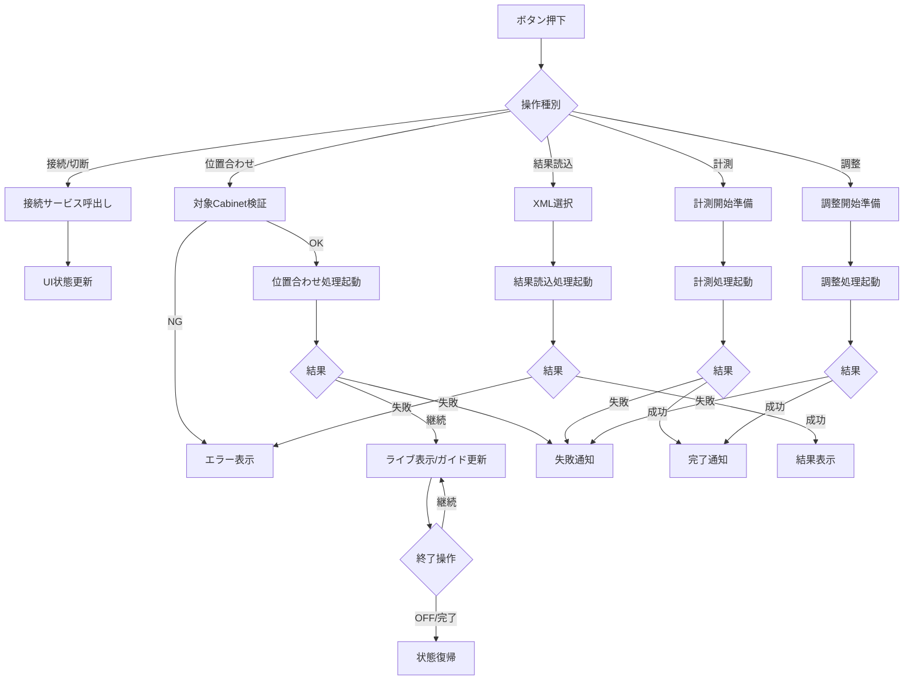
```mermaid
flowchart TD
    A[ボタン押下] --> B{操作種別}
    B -->|接続/切断| C[接続サービス呼出し]
    C --> D[UI状態更新]
    B -->|位置合わせ| E[対象Cabinet検証]
    E -->|NG| F[エラー表示]
    E -->|OK| G[位置合わせ処理起動]
    G --> H{結果}
    H -->|継続| I[ライブ表示/ガイド更新]
    I --> J{終了操作}
    J -->|OFF/完了| K[状態復帰]
    J -->|継続| I
    H -->|失敗| L[失敗通知]
    B -->|計測| M[計測開始準備]
    M --> N[計測処理起動]
    N --> O{結果}
    O -->|成功| P[完了通知]
    O -->|失敗| L
    B -->|調整| Q[調整開始準備]
    Q --> R[調整処理起動]
    R --> S{結果}
    S -->|成功| P
    S -->|失敗| L
    B -->|結果読込| T[XML選択]
    T --> U[結果読込処理起動]
    U --> V{結果}
    V -->|成功| W[結果表示]
    V -->|失敗| F
```

#### 4-1-3. 処理手順

| 手順No. | 処理内容 | 入力 | 出力 | 操作対象 | 備考 |
|---------|----------|------|------|----------|------|
| 1 | 操作種別判定 | 押下ボタン/トグル種別 | 処理分岐 | U/FタブUI | 接続、位置合わせ、計測、調整、結果読込を判定 |
| 2 | 対象Cabinet/入力値チェック | Cabinet選択状態、距離、高さ、基準Cabinet指定 | 実行可否 | 画面選択配列、入力UI | CheckSelectedUnits、CheckShootingDist |
| 3 | 位置合わせ開始/更新 | 対象Cabinet、表示設定 | ライブ表示、ガイド状態 | tbtnUfCamSetPos、画像UI | ON/OFF とタイマ更新を制御 |
| 4 | 計測開始準備 | 対象Cabinet、距離条件 | Progress UI、画面操作禁止 | WindowProgress、tcMain.IsEnabled | 位置合わせ停止と保存先準備を含む |
| 5 | 計測処理起動 | 対象Cabinet、measPath | 計測結果、測定ファイル | UfMeasurementEngine | MeasureUfAsync を Task.Run で起動 |
| 6 | 調整開始準備 | 対象Cabinet、調整方式、基準Cabinet、視聴点 | Progress UI、画面操作禁止 | WindowProgress | 目標色度設定と logDir 作成を含む |
| 7 | 調整処理起動 | 調整条件、logDir | 調整結果、反映対象ファイル | UfAdjustmentEngine | AdjustUfCamAsync を Task.Run で起動 |
| 8 | 結果読込処理起動 | XMLパス | 測定結果表示 | UfResultLoadService | UfCamMeasLog.LoadFromXmlFile |
| 9 | 後処理 | 実行結果 | 通知・状態復帰 | UI/設定 | 完了/失敗通知、ThroughMode解除、表示復帰等 |

#### 4-1-4. 操作対象仕様（画面、テーブル、ファイル）

| 対象種別 | 対象名 | 操作内容 | 操作タイミング | 主キー/識別子 | 備考 |
|----------|--------|----------|----------------|---------------|------|
| 画面 | U/Fタブ | ボタン操作/結果表示 | ユーザー操作時 | コントロール名 | 接続、位置合わせ、計測、調整、結果読込 |
| 画面 | tbtnUfCamSetPos | ON/OFF切替 | 位置合わせ開始/終了時 | ToggleState | 位置合わせトグル |
| 画面 | imgUfCamCameraView | ライブ表示/ガイド更新 | 位置合わせ中 | ImageControl | タイマ更新で反映 |
| 画面 | WindowProgress | 表示/更新/Close | 処理開始〜終了 | ウィンドウインスタンス | 中断操作含む |
| 画面 | ファイルダイアログ | XMLパス選択 | 結果読込時 | ダイアログインスタンス | path確定用 |
| ファイル | UfMeasResult.xml | 読込/書込 | 計測/読込時 | path | 測定結果保存/再表示 |
| ファイル | UnitCpInfo.xml | 書込 | 調整完了時 | path | 調整結果保存 |

#### 4-1-5. インタフェース仕様（引数・返り値）

| 項目 | 内容 |
|------|------|
| インタフェース名 | U/F系イベントハンドラ群 |
| 概要 | 接続、位置合わせ、計測、調整、結果読込のUIイベントを業務処理へ中継する |
| シグネチャ | private async void btnUfCamMeasStart_Click(object sender, RoutedEventArgs e)、private async void btnUfCamAdjustStart_Click(object sender, RoutedEventArgs e)、private void tbtnUfCamSetPos_Click(object sender, RoutedEventArgs e) ほか |
| 呼出条件 | U/Fタブのボタン/トグル操作 |

引数一覧

| No. | 引数名 | 型 | 必須 | 説明 | バリデーション |
|-----|--------|----|------|------|----------------|
| 1 | sender | object | Y | イベント送信元 | null許容 |
| 2 | e | RoutedEventArgs/EventArgs | Y | イベント情報 | 操作元イベント型と整合 |

返り値一覧

| No. | 項目名 | 型 | 説明 | 備考 |
|-----|--------|----|------|------|
| 1 | なし | void | UIイベント処理 | 非同期イベントを含む。例外は内部catch |

#### 4-1-6. 例外処理仕様

| No. | 例外/エラー条件 | 検知方法 | 対応内容 | ユーザー通知 | ログ出力 | リトライ/継続可否 |
|-----|------------------|----------|----------|--------------|----------|------------------|
| 1 | 対象Cabinet不正 | CheckSelectedUnits 例外 | 処理中断/タブ復帰 | CAS Error表示 | saveUfLog | 可 |
| 2 | 入力値不正（距離、高さ、基準Cabinet） | Parse失敗、CheckObjectiveCabinet 例外 | 処理中断 | CAS Error表示 | saveUfLog | 可 |
| 3 | カメラ未接続 | IsCameraOpened 判定 | 調整開始中断 | CAS Error表示 | saveUfLog | 可 |
| 4 | 実処理失敗 | Task例外 | 後処理実施し失敗通知 | CAS Error表示 | saveUfLog | 可 |
| 5 | ユーザー中断 | CameraCasUserAbortException | 中断として終了 | Abort表示 | saveUfLog | 可 |

#### 4-1-7. ログ仕様

| ログ種別 | 出力条件 | 出力項目 | 保持期間 | マスキング方針 |
|----------|----------|----------|----------|----------------|
| 実行ログ | 処理開始/終了/主要ステップ | 時刻、処理名、対象、進捗 | 測定/ログフォルダ世代管理 | 個人情報なし |

### 4-2. MDL-UF-002: UfCameraConnectionService

#### 4-2-1. 基本情報

| 項目 | 内容 |
|------|------|
| モジュールID | MDL-UF-002 |
| モジュール名 | UfCameraConnectionService |
| 分類 | 画面/外部IF |
| 呼出元 | UIController |
| 呼出先 | CameraControl, AlphaCameraController, GapCamera UI |
| トランザクション | 無 |
| 再実行性 | 可 |

#### 4-2-2. 処理フロー

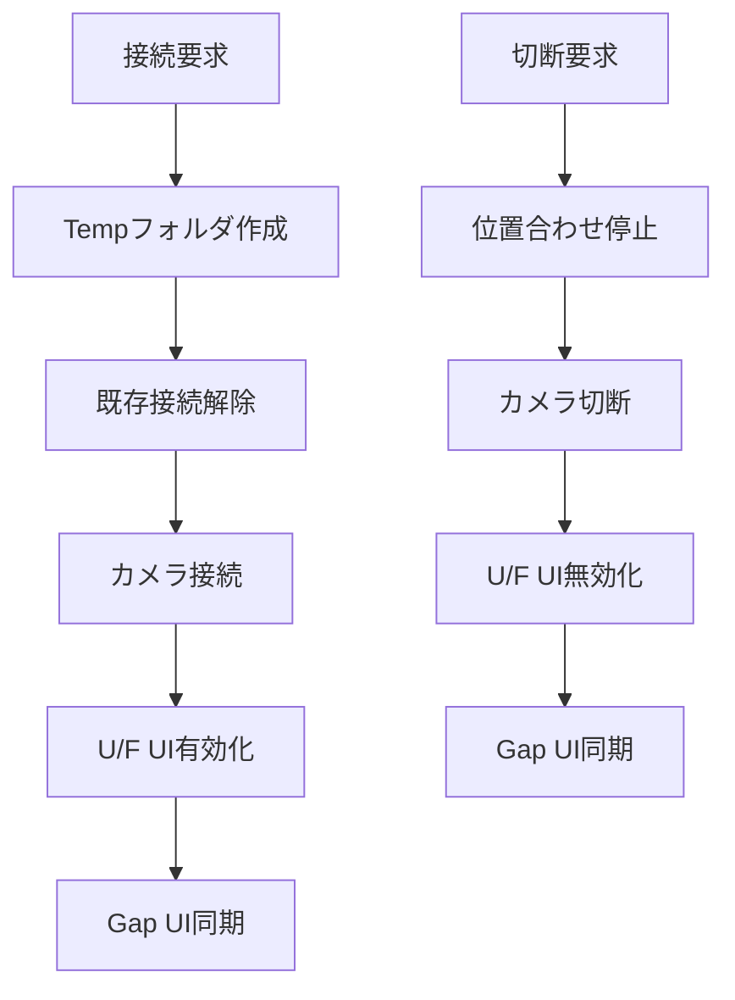
```mermaid
flowchart TD
    A[接続要求] --> B[Tempフォルダ作成]
    B --> C[既存接続解除]
    C --> D[カメラ接続]
    D --> E[U/F UI有効化]
    E --> F[Gap UI同期]
    G[切断要求] --> H[位置合わせ停止]
    H --> I[カメラ切断]
    I --> J[U/F UI無効化]
    J --> K[Gap UI同期]
```

#### 4-2-3. 処理手順

| 手順No. | 処理内容 | 入力 | 出力 | 操作対象 | 備考 |
|---------|----------|------|------|----------|------|
| 1 | カメラ選択同期 | U/Fカメラ選択 | Settings.Ins.Camera.Name | カメラ設定 | Gap側コンボも同期 |
| 2 | レンズCD同期 | U/Fレンズ選択 | 選択済みレンズCD | レンズ設定 | Gap側コンボも同期 |
| 3 | 接続準備 | Tempパス | Tempフォルダ | ファイルシステム | 未存在時のみ作成 |
| 4 | 接続/切断実行 | 接続要求 | カメラ接続状態 | CameraControl | DisconnectCamera/ConnectCamera |
| 5 | UI活性制御 | 接続状態 | 各種ボタン活性状態 | U/F・Gap UI | Developerモード分岐あり |

#### 4-2-4. 操作対象仕様（画面、テーブル、ファイル）

| 対象種別 | 対象名 | 操作内容 | 操作タイミング | 主キー/識別子 | 備考 |
|----------|--------|----------|----------------|---------------|------|
| 画面 | cmbxUfCamCamera | 選択反映 | カメラ選択変更時 | SelectedIndex | Settings同期 |
| 画面 | cmbxUfCamLensCd | 選択反映 | レンズ変更時 | SelectedIndex | Gap側同期 |
| 画面 | btnUfCamConnect/Disconnect | 活性制御 | 接続状態変更時 | IsEnabled | Gap側ボタンも同期 |
| ファイル | tempPath | 作成 | 接続開始時 | path | 一時保存先 |

#### 4-2-5. インタフェース仕様（引数・返り値）

| 項目 | 内容 |
|------|------|
| インタフェース名 | 接続/切断処理 |
| 概要 | カメラ接続状態とU/F・Gap UI状態を同期制御 |
| シグネチャ | private void btnUfCamConnect_Click(object sender, RoutedEventArgs e)、private void btnUfCamDisconnect_Click(object sender, RoutedEventArgs e) |
| 呼出条件 | 接続/切断ボタン押下 |

引数一覧

| No. | 引数名 | 型 | 必須 | 説明 | バリデーション |
|-----|--------|----|------|------|----------------|
| 1 | sender | object | Y | イベント送信元 | - |
| 2 | e | RoutedEventArgs | Y | イベント情報 | - |

返り値一覧

| No. | 項目名 | 型 | 説明 | 備考 |
|-----|--------|----|------|------|
| 1 | なし | void | UI状態更新のみ | 例外は通知 |

#### 4-2-6. 例外処理仕様

| No. | 例外/エラー条件 | 検知方法 | 対応内容 | ユーザー通知 | ログ出力 | リトライ/継続可否 |
|-----|------------------|----------|----------|--------------|----------|------------------|
| 1 | カメラ接続失敗 | ConnectCamera 例外 | 接続中断 | CAS Error表示 | 任意 | 可 |
| 2 | レンズ一覧更新失敗 | ShowLensCdFiles 例外 | UI維持 | CAS Error表示 | 任意 | 可 |

#### 4-2-7. ログ仕様

| ログ種別 | 出力条件 | 出力項目 | 保持期間 | マスキング方針 |
|----------|----------|----------|----------|----------------|
| 実行ログ | 接続/切断、選択変更時 | カメラ名、レンズCD、接続状態 | 実行中 | 個人情報なし |

### 4-3. MDL-UF-003: UfCameraPositioning

#### 4-3-1. 基本情報

| 項目 | 内容 |
|------|------|
| モジュールID | MDL-UF-003 |
| モジュール名 | UfCameraPositioning |
| 分類 | ビジネスロジック |
| 呼出元 | UIController |
| 呼出先 | CameraControl, Controller, 画像表示 |
| トランザクション | 無 |
| 再実行性 | 可 |

#### 4-3-2. 処理フロー

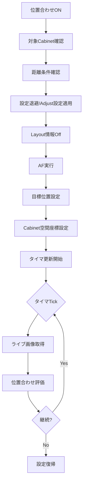
```mermaid
flowchart TD
    A[位置合わせON] --> B[対象Cabinet確認]
    B --> C[距離条件確認]
    C --> D[設定退避/Adjust設定適用]
    D --> E[Layout情報Off]
    E --> F[AF実行]
    F --> G[目標位置設定]
    G --> H[Cabinet空間座標設定]
    H --> I[タイマ更新開始]
    I --> J{タイマTick}
    J --> K[ライブ画像取得]
    K --> L[位置合わせ評価]
    L --> M{継続?}
    M -->|Yes| J
    M -->|No| N[設定復帰]
```

#### 4-3-3. 処理手順

| 手順No. | 処理内容 | 入力 | 出力 | 操作対象 | 備考 |
|---------|----------|------|------|----------|------|
| 1 | 測定レベル設定 | モデル設定 | m_MeasureLevel | 内部状態 | brightness.UF_20pc |
| 2 | 対象抽出 | Cabinet選択 | lstTgtUnits | 画面配列 | 矩形チェックあり |
| 3 | ユーザー設定退避 | 現在設定 | userSetting | Controller設定 | getUserSettingSetPos |
| 4 | 位置合わせ設定適用 | 退避前設定 | Adjust設定 | Controller | setAdjustSettingSetPos |
| 5 | AF/ガイド準備 | ShootCondition | AF完了状態 | CameraControl | outputIntSigChecker, AutoFocus |
| 6 | 空間座標設定 | 対象Cabinet、距離条件 | CabinetCoordinate | 内部配列 | SetCamPosTarget, SetCabinetPos |
| 7 | タイマ更新 | ライブ画像 | ガイド評価結果 | UI画像 | AdjustCameraPosUf |

#### 4-3-4. 操作対象仕様（画面、テーブル、ファイル）

| 対象種別 | 対象名 | 操作内容 | 操作タイミング | 主キー/識別子 | 備考 |
|----------|--------|----------|----------------|---------------|------|
| 画面 | tbtnUfCamSetPos | ON/OFF切替 | ユーザー操作 | ToggleState | 実行中はタイマ連動 |
| 画面 | imgUfCamCameraView | ライブ表示更新 | タイマTick | ImageControl | 位置合わせ用 |
| 画面 | txtbStatus | ステータス表示 | 開始/停止時 | Text | Setting Camera Position... |
| 外部IF | Controller | Layout情報Off、ThroughMode関連 | 位置合わせ開始時 | ControllerID | 複数Controller対応 |

#### 4-3-5. インタフェース仕様（引数・返り値）

| 項目 | 内容 |
|------|------|
| インタフェース名 | 位置合わせ処理 |
| 概要 | 位置合わせ開始・更新・停止を制御 |
| シグネチャ | private void tbtnUfCamSetPos_Click(object sender, RoutedEventArgs e)、private void timerUfCam_Tick(object sender, EventArgs e)、private void SetCabinetPos(List<UnitInfo> lstTgtUnits, double dist, double wallH, double camH) |
| 呼出条件 | トグルON/OFF、タイマ更新、計測/調整の前後 |

引数一覧

| No. | 引数名 | 型 | 必須 | 説明 | バリデーション |
|-----|--------|----|------|------|----------------|
| 1 | lstTgtUnits | List<UnitInfo> | Y | 位置合わせ対象Cabinet群 | 空不可/矩形前提 |
| 2 | dist | double | Y | 撮影距離 | CheckShootingDist |
| 3 | wallH | double | N | Wall下端高さ | Custom時のみ有効 |
| 4 | camH | double | N | カメラ高さ | Custom時のみ有効 |

返り値一覧

| No. | 項目名 | 型 | 説明 | 備考 |
|-----|--------|----|------|------|
| 1 | なし | void | UI制御と内部座標設定 | 例外は通知 |

#### 4-3-6. 例外処理仕様

| No. | 例外/エラー条件 | 検知方法 | 対応内容 | ユーザー通知 | ログ出力 | リトライ/継続可否 |
|-----|------------------|----------|----------|--------------|----------|------------------|
| 1 | 設定値不正（距離/高さ等） | Parse失敗 | 位置合わせ停止 | CAS Error表示 | 任意 | 可 |
| 2 | 位置合わせ準備失敗 | AutoFocus、Layout制御例外 | ThroughMode解除・設定復帰 | CAS Error表示 | 任意 | 可 |
| 3 | タイマ更新例外 | AdjustCameraPosUf 例外 | 内部信号停止、トグルOFF | CAS Error表示 | 任意 | 可 |

#### 4-3-7. ログ仕様

| ログ種別 | 出力条件 | 出力項目 | 保持期間 | マスキング方針 |
|----------|----------|----------|----------|----------------|
| 実行ログ | ON/OFF、主要設定適用時 | 距離条件、対象Cabinet、処理状態 | 測定フォルダ世代管理 | 機密値除外 |

### 4-4. MDL-UF-004: UfMeasurementEngine

#### 4-4-1. 基本情報

| 項目 | 内容 |
|------|------|
| モジュールID | MDL-UF-004 |
| モジュール名 | UfMeasurementEngine |
| 分類 | ビジネスロジック |
| 呼出元 | UIController |
| 呼出先 | CameraControl、OpenCv、Controller、ファイルI/O |
| トランザクション | 無 |
| 再実行性 | 可 |

#### 4-4-2. 処理フロー

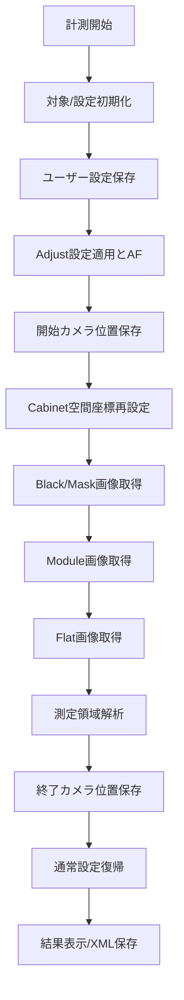
```mermaid
flowchart TD
    A[計測開始] --> B[対象/設定初期化]
    B --> C[ユーザー設定保存]
    C --> D[Adjust設定適用とAF]
    D --> E[開始カメラ位置保存]
    E --> F[Cabinet空間座標再設定]
    F --> G[Black/Mask画像取得]
    G --> H[Module画像取得]
    H --> I[Flat画像取得]
    I --> J[測定領域解析]
    J --> K[終了カメラ位置保存]
    K --> L[通常設定復帰]
    L --> M[結果表示/XML保存]
```

#### 4-4-3. 処理手順

| 手順No. | 処理内容 | 入力 | 出力 | 操作対象 | 備考 |
|---------|----------|------|------|----------|------|
| 1 | 測定フォルダ作成 | 実行日時 | measPath | ファイルシステム | UF_yyyyMMddHHmm |
| 2 | 設定保存 | 現在ユーザー設定 | m_lstUserSetting | Controller設定 | 後で復帰 |
| 3 | 撮影準備 | ShootCondition | カメラ設定反映 | CameraControl | setAdjustSetting, AutoFocus |
| 4 | カメラ位置確認 | ライブ画像 | startCamPos | CameraControl | GetCameraPosUf, CheckCameraPos |
| 5 | 画像取得 | 対象Cabinet | 撮影画像 | カメラ/ファイル | Black、Mask、Module、Flat |
| 6 | 解析 | 画像群、ViewPoint | U/F計測結果 | OpenCv処理 | calcMeasAreaPv |
| 7 | 結果保存 | 計測データ | UfMeasResult.xml | ファイル | UfCamMeasLog.SaveToXmlFile |
| 8 | 復帰処理 | 一時設定 | 通常設定 | Controller | ThroughMode解除＋UserSetting復帰 |

#### 4-4-4. 操作対象仕様（画面、テーブル、ファイル）

| 対象種別 | 対象名 | 操作内容 | 操作タイミング | 主キー/識別子 | 備考 |
|----------|--------|----------|----------------|---------------|------|
| ファイル | UfMeasResult.xml | 出力 | 計測完了時 | path | 測定結果保存 |
| ファイル | Black/Mask/Module/Flat画像 | 出力/読込 | 計測実行中 | 連番ファイル名 | fn_BlackFile 等 |
| 外部IF | CameraControl | 撮影/AF | 計測前〜中 | カメラ接続状態 | 失敗時例外 |
| 外部IF | Controller | パターン、電源制御 | 計測前〜中 | ControllerID | CmdUnitPowerOn 等 |

#### 4-4-5. インタフェース仕様（引数・返り値）

| 項目 | 内容 |
|------|------|
| インタフェース名 | MeasureUfAsync |
| 概要 | U/F計測主処理 |
| シグネチャ | private void MeasureUfAsync(List<UnitInfo> lstTgtCabi, string measPath, ViewPoint vp, double dist, double wallH, double camH, bool targetOnly = false) |
| 呼出条件 | 計測開始ボタン、調整後再計測 |

引数一覧

| No. | 引数名 | 型 | 必須 | 説明 | バリデーション |
|-----|--------|----|------|------|----------------|
| 1 | lstTgtCabi | List<UnitInfo> | Y | 計測対象Cabinet群 | 空不可/矩形前提 |
| 2 | measPath | string | Y | 計測ログ保存フォルダ | 書込可能パス |
| 3 | vp | ViewPoint | Y | 視聴点補正条件 | 計測単体では無効値 |
| 4 | dist | double | Y | 撮影距離 | CheckShootingDist |
| 5 | wallH | double | N | Wall下端高さ | Custom時のみ |
| 6 | camH | double | N | カメラ高さ | Custom時のみ |
| 7 | targetOnly | bool | N | Flat画像を対象のみで撮影するか | Debug用途 |

返り値一覧

| No. | 項目名 | 型 | 説明 | 備考 |
|-----|--------|----|------|------|
| 1 | なし | void | 結果は内部状態/ファイルへ出力 | 例外で失敗通知 |

#### 4-4-6. 例外処理仕様

| No. | 例外/エラー条件 | 検知方法 | 対応内容 | ユーザー通知 | ログ出力 | リトライ/継続可否 |
|-----|------------------|----------|----------|--------------|----------|------------------|
| 1 | カメラ位置取得失敗 | GetCameraPosUf 戻り値/例外 | 処理中断 | CAS Error表示 | saveUfLog | 可 |
| 2 | カメラ位置不適切 | CheckCameraPos false | 処理中断 | CAS Error表示 | saveUfLog | 可 |
| 3 | 撮影失敗 | CaptureImage/AutoFocus 例外 | 処理中断 | CAS Error表示 | saveUfLog | 可 |
| 4 | 解析失敗 | calcMeasAreaPv 例外 | 処理中断 | CAS Error表示 | saveUfLog | 可 |
| 5 | 中断操作 | CameraCasUserAbortException | 安全終了 | Abort表示 | saveUfLog | 可 |

#### 4-4-7. ログ仕様

| ログ種別 | 出力条件 | 出力項目 | 保持期間 | マスキング方針 |
|----------|----------|----------|----------|----------------|
| 計測ログ | 主要ステップ進行時 | ステップ名、対象、時刻、保存先 | 測定フォルダ世代管理 | 個人情報なし |

### 4-5. MDL-UF-005: UfAdjustmentEngine

#### 4-5-1. 基本情報

| 項目 | 内容 |
|------|------|
| モジュールID | MDL-UF-005 |
| モジュール名 | UfAdjustmentEngine |
| 分類 | ビジネスロジック |
| 呼出元 | UIController |
| 呼出先 | MakeUFData、Controller、ファイルI/O |
| トランザクション | 無 |
| 再実行性 | 可 |

#### 4-5-2. 処理フロー

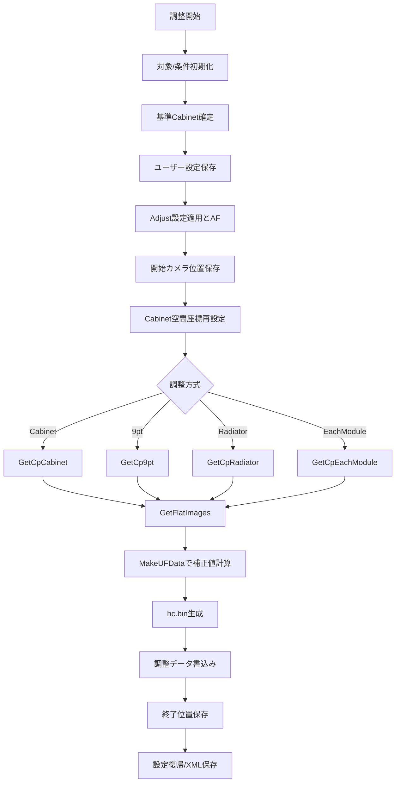
```mermaid
flowchart TD
    A[調整開始] --> B[対象/条件初期化]
    B --> C[基準Cabinet確定]
    C --> D[ユーザー設定保存]
    D --> E[Adjust設定適用とAF]
    E --> F[開始カメラ位置保存]
    F --> G[Cabinet空間座標再設定]
    G --> H{調整方式}
    H -->|Cabinet| I[GetCpCabinet]
    H -->|9pt| J[GetCp9pt]
    H -->|Radiator| K[GetCpRadiator]
    H -->|EachModule| L[GetCpEachModule]
    I --> M[GetFlatImages]
    J --> M
    K --> M
    L --> M
    M --> N[MakeUFDataで補正値計算]
    N --> O[hc.bin生成]
    O --> P[調整データ書込み]
    P --> Q[終了位置保存]
    Q --> R[設定復帰/XML保存]
```

#### 4-5-3. 処理手順

| 手順No. | 処理内容 | 入力 | 出力 | 操作対象 | 備考 |
|---------|----------|------|------|----------|------|
| 1 | 調整条件取得 | 調整方式、目標Cabinet、視聴点 | type, lstObjCabi, vp | UI項目 | Cabinet/9pt/Radiator/EachModule |
| 2 | 基準Cabinet検証 | lstObjCabi, lstTgtCabi | 実行可否 | 内部状態 | CheckObjectiveCabinet |
| 3 | 設定保存/準備 | 現在ユーザー設定 | m_lstUserSetting | Controller設定 | setChromTarget 含む |
| 4 | 位置確認 | ライブ画像 | startCamPos | CameraControl | GetCameraPosUf, CheckCameraPos |
| 5 | 補正点抽出 | 調整方式別条件 | lstUnitCpInfo, lstRefPoints | 画像処理 | GetCpCabinet 等 |
| 6 | Flat画像平均値取得 | 調整対象 | 測定値付与済み補正点 | OpenCv処理 | GetFlatImages |
| 7 | FMT読込とXYZ更新 | hc.bin、基準値 | 新補正データ | MakeUFData | ExtractFmt, Fmt2XYZ, ModifyXYZCam |
| 8 | 調整ファイル生成 | 新補正データ | adjusted hc.bin | Tempフォルダ | OverWritePixelData |
| 9 | 調整データ反映 | 移動ファイル一覧 | Controller更新 | SDCP/FTP | writeAdjustedData |
| 10 | 結果保存 | 調整結果 | UnitCpInfo.xml | ファイル | UfCamAdjLog.SaveToXmlFile |

#### 4-5-4. 操作対象仕様（画面、テーブル、ファイル）

| 対象種別 | 対象名 | 操作内容 | 操作タイミング | 主キー/識別子 | 備考 |
|----------|--------|----------|----------------|---------------|------|
| 画面 | 調整条件UI | 読込 | 調整開始時 | 調整方式/基準指定 | rbUfCam9pt ほか |
| 外部IF | MakeUFData | 補正演算 | 調整ループ中 | UnitInfo | FMT抽出、XYZ変換、統計 |
| 外部IF | Controller | Cabinet電源制御、データ反映 | 調整中 | ControllerID | writeAdjustedData |
| ファイル | UnitCpInfo.xml | 出力 | 調整完了時 | path | 調整結果保存 |
| ファイル | Temp hc.bin | 出力 | Cabinet毎 | Unit識別 | MoveFileに登録 |

#### 4-5-5. インタフェース仕様（引数・返り値）

| 項目 | 内容 |
|------|------|
| インタフェース名 | AdjustUfCamAsync |
| 概要 | U/F調整主処理 |
| シグネチャ | private void AdjustUfCamAsync(string logDir, List<UnitInfo> lstTgtCabi, UfCamAdjustType type, List<UnitInfo> lstObjCabi, ObjectiveLine objEdge, ViewPoint vp, double dist, double wallH, double camH) |
| 呼出条件 | 調整開始ボタン |

引数一覧

| No. | 引数名 | 型 | 必須 | 説明 | バリデーション |
|-----|--------|----|------|------|----------------|
| 1 | logDir | string | Y | 調整ログ保存フォルダ | 書込可能パス |
| 2 | lstTgtCabi | List<UnitInfo> | Y | 調整対象Cabinet群 | 空不可/矩形前提 |
| 3 | type | UfCamAdjustType | Y | 調整方式 | enum値 |
| 4 | lstObjCabi | List<UnitInfo> | Y | 基準Cabinet群 | 範囲内必須 |
| 5 | objEdge | ObjectiveLine | N | Line指定情報 | Lineモード時のみ |
| 6 | vp | ViewPoint | Y | 視聴点補正条件 | UI設定反映 |
| 7 | dist | double | Y | 撮影距離 | CheckShootingDist |
| 8 | wallH | double | N | Wall下端高さ | Custom時のみ |
| 9 | camH | double | N | カメラ高さ | Custom時のみ |

返り値一覧

| No. | 項目名 | 型 | 説明 | 備考 |
|-----|--------|----|------|------|
| 1 | なし | void | 内部状態更新とファイル出力 | 例外で失敗通知 |

#### 4-5-6. 例外処理仕様

| No. | 例外/エラー条件 | 検知方法 | 対応内容 | ユーザー通知 | ログ出力 | リトライ/継続可否 |
|-----|------------------|----------|----------|--------------|----------|------------------|
| 1 | 基準Cabinet不正 | CheckObjectiveCabinet 例外 | 処理停止 | CAS Error表示 | saveUfLog | 可 |
| 2 | 補正点抽出失敗 | GetCp系例外 | 処理停止 | CAS Error表示 | saveUfLog | 可 |
| 3 | 補正データ欠損 | checkDataFile false | 処理停止 | CAS Error表示 | saveUfLog | 可 |
| 4 | MakeUFData演算失敗 | false戻り/例外 | 処理停止 | CAS Error表示 | saveUfLog | 可 |
| 5 | 調整データ反映失敗 | writeAdjustedData 失敗 | 処理停止 | CAS Error表示 | saveUfLog | 可 |
| 6 | 中断操作 | CameraCasUserAbortException | 安全停止 | Abort表示 | saveUfLog | 可 |

#### 4-5-7. ログ仕様

| ログ種別 | 出力条件 | 出力項目 | 保持期間 | マスキング方針 |
|----------|----------|----------|----------|----------------|
| 調整ログ | 調整ステップ進行時 | ステップ、対象Cabinet、調整方式、保存先 | ログフォルダ世代管理 | 機密値除外 |

### 4-6. MDL-UF-006: UfResultLoadService

#### 4-6-1. 基本情報

| 項目 | 内容 |
|------|------|
| モジュールID | MDL-UF-006 |
| モジュール名 | UfResultLoadService |
| 分類 | データアクセス/IF |
| 呼出元 | UIController |
| 呼出先 | ファイルシステム、結果表示 |
| トランザクション | 無 |
| 再実行性 | 可 |

#### 4-6-2. 処理フロー

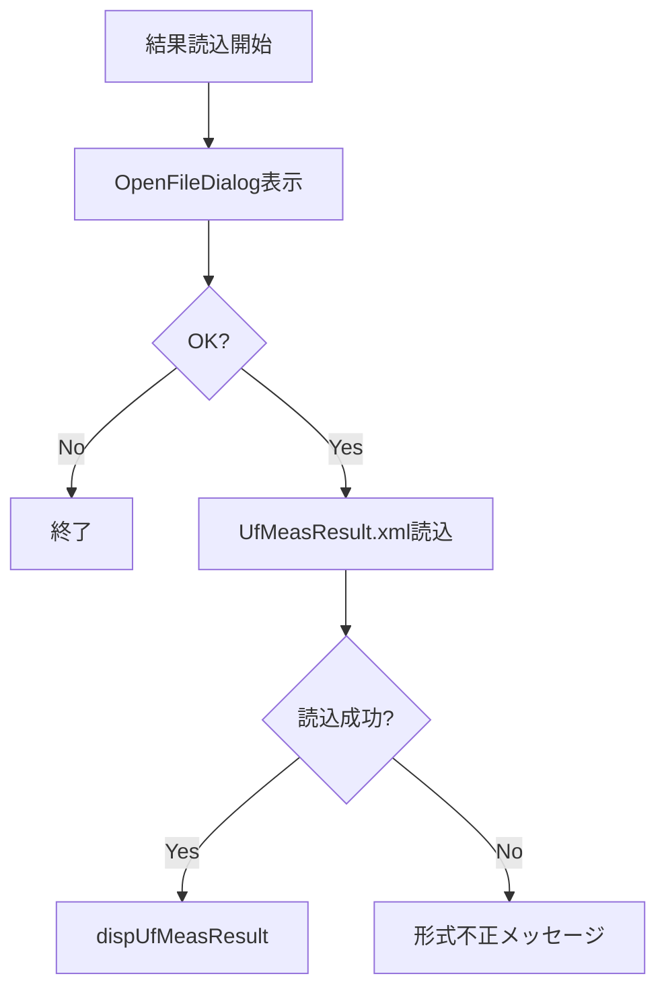
```mermaid
flowchart TD
    A[結果読込開始] --> B[OpenFileDialog表示]
    B --> C{OK?}
    C -->|No| D[終了]
    C -->|Yes| E[UfMeasResult.xml読込]
    E --> F{読込成功?}
    F -->|Yes| G[dispUfMeasResult]
    F -->|No| H[形式不正メッセージ]
```

#### 4-6-3. 処理手順

| 手順No. | 処理内容 | 入力 | 出力 | 操作対象 | 備考 |
|---------|----------|------|------|----------|------|
| 1 | ダイアログ初期化 | applicationPath + MeasDir | OpenFileDialog | OSダイアログ | xmlフィルタ指定 |
| 2 | XMLパス確定 | ダイアログ結果 | path | OSダイアログ | Cancel時無処理終了 |
| 3 | XML読込 | path | ufCamMeasLog | ファイルI/O | LoadFromXmlFile |
| 4 | 結果表示更新 | ufCamMeasLog | 画面表示 | UI | dispUfMeasResult |

#### 4-6-4. 操作対象仕様（画面、テーブル、ファイル）

| 対象種別 | 対象名 | 操作内容 | 操作タイミング | 主キー/識別子 | 備考 |
|----------|--------|----------|----------------|---------------|------|
| 画面 | btnUfCamResultOpen | 押下 | ユーザー操作 | Button | 結果読込起点 |
| ファイル | UfMeasResult.xml | 読込 | 結果読込時 | path | XML形式 |
| 画面 | U/F結果表示領域 | 更新 | 読込成功時 | 表示状態 | dispUfMeasResult |

#### 4-6-5. インタフェース仕様（引数・返り値）

| 項目 | 内容 |
|------|------|
| インタフェース名 | btnUfCamResultOpen_Click |
| 概要 | 保存済みU/F計測結果XMLを読込み、結果表示へ再展開する |
| シグネチャ | private void btnUfCamResultOpen_Click(object sender, RoutedEventArgs e) |
| 呼出条件 | 結果読込ボタン押下 |

引数一覧

| No. | 引数名 | 型 | 必須 | 説明 | バリデーション |
|-----|--------|----|------|------|----------------|
| 1 | sender | object | Y | イベント送信元 | - |
| 2 | e | RoutedEventArgs | Y | イベント情報 | - |

返り値一覧

| No. | 項目名 | 型 | 説明 | 備考 |
|-----|--------|----|------|------|
| 1 | なし | void | 読込結果を画面へ反映 | 例外時は通知 |

#### 4-6-6. 例外処理仕様

| No. | 例外/エラー条件 | 検知方法 | 対応内容 | ユーザー通知 | ログ出力 | リトライ/継続可否 |
|-----|------------------|----------|----------|--------------|----------|------------------|
| 1 | XML形式不正 | LoadFromXmlFile 例外 | 読込停止 | CAS Error表示 | 任意 | 可 |
| 2 | ファイル未存在/アクセス不可 | ダイアログまたはLoad例外 | 読込停止 | CAS Error表示 | 任意 | 可 |

#### 4-6-7. ログ仕様

| ログ種別 | 出力条件 | 出力項目 | 保持期間 | マスキング方針 |
|----------|----------|----------|----------|----------------|
| 実行ログ | 結果読込時 | 読込パス、成否 | 実行中 | 個人情報なし |

---

## 5. コード仕様

### 5-1. コード一覧

| コード名称 | コード値 | 内容説明 | 利用箇所 | 備考 |
|------------|----------|----------|----------|------|
| UfCamAdjustType | Cabinet | Cabinet単位のU/F調整 | 調整処理 | enum |
| UfCamAdjustType | Cabi_9pt | 9点基準のU/F調整 | 調整処理 | enum |
| UfCamAdjustType | Radiator | Radiator基準のU/F調整 | 調整処理 | enum |
| UfCamAdjustType | EachModule | Module単位のU/F調整 | 調整処理 | enum |
| brightness.UF_20pc | 20IRE | 位置合わせ/計測のマスク信号レベル | 位置合わせ、計測、調整 | 定数 |
| UF_RE_CALC_STEP_3_PROCESS_SEC | 実装定義値 | 調整処理ステップ概算秒数 | 9pt/Radiator/EachModule | 進捗表示用 |

### 5-2. コード定義ルール

| 項目 | ルール |
|------|--------|
| 調整方式切替 | rbUfCamEachMod、rbUfCamRadiator、rbUfCam9pt の状態から enum に変換 |
| 基準Cabinet決定 | 中央、個別、Line指定の3系統で List<UnitInfo> を生成 |
| 画像保存規則 | UF_yyyyMMddHHmm、CamUF_yyyyMMddHHmm 形式でフォルダ採番 |
| 条件コンパイル | ForCrosstalkCameraUF、NO_PROC、NO_CAP 等の運用定義に従う |

---

## 6. メッセージ仕様

### 6-1. メッセージ一覧

| メッセージ名称 | メッセージID | 種別 | 表示メッセージ | 内容説明 | 対応アクション |
|----------------|--------------|------|----------------|----------|----------------|
| 計測完了 | UF-I-001 | 情報 | Measurement UF Complete! | 計測成功 | OK |
| 計測失敗 | UF-E-001 | 異常通知 | Failed in Measurement UF. | 計測失敗 | 再実行 |
| 調整完了 | UF-I-002 | 情報 | UF Camera Adjustment Complete! | 調整成功 | 結果確認 |
| 調整失敗 | UF-E-002 | 異常通知 | Failed in Adjustment UF. | 調整失敗 | 再実行 |
| カメラ未接続 | UF-E-003 | 異常通知 | Camera is not opened. | 調整開始前に未接続 | 接続確認 |
| カメラ位置取得失敗 | UF-E-004 | 異常通知 | Failed to get the camera position. | カメラ位置取得失敗 | 再位置合わせ |
| カメラ位置不適切 | UF-E-005 | 異常通知 | The camera position is inappropriate. | 位置ずれ検出 | 再位置合わせ |
| 基準Line選択過多 | UF-W-001 | 警告 | Up to 2 lines can be selected. | 基準Lineを3本以上選択 | 再選択 |
| 結果XML形式不正 | UF-E-006 | 異常通知 | The format of the opened file is incorrect. | 計測結果XMLの形式不正 | 再選択 |
| ユーザー中断 | UF-W-002 | 警告 | Abort! | ユーザー中断 | 再実行 |

### 6-2. メッセージ運用ルール

| 項目 | ルール |
|------|--------|
| ID採番 | UF-{I/W/E}-連番 |
| 多言語対応 | 無（英語メッセージ固定） |
| 表示経路 | WindowMessage / ShowMessageWindow |

---

## 7. 関連システムインタフェース仕様

### 7-1. インタフェース一覧

| IF ID | I/O | インタフェースシステム名 | インタフェースファイル名 | インタフェースタイミング | インタフェース方法 | インタフェースエラー処理方法 | インタフェース処理のリラン定義 | インタフェース処理のロギングインタフェース |
|------|-----|--------------------------|--------------------------|--------------------------|--------------------|------------------------------|--------------------------------|------------------------------------------|
| IF-UF-001 | OUT | CameraControl | DLL API | 接続/位置合わせ/計測/調整時 | メソッド呼出し | 例外捕捉・処理停止 | オペレータ再実行 | saveUfLog |
| IF-UF-002 | OUT | AlphaCameraController | CamCont.xml | 撮影設定/撮影時 | ファイル連携 | 例外捕捉・処理停止 | オペレータ再実行 | saveUfLog |
| IF-UF-003 | OUT | Controller | SDCP/FTP | 位置合わせ/計測/調整時 | TCP送信/ファイル転送 | 例外捕捉・処理停止 | オペレータ再実行 | saveUfLog |
| IF-UF-004 | IN/OUT | ファイルシステム | XML/画像/ログ | 計測/調整/結果読込時 | ファイルI/O | 例外捕捉・処理停止 | パス修正後再実行 | saveUfLog |

### 7-2. インタフェースデータ項目定義

| IF ID | データ項目名 | データ項目の説明 | データ項目の位置 | 書式 | 必須 | エラー時の代替値 | 備考 |
|------|--------------|------------------|------------------|------|------|------------------|------|
| IF-UF-001 | ShootCondition | 撮影条件 | API引数 | object | Y | なし | SetPosSetting/MeasAreaSetting |
| IF-UF-002 | CamCont.xml | AlphaCameraController 連携設定 | XMLファイル | UTF-8 XML | Y | なし | 保存先、AF条件等 |
| IF-UF-003 | SDCPコマンド | 内蔵パターン、ThroughMode、電源制御 | byte配列 | binary | Y | なし | CmdUnitPowerOn 等 |
| IF-UF-004 | UfCamMeasLog | U/F計測結果 | XML要素 | UTF-8 XML | Y | なし | Save/Load対象 |
| IF-UF-004 | UfCamAdjLog | U/F調整結果 | XML要素 | UTF-8 XML | Y | なし | UnitCpInfo.xml |

### 7-3. インタフェース処理シーケンス

#### 7-3-1. 計測処理シーケンス

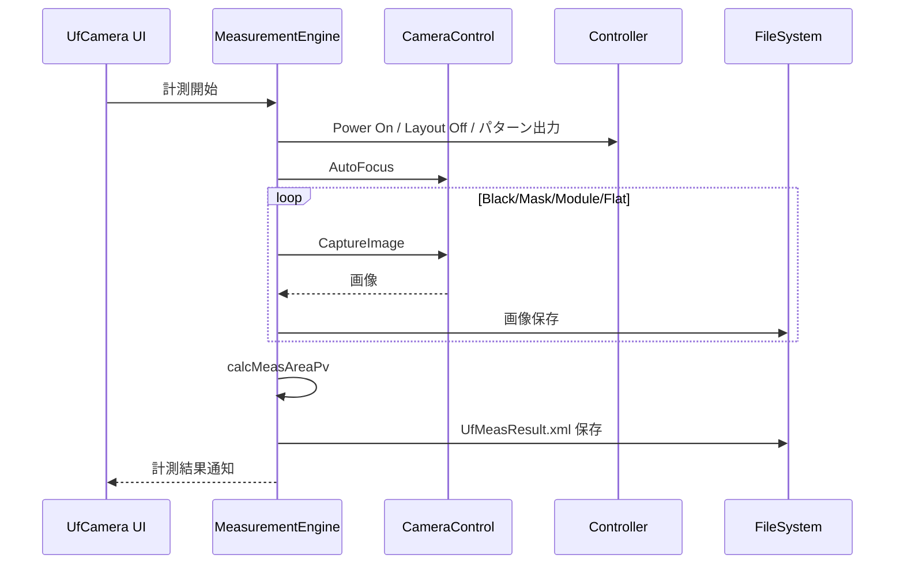
```mermaid
sequenceDiagram
    participant UI as UfCamera UI
    participant MEAS as MeasurementEngine
    participant CAM as CameraControl
    participant CTRL as Controller
    participant FS as FileSystem

    UI->>MEAS: 計測開始
    MEAS->>CTRL: Power On / Layout Off / パターン出力
    MEAS->>CAM: AutoFocus
    loop Black/Mask/Module/Flat
        MEAS->>CAM: CaptureImage
        CAM-->>MEAS: 画像
        MEAS->>FS: 画像保存
    end
    MEAS->>MEAS: calcMeasAreaPv
    MEAS->>FS: UfMeasResult.xml 保存
    MEAS-->>UI: 計測結果通知
```

#### 7-3-2. 調整処理シーケンス

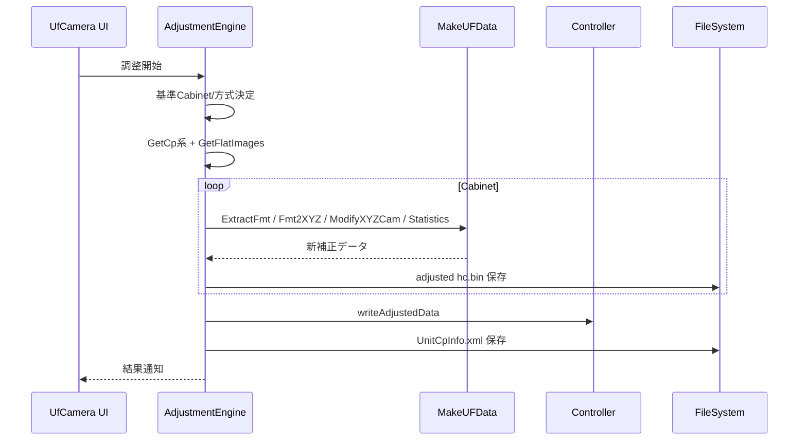
```mermaid
sequenceDiagram
    participant UI as UfCamera UI
    participant ADJ as AdjustmentEngine
    participant MK as MakeUFData
    participant CTRL as Controller
    participant FS as FileSystem

    UI->>ADJ: 調整開始
    ADJ->>ADJ: 基準Cabinet/方式決定
    ADJ->>ADJ: GetCp系 + GetFlatImages
    loop Cabinet
        ADJ->>MK: ExtractFmt / Fmt2XYZ / ModifyXYZCam / Statistics
        MK-->>ADJ: 新補正データ
        ADJ->>FS: adjusted hc.bin 保存
    end
    ADJ->>CTRL: writeAdjustedData
    ADJ->>FS: UnitCpInfo.xml 保存
    ADJ-->>UI: 結果通知
```

#### 7-3-3. 結果読込処理シーケンス

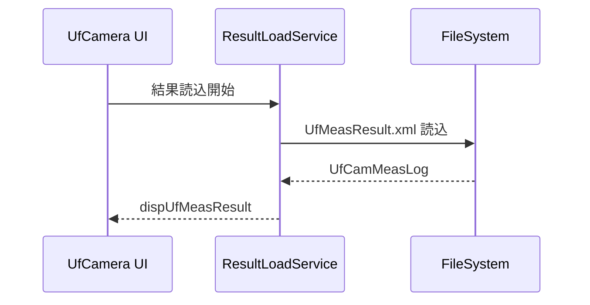
```mermaid
sequenceDiagram
    participant UI as UfCamera UI
    participant RES as ResultLoadService
    participant FS as FileSystem

    UI->>RES: 結果読込開始
    RES->>FS: UfMeasResult.xml 読込
    FS-->>RES: UfCamMeasLog
    RES-->>UI: dispUfMeasResult
```

---

## 8. メソッド仕様

### 8-1. UIイベント・位置合わせ系メソッド

#### 8-1-1. cmbxUfCamCamera_SelectionChanged

| 項目 | 内容 |
|------|------|
| シグネチャ | private void cmbxUfCamCamera_SelectionChanged(object sender, SelectionChangedEventArgs e) |
| 概要 | U/F側カメラ選択をGap側とSettingsへ同期する |

引数: sender, e
返り値: なし（void）

処理概要（詳細）

| 手順No. | 処理内容 | 詳細 |
|---------|----------|------|
| 1 | Gap側選択同期 | cmbxGapCamCamera.SelectedIndex を U/F選択値へ合わせる。 |
| 2 | 設定反映 | Settings.Ins.Camera.Name へカメラ名を設定する。 |
| 3 | レンズ一覧更新 | ShowLensCdFiles を呼び出して対応レンズCD一覧を更新する。 |

主要呼出し先

| 呼出し先 | 役割 | 同期/非同期 |
|----------|------|--------------|
| ShowLensCdFiles | レンズCD一覧更新 | 同期 |

例外時仕様

| ケース | 捕捉方法 | 通知 | 後処理 |
|--------|----------|------|--------|
| 同期/設定反映失敗 | Exception | CAS Error表示 | 無処理終了 |

シーケンス図

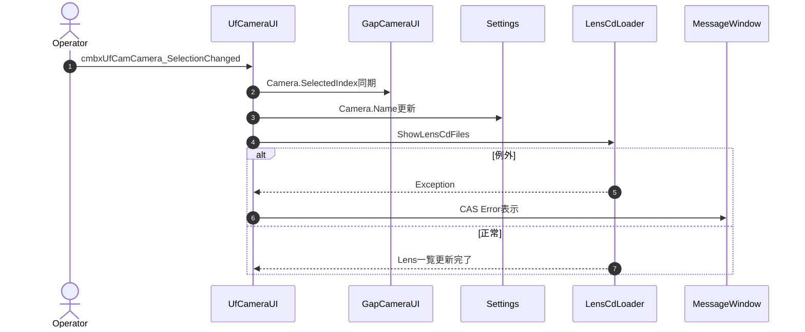
```mermaid
sequenceDiagram
    autonumber
    actor OP as Operator
    participant UF as UfCameraUI
    participant GAP as GapCameraUI
    participant SET as Settings
    participant LENS as LensCdLoader
    participant MSG as MessageWindow

    OP->>UF: cmbxUfCamCamera_SelectionChanged
    UF->>GAP: Camera.SelectedIndex同期
    UF->>SET: Camera.Name更新
    UF->>LENS: ShowLensCdFiles
    alt 例外
        LENS-->>UF: Exception
        UF->>MSG: CAS Error表示
    else 正常
        LENS-->>UF: Lens一覧更新完了
    end
```

#### 8-1-2. btnUfCamConnect_Click

| 項目 | 内容 |
|------|------|
| シグネチャ | private void btnUfCamConnect_Click(object sender, RoutedEventArgs e) |
| 概要 | カメラ接続を行い、U/F・Gap両タブの関連UIを有効化する |

引数: sender, e
返り値: なし（void）

処理概要（詳細）

| 手順No. | 処理内容 | 詳細 |
|---------|----------|------|
| 1 | 開始状態遷移 | actionButton で接続開始状態へ遷移する。 |
| 2 | Tempフォルダ作成 | tempPath 未存在時に作成する。 |
| 3 | 接続切替 | 既存接続を DisconnectCamera で解除し、ConnectCamera を実行する。 |
| 4 | U/F UI更新 | 接続済み前提でコンボ固定、切断ボタンと位置合わせグループを有効化する。 |
| 5 | Gap UI同期 | Gap側の接続関連コントロールも同様に有効化する。 |
| 6 | Developerモード分岐 | Developer時のみ計測/調整ボタン群を有効化する。 |

入力条件・前提条件

| 区分 | 条件 | NG時挙動 |
|------|------|----------|
| Tempパス | 作成可能であること | 例外通知して終了 |
| カメラ接続 | ConnectCamera が成功すること | 例外通知して終了 |

主要呼出し先

| 呼出し先 | 役割 | 同期/非同期 |
|----------|------|--------------|
| DisconnectCamera | 既存接続解除 | 同期 |
| ConnectCamera | カメラ接続 | 同期 |

例外時仕様

| ケース | 捕捉方法 | 通知 | 後処理 |
|--------|----------|------|--------|
| 接続失敗 | Exception | CAS Error表示 | UIは直前状態のまま |

シーケンス図

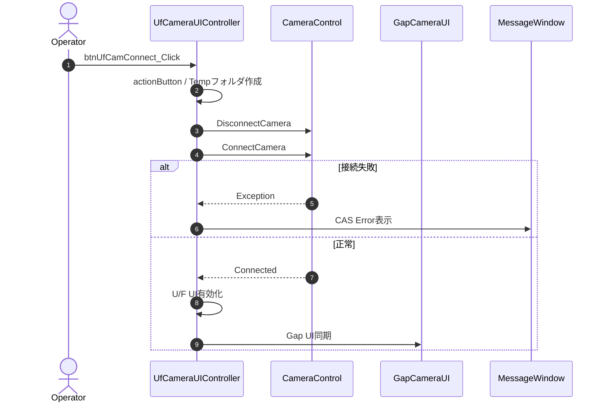
```mermaid
sequenceDiagram
    autonumber
    actor OP as Operator
    participant UI as UfCameraUIController
    participant CAM as CameraControl
    participant GAP as GapCameraUI
    participant MSG as MessageWindow

    OP->>UI: btnUfCamConnect_Click
    UI->>UI: actionButton / Tempフォルダ作成
    UI->>CAM: DisconnectCamera
    UI->>CAM: ConnectCamera
    alt 接続失敗
        CAM-->>UI: Exception
        UI->>MSG: CAS Error表示
    else 正常
        CAM-->>UI: Connected
        UI->>UI: U/F UI有効化
        UI->>GAP: Gap UI同期
    end
```

#### 8-1-3. btnUfCamDisconnect_Click

| 項目 | 内容 |
|------|------|
| シグネチャ | private void btnUfCamDisconnect_Click(object sender, RoutedEventArgs e) |
| 概要 | カメラ切断と位置合わせ停止を行い、関連UIを無効化する |

引数: sender, e
返り値: なし（void）

処理概要（詳細）

| 手順No. | 処理内容 | 詳細 |
|---------|----------|------|
| 1 | 開始状態遷移 | actionButton を実行する。 |
| 2 | 位置合わせ停止フラグ設定 | tbtnUfCamSetPos と tbtnGapCamSetPos を false にする。 |
| 3 | カメラ切断 | DisconnectCamera を実行する。 |
| 4 | U/F UI無効化 | 接続、計測、調整、位置合わせ関連を無効化する。 |
| 5 | Gap UI無効化 | Gap側の接続、計測、調整、位置合わせ関連を無効化する。 |

入力条件・前提条件

| 区分 | 条件 | NG時挙動 |
|------|------|----------|
| 接続状態 | カメラ接続済み、または切断可能状態であること | 例外通知して処理を中断 |
| 位置合わせ状態 | タイマ停止処理が可能であること | 停止不可時はエラー通知後に強制OFF |

主要呼出し先

| 呼出し先 | 役割 | 同期/非同期 |
|----------|------|--------------|
| DisconnectCamera | カメラ接続解除 | 同期 |
| actionButton | UI状態遷移管理 | 同期 |

例外時仕様

| ケース | 捕捉方法 | 通知 | 後処理 |
|--------|----------|------|--------|
| 切断失敗 | Exception | CAS Error表示 | UIを安全側(無効)へ寄せる |
| 停止処理失敗 | Exception | CAS Error表示 | tbtnUfCamSetPos=false を維持 |

シーケンス図

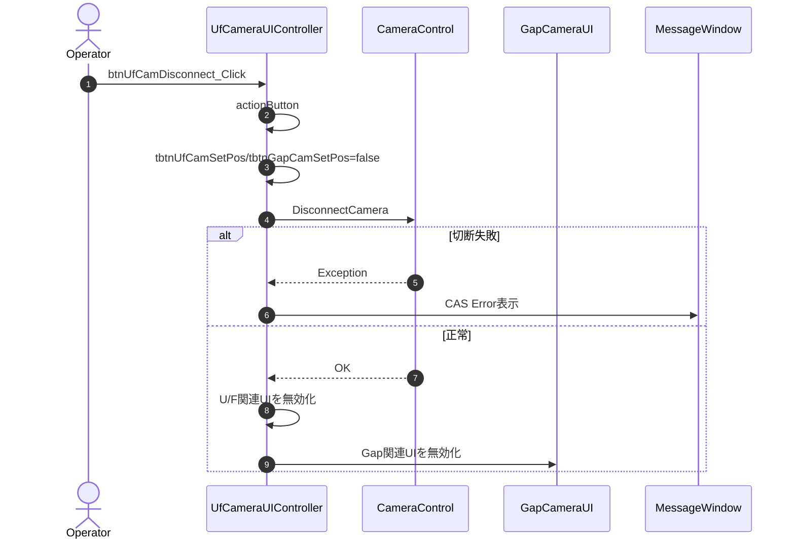
```mermaid
sequenceDiagram
    autonumber
    actor OP as Operator
    participant UI as UfCameraUIController
    participant CAM as CameraControl
    participant GAP as GapCameraUI
    participant MSG as MessageWindow

    OP->>UI: btnUfCamDisconnect_Click
    UI->>UI: actionButton
    UI->>UI: tbtnUfCamSetPos/tbtnGapCamSetPos=false
    UI->>CAM: DisconnectCamera
    alt 切断失敗
        CAM-->>UI: Exception
        UI->>MSG: CAS Error表示
    else 正常
        CAM-->>UI: OK
        UI->>UI: U/F関連UIを無効化
        UI->>GAP: Gap関連UIを無効化
    end
```

#### 8-1-4. btnUfCamMeasStart_Click

| 項目 | 内容 |
|------|------|
| シグネチャ | private async void btnUfCamMeasStart_Click(object sender, RoutedEventArgs e) |
| 概要 | U/F計測処理を開始する |

引数: sender, e
返り値: なし（void）

処理概要（詳細）

| 手順No. | 処理内容 | 詳細 |
|---------|----------|------|
| 1 | 開始処理 | ufCamMeasLog 初期化と actionButton 実行を行う。 |
| 2 | 対象Cabinet検証 | CheckSelectedUnits で選択不備・矩形不成立を検出する。 |
| 3 | 対象Controller初期化 | dicController.Target を対象Cabinetに合わせて更新する。 |
| 4 | Progress初期化 | WindowProgress を Measurement モードで生成し開始メッセージを表示する。 |
| 5 | 位置合わせ停止 | 位置合わせ中ならタイマ停止、トグルOFF、通常設定復帰を実施する。 |
| 6 | 距離条件取得 | dist、wallH、camH をUIから取得し CheckShootingDist を実施する。 |
| 7 | 保存先準備 | measPath を UF_yyyyMMddHHmm 形式で作成し m_CamUfMeasPath へ保持する。 |
| 8 | 非同期計測実行 | Task.Run で MeasureUfAsync を起動する。 |
| 9 | finally処理 | ThroughMode解除、ユーザー設定復帰、不要画像削除、XML保存、ログ世代管理を行う。 |
| 10 | 終了通知 | Measurement UF Complete または Failed in Measurement UF を表示し UIを復帰する。 |

入力条件・前提条件

| 区分 | 条件 | NG時挙動 |
|------|------|----------|
| 対象選択 | 計測対象Cabinetが矩形成立していること | エラー表示後に tcUfCamView=0 へ戻して終了 |
| 距離条件 | dist が取得可能で仕様範囲内であること | 例外通知して終了 |
| 保存先 | measPath 配下へ書込み可能であること | 例外通知して終了 |

主要呼出し先

| 呼出し先 | 役割 | 同期/非同期 |
|----------|------|--------------|
| CheckSelectedUnits | 対象Cabinetの妥当性検証 | 同期 |
| MeasureUfAsync | U/F計測主処理 | 非同期（Task.Run） |
| UfCamMeasLog.SaveToXmlFile | 計測結果XML保存 | 同期 |

例外時仕様

| ケース | 捕捉方法 | 通知 | 後処理 |
|--------|----------|------|--------|
| 対象検証失敗 | CheckSelectedUnits 例外 | CAS Error表示 | releaseButton 実行 |
| ユーザー中断 | CameraCasUserAbortException | Abort表示 | status=false、Progress操作終了 |
| 計測失敗 | Exception | CAS Error表示 | status=false、UI復帰 |

シーケンス図

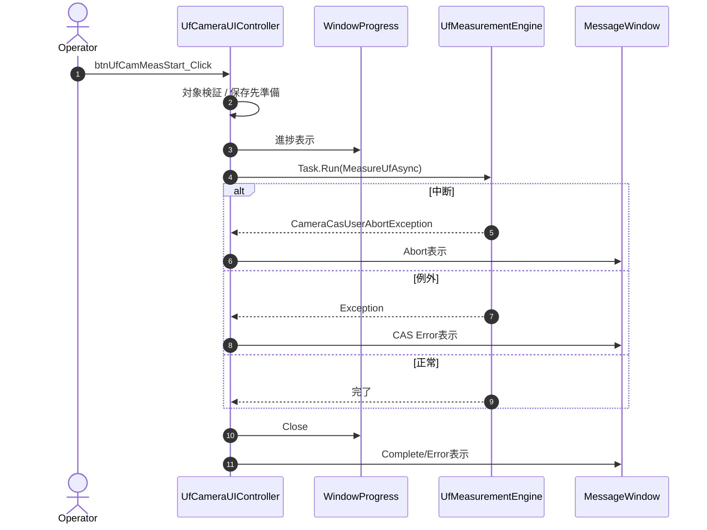
```mermaid
sequenceDiagram
    autonumber
    actor OP as Operator
    participant UI as UfCameraUIController
    participant PRG as WindowProgress
    participant MEAS as UfMeasurementEngine
    participant MSG as MessageWindow

    OP->>UI: btnUfCamMeasStart_Click
    UI->>UI: 対象検証 / 保存先準備
    UI->>PRG: 進捗表示
    UI->>MEAS: Task.Run(MeasureUfAsync)
    alt 中断
        MEAS-->>UI: CameraCasUserAbortException
        UI->>MSG: Abort表示
    else 例外
        MEAS-->>UI: Exception
        UI->>MSG: CAS Error表示
    else 正常
        MEAS-->>UI: 完了
    end
    UI->>PRG: Close
    UI->>MSG: Complete/Error表示
```

#### 8-1-5. btnUfCamAdjustStart_Click

| 項目 | 内容 |
|------|------|
| シグネチャ | private async void btnUfCamAdjustStart_Click(object sender, RoutedEventArgs e) |
| 概要 | U/F調整処理を開始し、必要に応じて調整後再計測を行う |

引数: sender, e
返り値: なし（void）

処理概要（詳細）

| 手順No. | 処理内容 | 詳細 |
|---------|----------|------|
| 1 | 初期化 | ufCamAdjLog 初期化と actionButton 実行を行う。 |
| 2 | 対象Cabinet検証 | CheckSelectedUnits により調整対象を検証する。 |
| 3 | Progress初期化 | Adjustment モードの WindowProgress を表示する。 |
| 4 | 位置合わせ停止 | 実行中の位置合わせを停止し通常設定へ戻す。 |
| 5 | 実行前条件確認 | IsCameraOpened を確認し未接続時は終了する。 |
| 6 | 保存先準備 | logDir を CamUF_yyyyMMddHHmm 形式で作成する。 |
| 7 | 調整条件確定 | 調整方式、視聴点、基準Cabinet、距離条件をUIから取得する。 |
| 8 | 調整主処理起動 | Task.Run で AdjustUfCamAsync を起動する。 |
| 9 | 任意再計測 | cbUfCamMeasResult が true の場合、MeasureUfAsync を再実行する。 |
| 10 | finally処理 | 設定復帰、XML保存、ログ世代管理、メッセージ表示、UI復帰を行う。 |

主要呼出し先

| 呼出し先 | 役割 | 同期/非同期 |
|----------|------|--------------|
| StoreObjectiveCabinet | 基準Cabinet決定 | 同期 |
| CheckObjectiveCabinet | 基準Cabinet妥当性検証 | 同期 |
| AdjustUfCamAsync | U/F調整主処理 | 非同期（Task.Run） |
| MeasureUfAsync | 調整後再計測 | 非同期（Task.Run） |

例外時仕様

| ケース | 捕捉方法 | 通知 | 後処理 |
|--------|----------|------|--------|
| カメラ未接続 | IsCameraOpened false | CAS Error表示 | tcMain を復帰 |
| 基準Cabinet不正 | CheckObjectiveCabinet 例外 | CAS Error表示 | status=false |
| ユーザー中断 | CameraCasUserAbortException | Abort表示 | status=false |
| 調整失敗 | Exception | CAS Error表示 | status=false、UI復帰 |

シーケンス図

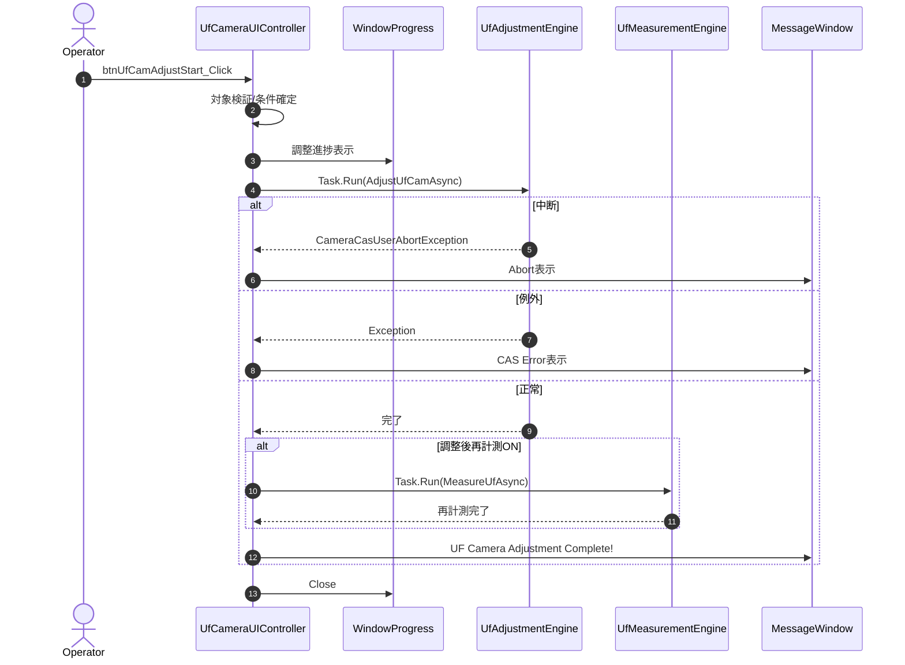
```mermaid
sequenceDiagram
    autonumber
    actor OP as Operator
    participant UI as UfCameraUIController
    participant PRG as WindowProgress
    participant ADJ as UfAdjustmentEngine
    participant MEAS as UfMeasurementEngine
    participant MSG as MessageWindow

    OP->>UI: btnUfCamAdjustStart_Click
    UI->>UI: 対象検証/条件確定
    UI->>PRG: 調整進捗表示
    UI->>ADJ: Task.Run(AdjustUfCamAsync)
    alt 中断
        ADJ-->>UI: CameraCasUserAbortException
        UI->>MSG: Abort表示
    else 例外
        ADJ-->>UI: Exception
        UI->>MSG: CAS Error表示
    else 正常
        ADJ-->>UI: 完了
        alt 調整後再計測ON
            UI->>MEAS: Task.Run(MeasureUfAsync)
            MEAS-->>UI: 再計測完了
        end
        UI->>MSG: UF Camera Adjustment Complete!
    end
    UI->>PRG: Close
```

#### 8-1-6. cbUfCamTgtCabi_Checked

| 項目 | 内容 |
|------|------|
| シグネチャ | private void cbUfCamTgtCabi_Checked(object sender, RoutedEventArgs e) |
| 概要 | 基準Line選択数と組合せの妥当性を検証する |

引数: sender, e
返り値: なし（void）

処理概要（詳細）

| 手順No. | 処理内容 | 詳細 |
|---------|----------|------|
| 1 | 選択数集計 | Top/Bottom/Left/Right の選択数を数える。 |
| 2 | 上限判定 | 3本以上選択時はメッセージ表示し当該チェックを戻す。 |
| 3 | 排他判定 | Top+Bottom または Left+Right の同時選択時はメッセージ表示し当該チェックを戻す。 |

入力条件・前提条件

| 区分 | 条件 | NG時挙動 |
|------|------|----------|
| イベント送信元 | CheckBox であること | キャスト失敗時は無処理終了 |
| 選択状態 | 1〜2本選択、かつ対向辺同時選択なし | 警告表示し送信元を false へ戻す |

主要呼出し先

| 呼出し先 | 役割 | 同期/非同期 |
|----------|------|--------------|
| showMessageWindow | 警告メッセージ表示 | 同期 |

例外時仕様

| ケース | 捕捉方法 | 通知 | 後処理 |
|--------|----------|------|--------|
| 選択規則違反 | 条件分岐 | Up to 2 lines can be selected. | 対象チェックを解除 |

シーケンス図

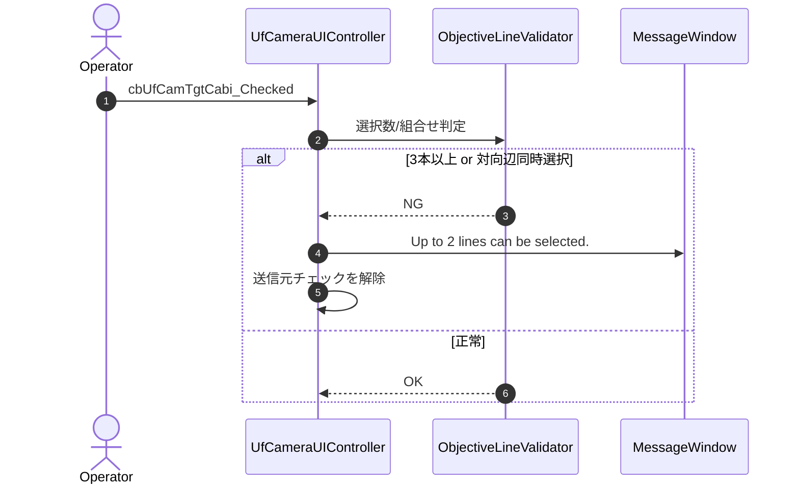
```mermaid
sequenceDiagram
    autonumber
    actor OP as Operator
    participant UI as UfCameraUIController
    participant LINE as ObjectiveLineValidator
    participant MSG as MessageWindow

    OP->>UI: cbUfCamTgtCabi_Checked
    UI->>LINE: 選択数/組合せ判定
    alt 3本以上 or 対向辺同時選択
        LINE-->>UI: NG
        UI->>MSG: Up to 2 lines can be selected.
        UI->>UI: 送信元チェックを解除
    else 正常
        LINE-->>UI: OK
    end
```

#### 8-1-7. tbtnUfCamSetPos_Click

| 項目 | 内容 |
|------|------|
| シグネチャ | private void tbtnUfCamSetPos_Click(object sender, RoutedEventArgs e) |
| 概要 | カメラ位置合わせモードの開始/停止を制御する |

引数: sender, e
返り値: なし（void）

処理概要（詳細）

| 手順No. | 処理内容 | 詳細 |
|---------|----------|------|
| 1 | 開始音再生 | playSound を実行しステータス表示を更新する。 |
| 2 | ON時の距離条件確認 | dist、wallH、camH を取得し CheckShootingDist を実施する。 |
| 3 | ON時の対象検証 | CheckSelectedUnits で矩形成立を確認する。 |
| 4 | ON時の設定退避/適用 | getUserSettingSetPos、setAdjustSettingSetPos、Layout情報Off を実施する。 |
| 5 | AFと目標位置設定 | outputIntSigChecker 後に AutoFocus と SetCamPosTarget を実行する。 |
| 6 | Cabinet空間座標設定 | SetCabinetPos を実行する。 |
| 7 | 表示切替/タイマ開始 | tcUfCamView=1 とし timerUfCam.Enabled=true を設定する。 |
| 8 | OFF時処理 | ステータスを Done. に戻す。 |

例外時仕様

| ケース | 捕捉方法 | 通知 | 後処理 |
|--------|----------|------|--------|
| 対象検証失敗 | CheckSelectedUnits 例外 | CAS Error表示 | トグルOFF、タブ0へ復帰 |
| 準備処理失敗 | Exception | CAS Error表示 | ThroughMode解除、設定復帰、内部信号OFF |

シーケンス図

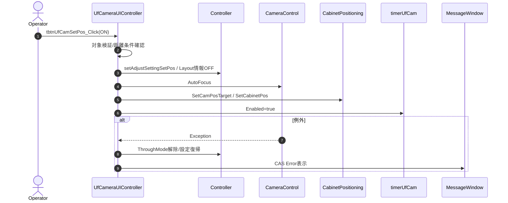
```mermaid
sequenceDiagram
    autonumber
    actor OP as Operator
    participant UI as UfCameraUIController
    participant CTRL as Controller
    participant CAM as CameraControl
    participant POS as CabinetPositioning
    participant TMR as timerUfCam
    participant MSG as MessageWindow

    OP->>UI: tbtnUfCamSetPos_Click(ON)
    UI->>UI: 対象検証/距離条件確認
    UI->>CTRL: setAdjustSettingSetPos / Layout情報OFF
    UI->>CAM: AutoFocus
    UI->>POS: SetCamPosTarget / SetCabinetPos
    UI->>TMR: Enabled=true
    alt 例外
        CAM-->>UI: Exception
        UI->>CTRL: ThroughMode解除/設定復帰
        UI->>MSG: CAS Error表示
    end
```

#### 8-1-8. timerUfCam_Tick

| 項目 | 内容 |
|------|------|
| シグネチャ | private void timerUfCam_Tick(object sender, EventArgs e) |
| 概要 | 位置合わせ中の周期更新処理を実行する |

引数: sender, e
返り値: なし（void）

処理概要（詳細）

| 手順No. | 処理内容 | 詳細 |
|---------|----------|------|
| 1 | 位置合わせ更新 | AdjustCameraPosUf を呼び出してライブ表示とガイド評価を更新する。 |
| 2 | 例外時の設定復帰 | ThroughMode解除、ユーザー設定復帰、内部信号OFFを実施する。 |
| 3 | 位置合わせ停止 | タイマ停止、トグルOFF、tbtnUfCamSetPos_Click 呼出しで停止遷移を確定する。 |
| 4 | エラー通知 | CAS Errorダイアログを表示する。 |

入力条件・前提条件

| 区分 | 条件 | NG時挙動 |
|------|------|----------|
| 位置合わせ状態 | tbtnUfCamSetPos=true かつ timerUfCam.Enabled=true | 条件不成立時は更新スキップ |
| カメラ状態 | IsCameraOpened=true が維持されること | 例外で停止遷移 |

主要呼出し先

| 呼出し先 | 役割 | 同期/非同期 |
|----------|------|--------------|
| AdjustCameraPosUf | ライブ画像取得と位置合わせ評価 | 同期 |
| setUserSetting | 退避設定の復元 | 同期 |
| stopIntSig | 内部信号停止 | 同期 |

例外時仕様

| ケース | 捕捉方法 | 通知 | 後処理 |
|--------|----------|------|--------|
| ライブ更新失敗 | Exception | CAS Error表示 | タイマ停止、トグルOFF、設定復帰 |

シーケンス図

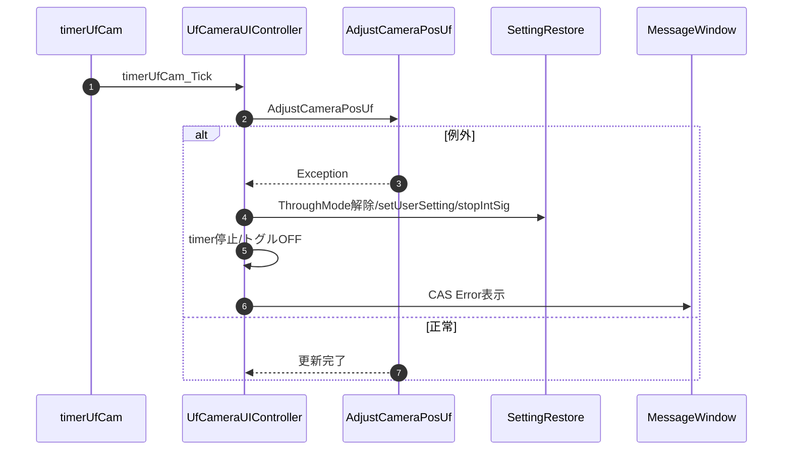
```mermaid
sequenceDiagram
    autonumber
    participant TMR as timerUfCam
    participant UI as UfCameraUIController
    participant POS as AdjustCameraPosUf
    participant SET as SettingRestore
    participant MSG as MessageWindow

    TMR->>UI: timerUfCam_Tick
    UI->>POS: AdjustCameraPosUf
    alt 例外
        POS-->>UI: Exception
        UI->>SET: ThroughMode解除/setUserSetting/stopIntSig
        UI->>UI: timer停止/トグルOFF
        UI->>MSG: CAS Error表示
    else 正常
        POS-->>UI: 更新完了
    end
```

#### 8-1-9. btnUfCamResultOpen_Click

| 項目 | 内容 |
|------|------|
| シグネチャ | private void btnUfCamResultOpen_Click(object sender, RoutedEventArgs e) |
| 概要 | 保存済みU/F計測結果XMLを読込み、結果表示へ再展開する |

引数: sender, e
返り値: なし（void）

処理概要（詳細）

| 手順No. | 処理内容 | 詳細 |
|---------|----------|------|
| 1 | OpenFileDialog 初期化 | 測定フォルダを初期ディレクトリに設定する。 |
| 2 | XML選択 | OK時のみ後続処理を実行する。 |
| 3 | XML読込 | UfCamMeasLog.LoadFromXmlFile を実行する。 |
| 4 | 結果表示 | dispUfMeasResult を呼び出す。 |
| 5 | 例外時通知 | 形式不正メッセージを表示する。 |

入力条件・前提条件

| 区分 | 条件 | NG時挙動 |
|------|------|----------|
| ファイル選択 | XMLファイルが選択されること | Cancel時は無処理終了 |
| ファイル形式 | UfCamMeasLog 形式と整合すること | 形式不正メッセージ表示 |

主要呼出し先

| 呼出し先 | 役割 | 同期/非同期 |
|----------|------|--------------|
| OpenFileDialog | 結果XMLパスの選択 | 同期 |
| UfCamMeasLog.LoadFromXmlFile | 計測結果の読込 | 同期 |
| dispUfMeasResult | 画面への再表示 | 同期 |

例外時仕様

| ケース | 捕捉方法 | 通知 | 後処理 |
|--------|----------|------|--------|
| XML形式不正 | Exception | The format of the opened file is incorrect. | 画面状態を維持 |
| 読込失敗 | Exception | CAS Error表示 | 処理中断 |

シーケンス図

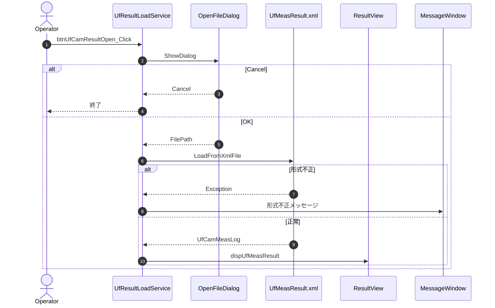
```mermaid
sequenceDiagram
    autonumber
    actor OP as Operator
    participant UI as UfResultLoadService
    participant DLG as OpenFileDialog
    participant XML as UfMeasResult.xml
    participant VIEW as ResultView
    participant MSG as MessageWindow

    OP->>UI: btnUfCamResultOpen_Click
    UI->>DLG: ShowDialog
    alt Cancel
        DLG-->>UI: Cancel
        UI-->>OP: 終了
    else OK
        DLG-->>UI: FilePath
        UI->>XML: LoadFromXmlFile
        alt 形式不正
            XML-->>UI: Exception
            UI->>MSG: 形式不正メッセージ
        else 正常
            XML-->>UI: UfCamMeasLog
            UI->>VIEW: dispUfMeasResult
        end
    end
```

#### 8-1-10. cmbxUfCamLensCd_SelectionChanged

| 項目 | 内容 |
|------|------|
| シグネチャ | private void cmbxUfCamLensCd_SelectionChanged(object sender, SelectionChangedEventArgs e) |
| 概要 | U/F側レンズCD選択をGap側へ同期する |

引数: sender, e
返り値: なし（void）

処理概要（詳細）

| 手順No. | 処理内容 | 詳細 |
|---------|----------|------|
| 1 | 選択状態取得 | cmbxUfCamLensCd.SelectedIndex を取得する。 |
| 2 | Gap側同期 | cmbxGapCamLensCd.SelectedIndex へ同値を設定する。 |
| 3 | 終了 | 同期完了後に処理を終了する。 |

入力条件・前提条件

| 区分 | 条件 | NG時挙動 |
|------|------|----------|
| レンズ一覧 | U/FとGapのレンズ候補数が整合していること | 例外通知して終了 |
| 選択値 | SelectedIndex が有効範囲であること | 例外通知して終了 |

主要呼出し先

| 呼出し先 | 役割 | 同期/非同期 |
|----------|------|--------------|
| cmbxGapCamLensCd | Gap側レンズ選択UI | 同期 |

例外時仕様

| ケース | 捕捉方法 | 通知 | 後処理 |
|--------|----------|------|--------|
| 選択同期失敗 | Exception | CAS Error表示 | 無処理終了 |

シーケンス図

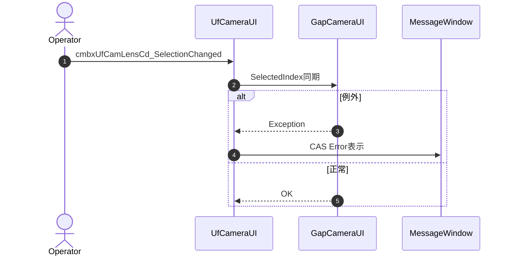
```mermaid
sequenceDiagram
    autonumber
    actor OP as Operator
    participant UF as UfCameraUI
    participant GAP as GapCameraUI
    participant MSG as MessageWindow

    OP->>UF: cmbxUfCamLensCd_SelectionChanged
    UF->>GAP: SelectedIndex同期
    alt 例外
        GAP-->>UF: Exception
        UF->>MSG: CAS Error表示
    else 正常
        GAP-->>UF: OK
    end
```

### 8-2. U/F計測系メソッド

#### 8-2-1. MeasureUfAsync

| 項目 | 内容 |
|------|------|
| シグネチャ | private void MeasureUfAsync(List<UnitInfo> lstTgtCabi, string measPath, ViewPoint vp, double dist, double wallH, double camH, bool targetOnly = false) |
| 概要 | U/F計測の主処理を実行し、撮影、解析、結果表示までを一括制御する |

引数: lstTgtCabi, measPath, vp, dist, wallH, camH, targetOnly
返り値: なし（void）

処理概要（詳細）

| 手順No. | 処理内容 | 詳細 |
|---------|----------|------|
| 1 | Progress初期化 | 全体ステップ数、残り時間を初期化する。 |
| 2 | 環境確認 | OpenCvSharp DLL の存在を確認する。 |
| 3 | 前処理 | Cabinet Power On、SetCamPosTarget、ユーザー設定退避、Adjust設定適用を行う。 |
| 4 | AF実行 | SetPosSetting で AutoFocus を行う。 |
| 5 | カメラ位置取得 | GetCameraPosUf と CheckCameraPos により開始位置を確定する。 |
| 6 | Cabinet座標補正 | SetCabinetPos と MoveCabinetPos を行い、CheckCpAngle で角度上限を確認する。 |
| 7 | 画像取得 | CaptureUfImages を呼び出し計測画像一式を保存する。 |
| 8 | 解析 | calcMeasAreaPv で Cabinet/Module の測定値を計算する。 |
| 9 | 後処理 | 終了カメラ位置保存、内部信号停止、通常設定復帰、結果表示を行う。 |

主要呼出し先

| 呼出し先 | 役割 | 同期/非同期 |
|----------|------|--------------|
| CheckOpenCvSharpDll | 解析環境確認 | 同期 |
| AutoFocus | AF実行 | 同期 |
| CaptureUfImages | 計測画像取得 | 同期 |
| calcMeasAreaPv | 測定領域解析 | 同期 |

例外時仕様

| ケース | 捕捉方法 | 通知/伝播 | 後処理 |
|--------|----------|-----------|--------|
| カメラ位置取得失敗 | false戻り/Exception | 呼出元へ送出 | 処理中断 |
| カメラ位置不適切 | CheckCameraPos false | 呼出元へ送出 | 再位置合わせ要求 |
| 角度超過 | CheckCpAngle 例外 | 呼出元へ送出 | 距離条件見直し要求 |

シーケンス図

```mermaid
sequenceDiagram
    autonumber
    participant UI as btnUfCamMeasStart_Click
    participant MEAS as MeasureUfAsync
    participant CTRL as Controller
    participant CAM as CameraControl
    participant CAP as CaptureUfImages
    participant ANA as calcMeasAreaPv

    UI->>MEAS: Task.Run(MeasureUfAsync)
    MEAS->>CTRL: PowerOn/設定適用
    MEAS->>CAM: AutoFocus
    MEAS->>CAM: GetCameraPosUf/CheckCameraPos
    MEAS->>CAP: CaptureUfImages
    CAP-->>MEAS: Black/Mask/Module/Flat
    MEAS->>ANA: calcMeasAreaPv
    ANA-->>MEAS: 測定結果
    MEAS->>CTRL: ThroughMode解除/設定復帰
    MEAS-->>UI: 完了
```

#### 8-2-2. CalcTargetArea

| 項目 | 内容 |
|------|------|
| シグネチャ | private double CalcTargetArea(CvBlob[,] aryBlob) |
| 概要 | 対象Cabinet群のBlob外接領域から画像占有面積を算出する |

引数: aryBlob
返り値: area（double）

処理概要（詳細）

| 手順No. | 処理内容 | 詳細 |
|---------|----------|------|
| 1 | 初期化 | minX/minY を最大値、maxX/maxY を最小値で初期化する。 |
| 2 | Blob走査 | aryBlob 内の有効Blobを走査し外接矩形の境界を更新する。 |
| 3 | 面積算出 | (maxX-minX)×(maxY-minY) で対象面積を算出する。 |
| 4 | 戻り値返却 | 面積を double で返却する。 |

例外時仕様: 有効Blobが存在しない場合は 0 を返す。

シーケンス図

```mermaid
sequenceDiagram
    autonumber
    participant CALLER as MeasureUfAsync
    participant CALC as CalcTargetArea
    participant BLOB as CvBlob[,]

    CALLER->>CALC: CalcTargetArea(aryBlob)
    CALC->>BLOB: 有効Blob走査
    CALC->>CALC: min/max境界更新
    CALC->>CALC: 面積算出
    CALC-->>CALLER: area
```

#### 8-2-3. CheckCpAngle

| 項目 | 内容 |
|------|------|
| シグネチャ | private void CheckCpAngle(List<UnitInfo> lstTgtCabi) |
| 概要 | 調整点の Pan/Tilt が上限を超えていないか確認する |

引数: lstTgtCabi
返り値: なし（void）

処理概要（詳細）

| 手順No. | 処理内容 | 詳細 |
|---------|----------|------|
| 1 | 対象走査 | lstTgtCabi を順次走査する。 |
| 2 | 角度取得 | 各Cabinetの CabinetPos から Pan/Tilt を取得する。 |
| 3 | 上限判定 | |Pan| > PanLimit または |Tilt| > TiltLimit を判定する。 |
| 4 | エラー送出 | 上限超過時は距離条件見直しを促す Exception を送出する。 |

例外時仕様: PanLimit または TiltLimit 超過時に Exception を送出する。

シーケンス図

```mermaid
sequenceDiagram
    autonumber
    participant CALLER as Measure/Adjust
    participant CHK as CheckCpAngle
    participant POS as CabinetPos

    CALLER->>CHK: CheckCpAngle(lstTgtCabi)
    loop 各Cabinet
        CHK->>POS: Pan/Tilt取得
        CHK->>CHK: 上限判定
    end
    alt 上限超過
        CHK-->>CALLER: Exception
    else 正常
        CHK-->>CALLER: 完了
    end
```

#### 8-2-4. CaptureUfImages

| 項目 | 内容 |
|------|------|
| シグネチャ | private void CaptureUfImages(List<UnitInfo> lstTgtCabi, string measPath, bool targetOnly) |
| 概要 | Black、Mask、Module、Flat の計測画像一式を取得する |

引数: lstTgtCabi, measPath, targetOnly
返り値: なし（void）

処理概要（詳細）

| 手順No. | 処理内容 | 詳細 |
|---------|----------|------|
| 1 | Black画像取得 | 内部信号停止状態で Black を撮影する。 |
| 2 | Mask画像取得 | OutputTargetArea 実行後にエリア画像を撮影する。 |
| 3 | Module画像取得 | CaptureModuleAreaImage を呼び出す。 |
| 4 | Flat画像取得 | CaptureMeasFlatImage を呼び出す。 |
| 5 | 内部信号停止 | stopIntSig を実行する。 |

シーケンス図

```mermaid
sequenceDiagram
    autonumber
    participant MEAS as MeasureUfAsync
    participant CAP as CaptureUfImages
    participant CTRL as Controller
    participant CAM as CameraControl
    participant FS as FileSystem

    MEAS->>CAP: CaptureUfImages
    CAP->>CTRL: Blackパターン
    CAP->>CAM: CaptureImage(Black)
    CAM->>FS: Black保存
    CAP->>CTRL: TargetAreaパターン
    CAP->>CAM: CaptureImage(Mask)
    CAM->>FS: Mask保存
    CAP->>CAM: CaptureModuleAreaImage
    CAP->>CAM: CaptureMeasFlatImage
    CAP->>CTRL: stopIntSig
```

#### 8-2-5. CaptureModuleAreaImage

| 項目 | 内容 |
|------|------|
| シグネチャ | private void CaptureModuleAreaImage(string path) |
| 概要 | Module単位の測定エリア画像を順次取得する |

引数: path
返り値: なし（void）

処理概要（詳細）

| 手順No. | 処理内容 | 詳細 |
|---------|----------|------|
| 1 | Moduleループ | moduleCount に従い開始座標を算出する。 |
| 2 | パターン出力 | outputIntSigHatch で対象Moduleを強調表示する。 |
| 3 | 撮影 | CaptureImage で Module画像を保存する。 |

シーケンス図

```mermaid
sequenceDiagram
    autonumber
    participant CAP as CaptureUfImages
    participant MOD as CaptureModuleAreaImage
    participant CTRL as Controller
    participant CAM as CameraControl
    participant FS as FileSystem

    CAP->>MOD: CaptureModuleAreaImage(path)
    loop 各Module
        MOD->>CTRL: outputIntSigHatch
        MOD->>CAM: CaptureImage
        CAM->>FS: Module画像保存
    end
    MOD-->>CAP: 完了
```

#### 8-2-6. CaptureMeasFlatImage

| 項目 | 内容 |
|------|------|
| シグネチャ | private void CaptureMeasFlatImage(string path, List<UnitInfo> lstTgtCabi, bool targetOnly = false) |
| 概要 | Flat画像群を取得し、U/F測定の平均値計算入力を準備する |

引数: path, lstTgtCabi, targetOnly
返り値: なし（void）

処理概要（詳細）

| 手順No. | 処理内容 | 詳細 |
|---------|----------|------|
| 1 | Flat表示準備 | outputIntSigFlat を呼び出し、Flat表示状態に遷移する。 |
| 2 | 撮影範囲決定 | targetOnly=true の場合は対象Cabinetのみ、それ以外は全Cabinetを対象にする。 |
| 3 | Flat撮影 | 対象Cabinetごとに CaptureImage を実行し Flat画像を保存する。 |
| 4 | 後処理 | stopIntSig を実行し内部信号を停止する。 |

入力条件・前提条件

| 区分 | 条件 | NG時挙動 |
|------|------|----------|
| 保存先 | path が書込み可能であること | 例外通知して中断 |
| 対象Cabinet | lstTgtCabi が空でないこと | 例外通知して中断 |

例外時仕様: 撮影失敗時は Exception を送出し、呼出元で安全復帰する。

シーケンス図

```mermaid
sequenceDiagram
    autonumber
    participant CAP as CaptureUfImages
    participant FLAT as CaptureMeasFlatImage
    participant CTRL as Controller
    participant CAM as CameraControl
    participant FS as FileSystem

    CAP->>FLAT: CaptureMeasFlatImage(path, lstTgtCabi, targetOnly)
    FLAT->>CTRL: outputIntSigFlat
    loop 対象Cabinet
        FLAT->>CAM: CaptureImage(Flat)
        CAM->>FS: Flat画像保存
    end
    FLAT->>CTRL: stopIntSig
    FLAT-->>CAP: 完了
```

### 8-3. 位置・基準Cabinet算出系メソッド

#### 8-3-1. SetCabinetPos

| 項目 | 内容 |
|------|------|
| シグネチャ | private void SetCabinetPos(List<UnitInfo> lstTgtUnits, double dist) / private void SetCabinetPos(List<UnitInfo> lstTgtUnits, double dist, double wallH, double camH) |
| 概要 | 撮影距離と壁条件に基づき、全Cabinetの空間座標を設定する |

引数: lstTgtUnits, dist, wallH, camH
返り値: なし（void）

処理概要（詳細）

| 手順No. | 処理内容 | 詳細 |
|---------|----------|------|
| 1 | 相対位置計算 | CalcRelativePosition で pan、tilt、x、y を取得する。 |
| 2 | Curve形状判定 | rbConfigWallFormCurve が true の場合は壁形状ファイルを読込む。 |
| 3 | 有効Cabinet走査 | Blank除外後の有効領域サイズを actMaxX, actMaxY として算出する。 |
| 4 | 原点Cabinet設定 | 左下原点から tempCabiPos 配列へ CabinetCoordinate を展開する。 |
| 5 | 実座標反映 | allocInfo.lstUnits の CabinetPos へ変換結果を反映する。 |

例外時仕様

| ケース | 捕捉方法 | 通知/伝播 | 後処理 |
|--------|----------|-----------|--------|
| 壁形状ファイル読込失敗 | LoadWallFormFile 例外 | Exception再送出 | 呼出元で停止 |

シーケンス図

```mermaid
sequenceDiagram
    autonumber
    participant CALLER as Positioning/Measure/Adjust
    participant POS as SetCabinetPos
    participant GEO as CalcRelativePosition
    participant WALL as WallFormFile
    participant ALLOC as allocInfo

    CALLER->>POS: SetCabinetPos(lstTgtUnits, dist,...)
    POS->>GEO: CalcRelativePosition
    alt Curve壁
        POS->>WALL: LoadWallFormFile
    end
    POS->>POS: 有効Cabinet走査/原点計算
    POS->>ALLOC: CabinetPos反映
    POS-->>CALLER: 完了
```

#### 8-3-2. StoreObjectiveCabinet（中央選択）

| 項目 | 内容 |
|------|------|
| シグネチャ | private void StoreObjectiveCabinet(List<UnitInfo> lstTgtUnit, out List<UnitInfo> lstObjCabi) |
| 概要 | 調整対象範囲の中央にあるCabinetを基準Cabinetとして決定する |

引数: lstTgtUnit, out lstObjCabi
返り値: なし（void）

処理概要（詳細）

| 手順No. | 処理内容 | 詳細 |
|---------|----------|------|
| 1 | 境界算出 | lstTgtUnit の min/max 座標を取得する。 |
| 2 | 中央座標算出 | X/Y中央位置を計算する。 |
| 3 | 最近傍選定 | 中央座標に最も近い Cabinet を探索する。 |
| 4 | 結果格納 | 選定Cabinetを lstObjCabi へ追加する。 |

例外時仕様: 対象Cabinetが空の場合は Exception を送出する。

シーケンス図

```mermaid
sequenceDiagram
    autonumber
    participant CALLER as AdjustStart
    participant OBJ as StoreObjectiveCabinet(中央)
    participant UNITS as TargetUnits

    CALLER->>OBJ: StoreObjectiveCabinet(lstTgtUnit, out lstObjCabi)
    OBJ->>UNITS: 境界(min/max)取得
    OBJ->>OBJ: 中央座標計算
    OBJ->>UNITS: 最近傍Cabinet探索
    OBJ-->>CALLER: lstObjCabi
```

#### 8-3-3. StoreObjectiveCabinet（個別指定）

| 項目 | 内容 |
|------|------|
| シグネチャ | private void StoreObjectiveCabinet(string target, out List<UnitInfo> lstObjCabi) |
| 概要 | Cx-y-z 形式の文字列から基準Cabinetを特定する |

引数: target, out lstObjCabi
返り値: なし（void）

処理概要（詳細）

| 手順No. | 処理内容 | 詳細 |
|---------|----------|------|
| 1 | 文字列分解 | target を - 区切りで分解する。 |
| 2 | 識別子変換 | ControllerID、PortNo、UnitNo を整数化する。 |
| 3 | Cabinet走査 | allocInfo.lstUnits を走査し一致Cabinetを検索する。 |
| 4 | 結果格納 | 発見した Cabinet を lstObjCabi へ追加する。 |

シーケンス図

```mermaid
sequenceDiagram
    autonumber
    participant CALLER as AdjustStart
    participant OBJ as StoreObjectiveCabinet(個別)
    participant ALLOC as allocInfo.lstUnits

    CALLER->>OBJ: StoreObjectiveCabinet(target, out lstObjCabi)
    OBJ->>OBJ: target分解(Cx-y-z)
    OBJ->>OBJ: ID整数化
    OBJ->>ALLOC: 一致Cabinet検索
    OBJ-->>CALLER: lstObjCabi
```

#### 8-3-4. StoreObjectiveCabinet（Line指定）

| 項目 | 内容 |
|------|------|
| シグネチャ | private void StoreObjectiveCabinet(List<UnitInfo> lstTgtUnit, ObjectiveLine edge, out List<UnitInfo> lstObjCabi) |
| 概要 | 調整対象範囲の上端、下端、左端、右端から基準Cabinet群を選定する |

引数: lstTgtUnit, edge, out lstObjCabi
返り値: なし（void）

処理概要（詳細）

| 手順No. | 処理内容 | 詳細 |
|---------|----------|------|
| 1 | 端指定確認 | edge の Top/Bottom/Left/Right 指定状態を確認する。 |
| 2 | 端座標算出 | 指定された端の最小/最大X,Yを計算する。 |
| 3 | Cabinet抽出 | 端座標に一致する Cabinet 群を抽出する。 |
| 4 | 結果統合 | 重複を排除し lstObjCabi へ格納する。 |

例外時仕様: 基準Lineが1本も選択されていない場合は Exception を送出する。

シーケンス図

```mermaid
sequenceDiagram
    autonumber
    participant CALLER as AdjustStart
    participant OBJ as StoreObjectiveCabinet(Line)
    participant EDGE as ObjectiveLine
    participant UNITS as TargetUnits

    CALLER->>OBJ: StoreObjectiveCabinet(lstTgtUnit, edge, out lstObjCabi)
    OBJ->>EDGE: Top/Bottom/Left/Right状態確認
    alt 1本も未選択
        OBJ-->>CALLER: Exception
    else 選択あり
        OBJ->>UNITS: 端座標一致Cabinet抽出
        OBJ-->>CALLER: lstObjCabi
    end
```

#### 8-3-5. CheckObjectiveCabinet

| 項目 | 内容 |
|------|------|
| シグネチャ | private void CheckObjectiveCabinet(List<UnitInfo> lstObjCabi, List<UnitInfo> lstTgtUnit) |
| 概要 | 基準Cabinetが調整対象Cabinetに含まれていることを検証する |

引数: lstObjCabi, lstTgtUnit
返り値: なし（void）

処理概要（詳細）

| 手順No. | 処理内容 | 詳細 |
|---------|----------|------|
| 1 | 対象展開 | lstObjCabi を順次走査する。 |
| 2 | 所属判定 | 各基準Cabinetが lstTgtUnit 内に存在するか比較する。 |
| 3 | 不整合検出 | 非包含Cabinetを検出した場合はエラー情報を生成する。 |
| 4 | 例外送出 | 不整合ありの場合は Exception を送出する。 |

例外時仕様: 範囲外の基準Cabinetが含まれる場合は Exception を送出する。

シーケンス図

```mermaid
sequenceDiagram
    autonumber
    participant CALLER as AdjustStart
    participant CHK as CheckObjectiveCabinet
    participant OBJ as lstObjCabi
    participant TGT as lstTgtUnit

    CALLER->>CHK: CheckObjectiveCabinet(lstObjCabi, lstTgtUnit)
    loop 各基準Cabinet
        CHK->>TGT: 含有判定
    end
    alt 範囲外あり
        CHK-->>CALLER: Exception
    else 全件OK
        CHK-->>CALLER: 完了
    end
```

### 8-4. U/F調整系メソッド

#### 8-4-1. AdjustUfCamAsync

| 項目 | 内容 |
|------|------|
| シグネチャ | private void AdjustUfCamAsync(string logDir, List<UnitInfo> lstTgtCabi, UfCamAdjustType type, List<UnitInfo> lstObjCabi, ObjectiveLine objEdge, ViewPoint vp, double dist, double wallH, double camH) |
| 概要 | U/F調整の主処理を実行し、方式別補正計算と調整データ反映までを一括制御する |

引数: logDir, lstTgtCabi, type, lstObjCabi, objEdge, vp, dist, wallH, camH
返り値: なし（void）

処理概要（詳細）

| 手順No. | 処理内容 | 詳細 |
|---------|----------|------|
| 1 | ステップ数設定 | 調整方式に応じて全体ステップ数を設定する。 |
| 2 | 前処理 | OpenCvSharp DLL確認、Power On、SetCamPosTarget、MakeUFData 初期化を行う。 |
| 3 | 設定保存/適用 | ユーザー設定保存、Adjust設定適用、Layout情報Off を行う。 |
| 4 | AF/位置取得 | AutoFocus、GetCameraPosUf、CheckCameraPos を実施する。 |
| 5 | Cabinet座標補正 | SetCabinetPos、MoveCabinetPos、CheckCpAngle を行う。 |
| 6 | 方式別調整 | type に応じて AdjustUfCamCabinet、AdjustUfCam9pt、AdjustUfCamRadiator、AdjustUfCamEachModule を呼ぶ。 |
| 7 | 書込み | writeAdjustedData により調整済みファイルを反映する。 |
| 8 | 後処理 | Power On、終了位置保存、内部信号停止、通常設定復帰、White表示を行う。 |

主要呼出し先

| 呼出し先 | 役割 | 同期/非同期 |
|----------|------|--------------|
| CheckOpenCvSharpDll | 環境確認 | 同期 |
| AdjustUfCamCabinet/9pt/Radiator/EachModule | 方式別調整 | 同期 |
| writeAdjustedData | 調整済みデータ反映 | 同期 |

シーケンス図

```mermaid
sequenceDiagram
    autonumber
    participant UI as btnUfCamAdjustStart_Click
    participant ADJ as AdjustUfCamAsync
    participant MODE as AdjustUfCamCabinet/9pt/Radiator/EachModule
    participant MK as MakeUFData
    participant CTRL as Controller
    participant FS as FileSystem

    UI->>ADJ: Task.Run(AdjustUfCamAsync)
    ADJ->>CTRL: PowerOn/設定適用/AF
    ADJ->>MODE: 方式別調整呼出し
    MODE->>MK: ExtractFmt/Fmt2XYZ/ModifyXYZCam/Statistics
    MK-->>MODE: 補正データ
    MODE->>FS: adjusted hc.bin保存
    ADJ->>CTRL: writeAdjustedData
    ADJ->>FS: UnitCpInfo.xml保存
    ADJ-->>UI: 完了
```

#### 8-4-2. AdjustUfCamCabinet

| 項目 | 内容 |
|------|------|
| シグネチャ | private void AdjustUfCamCabinet(List<UnitInfo> lstTgtUnit, List<UnitInfo> lstObjCabi, ObjectiveLine objEdge, ViewPoint vp, string logDir, out List<MoveFile> lstMoveFile) |
| 概要 | CabinetモードのU/F調整を実行する |

引数: lstTgtUnit, lstObjCabi, objEdge, vp, logDir, out lstMoveFile
返り値: なし（void）

処理概要（詳細）

| 手順No. | 処理内容 | 詳細 |
|---------|----------|------|
| 1 | 補正点抽出 | GetCpCabinet で Cabinet単位の補正点を抽出する。 |
| 2 | Flat画像反映 | GetFlatImages で補正点へ測定平均値を格納する。 |
| 3 | データ存在確認 | checkDataFile で hc.bin の存在を確認する。 |
| 4 | Cabinetループ | ExtractFmt、Fmt2XYZ、CalcReferenceValue、ModifyXYZCam、Statistics を順次実行する。 |
| 5 | 調整ファイル生成 | OverWritePixelData で adjusted hc.bin を生成し MoveFile に登録する。 |
| 6 | 基準点保存 | RefPoint.xml を保存する。 |

例外時仕様: target cabinet area 未選択、hc.bin 不在、MakeUFData の各工程失敗時は Exception を送出する。

シーケンス図

```mermaid
sequenceDiagram
    autonumber
    participant ADJ as AdjustUfCamAsync
    participant CAB as AdjustUfCamCabinet
    participant MK as MakeUFData
    participant FS as FileSystem

    ADJ->>CAB: AdjustUfCamCabinet(...)
    CAB->>CAB: GetCpCabinet / GetFlatImages
    CAB->>CAB: checkDataFile(hc.bin)
    loop Cabinet
        CAB->>MK: ExtractFmt/Fmt2XYZ/ModifyXYZCam/Statistics
        MK-->>CAB: 補正データ
        CAB->>FS: adjusted hc.bin保存
    end
    CAB->>FS: RefPoint.xml保存
    CAB-->>ADJ: lstMoveFile
```

#### 8-4-3. AdjustUfCam9pt

| 項目 | 内容 |
|------|------|
| シグネチャ | private void AdjustUfCam9pt(List<UnitInfo> lstTgtCabi, List<UnitInfo> lstObjCabi, ObjectiveLine objEdge, ViewPoint vp, string logDir, out List<MoveFile> lstMoveFile) |
| 概要 | 9点モードのU/F調整を実行する |

引数: lstTgtCabi, lstObjCabi, objEdge, vp, logDir, out lstMoveFile
返り値: なし（void）

処理概要（詳細）

| 手順No. | 処理内容 | 詳細 |
|---------|----------|------|
| 1 | 補正点抽出 | GetCp9pt で9点基準の補正点を抽出する。 |
| 2 | Flat画像反映 | GetFlatImages で補正点へ測定値を反映する。 |
| 3 | データ確認 | checkDataFile で hc.bin の存在を確認する。 |
| 4 | Cabinetループ | ExtractFmt、Fmt2XYZ、ModifyXYZCam(Cabi_9pt)、Statistics を実行する。 |
| 5 | ファイル生成 | OverWritePixelData で adjusted hc.bin を生成し lstMoveFile に登録する。 |
| 6 | 基準点保存 | RefPoint.xml を保存する。 |

処理差分

| 項目 | Cabinetモードとの差分 |
|------|------------------------|
| 補正点抽出 | GetCp9pt を使用し9点基準の補正点を作成する |
| 補正方式 | ModifyXYZCam に UfCamAdjustType.Cabi_9pt を指定する |
| Progress更新 | dispatcher.Invoke で残り時間を再計算する |

例外時仕様: 9点抽出失敗、hc.bin 不在、MakeUFData 失敗時は Exception を送出する。

シーケンス図

```mermaid
sequenceDiagram
    autonumber
    participant ADJ as AdjustUfCamAsync
    participant N9 as AdjustUfCam9pt
    participant MK as MakeUFData
    participant PRG as WindowProgress

    ADJ->>N9: AdjustUfCam9pt(...)
    N9->>N9: GetCp9pt / GetFlatImages
    loop Cabinet
        N9->>MK: ModifyXYZCam(Cabi_9pt)
        MK-->>N9: 更新データ
        N9->>PRG: 残り時間更新
    end
    N9-->>ADJ: lstMoveFile
```

#### 8-4-4. AdjustUfCamRadiator

| 項目 | 内容 |
|------|------|
| シグネチャ | private void AdjustUfCamRadiator(List<UnitInfo> lstTgtCabi, List<UnitInfo> lstObjCabi, ObjectiveLine objEdge, ViewPoint vp, string logDir, out List<MoveFile> lstMoveFile) |
| 概要 | RadiatorモードのU/F調整を実行する |

引数: lstTgtCabi, lstObjCabi, objEdge, vp, logDir, out lstMoveFile
返り値: なし（void）

処理概要（詳細）

| 手順No. | 処理内容 | 詳細 |
|---------|----------|------|
| 1 | 補正点抽出 | GetCpRadiator でRadiator基準の補正点を抽出する。 |
| 2 | Flat画像反映 | GetFlatImages で補正点へ測定値を反映する。 |
| 3 | データ確認 | checkDataFile で hc.bin の存在を確認する。 |
| 4 | Cabinetループ | ExtractFmt、Fmt2XYZ、ModifyXYZCam(Radiator)、Statistics を実行する。 |
| 5 | ファイル生成 | OverWritePixelData で adjusted hc.bin を生成し lstMoveFile に登録する。 |
| 6 | 基準点保存 | RefPoint.xml を保存する。 |

処理差分

| 項目 | Cabinetモードとの差分 |
|------|------------------------|
| 補正点抽出 | GetCpRadiator を使用する |
| 補正方式 | ModifyXYZCam に UfCamAdjustType.Radiator を指定する |
| 対象粒度 | Cabinet単位で Radiator基準の補正を行う |

例外時仕様: Radiator抽出失敗、hc.bin 不在、MakeUFData 失敗時は Exception を送出する。

シーケンス図

```mermaid
sequenceDiagram
    autonumber
    participant ADJ as AdjustUfCamAsync
    participant RAD as AdjustUfCamRadiator
    participant MK as MakeUFData
    participant FS as FileSystem

    ADJ->>RAD: AdjustUfCamRadiator(...)
    RAD->>RAD: GetCpRadiator / GetFlatImages
    loop Cabinet
        RAD->>MK: ModifyXYZCam(Radiator)
        MK-->>RAD: 更新データ
        RAD->>FS: adjusted hc.bin保存
    end
    RAD-->>ADJ: lstMoveFile
```

#### 8-4-5. AdjustUfCamEachModule

| 項目 | 内容 |
|------|------|
| シグネチャ | private void AdjustUfCamEachModule(List<UnitInfo> lstTgtCabi, List<UnitInfo> lstObjCabi, ObjectiveLine objEdge, ViewPoint vp, string logDir, out List<MoveFile> lstMoveFile) |
| 概要 | Each ModuleモードのU/F調整を実行する |

引数: lstTgtCabi, lstObjCabi, objEdge, vp, logDir, out lstMoveFile
返り値: なし（void）

処理概要（詳細）

| 手順No. | 処理内容 | 詳細 |
|---------|----------|------|
| 1 | 補正点抽出 | GetCpEachModule でModule単位の補正点を抽出する。 |
| 2 | Flat画像反映 | GetFlatImages で補正点へ測定値を反映する。 |
| 3 | データ確認 | checkDataFile で hc.bin の存在を確認する。 |
| 4 | Cabinetループ | ExtractFmt、Fmt2XYZ、ModifyXYZCam(EachModule)、Statistics を実行する。 |
| 5 | ファイル生成 | OverWritePixelData で adjusted hc.bin を生成し lstMoveFile に登録する。 |
| 6 | 基準点保存 | RefPoint.xml を保存する。 |

処理差分

| 項目 | Cabinetモードとの差分 |
|------|------------------------|
| 補正点抽出 | GetCpEachModule を使用する |
| 補正方式 | ModifyXYZCam に UfCamAdjustType.EachModule を指定する |
| 取得ステップ | Module数に比例して補正点抽出ステップが増加する |

例外時仕様: Module抽出失敗、hc.bin 不在、MakeUFData 失敗時は Exception を送出する。

シーケンス図

```mermaid
sequenceDiagram
    autonumber
    participant ADJ as AdjustUfCamAsync
    participant MOD as AdjustUfCamEachModule
    participant MK as MakeUFData
    participant FS as FileSystem

    ADJ->>MOD: AdjustUfCamEachModule(...)
    MOD->>MOD: GetCpEachModule / GetFlatImages
    loop Cabinet and Module
        MOD->>MK: ModifyXYZCam(EachModule)
        MK-->>MOD: 更新データ
        MOD->>FS: adjusted hc.bin保存
    end
    MOD-->>ADJ: lstMoveFile
```

#### 8-4-6. ExtractFmt（MakeUFData）

| 項目 | 内容 |
|------|------|
| シグネチャ | bool m_MakeUFData.ExtractFmt(string filePath, LEDModel ledModel) |
| 概要 | 対象Cabinetの hc.bin から補正対象のFMTデータを抽出し、後続演算用の内部バッファへ展開する |

引数: filePath, ledModel
返り値: bool（成功=true）

処理概要（詳細）

| 手順No. | 処理内容 | 詳細 |
|---------|----------|------|
| 1 | 入力検証 | filePath の存在とアクセス可否を確認する。 |
| 2 | バイナリ読込 | hc.bin を読込み、対象LEDモデルのフォーマット定義に従って解析する。 |
| 3 | FMT展開 | 解析したヘッダ情報（モデル/解像度/チャネル構成）を検証し、R/G/B各チャネルの画素補正テーブルを Cabinet-Module-画素インデックスへ対応付けて内部バッファへ展開する。破損値や範囲外値は異常として失敗扱いにする。 |
| 4 | 戻り値返却 | 展開成功時 true、失敗時 false を返す。 |

入力条件・前提条件

| 区分 | 条件 | NG時挙動 |
|------|------|----------|
| 入力ファイル | filePath に hc.bin が存在すること | false を返却し呼出元で例外化 |
| モデル定義 | ledModel がサポート対象であること | false を返却 |

主要呼出し先

| 呼出し先 | 役割 | 同期/非同期 |
|----------|------|--------------|
| File I/O | hc.bin 読込 | 同期 |
| MakeUFData内部デコーダ | FMTデータ解析 | 同期 |

例外時仕様

| ケース | 捕捉方法 | 通知/伝播 | 後処理 |
|--------|----------|-----------|--------|
| hc.bin 不在/破損 | 戻り値 false | 呼出元で Failed in ExtractFmt. | 当該Cabinet処理中断 |

シーケンス図

```mermaid
sequenceDiagram
    autonumber
    participant ADJ as AdjustUfCam*
    participant MK as MakeUFData
    participant FS as FileSystem

    ADJ->>MK: ExtractFmt(filePath, ledModel)
    MK->>FS: hc.bin読込
    MK->>MK: FMT解析/内部展開
    alt 失敗
        MK-->>ADJ: false
    else 成功
        MK-->>ADJ: true
    end
```

#### 8-4-7. Fmt2XYZ（MakeUFData）

| 項目 | 内容 |
|------|------|
| シグネチャ | bool m_MakeUFData.Fmt2XYZ(double rx, double ry, double gx, double gy, double bx, double by, double wLv, double wx, double wy) |
| 概要 | 抽出済みFMTデータと目標色度条件から、各画素のXYZ値を逆算する |

引数: rx, ry, gx, gy, bx, by, wLv, wx, wy
返り値: bool（成功=true）

処理概要（詳細）

| 手順No. | 処理内容 | 詳細 |
|---------|----------|------|
| 1 | 目標値設定 | RGBWの目標色度（rx/ry, gx/gy, bx/by, wx/wy）および白色輝度 wLv を演算入力として取り込む。 |
| 2 | 変換行列構築 | rx/ry/gx/gy/bx/by/wx/wy/wLv から RGB→XYZ 変換行列（3×3）を構築する。白色点の輝度スケールを白色輝度 wLv で正規化する。 |
| 3 | 画素単位変換 | ExtractFmt で展開済みのFMTバッファを画素ごとに走査し、各画素のRGB補正値に変換行列を乗じて XYZ 値を算出する。 |
| 4 | 内部保持 | 後続の ModifyXYZCam が参照する内部XYZバッファに算出結果を上書き保存する。 |
| 5 | 戻り値返却 | 演算成功時 true、失敗時 false を返す。 |

入力条件・前提条件

| 区分 | 条件 | NG時挙動 |
|------|------|----------|
| 前段処理 | ExtractFmt が成功済みであること | false を返却 |
| 目標値 | RGBWターゲット値が有効範囲にあること | false を返却 |

主要呼出し先

| 呼出し先 | 役割 | 同期/非同期 |
|----------|------|--------------|
| MakeUFData色変換エンジン | FMT→XYZ 変換 | 同期 |

例外時仕様

| ケース | 捕捉方法 | 通知/伝播 | 後処理 |
|--------|----------|-----------|--------|
| 変換失敗 | 戻り値 false | 呼出元で Failed in Fmt2XYZ. | 当該Cabinet処理中断 |

シーケンス図

```mermaid
sequenceDiagram
    autonumber
    participant ADJ as AdjustUfCam*
    participant MK as MakeUFData

    ADJ->>MK: Fmt2XYZ(rx,ry,gx,gy,bx,by,wLv,wx,wy)
    MK->>MK: 目標色度読込
    MK->>MK: FMT→XYZ変換
    MK-->>ADJ: true/false
```

#### 8-4-8. ModifyXYZCam（MakeUFData）

| 項目 | 内容 |
|------|------|
| シグネチャ | bool m_MakeUFData.ModifyXYZCam(UfCamAdjustType type, UfCamCorrectionPoint refPoint, UfCamCabinetCpInfo unitCpInfo) / bool m_MakeUFData.ModifyXYZCam(UfCamAdjustType type, UfCamCorrectionPoint refPoint, UfCamCabinetCpInfo unitCpInfo, bool useCrosstalk) |
| 概要 | 基準点と実測差分から画素ごとのXYZ補正量を適用し、方式別の新規補正データを生成する |

引数: type, refPoint, unitCpInfo, useCrosstalk
返り値: bool（成功=true）

処理概要（詳細）

| 手順No. | 処理内容 | 詳細 |
|---------|----------|------|
| 1 | 補正方式判定 | type（Cabinet/9pt/Radiator/EachModule）を評価し、後続の差分計算アルゴリズムを切り替える。 |
| 2 | 基準値算出 | CalcReferenceValue により lstRefPoints と unitCpInfo の計測位置から内挿補間し、各画素に対する基準目標値（XYZ）を refPoint へ出力する。 |
| 3 | 計測差分算出 | unitCpInfo に格納された実測XYZ値と手順2で得た基準XYZ値の差分（ΔX, ΔY, ΔZ）を画素ごとに算出する。 |
| 4 | XYZ補正反映 | Fmt2XYZ で生成済みの内部XYZバッファに差分を加算し、画素ごとのXYZデータを更新する。 |
| 5 | クロストーク分岐 | useCrosstalk=true かつ対象LEDモデル（ZRD_BH12D/BH15D/CH12D/CH15D 系）の場合は、Fmt2XYZ_Crosstalk 経路で算出されたクロストーク係数を重ねて補正する。false または対象外モデルの場合はクロストーク補正をスキップする。 |
| 6 | 戻り値返却 | 更新成功時 true、失敗時 false を返す。 |

入力条件・前提条件

| 区分 | 条件 | NG時挙動 |
|------|------|----------|
| 前段処理 | ExtractFmt/Fmt2XYZ が成功済みであること | false を返却 |
| 参照点 | refPoint が有効であること | false を返却 |
| 実測値 | unitCpInfo に測定値が格納済みであること | false を返却 |

主要呼出し先

| 呼出し先 | 役割 | 同期/非同期 |
|----------|------|--------------|
| MakeUFData内部補正ロジック | XYZ差分反映 | 同期 |

例外時仕様

| ケース | 捕捉方法 | 通知/伝播 | 後処理 |
|--------|----------|-----------|--------|
| 補正演算失敗 | 戻り値 false | 呼出元で Failed in ModifyXYZCam. | 当該Cabinet処理中断 |

シーケンス図

```mermaid
sequenceDiagram
    autonumber
    participant ADJ as AdjustUfCam*
    participant MK as MakeUFData

    ADJ->>MK: ModifyXYZCam(type, refPoint, unitCpInfo[, useCrosstalk])
    MK->>MK: 方式判定
    MK->>MK: 参照点との差分でXYZ更新
    alt クロストーク有効
        MK->>MK: Crosstalk補正適用
    end
    MK-->>ADJ: true/false
```

#### 8-4-9. Statistics（MakeUFData）

| 項目 | 内容 |
|------|------|
| シグネチャ | bool m_MakeUFData.Statistics(int mode, out double targetYw, out double targetYr, out double targetYg, out double targetYb, out int ucr, out int ucg, out int ucb) |
| 概要 | 更新済みXYZデータからRGBWの目標輝度と補正係数を算出し、最終書込みデータを確定する |

引数: mode, out targetYw, out targetYr, out targetYg, out targetYb, out ucr, out ucg, out ucb
返り値: bool（成功=true）

処理概要（詳細）

| 手順No. | 処理内容 | 詳細 |
|---------|----------|------|
| 1 | 入力状態確認 | ModifyXYZCam 後の内部XYZバッファが有効かを確認する。 |
| 2 | 全画素統計算出 | mode=-1 で内部XYZバッファの全画素を走査し、RGBW各チャネルの平均・分散を算出して目標輝度（targetYw / targetYr / targetYg / targetYb）を出力する。 |
| 3 | 補正係数算出 | 目標輝度と現在の画素分布から最終書込み用ゲイン係数（ucr / ucg / ucb）を算出する。算出値は後続の OverWritePixelData が新 hc.bin を生成する際の入力となる。 |
| 4 | 出力変数書出し | out 引数（targetYw/r/g/b, ucr/ucg/ucb）へ算出結果を書き出す。 |
| 5 | 戻り値返却 | 算出成功時 true、失敗時 false を返す。 |

入力条件・前提条件

| 区分 | 条件 | NG時挙動 |
|------|------|----------|
| 前段処理 | ModifyXYZCam が成功済みであること | false を返却 |
| 出力先変数 | out 引数を受け取れる状態であること | false を返却 |

主要呼出し先

| 呼出し先 | 役割 | 同期/非同期 |
|----------|------|--------------|
| MakeUFData統計ロジック | RGBW統計算出 | 同期 |

例外時仕様

| ケース | 捕捉方法 | 通知/伝播 | 後処理 |
|--------|----------|-----------|--------|
| 統計計算失敗 | 戻り値 false | 呼出元で Failed in Statistics. | 当該Cabinet処理中断 |

シーケンス図

```mermaid
sequenceDiagram
    autonumber
    participant ADJ as AdjustUfCam*
    participant MK as MakeUFData

    ADJ->>MK: Statistics(-1, out targetYw..., out ucr...)
    MK->>MK: RGBW統計算出
    MK->>MK: 補正係数算出
    MK-->>ADJ: true/false + out値
```

#### 8-4-10. Fmt2XYZ_Crosstalk（MakeUFData）

| 項目 | 内容 |
|------|------|
| シグネチャ | bool m_MakeUFData.Fmt2XYZ_Crosstalk(double rx, double ry, double gx, double gy, double bx, double by, double wLv, double wx, double wy, CrosstalkValue crosstalk) |
| 概要 | クロストーク補正量を加味して FMT から XYZ を逆算し、後続の方式別補正に用いる内部XYZバッファを更新する |

引数: rx, ry, gx, gy, bx, by, wLv, wx, wy, crosstalk
返り値: bool（成功=true）

処理概要（詳細）

| 手順No. | 処理内容 | 詳細 |
|---------|----------|------|
| 1 | 前提確認 | ExtractFmt 成功済みかつ crosstalk 情報が取得済みであることを確認する。 |
| 2 | 目標値設定 | RGBWの目標色度（rx/ry, gx/gy, bx/by, wx/wy）および白色輝度 wLv を演算入力へ設定する。 |
| 3 | クロストーク係数照合 | m_lstCrosstalkInfo を ControllerID / X / Y で検索し、処理対象 Cabinet に対応する CrosstalkValue（`info.Crosstalk`）を取得する。対象LEDモデル（ZRD_BH12D/BH15D/CH12D/CH15D 系）の場合のみ本メソッドを使用し、それ以外は通常の Fmt2XYZ にフォールバックする。 |
| 4 | 変換行列構築（クロストーク込み） | rx/ry/gx/gy/bx/by/wx/wy/wLv から基本 RGB→XYZ 変換行列を構築した後、取得した CrosstalkValue の係数を乗じてクロストーク混色分を補正した変換行列を生成する。 |
| 5 | 画素単位変換 | ExtractFmt 展開済みの FMT バッファを画素ごとに走査し、手順4の変換行列を適用して XYZ 値を算出する。 |
| 6 | 内部保持 | 後段の ModifyXYZCam が参照するXYZバッファを算出結果で更新する。 |
| 7 | 戻り値返却 | 演算成功時 true、失敗時 false を返す。 |

入力条件・前提条件

| 区分 | 条件 | NG時挙動 |
|------|------|----------|
| 前段処理 | ExtractFmt が成功済みであること | false を返却 |
| クロストーク情報 | 対象Cabinetに対応する crosstalk が取得できること | false を返却 |
| 目標値 | RGBWターゲット値が有効範囲にあること | false を返却 |

主要呼出し先

| 呼出し先 | 役割 | 同期/非同期 |
|----------|------|--------------|
| MakeUFDataクロストーク演算 | Crosstalk反映付き色変換 | 同期 |

例外時仕様

| ケース | 捕捉方法 | 通知/伝播 | 後処理 |
|--------|----------|-----------|--------|
| 変換失敗 | 戻り値 false | 呼出元で Failed in Fmt2XYZ. | 当該Cabinet処理中断 |
| Crosstalk不整合 | 戻り値 false | 呼出元で Failed in Fmt2XYZ. | Crosstalkなし分岐へ戻さず中断 |

シーケンス図

```mermaid
sequenceDiagram
    autonumber
    participant ADJ as AdjustUfCam*
    participant MK as MakeUFData

    ADJ->>MK: Fmt2XYZ_Crosstalk(..., crosstalk)
    MK->>MK: Crosstalk補正量適用
    MK->>MK: FMT→XYZ変換
    MK-->>ADJ: true/false
```

#### 8-4-11. Statistics_CameraUF（MakeUFData）

| 項目 | 内容 |
|------|------|
| シグネチャ | bool m_MakeUFData.Statistics_CameraUF(UnitInfo unit, out double targetYw, out double targetYr, out double targetYg, out double targetYb) |
| 概要 | Camera UF 用の統計ロジックで対象Cabinet単位のRGBW目標輝度を算出し、最終補正データ生成へ渡す |

引数: unit, out targetYw, out targetYr, out targetYg, out targetYb
返り値: bool（成功=true）

処理概要（詳細）

| 手順No. | 処理内容 | 詳細 |
|---------|----------|------|
| 1 | 入力確認 | unit が有効であり、対象Cabinetに対応する内部XYZが準備済みか確認する。 |
| 2 | Cabinet単位XYZ走査 | `unit`（ControllerID / PortNo / UnitNo）で識別される Cabinet に属する画素の内部XYZバッファを走査し、RGBW各チャネルの輝度（Y値）を収集する。通常の `Statistics(-1, ...)` が全画素一括で統計を行うのに対し、本メソッドはCabinet単位に限定して統計を行う（`ForCrosstalkCameraUF` ビルド定義時のみ使用）。 |
| 3 | 目標輝度算出 | 収集した輝度分布から RGBW の目標輝度（targetYw / targetYr / targetYg / targetYb）を算出して out 引数へ書き出す。クロストーク経路では `ucr/ucg/ucb` を使用しないため、本メソッドはゲイン係数を出力しない。 |
| 4 | 後続処理への連携 | 算出した targetYw/r/g/b は後続の OverWritePixelData が新 hc.bin を書き出す際の入力となる。 |
| 5 | 戻り値返却 | 算出成功時 true、失敗時 false を返す。 |

入力条件・前提条件

| 区分 | 条件 | NG時挙動 |
|------|------|----------|
| 前段処理 | ModifyXYZCam が成功済みであること | false を返却 |
| 対象Cabinet | unit が null でないこと | false を返却 |

主要呼出し先

| 呼出し先 | 役割 | 同期/非同期 |
|----------|------|--------------|
| MakeUFData CameraUF統計ロジック | Cabinet単位RGBW統計 | 同期 |

例外時仕様

| ケース | 捕捉方法 | 通知/伝播 | 後処理 |
|--------|----------|-----------|--------|
| 統計計算失敗 | 戻り値 false | 呼出元で Failed in Statistics. | 当該Cabinet処理中断 |

シーケンス図

```mermaid
sequenceDiagram
    autonumber
    participant ADJ as AdjustUfCam*
    participant MK as MakeUFData

    ADJ->>MK: Statistics_CameraUF(unit, out targetY*)
    MK->>MK: Cabinet単位統計計算
    MK-->>ADJ: true/false + out targetY*
```

---

## 9. 変更履歴

| 版数 | 日付 | 変更者 | 変更内容 |
|------|------|--------|----------|
| 0.1 | 2026/04/17 | システム分析チーム | 新規作成（UfCamera.cs主体） |
| 0.2 | 2026/04/17 | システム分析チーム | GapCamera詳細設計書と章立てを整合（9章採番、10章記入ガイド追加） |
| 0.3 | 2026/04/17 | システム分析チーム | 8章の粒度を詳細化（前提条件、主要呼出し先、例外仕様、処理手順を補強。レンズ選択イベントを追加） |
| 0.4 | 2026/04/17 | システム分析チーム | 8章へシーケンス図を追加（UIイベント、計測主処理、調整主処理、座標設定、画像取得フロー） |
| 0.5 | 2026/04/17 | システム分析チーム | 補助メソッドを含む8章全メソッドへシーケンス図を追加し、図の密度をGapCamera詳細設計書に整合 |
| 0.6 | 2026/04/17 | システム分析チーム | MakeUFData主要呼出し（ExtractFmt/Fmt2XYZ/ModifyXYZCam/Statistics）を8-4へメソッド単位で追加し、粒度を整合 |
| 0.7 | 2026/04/17 | システム分析チーム | Crosstalk分岐の MakeUFData 呼出し（Fmt2XYZ_Crosstalk/Statistics_CameraUF）を8-4へ追加し、実装分岐粒度を整合 |

---

## 10. 記入ガイド（運用時に削除可）

- `ForCrosstalkCameraUF`、`NO_PROC`、`NO_CAP` 等の条件コンパイル差分は、運用ビルド定義に合わせて本書を更新する。
- U/F調整方式の追加・削除時は、4章モジュール仕様、6章メッセージ仕様、8章メソッド仕様を同時に更新する。
- MakeUFData 側の入出力仕様改版時は、7章IF項目と8-4調整系メソッドの処理手順を同時に更新する。