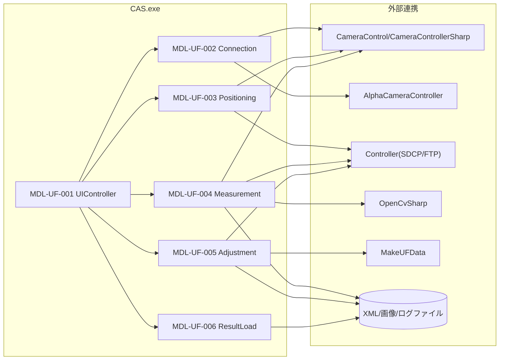

## 2. モジュール配置図（モジュールの物理配置設計）

### 2-1. 物理配置図

### 2-2. 配置一覧

| 配置区分 | 配置先パス/ノード | 配置モジュール | 配置理由 |
|----------|-------------------|----------------|----------|
| 実行モジュール | CAS/Functions/UfCamera.cs | MDL-UF-001〜006 | U/F計測・調整機能が単一機能ファイルに集約されているため |
| 外部カメラ連携 | CameraControl.dll | Connection/Positioning/Measurement | 接続、AF、撮影、ライブビューのため |
| 外部カメラ実行 | Components/AlphaCameraController.exe | Connection/Measurement | CamCont.xml を介した撮影制御のため |
| 外部補正計算 | MakeUFData | Adjustment | FMT抽出、XYZ変換、統計、補正ファイル生成のため |
| 外部制御連携 | Controller (SDCP/FTP) | Positioning/Measurement/Adjustment | ThroughMode、パターン表示、電源制御、調整データ反映のため |
| ファイル永続化 | 測定フォルダ/ログフォルダ | Measurement/Adjustment/ResultLoad | 計測結果、調整結果、画像、ログの保存/読込のため |

---

