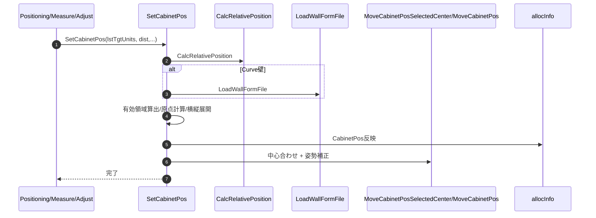
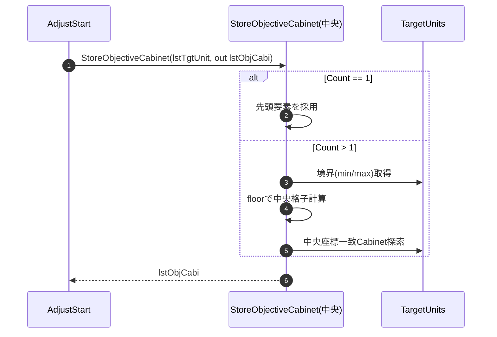
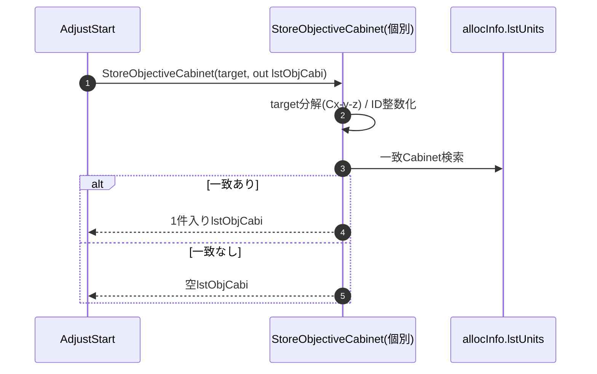
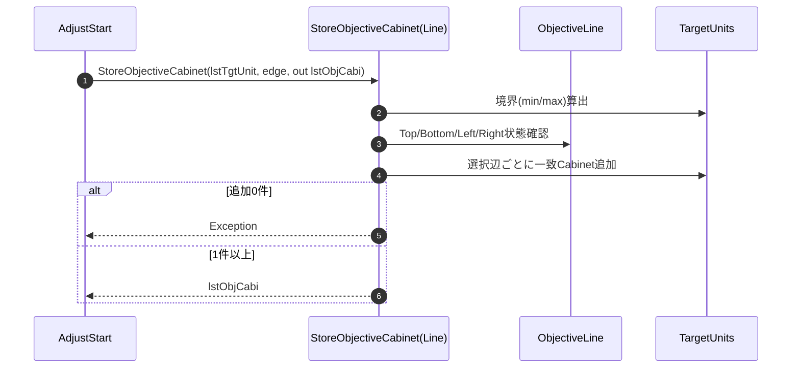
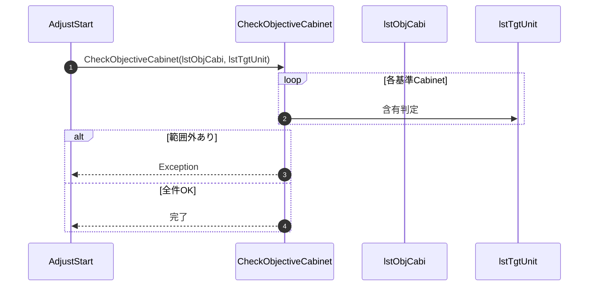
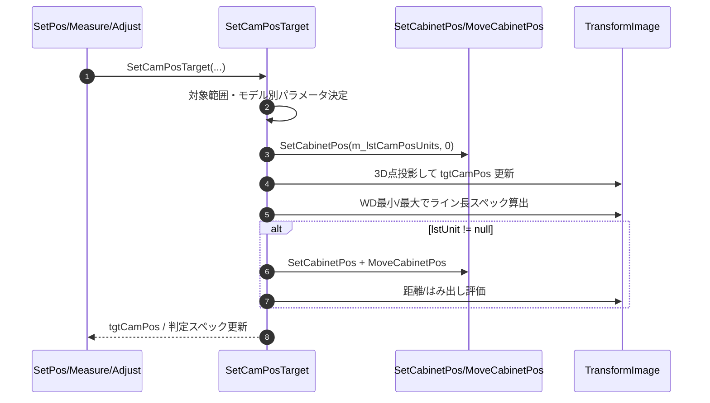
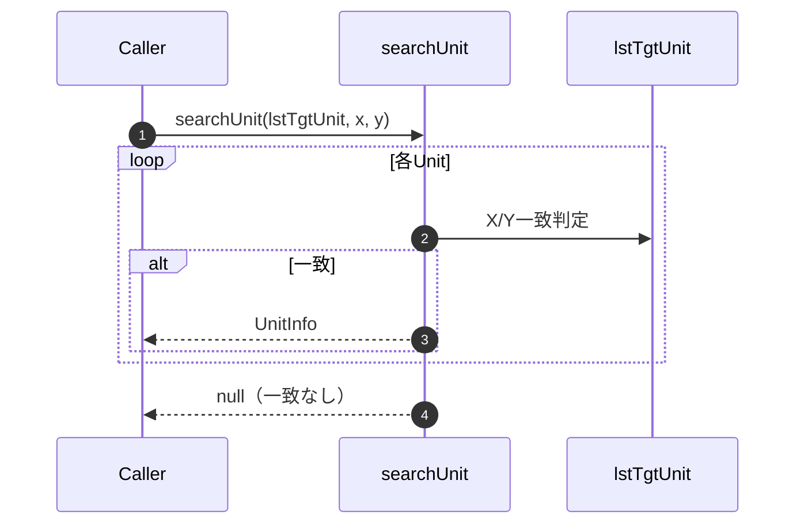

### 8-3. 設定・データ書込みメソッド

#### 8-3-1. SetCabinetPos

| 項目 | 内容 |
|------|------|
| シグネチャ | private void SetCabinetPos(List<UnitInfo> lstTgtUnits, double dist) / private void SetCabinetPos(List<UnitInfo> lstTgtUnits, double dist, double wallH, double camH) |
| 概要 | 撮影距離・壁条件・壁形状（Flat/Curve）を基に、全Cabinetの3D座標（BottomLeft/TopLeft/BottomRight）を再構築し、最後に選択範囲中心と相対姿勢を補正して配置する。 |

引数

| No. | 引数名 | 型 | 必須 | 説明 |
|-----|--------|----|------|------|
| 1 | lstTgtUnits | List<UnitInfo> | Y | 調整対象Cabinet一覧（中心合わせ対象） |
| 2 | dist | double | Y | 壁面からカメラまでの距離[mm] |
| 3 | wallH | double | N | Wall下端高さ[mm]（NaN時は中央基準） |
| 4 | camH | double | N | カメラ中心高さ[mm]（NaN時は中央基準） |

返り値: なし（void）

オーバーロード動作

| 入口メソッド | 動作 |
|--------------|------|
| `SetCabinetPos(lstTgtUnits, dist)` | `wallH/camH` に `double.NaN` を渡して4引数版へ委譲する。 |
| `SetCabinetPos(lstTgtUnits, dist, wallH, camH)` | 実際の座標計算・反映・最終移動を実行する。 |

処理概要（詳細）

| 手順No. | 処理内容 | 詳細 |
|---------|----------|------|
| 1 | 相対位置計算 | `CalcRelativePosition` で `pan/tilt/x/y` を算出する（`wallH/camH` が NaN の場合は `tilt=0, y=0`）。 |
| 2 | Curve形状ロード | `rbConfigWallFormCurve.IsChecked == true` の場合のみ `LoadWallFormFile(out rotateAngle)` を実行し、列間回転角列を取得する。 |
| 3 | 有効領域算出 | `allocInfo.lstUnits` を走査して Blank を除いた実有効サイズ `actMaxX/actMaxY` を決定する。 |
| 4 | 作業配列初期化 | `CabinetCoordinate[actMaxX][actMaxY]` を生成し、Blankや離れ小島の影響を避けて座標を計算する。 |
| 5 | 原点Cabinet展開 | 左下Cabinetの `BottomLeft=(0,0,dist)` を基準に `TopLeft/BottomRight` を設定する。 |
| 6 | 最下段を横展開 | 列方向へ `dx = cabinetSizeH*cos(deg)`, `dz = cabinetSizeH*sin(deg)` で順次展開し、Curve時は `deg -= rotateAngle[idx]` で累積回転する。 |
| 7 | 上段へ縦展開 | 下段座標を基準に `cabinetSizeV` だけYを加算し、各段の `BottomLeft/TopLeft/BottomRight` を作る。 |
| 8 | allocInfo反映 | 非null Cabinet を左から詰める `curX/curY` で `tempCabiPos` から `allocInfo.lstUnits[cx][cy].CabinetPos` へコピーする。 |
| 9 | 中心・姿勢補正 | `MoveCabinetPosSelectedCenter(lstTgtUnits, dist)` で中心を光学中心へ合わせ、続けて `MoveCabinetPos(pan, -tilt, 0, x, y, 0)` を適用する。 |

入力条件・前提条件

| 区分 | 条件 | NG時挙動 |
|------|------|----------|
| alloc情報 | `allocInfo.MaxX/MaxY` と `allocInfo.lstUnits` が初期化済みであること | Null参照/配列参照例外で中断 |
| サイズ定義 | `cabinetSizeH`, `cabinetSizeV` が有効値であること | 座標計算が不正化 |
| Curve時入力 | `Settings.Ins.WallFormFile` が有効で、選択プロファイル幅と回転角件数が一致すること | `Failed to load wall form file...` 例外を送出 |
| 対象一覧 | `lstTgtUnits` が空でないこと | 中心合わせ処理で異常となる可能性 |

条件分岐仕様

| 条件 | 挙動 |
|------|------|
| `wallH` または `camH` が NaN | 相対位置は中央基準（`tilt=0`,`y=0`）で処理する。 |
| `rbConfigWallFormCurve.IsChecked == true` | 壁形状ファイルを読込み、列間回転角を使ってRound配置で展開する。 |
| `rbConfigWallFormCurve.IsChecked != true` | Flat配置（`deg`固定）で展開する。 |
| `allocInfo.lstUnits[cx][cy] == null` | そのセルは反映対象外としてスキップする。 |

主要呼出し先

| 呼出し先 | 役割 | 同期/非同期 |
|----------|------|--------------|
| `CaptureImage(..., dist, wallH, camH)` | 撮影前にCabinet座標系を設定する呼出元 | 同期 |
| `calcMeasAreaPv` | 計測領域算出前にCabinet座標系を設定する呼出元 | 同期 |
| `CalcRelativePosition` | 撮影条件から `pan/tilt/x/y` を算出する | 同期 |
| `LoadWallFormFile` | Curve壁の列間回転角を読込む | 同期 |
| `MoveCabinetPosSelectedCenter` | 選択範囲中心を光学中心に合わせる | 同期 |
| `MoveCabinetPos` | 最終姿勢（主にTilt）と平行移動を反映する | 同期 |

例外時仕様

| ケース | 捕捉方法 | 通知/伝播 | 後処理 |
|--------|----------|-----------|--------|
| 壁形状ファイル読込失敗 | `LoadWallFormFile` 例外を `catch` | `Failed to load wall form file...` として再送出 | 呼出元で処理停止 |
| 曲率データ不整合 | 壁形状件数不一致などの下位例外 | 呼出元へ再送出 | 座標反映前に中断 |
| allocInfo参照異常 | Null/範囲外参照例外 | 呼出元へ再送出 | 座標更新は途中までの可能性 |

シーケンス図

#### 8-3-2. StoreObjectiveCabinet（中央選択）

| 項目 | 内容 |
|------|------|
| シグネチャ | private void StoreObjectiveCabinet(List<UnitInfo> lstTgtUnit, out List<UnitInfo> lstObjCabi) |
| 概要 | 調整対象Cabinet群から基準Cabinetを1台決定する。1台選択時はそのCabinet、複数選択時は外接矩形中心（切り捨て）の座標一致Cabinetを採用する。 |

引数

| No. | 引数名 | 型 | 必須 | 説明 |
|-----|--------|----|------|------|
| 1 | lstTgtUnit | List<UnitInfo> | Y | 調整対象Cabinet一覧 |
| 2 | lstObjCabi(out) | List<UnitInfo> | Y | 選定された基準Cabinet（1要素想定） |

返り値: なし（void）

処理概要（詳細）

| 手順No. | 処理内容 | 詳細 |
|---------|----------|------|
| 1 | 初期化 | `objCabi = null` を初期化する。 |
| 2 | 単一選択判定 | `lstTgtUnit.Count == 1` の場合、先頭要素を `objCabi` として採用する。 |
| 3 | 境界算出 | 複数選択時は `minX/minY/maxX/maxY` を走査で算出する。 |
| 4 | 中央格子算出 | `centerX=floor((maxX+minX)/2.0)`、`centerY=floor((maxY+minY)/2.0)` を計算し、負値は0へ丸める。 |
| 5 | 一致探索 | `X==centerX && Y==centerY` のCabinetを探索し、最初の一致要素を `objCabi` に設定して探索終了する。 |
| 6 | 出力格納 | `lstObjCabi` を新規生成し、`objCabi`（nullの可能性あり）を1要素追加する。 |

中央選定ロジック補足

| 条件 | 選定結果 |
|------|----------|
| 奇数x奇数の選択範囲 | 幾何学中心に一致するCabinetを選定する。 |
| 偶数を含む選択範囲 | `floor` により左上（第2象限）寄りの中央格子Cabinetを選定する。 |
| 中央格子にCabinetが存在しない | `objCabi` は `null` のままとなる。 |

入力条件・前提条件

| 区分 | 条件 | NG時挙動 |
|------|------|----------|
| 入力リスト | `lstTgtUnit` が null でないこと | null時は下位例外で中断 |
| 要素内容 | 各要素の `X/Y` が有効な格子座標であること | 中央計算・一致判定が不正化 |
| 呼出順 | 基準Cabinet決定が必要な調整開始フローから呼び出されること | 期待しない基準点選定 |

条件分岐仕様

| 条件 | 挙動 |
|------|------|
| `lstTgtUnit.Count == 1` | その1台を基準Cabinetとして採用する。 |
| `lstTgtUnit.Count > 1` | 外接矩形中心（切り捨て）と一致するCabinetを採用する。 |
| 一致Cabinetなし | `lstObjCabi` に `null` が追加される。 |

主要呼出し先

| 呼出し先 | 役割 | 同期/非同期 |
|----------|------|--------------|
| `btnUfCamAdjStart_Click` | 基準Cabinet選択モードが中央選択のとき本メソッドを呼び出す | 同期 |
| `List<UnitInfo>` 走査 | 境界算出と中心一致Cabinet探索を行う | 同期 |
| `Math.Floor` | 中央格子座標を切り捨てで決定する | 同期 |

例外時仕様

| ケース | 捕捉方法 | 通知/伝播 | 後処理 |
|--------|----------|-----------|--------|
| `lstTgtUnit == null` | 下位処理例外 | 呼出元へ再送出 | 基準Cabinet未確定で中断 |
| 要素なし（`Count == 0`） | 実装上の分岐結果 | 例外なし（`null` を格納） | 後続処理側でnull検証が必要 |

シーケンス図

#### 8-3-3. StoreObjectiveCabinet（個別指定）

| 項目 | 内容 |
|------|------|
| シグネチャ | private void StoreObjectiveCabinet(string target, out List<UnitInfo> lstObjCabi) |
| 概要 | `target`（例: `C1-1-2`）を `ControllerID-PortNo-UnitNo` に分解し、`allocInfo.lstUnits` から一致するCabinetを1件検索して基準Cabinetに設定する。 |

引数

| No. | 引数名 | 型 | 必須 | 説明 |
|-----|--------|----|------|------|
| 1 | target | string | Y | 基準Cabinet指定文字列（`C<ControllerID>-<PortNo>-<UnitNo>`） |
| 2 | lstObjCabi(out) | List<UnitInfo> | Y | 検索結果の基準Cabinetリスト（0件または1件） |

返り値: なし（void）

処理概要（詳細）

| 手順No. | 処理内容 | 詳細 |
|---------|----------|------|
| 1 | 出力初期化 | `lstObjCabi = new List<UnitInfo>()` を生成する。 |
| 2 | 文字列分解 | `target.Split("-", RemoveEmptyEntries)` で3要素に分解する。 |
| 3 | 識別子変換 | `parts[0]` の `C` を除去して `contId` 化し、`parts[1]`,`parts[2]` を `portNo`,`unitNo` へ変換する。 |
| 4 | Cabinet走査 | `allocInfo.MaxY × allocInfo.MaxX` を行優先で走査し、nullを除外してID一致判定を行う。 |
| 5 | 一致時終了 | 一致Cabinetを `lstObjCabi` へ追加し即 `return` する。 |
| 6 | 不一致終了 | 一致が無い場合は空リストのまま終了する。 |

入力フォーマット仕様

| 項目 | 仕様 |
|------|------|
| 正常例 | `C1-1-2` |
| 分解規則 | `-` 区切り3要素（`C<id>`,`<port>`,`<unit>`） |
| ControllerID | 先頭要素の `C` を除去して数値化 |

入力条件・前提条件

| 区分 | 条件 | NG時挙動 |
|------|------|----------|
| target形式 | `C<id>-<port>-<unit>` 形式であること | 分解/変換で例外送出 |
| allocInfo | `allocInfo.lstUnits` と `MaxX/MaxY` が初期化済みであること | 下位例外で中断 |

条件分岐仕様

| 条件 | 挙動 |
|------|------|
| 一致Cabinetあり | 1件追加して即returnする。 |
| 一致Cabinetなし | 例外は出さず空リストで終了する。 |

主要呼出し先

| 呼出し先 | 役割 | 同期/非同期 |
|----------|------|--------------|
| `btnUfCamAdjStart_Click` | 基準Cabinet選択モードが個別指定のとき本メソッドを呼び出す | 同期 |
| `string.Split` | `Cx-y-z` 文字列を要素分解 | 同期 |
| `Convert.ToInt32` | ControllerID、PortNo、UnitNo を数値化 | 同期 |
| `allocInfo.lstUnits` 走査 | 一致Cabinetを検索 | 同期 |

例外時仕様

| ケース | 捕捉方法 | 通知/伝播 | 後処理 |
|--------|----------|-----------|--------|
| `target` 形式不正 | `Split` 結果不足 / `Convert.ToInt32` 例外 | 呼出元へ再送出 | 基準Cabinet未設定で中断 |
| allocInfo参照異常 | Null/範囲外参照例外 | 呼出元へ再送出 | 検索中断 |

シーケンス図

#### 8-3-4. StoreObjectiveCabinet（Line指定）

| 項目 | 内容 |
|------|------|
| シグネチャ | private void StoreObjectiveCabinet(List<UnitInfo> lstTgtUnit, ObjectiveLine edge, out List<UnitInfo> lstObjCabi) |
| 概要 | 調整対象範囲の外接矩形（min/max X,Y）を求め、`edge` で選択された Top/Bottom/Left/Right の各辺に一致するCabinet群を基準Cabinetとして追加する。 |

引数

| No. | 引数名 | 型 | 必須 | 説明 |
|-----|--------|----|------|------|
| 1 | lstTgtUnit | List<UnitInfo> | Y | 調整対象Cabinet一覧 |
| 2 | edge | ObjectiveLine | Y | 参照辺選択（Top/Bottom/Left/Right） |
| 3 | lstObjCabi(out) | List<UnitInfo> | Y | 選定された基準Cabinet群 |

返り値: なし（void）

処理概要（詳細）

| 手順No. | 処理内容 | 詳細 |
|---------|----------|------|
| 1 | 出力初期化 | `lstObjCabi = new List<UnitInfo>()` を生成する。 |
| 2 | 境界算出 | `lstTgtUnit` 走査で `minX/minY/maxX/maxY` を算出する。 |
| 3 | Top抽出 | `edge.Top == true` の場合、`Y == minY` のCabinetを追加する。 |
| 4 | Bottom抽出 | `edge.Bottom == true` の場合、`Y == maxY` のCabinetを追加する。 |
| 5 | Left抽出 | `edge.Left == true` の場合、`X == minX` のCabinetを追加する。 |
| 6 | Right抽出 | `edge.Right == true` の場合、`X == maxX` のCabinetを追加する。 |
| 7 | 0件判定 | 追加件数が0件の場合 `No reference line has been selected.` を送出する。 |

選定ロジック補足

| 項目 | 実装挙動 |
|------|----------|
| 重複排除 | 実装では重複排除しない。複数辺選択時、角Cabinetは複数回追加され得る。 |
| `lenX/lenY` | 内部で計算されるが現行実装では未使用。 |

入力条件・前提条件

| 区分 | 条件 | NG時挙動 |
|------|------|----------|
| 入力リスト | `lstTgtUnit` が null でないこと | null時は下位例外で中断 |
| 辺指定 | `edge` が null でないこと | null時は下位例外で中断 |
| 選択状態 | Top/Bottom/Left/Right のいずれかが true であること | 0件となり例外送出 |

条件分岐仕様

| 条件 | 挙動 |
|------|------|
| `edge.Top/Bottom/Left/Right` | true の辺のみ抽出処理を実行する。 |
| 複数辺が true | 辺ごとに順次追加する（角は重複する場合あり）。 |
| 追加結果0件 | 例外 `No reference line has been selected.` を送出する。 |

主要呼出し先

| 呼出し先 | 役割 | 同期/非同期 |
|----------|------|--------------|
| `btnUfCamAdjStart_Click` | 基準Cabinet選択モードがLine指定のとき本メソッドを呼び出す | 同期 |
| `ObjectiveLine` 状態参照 | Top/Bottom/Left/Right 指定状態を判定 | 同期 |
| 端座標算出処理 | 指定辺の最小/最大 X,Y を算出 | 同期 |
| `List<UnitInfo>` フィルタリング | 端座標に一致する Cabinet 群を抽出 | 同期 |

例外時仕様

| ケース | 捕捉方法 | 通知/伝播 | 後処理 |
|--------|----------|-----------|--------|
| 辺未選択/抽出0件 | `lstObjCabi.Count <= 0` 判定 | 例外送出 | 基準Cabinet未設定で中断 |
| `edge == null` | `edge.Top` 参照時の下位例外 | 呼出元へ再送出 | 抽出中断 |
| `lstTgtUnit == null` | 走査時の下位例外 | 呼出元へ再送出 | 抽出中断 |

シーケンス図

#### 8-3-5. CheckObjectiveCabinet

| 項目 | 内容 |
|------|------|
| シグネチャ | private void CheckObjectiveCabinet(List<UnitInfo> lstObjCabi, List<UnitInfo> lstTgtUnit) |
| 概要 | 基準Cabinetが調整対象Cabinetに含まれていることを検証する |

引数: lstObjCabi, lstTgtUnit
返り値: なし（void）

処理概要（詳細）

| 手順No. | 処理内容 | 詳細 |
|---------|----------|------|
| 1 | 対象展開 | lstObjCabi を順次走査する。 |
| 2 | 所属判定 | 各基準Cabinetが lstTgtUnit 内に存在するか比較する。 |
| 3 | 不整合検出 | 非包含Cabinetを検出した場合はエラー情報を生成する。 |
| 4 | 例外送出 | 不整合ありの場合は Exception を送出する。 |

例外時仕様: 範囲外の基準Cabinetが含まれる場合は Exception を送出する。

入力条件・前提条件

| 区分 | 条件 | NG時挙動 |
|------|------|----------|
| 実行前提 | 本節の処理概要に記載した前段処理が完了していること | 例外通知して処理中断 |
| 入力値 | 引数/内部状態が有効範囲であること | 例外通知して処理中断 |

条件分岐仕様

| 条件 | 挙動 |
|------|------|
| 正常系 | 処理概要（詳細）の手順に従って処理を継続する。 |
| 異常系 | 例外時仕様に従って通知または中断する。 |

主要呼出し先

| 呼出し先 | 役割 | 同期/非同期 |
|----------|------|--------------|
| `lstObjCabi` 走査 | 基準Cabinet を順次展開 | 同期 |
| `lstTgtUnit` 含有判定 | 調整対象範囲への所属を確認 | 同期 |
| `Exception` 送出 | 範囲外Cabinet検出時の異常通知 | 同期 |

シーケンス図

#### 8-3-6. SetCamPosTarget

| 項目 | 内容 |
|------|------|
| シグネチャ | `void SetCamPosTarget(ImageType_CamPos imageType = ImageType_CamPos.LiveView, bool log = false, List<UnitInfo> lstUnit = null, double zDistanceSpec = 0)` |
| 概要 | 位置合わせ判定で使用する目標投影枠、許容撮像領域、線長スペック、距離・はみ出し判定値を計算し、`tgtCamPos` 系の内部状態を更新する。 |

引数

| No. | 引数名 | 型 | 必須 | 説明 |
|-----|--------|----|------|------|
| 1 | imageType | ImageType_CamPos | N | 目標算出時に使用する画像種別（既定: LiveView） |
| 2 | log | bool | N | 実行ログ出力有無（既定: false） |
| 3 | lstUnit | List<UnitInfo> | N | 目標算出対象のCabinet群（未指定時は内部保持値を使用） |
| 4 | zDistanceSpec | double | N | Z距離判定用スペック値（既定: 0） |

返り値: なし（void）

更新される主要内部状態

| 状態名 | 内容 |
|--------|------|
| `m_ImageType_CamPos` | 目標計算に使用する画像種別を保持 |
| `tgtCamPos` | 目標4頂点の画像座標（TopLeft/TopRight/BottomRight/BottomLeft） |
| `tgtCamPos_canUse` | 撮像素子内の使用可能領域（四辺3%内側） |
| `tgtCamPos_HorLineSpec` / `tgtCamPos_VerLineSpec` | WD最小/最大時の上下・左右辺長スペック |
| `m_PreventionHanting` | 目標投影面積が小さい場合のハンチング抑止フラグ |
| `m_CameraParam` | 焦点距離・センサーサイズ・解像度パラメータ |

処理概要（詳細）

| 手順No. | 処理内容 | 詳細 |
|---------|----------|------|
| 1 | 初期化 | `tgtCamPos` 系を生成し、対象Cabinet未設定時は `tgtCamPos = null` で終了する。 |
| 2 | 対象矩形算出 | `m_lstCamPosUnits` から `startX/endX/startY/endY` を算出し、対象Cabinet数 `m_CabinetXNum_CamPos`,`m_CabinetYNum_CamPos` を確定する。 |
| 3 | モデル別寸法設定 | LEDモデル判定で P1.2/P1.5 と Module 4x2/4x3 の寸法定数（`m_CabinetDx/Dy`,`m_ModuleDx/Dy`）を設定する。対象外モデルは return。 |
| 4 | カメラ解像度設定 | `imageType` により `m_CameraParam` を LiveView(1024x680) / JPEG(3008x2000) へ切替える。 |
| 5 | 使用可能領域設定 | `canNotUseArea = 0.03` として `notUse = round(SensorResH * 0.03)` を計算し、`tgtCamPos_canUse` を4辺内側に設定する。 |
| 6 | 壁・高さ条件計算 | `SetCabinetPos(m_lstCamPosUnits, 0)` 後、対象Wallサイズ/オフセットと `m_WorkDistance` を算出し、既定/ユーザー指定に応じて `CameraPosHeight` を決定する。 |
| 7 | 投影目標算出 | 代表4点の3D座標を設定し、`tiltAngle = atan((TargetWallCenterHeight - CameraPosHeight) / transZ)` から回転を設定して投影計算し、`tgtCamPos` を更新する。 |
| 8 | ハンチング抑止判定 | `縦比=(BottomLeft.Y-TopLeft.Y)/SensorResV` と `横比=(TopRight.X-TopLeft.X)/SensorResH` のいずれかが 0.3 未満なら `m_PreventionHanting = true` とする。 |
| 9 | ライン長スペック算出 | `CamPos_SizeMin/CamPos_SizeMax` に基づく WD 変化で再投影し、上下・左右辺長を `tgtCamPos_HorLineSpec`,`tgtCamPos_VerLineSpec` へ格納する。 |
| 10 | 距離/範囲検証 | `lstUnit != null` の場合、`longestZ`,`shortestZ`,`imageX/Y min/max` を算出し、遠すぎ・近すぎ・撮像範囲外を判定して例外送出する。 |

入力条件・前提条件

| 区分 | 条件 | NG時挙動 |
|------|------|----------|
| 実行前提 | 位置合わせ対象Cabinet（`m_lstCamPosUnits`）が1件以上設定済みであること | 対象なし時は `tgtCamPos = null` で終了 |
| モデル情報 | `allocInfo.LEDModel` がサポート対象モデルであること | 対象外モデルは処理を打ち切る |
| UI設定値 | 撮影距離・壁高さ・カメラ高さの入力値が数値変換可能であること | 変換失敗時は例外で上位へ伝播 |
| 判定対象 | `lstUnit` を指定する場合、判定対象Cabinetの座標が有効であること | 距離/範囲判定で例外送出 |

条件分岐仕様

| 条件 | 挙動 |
|------|------|
| `m_lstCamPosUnits.Count <= 0` | 目標姿勢を未設定として即時終了する。 |
| LiveView/JPEG | センサ解像度（1024x680 / 3008x2000）を切替える。 |
| カメラ位置既定/ユーザー指定 | 壁高・カメラ高の適用元を切替える。 |
| LEDモデル種別 | P1.2/P1.5、4x2/4x3 構成の寸法定数を切替える。 |
| `lstUnit == null` | 距離/はみ出しの最終検証をスキップする。 |
| `zDistanceSpec == 0` | 遠すぎ判定（`longestZ > zDistanceSpec`）をスキップする。 |
| 投影比 < 0.3 | `m_PreventionHanting = true` を設定する。 |

主要呼出し先

| 呼出し先 | 役割 | 同期/非同期 |
|----------|------|--------------|
| `tbtnUfCamSetPos_Click` | 位置合わせ開始時の目標再算出 | 同期 |
| `MeasureUfAsync` | 測定前の目標再算出 | 同期 |
| `AdjustUfCamAsync` | 調整前の目標再算出 | 同期 |
| `SetCabinetPos` | Cabinet空間座標系の再計算 | 同期 |
| `MoveCabinetPos` | あおり反映後のZ距離評価座標へ変換 | 同期 |
| `TransformImage.TransformImage.Calc` | 3D点の画像投影を計算 | 同期 |

例外時仕様

| ケース | 捕捉方法 | 通知/伝播 | 後処理 |
|--------|----------|-----------|--------|
| 撮影距離/高さの数値変換失敗 | 下位例外 | 呼出元へ送出 | 位置合わせ開始を中断 |
| サポート外LEDモデル | モデル判定 | 例外なしで処理打切り | 目標更新なし |
| 対象Cabinet未設定 | 件数判定 | 例外なし | `tgtCamPos` を null 設定 |
| Z距離が遠すぎる | `longestZ > zDistanceSpec` 判定 | 例外送出 | 位置合わせ開始を中断 |
| Z距離が近すぎる | `shortestZ < m_WorkDistance * 0.86` 判定 | 例外送出 | 位置合わせ開始を中断 |
| 撮像範囲外 | `imageX/Y min/max` と `tgtCamPos_canUse` 比較 | 例外送出 | 位置合わせ開始を中断 |

シーケンス図

#### 8-3-7. searchUnit

| 項目 | 内容 |
|------|------|
| シグネチャ | `private UnitInfo searchUnit(List<UnitInfo> lstTgtUnit, int x, int y)` |
| 概要 | 対象Cabinet一覧から、指定座標（X,Y）に一致するUnitInfoを検索して返す。 |

引数

| No. | 引数名 | 型 | 必須 | 説明 |
|-----|--------|----|------|------|
| 1 | lstTgtUnit | List<UnitInfo> | Y | 検索対象Cabinet一覧 |
| 2 | x | int | Y | 検索対象X座標（1基数） |
| 3 | y | int | Y | 検索対象Y座標（1基数） |

返り値: UnitInfo（未検出時は null）

処理概要（詳細）

| 手順No. | 処理内容 | 詳細 |
|---------|----------|------|
| 1 | 初期化 | 戻り値用の `tgtUnit` を null で初期化する。 |
| 2 | 線形検索 | `lstTgtUnit` を先頭から走査し、`unit.X == x && unit.Y == y` を満たす要素を探索する。 |
| 3 | 結果確定 | 一致要素を検出した時点で `tgtUnit` に格納し、ループを終了する。 |
| 4 | 返却 | 一致要素があればその UnitInfo、なければ null を返す。 |

入力条件・前提条件

| 区分 | 条件 | NG時挙動 |
|------|------|----------|
| 実行前提 | `lstTgtUnit` が null でないこと | null時は下位例外の可能性 |
| 入力値 | `x`,`y` が対象座標系（1基数）に整合すること | 未検出（null返却） |

条件分岐仕様

| 条件 | 挙動 |
|------|------|
| 一致要素あり | 一致した最初の要素を返す（早期終了）。 |
| 一致要素なし | null を返す。 |

主要呼出し先

| 呼出し先 | 役割 | 同期/非同期 |
|----------|------|--------------|
| `SetCamPosTarget` 内の目標算出処理 | 目標Cabinet探索 | 同期 |
| `GetTiltAngle` | 指定Cabinet中心のTilt角取得前のCabinet解決 | 同期 |
| U/F補正点関連処理 | 座標→Cabinet解決 | 同期 |

例外時仕様

| ケース | 捕捉方法 | 通知/伝播 | 後処理 |
|--------|----------|-----------|--------|
| `lstTgtUnit` が null | 下位例外 | 呼出元へ送出 | 当該処理中断 |
| 座標不一致 | 一致要素なし判定 | 例外なし（null返却） | 呼出元でnull評価 |

シーケンス図

