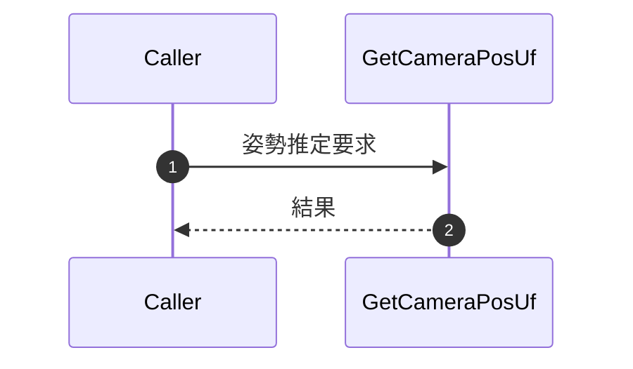
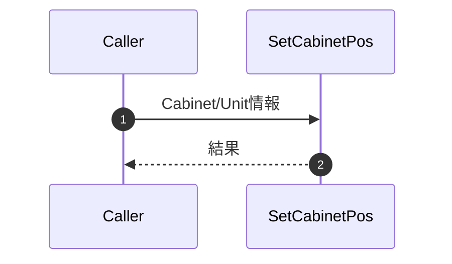
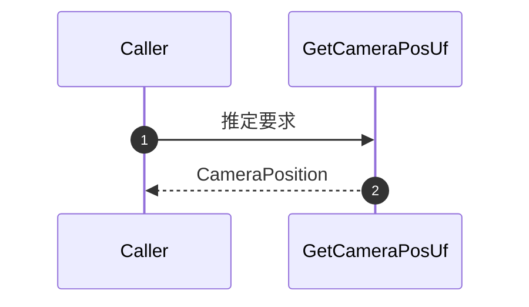
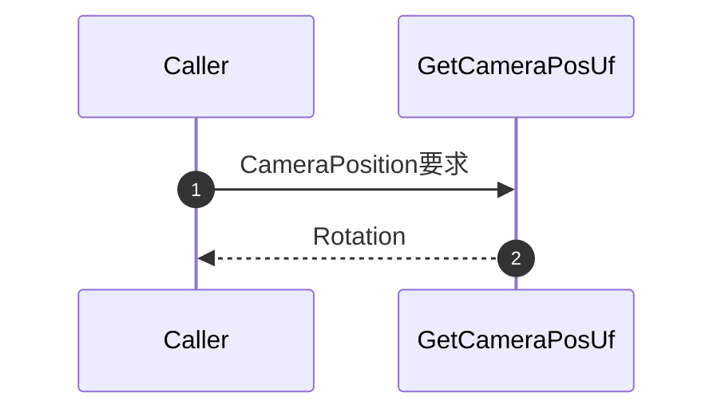


### 8-6. EstimateCameraPos連携メンバ

本章はGapCamera_詳細設計書 8-6と章立て・節建・粒度を合わせた連携仕様です。
UfCameraでは推定処理を主に `GetCameraPosUf` / `CheckCameraPos` 側で実装しており、各連携点の詳細を標準化フォーマットで整理します。

---

#### 8-6-1. CameraParameter.Set

| 項目 | 内容 |
|------|------|
| シグネチャ | CameraParameter.Set (GapCamera連携) |
| 概要 | カメラ内部/外部パラメータ設定に相当する連携点。UfCameraでは姿勢推定前提として内部で吸収。 |
| Uf側対応 | `8-5-3-3 GetCameraPosUf` |

**引数・返り値・処理詳細**

| 引数 | なし（内部状態で吸収） |
| 返り値 | なし |
| 主処理 | 推定前提パラメータを内部でセット |

**主要呼出し先**: なし

**シーケンス図**

---

#### 8-6-2. ImagePoints

| 項目 | 内容 |
|------|------|
| シグネチャ | ImagePoints (GapCamera連携) |
| 概要 | 画像上特徴点集合の連携点。UfCameraではBlob検出結果を入力として扱う。 |
| Uf側対応 | `8-5-3-3 GetCameraPosUf`（`CvBlob[,] aryBlob`） |

**引数・返り値・処理詳細**

| 引数 | CvBlob[,] aryBlob |
| 返り値 | なし |
| 主処理 | Blob検出結果を推定処理へ受け渡し |

**主要呼出し先**: なし

**シーケンス図**

---

#### 8-6-3. ObjectPoints

| 項目 | 内容 |
|------|------|
| シグネチャ | ObjectPoints (GapCamera連携) |
| 概要 | 物体座標系の基準点集合連携。UfCameraではCabinet/Unit幾何情報から間接的に供給。 |
| Uf側対応 | `8-3-1 SetCabinetPos`、`8-3-6 SetCamPosTarget` |

**引数・返り値・処理詳細**

| 引数 | Cabinet/Unit情報 |
| 返り値 | なし |
| 主処理 | Cabinet/Unit幾何情報を推定処理へ供給 |

**主要呼出し先**: なし

**シーケンス図**

---

#### 8-6-4. Estimate

| 項目 | 内容 |
|------|------|
| シグネチャ | Estimate (GapCamera連携) |
| 概要 | 姿勢推定実行の連携点。UfCameraでは位置推定処理を`GetCameraPosUf`に集約。 |
| Uf側対応 | `8-5-3-3 GetCameraPosUf` |

**引数・返り値・処理詳細**

| 引数 | 画像特徴点・物体基準点 |
| 返り値 | CameraPosition |
| 主処理 | 位置・姿勢推定を実行し結果を返却 |

**主要呼出し先**: なし

**シーケンス図**

---

#### 8-6-5. Rot

| 項目 | 内容 |
|------|------|
| シグネチャ | Rot (GapCamera連携) |
| 概要 | 推定回転成分（Rotation）の受渡し連携点。 |
| Uf側対応 | `8-5-3-3 GetCameraPosUf` の `CameraPosition` 内回転成分 |

**引数・返り値・処理詳細**

| 引数 | なし |
| 返り値 | 回転成分（Rotation） |
| 主処理 | CameraPositionから回転成分を取得し返却 |

**主要呼出し先**: なし

**シーケンス図**

---

#### 8-6-6. Trans

| 項目 | 内容 |
|------|------|
| シグネチャ | Trans (GapCamera連携) |
| 概要 | 推定並進成分（Translation）の受渡し連携点。 |
| Uf側対応 | `8-5-3-3 GetCameraPosUf` の `CameraPosition` 内並進成分 |

**引数・返り値・処理詳細**

| 引数 | なし |
| 返り値 | 並進成分（Translation） |
| 主処理 | CameraPositionから並進成分を取得し返却 |

**主要呼出し先**: なし

**シーケンス図**

---

