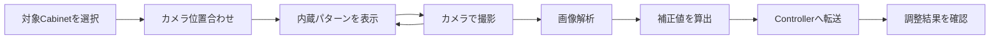
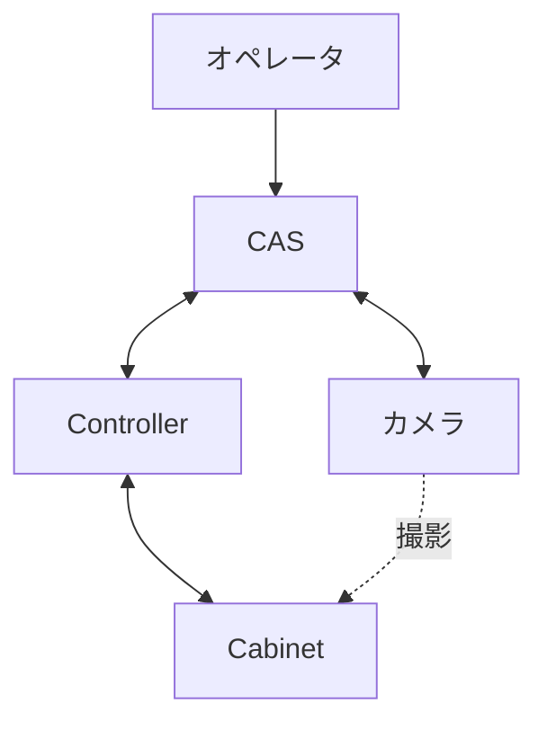

# カメラCAS 要件定義書

| 項目 | 内容 |
|------|------|
| カメラCAS | カメラを使って、LDSのU/F調整、目地補正を行う |
| 作成日 | 2026/4/14 |
| 作成者 | SGMO PTC 生産技術1部 技術2課 堀田 |
| バージョン | 0.1 |

---

## 1. ビジネス要件

### 1-1. To-Be業務プロセス概要

複数のCabinetを組み合わせたLDSでは、
・Cabinetの発光強度のバラツキを均一にするU/F調整
・Cabinet/Module間の距離によって見える明線/暗線を信号処理で見えなくする目地補正
といった作業が必要である。
LDSは、数十台以上の大量のCabinetで構成され、サイズも大型であるため、人による目視作業でこれらの作業を行うのは負担が大きく、時間もかかる。
そこで、Cabinetをカメラで撮影し、画像解析でU/F調整及び目地補正を自動処理するシステムを導入し、短時間で品質の良い作業結果を提供する。

---

### 1-2. 業務内容、業務特性（ルール、制約）

| 業務名 | 業務内容 | ルール・制約 |
|--------|----------|-------------|
| U/F調整 |Cabinet/Moduleの発光強度を均一に調整する |  |
| 目地補正 |Cabinet/Module間の距離のバラツキによる明線/暗線を見えないように補正する |  |

---

### 1-3. 組織構成、要員、設備

#### 組織構成

省略

#### 要員スキル・規模

省略

#### 必要設備

・PC（Windows）
・カメラ ILCE-6400（α6400）
・レンズ SELP16502
・USBケーブル（USB Type-A - マイクロUSB Type-B）
・三脚

---

### 1-4. 業務KPIとその目標値

| KPI | 現状値 | 目標値 | 達成期限 |
|-----|--------|--------|---------|
| U/F調整 |  | Module間輝度差 ≦ ±1.7％ |  |
| 目地補正 |  | Module間目地輝度比 ≦ ±1.5％ |  |
---

### 1-5. 概要業務フロー

---

### 1-6. システム化の対象となる業務

| 対象業務 | 実現手段 | 備考 |
|----------|----------|------|
| U/F調整 | 内蔵パターンを表示したCabinetをカメラで撮影し、Module間の明るさが均一になるU/F調整値を自動算出し、Controllerに転送する |  |
| 目地補正 | 内蔵パターンを表示したCabinetをカメラで撮影し、Module間の目地輝度比がゼロになる目地補正値を自動算出し、Controllerに転送する | 目地輝度比：隣り合うModule端の明るさ比。ゼロになると、目地（明線及び暗線）が見えない |

---

### 1-7. ビジネス制約

| 制約種別 | 内容 |
|----------|------|
| スケジュール |  |
| コスト | カメラ及びレンズの価格 ≦ 200,000円 |
| その他 | 暗環境でなくても使用できること U/F調整は1回あたり最大8K4Kサイズを調整できること 目地補正は1回あたり最大4K2Kサイズを補正できること |

---

### 1-8. その他の業務要件

---

## 2. システム要件（機能要件）

### 2-1. システム全体像

プロジェクトが対象とするシステムの全体概要図を記載します。

| 構成要素 | 役割 |
|----------|------|
| オペレータ | 測定開始、結果確認、再調整判断を行う |
| CASアプリケーション | 内蔵パターン表示の指示、画像取得、画像解析、補正値算出及びController転送を行う |
| カメラ | Cabinetを撮影する |
| Controller | 内蔵パターンの表示、補正値の受信及びCabinetへ反映する |
| Cabinet | 調整対象の表示装置 |

---

### 2-2. システム化対象領域（適用範囲）と影響範囲

#### 適用範囲

本システムの適用範囲は、LDSの画質調整作業のうち、U/F調整と目地補正とする。

具体的には以下を対象とする。

| 対象領域 | 内容 |
|----------|------|
| 測定準備 | オペレータによるカメラ設置 |
| パターン表示 | Controllerを介したCabinetの内蔵パターン表示 |
| 画像取得 | カメラによるCabinet撮影、CASへの画像取り込み |
| 画像解析 | 取得画像からのCabinet/Module単位の明るさの取得、Module間目地輝度比の取得 |
| 補正値算出 | U/F調整値および目地補正値の自動算出 |
| 補正値反映 | 算出データのController転送 |
| 結果確認 | 調整結果の表示、オペレータによる確認と再実行判断 |

一方で、以下は本システムの適用範囲外とする。

| 対象外領域 | 内容 |
|------------|------|
| 最終品質判定 | 顧客引き渡しの最終判定業務 |

#### 影響を受ける周辺システム

| システム名 | 影響内容 |
|-----------|---------|
| Controller | CASからの内蔵パターン表示指示、補正値受信、Cabinetへの補正値反映に対応する必要がある。通信仕様、応答タイミング、設定値の整合確認が必要となる。 |
| Cabinet | CASによる調整処理の対象となる。表示パターンの切替、補正値反映後の表示結果が測定品質に影響するため、表示状態の安定性が求められる。 |
| カメラ制御ソフトウェア／ドライバ | CASからの撮影制御、画像取得に使用するため、対応機種、接続方式、画像取得条件の整合確認が必要となる。 |
| オペレータ作業手順 | 測定準備、カメラ位置合わせ、結果確認、再調整判断の手順がCAS導入後の運用に合わせて変更される。 |

---

### 2-3. ソリューション方針

本システムは、Windows PC 上で動作する CAS アプリケーションを中心に、カメラ、Controller、Cabinet と連携して調整作業を実施する構成とする。

ソリューション方針は以下の通りとする。

| 方針分類 | 内容 |
|----------|------|
| システム構成方針 | カメラによる撮影、画像解析、補正値算出、Controller連携をCASに集約し、オペレータは単一のアプリケーション画面から操作できる構成とする。 |
| 画像解析方針 | LDSを撮影した画像からCabinet/Module単位の明るさ、目地輝度比を算出し、U/F調整および目地補正に必要な補正値を自動生成する。 |
| 連携方針 | Controllerとは内蔵パターン表示指示及び補正値送信を行う。通信異常時にはオペレータへエラーを通知する。 |
| 操作方針 | 測定開始、撮影、画像解析、補正値転送、結果確認までを一連の操作フローとして提供し、オペレータの手作業判断を最小化する。 |
| 品質確保方針 | カメラ位置、撮影条件、表示パターンを標準化し、同一条件で再現性のある測定結果を取得できるようにする。 |
| 保守・拡張方針 | 将来的なカメラ機種変更、補正アルゴリズム追加、調整対象モデル追加に対応しやすいよう、撮影制御、画像解析、Controller通信を機能単位で分離した構成とする。 |

また、本システムは人による目視調整を完全に置き換えることではなく、調整作業の時間短縮、品質安定化、作業者依存の低減を主目的とする。

---

### 2-4. システム機能要件

| No. | 機能名 | 機能概要 | 優先度 |
|-----|--------|----------|--------|
| 2-4-01 | 測定条件設定機能 | 測定対象、補正種別、撮影条件、保存先などの実行条件を設定できること。 | 高 |
| 2-4-02 | カメラ接続・制御機能 | カメラとの接続確認、撮影実行、必要に応じた撮影条件設定ができること。 | 高 |
| 2-4-03 | 内蔵パターン表示指示機能 | Controllerに対してCabinetの内蔵パターン表示を指示できること。 | 高 |
| 2-4-04 | 画像取得機能 | Cabinetを撮影した画像をCASへ取り込み、解析対象データとして保存できること。 | 高 |
| 2-4-05 | Module明るさ 解析機能 | 取得画像からModule単位の明るさを算出できること。 | 高 |
| 2-4-06 | Module間目地輝度比 解析機能 | 取得画像からModule間の目地輝度比を算出できること。 | 高 |
| 2-4-07 | U/F調整値算出機能 | 明るさの解析結果に基づき、目標範囲に収まるU/F調整値を自動算出できること。 | 高 |
| 2-4-08 | 目地補正値算出機能 | 目地輝度比の解析結果に基づき、目地輝度差を低減する目地補正値を自動算出できること。 | 高 |
| 2-4-09 | 補正値転送機能 | 算出した補正値をControllerへ送信できること。 | 高 |
| 2-4-10 | 調整結果表示機能 | 調整後の状態をオペレータが確認できる画面を提供すること。 | 高 |
| 2-4-11 | 実行履歴保存機能 | 測定日時、対象情報、解析結果、補正値、実行結果を履歴として保存できること。 | 中 |
| 2-4-12 | エラー通知機能 | カメラ接続異常、通信異常、解析失敗などを検知し、オペレータへ通知できること。 | 高 |
| 2-4-13 | 再実行支援機能 | 条件変更後に再撮影、再解析、再転送を実行できること。 | 中 |
| 2-4-14 | ログ出力機能 | 操作ログ、通信ログ、エラーログを出力できること。 | 中 |

---

### 2-5. データ要件

| データ名 | 主要項目 | 関連データ | 備考 |
|----------|----------|-----------|------|
| 測定条件データ | 測定日時、対象機種、対象Cabinet/Module、補正種別、撮影条件、判定閾値 | 撮影画像データ、解析結果データ、実行履歴データ | 測定実行時の基準条件として使用する。 |
| 撮影画像データ | 画像ファイル名、撮影日時、画像サイズ、露光条件、対象情報 | 測定条件データ、解析結果データ | 画像解析の入力データとして保持する。 |
| U/F解析結果データ | Cabinet/Module識別子、明るさ値 | 撮影画像データ、U/F調整値データ | U/F調整値算出の元データとする。 |
| 目地輝度比解析結果データ | Cabinet/Module間識別子、目地輝度比 | 撮影画像データ、目地補正値データ | 目地補正値算出の元データとする。 |
| U/F調整値データ | Cabinet/Module識別子、調整前値、調整後値、 | 明るさ解析結果データ、実行履歴データ | Controllerへの転送対象データとする。 |
| 目地補正値データ | Cabinet/Module間識別子、補正値 | 目地輝度比解析結果データ、実行履歴データ | Controllerへの転送対象データとする。 |
| 実行履歴データ | 実行日時、対象情報、実行機能、実行結果 | 測定条件データ、解析結果データ、ログデータ | トレーサビリティ確保、障害調査、運用保守のため保存する。 |

データの関係性は以下を基本とする。

1. 撮影条件データを基に撮影し、撮影画像データを生成する。
2. 撮影画像データを基に明るさ解析結果データ、目地輝度比解析結果データを生成する。
3. 解析結果データを基にU/F調整値データ、目地補正値データを生成する。
4. 各実行結果は実行履歴データに関連付けて管理する。

---

### 2-6. 関連システムインタフェース要件

| 連携先システム | インタフェース種別 | データ内容 | 頻度 |
|--------------|-----------------|-----------|------|
| カメラ | USB接続 | 撮影開始指示、撮影条件、取得画像データ | 測定実行時 |
| Controller | Ethernet | 内蔵パターン表示指示、U/F調整値、目地補正値 | 測定実行時 |
| PCストレージ | ファイルI/O | 撮影画像、解析結果、実行履歴 | 実行毎／必要時 |

インタフェース要件の詳細は以下の通りとする。

| 項目 | 要件 |
|------|------|
| カメラインタフェース | 指定機種のカメラと安定して接続でき、CASから撮影実行および画像取得ができること。 |
| Controllerインタフェース | CASから内蔵パターン表示指示および補正値転送ができ、Controllerから正常／異常の応答を取得できること。 |
| エラーハンドリング | 接続失敗、タイムアウト、データ不整合発生時はオペレータへ通知し、再実行可能であること。 |
| ログ記録 | インタフェース処理の実行日時、送受信内容、結果、エラー内容を記録できること。 |

---

### 2-7. 要件定義不要機能

| 機能名 | 不要となる理由 |
|--------|--------------|
| 目視によるマニュアル調整機能 | カメラ撮影および画像解析により補正値を自動算出するため、手作業での値決定を要件対象外とする。 |
| ハードウェア診断・修理支援機能 | カメラ、Controller、Cabinetの故障診断・修理は保守業務であり、本システムの要件対象外とする。 |
| 出荷判定機能 | 本システムは調整支援を目的とし、製品の最終合否判定は別業務で実施するため対象外とする。 |

---

### 2-8. システム構築の制約

システム構築時に考慮しなければならない制約を記載します。

| 制約種別 | 内容 |
|----------|------|
| 対応OS制約 | CASはWindows環境で動作すること。 |
| 対応機器制約 | カメラは指定機種（ILCE-6400 α6400）および指定レンズ（SELP1650又はSELP16502）構成を前提とし、機種変更時は別途評価を実施すること。 |
| 設置制約 | カメラ位置は三脚を使って固定できること。カメラ位置が移動した場合は再調整を必須とすること。 |
| 通信制約 | CAS-Controller間の通信は規定通信プロトコルに従い、タイムアウトを実装すること。 |
| 実行時間制約 | 現行手作業より短時間で調整完了できることを前提に、カメラ位置の設定から補正値反映までの処理時間を管理すること。 |
| データ保存制約 | 撮影画像、解析結果、補正値、実行履歴、ログは指定保存先に保管し、トレーサビリティを確保すること。 |
| 変更管理制約 | 画像解析アルゴリズム、通信仕様の変更は版管理し、変更前後で比較評価を実施すること。 |

---

## 3. システム要件（非機能要件）

### 3-1. 移行要件

| 移行対象 | 移行方法 | タイミング | 依存関係 |
|----------|----------|-----------|---------|
| 測定条件（判定基準） | 既存の目視運用レベルを収集し、CASの判定条件として登録する。 | 機能テスト前 | 過去実績データ、品質部門合意 |
| オペレータ教育 | 操作手順、異常時対応、再実行手順を教育し、習熟確認を実施する。 | 本番稼働前 | 教育資料整備、評価環境準備 |
| 移行判定 | CASで調整し、目視で品質および所要時間の目標達成を確認して本番移行判定する。 | リリース前 | 比較評価結果、関係部門承認 |

---

### 3-2. 品質要件

| 品質特性 | 要件内容 | 指標・目標値 |
|----------|----------|------------|
| 信頼性 | 撮影から補正値転送までの一連処理を安定して実行できること。異常時は処理停止箇所を明示し再実行できること。 | 連続10回実行で致命エラー0件 |
| 保守性 | ログから原因追跡でき、設定値変更や機種追加時に影響範囲を特定しやすいこと。 | 障害一次切り分け60分以内 |
| 正確性 | 画像解析結果および補正値算出結果が品質要求に適合すること。 | U/F調整後のModule間輝度差が±1.7%以内、目地補正後のModule間目地輝度比が±1.5%以内 |
| 機能性 | 定義した調整フロー（撮影、解析、補正値算出、転送、結果確認）を実行可能であること。 | 2-4に定義した高優先度機能の実装率100% |
| 生産性 | 手動調整と比較して作業時間を短縮できること。 | 現行手作業比で調整工数50%以上削減 |
| 操作性 | 現場オペレータが手順に従って迷わず実行できるUI/運用であること。 | 教育後オペレータの単独実行成功率95%以上 |
| 経済性 | 導入・運用コストに対して効果が見込めること。 | 年間の作業時間削減効果が導入後2年以内に初期投資を回収可能な水準 |

---

### 3-3. 性能要件

| 項目 | 要件内容 | 目標値 |
|------|----------|--------|
| 応答時間 | オペレータ操作に対する画面応答を遅延なく行えること。 | 主要画面操作（開始、結果表示、設定変更）の応答を1秒以内 |
| データ処理時間 | 撮影画像の取り込みから解析、補正値算出までを実用時間内で完了できること。 | UF調整の処理時間が30分以内、目地補正の処理時間が30分以内 |
| 同時接続数 | 想定構成での機器接続を同時維持できること。 | 1台のCAS端末でカメラ1台、Controller複数台を同時接続し安定動作 |

---

### 3-4. システムマネジメント要件

| 項目 | 要件内容 |
|------|----------|
| 監視 | アプリケーション稼働状態、カメラ接続状態、Controller通信状態、エラー発生状況を監視できること。異常時は画面通知およびログ記録を行うこと。 |
| バックアップ・リストア | 補正値をバックアップしておき、再書き込みできること |
| 自動化（RBA） | 直前のログ退避、古いログ削除、起動時の接続チェックを自動化し、運用作業を削減できること。 |

---

### 3-5. インフラストラクチャー要件

システムの稼動するサーバ、ネットワークなどのインフラ要件を記載します。

| 項目 | 要件内容 |
|------|----------|
| PC | CASは専用Windows端末で稼働すること。CPU/メモリ/ストレージは画像解析性能を満たす構成とし、保存領域は運用期間中の画像・ログ保管量を確保すること。 |
| ネットワーク | 本システムは外部ネットワーク接続とは関係なく動作すること。 |
| 可用性・冗長化 | 障害時は手動運用へ切替可能であること。設定ファイルのコピーにより、端末故障時でも代替端末で運用再開できること。 |

---

## 4. 次工程以降への申し送り事項

要件の確定に向け未決事項が残っていたり、詳細化が次工程以降で必要な場合に、次工程以降への申し送り事項として記載します。

| No. | 申し送り内容 | 担当者 | 期限 | 備考 |
|-----|------------|--------|------|------|
| | | | | |

---

## 変更履歴

| バージョン | 変更日 | 変更者 | 変更内容 |
|-----------|--------|--------|----------|
| 0.1 | 2026/04/14 | SGMO PTC 生産技術1部 技術2課 堀田 |  |
