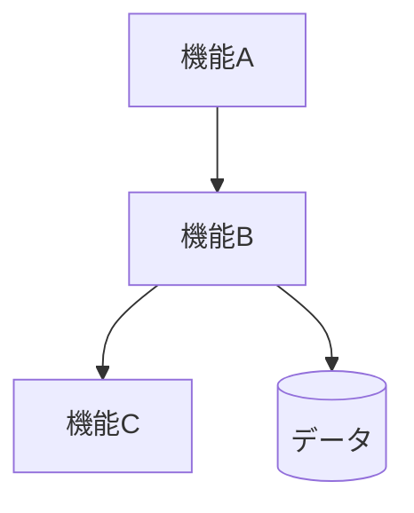

# 基本設計書

| 項目 | 内容 |
|------|------|
| プロジェクト名 | （記入） |
| システム名 | （記入） |
| 作成日 | （記入） |
| 作成者 | （記入） |
| バージョン | 1.0 |
| 関連文書 | 要件定義書：（記入） |

---

## 1. システム概要書

### 1-1. システム全体像

システム概念図、システム関連図、システムが提供する機能の概要を記載します。
ソリューション詳細（システムを実現するソリューション選定内容、パッケージ、SaaS/ASP利用など）も含めます。

#### システム概要

#### システム構成図

#### 構成要素一覧

#### ソリューション方針

---

### 1-2. アプリケーションマップ

To-Beのシステムおよび構成するアプリケーションのマップを記載します。

#### アプリケーションマップ

（記入）

#### アプリケーション一覧

| No. | アプリケーション名 | 区分 | 主な役割 | 利用者・利用部門 | 備考 |
|-----|--------------------|------|----------|------------------|------|
| （記入） | （記入） | （記入） | （記入） | （記入） | （記入） |

#### アプリケーション間関係

| 連携元 | 連携先 | 連携概要 | 主なデータ | 連携方式 |
|--------|--------|----------|------------|----------|
| （記入） | （記入） | （記入） | （記入） | （記入） |

---

### 1-3. アプリケーション機能一覧

各アプリケーションの機能一覧を記載します。

| アプリケーション名 | 機能ID | 機能名 | 機能概要 | 利用者 | 優先度 | 備考 |
|--------------------|--------|--------|----------|--------|--------|------|
| （記入） | （記入） | （記入） | （記入） | （記入） | （高／中／低） | （記入） |

---

## 2. アプリケーション詳細

アプリケーションの詳細を記載します。
アプリケーション単位に記載し、基本設計の詳細な内容（仕様）を必要に応じて分冊化します。

### 2-1. 機能関連図

アプリケーションを構成する各機能の関連図を記載します。
DFDなどを用いて、機能間の流れやデータの受け渡しを明確にします。

#### 対象アプリケーション

（記入）

#### 機能関連図

（図、Mermaid、画像貼付などを記入）

#### 補足説明

| 項目 | 内容 |
|------|------|
| 機能間連携の要点 | （記入） |
| 前提条件 | （記入） |
| 制約事項 | （記入） |

---

### 2-2. 各機能仕様

アプリケーションの各機能単位に仕様を定義します。

以下の単位で必要な項目を記載します。不要な節は削除または「対象外」と明記してください。

---

#### 2-2-x. 機能名：（記入）

##### 2-2-x-1. 機能概要

各機能の概要を記載します。

| 項目 | 内容 |
|------|------|
| 機能ID | （記入） |
| 機能名 | （記入） |
| 機能概要 | （記入） |
| 利用者 | （記入） |
| 起動契機 | （記入） |
| 入力 | （記入） |
| 出力 | （記入） |
| 関連機能 | （記入） |
| 前提条件 | （記入） |
| 事後条件 | （記入） |
| 備考 | （記入） |

##### 2-2-x-2. 画面仕様

画面一覧、画面遷移、画面遷移・レイアウト共通ルール、画面レイアウト、画面入出力項目一覧、画面アクション詳細を記載します。
必要に応じて、画面初期値、バリデーション仕様も定義します。

###### 画面一覧

| 画面ID | 画面名 | 目的 | 利用者 | 備考 |
|--------|--------|------|--------|------|
| （記入） | （記入） | （記入） | （記入） | （記入） |

###### 画面遷移

（画面遷移図を記入）

###### 画面共通ルール

| 項目 | 内容 |
|------|------|
| 共通レイアウト | （記入） |
| 操作ルール | （記入） |
| 権限制御 | （記入） |
| エラー表示方針 | （記入） |

###### 画面レイアウト

（ワイヤーフレーム、スクリーンショット、レイアウト説明を記入）

###### 画面入出力項目一覧

| 項目ID | 項目名 | 区分（入力/表示） | 型 | 桁数 | 必須 | 初期値 | バリデーション | 備考 |
|--------|--------|-------------------|----|------|------|--------|----------------|------|
| （記入） | （記入） | （記入） | （記入） | （記入） | （記入） | （記入） | （記入） | （記入） |

###### 画面アクション詳細

| アクション名 | 契機 | 処理内容 | 正常時 | 異常時 |
|--------------|------|----------|--------|--------|
| （記入） | （記入） | （記入） | （記入） | （記入） |

##### 2-2-x-3. 帳票仕様

帳票一覧、帳票レイアウト、帳票出力項目一覧、帳票編集定義を記載します。

###### 帳票一覧

| 帳票ID | 帳票名 | 出力契機 | 出力形式 | 備考 |
|--------|--------|----------|----------|------|
| （記入） | （記入） | （記入） | （記入） | （記入） |

###### 帳票レイアウト

（記入）

###### 帳票出力項目一覧

| 項目名 | データソース | 編集内容 | 備考 |
|--------|--------------|----------|------|
| （記入） | （記入） | （記入） | （記入） |

##### 2-2-x-4. EUCファイル（Downloadable File）仕様

EUCファイル一覧、EUCファイルレイアウトを記載します。

###### EUCファイル一覧

| ファイルID | ファイル名 | 目的 | 形式 | 文字コード | 備考 |
|------------|------------|------|------|------------|------|
| （記入） | （記入） | （記入） | （記入） | （記入） | （記入） |

###### EUCファイルレイアウト

| 項目順 | 項目名 | 型 | 桁数 | 必須 | 説明 |
|--------|--------|----|------|------|------|
| （記入） | （記入） | （記入） | （記入） | （記入） | （記入） |

##### 2-2-x-5. 関連システムインタフェース仕様

関連システムインタフェース一覧、関連システム関連図および各インタフェースの項目、処理内容を記載します。

###### インタフェース一覧

| IF ID | 連携先システム | 方向 | 連携方式 | 概要 | 頻度 | 備考 |
|-------|----------------|------|----------|------|------|------|
| （記入） | （記入） | （送信/受信/双方向） | （記入） | （記入） | （記入） | （記入） |

###### 関連システム関連図

（記入）

###### インタフェース項目仕様

| 項目名 | 説明 | 型 | 桁数 | 必須 | 変換ルール | 備考 |
|--------|------|----|------|------|------------|------|
| （記入） | （記入） | （記入） | （記入） | （記入） | （記入） | （記入） |

###### 処理内容

| 項目 | 内容 |
|------|------|
| 起動契機 | （記入） |
| 処理タイミング | （記入） |
| リトライ方針 | （記入） |
| 異常時対応 | （記入） |

##### 2-2-x-6. 入出力処理仕様

オンライン、バッチ機能の入出力項目、データ処理内容を記載します。
IPO図などを必要に応じて記載してください。

###### 処理概要

| 項目 | 内容 |
|------|------|
| 処理名 | （記入） |
| 処理種別 | （オンライン/バッチ） |
| 処理概要 | （記入） |
| 実行契機 | （記入） |
| 実行タイミング | （記入） |

###### 入出力項目一覧

| 区分 | 項目名 | 説明 | 型 | 桁数 | 必須 | 備考 |
|------|--------|------|----|------|------|------|
| 入力 | （記入） | （記入） | （記入） | （記入） | （記入） | （記入） |
| 出力 | （記入） | （記入） | （記入） | （記入） | （記入） | （記入） |

###### データ処理内容

1. （記入）
2. （記入）
3. （記入）

###### IPO図

（記入）

---

### 2-3. データベース仕様

取り扱うデータ仕様、テーブル仕様書などを記載します。
ERD、CRUDなども必要に応じて記載します。

#### データ概要

| データ名 | 概要 | 保持期間 | 更新主体 | 備考 |
|----------|------|----------|----------|------|
| （記入） | （記入） | （記入） | （記入） | （記入） |

#### ERD

（ER図、Mermaid、画像貼付などを記入）

#### テーブル仕様

| テーブル名 | 論理名 | 概要 | 主キー | 備考 |
|------------|--------|------|--------|------|
| （記入） | （記入） | （記入） | （記入） | （記入） |

#### カラム仕様

| テーブル名 | カラム名 | 論理名 | 型 | 桁数 | PK | FK | NULL可 | 初期値 | 説明 |
|------------|----------|--------|----|------|----|----|--------|--------|------|
| （記入） | （記入） | （記入） | （記入） | （記入） | （記入） | （記入） | （記入） | （記入） | （記入） |

#### CRUD一覧

| 機能ID | 機能名 | テーブル名 | Create | Read | Update | Delete |
|--------|--------|------------|--------|------|--------|--------|
| （記入） | （記入） | （記入） | （○/×） | （○/×） | （○/×） | （○/×） |

---

### 2-4. メッセージ・コード仕様

メッセージ・コード一覧を記載します。

#### メッセージ一覧

| メッセージID | 区分 | メッセージ内容 | 表示条件 | 対応方針 | 備考 |
|--------------|------|----------------|----------|----------|------|
| （記入） | （情報/警告/エラー） | （記入） | （記入） | （記入） | （記入） |

#### コード一覧

| コード種別 | コード値 | コード名称 | 説明 | 備考 |
|------------|----------|------------|------|------|
| （記入） | （記入） | （記入） | （記入） | （記入） |

---

### 2-5. 機能/データ配置仕様

機能やデータをシステム構成上のどの位置に配置するかを設計します。

#### 配置方針

| 項目 | 内容 |
|------|------|
| 機能配置方針 | （記入） |
| データ配置方針 | （記入） |
| 配置上の制約 | （記入） |

#### 機能配置一覧

| 機能ID | 機能名 | 配置先 | 理由 | 備考 |
|--------|--------|--------|------|------|
| （記入） | （記入） | （記入） | （記入） | （記入） |

#### データ配置一覧

| データ名 | 配置先 | 保存形式 | バックアップ方針 | 備考 |
|----------|--------|----------|------------------|------|
| （記入） | （記入） | （記入） | （記入） | （記入） |

---

## 3. 付録

### 3-1. 用語集

| 用語 | 説明 |
|------|------|
| （記入） | （記入） |

---

### 3-2. 改版履歴

| バージョン | 日付 | 作成者 | 変更内容 |
|------------|------|--------|----------|
| 1.0 | （記入） | （記入） | 初版 |